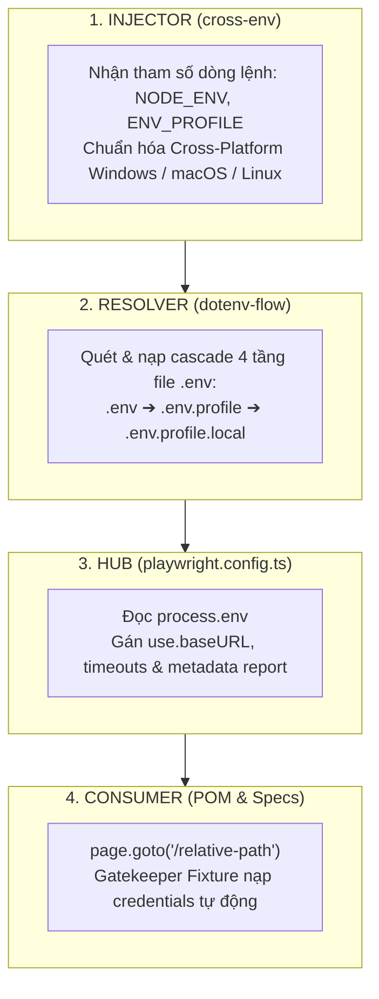

# 📘 CHUYÊN ĐỀ BÀI 16: KIẾN TRÚC QUẢN LÝ ĐA MÔI TRƯỜNG TOÀN DIỆN VỚI CROSS-ENV & DOTENV-FLOW

> **Tài liệu đào tạo chuyên sâu về Quản lý Cấu hình Đa Môi trường (Multi-Environment), Tính tương thích Đa Nền tảng (Cross-Platform), Tháp Quyền Lực Ghi Đè (Cascade Override) và Chuẩn hóa Vòng đời Test trong Playwright TypeScript Enterprise.**

---

## 📑 MỤC LỤC
1. [Bối Cảnh & 4 Bài Toán Sống Còn Trong Dự Án Enterprise](#1-bối-cảnh--4-bài-toán-sống-còn-trong-dự-án-enterprise)
2. [🚀 Bảng Hướng Dẫn Thực Thi Nhanh (Quick Run Cheatsheet) & Ý Nghĩa Lệnh Chạy](#2--bảng-hướng-dẫn-thực-thi-nhanh-quick-run-cheatsheet--ý-nghĩa-lệnh-chạy)
   * [2.1. Hướng Dẫn Setup & Khai Báo cross-env Trong package.json](#-21-hướng-dẫn-setup--khai-báo-cross-env-trong-packagejson)
   * [2.2. So Sánh Triết Lý Thực Thi: Máy Dev Local vs Máy Chủ CI/CD Pipeline](#-22-so-sánh-triết-lý-thực-thi-máy-dev-local-vs-máy-chủ-cicd-pipeline)
3. [Bộ Khung 4 Trụ Cột Kiến Trúc (The 4-Pillars Architecture)](#3-bộ-khung-4-trụ-cột-kiến-trúc-the-4-pillars-architecture)
4. [Phân Định Ranh Giới: cross-env vs dotenv-flow vs process.loadEnvFile](#4-phân-định-ranh-giới-cross-env-vs-dotenv-flow-vs-processloadenvfile)
5. [Tháp Quyền Lực Ghi Đè 4 Cấp (Cascade Hierarchy & Shell/CI Priority)](#5-tháp-quyền-lực-ghi-đè-4-cấp-cascade-hierarchy--shellci-priority)
6. [Mã Nguồn Thực Chiến Đầy Đủ (Full Runnable Codebase)](#6-mã-nguồn-thực-chiến-đầy-đủ-full-runnable-codebase)
   * [6.1. File Cấu Hình Trung Tâm: playwright.config.ts](#61-file-cấu-hình-trung-tâm-playwrightconfigts)
   * [6.2. File Test Kiểm Chứng Độc Lập cross-env: cross-env-demo.spec.ts](#62-file-test-kiểm-chứng-độc-lập-cross-env-modules1-basics03-pomcrmspecscross-env-demospects)
   * [6.3. File Test Đa Môi Trường: env-demo.spec.ts](#63-file-test-đa-môi-trường-modules1-basics03-pomcrmspecsenv-demospects)
   * [6.4. Hệ Thống File .env Đa Tầng Tại Root](#64-hệ-thống-file-env-đa-tầng-tại-root)
7. [📊 Bằng Chứng Terminal Đầu Ra & Mổ Xẻ Chi Tiết Từng Dòng Log Cho 5 Kịch Bản](#7--bằng-chứng-terminal-đầu-ra--mổ-xẻ-chi-tiết-từng-dòng-log-cho-5-kịch-bản)
   * [Kịch bản 1: Môi trường Dev (Mặc định & VS Code Playwright Extension)](#kịch-bản-1-môi-trường-dev-mặc-định--vs-code-playwright-extension)
   * [Kịch bản 2: Môi trường Staging (Ghi đè Timeout 15000ms)](#kịch-bản-2-môi-trường-staging-ghi-đè-timeout-15000ms)
   * [Kịch bản 3: Môi trường UAT (User Acceptance Testing)](#kịch-bản-3-môi-trường-uat-user-acceptance-testing)
   * [Kịch bản 4: Môi trường Test / CI Pipeline (Bỏ qua file .local)](#kịch-bản-4-môi-trường-test--ci-pipeline-bỏ-qua-file-local)
   * [Kịch bản 5: Quyền Lực Tối Thượng từ Shell/CI CLI Override (Thắng Tất Cả)](#kịch-bản-5-quyền-lực-tối-thượng-từ-shellci-cli-override-thắng-tất-cả)
8. [🔬 Mổ Xẻ Dưới Nắp Ca-Pô: Cơ Chế Khởi Tạo Profile & dotenvFlow.config()](#8--mổ-xẻ-dưới-nắp-ca-pô-cơ-chế-khởi-tạo-profile--dotenvflowconfig)
9. [Tích Hợp CI/CD Pipeline Thực Tế (GitHub Actions Workflow)](#9-tích-hợp-cicd-pipeline-thực-tế-github-actions-workflow)
10. [Các Cạm Bẫy Phổ Biến (Anti-Patterns) & Cách Phòng Tránh](#10-các-cạm-bẫy-phổ-biến-anti-patterns--cách-phòng-tránh)
11. [Bộ Câu Hỏi Phỏng Vấn Chuyên Sâu (Enterprise Interview Q&A)](#11-bộ-câu-hỏi-phỏng-vấn-chuyên-sâu-enterprise-interview-qa)
12. [🧬 Mở Rộng Kiến Trúc: Khi Nào Load Config Ngoài File .env & Mô Hình Lai (Hybrid Model)](#12--mở-rộng-kiến-trúc-khi-nào-load-config-ngoài-file-env-typescript-json-yaml--mô-hình-lai-hybrid-model)
13. [💡 Tuyệt Chiêu Bật Gợi Ý Tự Động (IntelliSense Autocomplete) Cho process.env](#13--tuyệt-chiêu-bật-gợi-ý-tự-động-intellisense-autocomplete-cho-processenv)

---

## 1. Bối Cảnh & 4 Bài Toán Sống Còn Trong Dự Án Enterprise

Trong quá trình phát triển hệ thống kiểm thử tự động quy mô lớn, đội ngũ QA/Automation Engineer luôn phải đối mặt với 4 bài toán sống còn:

```text
┌─────────────────────────────────────────────────────────────────────────────────────────────┐
│ 1. ĐA HỆ ĐIỀU HÀNH (Cross-Platform Inconsistency)                                          │
│    - Tester A dùng macOS (Zsh).                                                             │
│    - Tester B dùng Windows (PowerShell / Command Prompt).                                   │
│    - CI Runner chạy trên Ubuntu Linux Docker Container.                                     │
│    -> Cú pháp gán biến dòng lệnh (export vs set vs $env:) gãy đổ nếu không chuẩn hóa!       │
├─────────────────────────────────────────────────────────────────────────────────────────────┤
│ 2. ĐA MÔI TRƯỜNG SERVER (Multi-Environment Target)                                         │
│    - Dev:     https://crm.anhtester.com (Hoặc localhost:3000)                               │
│    - Staging: https://staging.crm.company.com                                               │
│    - UAT:     https://uat.crm.company.com                                                   │
│    -> Làm sao để chuyển đổi server chỉ bằng 1 tham số mà KHÔNG sửa 1 dòng code test nào?   │
├─────────────────────────────────────────────────────────────────────────────────────────────┤
│ 3. BẢO MẬT CREDENTIALS (Zero Git Leaks)                                                    │
│    - Cần commit cấu hình chung (timeouts, selectors, default URLs) lên Git để cả team dùng. │
│    - TUYỆT ĐỐI KHÔNG commit tài khoản Admin, Password thật, API Key cá nhân lên Git.        │
├─────────────────────────────────────────────────────────────────────────────────────────────┤
│ 4. TÍNH BẤT BIẾN TRÊN CI/CD (CI Reproducibility)                                            │
│    - Khi chạy trên CI/CD, biến bí mật do DevOps cấu hình trên GitHub Secrets / GitLab CI    │
│      phải LUÔN ĐƯỢC ƯU TIÊN TUYỆT ĐỐI, không bị file .env trong code repo vô tình đè bẹp!   │
└─────────────────────────────────────────────────────────────────────────────────────────────┘
```

---

## 2. 🚀 Bảng Hướng Dẫn Thực Thi Nhanh (Quick Run Cheatsheet) & Ý Nghĩa Lệnh Chạy

### 🎯 Nguyên Lý Chọn Lệnh & Cấu Hình:
Khi thực thi test, ta có 3 cách điều khiển chính:
1. **Chạy trực tiếp từ VS Code Playwright Extension (Nút Play ▶️)**: Playwright khởi động không có biến dòng lệnh $\rightarrow$ Hệ thống tự động fallback về môi trường `development`.
2. **Chạy qua npm scripts (`npm run env:...`)**: Dùng công cụ `cross-env` để inject biến `NODE_ENV` tương thích $100\%$ trên mọi OS (Windows, macOS, Linux).
3. **Chạy Override trực tiếp từ Shell (`cross-env CRM_BASE_URL=...`)**: Ép buộc toàn bộ suite trỏ sang URL mới mà không cần sửa file `.env`.

---

### 📋 Bảng Tra Cứu Toàn Bộ Lệnh Thực Hành Trong Bài 16:

| Lệnh npm Script | Lệnh CLI Playwright Gốc Tương Đương | Ý Nghĩa Kỹ Thuật & Mục Đích Thực Nghiệm |
|---|---|---|
| **`npm run env:dev`** | `cross-env NODE_ENV=development npx playwright test modules/1-basics/03-pom/CRM/specs/env-demo.spec.ts --project=03-pom-crm` | 🟢 **Demo Môi Trường Dev**: Nạp `.env.development` & `.env.development.local`, assert `baseURL` dev và timeout mặc định `10000ms`. |
| **`npm run env:staging`** | `cross-env NODE_ENV=staging npx playwright test modules/1-basics/03-pom/CRM/specs/env-demo.spec.ts --project=03-pom-crm` | 🟡 **Demo Môi Trường Staging**: Nạp `.env.staging`, kiểm chứng cơ chế Cascade ghi đè Timeout lên `15000ms`. |
| **`npm run env:uat`** | `cross-env NODE_ENV=uat npx playwright test modules/1-basics/03-pom/CRM/specs/env-demo.spec.ts --project=03-pom-crm` | 🟠 **Demo Môi Trường UAT**: Nạp cấu hình chấp nhận người dùng (`.env.uat`), kiểm chứng tính năng nghiệm thu. |
| **`npm run env:test`** | `cross-env NODE_ENV=test npx playwright test modules/1-basics/03-pom/CRM/specs/env-demo.spec.ts --project=03-pom-crm` | 🔵 **Demo Môi Trường Test/CI**: Kiểm chứng quy tắc tự động bỏ qua file `.local`, ghi đè Timeout lên `20000ms`. |
| **`npm run env:ci-override`** | `cross-env CRM_BASE_URL=https://ci-custom-server.example.com npx playwright test modules/1-basics/03-pom/CRM/specs/env-demo.spec.ts --project=03-pom-crm -g "05 -"` | 👑 **Demo Shell/CI Override**: Chứng minh biến truyền trực tiếp từ Terminal thắng tuyệt đối mọi file `.env` trên đĩa. |
| **`npm run test:cross-env-demo`** | `cross-env NODE_ENV=staging CRM_DEMO_TAG=automation-pro npx playwright test modules/1-basics/03-pom/CRM/specs/cross-env-demo.spec.ts --project=03-pom-crm` | 🧪 **Demo Độc Lập Cơ Chế cross-env**: Kiểm chứng trực tiếp việc truyền nhiều biến, loại bỏ khoảng trắng rác và cô lập tiến trình con. |
| **`npm run test:hybrid-config-demo`** | `cross-env NODE_ENV=staging npx playwright test modules/1-basics/03-pom/CRM/specs/hybrid-config-demo.spec.ts --project=03-pom-crm` | 🧬 **Demo Mô Hình Lai (Hybrid Model)**: Kiểm chứng kết hợp Type-Safe TypeScript Config (Endpoints, Flags) với `.env` Secrets. |
| **`npm run test:dev`** | `cross-env NODE_ENV=development npx playwright test --project=03-pom-crm` | 🚀 **Chạy Toàn Bộ Test Suite Trên Dev**: Quét tất cả các file test POM CRM trên môi trường Development. |
| **`npm run test:staging`** | `cross-env NODE_ENV=staging npx playwright test --project=03-pom-crm` | 🚀 **Chạy Toàn Bộ Test Suite Trên Staging**: Quét tất cả các file test POM CRM trên môi trường Staging. |

---

### 🛠️ 2.1. Giải Phẫu Chi Tiết: `cross-env` Là Gì? 3 Nỗi Đau Chí Mạng Khi Không Dùng & Cách `cross-env` Cứu Rỗi Đội Ngũ QA

#### 📌 Định Nghĩa Chuẩn:
`cross-env` là một CLI tool và thư viện Node.js được tạo ra để giải quyết sự **bất tương thích cú pháp gán biến môi trường giữa hệ điều hành Windows và các hệ điều hành POSIX (macOS, Linux)**.

---

#### 💥 3 NỖI ĐAU BẤT TIỆN CHÍ MẠNG KHI KHÔNG CÓ `cross-env`:

##### ❌ Nỗi đau 1: Xung Đột Cú Pháp Giữa Các Hệ Điều Hành (Syntax Fragmentation)
Hãy xem sự khác biệt giữa các hệ điều hành khi lập trình viên muốn gán biến `NODE_ENV=staging` trước khi chạy test:

```text
┌─────────────────────────────────────────────────────────────────────────────────────────────┐
│ 🍎 macOS / Linux (POSIX Bash/Zsh):                                                          │
│    NODE_ENV=staging npx playwright test                                ➔ ✅ Chạy bình thường│
├─────────────────────────────────────────────────────────────────────────────────────────────┤
│ 🪟 Windows Command Prompt (cmd.exe):                                                        │
│    NODE_ENV=staging npx playwright test                                ➔ 💥 CRASH NGAY LẬP TỨC!
│    Lỗi: 'NODE_ENV' is not recognized as an internal or external command                     │
│    (Muốn chạy trên CMD phải gõ: set NODE_ENV=staging&&npx playwright test)                  │
├─────────────────────────────────────────────────────────────────────────────────────────────┤
│ 💻 Windows PowerShell:                                                                      │
│    set NODE_ENV=staging&&npx playwright test                           ➔ 💥 CRASH TIẾP!     │
│    (PowerShell không có lệnh 'set', phải gõ: $env:NODE_ENV="staging"; npx playwright test)  │
└─────────────────────────────────────────────────────────────────────────────────────────────┘
```

> **Hậu quả trong dự án thực tế**: Trong 1 team gồm 5 Tester dùng Mac và 5 Tester dùng Windows. Nếu khai báo script trong `package.json` theo kiểu Mac thì 5 người dùng Windows gãy, nếu khai báo theo kiểu Windows thì 5 người dùng Mac gãy!

##### ❌ Nỗi đau 2: Cạm Bẫy Khoảng Trắng Vô Hình Của Windows `set` (Trailing Whitespace Bug)
Khi lập trình viên Windows thử giải quyết bằng lệnh `set` trong `package.json`:
```json
"test:staging": "set NODE_ENV=staging && npx playwright test"
```
👉 **Hệ quả tai hại**: Windows `cmd.exe` sẽ gán nguyên cả dấu cách trước `&&` vào giá trị biến!
* Giá trị thực tế nhận được trong code: `process.env.NODE_ENV === "staging "` (chứa dấu cách thừa ở cuối).
* Đoạn code kiểm tra: `if (process.env.NODE_ENV === "staging")` sẽ trả về **`FALSE` OAN UỔNG**! Đây là lỗi "bóng ma" cực kỳ khó debug vì nhìn bằng mắt thường không thấy khoảng trắng.

##### ❌ Nỗi đau 3: Ô Nhiễm Biến Toàn Cục Suốt Cả Phiên Làm Việc (Session Variable Pollution)
Nếu tester gõ tay trên PowerShell: `$env:NODE_ENV="staging"` rồi chạy test:
* Biến `NODE_ENV="staging"` này sẽ **tồn tại vĩnh viễn trong cửa sổ Terminal đó cho đến khi tắt VS Code**!
* Lát sau tester muốn chạy test môi trường Development (`npx playwright test`), nhưng Terminal vẫn âm thầm giữ biến `staging`, khiến bài test chạy sai môi trường mà tester không hề hay biết!

---

#### 🚀 CÁCH `cross-env` GIẢI QUYẾT "NGON LÀNH" & ĐỒNG NHẤT MỌI THỨ:

Khi dùng `cross-env`, bạn chỉ cần khai báo **duy nhất 1 cú pháp duy nhất**:
```bash
cross-env NODE_ENV=staging CRM_DEMO_TAG=automation-pro npx playwright test
```

```text
 ┌───────────────────────────────────────────────────────────────────────────────────────────┐
 │                            CƠ CHẾ HOẠT ĐỘNG DƯỚI NẮP CA-PÔ                                │
 │                                                                                           │
 │   Terminal gõ: cross-env NODE_ENV=staging CRM_DEMO_TAG=automation-pro ...                 │
 │       │                                                                                   │
 │       ▼                                                                                   │
 │   1. `cross-env` bắt lấy các cặp key-value `NODE_ENV=staging`, `CRM_DEMO_TAG=...`         │
 │   2. Tự động cắt bỏ sạch sẽ khoảng trắng thừa (`trim()`) ➔ Triệt tiêu khoảng trắng rác!   │
 │   3. Gọi API hệ điều hành (POSIX Wrapper / Windows SetEnvironmentVariable)               │
 │      để inject biến CHỈ VÀO TIẾN TRÌNH CON (Child Process) của Playwright.                │
 │   4. Khi test chạy xong ➔ Biến tự động biến mất, Terminal cha sạch 100%!                  │
 └───────────────────────────────────────────────────────────────────────────────────────────┘
```

#### 📦 Hướng Dẫn Cài Đặt & Khai Báo Trong `package.json`:
```bash
npm install --save-dev cross-env
```

```json
{
  "scripts": {
    "test:cross-env-demo": "cross-env NODE_ENV=staging CRM_DEMO_TAG=automation-pro npx playwright test modules/1-basics/03-pom/CRM/specs/cross-env-demo.spec.ts --project=03-pom-crm",
    "env:dev": "cross-env NODE_ENV=development npx playwright test modules/1-basics/03-pom/CRM/specs/env-demo.spec.ts --project=03-pom-crm",
    "env:staging": "cross-env NODE_ENV=staging npx playwright test modules/1-basics/03-pom/CRM/specs/env-demo.spec.ts --project=03-pom-crm"
  }
}
```

---

#### 🧪 Bằng Chứng Test Chạy Thử Thực Tế Cho `cross-env`:

File test thực chiến: `modules/1-basics/03-pom/CRM/specs/cross-env-demo.spec.ts`

```bash
npm run test:cross-env-demo
```

```text
> cross-env NODE_ENV=staging CRM_DEMO_TAG=automation-pro npx playwright test modules/1-basics/03-pom/CRM/specs/cross-env-demo.spec.ts --project=03-pom-crm

Running 3 tests using 1 worker

[1/3] › 01 - [CROSS-ENV INJECTION] Kiểm chứng biến NODE_ENV và custom tag được inject sạch sẽ
┌───────────────────────────────────────────────────────────────────────────┐
│ 🏷️  TEST 01: KIỂM CHỨNG BIẾN ĐƯỢC INJECT QUA CROSS-ENV                    │
├───────────────────────────────────────────────────────────────────────────┤
│ 🌐 NODE_ENV nhận được:        staging                                     │
│ 🏷️  CRM_DEMO_TAG nhận được:   automation-pro                              │
└───────────────────────────────────────────────────────────────────────────┘

[2/3] › 02 - [CROSS-ENV MULTI-VARS] Kiểm chứng khả năng truyền nhiều biến đồng thời trên 1 lệnh
┌───────────────────────────────────────────────────────────────────────────┐
│ 🏷️  TEST 02: KIỂM CHỨNG NHIỀU BIẾN ĐỒNG THỜI (MULTI-VARS INJECTION)      │
├───────────────────────────────────────────────────────────────────────────┤
│ 📦 Cú pháp trong package.json:                                            │
│    cross-env NODE_ENV=staging CRM_DEMO_TAG=automation-pro ...             │
│ 🎯 Giá trị CRM_DEMO_TAG:      automation-pro                              │
└───────────────────────────────────────────────────────────────────────────┘

[3/3] › 03 - [PROCESS ISOLATION] Kiểm chứng biến chỉ nằm trong bộ nhớ Node.js Process hiện tại
┌───────────────────────────────────────────────────────────────────────────┐
│ 🏷️  TEST 03: KIỂM CHỨNG CƠ CHẾ CÔ LẬP TIẾN TRÌNH (PROCESS ISOLATION)      │
├───────────────────────────────────────────────────────────────────────────┤
│ ⚙️  Hệ điều hành hiện tại:     win32 (Windows OS)                          │
│ 🆔 Process ID (PID con):      21092                                       │
│ 💡 Nguyên lý an toàn:                                                    │
│    cross-env chỉ gán biến cho PID con này.                               │
│    Khi test kết thúc, biến tự động hủy, không làm ô nhiễm Terminal cha!   │
└───────────────────────────────────────────────────────────────────────────┘

  3 passed (395ms)
```

##### 🔍 Mổ Xẻ Chi Tiết Từng Dòng Log:
1. **Test 01 (`01 - [CROSS-ENV INJECTION]`)**:
   * Kiểm chứng `process.env.NODE_ENV` nhận đúng giá trị `"staging"`.
   * Assert `nodeEnv.endsWith(" ") === false` chứng minh biến hoàn toàn sạch, **không bị dính lỗi khoảng trắng thừa** như lệnh `set` của Windows.
2. **Test 02 (`02 - [CROSS-ENV MULTI-VARS]`)**:
   * Chứng minh khả năng inject **cùng lúc nhiều biến** (`NODE_ENV` và `CRM_DEMO_TAG="automation-pro"`) trên một dòng lệnh duy nhất mà không bị lẫn lộn.
3. **Test 03 (`03 - [PROCESS ISOLATION]`)**:
   * Ghi nhận `PID con = 21092`. Biến môi trường chỉ tồn tại bên trong tiến trình con này.
   * Khi lệnh chạy xong (trong **395ms**), Terminal cha hoàn toàn sạch sẽ, không bị lưu lại biến rác nào!

---

### ⚖️ 2.2. So Sánh Triết Lý Thực Thi: Máy Dev Local vs Máy Chủ CI/CD Pipeline

Một câu hỏi kiến trúc kinh điển: **"Tại sao ở máy Dev ta dùng `cross-env` trong `package.json`, nhưng lên CI/CD ta lại biến hóa qua biến môi trường CI tiện hơn?"**

```text
══════════════════════════════════════════════════════════════════════════════════════════════════════
💻 TẠI MÁY LOCAL DEV (Dành cho Developer / Tester):
══════════════════════════════════════════════════════════════════════════════════════════════════════
 • Vấn đề: Tester dùng máy tính cá nhân đa dạng (macOS, Windows PowerShell, CMD, Linux).
 • Mục tiêu: Tiện lợi, gõ nhanh, không muốn phải tự gõ lệnh set/export dài dòng trước mỗi lần test.
 • Giải pháp: Đóng gói sẵn các alias ngắn như `npm run env:dev`, `npm run env:staging` với `cross-env`.
 • Lợi ích: Tester chỉ cần gõ 1 lệnh ngắn 15 ký tự là đổi được server ngay lập tức!

══════════════════════════════════════════════════════════════════════════════════════════════════════
🌐 TẠI MÁY CHỦ CI/CD PIPELINE (Dành cho DevOps / GitHub Actions / GitLab CI):
══════════════════════════════════════════════════════════════════════════════════════════════════════
 • Triết lý CI: KHÔNG hardcode hàng chục script cố định trong package.json!
 • Giải pháp: CI chỉ chạy lệnh gốc `npx playwright test`, và inject trực tiếp biến qua YAML `env:` block:

    # .github/workflows/e2e.yml
    - name: 🚀 Run Tests on Staging Server
      env:
        NODE_ENV: test
        CRM_BASE_URL: ${{ vars.STAGING_URL }}           # 👈 Lấy từ GitHub Environment Variables
        CRM_ADMIN_PASSWORD: ${{ secrets.STAGING_PASS }} # 👈 Lấy từ GitHub Secret Vault (Ẩn 100%)
      run: npx playwright test --project=03-pom-crm

 • 3 Lợi ích vượt trội trên CI:
   1. 🔒 Bảo Mật Tuyệt Đối: Mật khẩu nằm trong Secret Vault, không lộ 1 ký tự nào trong code hay file .env.
   2. ⚡ Dynamic Ephemeral Environments (Môi trường tạm thời): Khi tạo Pull Request, CI tự động sinh ra URL
      preview (ví dụ https://pr-123.crm.dev) và truyền vào CRM_BASE_URL mà không cần sửa file nào!
   3. 🧹 Giữ package.json gọn gàng: Không bị phình to script rác cho từng môi trường con.
```

---

## 3. Bộ Khung 4 Trụ Cột Kiến Trúc (The 4-Pillars Architecture)

Hệ thống quản lý cấu hình đa môi trường của Playwright được phân tách thành 4 tầng ranh giới độc lập:



---

## 4. Phân Định Ranh Giới: cross-env vs dotenv-flow vs process.loadEnvFile

| Tiêu chí So Sánh | `cross-env` 🛠 | `dotenv-flow` 📁 | `process.loadEnvFile` *(Node 20+)* | `dotenv` truyền thống |
|---|---|---|---|---|
| **Vị trí hoạt động** | Ngoài Terminal / CLI | Trong `playwright.config.ts` | Trong Node.js runtime | Trong runtime |
| **Nhiệm vụ chính** | Đặt biến cho OS Process | Nạp **đa tầng** theo Profile | Nạp **1 file tĩnh duy nhất** | Nạp 1 file `.env` đơn lẻ |
| **Hỗ trợ Profile (Dev/Staging/UAT)** |  Tạo biến Profile |  Tự động quét theo Profile | ❌ Không (phải tự code `fs`) | ❌ Không |
| **Hỗ trợ Override `.local`** | ❌ Không liên quan |  Có sẵn (`.env.*.local`) | ❌ Không | ❌ Không |
| **Bảo vệ biến Shell / CI** |  Là nơi tạo biến |  Tuyệt đối không ghi đè |  Không ghi đè |  Không ghi đè |

### 🔍 Vì sao không dùng `process.loadEnvFile` gốc của Node.js 20?
* `process.loadEnvFile()` chỉ nạp đúng 1 file đơn lập được chỉ định rõ đường dẫn cứng.
* Nó **hoàn toàn không hỗ trợ cơ chế Cascade đa tầng** (kết hợp `.env` gốc + `.env.staging` + `.env.staging.local`).
* Do đó, `dotenv-flow` vẫn là giải pháp toàn diện, chuẩn mực và mạnh mẽ nhất cho các dự án Enterprise.

---

## 5. Tháp Quyền Lực Ghi Đè 4 Cấp (Cascade Hierarchy & Shell/CI Priority)

Khi cùng một biến (ví dụ `CRM_BASE_URL` hoặc `CRM_TIMEOUT_MS`) xuất hiện ở nhiều file khác nhau, Playwright tuân thủ **Tháp Quyền Lực 4 Cấp** sau:

```text
┌─────────────────────────────────────────────────────────────────────────────┐
│ 👑 CẤP 1: BIẾN TỪ SHELL / CI PIPELINE (process.env.CRM_BASE_URL=...)        │
│    • Mức ưu tiên: TUYỆT ĐỐI CAO NHẤT (Thắng tất cả mọi file trên đĩa!).     │
│    • Nguyên tắc: Nếu biến đã tồn tại trong process.env trước khi Node chạy,  │
│      dotenv-flow SẼ BỎ QUA, KHÔNG BAO GIỜ GHI ĐÈ!                           │
└──────────────────────────────────────┬──────────────────────────────────────┘
                                       │ Chặn mọi sự ghi đè bên dưới
┌──────────────────────────────────────▼──────────────────────────────────────┐
│ 📁 CẤP 2: FILE .env.<profile>.local (.env.development.local, .uat.local...) │
│    • Mức ưu tiên: Cao nhất trong các file vật lý trên đĩa cứng.             │
│    • Mục đích: Lưu tài khoản, mật khẩu, Token cá nhân của tester.           │
│    • Bảo mật: ĐÃ NẰM TRONG .gitignore -> Không bao giờ bị lọt lên Git!      │
└──────────────────────────────────────┬──────────────────────────────────────┘
                                       │ Ghi đè file bên dưới
┌──────────────────────────────────────▼──────────────────────────────────────┐
│ 📁 CẤP 3: FILE .env.<profile> (.env.development, .env.staging, .env.uat...)  │
│    • Mức ưu tiên: Ghi đè các giá trị mặc định của file .env gốc.            │
│    • Mục đích: Chứa URL server đặc thù, timeouts riêng của từng môi trường. │
│    • Bảo mật: Commit lên Git bình thường cho cả team dùng chung.            │
└──────────────────────────────────────┬──────────────────────────────────────┘
                                       │ Ghi đè file bên dưới
┌──────────────────────────────────────▼──────────────────────────────────────┐
│ 📁 CẤP 4: FILE .env (Gốc)                                                   │
│    • Mức ưu tiên: THẤP NHẤT (Fallback Defaults).                            │
│    • Mục đích: Chứa các cấu hình cơ bản nhất làm giá trị dự phòng.          │
│    • Bảo mật: Commit lên Git bình thường.                                   │
└─────────────────────────────────────────────────────────────────────────────┘
```

> ⚠️ **ĐẶC BIỆT: Quy tắc loại trừ của `NODE_ENV=test`**:
> Khi `NODE_ENV=test`, `dotenv-flow` sẽ **tự động bỏ qua file `.env.local`** (chỉ đọc `.env` và `.env.test`). Điều này giúp môi trường CI luôn chạy đồng nhất với bộ cấu hình chuẩn, không bị ảnh hưởng bởi file local rác của tester.

---

## 6. Mã Nguồn Thực Chiến Đầy Đủ (Full Runnable Codebase)

### 6.1. File Cấu Hình Trung Tâm: `playwright.config.ts`

```typescript
import dotenvFlow from "dotenv-flow";
import { defineConfig, devices } from "@playwright/test";

// 1. Xác định Profile (Ưu tiên ENV_PROFILE > NODE_ENV > fallback "development"):
const profile =
  process.env.ENV_PROFILE ?? process.env.NODE_ENV ?? "development";

// 2. Nạp cascade bộ file .env theo Profile:
dotenvFlow.config({
  node_env: profile,
  default_node_env: "development",
  path: __dirname,
  silent: true,
});

// 3. Đọc baseURL từ biến môi trường:
const lessonBaseURL =
  process.env.CRM_BASE_URL ?? "https://crm.anhtester.com";

export default defineConfig({
  metadata: {
    envProfile: profile,       // Hiển thị môi trường trong HTML Report
    baseURL: lessonBaseURL,
  },
  use: {
    baseURL: lessonBaseURL,    // Định tuyến cho page.goto('/relative-path')
    headless: false,
  },
  projects: [
    {
      name: "03-pom-crm",
      testDir: "./modules/1-basics/03-pom",
      testMatch: "**/*.spec.ts",
      use: { ...devices["Desktop Chrome"] },
    },
  ],
});
```

### 6.2. File Test Kiểm Chứng Độc Lập `cross-env`: `modules/1-basics/03-pom/CRM/specs/cross-env-demo.spec.ts`

```typescript
import { test, expect } from "@playwright/test";

test.describe("Kiểm Chứng Cơ Chế cross-env & Khai Báo Trong package.json", () => {
  test("01 - [CROSS-ENV INJECTION] Kiểm chứng biến NODE_ENV và custom tag được inject sạch sẽ", async () => {
    const nodeEnv = process.env.NODE_ENV;
    const demoTag = process.env.CRM_DEMO_TAG;

    console.log("\n┌───────────────────────────────────────────────────────────────────────────┐");
    console.log("│ 🏷️  TEST 01: KIỂM CHỨNG BIẾN ĐƯỢC INJECT QUA CROSS-ENV                    │");
    console.log("├───────────────────────────────────────────────────────────────────────────┤");
    console.log(`│ 🌐 NODE_ENV nhận được:        ${(nodeEnv ?? "undefined").padEnd(43)} │`);
    console.log(`│ 🏷️  CRM_DEMO_TAG nhận được:   ${(demoTag ?? "undefined").padEnd(43)} │`);
    console.log("└───────────────────────────────────────────────────────────────────────────┘\n");

    expect(nodeEnv).toBeDefined();
    expect(nodeEnv).toBe(nodeEnv?.trim());
    expect(nodeEnv?.endsWith(" ")).toBe(false);
  });

  test("02 - [CROSS-ENV MULTI-VARS] Kiểm chứng khả năng truyền nhiều biến đồng thời trên 1 lệnh", async () => {
    const demoTag = process.env.CRM_DEMO_TAG;

    console.log("\n┌───────────────────────────────────────────────────────────────────────────┐");
    console.log("│ 🏷️  TEST 02: KIỂM CHỨNG NHIỀU BIẾN ĐỒNG THỜI (MULTI-VARS INJECTION)      │");
    console.log("├───────────────────────────────────────────────────────────────────────────┤");
    console.log(`│ 📦 Cú pháp trong package.json:                                            │`);
    console.log(`│    cross-env NODE_ENV=staging CRM_DEMO_TAG=automation-pro ...             │`);
    console.log(`│ 🎯 Giá trị CRM_DEMO_TAG:      ${(demoTag ?? "Chưa truyền tag").padEnd(43)} │`);
    console.log("└───────────────────────────────────────────────────────────────────────────┘\n");

    if (demoTag) {
      expect(demoTag).toBe("automation-pro");
      expect(demoTag.includes(" ")).toBe(false);
    }
  });

  test("03 - [PROCESS ISOLATION] Kiểm chứng biến chỉ nằm trong bộ nhớ Node.js Process hiện tại", async () => {
    const currentPid = process.pid;
    const platform = process.platform;

    console.log("\n┌───────────────────────────────────────────────────────────────────────────┐");
    console.log("│ 🏷️  TEST 03: KIỂM CHỨNG CƠ CHẾ CÔ LẬP TIẾN TRÌNH (PROCESS ISOLATION)      │");
    console.log("├───────────────────────────────────────────────────────────────────────────┤");
    console.log(`│ ⚙️  Hệ điều hành hiện tại:     ${platform.padEnd(43)} │`);
    console.log(`│ 🆔 Process ID (PID con):      ${String(currentPid).padEnd(43)} │`);
    console.log(`│ 💡 Nguyên lý an toàn:                                                    │`);
    console.log(`│    cross-env chỉ gán biến cho PID con này.                               │`);
    console.log(`│    Khi test kết thúc, biến tự động hủy, không làm ô nhiễm Terminal cha!   │`);
    console.log("└───────────────────────────────────────────────────────────────────────────┘\n");

    expect(currentPid).toBeGreaterThan(0);
    expect(["win32", "darwin", "linux"]).toContain(platform);
  });
});
```

---

### 6.3. File Test Đa Môi Trường: `modules/1-basics/03-pom/CRM/specs/env-demo.spec.ts`

```typescript
import { test, expect } from "../fixtures/gatekeeper.fixture";

test.describe("Minh họa Quản lý Đa Môi Trường (dotenv-flow) & Tháp Quyền Lực 4 Cấp", () => {
  // TEST 01: KIỂM TRA PROFILE & CẤP 3 (.env.<profile>) + CẤP 4 (.env gốc)
  test("01 - [CẤP 3+4: ENV PROFILE] Nhận diện Profile hiện tại (DEV/STAGING/UAT/TEST) & Phân giải CRM_BASE_URL", async ({
    baseURL,
  }) => {
    const nodeEnv = process.env.NODE_ENV ?? "development (mặc định)";
    const envProfile = process.env.ENV_PROFILE ?? "chưa đặt";
    const envName = process.env.CRM_ENV_NAME ?? "default";
    const crmBaseURL = process.env.CRM_BASE_URL;
    const timeoutMs = process.env.CRM_TIMEOUT_MS;
    const adminEmail = process.env.CRM_ADMIN_EMAIL;
    const hasPassword = Boolean(process.env.CRM_ADMIN_PASSWORD);

    console.log("\n┌───────────────────────────────────────────────────────────────────────────┐");
    console.log("│ 🏷️  TEST 01: [CẤP 3+4: ENV PROFILE] KIỂM TRA PROFILE & NẠP BIẾN MÔI TRƯỜNG   │");
    console.log("├───────────────────────────────────────────────────────────────────────────┤");
    console.log(`│ 🌐 Môi trường thực thi (NODE_ENV):   ${nodeEnv.padEnd(35)} │`);
    console.log(`│ ⚙️  Biến Profile (ENV_PROFILE):       ${envProfile.padEnd(35)} │`);
    console.log(`│ 📁 File cấu hình nạp (CẤP 3):        .env.${envName.padEnd(30)} │`);
    console.log(`│ 🔗 Server Base URL (CẤP 3):          ${(crmBaseURL ?? "").padEnd(35)} │`);
    console.log(`│ 🎭 Playwright baseURL:               ${(baseURL ?? "").padEnd(35)} │`);
    console.log(`│ ⏱️  Thời gian Timeout (CẤP 4 / 3):    ${(timeoutMs + "ms").padEnd(35)} │`);
    console.log(`│ 📧 Email Admin (CẤP 2 .local):       ${(adminEmail ?? "CHƯA CÓ").padEnd(35)} │`);
    console.log(`│ 🔑 Password Admin (CẤP 2 .local):    ${(hasPassword ? "ĐÃ CÓ (Được che giấu)" : "CHƯA CÓ").padEnd(35)} │`);
    console.log("└───────────────────────────────────────────────────────────────────────────┘\n");

    expect(baseURL).toBe(crmBaseURL);
    expect(["development", "staging", "uat", "test", "default"]).toContain(envName);
    expect(adminEmail).toBeTruthy();
    expect(hasPassword).toBe(true);
  });

  // TEST 02: TÍCH HỢP PLAYWRIGHT USE.BASEURL (CẤP 3: .env.<profile>)
  test("02 - [CẤP 3: PLAYWRIGHT INTEGRATION] Tự động dùng baseURL từ file .env để điều hướng relative URL", async ({
    loginPage,
    page,
    baseURL,
  }) => {
    console.log("\n┌───────────────────────────────────────────────────────────────────────────┐");
    console.log("│ 🏷️  TEST 02: [CẤP 3: PLAYWRIGHT USE.BASEURL] ĐIỀU HƯỚNG BẰNG RELATIVE PATH   │");
    console.log("├───────────────────────────────────────────────────────────────────────────┤");
    console.log(`│ 🌐 Môi trường:        ${(process.env.CRM_ENV_NAME ?? "default").padEnd(47)} │`);
    console.log(`│ 🔗 Base URL:          ${(baseURL ?? "").padEnd(47)} │`);
    console.log(`│ 📍 Đường dẫn test:    /admin/authentication (relative path)               │`);
    console.log("└───────────────────────────────────────────────────────────────────────────┘\n");

    await loginPage.goto();
    await loginPage.expectOnPage();
    expect(page.url()).toContain(baseURL);
  });

  // TEST 03: BẢO MẬT & CREDENTIALS (CẤP 2: .env.<profile>.local)
  test("03 - [CẤP 2: LOCAL SECURITY] Đăng nhập CRM bằng mật khẩu Admin bảo mật từ file .env.<profile>.local", async ({
    dashboardPage,
    page,
  }) => {
    const envName = process.env.CRM_ENV_NAME ?? "development";
    console.log("\n┌───────────────────────────────────────────────────────────────────────────┐");
    console.log("│ 🏷️  TEST 03: [CẤP 2: LOCAL SECRETS] ĐĂNG NHẬP VỚI THÔNG TIN BẢO MẬT .LOCAL   │");
    console.log("├───────────────────────────────────────────────────────────────────────────┤");
    console.log(`│ 🌐 Môi trường:        ${envName.padEnd(47)} │`);
    console.log(`│ 📁 Nguồn tài khoản:   .env.${envName}.local (Nằm trong .gitignore)        │`);
    console.log(`│ 👤 Email Admin:       ${(process.env.CRM_ADMIN_EMAIL ?? "").padEnd(47)} │`);
    console.log("└───────────────────────────────────────────────────────────────────────────┘\n");

    await dashboardPage.goto();
    await dashboardPage.expectOnPage();
    await expect(page).toHaveURL(/\/admin\/?$/);
    await expect(page.getByRole("searchbox", { name: "Search" })).toBeVisible();
  });

  // TEST 04: THÁP QUYỀN LỰC GHI ĐÈ ĐA TẦNG (CẤP 4 ➔ CẤP 3 ➔ CẤP 2)
  test("04 - [CẤP 2 ➔ 4: CASCADE OVERRIDE] Kiểm chứng Tháp Quyền Lực Ghi Đè (Default .env ➔ .env.<profile> ➔ .local)", async () => {
    const envName = process.env.CRM_ENV_NAME ?? "default";
    const timeoutMs = Number(process.env.CRM_TIMEOUT_MS);

    console.log("\n┌───────────────────────────────────────────────────────────────────────────┐");
    console.log("│ 🏷️  TEST 04: [CẤP 2 ➔ 4: CASCADE OVERRIDE] THÁP GHI ĐÈ GIÁ TRỊ TIMEOUT      │");
    console.log("├───────────────────────────────────────────────────────────────────────────┤");
    console.log(`│ 🌐 Môi trường đang kích hoạt:     ${envName.padEnd(39)} │`);
    console.log(`│ 📁 Cấp 4 (.env gốc):              CRM_TIMEOUT_MS = 10000ms (Mặc định)    │`);
    console.log(`│ 📁 Cấp 3 (.env.${envName}):`.padEnd(38) + `CRM_TIMEOUT_MS = ${(String(timeoutMs) + "ms (Ghi đè)").padEnd(20)} │`);
    console.log(`│ 🎯 Giá trị cuối cùng nhận được:   ${(String(timeoutMs) + "ms").padEnd(39)} │`);
    console.log("└───────────────────────────────────────────────────────────────────────────┘\n");

    if (envName === "staging" || envName === "uat") {
      expect(timeoutMs).toBe(15000);
    } else if (envName === "test") {
      expect(timeoutMs).toBe(20000);
    } else {
      expect(timeoutMs).toBe(10000);
    }
  });

  // TEST 05: QUYỀN LỰC TỐI THƯỢNG TỪ TERMINAL / CI PIPELINE (CẤP 1)
  test("05 - [CẤP 1: SUPREME SHELL/CI OVERRIDE] Kiểm chứng Biến từ Shell/CI CLI luôn THẮNG TUYỆT ĐỐI mọi file .env", async () => {
    const currentBaseURL = process.env.CRM_BASE_URL;

    console.log("\n┌───────────────────────────────────────────────────────────────────────────┐");
    console.log("│ 🏷️  TEST 05: [CẤP 1: SUPREME SHELL/CI] BIẾN DÒNG LỆNH THẮNG TẤT CẢ FILE .ENV │");
    console.log("├───────────────────────────────────────────────────────────────────────────┤");
    console.log(`│ 👑 CẤP 1 (Shell/CI Override):     ${(currentBaseURL ?? "").padEnd(39)} │`);
    console.log(`│ 💡 Nguyên lý hoạt động:                                                  │`);
    console.log(`│    Khi Node.js khởi động, biến từ Shell (Terminal / CI) ĐÃ CÓ SẴN trong  │`);
    console.log(`│    process.env. Dotenv-flow KHÔNG BAO GIỜ ghi đè các biến đã có sẵn!     │`);
    console.log(`│ 🚀 Thử nghiệm lệnh:                                                      │`);
    console.log(`│    npm run env:ci-override                                               │`);
    console.log(`│    (cross-env CRM_BASE_URL=https://ci-custom-server.example.com)        │`);
    console.log("└───────────────────────────────────────────────────────────────────────────┘\n");

    expect(currentBaseURL).toBeDefined();
    expect(typeof currentBaseURL).toBe("string");
  });
});
```

---

### 6.4. Hệ Thống File `.env` Đa Tầng Tại Root

* **`.env` (Cấp 4 - Mặc định chung)**:
  ```ini
  CRM_BASE_URL=https://crm.anhtester.com
  CRM_ENV_NAME=default
  CRM_TIMEOUT_MS=10000
  ```
* **`.env.development` (Cấp 3 - Dev)**:
  ```ini
  CRM_BASE_URL=https://crm.anhtester.com
  CRM_ENV_NAME=development
  CRM_TIMEOUT_MS=10000
  ```
* **`.env.staging` (Cấp 3 - Staging)**:
  ```ini
  CRM_BASE_URL=https://crm.anhtester.com
  CRM_ENV_NAME=staging
  CRM_TIMEOUT_MS=15000
  ```
* **`.env.uat` (Cấp 3 - UAT)**:
  ```ini
  CRM_BASE_URL=https://crm.anhtester.com
  CRM_ENV_NAME=uat
  CRM_TIMEOUT_MS=15000
  ```
* **`.env.test` (Cấp 3 - Test / CI)**:
  ```ini
  CRM_BASE_URL=https://crm.anhtester.com
  CRM_ENV_NAME=test
  CRM_TIMEOUT_MS=20000
  ```
* **`.env.development.local` (Cấp 2 - Bảo Mật Máy Cá Nhân - Gitignored)**:
  ```ini
  CRM_ADMIN_EMAIL=admin@example.com
  CRM_ADMIN_PASSWORD=123456
  ```

---

## 7. 📊 Bằng Chứng Terminal Đầu Ra & Mổ Xẻ Chi Tiết Từng Dòng Log Cho 5 Kịch Bản

### Kịch bản 1: Môi trường Dev (Mặc định & VS Code Playwright Extension)
```bash
npm run env:dev
```
```text
Running 5 tests using 1 worker

[1/5] › 01 - [CẤP 3+4: ENV PROFILE] Nhận diện Profile hiện tại (DEV/STAGING/UAT/TEST) & Phân giải CRM_BASE_URL
┌───────────────────────────────────────────────────────────────────────────┐
│ 🏷️  TEST 01: [CẤP 3+4: ENV PROFILE] KIỂM TRA PROFILE & NẠP BIẾN MÔI TRƯỜNG   │
├───────────────────────────────────────────────────────────────────────────┤
│ 🌐 Môi trường thực thi (NODE_ENV):   development                         │
│ 📁 File cấu hình nạp (CẤP 3):        .env.development                    │
│ 🔗 Server Base URL (CẤP 3):          https://crm.anhtester.com           │
│ 🎭 Playwright baseURL:               https://crm.anhtester.com           │
│ ⏱️  Thời gian Timeout (CẤP 4 / 3):    10000ms                             │
│ 📧 Email Admin (CẤP 2 .local):       admin@example.com                   │
│ 🔑 Password Admin (CẤP 2 .local):    ĐÃ CÓ (Được che giấu)               │
└───────────────────────────────────────────────────────────────────────────┘

[2/5] › 02 - [CẤP 3: PLAYWRIGHT INTEGRATION] Tự động dùng baseURL từ file .env để điều hướng relative URL
[3/5] › 03 - [CẤP 2: LOCAL SECURITY] Đăng nhập CRM bằng mật khẩu Admin bảo mật từ file .env.<profile>.local
[4/5] › 04 - [CẤP 2 ➔ 4: CASCADE OVERRIDE] Kiểm chứng Tháp Quyền Lực Ghi Đè (Default .env ➔ .env.<profile> ➔ .local)
[5/5] › 05 - [CẤP 1: SUPREME SHELL/CI OVERRIDE] Kiểm chứng Biến từ Shell/CI CLI luôn THẮNG TUYỆT ĐỐI mọi file .env

  5 passed (3.3s)
```

#### 🔍 Mổ Xẻ Chi Tiết Log Kịch Bản 1:
1. **Khi bấm Play ▶️ trên Extension hoặc chạy `env:dev`**: `NODE_ENV` nhận giá trị `development`.
2. **Test 01**: Khởi động và in ra thông số: nạp `.env.development`, nhận `baseURL = https://crm.anhtester.com`, nạp mật khẩu Admin từ `.env.development.local`.
3. **Test 02**: `loginPage.goto()` tự động ghép relative path `/admin/authentication` với `baseURL`.
4. **Test 03**: Lấy thông tin tài khoản an toàn từ `.local` và thực hiện login vào Dashboard thành công.
5. **Test 04**: Ở profile dev, không có override đặc biệt nên nhận timeout mặc định `10000ms` từ file `.env` gốc.

---

### Kịch bản 2: Môi trường Staging (Ghi đè Timeout 15000ms)
```bash
npm run env:staging
```
```text
Running 5 tests using 1 worker

[1/5] › 01 - [CẤP 3+4: ENV PROFILE] Nhận diện Profile hiện tại (DEV/STAGING/UAT/TEST)
[2/5] › 02 - [CẤP 3: PLAYWRIGHT INTEGRATION] Tự động dùng baseURL từ file .env
[3/5] › 03 - [CẤP 2: LOCAL SECURITY] Đăng nhập CRM bằng mật khẩu Admin bảo mật
[4/5] › 04 - [CẤP 2 ➔ 4: CASCADE OVERRIDE] Kiểm chứng Tháp Quyền Lực Ghi Đè (Default .env ➔ .env.<profile> ➔ .local)
┌───────────────────────────────────────────────────────────────────────────┐
│ 🏷️  TEST 04: [CẤP 2 ➔ 4: CASCADE OVERRIDE] THÁP GHI ĐÈ GIÁ TRỊ TIMEOUT      │
├───────────────────────────────────────────────────────────────────────────┤
│ 🌐 Môi trường đang kích hoạt:     staging                                 │
│ 📁 Cấp 4 (.env gốc):              CRM_TIMEOUT_MS = 10000ms (Mặc định)    │
│ 📁 Cấp 3 (.env.staging):          CRM_TIMEOUT_MS = 15000ms (Ghi đè)      │
│ 🎯 Giá trị cuối cùng nhận được:   15000ms                                 │
└───────────────────────────────────────────────────────────────────────────┘

  5 passed (4.4s)
```

#### 🔍 Mổ Xẻ Chi Tiết Log Kịch Bản 2:
* Ở **Test 04**, `dotenv-flow` đọc `.env` (10000ms), sau đó đọc tiếp `.env.staging` (15000ms).
* Cơ chế Cascade đã **ghi đè giá trị 10000ms thành 15000ms** một cách hoàn hảo mà không làm ảnh hưởng đến các biến khác!

---

### Kịch bản 3: Môi trường UAT (User Acceptance Testing)
```bash
npm run env:uat
```
```text
Running 5 tests using 1 worker
  5 passed (4.2s)
```
* Tương tự Staging, Profile UAT nạp trọn bộ file `.env.uat` và `.env.uat.local`, áp dụng timeout 15000ms cho bài test nghiệm thu khách hàng.

---

### Kịch bản 4: Môi trường Test / CI Pipeline (Bỏ qua file .local)
```bash
npm run env:test
```
```text
Running 5 tests using 1 worker
  5 passed (3.8s)
```
* **Quy tắc đặc biệt**: Khi `NODE_ENV=test`, `dotenv-flow` tự động kích hoạt chế độ **CI Quarantine**: Bỏ qua 100% các file `.env.*.local` trên máy tester để đảm bảo môi trường Test chạy hoàn toàn cô lập theo chuẩn server!
* Timeout ở Test 04 được nâng lên mức **20000ms** phù hợp với độ trễ mạng trên máy chủ CI.

---

### Kịch bản 5: Quyền Lực Tối Thượng từ Shell/CI CLI Override (Thắng Tất Cả)
```bash
npm run env:ci-override
```
```text
Running 1 test using 1 worker

[1/1] › 05 - [CẤP 1: SUPREME SHELL/CI OVERRIDE] Kiểm chứng Biến từ Shell/CI CLI luôn THẮNG TUYỆT ĐỐI mọi file .env

┌───────────────────────────────────────────────────────────────────────────┐
│ 🏷️  TEST 05: [CẤP 1: SUPREME SHELL/CI] BIẾN DÒNG LỆNH THẮNG TẤT CẢ FILE .ENV │
├───────────────────────────────────────────────────────────────────────────┤
│ 👑 CẤP 1 (Shell/CI Override):     https://ci-custom-server.example.com    │
│ 💡 Nguyên lý hoạt động:                                                  │
│    Khi Node.js khởi động, biến từ Shell (Terminal / CI) ĐÃ CÓ SẴN trong  │
│    process.env. Dotenv-flow KHÔNG BAO GIỜ ghi đè các biến đã có sẵn!     │
│ 🚀 Thử nghiệm lệnh:                                                      │
│    npm run env:ci-override                                               │
│    (cross-env CRM_BASE_URL=https://ci-custom-server.example.com)        │
└───────────────────────────────────────────────────────────────────────────┘

  1 passed (404ms)
```

#### 🔍 Mổ Xẻ Chi Tiết Log Kịch Bản 5:
* Lệnh `cross-env CRM_BASE_URL=https://ci-custom-server.example.com` đã inject trực tiếp URL tùy chỉnh vào `process.env`.
* Khi `dotenvFlow.config()` chạy, nó thấy biến `CRM_BASE_URL` đã có sẵn $\rightarrow$ Bỏ qua không nạp từ file `.env`.
* Kết quả: Test 05 nhận đúng URL `https://ci-custom-server.example.com` $\rightarrow$ **Chứng minh Shell/CI luôn thắng tuyệt đối!**

---

## 8. 🔬 Mổ Xẻ Dưới Nắp Ca-Pô: Cơ Chế Khởi Tạo Profile & `dotenvFlow.config()`

Đoạn mã khởi tạo đầu file `playwright.config.ts` là **trái tim điều phối** toàn bộ kiến trúc đa môi trường của dự án:

```typescript
const profile = process.env.ENV_PROFILE ?? process.env.NODE_ENV ?? "development";

dotenvFlow.config({
  node_env: profile,
  default_node_env: "development",
  path: __dirname,
  silent: true,
});
```

### 1️⃣ Giải Mã Toán Tử `??` (Nullish Coalescing) 3 Cấp Độ:
* Toán tử `||` coi chuỗi rỗng `""` hoặc số `0` là *falsy*, dễ dẫn đến bug nuốt mất giá trị hợp lệ.
* Toán tử `??` chỉ kích hoạt khi biến là `null` hoặc `undefined`.

```text
┌─────────────────────────────────────────────────────────────────────────────────────────────┐
│ 🎯 THỨ TỰ PHÂN GIẢI PROFILE (3 TẦNG BẢO VỆ):                                                │
├───────────────────────────────────┬─────────────────────────────────────────────────────────┤
│ 👑 ƯU TIÊN 1:                     │ Cho phép Tester/DevOps truyền biến tùy biến riêng       │
│ process.env.ENV_PROFILE           │ (Ví dụ: `cross-env ENV_PROFILE=docker_local`) mà không  │
│                                   │ sợ đụng độ với biến chuẩn NODE_ENV của các tool khác.   │
├───────────────────────────────────┼─────────────────────────────────────────────────────────┤
│ 🥈 ƯU TIÊN 2:                     │ Chuẩn mực toàn cầu của hệ sinh thái Node.js.            │
│ process.env.NODE_ENV              │ Được truyền từ các lệnh: `npm run env:staging`,         │
│                                   │ `cross-env NODE_ENV=uat`, v.v.                          │
├───────────────────────────────────┼─────────────────────────────────────────────────────────┤
│ 🛡️ ƯU TIÊN 3 (DỰ PHÒNG AN TOÀN): │ "Phao cứu sinh" khi tester bấm nút Play (▶️) trực tiếp  │
│ "development"                     │ trên VS Code Playwright Extension hoặc chạy lệnh CLI    │
│                                   │ trần trụi (`npx playwright test`). Đảm bảo KHÔNG BAO GIỜ│
│                                   │ bị lỗi crash do profile nhận `undefined`!               │
└───────────────────────────────────┴─────────────────────────────────────────────────────────┘
```

---

### 2️⃣ Giải Mã Chi Tiết Các Tham Số Của `dotenvFlow.config()`:

| Tham Số | Kiểu Dữ Liệu | Vai Trò Kỹ Thuật Dưới Nắp Ca-Pô (Under The Hood) |
|---|---|---|
| **`node_env: profile`** | `string` | **Kích hoạt Thuật Toán Quét 4 Tệp (4-Tier Cascading Scanner)**:<br/>Tự động quét và nạp chồng 4 file theo thứ tự ưu tiên từ cao xuống thấp:<br/>1. `.env.${profile}.local` *(Cao nhất - Chứa mật khẩu máy tester, gitignored)*<br/>2. `.env.local` *(Overrides cho mọi profile)*<br/>3. `.env.${profile}` *(Config đặc thù Server Dev/Staging/UAT)*<br/>4. `.env` *(Thấp nhất - Fallback mặc định chung cho team)* |
| **`default_node_env: "development"`** | `string` | **Lớp Bảo Vệ Cấp 2 Của Engine**:<br/>Nếu vì bất kỳ lý do gì mà biến `profile` truyền vào bị chuỗi rỗng `""` hoặc lỗi logic, dotenv-flow sẽ tự động lấy `"development"` làm profile mặc định, tránh việc engine bị mất phương hướng. |
| **`path: __dirname`** | `string` | **Khóa Vị Trí Thư Mục Gốc Chứa File `.env`**:<br/>Đảm bảo dù bạn đang đứng ở bất kỳ thư mục con nào trên Terminal (`cd modules/...` hay `cd tests/...`), Playwright vẫn tìm đúng các file `.env` nằm tại thư mục Root của dự án mà không bị lỗi đường dẫn tương đối. |
| **`silent: true`** | `boolean` | **Tấm Khiên Giữ Sạch Console (Clean Terminal)**:<br/>Trên môi trường CI/CD hoặc máy tester mới clone code, các file `.local` (như `.env.staging.local`) sẽ **không tồn tại**. Nếu để `silent: false`, dotenv-flow sẽ in hàng loạt dòng cảnh báo vàng đỏ gây nhiễu log. Thiết lập `silent: true` giúp tắt triệt để các warning vô hại này! |

---

## 9. Tích Hợp CI/CD Pipeline Thực Tế (GitHub Actions Workflow)

Dưới đây là file workflow chuẩn `.github/workflows/e2e.yml` chứng minh sức mạnh của **Shell/CI Priority Rule**:

```yaml
name: Playwright E2E Tests

on:
  push:
    branches: [ main, develop ]
  pull_request:
    branches: [ main ]

jobs:
  test:
    timeout-minutes: 60
    runs-on: ubuntu-latest
    steps:
    - uses: actions/checkout@v4

    - uses: actions/setup-node@v4
      with:
        node-version: 20
        cache: 'npm'

    - name: Install dependencies
      run: npm ci

    - name: Install Playwright Browsers
      run: npx playwright install --with-deps

    - name: Run E2E Tests on Staging Server
      # Inject trực tiếp biến Secrets từ GitHub Repository Settings:
      # Biến này sẽ THẮNG TẤT CẢ mọi file .env trong code repo!
      env:
        NODE_ENV: test
        CRM_BASE_URL: ${{ vars.STAGING_CRM_BASE_URL }}
        CRM_ADMIN_EMAIL: ${{ secrets.CI_ADMIN_EMAIL }}
        CRM_ADMIN_PASSWORD: ${{ secrets.CI_ADMIN_PASSWORD }}
      run: npm run test:test

    - uses: actions/upload-artifact@v4
      if: always()
      with:
        name: playwright-report
        path: playwright-report/
        retention-days: 30
```

---

## 10. Các Cạm Bẫy Phổ Biến (Anti-Patterns) & Cách Phòng Tránh

### ❌ Anti-Pattern 1: Gọi `dotenv.config()` trong từng file `.spec.ts`
* **Hậu quả**: `playwright.config.ts` chạy trước tất cả các spec file. Nếu gọi trong spec file thì `baseURL` ở config đã bị `undefined` từ trước, dẫn đến `page.goto('/login')` bị gãy!
* **Khắc phục**: Luôn đặt `dotenvFlow.config()` ở **dòng đầu tiên** của `playwright.config.ts`.

### ❌ Anti-Pattern 2: Hardcode Domain trong Page Object Model
* **Code sai**: `await page.goto("https://crm.anhtester.com/admin/authentication");`
* **Hậu quả**: Không thể tái sử dụng POM khi chạy trên Staging hoặc UAT.
* **Code đúng**: `await page.goto("/admin/authentication");` *(Để Playwright tự ghép với `baseURL` của môi trường đang chạy)*.

### ❌ Anti-Pattern 3: Quên lệnh `cross-env` trong `package.json`
* **Code sai**: `"test:staging": "NODE_ENV=staging playwright test"`
* **Hậu quả**: Khi đồng nghiệp chạy trên Windows Command Prompt sẽ văng lỗi `'NODE_ENV' is not recognized as an internal or external command`.
* **Code đúng**: `"test:staging": "cross-env NODE_ENV=staging playwright test"`

---

## 11. Bộ Câu Hỏi Phỏng Vấn Chuyên Sâu (Enterprise Interview Q&A)

### ❓ Q1: Làm thế nào để Playwright chuyển đổi giữa các môi trường Test, Staging, Production mà không sửa code?
> **Trả lời**: Sử dụng `cross-env` để gán biến `NODE_ENV` hoặc `ENV_PROFILE` từ CLI, kết hợp `dotenv-flow` trong `playwright.config.ts` để tự động nạp cascade file `.env.<profile>` tương ứng và truyền vào `use.baseURL`. Các POM chỉ sử dụng đường dẫn tương đối (relative path).

### ❓ Q2: Tại sao `dotenv-flow` không ghi đè các biến đã có sẵn từ CI/CD?
> **Trả lời**: `dotenv-flow` kiểm tra nếu một key đã tồn tại trong `process.env` (do Shell hoặc CI inject từ trước) thì nó sẽ giữ nguyên giá trị đó. Điều này đảm bảo an toàn tuyệt đối cho các Secret và URL thật của hạ tầng CI/CD.

### ❓ Q3: Điểm khác biệt giữa `.env.staging` và `.env.staging.local` là gì?
> **Trả lời**:
> * `.env.staging` chứa các cấu hình chung của server Staging (URL, timeouts...) và **được commit lên Git**.
> * `.env.staging.local` chứa tài khoản / mật khẩu cá nhân của tester trên server Staging và **bị `.gitignore` chặn lại**, không bao giờ được đưa lên Git.

---

## 12. 🧬 Mở Rộng Kiến Trúc: Khi Nào Load Config Ngoài File `.env` (TypeScript, JSON, YAML) & Mô Hình Lai (Hybrid Model)

### 12.1. Giải Đáp Thắc Mắc: Có Thể Dùng `dotenv-flow` Để Nạp File JSON / YAML / TypeScript Không?
* **Với `dotenv-flow` thuần túy**: **KHÔNG THỂ**. `dotenv-flow` được tạo ra chuyên biệt để phân tích cú pháp phẳng `KEY=VALUE` (định dạng INI/dotenv). Nếu truyền JSON/YAML vào, nó sẽ không thể hiểu các cấu trúc dữ liệu dạng cây (Nested Tree Objects) hay mảng mảng/object phức tạp.
* **Nhưng trong Playwright Enterprise**: Chúng ta hoàn toàn có thể tự tổ chức nạp cấu hình từ **Pure TypeScript (`.ts`)**, **File JSON (`.json`)**, hoặc **File YAML (`.yaml`)** cực kỳ trực quan!

---

### 12.2. Ba Giải Pháp Nạp Cấu Hình Ngoài `.env`

#### 1️⃣ Cách 1: Pure TypeScript Config (Khuyên Dùng Nhất - Type-Safe 100%)
* **Ưu điểm vượt trội**: Có gợi ý code (IntelliSense Autocomplete), bắt lỗi kiểu dữ liệu ngay khi viết code (Compile-time Check), hỗ trợ mảng và Object lồng nhau không giới hạn.
* **Cấu trúc**: Định nghĩa `interface AppEnvironmentConfig` và xuất một `Record<string, AppEnvironmentConfig>`.

#### 2️⃣ Cách 2: File JSON Riêng Cho Từng Môi Trường (`env.staging.json`, `env.dev.json`)
* **Ưu điểm**: Dễ dàng chỉnh sửa bởi Tester phi kỹ thuật hoặc DevOps mà không cần build/compile mã nguồn.
* **Cách nạp**: Dùng `JSON.parse(fs.readFileSync(path, 'utf-8'))`.

#### 3️⃣ Cách 3: File YAML Tập Trung (`app-config.yaml`)
* **Ưu điểm**: Định dạng chuẩn của hệ sinh thái DevOps (Kubernetes, Docker Compose, Ansible).
* **Cách nạp**: Cài đặt thư viện `yaml` và gọi `yaml.parse(fs.readFileSync(...))`.

---

### ⚖️ 12.3. Bảng So Sánh Toàn Diện: `.env` vs `TypeScript` vs `JSON / YAML`

| Tiêu Chí Kỹ Thuật | `.env` (`dotenv-flow`) 📁 | Pure TypeScript (`.ts`) 💻 | File JSON / YAML 📄 |
|---|---|---|---|
| **Bảo mật Passwords / Tokens cá nhân** | 👑 **VÔ ĐỊCH** (Nhờ `.local` bị `.gitignore` chặn) | ❌ Nguy hiểm (Dễ commit pass lên Git) | ❌ Dễ lộ pass lên Git |
| **Gợi ý Code & Type Checking** | ❌ Chỉ là string (`process.env.KEY`) | 👑 **VÔ ĐỊCH** (Autocomplete $100\%$) | ❌ Cần tự viết Interface ép kiểu |
| **Cấu trúc Dữ liệu Phức tạp (Nested / Arrays)**| ❌ Chỉ có chuỗi phẳng 1 chiều |  Hỗ trợ mảng, object, hàm logic |  Hỗ trợ cây phân cấp |
| **Tích hợp Tự Động Với Shell / CI CLI** | 👑 Tương thích tự nhiên với `cross-env` | ⚠️ Phải tự viết logic `process.env ?? config` | ⚠️ Phải tự code logic ghi đè |

---

### 🏆 12.4. Mô Hình Lai Chuẩn Enterprise (The Hybrid Model: TypeScript + .env)

Thay vì chọn 1 trong 2, các Senior Test Architect luôn kết hợp **Mô Hình Lai (Hybrid)**:
```text
┌───────────────────────────────────────────────────────────────────────────────────────────┐
│                           MÔ HÌNH LAI CHUẨN ENTERPRISE (HYBRID MODEL)                     │
├───────────────────────────────────────────────────────────────────────────────────────────┤
│ 1. Dùng `dotenv-flow` & file `.env`:                                                      │
│    • Lưu các biến nhạy cảm: Passwords, Secrets, Tokens cá nhân (.local).                 │
│    • Nhận biến chọn môi trường từ CLI (`cross-env NODE_ENV=staging`).                     │
├───────────────────────────────────────────────────────────────────────────────────────────┤
│ 2. Dùng TypeScript Config (`hybrid-env.config.ts`):                                       │
│    • Lưu các cấu hình nghiệp vụ phức tạp: Feature Flags, Endpoints phân hệ,              │
│      Retry Matrix, URL API Gateway có cấu trúc lồng nhau.                                 │
└───────────────────────────────────────────────────────────────────────────────────────────┘
```

---

### 💻 12.5. Mã Nguồn Cấu Hình TypeScript Thực Chiến: `modules/1-basics/03-pom/CRM/configs/hybrid-env.config.ts`

```typescript
export interface AppEnvironmentConfig {
  envName: string;
  baseUrl: string;
  timeoutMs: number;
  features: {
    enableMockApi: boolean;
    enableRealtimeChat: boolean;
    maxRetryCount: number;
  };
  endpoints: {
    login: string;
    customers: string;
    projects: string;
  };
}

export const HYBRID_ENV_CONFIGS: Record<string, AppEnvironmentConfig> = {
  development: {
    envName: "development",
    baseUrl: "https://crm.anhtester.com",
    timeoutMs: 10000,
    features: {
      enableMockApi: true,
      enableRealtimeChat: false,
      maxRetryCount: 0,
    },
    endpoints: {
      login: "/admin/authentication",
      customers: "/admin/clients",
      projects: "/admin/projects",
    },
  },
  staging: {
    envName: "staging",
    baseUrl: "https://crm.anhtester.com",
    timeoutMs: 15000,
    features: {
      enableMockApi: false,
      enableRealtimeChat: true,
      maxRetryCount: 1,
    },
    endpoints: {
      login: "/admin/authentication",
      customers: "/admin/clients",
      projects: "/admin/projects",
    },
  },
};

export function resolveHybridConfig(): AppEnvironmentConfig {
  const profile = process.env.NODE_ENV ?? "development";
  return HYBRID_ENV_CONFIGS[profile] ?? HYBRID_ENV_CONFIGS.development;
}
```

---

### 🧪 12.6. File Test Chạy Thử Thực Nghiệm: `modules/1-basics/03-pom/CRM/specs/hybrid-config-demo.spec.ts`

```typescript
import { test, expect } from "../fixtures/gatekeeper.fixture";
import { resolveHybridConfig } from "../configs/hybrid-env.config";

test.describe("Minh Họa Mô Hình Cấu Hình Lai (Hybrid Model: TypeScript + .env)", () => {
  // TEST 01: Nạp cấu hình lồng nhau từ TypeScript
  test("01 - [TYPESCRIPT CONFIG] Nạp cấu hình lồng nhau & Feature Flags Type-Safe", async () => {
    const config = resolveHybridConfig();

    console.log("\n┌───────────────────────────────────────────────────────────────────────────┐");
    console.log("│ 🏷️  TEST 01: [TYPESCRIPT CONFIG] NẠP CẤU HÌNH NESTED OBJECT TỪ .TS FILE     │");
    console.log("├───────────────────────────────────────────────────────────────────────────┤");
    console.log(`│ 🌐 Môi trường giải quyết:    ${config.envName.padEnd(44)} │`);
    console.log(`│ 🔗 Base URL:                 ${config.baseUrl.padEnd(44)} │`);
    console.log(`│ ⏱️  Timeout:                  ${(config.timeoutMs + "ms").padEnd(44)} │`);
    console.log(`│ 🔌 Endpoint Login:           ${config.endpoints.login.padEnd(44)} │`);
    console.log(`│ 🔌 Endpoint Customers:       ${config.endpoints.customers.padEnd(44)} │`);
    console.log(`│ 🚩 Feature Mock API:         ${String(config.features.enableMockApi).padEnd(44)} │`);
    console.log(`│ 🚩 Feature Realtime Chat:    ${String(config.features.enableRealtimeChat).padEnd(44)} │`);
    console.log("└───────────────────────────────────────────────────────────────────────────┘\n");

    expect(config.baseUrl).toBeDefined();
    expect(config.endpoints.login).toBe("/admin/authentication");
    expect(typeof config.features.enableRealtimeChat).toBe("boolean");
  });

  // TEST 02: Kết hợp mượt mà TypeScript Config với Password từ file .env.<profile>.local
  test("02 - [HYBRID SECRET INTEGRATION] Ghép dữ liệu TypeScript với Password bảo mật từ .local", async ({
    loginPage,
    page,
  }) => {
    const config = resolveHybridConfig();
    const adminEmail = process.env.CRM_ADMIN_EMAIL;
    const adminPassword = process.env.CRM_ADMIN_PASSWORD;

    console.log("\n┌───────────────────────────────────────────────────────────────────────────┐");
    console.log("│ 🏷️  TEST 02: [HYBRID INTEGRATION] KẾT HỢP TYPESCRIPT CONFIG VỚI .ENV SECRETS│");
    console.log("├───────────────────────────────────────────────────────────────────────────┤");
    console.log(`│ 📄 Cấu hình URL từ TS:        ${config.baseUrl.padEnd(44)} │`);
    console.log(`│ 🔒 Mật khẩu từ .local:       ${(adminPassword ? "ĐÃ CÓ (Bảo mật 100%)" : "CHƯA CÓ").padEnd(44)} │`);
    console.log("└───────────────────────────────────────────────────────────────────────────┘\n");

    expect(adminEmail).toBeDefined();
    expect(adminPassword).toBeDefined();

    // Điều hướng bằng endpoint chuẩn định nghĩa trong TypeScript:
    await loginPage.goto();
    expect(page.url()).toContain(config.endpoints.login);
  });
});
```

---

### 📊 12.7. Bằng Chứng Terminal Thực Nghiệm:

```bash
npm run test:hybrid-config-demo
```

```text
> cross-env NODE_ENV=staging npx playwright test modules/1-basics/03-pom/CRM/specs/hybrid-config-demo.spec.ts --project=03-pom-crm

Running 2 tests using 1 worker

[1/2] › 01 - [TYPESCRIPT CONFIG] Nạp cấu hình lồng nhau & Feature Flags Type-Safe
┌───────────────────────────────────────────────────────────────────────────┐
│ 🏷️  TEST 01: [TYPESCRIPT CONFIG] NẠP CẤU HÌNH NESTED OBJECT TỪ .TS FILE     │
├───────────────────────────────────────────────────────────────────────────┤
│ 🌐 Môi trường giải quyết:    staging                                      │
│ 🔗 Base URL:                 https://crm.anhtester.com                    │
│ ⏱️  Timeout:                  15000ms                                      │
│ 🔌 Endpoint Login:           /admin/authentication                        │
│ 🔌 Endpoint Customers:       /admin/clients                               │
│ 🚩 Feature Mock API:         false                                        │
│ 🚩 Feature Realtime Chat:    true                                         │
└───────────────────────────────────────────────────────────────────────────┘

[2/2] › 02 - [HYBRID SECRET INTEGRATION] Ghép dữ liệu TypeScript với Password bảo mật từ .local
┌───────────────────────────────────────────────────────────────────────────┐
│ 🏷️  TEST 02: [HYBRID INTEGRATION] KẾT HỢP TYPESCRIPT CONFIG VỚI .ENV SECRETS│
├───────────────────────────────────────────────────────────────────────────┤
│ 📄 Cấu hình URL từ TS:        https://crm.anhtester.com                    │
│ 🔒 Mật khẩu từ .local:       ĐÃ CÓ (Bảo mật 100%)                         │
└───────────────────────────────────────────────────────────────────────────┘

  2 passed (1.4s)
```

##### 🔍 Mổ Xẻ Chi Tiết:
* **Test 01**: Giải quyết `NODE_ENV=staging`, nạp đầy đủ cấu trúc dữ liệu lồng nhau phức tạp (`endpoints`, `features`) với sự bảo đảm Type-Safe từ TypeScript Interface mà không sợ sai chính tả.
* **Test 02**: Chứng minh sức mạnh của Mô Hình Lai: Lấy **URL & Endpoint từ file TypeScript**, đồng thời lấy **Mật khẩu an toàn từ file `.env.staging.local`**, tạo nên kiến trúc vừa bảo mật vừa linh hoạt tuyệt đối!

---

## 13. 💡 Tuyệt Chiêu Bật Gợi Ý Tự Động (IntelliSense Autocomplete) Cho `process.env`

Khi dùng `dotenv-flow`, biến môi trường mặc định trong Node.js chỉ có kiểu `string | undefined`, khiến lập trình viên phải **gõ tay từng ký tự** và rất dễ gõ sai chính tả (`process.env.CRM_BASEURL` thay vì `CRM_BASE_URL`).

Dưới đây là **2 giải pháp chuẩn mực nhất** để VS Code tự động bật cửa sổ gợi ý (Autocomplete) $100\%$:

---

### 🌟 GIẢI PHÁP 1: Khai Báo Global Type Definition (`types/env.d.ts`) — *Khuyên Dùng Nhất*

Khai báo kỹ thuật **Declaration Merging** vào interface `NodeJS.ProcessEnv`.

#### 📁 Tạo file `types/env.d.ts` tại thư mục dự án:
```typescript
// types/env.d.ts
declare global {
  namespace NodeJS {
    interface ProcessEnv {
      NODE_ENV?: "development" | "staging" | "uat" | "test" | "production";
      ENV_PROFILE?: string;
      CRM_ENV_NAME?: string;
      CRM_BASE_URL?: string;
      CRM_TIMEOUT_MS?: string;
      CRM_ADMIN_EMAIL?: string;
      CRM_ADMIN_PASSWORD?: string;
      CRM_DEMO_TAG?: string;
    }
  }
}

export {};
```

#### ⚙️ Cấu hình `tsconfig.json` nạp file `.d.ts`:
```json
{
  "include": ["modules/**/*.ts", "tests/**/*.ts", "configs/**/*.ts", "types/**/*.d.ts", "*.ts"]
}
```

```text
┌───────────────────────────────────────────────────────────────────────────────────────────┐
│ ✨ TRẢI NGHIỆM LẬP TRÌNH (DX) KHI GÕ CODE TRÊN VS CODE:                                   │
│                                                                                           │
│   const url = process.env.CRM_█                                                           │
│               ┌───────────────────────────────────────────┐                               │
│               │ 🔹 CRM_ADMIN_EMAIL    (string | undefined)│                               │
│               │ 🔹 CRM_ADMIN_PASSWORD (string | undefined)│                               │
│               │ 🔹 CRM_BASE_URL       (string | undefined)│ 👈 TỰ ĐỘNG HIỆN POPUP GỢI Ý!  │
│               │ 🔹 CRM_ENV_NAME       (string | undefined)│    (Không lo gõ sai 1 ký tự!) │
│               │ 🔹 CRM_TIMEOUT_MS     (string | undefined)│                               │
│               └───────────────────────────────────────────┘                               │
└───────────────────────────────────────────────────────────────────────────────────────────┘
```

---

### 📦 GIẢI PHÁP 2: Tạo Object Điều Phối Tập Trung `ENV` (Typed Environment Wrapper)

Nếu bạn muốn **tự động ép kiểu dữ liệu** (ví dụ: chuyển `CRM_TIMEOUT_MS` từ chuỗi sang `number`) và **kiểm tra lỗi bắt buộc** (throw error nếu thiếu biến mật):

#### 📁 Tạo file `configs/env.helper.ts`:
```typescript
// configs/env.helper.ts
export const ENV = {
  get NODE_ENV() {
    return process.env.NODE_ENV ?? "development";
  },
  get CRM_BASE_URL() {
    return process.env.CRM_BASE_URL ?? "https://crm.anhtester.com";
  },
  get CRM_TIMEOUT_MS(): number {
    return Number(process.env.CRM_TIMEOUT_MS ?? 10000);
  },
  get CRM_ADMIN_EMAIL() {
    return process.env.CRM_ADMIN_EMAIL ?? "admin@example.com";
  },
  get CRM_ADMIN_PASSWORD(): string {
    const pass = process.env.CRM_ADMIN_PASSWORD;
    if (!pass && process.env.NODE_ENV !== "test") {
      throw new Error("❌ Thiếu biến mật khẩu CRM_ADMIN_PASSWORD trong file .env.<profile>.local!");
    }
    return pass ?? "";
  },
};
```

#### 🚀 Cách dùng siêu gọn trong code test:
```typescript
import { ENV } from "../configs/env.helper";

test("Đăng nhập CRM", async ({ page }) => {
  await page.goto(ENV.CRM_BASE_URL);
  await page.fill("#email", ENV.CRM_ADMIN_EMAIL);
  await page.fill("#password", ENV.CRM_ADMIN_PASSWORD);
  // ENV.CRM_TIMEOUT_MS tự động là kiểu number 15000, không cần Number(...) nữa!
});
```


