# 🏛️ KIẾN TRÚC PLAYWRIGHT DEEP DIVE: ĐA TIẾN TRÌNH (MULTI-PROCESS), DATA-DRIVEN & TỐI ƯU SONG SONG

---

## 📑 MỤC LỤC

* [🚀 Bảng Hướng Dẫn Thực Thi Nhanh (Quick Run Cheatsheet)](#bảng-hướng-dẫn-thực-thi-nhanh-quick-run-cheatsheet)
   * [🎯 0.1. Bản Đồ Điều Hướng Lệnh Chạy Bài 19](#01-bản-đồ-điều-hướng-lệnh-chạy-bài-19)
   * [📋 0.2. Bảng Tra Cứu Toàn Bộ Các Lệnh npm scripts Bài 19](#02-bảng-tra-cứu-toàn-bộ-các-lệnh-npm-scripts-bài-19)
* [1. Phần 1: Giải Mã Kiến Trúc Đa Tiến Trình (Multi-Process Architecture & PID Proof)](#1-phần-1-giải-mã-kiến-trúc-đa-tiến-trình-multi-process-architecture-pid-proof)
   * [🔹 1.1. Bản Chất Kiến Trúc: Main Process vs Worker Process](#11-bản-chất-kiến-trúc-main-process-vs-worker-process)
   * [🔹 1.2. Giải Phẫu 3 Tầng Phạm Vi Thực Thi Trong File Test](#12-giải-phẫu-3-tầng-phạm-vi-thực-thi-trong-file-test)
   * [🔹 1.3. Bằng Chứng Thực Nghiệm `process.pid` (Top-Level Chạy 2 Lần)](#13-bằng-chứng-thực-nghiệm-processpid-top-level-chạy-2-lần)
      * [📄 File Spec: `modules/1-basics/03-pom/CRM/lesson-19/specs/01-process-pid-lifecycle.spec.ts`](#file-spec-modules1-basics03-pomcrmlesson-19specs01-process-pid-lifecyclespects)
      * [📊 Bằng Chứng Terminal Thực Tế:](#bằng-chứng-terminal-thực-tế)
   * [🔹 1.4. Mã Giả Mô Phỏng Logic Nội Bộ Hàm `test()` Của Playwright Runner](#14-mã-giả-mô-phỏng-logic-nội-bộ-hàm-test-của-playwright-runner)
   * [🔹 1.5. Bảng So Sánh Toàn Diện Main Process vs Worker Process](#15-bảng-so-sánh-toàn-diện-main-process-vs-worker-process)
   * [🔹 1.6. Cơ Chế Nạp File & Dựng Cây Kiểm Thử Dưới Góc Nhìn Trình Thông Dịch (Under The Hood File Loading)](#16-cơ-chế-nạp-file-dựng-cây-kiểm-thử-dưới-góc-nhìn-trình-thông-dịch-under-the-hood-file-loading)
      * [🧠 Tại Sao Khối `test.describe()` BẮT BUỘC Phải Là Đồng Bộ (`sync`)?](#tại-sao-khối-testdescribe-bắt-buộc-phải-là-đồng-bộ-sync)
   * [🔹 1.7. Giải Phẫu Cấu Trúc Cây Kiểm Thử (Test Tree) & Cơ Chế Ngăn Xếp `Suite Stack`](#17-giải-phẫu-cấu-trúc-cây-kiểm-thử-test-tree-cơ-chế-ngăn-xếp-suite-stack)
      * [🌳 1. Sơ Đồ Cấu Trúc Cây Kiểm Thử 4 Tầng (Test Tree Hierarchy)](#1-sơ-đồ-cấu-trúc-cây-kiểm-thử-4-tầng-test-tree-hierarchy)
      * [🥞 2. Cơ Chế Ngăn Xếp `Suite Stack` Khi Trình Thông Dịch Duyệt Code](#2-cơ-chế-ngăn-xếp-suite-stack-khi-trình-thông-dịch-duyệt-code)
      * [🧬 3. Giải Phẫu Cấu Trúc Đối Tượng `Suite` và `TestCase` Trong Mã Nguồn Playwright Core](#3-giải-phẫu-cấu-trúc-đối-tượng-suite-và-testcase-trong-mã-nguồn-playwright-core)
      * [💻 4. Bảng Đối Chiếu 1-1: Từ Mã Nguồn `.spec.ts` Sang Object Tree Trong RAM](#4-bảng-đối-chiếu-1-1-từ-mã-nguồn-spects-sang-object-tree-trong-ram)
   * [🔹 1.8. Cơ Chế Định Danh & Khớp Bài Test Qua Kênh IPC (Test Matching Protocol)](#18-cơ-chế-định-danh-khớp-bài-test-qua-kênh-ipc-test-matching-protocol)
      * [📦 1. Đối Tượng `TestCase` Lưu Toàn Bộ "Hồ Sơ Danh Tính" (Không Chỉ Riêng Hàm `fn`)](#1-đối-tượng-testcase-lưu-toàn-bộ-hồ-sơ-danh-tính-không-chỉ-riêng-hàm-fn)
      * [📨 2. Gói Tin IPC (Tấm Vé Định Danh) Gửi Từ Main Process Sang Worker](#2-gói-tin-ipc-tấm-vé-định-danh-gửi-từ-main-process-sang-worker)
      * [🕵️ 3. Quy Trình Worker Nhớ & Khớp Đúng Hàm `testBodyFn` (4 Bước Soát Vé)](#3-quy-trình-worker-nhớ-khớp-đúng-hàm-testbodyfn-4-bước-soát-vé)
      * [💡 Tóm Tắt Dễ Hiểu](#tóm-tắt-dễ-hiểu)
   * [🔹 1.9. Giải Phẫu Chi Tiết: Worker "Nạp Lại" File Như Thế Nào So Với Main Process?](#19-giải-phẫu-chi-tiết-worker-nạp-lại-file-như-thế-nào-so-với-main-process)
      * [⚖️ 1. Bảng So Sánh Cơ Học: Pha Nạp File Ở Main Process vs Worker Process](#1-bảng-so-sánh-cơ-học-pha-nạp-file-ở-main-process-vs-worker-process)
      * [🗺️ 2. Sơ Đồ Quy Trình Tái Nạp File & Khớp Hàm Chi Tiết (Side-by-Side Workflow)](#2-sơ-đồ-quy-trình-tái-nạp-file-khớp-hàm-chi-tiết-side-by-side-workflow)
      * [💻 3. Mã Giả Giải Thích Thuật Toán Nội Bộ Hàm `test()` Trong Playwright Engine](#3-mã-giả-giải-thích-thuật-toán-nội-bộ-hàm-test-trong-playwright-engine)
      * [💡 4. Ba Điểm Cốt Lõi Cần Ghi Nhớ](#4-ba-điểm-cốt-lõi-cần-ghi-nhớ)
   * [🔹 1.10. Bằng Chứng Thực Nghiệm: Worker Tái Nạp Lại File & Vòng Lặp For Chạy Lại Trong Từng Worker](#110-bằng-chứng-thực-nghiệm-worker-tái-nạp-lại-file-vòng-lặp-for-chạy-lại-trong-từng-worker)
      * [💻 1.10.1. Mã Nguồn Thực Nghiệm: `07-worker-reevaluation-proof.spec.ts`](#1101-mã-nguồn-thực-nghiệm-07-worker-reevaluation-proofspects)
      * [📊 Bằng Chứng Đầu Ra Terminal (3 Lần Chạy Vòng Lặp `for` Ở 3 Tiến Trình Độc Lập):](#bằng-chứng-đầu-ra-terminal-3-lần-chạy-vòng-lặp-for-ở-3-tiến-trình-độc-lập)
* [2. Phần 2: Rào Cản Kỹ Thuật Node.js — Tại Sao Worker Bắt Buộc "Nạp Lại" File Test?](#2-phần-2-rào-cản-kỹ-thuật-nodejs-tại-sao-worker-bắt-buộc-nạp-lại-file-test)
   * [🔹 2.1. Rào Cản 1: Tuần Tự Hóa IPC (Serialization Barrier)](#21-rào-cản-1-tuần-tự-hóa-ipc-serialization-barrier)
   * [🔹 2.2. Rào Cản 2: Ngữ Cảnh & Bao Đóng (Closures & Dependencies)](#22-rào-cản-2-ngữ-cảnh-bao-đóng-closures-dependencies)
   * [🔹 2.3. Rào Cản 3: Cô Lập Bộ Nhớ Tuyệt Đối (Process Memory Isolation)](#23-rào-cản-3-cô-lập-bộ-nhớ-tuyệt-đối-process-memory-isolation)
   * [🔹 2.4. Hình Tượng Đời Thực: Tổng Đài Taxi & Tài Xế Lái Xe](#24-hình-tượng-đời-thực-tổng-đài-taxi-tài-xế-lái-xe)
* [3. Phần 3: Chiến Lược Cố Định Dữ Liệu (Data Fixation) & Parameterized Testing](#3-phần-3-chiến-lược-cố-định-dữ-liệu-data-fixation-parameterized-testing)
   * [📚 3.0. Giải Mã Thuật Ngữ Cốt Lõi: Parameterized Testing vs Data-Driven Testing (DDT) Là Gì?](#30-giải-mã-thuật-ngữ-cốt-lõi-parameterized-testing-vs-data-driven-testing-ddt-là-gì)
      * [⚖️ Bảng So Sánh Chi Tiết: Parameterized Testing vs Data-Driven Testing](#bảng-so-sánh-chi-tiết-parameterized-testing-vs-data-driven-testing)
   * [🔹 3.1. Bản Chất Cơ Học: Tại Sao Bước 3 (Thực Thi Đồng Bộ) Quyết Định 100% Sự Thành Bại Của Data-Driven Testing?](#31-bản-chất-cơ-học-tại-sao-bước-3-thực-thi-đồng-bộ-quyết-định-100-sự-thành-bại-của-data-driven-testing)
      * [⚠️ 3 CẠM BẪY SỐNG CÒN DO TÍNH ĐỒNG BỘ CỦA BƯỚC 3 GÂY RA CHO DATA-DRIVEN:](#3-cạm-bẫy-sống-còn-do-tính-đồng-bộ-của-bước-3-gây-ra-cho-data-driven)
   * [🔹 3.2. Mô Hình "Phát Vé — Soát Vé" (Ticket Issuer vs Ticket Collector)](#32-mô-hình-phát-vé-soát-vé-ticket-issuer-vs-ticket-collector)
   * [🔹 3.3. Bằng Chứng Thực Nghiệm Hai Thảm Họa Lệch Pha Kinh Điển: `Math.random()` và `Date.now()`](#33-bằng-chứng-thực-nghiệm-hai-thảm-họa-lệch-pha-kinh-điển-mathrandom-và-datenow)
      * [📄 Mã Nguồn Tái Hiện Lỗi: `08-dynamic-top-level-disaster-proof.spec.ts`](#mã-nguồn-tái-hiện-lỗi-08-dynamic-top-level-disaster-proofspects)
      * [📊 Bằng Chứng Terminal Thực Tế: PLAYWRIGHT BÁO LỖI CRASH NGAY LẬP TỨC!](#bằng-chứng-terminal-thực-tế-playwright-báo-lỗi-crash-ngay-lập-tức)
      * [🔍 Giải Phẫu Nguyên Nhân Gây Lỗi Từ Thông Báo Của Playwright](#giải-phẫu-nguyên-nhân-gây-lỗi-từ-thông-báo-của-playwright)
   * [🔹 3.4. Hai Chiến Lược Chuẩn Mực Để Cố Định Dữ Liệu](#34-hai-chiến-lược-chuẩn-mực-để-cố-định-dữ-liệu)
   * [💻 3.5. Mã Nguồn Thực Chiến Cả 2 Chiến Lược Cố Định Dữ Liệu](#35-mã-nguồn-thực-chiến-cả-2-chiến-lược-cố-định-dữ-liệu)
      * [🎯 CHIẾN LƯỢC 1: STATIC DATA REPOSITORY (Từ Mảng Tĩnh Đến Kiến Trúc Đỉnh Cao JSON + Zod Schema)](#chiến-lược-1-static-data-repository-từ-mảng-tĩnh-đến-kiến-trúc-đỉnh-cao-json-zod-schema)
         * [👑 Cấp Độ 2 (Chuẩn Doanh Nghiệp): Kiến Trúc Bóc Tách JSON + Zod Schema Validation (`test-data/index.ts`)](#-cấp-độ-2-chuẩn-doanh-nghiệp-kiến-trúc-bóc-tách-json--zod-schema-validation-test-dataindexts)
      * [🎯 CHIẾN LƯỢC 2: DYNAMIC DATA VIA PRE-SCRIPT / SETUP PROJECT (Lấy Dữ Liệu Động Từ API/DB Ghi Ra File JSON Tĩnh)](#chiến-lược-2-dynamic-data-via-pre-script-setup-project-lấy-dữ-liệu-động-từ-apidb-ghi-ra-file-json-tĩnh)
* [4. Phần 4: Giải Phẫu Quy Trình Chạy Test & Cơ Chế Greedy Queue](#4-phần-4-giải-phẫu-quy-trình-chạy-test-cơ-chế-greedy-queue)
   * [🔹 4.1. Quy Tắc Sắp Xếp File Theo Bảng Chữ Cái (Alphabetical Sorting A → Z)](#41-quy-tắc-sắp-xếp-file-theo-bảng-chữ-cái-alphabetical-sorting-a-z)
   * [🔹 4.2. Cơ Chế "Hàng Đợi Tham Lam" (Greedy Queue) vs "Phân Bổ Tĩnh" (Round-Robin)](#42-cơ-chế-hàng-đợi-tham-lam-greedy-queue-vs-phân-bổ-tĩnh-round-robin)
      * [⚖️ Bảng Ma Trận So Sánh Hiệu Năng: Round-Robin vs Greedy Queue](#bảng-ma-trận-so-sánh-hiệu-năng-round-robin-vs-greedy-queue)
   * [🔹 4.3. Dòng Thời Gian Timeline Xử Lý Chi Tiết Giữa 2 Workers (Cả Đa File & Trong 1 File)](#43-dòng-thời-gian-timeline-xử-lý-chi-tiết-giữa-2-workers-cả-đa-file-trong-1-file)
      * [🌐 KỊCH BẢN 1: CẤP ĐỘ ĐA FILE TOÀN CỤC (MULTI-FILE GLOBAL QUEUE)](#kịch-bản-1-cấp-độ-đa-file-toàn-cục-multi-file-global-queue)
      * [📑 KỊCH BẢN 2: CẤP ĐỘ TRONG CÙNG 1 FILE SPEC (IN-FILE GREEDY QUEUE)](#kịch-bản-2-cấp-độ-trong-cùng-1-file-spec-in-file-greedy-queue)
      * [📊 Biểu Đồ Gantt Trực Quan Tiến Trình (Mermaid Gantt Chart)](#biểu-đồ-gantt-trực-quan-tiến-trình-mermaid-gantt-chart)
      * [🔄 Sơ Đồ Máy Trạng Thái (Worker State Machine) Trong Cơ Chế Greedy Queue](#sơ-đồ-máy-trạng-thái-worker-state-machine-trong-cơ-chế-greedy-queue)
   * [📚 4.4. Toàn Bộ 5 Kịch Bản Xếp Hàng & Bốc Test Trong Cùng 1 File (In-File Queueing Matrix)](#44-toàn-bộ-5-kịch-bản-xếp-hàng-bốc-test-trong-cùng-1-file-in-file-queueing-matrix)
      * [🚨 GIẢI TỎA 2 HIỂU LẦM TAI HẠI VỀ THỨ TỰ BỐC TEST TRONG CÙNG 1 FILE](#giải-tỏa-2-hiểu-lầm-tai-hại-về-thứ-tự-bốc-test-trong-cùng-1-file)
      * [🔍 Giải Phẫu Chi Tiết Từng Kịch Bản Xếp Hàng](#giải-phẫu-chi-tiết-từng-kịch-bản-xếp-hàng)
   * [💻 4.4.1. Mã Nguồn Thực Chiến Tổng Hợp Toàn Bộ 5 Kịch Bản: `15-in-file-queueing-matrix-master.spec.ts`](#441-mã-nguồn-thực-chiến-tổng-hợp-toàn-bộ-5-kịch-bản-15-in-file-queueing-matrix-masterspects)
   * [💻 4.5. Mã Nguồn Thực Chiến: Mô Phỏng Hàng Đợi 4 Món Hàng (`03-workers-greedy-queue.spec.ts`)](#45-mã-nguồn-thực-chiến-mô-phỏng-hàng-đợi-4-món-hàng-03-workers-greedy-queuespects)
   * [📊 4.6. Bằng Chứng Thực Nghiệm Đầu Ra Terminal (4 Passed)](#46-bằng-chứng-thực-nghiệm-đầu-ra-terminal-4-passed)
   * [🔹 4.7. Cạm Bẫy Long-Tail (Bài Test Chạy Lâu) & Kỹ Thuật Front-Loading (The Long-Tail Bottleneck Problem)](#47-cạm-bẫy-long-tail-bài-test-chạy-lâu-kỹ-thuật-front-loading-the-long-tail-bottleneck-problem)
      * [🗺️ 1. Sơ Đồ Đối Chiếu Hiện Tượng Nghẽn vs Giải Pháp Front-Loading](#1-sơ-đồ-đối-chiếu-hiện-tượng-nghẽn-vs-giải-pháp-front-loading)
      * [📄 2. Mã Nguồn Tái Hiện Hiện Tượng Nghẽn: `10-long-tail-bottleneck-demo.spec.ts`](#2-mã-nguồn-tái-hiện-hiện-tượng-nghẽn-10-long-tail-bottleneck-demospects)
      * [📄 3. Mã Nguồn Giải Pháp Tối Ưu Front-Loading: `11-long-tail-optimized-demo.spec.ts`](#3-mã-nguồn-giải-pháp-tối-ưu-front-loading-11-long-tail-optimized-demospects)
      * [💡 4. Ba Bài Học Xương Máu Khi Tổ Chức Suite Kiểm Thử Doanh Nghiệp](#4-ba-bài-học-xương-máu-khi-tổ-chức-suite-kiểm-thử-doanh-nghiệp)
* [5. Phần 5: Cấu Hình Nhà Máy Test (Workers) & Chế Độ Fully Parallel](#5-phần-5-cấu-hình-nhà-máy-test-workers-chế-độ-fully-parallel)
   * [🔹 5.1. Cấu Hình Số Lượng Workers: Số Nguyên vs Phần Trăm CPU vs Định Lượng RAM CI/CD](#51-cấu-hình-số-lượng-workers-số-nguyên-vs-phần-trăm-cpu-vs-định-lượng-ram-cicd)
      * [1. Cú Pháp Cấu Hình Toàn Diện Trong `playwright.config.ts` (Kết Hợp `fullyParallel` & `workers`)](#1-cú-pháp-cấu-hình-toàn-diện-trong-playwrightconfigts-kết-hợp-fullyparallel-workers)
      * [2. Định Lượng Tài Nguyên Phần Cứng: Công Thức Tính Số Worker Tối Ưu](#2-định-lượng-tài-nguyên-phần-cứng-công-thức-tính-số-worker-tối-ưu)
   * [🔹 5.2. Bản Chất Cơ Học: "Chạy Theo File" vs "Xé Nhỏ File" (File Shredding)](#52-bản-chất-cơ-học-chạy-theo-file-vs-xé-nhỏ-file-file-shredding)
      * [🔄 5.2.1. Cơ Chế "Trải Phẳng Hàng Đợi" (Queue Flattening) & Hiện Tượng Chạy Đan Xen Giữa Các File (Interleaved Execution)](#521-cơ-chế-trải-phẳng-hàng-đợi-queue-flattening-hiện-tượng-chạy-đan-xen-giữa-các-file-interleaved-execution)
      * [🌐 5.2.2. Song Song Đa Tầng Cực Hạn (Two-Tier True Parallelism: Vừa Song Song Giữa Các File, Vừa Song Song Trong Từng File)](#522-song-song-đa-tầng-cực-hạn-two-tier-true-parallelism-vừa-song-song-giữa-các-file-vừa-song-song-trong-từng-file)
      * [⚖️ Bảng Tổng Kết Cơ Chế Phân Phối Test:](#bảng-tổng-kết-cơ-chế-phân-phối-test)
   * [🔹 5.3. Bảng So Sánh Toàn Diện: `fullyParallel: false` vs `fullyParallel: true` vs `mode: 'serial'`](#53-bảng-so-sánh-toàn-diện-fullyparallel-false-vs-fullyparallel-true-vs-mode-serial)
   * [🔹 5.4. Giải Phẫu Toàn Diện 4 Cấp Độ Cấu Hình Song Song (Từ Vĩ Mô Đến Vi Mô)](#54-giải-phẫu-toàn-diện-4-cấp-độ-cấu-hình-song-song-từ-vĩ-mô-đến-vi-mô)
      * [🔍 Chi Tiết Cú Pháp & Ví Dụ Thực Chiến Của 4 Tầng:](#chi-tiết-cú-pháp-ví-dụ-thực-chiến-của-4-tầng)
   * [💻 5.5. Mã Nguồn Thực Chiến: Kỹ Thuật Xé Nhỏ File 5 Phân Hệ CRM (`04-fully-parallel-file-shredding.spec.ts`)](#55-mã-nguồn-thực-chiến-kỹ-thuật-xé-nhỏ-file-5-phân-hệ-crm-04-fully-parallel-file-shreddingspects)
      * [📊 Bằng Chứng Thực Nghiệm Đầu Ra Terminal (5 Passed trong 2.6s)](#bằng-chứng-thực-nghiệm-đầu-ra-terminal-5-passed-trong-26s)
   * [🔹 5.6. Bốn Cạm Bẫy Sống Còn Khi Bật `fullyParallel: true` & Mã Nguồn Thực Chiến](#56-bốn-cạm-bẫy-sống-còn-khi-bật-fullyparallel-true-mã-nguồn-thực-chiến)
      * [💻 Mã Nguồn Thực Chiến: `16-fully-parallel-pitfalls-and-solutions.spec.ts`](#mã-nguồn-thực-chiến-16-fully-parallel-pitfalls-and-solutionsspects)
      * [📊 Bằng Chứng Đầu Ra Terminal Thực Tế:](#bằng-chứng-đầu-ra-terminal-thực-tế)
* [6. Phần 6: Cơ Chế Phân Bổ Worker Pool & Giải Phẫu Toàn Diện Các Chế Độ `mode`](#6-phần-6-cơ-chế-phân-bổ-worker-pool-giải-phẫu-toàn-diện-các-chế-độ-mode)
   * [🔹 6.1. Worker Pool Là Gì? Thuật Toán Điều Phối Của Worker Pool](#61-worker-pool-là-gì-thuật-toán-điều-phối-của-worker-pool)
   * [🔹 6.2. Giải Phẫu 3 Chế Độ Trong `test.describe.configure({ mode })`](#62-giải-phẫu-3-chế-độ-trong-testdescribeconfigure-mode)
   * [🔹 6.3. Cơ Chế Fail-Fast (Dừng Ngay Khi Lỗi) Của `mode: 'serial'`](#63-cơ-chế-fail-fast-dừng-ngay-khi-lỗi-của-mode-serial)
      * [📄 Mã Nguồn Thực Nghiệm: `12-serial-fail-fast-demo.spec.ts`](#mã-nguồn-thực-nghiệm-12-serial-fail-fast-demospects)
      * [📊 Bằng Chứng Terminal Thực Tế: 1 Failed, 2 Did Not Run (Bị Skip Ngay Lập Tức)!](#bằng-chứng-terminal-thực-tế-1-failed-2-did-not-run-bị-skip-ngay-lập-tức)
   * [🔹 6.4. Cơ Chế Retry Đặc Biệt Của `mode: 'serial'` (Tái Tạo Toàn Bộ Chuỗi Từ Đầu)](#64-cơ-chế-retry-đặc-biệt-của-mode-serial-tái-tạo-toàn-bộ-chuỗi-từ-đầu)
   * [💻 6.5. Mã Nguồn Thực Chiến: Phân Bổ Đa Chế Độ Trong Worker Pool (`06-worker-pool-distribution.spec.ts`)](#65-mã-nguồn-thực-chiến-phân-bổ-đa-chế-độ-trong-worker-pool-06-worker-pool-distributionspects)
      * [📊 Bằng Chứng Thực Nghiệm Đầu Ra Terminal (4 Passed trong 2.7s)](#bằng-chứng-thực-nghiệm-đầu-ra-terminal-4-passed-trong-27s)
   * [🔹 6.6. Ma Trận Quyết Định: Khi Nào Chọn `parallel`, Khi Nào Chọn `serial`?](#66-ma-trận-quyết-định-khi-nào-chọn-parallel-khi-nào-chọn-serial)
      * [⚖️ 1. Ma Trận Quyết Định Kiến Trúc Theo Nghiệp Vụ Thực Tế](#1-ma-trận-quyết-định-kiến-trúc-theo-nghiệp-vụ-thực-tế)
      * [🎟️ 2. Mối Quan Hệ Vàng: Data-Driven Testing (DDT) × Chế Độ Song Song (`parallel`)](#2-mối-quan-hệ-vàng-data-driven-testing-ddt-times-chế-độ-song-song-parallel)
      * [⚡ 3. Điều Khiển Song Song Linh Hoạt Qua Dòng Lệnh CLI (`npx playwright test` Flags)](#3-điều-khiển-song-song-linh-hoạt-qua-dòng-lệnh-cli-npx-playwright-test-flags)
* [💡 Ghi Nhớ Nhanh Cho Tester (Cheatsheet Tổng Kết)](#ghi-nhớ-nhanh-cho-tester-cheatsheet-tổng-kết)

---

## 🚀 Bảng Hướng Dẫn Thực Thi Nhanh (Quick Run Cheatsheet)

### 🎯 0.1. Bản Đồ Điều Hướng Lệnh Chạy Bài 19

```text
                               BẢN ĐỒ THỰC THI BÀI 19
                                          │
         ┌────────────────────────────────┼────────────────────────────────┐
         ▼                                ▼                                ▼
[KIẾN TRÚC MULTI-PROCESS]       [DATA-DRIVEN & FIXATION]        [GREEDY QUEUE & PARALLEL]
• npm run test:lesson19-process • npm run test:lesson19-datadriven • npm run test:lesson19-greedy-queue
• npm run test:lesson19-pipeline                                • npm run test:lesson19-fully-parallel
                                                                • npm run test:lesson19-worker-pool
                                                                • npm run test:lesson19-all
```

---

### 📋 0.2. Bảng Tra Cứu Toàn Bộ Các Lệnh npm scripts Bài 19

| Lệnh npm Script | Lệnh CLI Playwright Gốc Tương Đương | Ý Nghĩa Kỹ Thuật & Mục Đích Thực Nghiệm |
|---|---|---|
| **`npm run test:lesson19-process`** | `npx playwright test --config=configs/playwright.lesson19-process.config.ts` | 🕵️ **Thực Nghiệm `process.pid`**: Chứng minh Top-level chạy 2 lần ở 2 PID khác nhau (Main vs Worker). |
| **`npm run test:lesson19-datadriven`** | `npx playwright test --config=configs/playwright.lesson19-datadriven.config.ts` | 🎟️ **Chiến Lược Cố Định Dữ Liệu**: Parameterized Testing 4 kịch bản xác thực SauceDemo với Static Dataset. |
| **`npm run test:lesson19-greedy-queue`** | `npx playwright test --config=configs/playwright.lesson19-greedy-queue.config.ts` | 🏭 **Cơ Chế Hàng Đợi Tham Lam**: 2 Workers xử lý 4 task nhanh/nặng (Task A 1s, B 3s, C 1s, D 1s). |
| **`npm run test:lesson19-fully-parallel`** | `npx playwright test --config=configs/playwright.lesson19-fully-parallel.config.ts` | 🚀 **Xâu Xé File Test**: Bật `fullyParallel: true` với 3 Workers chạy đồng thời 5 bài test trong cùng 1 file. |
| **`npm run test:lesson19-pipeline`** | `npx playwright test --config=configs/playwright.lesson19-pipeline.config.ts` | 🔍 **Chu Trình 4 Bước**: Khảo sát từ Parse AST, beforeAll, beforeEach đến runtime test body và afterAll. |
| **`npm run test:lesson19-worker-pool`** | `npx playwright test --config=configs/playwright.lesson19-worker-pool.config.ts` | 🏢 **Điều Phối Worker Pool**: Đối chiếu `mode: 'parallel'` (xé nhỏ) vs `mode: 'serial'` (khóa tuần tự). |
| **`npm run test:lesson19-mixed`** | `npx playwright test --config=configs/playwright.lesson19-mixed-modes.config.ts` | 🎭 **Bằng Chứng Bốc Test Đa Chế Độ**: 3 Workers phân phối 3 Serial (khóa 1 Worker) + 3 Parallel (chạy song song). |
| **`npm run test:lesson19-matrix-master`** | `npx playwright test --config=configs/playwright.lesson19-matrix-master.config.ts` | 👑 **Master Matrix 5 Kịch Bản**: 3 Workers thực thi 10 bài test tổng hợp trọn vẹn cả 5 kịch bản xếp hàng trong 1 file! |
| **`npm run test:lesson19-pitfalls`** | `npx playwright test --config=configs/playwright.lesson19-pitfalls.config.ts` | 💥 **4 Cạm Bẫy Song Song & Giải Pháp**: Thực nghiệm cô lập RAM Isolate, Dynamic UUID, Account Pool & Semantic Locators. |
| **`npm run test:lesson19-zod-parallel`** | `npx playwright test modules/1-basics/03-pom/CRM/specs/test-data.spec.ts --grep "Login - Data-driven" --fully-parallel --workers=4` | 👑 **DDT Zod × Fully Parallel**: 4 Workers xâu xé 8 test cases của `test-data.spec.ts` trong 4.2s (nhanh hơn 82%)! |
| **`npm run test:lesson19-all`** | `npx playwright test modules/1-basics/03-pom/CRM/lesson-19/specs` | ⚡ **Chạy Toàn Bộ Bài 19**: Thực thi tổng hợp tất cả các bài test của module Lesson 19. |

---

## 1. Phần 1: Giải Mã Kiến Trúc Đa Tiến Trình (Multi-Process Architecture & PID Proof)

Khi bộ kiểm thử tự động của dự án phát triển từ vài chục lên đến hàng trăm hoặc hàng nghìn test case, hai thách thức lớn nhất mà mọi kỹ sư Automation phải đối mặt là: **Tốc độ thực thi (Execution Speed)** và **Tính ổn định của dữ liệu (Data Reliability)**.

Để làm chủ Playwright ở cấp độ Senior/Lead, bạn cần thấu hiểu **tận gốc rễ kiến trúc đa tiến trình (Multi-Process Architecture)**.

```text
┌─────────────────────────────────────────────────────────────────────────────────────────────┐
│                       KIẾN TRÚC ĐA TIẾN TRÌNH TRONG PLAYWRIGHT ENGINE                       │
├─────────────────────────────────────────────────────────────────────────────────────────────┤
│   👨‍💼 MAIN PROCESS (Tiến trình Quản Lý)          👷 WORKER PROCESS (Tiến trình Thực Thi)     │
│   ├── Quét cú pháp file (AST Parsing)           ├── Nạp lại file từ đầu (Re-evaluation)    │
│   ├── Lập danh sách bài test (Manifest)         ├── Khởi tạo Browser & BrowserContext      │
│   └── Giao việc qua kênh IPC Channel            └── Trực tiếp chạy code trong Test Body    │
└─────────────────────────────────────────────────────────────────────────────────────────────┘
```

---

### 🔹 1.1. Bản Chất Kiến Trúc: Main Process vs Worker Process

Playwright Test Runner hoạt động theo mô hình **Master-Worker (Chủ - Thợ)**:
1. **Main Process (Node.js Master)**: Là tiến trình được sinh ra ngay khi bạn gõ lệnh `npx playwright test`. Tiến trình này đóng vai trò người quản lý: quét file, đọc cấu hình, lập danh sách bài test cần chạy (Test Tree), và chia việc cho các Worker con.
2. **Worker Process (Node.js Worker)**: Là các tiến trình con được Main Process fork ra để trực tiếp thi công. Mỗi Worker sở hữu một không gian bộ nhớ RAM riêng biệt, độc lập hoàn toàn với Main Process và các Worker khác.

---

### 🔹 1.2. Giải Phẫu 3 Tầng Phạm Vi Thực Thi Trong File Test

Mỗi file kiểm thử `.spec.ts` trong Playwright được phân chia thành 3 vùng không gian với tần suất thực thi hoàn toàn khác nhau:

```text
┌─────────────────────────────────────────────────────────────────────────────────────────────┐
│                              3 TẦNG PHẠM VI TRONG FILE TEST                                 │
├─────────────────────────────────────────────────────────────────────────────────────────────┤
│ 📢 VÙNG 1: TOP-LEVEL SCOPE (Module Loading)                                                 │
│    • Vị trí: Code nằm ngoài mọi hàm, ở đầu file .spec.ts (import, khai báo const, let).    │
│    • Tần suất: CHẠY ÍT NHẤT 2 LẦN (1 lần ở Main Process + 1 lần ở mỗi Worker Process).      │
│                                                                                             │
│ 📋 VÙNG 2: DESCRIBE SCOPE (Cấu trúc nhóm test)                                              │
│    • Vị trí: Thân hàm `test.describe('...', () => { ... })`.                                │
│    • Tần suất: CHẠY ĐỒNG THỜI CÙNG TOP-LEVEL (ở cả Main Process và Worker Process).         │
│                                                                                             │
│ 🚀 VÙNG 3: TEST BODY SCOPE (Thực thi hành động)                                             │
│    • Vị trí: Thân hàm bất đồng bộ `test('...', async ({ page }) => { ... })`.                │
│    • Tần suất: CHỈ CHẠY 1 LẦN DUY NHẤT TRONG WORKER PROCESS! (Main Process không chạm vào). │
└─────────────────────────────────────────────────────────────────────────────────────────────┘
```

---

### 🔹 1.3. Bằng Chứng Thực Nghiệm `process.pid` (Top-Level Chạy 2 Lần)

Để "vạch mặt" xem tiến trình nào đang thực thi dòng code nào trong file test, chúng ta sử dụng biến môi trường `process.pid` (Process ID — Mã định danh tiến trình của hệ điều hành).

#### 📄 File Spec: `modules/1-basics/03-pom/CRM/lesson-19/specs/01-process-pid-lifecycle.spec.ts`

```typescript
import { test, expect } from "@playwright/test";

// 📢 VÙNG 1: TOP-LEVEL SCOPE — Chạy ngay khi file được nạp vào bộ nhớ Node.js
console.log(`\n📢 [TOP-LEVEL SCOPE] File đang được nạp vào bộ nhớ Node.js! (PID: ${process.pid})`);

const SHARED_RESOURCE = {
  id: 1001,
  module: "CRM Analytics & Process Lifecycle",
  initializedAt: new Date().toISOString(),
};

test.describe("Bài 19 - Phần 1: Giải Mã Kiến Trúc Đa Tiến Trình (Multi-Process & PID)", () => {
  // 📋 VÙNG 2: DESCRIBE SCOPE — Chạy khi đăng ký nhóm kiểm thử
  console.log(`📋 [DESCRIBE SCOPE]  Đang đăng ký nhóm kiểm thử... (PID: ${process.pid})`);

  // 🚀 VÙNG 3: TEST BODY SCOPE — CHỈ CHẠY khi trình duyệt được cấp phát
  test("01 - [PID PROOF] Thực nghiệm Process ID chứng minh Worker là tiến trình độc lập", async ({ page }, testInfo) => {
    console.log(`\n🚀 [TEST BODY 01] Bắt đầu thực thi bài test... (PID: ${process.pid})`);
    console.log(`   • Worker Index:  ${testInfo.workerIndex}`);
    console.log(`   • Parallel Index: ${testInfo.parallelIndex}`);
    console.log(`   • PID hiện tại:   ${process.pid}`);
    console.log(`   • Dữ liệu nạp từ Top-level: Module = "${SHARED_RESOURCE.module}" (Init: ${SHARED_RESOURCE.initializedAt})`);

    expect(process.pid).toBeGreaterThan(0);
    expect(testInfo.workerIndex).toBeGreaterThanOrEqual(0);
    expect(SHARED_RESOURCE.id).toBe(1001);
  });

  test("02 - [ISOLATION PROOF] Khảo sát không gian bộ nhớ RAM độc lập của Worker", async ({ page }, testInfo) => {
    console.log(`\n🚀 [TEST BODY 02] Kiểm chứng cô lập bộ nhớ trong Worker... (PID: ${process.pid})`);

    const memoryUsage = process.memoryUsage();
    const heapUsedMB = (memoryUsage.heapUsed / 1024 / 1024).toFixed(2);
    console.log(`   • Dung lượng RAM Heap sử dụng: ${heapUsedMB} MB`);

    expect(Number(heapUsedMB)).toBeGreaterThan(0);
    expect(testInfo.title).toContain("02 - [ISOLATION PROOF]");
  });
});
```

#### 📊 Bằng Chứng Terminal Thực Tế:

```bash
npm run test:lesson19-process
```

```text
> npx playwright test --config=configs/playwright.lesson19-process.config.ts

# ── GIAI ĐOẠN 1: MAIN PROCESS (PID: 61340) QUÉT & LẬP KẾ HOẠCH ──
📢 [TOP-LEVEL SCOPE] File đang được nạp vào bộ nhớ Node.js! (PID: 61340)
📋 [DESCRIBE SCOPE]  Đang đăng ký nhóm kiểm thử... (PID: 61340)

Running 2 tests using 1 worker

# ── GIAI ĐOẠN 2: WORKER PROCESS (PID: 52132) NẠP LẠI VÀ CHẠY TEST BODY ──
📢 [TOP-LEVEL SCOPE] File đang được nạp vào bộ nhớ Node.js! (PID: 52132)  <-- PID KHÁC NẠP LẠI!
📋 [DESCRIBE SCOPE]  Đang đăng ký nhóm kiểm thử... (PID: 52132)

🚀 [TEST BODY 01] Bắt đầu thực thi bài test... (PID: 52132)
   • Worker Index:  0 | Parallel Index: 0 | PID: 52132
   • Dữ liệu nạp từ Top-level: Module = "CRM Analytics & Process Lifecycle"
  ok 1 01 - [PID PROOF] Thực nghiệm Process ID chứng minh Worker là tiến trình độc lập (167ms)

🚀 [TEST BODY 02] Kiểm chứng cô lập bộ nhớ trong Worker... (PID: 52132)
   • Dung lượng RAM Heap sử dụng: 76.12 MB
  ok 2 02 - [ISOLATION PROOF] Khảo sát không gian bộ nhớ RAM độc lập của Worker (42ms)

  2 passed (1.4s)
```

> 🔍 **Phân Tích Cơ Học Đầu Ra Terminal (Vòng Đời 2 Tiến Trình Main & Worker):**
> * **Giai Đoạn 1 - Main Process (PID: 61340)**: Quét code cấp Top-level và Describe lúc khởi động để thu thập danh sách bài test. Tại pha này, hàm test body hoàn toàn chưa được gọi!
> * **Giai Đoạn 2 - Worker Process (PID: 52132)**: Playwright fork tiến trình con mới (PID khác biệt hoàn toàn: `52132`), nạp lại toàn bộ file từ dòng 1 và thực thi lần lượt từng bài test.
> * **Cô Lập Bộ Nhớ RAM Tuyệt Đối**: Bài test 02 ghi nhận `heapUsed = 76.12 MB` trên không gian Heap độc lập của Worker con, chứng minh mọi biến toàn cục giữa các Worker không bao giờ bị nhiễm chéo sang nhau.

---

### 🔹 1.4. Mã Giả Mô Phỏng Logic Nội Bộ Hàm `test()` Của Playwright Runner

```typescript
function test(title: string, testBodyFunction: Function) {
  if (process.isMainProcess) {
    // 1. Ở Main Process: Chỉ ghi danh vào bản đồ Manifest, KHÔNG gọi testBodyFunction!
    testManifest.push({
      title: title,
      location: getCurrentCodeLocation(),
      status: "pending",
    });
    return;
  }

  if (process.isWorkerProcess) {
    // 2. Ở Worker Process: Kiểm tra xem có phải bài được Main Process giao không
    if (title === process.assignedTestTitle) {
      // ✅ ĐÚNG BÀI ĐƯỢC GIAO: Khởi tạo browser fixtures và thực thi logic
      const fixtures = setupFixtures();
      await testBodyFunction(fixtures);
      teardownFixtures();
    } else {
      // ⏭️ Không phải bài được giao: Bỏ qua ngay lập tức, không tốn tài nguyên
      return;
    }
  }
}
```

---

### 🔹 1.5. Bảng So Sánh Toàn Diện Main Process vs Worker Process

| Đặc Điểm So Sánh | Main Process (Người Quản Lý) | Worker Process (Người Thi Công) |
|---|---|---|
| **Thời điểm kích hoạt** | Ngay khi gõ lệnh `npx playwright test` | Khi Main Process bắt đầu phân chia việc |
| **Mục đích nạp file** | Trả lời: *"Dự án có những bài test nào, cấu trúc ra sao?"* | Lấy: *"Mã nguồn và biến môi trường"* để chạy |
| **Thực thi Top-level** | Chạy 1 lần trên toàn bộ dự án | Chạy 1 lần trên mỗi Worker được giao việc |
| **Thực thi Test Body** | ❌ **Không bao giờ chạm vào** | ✅ **Trực tiếp mở browser và assert** |
| **Vùng nhớ (Heap RAM)** | Chứa danh sách Manifest và Báo cáo Report | Chứa Browser, Page, DOM cache, Fixtures |

---

### 🔹 1.6. Cơ Chế Nạp File & Dựng Cây Kiểm Thử Dưới Góc Nhìn Trình Thông Dịch (Under The Hood File Loading)

Để trả lời chính xác câu hỏi: *"Playwright NẠP FILE NHƯ THẾ NÀO để biết dự án có những bài test nào và cấu trúc ra sao?"*, chúng ta hãy cùng giải phẫu 5 bước cơ học diễn ra bên trong Main Process:

```text
┌─────────────────────────────────────────────────────────────────────────────────────────────┐
│                    5 BƯỚC CƠ HỌC NẠP FILE & DỰNG CÂY TEST TREE CỦA MAIN PROCESS             │
├─────────────────────────────────────────────────────────────────────────────────────────────┤
│ 1. QUÉT HỆ THỐNG TỆP (File System Glob Scanning):                                           │
│    • Main Process đọc `testDir` và `testMatch` trong config để tìm tất cả các file .spec.ts  │
│                                      ▼                                                      │
│ 2. BIÊN DỊCH TYPESCRIPT TRONG RAM (On-the-fly In-Memory Transpilation):                     │
│    • Playwright gắn hook vào Node.js module loader (dùng Babel nội bộ) để chuyển đổi        │
│      mã TypeScript (.ts) sang JavaScript (.js) trực tiếp trong RAM (không ghi ra đĩa).      │
│                                      ▼                                                      │
│ 3. THỰC THI ĐỒNG BỘ MODULE (Synchronous Module Evaluation):                                 │
│    • Node.js nạp file: Toàn bộ code Top-level chạy.                                         │
│    • Khi gặp `test.describe('Nhóm A', callback)`:                                           │
│      👉 Tạo một Node `Suite('Nhóm A')` đưa vào Stack cây kiểm thử và GỌI NGAY `callback()`. │
│    • Khi gặp `test('Test 1', testBodyFn)`:                                                  │
│      👉 Tạo một Node `TestCase('Test 1')`, ghi lại thông tin file, dòng code, tags.        │
│      ⚠️ LƯU Ý SỐNG CÒN: Main Process CHỈ LƯU THAM CHIẾU `testBodyFn`, TUYỆT ĐỐI KHÔNG GỌI!   │
│                                      ▼                                                      │
│ 4. CẮT TỈA CÂY THEO BỘ LỌC (Tree Pruning & Filtering):                                      │
│    • Đối chiếu từng `TestCase` với cờ CLI `--grep`, `--grep-invert`, `project.grep`.        │
│    • Các test không khớp bị gỡ khỏi cây ngay lập tức (Filtered Out).                        │
│                                      ▼                                                      │
│ 5. ĐÓNG GÓI BẢN ĐỒ MANIFEST & PHÁT LỆNH SANG WORKER POOL:                                   │
│    • Main Process tổng kết: Tổng số test cần chạy, thứ tự ưu tiên, timeout.                 │
│    • Đẩy danh sách các Task `{ testId, file, titlePath }` vào Hàng đợi tham lam (Queue).    │
└─────────────────────────────────────────────────────────────────────────────────────────────┘
```

---

#### 🧠 Tại Sao Khối `test.describe()` BẮT BUỘC Phải Là Đồng Bộ (`sync`)?

Một cạm bẫy phổ biến của lập trình viên là cố tình viết `async` trong `test.describe`:

```typescript
// ❌ SAI LẦM NGHIÊM TRỌNG:
test.describe('Nhóm Khách hàng CRM', async () => {
  const data = await fetchUserDataFromApi(); // 💥 LỖI: Playwright cấm async ở describe!
  test('Test 1', async ({ page }) => { ... });
});
```

* **Bản chất kỹ thuật**: Ở Pha Nạp File (Bước 3), Main Process cần duyệt cây kiểm thử **ngay lập tức và đồng bộ**. Nếu `test.describe` là một hàm `async`, Node.js Event Loop sẽ đẩy việc đăng ký bài test vào hàng đợi Microtask Queue. Khi Main Process duyệt xong file thì cây Test Tree vẫn đang rỗng ➔ Playwright báo lỗi: `Error: test.describe() callback should be synchronous`.

---

### 🔹 1.7. Giải Phẫu Cấu Trúc Cây Kiểm Thử (Test Tree) & Cơ Chế Ngăn Xếp `Suite Stack`

Để hiểu chính xác **"Node `TestCase` thuộc `test.describe` hay thuộc file, và Playwright dựng cây kiểm thử như thế nào?"**, chúng ta hãy cùng phân tích cơ chế **Ngăn Xếp Cây (Suite Stack Pattern)** mà Playwright Core Engine sử dụng khi nạp file:

---

#### 🌳 1. Sơ Đồ Cấu Trúc Cây Kiểm Thử 4 Tầng (Test Tree Hierarchy)

Mọi bài test bạn viết đều được định vị chính xác trong một cây phân cấp hình cây (Tree Graph):

```text
┌─────────────────────────────────────────────────────────────────────────────────────────────┐
│                            CẤU TRÚC CÂY KIỂM THỬ (TEST TREE HIERARCHY)                      │
├─────────────────────────────────────────────────────────────────────────────────────────────┤
│ 🏢 RootSuite (Gốc toàn bộ dự án)                                                            │
│   │                                                                                         │
│   └── 🌐 ProjectSuite (Tầng Project: "Desktop Chrome" / "Mobile Safari")                    │
│         │                                                                                   │
│         └── 📁 FileSuite (Tầng File: "customer.spec.ts")                                    │
│               │                                                                             │
│               ├── 🍃 TestCase: "Test Độc Lập Ngoài Cùng" (Thuộc FileSuite trực tiếp)       │
│               │    └── fn: [Function: testBodyFn] (Chỉ lưu tham chiếu, CHƯA CHẠY)           │
│               │                                                                             │
│               └── 📦 DescribeSuite: "Nhóm Quản Lý Khách Hàng" (Node Describe Cha)           │
│                     │   • beforeAll / beforeEach hooks                                      │
│                     │                                                                       │
│                     ├── 🍃 TestCase: "01 - Xem danh sách khách hàng" (Thuộc Describe Cha)   │
│                     │                                                                       │
│                     └── 📦 DescribeSuite: "Phân Hệ VIP" (Nested Describe - Describe Con)    │
│                           │                                                                 │
│                           └── 🍃 TestCase: "02 - Tạo hợp đồng VIP" (Thuộc Describe Con)     │
└─────────────────────────────────────────────────────────────────────────────────────────────┘
```

* **Quan hệ Cha - Con (Parent-Child)**:
  * Nếu bài test viết **ngoài cùng file** ➔ `testCase.parent` là **`FileSuite`**.
  * Nếu bài test viết **bên trong `test.describe('Nhóm A', ...)`** ➔ `testCase.parent` là **`DescribeSuite('Nhóm A')`**.
  * Nếu bài test viết **bên trong Describe lồng nhau (Nested Describe)** ➔ `testCase.parent` là **`DescribeSuite Con`**, và cha của nó là **`DescribeSuite Cha`**.

---

#### 🥞 2. Cơ Chế Ngăn Xếp `Suite Stack` Khi Trình Thông Dịch Duyệt Code

Làm sao Playwright biết bài test nào thuộc về `describe` nào khi Node.js chạy từ dòng 1 đến hết file? Playwright sử dụng một con trỏ ngăn xếp **`suiteStack`**:

```text
┌─────────────────────────────────────────────────────────────────────────────────────────────┐
│                     DIỄN BIẾN NGĂN XẾP SUITE STACK QUA TỪNG DÒNG CODE                       │
├─────────────────────────────────────────────────────────────────────────────────────────────┤
│ 1. BẮT ĐẦU FILE customer.spec.ts:                                                           │
│    • Playwright tạo FileSuite('customer.spec.ts').                                          │
│    • Khởi tạo Stack: `suiteStack = [ FileSuite ]` (currentSuite = FileSuite).               │
│                                                                                             │
│ 2. GẶP DÒNG: `test('Test Độc Lập', fn1)`:                                                  │
│    • Tạo Node TestCase('Test Độc Lập').                                                     │
│    • Gán: `testCase.parent = currentSuite` (tức FileSuite).                                 │
│    • Thêm vào danh sách con của FileSuite: `FileSuite.tests.push(TestCase)`.                │
│                                                                                             │
│ 3. GẶP DÒNG: `test.describe('Nhóm Khách Hàng', () => { ... })`:                             │
│    • Tạo Node DescribeSuite('Nhóm Khách Hàng').                                             │
│    • Gán cha: `DescribeSuite.parent = currentSuite` (FileSuite).                            │
│    • 📥 PUSH VÀO STACK: `suiteStack.push(DescribeSuite)` ➔ currentSuite = DescribeSuite!    │
│    • ⚡ GỌI NGAY HÀM CALLBACK CỦA DESCRIBE ĐỒNG BỘ!                                         │
│                                                                                             │
│ 4. BÊN TRONG CALLBACK CỦA DESCRIBE:                                                         │
│    • Gặp: `test('01 - Xem danh sách', fn2)`:                                                │
│      👉 Tạo TestCase('01 - Xem danh sách').                                                 │
│      👉 Gán cha: `testCase.parent = currentSuite` (chính là DescribeSuite 'Nhóm Khách Hàng')│
│      👉 Thêm vào: `DescribeSuite.tests.push(TestCase)`.                                     │
│                                                                                             │
│ 5. KẾT THÚC CALLBACK CỦA DESCRIBE:                                                          │
│    • 📤 POP RA KHỎI STACK: `suiteStack.pop()` ➔ currentSuite quay về FileSuite!             │
│    • Tiếp tục duyệt các dòng code tiếp theo của file.                                       │
└─────────────────────────────────────────────────────────────────────────────────────────────┘
```

---

#### 🧬 3. Giải Phẫu Cấu Trúc Đối Tượng `Suite` và `TestCase` Trong Mã Nguồn Playwright Core

Dưới đây là mô hình cấu trúc dữ liệu thực tế bên trong engine của `@playwright/test`:

```typescript
// Cấu trúc đối tượng Nhóm (Suite Node)
interface Suite {
  title: string;                     // "Nhóm Quản Lý Khách Hàng" hoặc tên file
  type: "root" | "project" | "file" | "describe";
  parent?: Suite;                    // Con trỏ trỏ ngược về Suite cha
  suites: Suite[];                   // Danh sách các describe con lồng bên trong
  tests: TestCase[];                 // Danh sách các bài test con trực thuộc
  _hooks: Array<{
    type: "beforeAll" | "afterAll" | "beforeEach" | "afterEach";
    fn: Function;
  }>;
}

// Cấu trúc đối tượng Bài Test (TestCase Node - Chiếc Lá)
interface TestCase {
  title: string;                     // "01 - Xem danh sách khách hàng"
  parent: Suite;                     // 👈 Trỏ trực tiếp về DescribeSuite chứa nó
  fn: Function;                      // 👈 Con trỏ hàm test body (Main Process CHƯA GỌI)
  location: {
    file: string;                    // "customer.spec.ts"
    line: number;                    // Dòng 14
    column: number;                  // Cột 3
  };
  tags: string[];                    // ["@smoke", "@customer"]
  timeout: number;                   // 30000 (kế thừa từ Describe hoặc File)
}
```

> 💡 **KẾT LUẬN QUAN TRỌNG:**
> * Khi bạn viết `test.describe()`, Playwright coi đó là một **Node Thân Cây (Suite)** có thể chứa các Suite con hoặc Test con.
> * Khi bạn viết `test()`, Playwright coi đó là một **Node Chiếc Lá (TestCase)** và tự động gắn nó vào Suite đang nằm trên đỉnh ngăn xếp (`currentSuite`).
> * Ở Main Process, **toàn bộ cây được dựng hoàn chỉnh trong vài mili-giây** nhờ cơ chế gọi đồng bộ (Synchronous Evaluation), sẵn sàng cho việc cắt tỉa `--grep` và điều phối sang Worker Pool!

---

#### 💻 4. Bảng Đối Chiếu 1-1: Từ Mã Nguồn `.spec.ts` Sang Object Tree Trong RAM

Để xóa bỏ hoàn toàn sự mơ hồ, hãy nhìn vào một file code thực tế và đối chiếu xem Playwright biến từng dòng code thành đối tượng gì trong bộ nhớ RAM của Main Process:

##### 📄 File Mã Nguồn: `customer.spec.ts`

```typescript
import { test, expect } from "@playwright/test";

// ════════════════════════════════════════════════════════════════════════════
// 🍃 1. TEST ĐỘC LẬP NGOÀI CÙNG (Không nằm trong test.describe nào cả)
// ════════════════════════════════════════════════════════════════════════════
test("00 - Kiểm tra trang chủ công khai", async ({ page }) => {
  // 👈👈 TOÀN BỘ PHẦN TRONG NGOẶC NHỌN NÀY LÀ `testBodyFn`!
  // Main Process: LƯU THAM CHIẾU HÀM, CHƯA MỞ TRÌNH DUYỆT!
  await page.goto("https://crm.anhtester.com");
  await expect(page).toHaveTitle(/Perfex/);
});

// ════════════════════════════════════════════════════════════════════════════
// 📦 2. NHÓM TEST CHA (DescribeSuite)
// ════════════════════════════════════════════════════════════════════════════
test.describe("Nhóm Quản Lý Khách Hàng", () => {

  // 🍃 3. TEST CON BÊN TRONG DESCRIBE CHA
  test("01 - Xem danh sách khách hàng", async ({ page }) => {
    await page.goto("https://crm.anhtester.com/admin/clients");
  });

  // 📦 4. NHÓM CON LỒNG NHAU (Nested DescribeSuite)
  test.describe("Phân Hệ VIP", () => {

    // 🍃 5. TEST CON THUỘC DESCRIBE CON
    test("02 - Tạo hợp đồng VIP", async ({ page }) => {
      await page.goto("https://crm.anhtester.com/admin/contracts");
    });
  });
});
```

---

##### 🗺️ Bản Đồ Đối Chiếu Trực Quan: Code `.spec.ts` vs Object Tree Trong RAM

```text
MÃ NGUỒN BẠN VIẾT (.spec.ts)                              ĐỐI TƯỢNG PLAYWRIGHT DỰNG TRONG RAM (Main Process)
────────────────────────────────────────────────────────  ─────────────────────────────────────────────────────────────
(Tên file: customer.spec.ts)                             FileSuite {
                                                            title: "customer.spec.ts",
                                                            type: "file",
                                                            parent: RootSuite,
                                                            │
test("00 - Kiểm tra trang chủ...", async ({ page }) => {   ├── tests: [
  await page.goto("https://crm.anhtester.com");             │     TestCase {
  await expect(page).toHaveTitle(/Perfex/);                 │       title: "00 - Kiểm tra trang chủ...",
})                                                          │       parent: FileSuite, // 👈 Thuộc trực tiếp File!
                                                            │       fn: [AsyncFunction: testBodyFn] // 👈 Chưa chạy!
                                                            │     }
                                                            │   ],
                                                            │
test.describe("Nhóm Quản Lý Khách Hàng", () => {            └── suites: [
                                                                  DescribeSuite {
                                                                    title: "Nhóm Quản Lý Khách Hàng",
                                                                    type: "describe",
                                                                    parent: FileSuite,
                                                                    │
  test("01 - Xem danh sách...", async () => { ... })                ├── tests: [
                                                                    │     TestCase {
                                                                    │       title: "01 - Xem danh sách...",
                                                                    │       parent: DescribeSuite ("Nhóm Quản Lý..."),
                                                                    │       fn: [AsyncFunction: testBodyFn]
                                                                    │     }
                                                                    │   ],
                                                                    │
  test.describe("Phân Hệ VIP", () => {                              └── suites: [
                                                                          DescribeSuite {
                                                                            title: "Phân Hệ VIP",
                                                                            type: "describe",
                                                                            parent: DescribeSuite ("Nhóm Quản Lý..."),
                                                                            tests: [
    test("02 - Tạo hợp đồng VIP", async () => { ... })                       TestCase {
                                                                               title: "02 - Tạo hợp đồng VIP",
                                                                               parent: DescribeSuite ("Phân Hệ VIP"),
                                                                               fn: [AsyncFunction: testBodyFn]
                                                                             }
                                                                           ]
                                                                          }
                                                                        ]
                                                                  }
                                                                ]
                                                          }
```

---

##### 🔍 Giải Thích: Tại Sao Nói `fn: [Function: testBodyFn]` "Chỉ Lưu Tham Chiếu, Chưa Chạy"?

Trong JavaScript / TypeScript:
* Khi bạn định nghĩa một hàm bất đồng bộ:
  ```typescript
  const myTestLogic = async ({ page }) => {
    await page.goto("https://google.com");
  };
  ```
  Biến `myTestLogic` chỉ là một **con trỏ (tham chiếu)** lưu địa chỉ bộ nhớ chứa các câu lệnh mã nguồn.
* Khi bạn gọi hàm `test()`:
  ```typescript
  test("Kiểm tra Google", myTestLogic);
  ```
  Bên trong engine của Playwright (Main Process), nó thực hiện:
  ```typescript
  // 1. Tạo đối tượng TestCase
  const newTestCase = new TestCase("Kiểm tra Google");
  
  // 2. Gán tham chiếu hàm vào thuộc tính .fn
  newTestCase.fn = myTestLogic; // 👈 CHỈ GÁN BIẾN, KHÔNG HỀ CÓ DẤU () ĐỂ CHẠY!
  
  // 3. Đưa vào Cây Test Tree
  currentSuite.tests.push(newTestCase);
  ```
* **Kết quả**:
  * **Main Process**: Hoàn thành việc quét và dựng Cây trong 5ms mà **không hề mở trình duyệt Chrome, không tốn tài nguyên mạng**.
  * **Worker Process**: Khi được Main Process giao đúng bài test "Kiểm tra Google", Worker mới mở Chrome, tạo Page fixture và **thực sự gọi hàm có dấu ngoặc tròn `()`**:
    ```typescript
    // Worker Process lúc thực thi:
    await currentTestCase.fn({ page: myChromePage, context: myContext }); // 👈 LÚC NÀY CODE BÊN TRONG MỚI CHẠY!
    ```

---

### 🔹 1.8. Cơ Chế Định Danh & Khớp Bài Test Qua Kênh IPC (Test Matching Protocol)

Để trả lời trọn vẹn câu hỏi: *"Playwright lưu những thông tin gì của bài test, và sau đó làm sao Worker nhớ và tìm ra đúng bài test để chạy hàm `testBodyFn`?"*, chúng ta hãy cùng giải phẫu **Giao thức định danh bài test (Test Identification & Matching Protocol)**:

---

#### 📦 1. Đối Tượng `TestCase` Lưu Toàn Bộ "Hồ Sơ Danh Tính" (Không Chỉ Riêng Hàm `fn`)

Khi bạn viết:
```typescript
test("01 - Xem danh sách khách hàng", async ({ page }) => {
  await page.goto("https://crm.anhtester.com/admin/clients");
});
```

Ở Main Process, Playwright tạo ra một đối tượng `TestCase` chứa **đầy đủ thông tin định danh** như sau:

```typescript
const testCase = {
  // 1️⃣ ĐỊNH DANH DUY NHẤT (UNIQUE IDENTIFIER):
  testId: "190346b636ebe05fc8b3-397c129001e44bcb3ed1", // Mã băm SHA-1 (File + Line + Title)
  
  // 2️⃣ TÊN VÀ ĐƯỜNG DẪN CÂY (TITLE & TREE PATH):
  title: "01 - Xem danh sách khách hàng",
  titlePath: [
    "customer.spec.ts",
    "Nhóm Quản Lý Khách Hàng",
    "01 - Xem danh sách khách hàng"
  ],

  // 3️⃣ TỌA ĐỘ FILE MÃ NGUỒN (SOURCE CODE COORDINATES):
  location: {
    file: "E:/playwright-pro/tests/customer.spec.ts",
    line: 14,
    column: 3
  },

  // 4️⃣ CẤU HÌNH & THAM SỐ (METADATA):
  tags: ["@smoke", "@customer"],
  timeout: 30000,
  expectedStatus: "passed",

  // 5️⃣ THAM CHIẾU MÃ NGUỒN (FUNCTION REFERENCE):
  fn: async ({ page }) => { ... }, // 👈 Giữ địa chỉ bộ nhớ của hàm
};
```

---

#### 📨 2. Gói Tin IPC (Tấm Vé Định Danh) Gửi Từ Main Process Sang Worker

Vì kênh IPC giữa 2 tiến trình Node.js không thể truyền Function, Main Process **loại bỏ thuộc tính `fn`** và đóng gói các thông tin định danh còn lại thành một chuỗi JSON gửi sang Worker:

```json
{
  "command": "runTest",
  "testId": "190346b636ebe05fc8b3-397c129001e44bcb3ed1",
  "file": "E:/playwright-pro/tests/customer.spec.ts",
  "titlePath": [
    "customer.spec.ts",
    "Nhóm Quản Lý Khách Hàng",
    "01 - Xem danh sách khách hàng"
  ],
  "workerIndex": 0,
  "parallelIndex": 0
}
```

---

#### 🕵️ 3. Quy Trình Worker Nhớ & Khớp Đúng Hàm `testBodyFn` (4 Bước Soát Vé)

Khi Worker Process nhận được gói tin JSON trên qua IPC:

```text
┌─────────────────────────────────────────────────────────────────────────────────────────────┐
│                       QUY TRÌNH WORKER SOÁT VÉ & LẤY ĐÚNG HÀM testBodyFn                    │
├─────────────────────────────────────────────────────────────────────────────────────────────┤
│ BƯỚC 1: NHẬN LỆNH QUA IPC                                                                   │
│    Worker đọc JSON: "Cần chạy bài có titlePath: ['customer.spec.ts', ..., '01 - Xem...']"   │
│                                      ▼                                                      │
│ BƯỚC 2: NẠP FILE VÀ TÁI TẠO CÂY KIỂM THỬ TRONG WORKER                                       │
│    Worker nạp file `customer.spec.ts` ➔ Chạy lại các hàm `test()` để tái tạo các TestCase.  │
│                                      ▼                                                      │
│ BƯỚC 3: SO SÁNH KHỚP DANH TÍNH (TEST MATCHING)                                              │
│    Worker đối chiếu từng TestCase vừa tạo:                                                  │
│    • Bài A: "00 - Trang chủ" ➔ Không khớp titlePath ➔ ⏭️ Bỏ qua, không tốn tài nguyên!       │
│    • Bài B: "01 - Xem danh sách" ➔ KHỚP 100% VỚI TẤM VÉ IPC! ➔ 🎯 Chọn trúng bài này!       │
│                                      ▼                                                      │
│ BƯỚC 4: THỰC THI HÀM ĐÃ LƯU                                                                 │
│    Worker mở Chrome, tạo Page fixture và thực sự GỌI HÀM:                                   │
│    👉 `await matchingTestCase.fn({ page, context })`                                        │
└─────────────────────────────────────────────────────────────────────────────────────────────┘
```

---

#### 💡 Tóm Tắt Dễ Hiểu

* **Main Process**: Lưu **cả Tên bài test (`title`), Tọa độ file/dòng (`location`), Mã định danh (`testId`) VÀ Tham chiếu hàm (`fn`)**.
* **Kênh IPC**: Đóng vai trò là "Bộ đàm" truyền **Tên bài test và Tọa độ dòng** từ Main Process sang Worker.
* **Worker Process**: Mở đúng file ra, tìm bài test có **đúng Tên và Tọa độ dòng đó**, rồi lấy hàm `fn` của bài test đó ra để thực thi!

---

### 🔹 1.9. Giải Phẫu Chi Tiết: Worker "Nạp Lại" File Như Thế Nào So Với Main Process?

Để trả lời chính xác câu hỏi: *"Worker nạp lại file như thế nào, có giống Main nạp không và làm sao nó lọc đúng bài test được giao?"*, chúng ta hãy cùng đối chiếu từng micro-step diễn ra bên trong 2 tiến trình:

---

#### ⚖️ 1. Bảng So Sánh Cơ Học: Pha Nạp File Ở Main Process vs Worker Process

```text
┌─────────────────────────────────────────────────────────────────────────────────────────────────────────────────────────┐
│                                   SO SÁNH CƠ CHẾ NẠP FILE GIỮA MAIN PROCESS VÀ WORKER PROCESS                           │
├────────────────────────────────────────────────────────┬────────────────────────────────────────────────────────────────┤
│ 👨‍💼 MAIN PROCESS (PID: 61340)                          │ 👷 WORKER PROCESS (PID: 52132)                                 │
├────────────────────────────────────────────────────────┼────────────────────────────────────────────────────────────────┤
│ 1. Mục đích: Quét TOÀN BỘ file để vẽ Cây Kiểm Thử.     │ 1. Mục đích: Nạp lại file để tìm ĐÚNG 1 BÀI ĐƯỢC GIAO.         │
│ 2. Top-level: Chạy dòng 1 đến hết file (console.log).  │ 2. Top-level: CHẠY LẠI Y HỆT từ dòng 1 đến hết (console.log).  │
│ 3. Describe block: Chạy đồng bộ các callback.          │ 3. Describe block: CHẠY LẠI Y HỆT các callback đồng bộ.        │
│ 4. Khi gặp hàm `test('Test A', fnA)`:                  │ 4. Khi gặp hàm `test('Test A', fnA)`:                          │
│    👉 Tạo TestCase('Test A'), lưu tham chiếu fnA.      │    👉 Soát vé: Đối chiếu 'Test A' với Tấm vé nhận từ IPC:      │
│    👉 KHÔNG CHẠY BÀI NÀO.                              │       • Nếu KHÔNG KHỚP: Bỏ qua (Skip), không cấp phát Browser! │
│ 5. Khi nạp xong file: Đóng gói Manifest gửi sang IPC.  │       • Nếu KHỚP 100%: Chọn làm Execution Target.              │
│                                                        │ 5. Khi nạp xong file: Mở Chrome ➔ CHẠY `await fnA({ page })`!  │
└────────────────────────────────────────────────────────┴────────────────────────────────────────────────────────────────┘
```

---

#### 🗺️ 2. Sơ Đồ Quy Trình Tái Nạp File & Khớp Hàm Chi Tiết (Side-by-Side Workflow)

```text
  👨‍💼 MAIN PROCESS (PID: 61340)                         👷 WORKER PROCESS #0 (PID: 52132)
  ─────────────────────────────                         ─────────────────────────────────
  [1] Gõ lệnh: npx playwright test                      [3] Nhận Tấm Vé từ IPC:
      │                                                     { file: "customer.spec.ts", title: "02 - Hợp đồng VIP" }
      ▼                                                     │
  [2] NẠP FILE LẦN 1 (Dựng Cây):                            ▼
      • Chạy Top-level (import, const...)               [4] NẠP LẠI FILE LẦN 2 (Tái tạo hàm):
      • test("01 - Xem khách", fn1)                         • Chạy lại Top-level (tái tạo biến môi trường)
        ➔ Ghi vào Cây: Node 01                              • test("01 - Xem khách", fn1)
      • test("02 - Hợp đồng VIP", fn2)                        👉 Soát vé: "01" != "02" (SAI VÉ!)
        ➔ Ghi vào Cây: Node 02                                ➔ ⏭️ Bỏ qua fn1, không chạy!
      │                                                     • test("02 - Hợp đồng VIP", fn2)
      ▼                                                       👉 Soát vé: "02" == "02" (TRÚNG VÉ!)
  [IPC] GỬI TẤM VÉ CHO WORKER #0                              ➔ 🎯 Lấy con trỏ fn2 lưu vào bộ nhớ thực thi!
        { file: "customer.spec.ts",                         │
          title: "02 - Hợp đồng VIP" }                      ▼
                                                        [5] THỰC THI TEST BODY CỦA BÀI TRÚNG VÉ:
                                                            • Chạy beforeAll / beforeEach
                                                            • Mở Browser Chromium & BrowserContext
                                                            • 🚀 GỌI HÀM: `await fn2({ page })`
                                                            • Chạy afterEach / afterAll
                                                            │
                                                            ▼
                                                        [6] GỬI KẾT QUẢ VỀ MAIN PROCESS:
                                                            { testId: "...", status: "passed", duration: 850ms }
```

---

#### 💻 3. Mã Giả Giải Thích Thuật Toán Nội Bộ Hàm `test()` Trong Playwright Engine

Dưới đây là cách mã nguồn lõi của Playwright phân nhánh xử lý hàm `test()` tùy theo tiến trình đang chạy:

```typescript
// Mã giả mô phỏng hàm test() trong core của @playwright/test
function test(title: string, testBodyFn: Function) {
  const currentSuite = suiteStack.getCurrent();
  const testLocation = getCallerLocation(); // Lấy tên file, số dòng, cột
  
  // 1️⃣ GIAI ĐOẠN 1: Tạo đối tượng TestCase (Cả Main và Worker đều làm)
  const testCase = new TestCase({
    title: title,
    parent: currentSuite,
    location: testLocation,
    fn: testBodyFn, // 👈 Lưu tham chiếu hàm
  });
  currentSuite.tests.push(testCase);

  // 2️⃣ PHÂN NHÁNH XỬ LÝ THEO TIẾN TRÌNH:
  
  // 👨‍💼 A. Nếu đang chạy trong MAIN PROCESS:
  if (process.env.PW_PROCESS_TYPE === "MAIN") {
    // Main Process chỉ cần đăng ký vào Cây Kiểm Thử, xong nhiệm vụ!
    return;
  }

  // 👷 B. Nếu đang chạy trong WORKER PROCESS:
  if (process.env.PW_PROCESS_TYPE === "WORKER") {
    const assignedTask = workerContext.assignedTask; // Tấm vé nhận từ IPC
    
    // 👉 SOÁT VÉ (TEST MATCHING):
    const isTargetTest = 
      testCase.location.file === assignedTask.file &&
      testCase.title === assignedTask.title;

    if (isTargetTest) {
      // 🎯 ĐÂY CHÍNH LÀ BÀI TEST ĐƯỢC GIAO!
      workerContext.targetTestCase = testCase;
      console.log(`[Worker #${workerContext.workerIndex}] 🎯 Đã tìm thấy hàm testBodyFn cho bài: "${title}"`);
    } else {
      // ⏭️ Không phải bài được giao: Đánh dấu bỏ qua, không tốn tài nguyên
      testCase.status = "skipped_in_this_worker";
    }
  }
}
```

---

#### 💡 4. Ba Điểm Cốt Lõi Cần Ghi Nhớ

1. **Worker nạp lại file HOÀN TOÀN GIỐNG Main**: Mọi dòng code Top-level và `test.describe()` đều chạy lại 100% trong Worker.
2. **Khác biệt ở chỗ Soát Vé**: Main Process nạp file để **thu thập toàn bộ các bài test**; còn Worker nạp file để **dò tìm đúng bài test có `titlePath` trùng với Tấm Vé IPC** được giao.
3. **Tại sao không thể bỏ qua pha nạp lại?**: Vì nếu không nạp lại file, Worker sẽ không có con trỏ hàm `fn` và không có biến môi trường / thư viện import trong bộ nhớ RAM của nó!

---

### 🔹 1.10. Bằng Chứng Thực Nghiệm: Worker Tái Nạp Lại File & Vòng Lặp For Chạy Lại Trong Từng Worker

Để kiểm chứng tận mắt việc **mỗi Worker nạp lại toàn bộ file từ dòng 1 trong một vùng nhớ RAM hoàn toàn mới và vòng lặp for ở Top-level chạy lại độc lập trong từng Worker**, chúng ta hãy khảo sát bài test thực nghiệm `07-worker-reevaluation-proof.spec.ts`:

---

#### 💻 1.10.1. Mã Nguồn Thực Nghiệm: `07-worker-reevaluation-proof.spec.ts`

File thực nghiệm dưới đây chứng minh cơ chế **Tái Nạp File (Re-evaluation)** và chứng minh trực quan **vòng lặp `for` ở Top-level chạy lại độc lập trong từng Worker**:

```typescript
import { test, expect } from "@playwright/test";

// ════════════════════════════════════════════════════════════════════════════
// 📢 TOP-LEVEL SCOPE: Chạy MỖI KHI file được Node.js nạp vào bộ nhớ RAM!
// ════════════════════════════════════════════════════════════════════════════
const RE_EVALUATION_INSTANCE_ID = Math.floor(Math.random() * 90000) + 10000;
const RE_EVALUATION_TIME = new Date().toISOString().substring(11, 23);

console.log(`\n╔══════════════════════════════════════════════════════════════════════╗`);
console.log(`║ 📢 [TOP-LEVEL NẠP FILE VÀO BỘ NHỚ NODE.JS]                           ║`);
console.log(`║    • Tiến trình thực thi (PID):      ${process.pid.toString().padEnd(31)} ║`);
console.log(`║    • Mã phiên nạp RAM ngẫu nhiên:   #${RE_EVALUATION_INSTANCE_ID.toString().padEnd(30)} ║`);
console.log(`║    • Thời điểm nạp chính xác:       ${RE_EVALUATION_TIME.padEnd(31)} ║`);
console.log(`╚══════════════════════════════════════════════════════════════════════╝`);

// 🔁 MINH HỌA VÒNG LẶP FOR Ở TOP-LEVEL: Chạy ở Main để phát vé, chạy lại ở từng Worker để soát vé!
const RE_EVAL_DATASET = [
  { id: "TASK_A", name: "Phân hệ Khách hàng CRM" },
  { id: "TASK_B", name: "Phân hệ Hóa đơn & Thanh toán" },
];

console.log(`🔁 [TOP-LEVEL FOR LOOP] Vòng lặp đang chạy trong tiến trình PID: ${process.pid} (Quét ${RE_EVAL_DATASET.length} phần tử)`);

test.describe("Bài 19 - Phần 1.10: Bằng Chứng Thực Nghiệm Worker Tái Nạp Lại File", () => {
  // Bật chế độ parallel để các bài test do các Worker độc lập cùng xử lý
  test.describe.configure({ mode: "parallel" });

  for (const item of RE_EVAL_DATASET) {
    test(`[${item.id}] ${item.name}`, async ({ page }, testInfo) => {
      console.log(`\n🎯 [THỰC THI BÀI TEST: ${item.id}]`);
      console.log(`   • Worker Index:       Worker #${testInfo.workerIndex}`);
      console.log(`   • Tiến trình (PID):    PID ${process.pid}`);
      console.log(`   • Mã nạp RAM thấy bởi: #${RE_EVALUATION_INSTANCE_ID}`);
      console.log(`   • Cơ chế thực thi:    Worker #${testInfo.workerIndex} đã nạp lại file, chạy lại vòng lặp for và bốc đúng [${item.id}]!`);

      expect(process.pid).toBeGreaterThan(0);
      expect(RE_EVALUATION_INSTANCE_ID).toBeGreaterThan(0);
      expect(item.id).toBeDefined();
    });
  }
});
```

---

#### 📊 Bằng Chứng Đầu Ra Terminal (3 Lần Chạy Vòng Lặp `for` Ở 3 Tiến Trình Độc Lập):

```bash
npm run test:lesson19-reevaluation
```

```text
> npx playwright test --config=configs/playwright.lesson19-reevaluation.config.ts

# ── 1️⃣ LẦN 1: MAIN PROCESS (PID: 17784) NẠP FILE & CHẠY VÒNG LẶP FOR PHÁT VÉ ──
╔══════════════════════════════════════════════════════════════════════╗
║ 📢 [TOP-LEVEL NẠP FILE VÀO BỘ NHỚ NODE.JS]                           ║
║    • Tiến trình thực thi (PID):      17784                           ║
║    • Mã phiên nạp RAM ngẫu nhiên:   #76177                           ║
║    • Thời điểm nạp chính xác:       07:49:41.939                    ║
╚══════════════════════════════════════════════════════════════════════╝
🔁 [TOP-LEVEL FOR LOOP] Vòng lặp đang chạy trong tiến trình PID: 17784 (Quét 2 phần tử)

Running 2 tests using 2 workers

# ── 2️⃣ LẦN 2: WORKER #0 (PID: 63792) NẠP LẠI TỪ ĐẦU & CHẠY LẠI VÒNG LẶP FOR ──
╔══════════════════════════════════════════════════════════════════════╗
║ 📢 [TOP-LEVEL NẠP FILE VÀO BỘ NHỚ NODE.JS]                           ║
║    • Tiến trình thực thi (PID):      63792                           ║
║    • Mã phiên nạp RAM ngẫu nhiên:   #97083  <-- RAM ID HOÀN TOÀN MỚI ║
║    • Thời điểm nạp chính xác:       07:49:42.196                    ║
╚══════════════════════════════════════════════════════════════════════╝
🔁 [TOP-LEVEL FOR LOOP] Vòng lặp đang chạy trong tiến trình PID: 63792 (Quét 2 phần tử)

# ── 3️⃣ LẦN 3: WORKER #1 (PID: 50276) NẠP LẠI TỪ ĐẦU & CHẠY LẠI VÒNG LẶP FOR ──
╔══════════════════════════════════════════════════════════════════════╗
║ 📢 [TOP-LEVEL NẠP FILE VÀO BỘ NHỚ NODE.JS]                           ║
║    • Tiến trình thực thi (PID):      50276                           ║
║    • Mã phiên nạp RAM ngẫu nhiên:   #42678  <-- RAM ID HOÀN TOÀN MỚI ║
║    • Thời điểm nạp chính xác:       07:49:42.199                    ║
╚══════════════════════════════════════════════════════════════════════╝
🔁 [TOP-LEVEL FOR LOOP] Vòng lặp đang chạy trong tiến trình PID: 50276 (Quét 2 phần tử)

# ── 4️⃣ THỰC THI TEST BODY TRÊN 2 WORKERS SONG SONG ──
🎯 [THỰC THI BÀI TEST: TASK_B]
   • Worker Index:       Worker #1
   • Tiến trình (PID):    PID 50276
   • Mã nạp RAM thấy bởi: #42678
   • Cơ chế thực thi:    Worker #1 đã nạp lại file, chạy lại vòng lặp for và bốc đúng [TASK_B]!

🎯 [THỰC THI BÀI TEST: TASK_A]
   • Worker Index:       Worker #0
   • Tiến trình (PID):    PID 63792
   • Mã nạp RAM thấy bởi: #97083
   • Cơ chế thực thi:    Worker #0 đã nạp lại file, chạy lại vòng lặp for và bốc đúng [TASK_A]!
  ok 2 › [TASK_B] Phân hệ Hóa đơn & Thanh toán (79ms)
  ok 1 › [TASK_A] Phân hệ Khách hàng CRM (91ms)

  2 passed (1.2s)
```

> 🔍 **PHÂN TÍCH CƠ HỌC: VÒNG LẶP FOR Ở TOP-LEVEL CHẠY NHƯ THẾ NÀO?**
> 1. **Vòng lặp `for` chạy đúng 3 lần ở 3 tiến trình**:
>    * **Lần 1 tại Main Process (`PID: 17784`)**: Vòng lặp `for` chạy tuần tự để gọi `test()` đăng ký 2 bài test `[TASK_A]` và `[TASK_B]` vào Cây Kiểm Thử (Test Manifest).
>    * **Lần 2 tại Worker #0 (`PID: 63792`)**: Worker #0 nạp lại file spec từ dòng 1 ➔ **Vòng lặp `for` chạy lại lần 2** để tái tạo cây test trong RAM riêng, sau đó Worker #0 bốc bài `[TASK_A]` để chạy.
>    * **Lần 3 tại Worker #1 (`PID: 50276`)**: Worker #1 nạp lại file spec từ dòng 1 ➔ **Vòng lặp `for` chạy lại lần 3** để tái tạo cây test trong RAM riêng, sau đó Worker #1 bốc bài `[TASK_B]` để chạy.
> 2. **Ý Nghĩa Thực Chiến Cho Data-Driven Testing**:
>    * Vì vòng lặp `for` **bắt buộc chạy lại trong từng Worker**, toàn bộ mảng dữ liệu đầu vào (`RE_EVAL_DATASET`) **BẮT BUỘC PHẢI LÀ DỮ LIỆU TĨNH CỐ ĐỊNH**.
>    * Nếu mảng dữ liệu bị thay đổi giữa các lần chạy (ví dụ dùng `Math.random()` hoặc gọi API động bất đồng bộ), vòng lặp ở Main Process và vòng lặp ở Worker Process sẽ sinh ra hai danh sách test khác nhau ➔ Dẫn đến thảm họa `Error: Test not found in the worker process`!


---

## 2. Phần 2: Rào Cản Kỹ Thuật Node.js — Tại Sao Worker Bắt Buộc "Nạp Lại" File Test?

Tại sao Main Process không đọc file một lần rồi gửi toàn bộ hàm test sang cho Worker thực thi, mà bắt Worker phải nạp lại file từ đầu?

Đây là **3 rào cản kỹ thuật bắt buộc** trong kiến trúc của Node.js:

```text
┌─────────────────────────────────────────────────────────────────────────────────────────────┐
│                 3 NGUYÊN NHÂN BẮT BUỘC WORKER PHẢI RE-EVALUATE FILE TEST                    │
├─────────────────────────────────────────────────────────────────────────────────────────────┤
│  1. 📦 RÀO CẢN TUẦN TỰ HÓA (Serialization Barrier)                                          │
│     Kênh IPC chỉ truyền được chuỗi JSON / Buffer, KHÔNG THỂ truyền Function JavaScript!     │
│                                                                                             │
│  2. 🔗 NGỮ CẢNH & BAO ĐÓNG (Context & Closures)                                             │
│     Hàm test phụ thuộc vào biến import và biến toàn cục ở bên ngoài file.                   │
│                                                                                             │
│  3. 🛡️ CÔ LẬP BỘ NHỚ TUYỆT ĐỐI (Process Memory Isolation)                                   │
│     Mỗi Worker là một Node.js process độc lập, Heap RAM hoàn toàn rỗng.                     │
└─────────────────────────────────────────────────────────────────────────────────────────────┘
```

---

### 🔹 2.1. Rào Cản 1: Tuần Tự Hóa IPC (Serialization Barrier)

Kênh IPC giữa các tiến trình Node.js sử dụng giao thức truyền thông điệp dạng chuỗi JSON hoặc Buffer. Bạn có thể gửi dữ liệu tĩnh (`{ name: 'CRM' }`), nhưng **không thể tuần tự hóa một hàm JavaScript chứa mã thực thi**:

```typescript
const testData = { id: 101, role: "admin" };
JSON.stringify(testData); // ✅ Hợp lệ: '{"id":101,"role":"admin"}'

const testBody = async ({ page }) => { await page.click("#login"); };
JSON.stringify(testBody); // ❌ LỖI: Trả về undefined hoặc mất toàn bộ mã logic!
```

---

### 🔹 2.2. Rào Cản 2: Ngữ Cảnh & Bao Đóng (Closures & Dependencies)

Kể cả khi dùng kỹ thuật `testBody.toString()` để gửi chuỗi mã nguồn sang Worker, hàm test vẫn sẽ sập ngay lập tức vì thiếu **Bao đóng (Closures)** và các thư viện phụ thuộc:

```typescript
// 📁 tests/customer.spec.ts
import { CustomerPage } from "../pages/CustomerPage"; // 1. Import bên ngoài
const BASE_URL = process.env.CRM_BASE_URL;           // 2. Biến toàn cục

test("Tạo khách hàng mới", async ({ page }) => {
  const customerPage = new CustomerPage(page);        // Worker lấy CustomerPage ở đâu ra?
  await page.goto(BASE_URL);                          // Worker lấy BASE_URL ở đâu ra?
});
```

Cách duy nhất để hàm test hoạt động chính xác là **Worker phải nạp lại toàn bộ file từ dòng đầu tiên** để tái tạo trọn vẹn cây phụ thuộc và biến môi trường.

---

### 🔹 2.3. Rào Cản 3: Cô Lập Bộ Nhớ Tuyệt Đối (Process Memory Isolation)

Mỗi Worker Process là một tiến trình hệ điều hành độc lập. Worker A không thể đọc vùng nhớ của Worker B hay của Main Process. Điều này đảm bảo: Nếu Worker A bị tràn bộ nhớ hoặc crash (`process.exit(1)`), toàn bộ các Worker khác và Main Process vẫn hoạt động hoàn toàn bình thường.

---

### 🔹 2.4. Hình Tượng Đời Thực: Tổng Đài Taxi & Tài Xế Lái Xe

* **Main Process** = **Nhân viên tổng đài Taxi**.
* **Worker Process** = **Tài xế lái xe taxi**.
* **File test** = **Tấm bản đồ thành phố**.

> 💡 Tổng đài không thể truyền "kỹ năng lái xe" hay "cả tấm bản đồ" qua sóng bộ đàm. Tổng đài chỉ phát lệnh ngắn gọn: *"Tài xế số 2, mở bản đồ trang 5, chạy lộ trình số 3"*. Tài xế tự mở cuốn bản đồ trên xe của mình ra để lái theo lộ trình đó!

---

## 3. Phần 3: Chiến Lược Cố Định Dữ Liệu (Data Fixation) & Parameterized Testing

---

### 📚 3.0. Giải Mã Thuật Ngữ Cốt Lõi: Parameterized Testing vs Data-Driven Testing (DDT) Là Gì?

Trước khi đi sâu vào các giải pháp kỹ thuật, việc nắm vững bản chất học thuật và sự khác biệt tinh tế giữa hai thuật ngữ nền tảng này là điều tối quan trọng đối với mọi kỹ sư kiểm thử tự động chuyên nghiệp:

```text
┌─────────────────────────────────────────────────────────────────────────────────────────────┐
│                 BẢN ĐỒ TƯ DUY: PARAMETERIZED TESTING VS DATA-DRIVEN TESTING                 │
├─────────────────────────────────────────────────────────────────────────────────────────────┤
│                                                                                             │
│ 1️⃣ PARAMETERIZED TESTING (Kiểm Thử Tham Số Hóa - Cấp Độ Kỹ Thuật Lập Trình):               │
│    • BẢN CHẤT: 👉 Là kỹ thuật viết MỘT hàm kiểm thử duy nhất (Test Logic Template)          │
│                   nhưng nhận vào NHIỀU bộ tham số đầu vào khác nhau (Parameter Sets).       │
│    • MỤC TIÊU: 👉 Xóa bỏ lặp code (100% DRY - Don't Repeat Yourself).                       │
│    • VÍ DỤ:    👉 Một hàm `test('Login với role ${role}')` nhận mảng `['Admin', 'Sales']`. │
│    • TẦNG MỨC: 👉 Nằm ở cấp độ Cú Pháp Code (Code-Level Implementation).                    │
│                                                                                             │
│ ─────────────────────────────────────────────────────────────────────────────────────────── │
│                                                                                             │
│ 2️⃣ DATA-DRIVEN TESTING - DDT (Kiểm Thử Hướng Dữ Liệu - Cấp Độ Kiến Trúc Dự Án):            │
│    • BẢN CHẤT: 👉 Là phương pháp luận kiến trúc TÁCH BIỆT HOÀN TOÀN giữa:                  │
│                   MÃ NGUỒN KIỂM THỬ (Test Script) ⟷ DỮ LIỆU KIỂM THỬ (External Test Data). │
│    • NGUỒN DỮ LIỆU: 👉 Lưu trữ ở tệp tin bên ngoài (JSON, CSV, Excel, DB, API Response).   │
│    • MỤC TIÊU: 👉 Cho phép mở rộng hàng trăm ca kiểm thử mà KHÔNG CẦN sửa 1 dòng code test. │
│    • TẦNG MỨC: 👉 Nằm ở cấp độ Kiến Trúc Hệ Thống (Architectural Pattern).                  │
│                                                                                             │
│ ─────────────────────────────────────────────────────────────────────────────────────────── │
│                                                                                             │
│ 3️⃣ DATA FIXATION (Chiến Lược Cố Định Dữ Liệu - Đặc Trưng Riêng Của Playwright):           │
│    • VẤN ĐỀ:   👉 Playwright nạp file 2 lần độc lập (Main Process & Worker Process).        │
│    • BẢN CHẤT: 👉 "Đóng băng" (Freeze) toàn bộ dữ liệu đầu vào thành dữ liệu tĩnh đồng bộ   │
│                   trước khi quét AST để tránh thảm họa "Lệch pha tiêu đề (Test Not Found)". │
│                                                                                             │
└─────────────────────────────────────────────────────────────────────────────────────────────┘
```

---

#### ⚖️ Bảng So Sánh Chi Tiết: Parameterized Testing vs Data-Driven Testing

| Tiêu Chí So Sánh | 🧩 Parameterized Testing (Tham Số Hóa) | 📊 Data-Driven Testing (Hướng Dữ Liệu) |
|---|---|---|
| **Khái niệm cốt lõi** | Kỹ thuật truyền tham số vào hàm test để chạy nhiều lần với các giá trị khác nhau. | Phương pháp luận tách rời hoàn toàn dữ liệu ra khỏi logic kiểm thử. |
| **Vị trí lưu trữ dữ liệu** | Thường khai báo ngay trong code (`const data = [...]` ở đầu file test). | Thường lưu ở tệp ngoài: `data.json`, `data.csv`, `users.xlsx`, hoặc Database/API. |
| **Tầng tư duy** | **Tầng Kỹ Thuật Lập Trình (Code Level)** | **Tầng Kiến Trúc Kiểm Thử (Architecture Level)** |
| **Đối tượng tương tác** | Kỹ sư Automation Test (viết code và truyền tham số). | QA Manual, BA, Product Owner (có thể thêm dữ liệu test vào file Excel/JSON mà không cần biết code). |
| **Khả năng mở rộng** | Phù hợp với số lượng bộ test nhỏ và vừa (vài chục bộ tham số). | Phù hợp với quy mô lớn (hàng trăm, hàng ngàn kịch bản ma trận nghiệp vụ). |
| **Mối quan hệ** | Là **Công Cụ / Cơ Chế Thực Thi** bên dưới của Data-Driven Testing. | Là **Mô Hình Kiến Trúc Lớn** sử dụng Parameterized Testing làm đòn bẩy. |

> 💡 **Tóm Lược Trong 1 Câu Khắc Cốt Ghi Tâm:**
> *"Parameterized Testing là **KỸ THUẬT LẬP TRÌNH** cho phép hàm test nhận tham số, còn Data-Driven Testing là **MÔ HÌNH KIẾN TRÚC** tách biệt dữ liệu ra ngoài để mở rộng quy mô kiểm thử."*

---


### 🔹 3.1. Bản Chất Cơ Học: Tại Sao Bước 3 (Thực Thi Đồng Bộ) Quyết Định 100% Sự Thành Bại Của Data-Driven Testing?

Rất nhiều kỹ sư kiểm thử khi bắt đầu làm Data-Driven Testing trong Playwright thường thắc mắc:
* *"Vòng lặp `for...of` sinh test chạy lúc nào?"*
* *"Tại sao tôi dùng `await fetch()` hoặc `fs.readFile()` để lấy dữ liệu từ API/DB ở đầu file thì Playwright lại báo `0 tests found` hoặc crash?"*
* *"Tại sao việc cắt tỉa cây bằng `--grep` ở Bước 4 lại phụ thuộc trực tiếp vào tính đồng bộ ở Bước 3?"*

Câu trả lời nằm ở mối quan hệ mật thiết giữa **Bước 3 (Thực Thi Đồng Bộ Module)**, **Bước 4 (Cắt Tỉa Cây)** và **Data-Driven Testing**:

```text
┌─────────────────────────────────────────────────────────────────────────────────────────────┐
│             VÒNG ĐỜI CỦA MỘT BÀI TEST DATA-DRIVEN TRONG BƯỚC 3 VÀ BƯỚC 4                    │
├─────────────────────────────────────────────────────────────────────────────────────────────┤
│ 1. BƯỚC 3: THỰC THI ĐỒNG BỘ MODULE (Module Loading):                                        │
│    • Node.js nạp file .spec.ts vào bộ nhớ.                                                  │
│    • Vòng lặp `for (const record of DATASET)` BẮT ĐẦU CHẠY NGAY LẬP TỨC VÀ ĐỒNG BỘ.         │
│    • Vòng lặp chạy 10 lần ➔ Gọi hàm `test()` 10 lần.                                        │
│    • Ở Main Process: Mỗi lần gọi `test()` tạo ra 1 Node `TestCase` gắn vào Cây Test Tree!  │
│                                      ▼                                                      │
│ 2. BƯỚC 4: CẮT TỈA CÂY (Tree Pruning & Filtering):                                          │
│    • Ngay khi vòng lặp `for` kết thúc, Cây Test Tree đã có 10 Node `TestCase`.              │
│    • Main Process đọc cờ CLI `--grep` để đối chiếu với tiêu đề/tag sinh ra từ Bước 3.       │
│    • Lọc ra đúng các test cần chạy và lập Test Manifest gửi sang Worker.                    │
│                                      ▼                                                      │
│ 3. BƯỚC 5: WORKER PROCESS TÁI NẠP LẠI BƯỚC 3 (Re-evaluation):                               │
│    • Worker Process được giao việc, nạp lại file từ dòng 1.                                 │
│    • Vòng lặp `for` CHẠY LẠI LẦN THỨ HAI trong Worker Process để dựng lại cây tương tự.    │
│    • Worker tìm thấy đúng bài test có tiêu đề khớp với Manifest và bắt đầu thực thi!       │
└─────────────────────────────────────────────────────────────────────────────────────────────┘
```

---

#### ⚠️ 3 CẠM BẪY SỐNG CÒN DO TÍNH ĐỒNG BỘ CỦA BƯỚC 3 GÂY RA CHO DATA-DRIVEN:

```text
┌─────────────────────────────────────────────────────────────────────────────────────────────┐
│                  3 CẠM BẪY CHÍNH MẠNG KHI LÀM DATA-DRIVEN TRONG PLAYWRIGHT                  │
├─────────────────────────────────────────────────────────────────────────────────────────────┤
│ ❌ CẠM BẪY 1: LẤY DỮ LIỆU BẤT ĐỒNG BỘ Ở TOP-LEVEL (Async Data Fetching):                    │
│    // Đầu file .spec.ts                                                                     │
│    const users = await axios.get('https://api.crm.com/users'); // 💥 CẤM async ở Top-level │
│    👉 Hậu quả: Node.js ném lỗi SyntaxError hoặc kết thúc quét file khi API chưa trả về!    │
│    👉 Giải pháp: Phải đọc file ĐỒNG BỘ (`fs.readFileSync`) hoặc nạp tĩnh (`require/import`) │
│                                                                                             │
│ ❌ CẠM BẪY 2: DỮ LIỆU ĐỘNG SINH TIÊU ĐỀ LỆCH PHA (Ticket Desynchronization):                │
│    for (const item of [1, 2]) {                                                             │
│      test(`Test đơn #${Math.random()}`, async () => { ... });                               │
│    }                                                                                        │
│    👉 Lần 1 (Main): Vòng lặp sinh ra `Test đơn #0.42` ➔ Phát vé `#0.42`.                    │
│    👉 Lần 2 (Worker): Vòng lặp sinh ra `Test đơn #0.89` ➔ Soát vé: KHÔNG TÌM THẤY `#0.42`! │
│    👉 Hậu quả: Crash `Worker failed to execute test`!                                       │
│                                                                                             │
│ ❌ CẠM BẪY 3: LỌC TAGS THẤT BẠI Ở BƯỚC 4 (Grep Filter Inconsistency):                      │
│    Nếu Tag hoặc Title sinh ra từ biến động không đồng nhất giữa 2 tiến trình, bộ lọc        │
│    `--grep` ở Bước 4 sẽ lọc một đường nhưng Worker nạp lại ra một nẻo!                      │
└─────────────────────────────────────────────────────────────────────────────────────────────┘
```


---

### 🔹 3.2. Mô Hình "Phát Vé — Soát Vé" (Ticket Issuer vs Ticket Collector)

Vì file test bị nạp 2 lần ở 2 thời điểm khác nhau (Main Process nạp trước, Worker Process nạp sau vài giây), việc sử dụng dữ liệu ngẫu nhiên hoặc bất đồng bộ ở cấp Top-level sẽ dẫn đến thảm họa **"Lệch pha dữ liệu"**:

```text
  GIAI ĐOẠN 1: PHÁT VÉ (Main Process - PID 1111)
  ├── Đọc file ở thời điểm T = 0s
  ├── Math.random() sinh ra số: 42
  ├── Ghi danh bài test: "Test đơn hàng số: 42"
  └── Phát vé cho Worker: "Hãy chạy bài 'Test đơn hàng số: 42'"
                                │
                                ▼ Lệnh truyền qua IPC
  GIAI ĐOẠN 2: SOÁT VÉ (Worker Process - PID 2222)
  ├── Nạp lại file ở thời điểm T = 1s
  ├── Math.random() chạy lại, sinh ra số: 89
  ├── Trong sổ của Worker chỉ có bài: "Test đơn hàng số: 89"
  └── Soát vé: "Tìm không thấy bài 'Test đơn hàng số: 42'!"
                                │
                                ▼
  💥 LỖI HỆ THỐNG: Test not found / Worker failed to execute!
```

---

### 🔹 3.3. Bằng Chứng Thực Nghiệm Hai Thảm Họa Lệch Pha Kinh Điển: `Math.random()` và `Date.now()`

Để thấy rõ tại sao Playwright **nghiêm cấm** dùng dữ liệu động ở cấp Top-level, chúng ta hãy cùng chạy bài test cố tình phạm lỗi: `08-dynamic-top-level-disaster-proof.spec.ts`.

---

#### 📄 Mã Nguồn Tái Hiện Lỗi: `08-dynamic-top-level-disaster-proof.spec.ts`

```typescript
import { test, expect } from "@playwright/test";

// ════════════════════════════════════════════════════════════════════════════
// 💥 KHẢO SÁT THẢM HỌA: DÙNG Math.random() & Date.now() Ở TOP-LEVEL
// ════════════════════════════════════════════════════════════════════════════
const DYNAMIC_ORDER_ID = Math.floor(Math.random() * 9000) + 1000;
const DYNAMIC_TIMESTAMP = Date.now();

console.log(`\n📢 [TOP-LEVEL CODE ĐANG CHẠY]`);
console.log(`   • Tiến trình (PID):              PID ${process.pid}`);
console.log(`   • Biến DYNAMIC_ORDER_ID sinh ra:  #${DYNAMIC_ORDER_ID}`);
console.log(`   • Biến DYNAMIC_TIMESTAMP sinh ra: ${DYNAMIC_TIMESTAMP}`);

test.describe("Bài 19 - Phần 3.3: Bằng Chứng Thực Nghiệm Thảm Họa Lệch Pha Dữ Liệu", () => {
  // ❌ SAI LẦM CHÍ MẠNG: Dùng biến động ngoài Top-level để làm tiêu đề bài test!
  test(`Đơn hàng #${DYNAMIC_ORDER_ID} (Tạo lúc ${DYNAMIC_TIMESTAMP})`, async ({ page }) => {
    await page.goto("https://crm.anhtester.com");
  });
});
```

---

#### 📊 Bằng Chứng Terminal Thực Tế: PLAYWRIGHT BÁO LỖI CRASH NGAY LẬP TỨC!

```bash
npm run test:lesson19-disaster
```

```text
> npx playwright test --config=configs/playwright.lesson19-disaster.config.ts

# ── 1️⃣ LẦN 1: MAIN PROCESS (PID: 46000) SINH TIÊU ĐỀ BÀI TEST ──
📢 [TOP-LEVEL CODE ĐANG CHẠY]
   • Tiến trình (PID):              PID 46000
   • Biến DYNAMIC_ORDER_ID sinh ra:  #5476
   • Biến DYNAMIC_TIMESTAMP sinh ra: 1787542570686

Running 1 test using 1 worker

# ── 2️⃣ LẦN 2: WORKER PROCESS (PID: 60156) NẠP LẠI VÀ SINH TIÊU ĐỀ MỚI ──
📢 [TOP-LEVEL CODE ĐANG CHẠY]
   • Tiến trình (PID):              PID 60156
   • Biến DYNAMIC_ORDER_ID sinh ra:  #5421  <-- LỆCH SỐ SO VỚI MAIN!
   • Biến DYNAMIC_TIMESTAMP sinh ra: 1787542570942  <-- LỆCH THỜI GIAN!

  x  1 Đơn hàng #5476 (Tạo lúc 1787542570686) (0ms)

  1) 08-dynamic-top-level-disaster-proof.spec.ts:16:7 › Đơn hàng #5476 (Tạo lúc 1787542570686) 

    Error: Test not found in the worker process. Make sure test title does not change.

  1 failed
```

> 🔍 **Phân Tích Cơ Học Đầu Ra Terminal (Hiện Tượng Lệch Pha AST Khiến Test Bị Hủy Bỏ Tại 0ms):**
> * **Main Process (PID 46000) Tạo Tấm Vé**: Chạy dòng code Top-level `Math.random()` sinh ra tiêu đề `"Đơn hàng #5476 (Tạo lúc 1787542570686)"` và gửi yêu cầu chạy bài test này sang cho Worker.
> * **Worker Process (PID 60156) Nạp Lại Và Sinh Vé Mới**: Khi Worker khởi động, nó nạp lại file khiến `Math.random()` chạy lại và sinh tiêu đề `"Đơn hàng #5421 (Tạo lúc 1787542570942)"`.
> * **Lỗi Soát Vé (Ticket Mismatch)**: Worker tìm trong cây test của nó không thấy bài test nào tên là `#5476`. Playwright Engine hủy bài test ngay lập tức tại `0ms` và ném lỗi `Error: Test not found in the worker process`!

---

#### 🔍 Giải Phẫu Nguyên Nhân Gây Lỗi Từ Thông Báo Của Playwright

Playwright đưa ra thông điệp cảnh báo cực kỳ đanh thép:
> **`Error: Test not found in the worker process. Make sure test title does not change.`**

1. **Main Process (PID 46000)**: Chạy dòng code Top-level lúc T = 0s, sinh ra tiêu đề `"Đơn hàng #5476 (Tạo lúc 1787542570686)"`. Main gửi tấm vé có tiêu đề này sang cho Worker qua IPC.
2. **Worker Process (PID 60156)**: Nhận lệnh, nạp lại file từ dòng 1 lúc T = 0.25s. Lúc này `Math.random()` và `Date.now()` chạy lại, sinh ra tiêu đề mới: `"Đơn hàng #5421 (Tạo lúc 1787542570942)"`.
3. **Soát vé thất bại**: Worker tìm trong danh sách bài test của nó thì chỉ có `#5421`, hoàn toàn **không tìm thấy bài test `#5476`** mà Main Process giao!
4. **Hệ quả**: Playwright hủy bỏ bài test ngay tại mili-giây thứ 0 (`0ms`) và báo lỗi `Test not found`!


---

### 🔹 3.4. Hai Chiến Lược Chuẩn Mực Để Cố Định Dữ Liệu

```text
  CHIẾN LƯỢC 1: STATIC DATA (Khuyên dùng cho 95% dự án)
  ┌───────────────────────────────────────────────────────────┐
  │ File test-data.json / const DATA = [...] cố định          │
  │ → Main và Worker đọc cùng 1 nguồn, 100% đồng nhất.       │
  └───────────────────────────────────────────────────────────┘

  CHIẾN LƯỢC 2: DYNAMIC VIA PRE-SCRIPT (Khi dữ liệu bắt buộc từ API/DB)
  ┌───────────────────────────────────────────────────────────┐
  │ Bước 1: Chạy script chuẩn bị trước: node prepare-data.js  │
  │         Gọi API / Query DB → Ghi dữ liệu vào test-data.json│
  │ Bước 2: Playwright chỉ việc đọc file test-data.json tĩnh │
  │ → Biến dữ liệu động thành dữ liệu tĩnh trước khi test chạy│
  └───────────────────────────────────────────────────────────┘
```

---

### 💻 3.5. Mã Nguồn Thực Chiến Cả 2 Chiến Lược Cố Định Dữ Liệu

Để làm chủ trọn vẹn mọi tình huống thực tế của doanh nghiệp, dưới đây là mã nguồn chi tiết, giải phẫu kiến trúc và bằng chứng terminal thực tế của **CẢ 2 CHIẾN LƯỢC**:

---

#### 🎯 CHIẾN LƯỢC 1: STATIC DATA REPOSITORY (Từ Mảng Tĩnh Đến Kiến Trúc Đỉnh Cao JSON + Zod Schema)

Chiến lược này chia thành 2 cấp độ triển khai từ cơ bản đến đỉnh cao cấp Enterprise:

```text
┌─────────────────────────────────────────────────────────────────────────────────────────────┐
│                   2 CẤP ĐỘ TRIỂN KHAI CHIẾN LƯỢC 1 (STATIC DATA FIXATION)                   │
├─────────────────────────────────────────────────────────────────────────────────────────────┤
│ 🔰 CẤP ĐỘ 1: Khai báo mảng JS/TS tĩnh ngay trong file spec (Nhanh gọn, phù hợp test nhỏ).   │
│                                                                                             │
│ 👑 CẤP ĐỘ 2 (CHUẨN DOANH NGHIỆP): Bóc tách JSON ⟼ ZOD SCHEMA VALIDATION ⟼ TYPE-SAFE CATALOG │
│    1. Đọc JSON tĩnh: `cases.json`                                                           │
│    2. Validate cấu trúc bằng Zod: `loginCasesSchema.parse()` (Chặn lỗi ngay lúc nạp module) │
│    3. Đóng băng Catalog: `testDataCatalog as const`                                         │
│    4. Sinh Test Data-Driven: `getTestCases("loginCases")` deep-clone dữ liệu an toàn 100%!  │
└─────────────────────────────────────────────────────────────────────────────────────────────┘
```

---

##### 🔰 Cấp Độ 1: Mảng Dữ Liệu Tĩnh Trong File Spec (`02-ticket-issuer-data-fixation.spec.ts`)

```typescript
import { test, expect } from "@playwright/test";

// 1️⃣ BẢNG DỮ LIỆU CỐ ĐỊNH (STATIC DATA REPOSITORY - DATA FIXATION)
const LOGIN_TEST_MATRIX = [
  {
    id: "TC_AUTH_01",
    description: "Đăng nhập thành công với tài khoản tiêu chuẩn",
    username: "standard_user",
    password: process.env.SAUCE_PASSWORD ?? "secret_sauce",
    expectedPass: true,
    expectedUrl: /.*inventory.html/,
  },
  {
    id: "TC_AUTH_02",
    description: "Tài khoản bị khóa (Locked out user)",
    username: "locked_out_user",
    password: process.env.SAUCE_PASSWORD ?? "secret_sauce",
    expectedPass: false,
    expectedError: "Epic sadface: Sorry, this user has been locked out.",
  },
  {
    id: "TC_AUTH_03",
    description: "Nhập sai mật khẩu xác thực",
    username: "standard_user",
    password: "wrong_password_123",
    expectedPass: false,
    expectedError: "Epic sadface: Username and password do not match any user in this service",
  },
  {
    id: "TC_AUTH_04",
    description: "Bỏ trống trường Username",
    username: "",
    password: process.env.SAUCE_PASSWORD ?? "secret_sauce",
    expectedPass: false,
    expectedError: "Epic sadface: Username is required",
  },
];

// 2️⃣ SINH TEST TỰ ĐỘNG THEO THAM SỐ (PARAMETERIZED TEST GENERATION)
test.describe("Bài 19 - Phần 2: Chiến Lược Cố Định Dữ Liệu & Parameterized Testing", () => {
  for (const item of LOGIN_TEST_MATRIX) {
    test(`[${item.id}] ${item.description}`, async ({ page }) => {
      console.log(`\n🎟️ [DATA-DRIVEN] Đang chạy kịch bản: [${item.id}]`);

      await page.goto("https://www.saucedemo.com/");

      if (item.username) {
        await page.locator('[data-test="username"]').fill(item.username);
      }
      if (item.password) {
        await page.locator('[data-test="password"]').fill(item.password);
      }
      await page.locator('[data-test="login-button"]').click();

      if (item.expectedPass) {
        await expect(page).toHaveURL(item.expectedUrl!);
        await expect(page.locator(".title")).toHaveText("Products");
      } else {
        const errorContainer = page.locator('[data-test="error"]');
        await expect(errorContainer).toBeVisible();
        await expect(errorContainer).toContainText(item.expectedError!);
      }
    });
  }
});
```

---

##### 👑 Cấp Độ 2 (Chuẩn Doanh Nghiệp): Kiến Trúc Bóc Tách JSON + Zod Schema Validation (`test-data/index.ts`)

Trong dự án thực tế quy mô lớn, việc hard-code dữ liệu trong file spec sẽ gây khó khăn cho việc quản trị. Toàn bộ hệ sinh thái `modules/1-basics/03-pom/CRM/test-data/` áp dụng mô hình **4 Tầng Bảo Vệ**:

```text
┌─────────────────────────────────────────────────────────────────────────────────────────────┐
│                    KIẾN TRÚC 4 TẦNG: JSON ➔ ZOD ➔ CATALOG ➔ GETTESTCASES                    │
├─────────────────────────────────────────────────────────────────────────────────────────────┤
│ 1️⃣ TẦNG 1: Tệp JSON Tĩnh (`cases.json`)                                                      │
│    • Chứa danh sách các trường hợp kiểm thử (Positive, Negative, SQLi, XSS...).             │
│                                      ▼                                                      │
│ 2️⃣ TẦNG 2: Zod Runtime Schema (`defineLoginCases`)                                          │
│    • `loginCasesSchema.parse(json)`: Kiểm tra tính toàn vẹn kiểu dữ liệu khi module nạp.    │
│    • Nếu JSON sai cấu trúc: Ném `ZodError` dừng ngay lập tức trước khi test chạy!          │
│                                      ▼                                                      │
│ 3️⃣ TẦNG 3: Catalog Hợp Nhất (`testDataCatalog as const`)                                    │
│    • Gắn nhãn `as const` để TypeScript suy luận chặt chẽ (Type-Safe Compile-Time).          │
│                                      ▼                                                      │
│ 4️⃣ TẦNG 4: Generic Test Generator (`getTestCases("loginCases")`)                            │
│    • Tự động `cloneData()` sâu, trả về danh sách `{ key, description, data }`.              │
└─────────────────────────────────────────────────────────────────────────────────────────────┘
```

###### 📄 1. Giải Phẫu Mã Nguồn Lõi: `modules/1-basics/03-pom/CRM/test-data/index.ts`

```typescript
import loginCasesJson from "./login/cases.json";
import { defineLoginCases } from "./login/login.types";

// 1. Zod Schema parse và validate JSON ngay tại thời điểm import:
const loginCases = defineLoginCases(loginCasesJson);

// 2. Catalog hợp nhất nguồn dữ liệu duy nhất:
export const testDataCatalog = {
  loginCases,
  // ... các namespaces khác
} as const;

// 3. Hàm getTestCases() clone sâu an toàn cho Data-Driven:
export function getTestCases<N extends keyof typeof testDataCatalog>(namespace: N) {
  const namespaceData = testDataCatalog[namespace];
  return Object.entries(namespaceData).map(([key, entry]) => ({
    key,
    description: entry.description,
    data: structuredClone(entry.data), // 👈 Clone độc lập, chống nhiễm chéo bộ nhớ!
  }));
}
```

###### 📄 2. Mã Nguồn Spec Thực Tế: `modules/1-basics/03-pom/CRM/specs/test-data.spec.ts`

```typescript
import { test, expect } from "@playwright/test";
import { getTestCases, loadLoginCredentialsFromEnv } from "../test-data";

// 🚀 Nạp danh sách test cases đã qua Zod validation:
const loginCases = getTestCases("loginCases");

test.describe("Login - Data-driven từ catalog", () => {
  // 💡 Kích hoạt song song cấp khối describe (hoặc qua CLI flag --fully-parallel):
  // test.describe.configure({ mode: 'parallel' });

  for (const { key, description, data } of loginCases) {
    if (data.expectedResult === "success") {
      test(`Positive - ${key}: ${description}`, async ({ page }) => {
        const credentials = loadLoginCredentialsFromEnv();
        await page.goto("/admin/authentication");
        await page.locator("#email").fill(credentials.email);
        await page.locator("#password").fill(credentials.password);
        await page.getByRole("button", { name: "Login" }).click();
        await expect(page).toHaveURL(new RegExp(data.expectedUrl));
      });
      continue;
    }

    test(`Negative - ${key}: ${description}`, async ({ page }) => {
      await page.goto("/admin/authentication");
      await page.locator("#email").fill(data.email);
      await page.locator("#password").fill(data.password);
      await page.getByRole("button", { name: "Login" }).click();

      if (data.validationType === "browser") {
        await expect(page).toHaveURL(/\/admin\/authentication$/);
      } else {
        await expect(page.getByText(data.expectedError)).toBeVisible();
      }
    });
  }
});
```

---

###### 📊 3. Đối Chiếu Thực Nghiệm: Chạy Tuần Tự (1 Worker) vs Song Song Tuyệt Đối (`fullyParallel: true`, 4 Workers)

| Chế Độ Thực Thi | Lệnh Chạy CLI | Số Workers | Thời Gian Chạy | Hiệu Quả Năng Suất |
|---|---|---|---|---|
| **Chạy Tuần Tự (Sequential)** | `npx playwright test ... --grep "Login - Data-driven"` | 1 Worker | **23.7s** | 🐢 Chậm, từng test đợi nhau tuần tự |
| **Song Song Tuyệt Đối (Parallel)** | `npm run test:lesson19-zod-parallel` | 4 Workers | **4.2s** | 🚀 **Rút ngắn 82% thời gian**, 4 Workers cùng xâu xé |

##### 📕 Bằng Chứng 1: Chạy Tuần Tự 1 Worker (23.7s)

```bash
npx playwright test modules/1-basics/03-pom/CRM/specs/test-data.spec.ts --grep "Login - Data-driven"
```

```text
Running 8 tests using 1 worker

[1/8] [03-pom-crm] › Login - Data-driven từ catalog › Positive - validLogin: Đăng nhập thành công (credentials từ env)
[2/8] [03-pom-crm] › Login - Data-driven từ catalog › Negative - emptyEmail: Bỏ trống email
[3/8] [03-pom-crm] › Login - Data-driven từ catalog › Negative - emptyPassword: Bỏ trống password
[4/8] [03-pom-crm] › Login - Data-driven từ catalog › Negative - invalidEmail: Email sai định dạng (browser validation)
[5/8] [03-pom-crm] › Login - Data-driven từ catalog › Negative - wrongPassword: Mật khẩu sai
[6/8] [03-pom-crm] › Login - Data-driven từ catalog › Negative - nonExistentUser: Tài khoản không tồn tại
[7/8] [03-pom-crm] › Login - Data-driven từ catalog › Negative - sqlInjection: Payload SQL bị browser chặn trước submit
[8/8] [03-pom-crm] › Login - Data-driven từ catalog › Negative - xssAttack: Payload XSS bị browser chặn trước submit

  8 passed (23.7s)
```

##### 🚀 Bằng Chứng 2: Bật Song Song Tuyệt Đối (`--fully-parallel --workers=4`) (4.2s)

```bash
npm run test:lesson19-zod-parallel
```

```text
> npx playwright test modules/1-basics/03-pom/CRM/specs/test-data.spec.ts --grep "Login - Data-driven" --fully-parallel --workers=4

Running 8 tests using 4 workers

[1/8] [03-pom-crm] › Login - Data-driven từ catalog › Negative - emptyPassword: Bỏ trống password
[2/8] [03-pom-crm] › Login - Data-driven từ catalog › Positive - validLogin: Đăng nhập thành công (credentials từ env)
[3/8] [03-pom-crm] › Login - Data-driven từ catalog › Negative - invalidEmail: Email sai định dạng (browser validation)
[4/8] [03-pom-crm] › Login - Data-driven từ catalog › Negative - emptyEmail: Bỏ trống email
[5/8] [03-pom-crm] › Login - Data-driven từ catalog › Negative - wrongPassword: Mật khẩu sai
[6/8] [03-pom-crm] › Login - Data-driven từ catalog › Negative - nonExistentUser: Tài khoản không tồn tại
[7/8] [03-pom-crm] › Login - Data-driven từ catalog › Negative - sqlInjection: Payload SQL bị browser email validation chặn trước submit
[8/8] [03-pom-crm] › Login - Data-driven từ catalog › Negative - xssAttack: Payload XSS bị browser email validation chặn trước submit

  8 passed (4.2s)
```

###### ⚙️ 4. Cơ Chế Phân Phối Vé & Xâu Xé Hàng Đợi (Dispatcher Mechanics & Greedy Worker Pool)

Dưới đây là sơ đồ kiến trúc giải phẫu chi tiết **từng mili-giây** quá trình Main Process chia nhỏ vòng lặp và phân bổ 8 bài test cho 4 Workers:

```text
┌─────────────────────────────────────────────────────────────────────────────────────────────────────────┐
│       KIẾN TRÚC PHÂN PHỐI: ZOD DATA CATALOG × VÒNG LẶP FOR...OF × GREEDY WORKER POOL (4 WORKERS)        │
├─────────────────────────────────────────────────────────────────────────────────────────────────────────┤
│                                                                                                         │
│ 🎯 PHA 1: MAIN PROCESS NẠP MODULE & TRẢI PHẲNG AST TREE (Lập Pháp)                                      │
│    1. Main Process nạp `test-data/index.ts` ➔ Zod parse `cases.json` đồng bộ (100% hợp lệ).             │
│    2. `getTestCases("loginCases")` trả về 8 entries (đã được `structuredClone()` chống ô nhiễm RAM).      │
│    3. Vòng lặp `for...of` đăng ký chính xác 8 bài test độc lập vào AST Tree.                            │
│    4. Với `--fully-parallel` (hoặc `mode: 'parallel'`): Main Process XÉ NHỎ 8 bài test thành 8 TẤM VÉ    │
│       riêng biệt trong Hàng Đợi Toàn Cục (Global Queue):                                                │
│       [ 🎟️ T1: validLogin, 🎟️ T2: emptyEmail, 🎟️ T3: invalidEmail, 🎟️ T4: emptyPassword,                    │
│         🎟️ T5: wrongPassword, 🎟️ T6: nonExistentUser, 🎟️ T7: sqlInjection, 🎟️ T8: xssAttack ]              │
│                                                                                                         │
│ ─────────────────────────────────────────────────────────────────────────────────────────────────────── │
│                                                                                                         │
│ ⚡ PHA 2: 4 WORKERS ĐỒNG LOẠT XÂU XÉ HÀNG ĐỢI (Greedy Queue Dispatching - Hành Pháp):                   │
│    • ĐỢT 1 (T = 0.0s - 4 Workers bốc cùng lúc 4 bài đầu tiên):                                          │
│      ├── Worker #0: Bốc [🎟️ T1: validLogin]          ➔ Mở Browser, fill credentials thật, Passed (0.8s) │
│      ├── Worker #1: Bốc [🎟️ T2: emptyEmail]          ➔ Mở Browser, verify browser validation, Passed (0.8s) │
│      ├── Worker #2: Bốc [🎟️ T3: invalidEmail]        ➔ Mở Browser, verify email format error, Passed (0.8s) │
│      └── Worker #3: Bốc [🎟️ T4: emptyPassword]       ➔ Mở Browser, verify password error, Passed (0.8s) │
│                                                                                                         │
│    • ĐỢT 2 (T ≈ 2.0s - Vừa xong Đợt 1, 4 Workers không chờ nhau mà bốc tiếp 4 bài còn lại):             │
│      ├── Worker #0: Bốc tiếp [🎟️ T5: wrongPassword]   ➔ Điền mật khẩu sai, verify alert, Passed (0.4s)  │
│      ├── Worker #1: Bốc tiếp [🎟️ T6: nonExistentUser] ➔ Điền user ảo, verify alert, Passed (0.4s)     │
│      ├── Worker #2: Bốc tiếp [🎟️ T7: sqlInjection]    ➔ Điền payload SQLi, verify chặn, Passed (0.4s)   │
│      └── Worker #3: Bốc tiếp [🎟️ T8: xssAttack]       ➔ Điền payload XSS, verify chặn, Passed (0.4s)    │
│                                                                                                         │
│ 🏁 KẾT QUẢ VƯỢT TRỘI: 8 bài test thực tế hoàn tất chỉ trong 4.1s (Rút ngắn 82% so với 23.7s tuần tự)!    │
│                                                                                                         │
└─────────────────────────────────────────────────────────────────────────────────────────────────────────┘
```

> 🔍 **Phân Tích Cơ Học: Tại Sao Vòng Lặp Data-Driven Zod Chạy Song Song Tuyệt Đối An Toàn 100%?**
> 1. **Dữ Liệu Đảm Bảo 100% Hợp Lệ Trước Khi Chạy**: Zod parse và validate JSON ngay tại thời điểm import `test-data/index.ts`. Nếu dữ liệu thiếu trường hoặc sai kiểu, Node.js ném `ZodError` dừng ngay tại pha nạp file, không bao giờ để lọt lỗi ngầm vào runtime.
> 2. **Deep Clone Chống Ô Nhiễm Bộ Nhớ (Deep Clone Immunity)**: Nhờ `structuredClone(entry.data)` trong `getTestCases()`, mỗi Worker khi nạp lại file spec sẽ nhận một bản sao dữ liệu hoàn toàn độc lập trong vùng nhớ RAM riêng của tiến trình đó, đảm bảo **Zero Shared State Leak & Zero Race Condition**!
> 3. **Cơ Chế Greedy Dispatching (Không Bỏ Rơi Worker)**: Playwright không chia cứng mỗi Worker 2 bài ngay từ đầu (Static Allocation), mà dùng hàng đợi động (Dynamic Work-Stealing). Khi một bài test Positive cần 0.8s còn bài Negative chỉ cần 0.4s, Worker nào rảnh tay trước sẽ tự động bốc bài tiếp theo ngay lập tức, triệt tiêu 100% thời gian rảnh rỗi (Idle Time)!
> 4. **Hai Cách Kích Hoạt Song Song Cho Bộ Test Data-Driven**:
>    - **Cách 1 (Qua CLI)**: Chạy kèm cờ `--fully-parallel --workers=4`.
>    - **Cách 2 (Qua Code)**: Khai báo `test.describe.configure({ mode: 'parallel' })` ngay bên trong khối `test.describe("Login - Data-driven từ catalog", ...)`.

---

#### 🎯 CHIẾN LƯỢC 2: DYNAMIC DATA VIA PRE-SCRIPT / SETUP PROJECT (Lấy Dữ Liệu Động Từ API/DB Ghi Ra File JSON Tĩnh)

> 💡 **Khi nào dùng?**: Khi dữ liệu kiểm thử **bắt buộc phải lấy từ API, Database, hoặc hệ thống bên thứ ba** trước khi chạy test suite.
> 
> 👑 **BÍ QUYẾT KIẾN TRÚC**: Biến dữ liệu động thành dữ liệu tĩnh **TRƯỚC KHI** Main Process quét file test bằng cách dùng **Setup Project / Pre-script**!

```text
┌─────────────────────────────────────────────────────────────────────────────────────────────┐
│                    MÔ HÌNH PRE-SCRIPT DATA FETCHING CHO DATA-DRIVEN                         │
├─────────────────────────────────────────────────────────────────────────────────────────────┤
│ BƯỚC 1: SETUP PROJECT (generate-data.setup.ts)                                              │
│    • Chạy trước mọi test case.                                                              │
│    • Gọi API / Query DB lấy danh sách sản phẩm động từ server.                              │
│    • Ghi dữ liệu ra file tĩnh: `playwright/.cache/crm-prefetched-data.json`.                │
│                                      ▼                                                      │
│ BƯỚC 2: SPEC FILE CHÍNH (09-data-driven-prefetched-json.spec.ts)                            │
│    • Đọc file `crm-prefetched-data.json` ĐỒNG BỘ (`fs.readFileSync`).                       │
│    • Chạy vòng lặp `for...of` sinh test 100% an toàn, không lệch pha, không lỗi!            │
│                                      ▼                                                      │
│ 🛡️ NÂNG CAO: Đọc file JSON đã pre-fetch và cho đi qua ZOD SCHEMA để validate trước khi loop! │
└─────────────────────────────────────────────────────────────────────────────────────────────┘
```

##### 📄 1. File Setup: `modules/1-basics/03-pom/CRM/lesson-19/data/generate-data.setup.ts`
```typescript
import { test as setup } from "@playwright/test";
import fs from "node:fs";
import path from "node:path";

const CACHE_FILE = "playwright/.cache/crm-prefetched-data.json";

setup("00 - [PRE-SCRIPT SETUP] Chuẩn bị dữ liệu từ API/DB ghi ra JSON tĩnh", async ({ request }) => {
  console.log("\n🌐 [PRE-SCRIPT DATA SETUP] Đang lấy dữ liệu động từ API/DB...");

  // Giả lập gọi API lấy danh sách sản phẩm động từ server:
  const apiFetchedProducts = [
    { id: "PROD_01", name: "Sauce Labs Backpack", price: "$29.99", expectedVisible: true },
    { id: "PROD_02", name: "Sauce Labs Bike Light", price: "$9.99", expectedVisible: true },
    { id: "PROD_03", name: "Sauce Labs Bolt T-Shirt", price: "$15.99", expectedVisible: true },
    { id: "PROD_04", name: "Sauce Labs Fleece Jacket", price: "$49.99", expectedVisible: true },
  ];

  const absolutePath = path.resolve(process.cwd(), CACHE_FILE);
  fs.writeFileSync(absolutePath, JSON.stringify(apiFetchedProducts, null, 2), "utf8");
  console.log(`🌐 [PRE-SCRIPT DATA SETUP] Đã lưu ${apiFetchedProducts.length} bản ghi vào file tĩnh: ${CACHE_FILE}`);
});
```

##### 📄 2. File Spec Chính: `modules/1-basics/03-pom/CRM/lesson-19/specs/09-data-driven-prefetched-json.spec.ts`
```typescript
import { test, expect } from "@playwright/test";
import fs from "node:fs";
import path from "node:path";

// 🎯 CHIẾN LƯỢC 2: ĐỌC DỮ LIỆU ĐỒNG BỘ TỪ FILE JSON ĐÃ PRE-FETCH SẴN
const CACHE_FILE = path.resolve(process.cwd(), "playwright/.cache/crm-prefetched-data.json");
const PREFETCHED_PRODUCTS: Array<{ id: string; name: string; price: string; expectedVisible: boolean }> = 
  JSON.parse(fs.readFileSync(CACHE_FILE, "utf8"));

test.describe("Bài 19 - Phần 3.5: Data-Driven Với Dữ Liệu Pre-Script (Chiến Lược 2)", () => {
  for (const product of PREFETCHED_PRODUCTS) {
    test(`[${product.id}] Kiểm tra sản phẩm: ${product.name} (Giá ${product.price})`, async ({ page }) => {
      console.log(`\n🎟️ [DATA-DRIVEN CHIẾN LƯỢC 2] Đang kiểm tra: [${product.id}] ${product.name}`);

      await page.goto("https://www.saucedemo.com/");
      await page.locator('[data-test="username"]').fill("standard_user");
      await page.locator('[data-test="password"]').fill("secret_sauce");
      await page.locator('[data-test="login-button"]').click();

      await expect(page).toHaveURL(/.*inventory.html/);

      const itemElement = page.locator(".inventory_item_name", { hasText: product.name });
      await expect(itemElement).toBeVisible();

      console.log(`   ✅ [PASS] Sản phẩm "${product.name}" hiển thị chính xác trên giao diện!`);
    });
  }
});
```

##### 📊 Bằng Chứng Terminal Chiến Lược 2:
```bash
npm run test:lesson19-prefetched
```
```text
> npx playwright test --config=configs/playwright.lesson19-prefetched.config.ts

Running 5 tests using 1 worker

# ── GIAI ĐOẠN 1: SETUP PROJECT GỌI API & GHI JSON ──
🌐 [PRE-SCRIPT DATA SETUP] Đang lấy dữ liệu động từ API/DB...
🌐 [PRE-SCRIPT DATA SETUP] Đã lưu 4 bản ghi vào file tĩnh: playwright/.cache/crm-prefetched-data.json
  ok 1 [generate-prefetched-data] › 00 - [PRE-SCRIPT SETUP] Chuẩn bị dữ liệu từ API/DB ghi ra JSON tĩnh (6ms)

# ── GIAI ĐOẠN 2: CHẠY 4 BÀI TEST TỪ FILE JSON TĨNH ──
🎟️ [DATA-DRIVEN CHIẾN LƯỢC 2] Đang kiểm tra: [PROD_01] Sauce Labs Backpack
   ✅ [PASS] Sản phẩm "Sauce Labs Backpack" hiển thị chính xác trên giao diện!
  ok 2 [chromium-prefetched-datadriven] › [PROD_01] Kiểm tra sản phẩm: Sauce Labs Backpack (Giá $29.99) (630ms)

🎟️ [DATA-DRIVEN CHIẾN LƯỢC 2] Đang kiểm tra: [PROD_02] Sauce Labs Bike Light
   ✅ [PASS] Sản phẩm "Sauce Labs Bike Light" hiển thị chính xác trên giao diện!
  ok 3 [chromium-prefetched-datadriven] › [PROD_02] Kiểm tra sản phẩm: Sauce Labs Bike Light (Giá $9.99) (538ms)

🎟️ [DATA-DRIVEN CHIẾN LƯỢC 2] Đang kiểm tra: [PROD_03] Sauce Labs Bolt T-Shirt
   ✅ [PASS] Sản phẩm "Sauce Labs Bolt T-Shirt" hiển thị chính xác trên giao diện!
  ok 4 [chromium-prefetched-datadriven] › [PROD_03] Kiểm tra sản phẩm: Sauce Labs Bolt T-Shirt (Giá $15.99) (521ms)

🎟️ [DATA-DRIVEN CHIẾN LƯỢC 2] Đang kiểm tra: [PROD_04] Sauce Labs Fleece Jacket
   ✅ [PASS] Sản phẩm "Sauce Labs Fleece Jacket" hiển thị chính xác trên giao diện!
  ok 5 [chromium-prefetched-datadriven] › [PROD_04] Kiểm tra sản phẩm: Sauce Labs Fleece Jacket (Giá $49.99) (513ms)

  5 passed (3.1s)
```

> 🔍 **Phân Tích Cơ Học Đầu Ra Terminal (Chiến Lược 2: Pre-Script Data Fetching):**
> * **Giai Đoạn 1 (Setup Project `generate-prefetched-data`)**: Chạy trước mọi test case, gọi API lấy 4 sản phẩm động và ghi ra tệp tĩnh `playwright/.cache/crm-prefetched-data.json` chỉ trong 6ms.
> * **Giai Đoạn 2 (Spec Chính `chromium-prefetched-datadriven`)**: Đọc đồng bộ file JSON đã được làm nguội tĩnh, sinh ra chính xác 4 bài test từ `[PROD_01]` đến `[PROD_04]`.
> * **Tuyệt Đối An Toàn**: Biến dữ liệu động từ API/DB thành dữ liệu tĩnh trước khi Main Process quét AST, triệt tiêu 100% lỗi `Test not found`!


---

## 4. Phần 4: Giải Phẫu Quy Trình Chạy Test & Cơ Chế Greedy Queue

Khi bạn nhấn `npx playwright test` để thực thi hàng chục file kiểm thử trên nhiều Worker, Playwright **không hề chia việc ngẫu nhiên** mà tuân theo một quy trình điều phối toán học chặt chẽ gồm 2 trụ cột: **Sắp xếp bảng chữ cái (Alphabetical Sorting)** và **Hàng đợi tham lam (Greedy Queue)**.

---

### 🔹 4.1. Quy Tắc Sắp Xếp File Theo Bảng Chữ Cái (Alphabetical Sorting A → Z)

Trước khi phân bổ test cho các Worker, Main Process duyệt toàn bộ cây thư mục và sắp xếp danh sách các file `.spec.ts` theo thứ tự từ điển (A ➔ Z).

```text
┌─────────────────────────────────────────────────────────────────────────────────────────────┐
│                    QUY LUẬT SẮP XẾP FILE VÀO HÀNG ĐỢI BAN ĐẦU CỦA PLAYWRIGHT                │
├─────────────────────────────────────────────────────────────────────────────────────────────┤
│ DANH SÁCH FILE TRÊN ĐĨA                 HÀNG ĐỢI MAIN PROCESS SẮP XẾP SẴN (A → Z)           │
│ ├── tests/reports.spec.ts          ➔    1. tests/01-auth.setup.ts     (Ưu tiên chạy trước)  │
│ ├── tests/customer.spec.ts         ➔    2. tests/02-customer.spec.ts  (Chạy tiếp theo)      │
│ ├── tests/01-auth.setup.ts         ➔    3. tests/billing.spec.ts                            │
│ └── tests/billing.spec.ts          ➔    4. tests/reports.spec.ts      (Chạy cuối cùng)      │
└─────────────────────────────────────────────────────────────────────────────────────────────┘
```

> 💡 **Kinh Nghiệm Thực Chiến Đặt Tên File:**
> * Nếu muốn kiểm soát thứ tự ưu tiên các file test được bốc vào Hàng Đợi trước, hãy đánh số tiền tố: `01_auth.setup.ts`, `02_customer.spec.ts`, `03_invoice.spec.ts`.
> * Nếu một bài test phụ thuộc bắt buộc vào bài test khác, hãy dùng **`dependencies` trong config** thay vì chỉ dựa vào tên file, vì khi bật song song, các file vẫn có thể chạy đồng thời!

---

### 🔹 4.2. Cơ Chế "Hàng Đợi Tham Lam" (Greedy Queue) vs "Phân Bổ Tĩnh" (Round-Robin)

Tại sao Playwright Runner không chia đều số lượng bài test cho các Worker ngay từ đầu (ví dụ 4 bài test chia sẵn mỗi Worker 2 bài) mà lại bắt buộc sử dụng **Hàng Đợi Tham Lam (Greedy Queue / Pull-based Work Allocation)**?

Hãy nhìn vào sự đối lập bản chất giữa hai mô hình kiến trúc điều phối:

```text
┌─────────────────────────────────────────────────────────────────────────────────────────────────────────┐
│                           ĐỐI CHIẾU 2 MÔ HÌNH KIẾN TRÚC PHÂN PHỐI TẢI CỦA WORKER POOL                   │
├─────────────────────────────────────────────────────────────────────────────────────────────────────────┤
│                                                                                                         │
│ ❌ MÔ HÌNH 1: PHÂN BỔ TĨNH CHIA ĐỀU (Static Push / Round-Robin Allocation)                              │
│    • Cơ chế: Main Process chia sẵn danh sách bài test vào từng Worker trước khi chạy.                   │
│      - Worker #0 được gán sẵn: [ 🔴 Món A (1.0s), 🟢 Món C (1.0s) ]                                     │
│      - Worker #1 được gán sẵn: [ 🔵 Món B (3.0s), 🟠 Món D (1.0s) ]                                     │
│                                                                                                         │
│    • Sơ đồ dòng chảy thời gian (Time-Span Flow):                                                        │
│      T = 0s         T = 1s         T = 2s         T = 3s         T = 4s                                 │
│      W0: ├─── Món A (1s) ───┼─── Món C (1s) ───┤ 💤 NGỒI CHƠI IDLE (2s lãng phí) ─────────┤ (Chờ W1 xong) │
│      W1: ├────────────────── Món B (3s) ──────────────────┼─── Món D (1s) ───┤ 🏁 XONG TỔNG = 4.0s     │
│                                                                                                         │
│    • Đánh giá hiệu năng: Lãng phí 50% CPU của Worker #0 từ giây thứ 2 đến 4. Tổng thời gian: 4.0s!      │
│                                                                                                         │
│ ─────────────────────────────────────────────────────────────────────────────────────────────────────── │
│                                                                                                         │
│ ✅ MÔ HÌNH 2: HÀNG ĐỢI THAM LAM PLAYWRIGHT (Dynamic Pull / Greedy Queue Allocation)                     │
│    • Cơ chế: Tất cả bài test nằm chung trong một HÀNG ĐỢI TOÀN CỤC (Global Task Queue).                 │
│      - Worker nào RẢNH TAY là ngay lập tức "THAM LAM" nhảy vào tranh bốc bài test kế tiếp!              │
│                                                                                                         │
│    • Sơ đồ dòng chảy thời gian (Time-Span Flow):                                                        │
│      T = 0s         T = 1s         T = 2s         T = 3s                                                │
│      W0: ├─── Món A (1s) ───┼─── Món C (1s) ───┼─── Món D (1s) ───┤ 🏁 Xong 3 món cùng lúc W1!         │
│      W1: ├────────────────── Món B (3s) ──────────────────┤ 🏁 Xong món nặng vừa vặn T = 3.0s!          │
│                                                                                                         │
│    • Đánh giá hiệu năng: 100% CPU của cả 2 Workers hoạt động liên tục, rút ngắn thời gian xuống 3.0s!   │
│                                                                                                         │
└─────────────────────────────────────────────────────────────────────────────────────────────────────────┘
```

---

#### ⚖️ Bảng Ma Trận So Sánh Hiệu Năng: Round-Robin vs Greedy Queue

| Chỉ Số Đánh Giá | ❌ Phân Bổ Tĩnh (Round-Robin) | ✅ Hàng Đợi Tham Lam (Greedy Queue) | Mức Độ Tối Ưu Của Playwright |
|---|---|---|---|
| **Mô hình phân phối** | Push Model (Gán cứng từ đầu) | Pull Model (Worker tự tranh bốc việc) | Linh hoạt tự thích ứng 100% |
| **Worker #0 Số test & Thời gian** | 2 tests (Món A, C) ➔ 2.0s | 3 tests (Món A, C, D) ➔ 3.0s | Tăng năng suất thêm 50% |
| **Worker #1 Số test & Thời gian** | 2 tests (Món B, D) ➔ 4.0s | 1 test (Món B) ➔ 3.0s | Tránh dồn ứ công việc |
| **Thời gian Worker #0 ngồi Idle** | **2.0 giây lãng phí (50%)** | **0.0 giây (Không có độ trễ)** | Triệt tiêu hoàn toàn CPU Waste |
| **Tổng thời gian hoàn thành (Wall-clock)** | **4.0s** | **3.0s** | **Rút ngắn 25% thời gian chạy CI!** |
| **Khả năng tự cân bằng tải (Self-balancing)** | ❌ Kém (Bị nghẽn nếu 1 test chạy lâu) | ✅ Tuyệt đối (Tự san sẻ tải tức thì) | Kháng cự bài test dài (Long-tail) |

---

### 🔹 4.3. Dòng Thời Gian Timeline Xử Lý Chi Tiết Giữa 2 Workers (Cả Đa File & Trong 1 File)

Để có cái nhìn toàn diện từ quy mô Toàn Dự Án (Nhiều File) đến quy mô Chi Tiết (Trong 1 File), dưới đây là 2 kịch bản dòng thời gian thực tế:

---

#### 🌐 KỊCH BẢN 1: CẤP ĐỘ ĐA FILE TOÀN CỤC (MULTI-FILE GLOBAL QUEUE)

> 🎯 **Giả định dự án có 3 File Spec trên đĩa với tổng 5 bài test (`fullyParallel: true`, `workers: 2`):**
> * 📁 `01-auth.spec.ts`: Gồm 2 tests `[A1 (1s), A2 (1s)]`
> * 📁 `02-billing.spec.ts`: Gồm 1 test `[B1 (3s)]` (Bài nặng)
> * 📁 `03-customer.spec.ts`: Gồm 2 tests `[C1 (1s), C2 (1s)]`

##### 🔄 Quy Trình Dựng Hàng Đợi Toàn Cục:
1. **Sắp xếp File theo A ➔ Z**: `01-auth` ➔ `02-billing` ➔ `03-customer`.
2. **Nạp và xé nhỏ từng file**: Đọc từ trên xuống dưới trong từng file rồi nối đuôi nhau.
3. **Hàng Đợi Toàn Cục Hình Thành**:
   $$\text{Global Queue} = [ \underbrace{\color{red}{A_1 (1\text{s}), A_2 (1\text{s})}}_{\text{01-auth.spec.ts}}, \underbrace{\color{blue}{B_1 (3\text{s})}}_{\text{02-billing.spec.ts}}, \underbrace{\color{green}{C_1 (1\text{s}), C_2 (1\text{s})}}_{\text{03-customer.spec.ts}} ]$$

```text
┌─────────────────────────────────────────────────────────────────────────────────────────────────────────┐
│              DÒNG THỜI GIAN BỐC TEST ĐA FILE TOÀN CỤC (3 FILES - 5 TESTS - 2 WORKERS)                    │
├─────────────────────────────────────────────────────────────────────────────────────────────────────────┤
│                                                                                                         │
│ ⏱️ CỘT MỐC T = 0.0s (KHỞI ĐỘNG & BỐC 2 BÀI TEST ĐẦU TIÊN CỦA FILE 01-AUTH):                             │
│    • Hàng đợi Toàn Cục: [ 🔴 A1 (1s), 🔴 A2 (1s), 🔵 B1 (3s), 🟢 C1 (1s), 🟢 C2 (1s) ]                 │
│    • Worker #0: 🖐️ Bốc [🔴 A1 (1s)] của `01-auth.spec.ts` ➔ Bắt đầu thực thi.                          │
│    • Worker #1: 🖐️ Bốc [🔴 A2 (1s)] của `01-auth.spec.ts` ➔ Bắt đầu thực thi.                          │
│    • Hàng đợi còn: [ 🔵 B1 (3s), 🟢 C1 (1s), 🟢 C2 (1s) ]                                               │
│                                                                                                         │
│ ─────────────────────────────────────────────────────────────────────────────────────────────────────── │
│                                                                                                         │
│ ⏱️ CỘT MỐC T = 1.0s (CẢ 2 WORKERS XONG FILE AUTH, NHẢY SANG BILLING & CUSTOMER):                        │
│    • Worker #0 & #1: ✅ Hoàn thành xong trọn vẹn file `01-auth.spec.ts`!                                │
│    • Worker #0: 🖐️ Bốc ngay phần tử đầu hàng đợi kế tiếp: [🔵 B1 (3s)] của `02-billing.spec.ts`!        │
│    • Worker #1: 🖐️ Bốc phần tử tiếp theo: [🟢 C1 (1s)] của `03-customer.spec.ts`!                      │
│    • Hàng đợi còn: [ 🟢 C2 (1s) ]                                                                       │
│                                                                                                         │
│ ─────────────────────────────────────────────────────────────────────────────────────────────────────── │
│                                                                                                         │
│ ⏱️ CỘT MỐC T = 2.0s (WORKER #1 XONG C1, BỐC NỐT C2 TRONG KHI WORKER #0 VẪN CHẠY B1):                    │
│    • Worker #1: ✅ Hoàn thành [🟢 C1] ➔ 🖐️ Bốc nốt [🟢 C2 (1s)] của `03-customer.spec.ts`!             │
│    • Worker #0: ⏳ Vẫn đang hì hục chạy [🔵 B1 (3s)] (Mới chạy được 1.0s / 3.0s).                       │
│    • Hàng đợi:  [ TRỐNG HOÀN TOÀN - EMPTY QUEUE ]                                                       │
│                                                                                                         │
│ ─────────────────────────────────────────────────────────────────────────────────────────────────────── │
│                                                                                                         │
│ ⏱️ CỘT MỐC T = 3.0s (WORKER #1 XONG C2 ➔ NGHỈ NGƠI; WORKER #0 TIẾP TỤC CHẠY B1):                       │
│    • Worker #1: ✅ Hoàn tất [🟢 C2] lúc 3.0s ➔ Hàng đợi trống ➔ Chuyển sang trạng thái IDLE nghỉ ngơi.  │
│    • Worker #0: ⏳ Vẫn đang chạy [🔵 B1] (Đã chạy được 2.0s / 3.0s).                                    │
│                                                                                                         │
│ ─────────────────────────────────────────────────────────────────────────────────────────────────────── │
│                                                                                                         │
│ ⏱️ CỘT MỐC T = 4.0s (WORKER #0 HOÀN TẤT B1 ➔ TOÀN BỘ SUITE VỀ ĐÍCH):                                    │
│    • Worker #0: ✅ Hoàn thành [🔵 B1 (3s)] ➔ Toàn bộ 5 bài test của 3 file hoàn thành!                  │
│    • 🏁 TỔNG THỜI GIAN: 4.0 GIÂY (Thay vì 7.0 giây nếu chạy tuần tự)!                                   │
│                                                                                                         │
└─────────────────────────────────────────────────────────────────────────────────────────────────────────┘
```

---

#### 📑 KỊCH BẢN 2: CẤP ĐỘ TRONG CÙNG 1 FILE SPEC (IN-FILE GREEDY QUEUE)

> 🎯 **Trường hợp khảo sát riêng 1 file `03-workers-greedy-queue.spec.ts` với 4 bài test:**
> * Cấu hình: `fullyParallel: true`, `workers: 2`
> * 4 bài test được xé nhỏ: Món A (1s), Món B (3s), Món C (1s), Món D (1s).

Dưới đây là sơ đồ dòng thời gian chi tiết mô tả trạng thái của **Hàng Đợi Toàn Cục (Global Queue)**, **Worker #0**, **Worker #1** và **Kênh IPC** tại từng cột mốc:

```text
┌─────────────────────────────────────────────────────────────────────────────────────────────────────────┐
│                    GANTT TIMELINE CHI TIẾT THEO TỪNG GIÂY (IN-FILE GREEDY QUEUE)                        │
├─────────────────────────────────────────────────────────────────────────────────────────────────────────┤
│                                                                                                         │
│ ⏱️ CỘT MỐC T = 0.0s (KHỞI ĐỘNG & BỐC VIỆC ĐỢT 1):                                                        │
│    • Hàng đợi Global: [ 🔴 Món A (1s), 🔵 Món B (3s), 🟢 Món C (1s), 🟠 Món D (1s) ]                     │
│    • Worker #0: 🖐️ Rảnh tay ➔ Bốc ngay [🔴 Món A (1s)] ➔ Bắt đầu thực thi.                             │
│    • Worker #1: 🖐️ Rảnh tay ➔ Bốc ngay [🔵 Món B (3s)] ➔ Bắt đầu thực thi.                             │
│    • Hàng đợi còn: [ 🟢 Món C (1s), 🟠 Món D (1s) ]                                                     │
│                                                                                                         │
│ ─────────────────────────────────────────────────────────────────────────────────────────────────────── │
│                                                                                                         │
│ ⏱️ CỘT MỐC T = 1.0s (WORKER #0 XONG SỚM, BỐC VIỆC ĐỢT 2):                                               │
│    • Worker #0: ✅ Hoàn thành [🔴 Món A] ➔ Gửi IPC báo Main: "Passed Món A!"                            │
│                 🔄 Ngay lập tức quay lại hàng đợi, thấy [🟢 Món C] ➔ 🖐️ Bốc [🟢 Món C (1s)].            │
│    • Worker #1: ⏳ Đang hì hục chạy [🔵 Món B] (Mới chạy được 1.0s / 3.0s).                             │
│    • Hàng đợi còn: [ 🟠 Món D (1s) ]                                                                    │
│                                                                                                         │
│ ─────────────────────────────────────────────────────────────────────────────────────────────────────── │
│                                                                                                         │
│ ⏱️ CỘT MỐC T = 2.0s (WORKER #0 TIẾP TỤC XONG, BỐC HẾT MÓN CUỐI CÙNG):                                    │
│    • Worker #0: ✅ Hoàn thành [🟢 Món C] ➔ Gửi IPC báo Main: "Passed Món C!"                            │
│                 🔄 Quay lại hàng đợi, bốc nốt [🟠 Món D (1s)] cuối cùng!                                │
│    • Worker #1: ⏳ Vẫn đang hì hục chạy [🔵 Món B] (Mới chạy được 2.0s / 3.0s).                         │
│    • Hàng đợi:  [ TRỐNG HOÀN TOÀN - EMPTY QUEUE ]                                                       │
│                                                                                                         │
│ ─────────────────────────────────────────────────────────────────────────────────────────────────────── │
│                                                                                                         │
│ ⏱️ CỘT MỐC T = 3.0s (CẢ 2 WORKERS CÙNG CÁN ĐÍCH ĐỒNG LOẠT):                                              │
│    • Worker #0: ✅ Hoàn thành [🟠 Món D] ➔ Hàng đợi trống ➔ Gửi IPC kết thúc.                           │
│    • Worker #1: ✅ Hoàn thành [🔵 Món B] sau 3.0s ➔ Hàng đợi trống ➔ Gửi IPC kết thúc.                  │
│    • Main Process: Nhận đủ 4 kết quả ➔ Đóng Worker Pool ➔ Xuất Test Summary Report: 4 passed (3.0s)!    │
│                                                                                                         │
└─────────────────────────────────────────────────────────────────────────────────────────────────────────┘
```


---

#### 📊 Biểu Đồ Gantt Trực Quan Tiến Trình (Mermaid Gantt Chart)

```mermaid
gantt
    title TIẾN TRÌNH THỰC THI GREEDY QUEUE (2 WORKERS - 4 TASKS)
    dateFormat X
    axisFormat %s s

    section Global Task Queue
    🔴 Món A (1s)          :done,    q1, 0, 1
    🔵 Món B (3s)          :done,    q2, 0, 3
    🟢 Món C (1s)          :done,    q3, 1, 2
    🟠 Món D (1s)          :done,    q4, 2, 3

    section Worker #0 (Nhanh nhẹn)
    Chạy Món A (1.0s)      :active,  w0_a, 0, 1
    Chạy Món C (1.0s)      :active,  w0_c, 1, 2
    Chạy Món D (1.0s)      :active,  w0_d, 2, 3

    section Worker #1 (Gánh tải nặng)
    Chạy Món B (3.0s)      :crit,    w1_b, 0, 3
```



---

#### 🔄 Sơ Đồ Máy Trạng Thái (Worker State Machine) Trong Cơ Chế Greedy Queue

Mỗi Worker Process trong Playwright hoạt động như một máy trạng thái hữu hạn (Finite State Machine) liên tục quay vòng cho đến khi hàng đợi toàn cục cạn kiệt:

```text
┌─────────────────────────────────────────────────────────────────────────────────────────────┐
│                       CHU TRÌNH VÒNG LẶP SỐNG CỦA MỘT WORKER PROCESS                        │
├─────────────────────────────────────────────────────────────────────────────────────────────┤
│                                                                                             │
│                    ┌──────────────────────────────────────────┐                             │
│                    │              1. WORKER IDLE              │                             │
│                    │         (Worker rảnh tay chờ việc)       │                             │
│                    └────────────────────┬─────────────────────┘                             │
│                                         │                                                   │
│                                         ▼                                                   │
│                    ┌──────────────────────────────────────────┐                             │
│                    │           2. CLAIM_TASK_FROM_QUEUE       │ ◄──┐                        │
│                    │      (Gửi IPC xin Task từ Main Process)  │    │                        │
│                    └────────────────────┬─────────────────────┘    │                        │
│                                         │                          │                        │
│                         ┌───────────────┴───────────────┐          │                        │
│                         │ Có Task                       │ Hết Task │                        │
│                         ▼                               ▼          │                        │
│      ┌──────────────────────────────────────┐     ┌──────────────┐ │                        │
│      │          3. EXECUTE_TEST_BODY        │     │  5. TERMINATE│ │                        │
│      │ (Mở Page, chạy Steps, Check Expects) │     │ (Worker đóng,│ │                        │
│      └──────────────────┬───────────────────┘     │ giải phóng)  │ │                        │
│                         │                         └──────────────┘ │                        │
│                         ▼                                          │                        │
│      ┌──────────────────────────────────────┐                      │                        │
│      │          4. EMIT_RESULT_TO_MAIN      │                      │                        │
│      │     (Bắn IPC kết quả Test Passed)    ├──────────────────────┘                        │
│      └──────────────────────────────────────┘ (Quay lại bốc việc tiếp)                      │
│                                                                                             │
└─────────────────────────────────────────────────────────────────────────────────────────────┘
```

---


### 📚 4.4. Toàn Bộ 5 Kịch Bản Xếp Hàng & Bốc Test Trong Cùng 1 File (In-File Queueing Matrix)

#### 🚨 GIẢI TỎA 2 HIỂU LẦM TAI HẠI VỀ THỨ TỰ BỐC TEST TRONG CÙNG 1 FILE

Rất nhiều kỹ sư kiểm thử tự động thường có 2 hiểu lầm phổ biến sau đây:
* *Hiểu lầm 1: "Các bài test trong file cũng được Playwright sắp xếp theo A ➔ Z?"*
* *Hiểu lầm 2: "Các bài test viết ở ngoài Top-level luôn được ưu tiên gom chạy trước các bài test nằm trong `describe`?"*

Dưới đây là **BẰNG CHỨNG THỰC NGHIỆM ĐẬP TAN HOÀN TOÀN 2 HIỂU LẦM TRÊN**:

```text
┌─────────────────────────────────────────────────────────────────────────────────────────────┐
│                    BẢNG ĐỐI CHIẾU: THỰC TẾ PLAYWRIGHT VS 2 HIỂU LẦM PHỔ BIẾN                 │
├─────────────────────────────────────────────────────────────────────────────────────────────┤
│                                                                                             │
│ ❌ HIỂU LẦM 1: Playwright sắp xếp test theo bảng chữ cái A → Z trong file?                  │
│    👉 SỰ THẬT: HOÀN TOÀN KHÔNG!                                                             │
│    • Sắp xếp A → Z CHỈ ÁP DỤNG CHO DANH SÁCH FILE trên ổ đĩa.                               │
│    • Bên trong 1 file, bài test `test('Zebra')` ở dòng 4 VẪN CHẠY TRƯỚC `test('Apple')` ở    │
│      dòng 9! Playwright KHÔNG BAO GIỜ đảo vị trí test theo chữ cái A-Z!                     │
│                                                                                             │
│ ─────────────────────────────────────────────────────────────────────────────────────────── │
│                                                                                             │
│ ❌ HIỂU LẦM 2: Test ở Top-level được ưu tiên gom chạy trước `test.describe`?                 │
│    👉 SỰ THẬT: HOÀN TOÀN KHÔNG!                                                             │
│    • Playwright KHÔNG gom riêng test ngoài top-level rồi mới chạy đến describe.             │
│    • Nếu bài `test('Cat')` ở Top-level nhưng viết ở dòng 26 (sau `describe('Group Beta')`   │
│      ở dòng 14), thì `Cat` BẮT BUỘC CHẠY SAU toàn bộ các test trong `Group Beta`!           │
│                                                                                             │
│ ─────────────────────────────────────────────────────────────────────────────────────────── │
│                                                                                             │
│ 👑 NGUYÊN TẮC BẤT BIẾN DUY NHẤT:                                                            │
│    👉 "Thứ tự xếp hàng trong 1 file 100% tuân theo THỨ TỰ THỰC THI DÒNG CODE (Line Order)    │
│        từ trên xuống dưới của Node.js khi quét cây AST (Depth-First Search)!"               │
│                                                                                             │
└─────────────────────────────────────────────────────────────────────────────────────────────┘
```

---

##### 📄 Mã Nguồn Thực Nghiệm Chứng Minh: `14-order-verification-proof.spec.ts`

```typescript
import { test, expect } from "@playwright/test";

test.describe.configure({ mode: "parallel" });

// 1️⃣ Dòng 6 (Top-level): Chữ Z
test("Zebra - Top level line 6", async () => {
  console.log("👉 Đang chạy: Zebra (Line 6 - Top Level)");
});

// 2️⃣ Dòng 11 (Top-level): Chữ A (Sau Zebra)
test("Apple - Top level line 11", async () => {
  console.log("👉 Đang chạy: Apple (Line 11 - Top Level)");
});

// 3️⃣ Dòng 16: Describe Beta (Chữ B) nằm trước Describe Alpha (Chữ A)
test.describe("Group Beta", () => {
  test("Banana - Inside Beta line 18", async () => {
    console.log("👉 Đang chạy: Banana (Line 18 - Inside Group Beta)");
  });
  test("Avocado - Inside Beta line 22", async () => {
    console.log("👉 Đang chạy: Avocado (Line 22 - Inside Group Beta)");
  });
});

// 4️⃣ Dòng 27 (Top-level): Cat (Nằm SAU Group Beta)
test("Cat - Top level line 27", async () => {
  console.log("👉 Đang chạy: Cat (Line 27 - Top Level)");
});

// 5️⃣ Dòng 33: Describe Alpha (Chữ A) nằm cuối cùng
test.describe("Group Alpha", () => {
  test("Durian - Inside Alpha line 35", async () => {
    console.log("👉 Đang chạy: Durian (Line 35 - Inside Group Alpha)");
  });
});
```

##### 📊 Bằng Chứng Đầu Ra Terminal (Thứ Tự Hàng Đợi Thực Tế Tuyệt Đối):

```bash
npx playwright test modules/1-basics/03-pom/CRM/lesson-19/specs/14-order-verification-proof.spec.ts --workers=1 --reporter=list
```

```text
Running 6 tests using 1 worker

👉 Đang chạy: Zebra (Line 6 - Top Level)
  ok 1 [03-pom-crm] › Zebra - Top level line 6 (1ms)              <-- 1. Zebra (Z) chạy đầu tiên (Dòng 6)
👉 Đang chạy: Apple (Line 11 - Top Level)
  ok 2 [03-pom-crm] › Apple - Top level line 11 (0ms)             <-- 2. Apple (A) chạy thứ 2 (Dòng 11)
👉 Đang chạy: Banana (Line 18 - Inside Group Beta)
  ok 3 [03-pom-crm] › Group Beta › Banana - Inside Beta (0ms)     <-- 3. Group Beta chạy thứ 3 (Dòng 16)
👉 Đang chạy: Avocado (Line 22 - Inside Group Beta)
  ok 4 [03-pom-crm] › Group Beta › Avocado - Inside Beta (0ms)    <-- 4. Avocado (A) chạy sau Banana (B)
👉 Đang chạy: Cat (Line 27 - Top Level)
  ok 5 [03-pom-crm] › Cat - Top level line 27 (0ms)               <-- 5. Cat (Top-level) CHẠY SAU Group Beta!
👉 Đang chạy: Durian (Line 35 - Inside Group Alpha)
  ok 6 [03-pom-crm] › Group Alpha › Durian - Inside Alpha (0ms)   <-- 6. Group Alpha (A) CHẠY CUỐI CÙNG!

  6 passed (392ms)
```

> 🔍 **Kết Luận Đanh Thép Từ Đầu Ra Terminal:**
> 1. `Zebra` (Z) chạy trước `Apple` (A) ➔ **Bác bỏ hoàn toàn việc sắp xếp A-Z trong file**.
> 2. `Group Beta` (B) chạy trước `Group Alpha` (A) ➔ **Bác bỏ việc sắp xếp A-Z cho các khối describe**.
> 3. `Cat` (Top-level dòng 27) chạy ở vị trí số **5**, hoàn toàn sau `Banana` (vị trí 3) và `Avocado` (vị trí 4) của `Group Beta` ➔ **Bác bỏ hoàn toàn giả thuyết gom test Top-level lên trước**.
> 4. Tất cả 6 bài test được đưa vào Hàng Đợi Toàn Cục tuân theo **chính xác 100% thứ tự từ trên xuống dưới của dòng mã nguồn**!


---


Khi chạy ở cấp độ một file (với `fullyParallel: true` hoặc `mode: 'parallel'`), thứ tự đưa bài test vào Hàng Đợi Toàn Cục (Global Queue) và cơ chế bốc việc của các Worker tuân theo **5 Kịch Bản Cốt Lõi**:

```text
┌─────────────────────────────────────────────────────────────────────────────────────────────┐
│                    MA TRẬN 5 KỊCH BẢN XẾP HÀNG TEST TRONG CÙNG 1 FILE SPEC                  │
├─────────────────────────────────────────────────────────────────────────────────────────────┤
│                                                                                             │
│ 1️⃣ CASE 1: Khai báo phẳng từ trên xuống dưới (Flat Top-to-Bottom Declaration)               │
│    • Cú pháp: `test('A')` (dòng 10), `test('B')` (dòng 20), `test('C')` (dòng 30)...         │
│    • Thứ tự Queue: [ A ➔ B ➔ C ➔ D ] (Tuân thủ 100% số thứ tự dòng code).                  │
│                                                                                             │
│ ─────────────────────────────────────────────────────────────────────────────────────────── │
│                                                                                             │
│ 2️⃣ CASE 2: Khối lồng nhau nhiều cấp (Nested `test.describe` Blocks - DFS Traversal)         │
│    • Cú pháp: `describe('G1', () => { test('1.1'); test('1.2'); }); describe('G2', ...)`   │
│    • Thứ tự Queue: Duyệt cây theo chiều sâu (Depth-First Search): [ G1.1 ➔ G1.2 ➔ G2.1 ➔ G2.2 ]│
│                                                                                             │
│ ─────────────────────────────────────────────────────────────────────────────────────────── │
│                                                                                             │
│ 3️⃣ CASE 3: Sinh test tự động qua vòng lặp (Data-Driven `for...of` Loops)                    │
│    • Cú pháp: `for (const item of [D1, D2, D3]) { test(...) }`                              │
│    • Thứ tự Queue: Theo đúng thứ tự index của mảng dữ liệu: [ Test(D1) ➔ Test(D2) ➔ Test(D3) ]│
│                                                                                             │
│ ─────────────────────────────────────────────────────────────────────────────────────────── │
│                                                                                             │
│ 4️⃣ CASE 4: Khối Chuỗi Nguyên Khối (`test.describe.serial`) Lẫn Với Test Song Song           │
│    • Cú pháp: Khối Serial [S1, S2, S3] đứng cạnh các test Parallel [P1, P2].                │
│    • Cơ chế Queue: Toàn bộ [S1 ➔ S2 ➔ S3] bị KHÓA chặt vào CÙNG 1 WORKER (Atomic Task).     │
│      Các Worker khác tự do bốc song song [P1, P2] mà không can thiệp vào chuỗi Serial!     │
│                                                                                             │
│ ─────────────────────────────────────────────────────────────────────────────────────────── │
│                                                                                             │
│ 5️⃣ CASE 5: Cắt Tỉa Cây Khi Có Bộ Lọc `--grep` / Tags (Tree Pruning Order Preservation)     │
│    • Cú pháp: Lọc `--grep "@smoke"`.                                                        │
│    • Thứ tự Queue: Duyệt AST từ trên xuống dưới, LOẠI BỎ bài test không khớp tag, các test  │
│      còn lại GIỮ NGUYÊN THỨ TỰ TƯƠNG ĐỐI BAN ĐẦU: [ Smoke_A ➔ Smoke_C ] (Bỏ qua B, D).     │
│                                                                                             │
└─────────────────────────────────────────────────────────────────────────────────────────────┘
```

---

#### 🔍 Giải Phẫu Chi Tiết Từng Kịch Bản Xếp Hàng

##### 📌 Case 1: Khai Báo Phẳng (Flat Declaration)
```typescript
test("Món A (1s)", async () => { ... }); // Dòng 10 ➔ Queue #1
test("Món B (3s)", async () => { ... }); // Dòng 20 ➔ Queue #2
test("Món C (1s)", async () => { ... }); // Dòng 30 ➔ Queue #3
test("Món D (1s)", async () => { ... }); // Dòng 40 ➔ Queue #4
```
* **Hàng đợi sinh ra**: `[ Món A, Món B, Món C, Món D ]`.
* **Cơ chế bốc việc**: Worker #0 bốc Món A, Worker #1 bốc Món B. Khi Worker #0 xong lúc 1s, nó bốc Món C, rồi bốc tiếp Món D.

---

##### 📌 Case 2: Khối `test.describe` Lồng Nhau (Nested Describe - DFS Order)
```typescript
test.describe("Nhóm Auth", () => {
  test("Auth 01 - Login Admin", async () => { ... });   // Dòng 12 ➔ Queue #1
  test("Auth 02 - Login Customer", async () => { ... });// Dòng 18 ➔ Queue #2
});

test.describe("Nhóm Billing", () => {
  test("Bill 01 - Tạo Hóa Đơn", async () => { ... });   // Dòng 24 ➔ Queue #3
  test("Bill 02 - Xuất PDF", async () => { ... });      // Dòng 30 ➔ Queue #4
});
```
* **Thuật toán xếp hàng**: Playwright Runner duyệt cây Test Tree theo giải thuật **Duyệt Theo Chiều Sâu (DFS - Depth-First Search)**.
* **Hàng đợi sinh ra**: `[ Auth 01, Auth 02, Bill 01, Bill 02 ]`.

---

##### 📌 Case 3: Vòng Lặp Data-Driven `for...of`
```typescript
const USERS = ["Admin", "Manager", "Staff"];
for (const user of USERS) {
  test(`Kiểm tra quyền của ${user}`, async () => { ... }); // Lần lượt index 0, 1, 2
}
```
* **Hàng đợi sinh ra**: `[ Test(Admin), Test(Manager), Test(Staff) ]` tuân thủ nghiêm ngặt theo chỉ mục mảng `0 ➔ 1 ➔ 2`.

---

##### 📌 Case 4: Khối `test.describe.serial` Nguyên Khối (Atomic) Lẫn Với Khối `test.describe.parallel`

Đây là một trong những cơ chế tinh vi và mạnh mẽ nhất của Playwright Test Engine: **Làm thế nào để vừa chạy song song tối đa hiệu năng, vừa bảo vệ được các luồng nghiệp vụ bắt buộc phải tuần tự trong cùng một file spec?**

```text
┌─────────────────────────────────────────────────────────────────────────────────────────────────────────┐
│                    GIẢI PHẪU CƠ CHẾ NGUYÊN KHỐI (ATOMIC BINDING) CỦA SERIAL TRONG FILE                   │
├─────────────────────────────────────────────────────────────────────────────────────────────────────────┤
│                                                                                                         │
│ 📦 1. GÓI HÀNG NGUYÊN KHỐI (Compound Task Packaging):                                                   │
│    • Bình thường (`fullyParallel: true` / `describe.parallel`):                                         │
│      - Mỗi bài test [P1], [P2], [P3] bị xé rời thành từng tấm vé độc lập đưa vào Hàng Đợi Toàn Cục.     │
│    • Với khối `test.describe.serial`:                                                                   │
│      - Playwright **KHÔNG XÉ RỜI** các bài test con!                                                    │
│      - Toàn bộ chuỗi [S1 ➔ S2 ➔ S3] được đóng gói thành **MỘT GÓI HÀNG NGUYÊN KHỐI DUY NHẤT**          │
│        (Single Atomic Compound Task Ticket) ném vào Hàng Đợi Toàn Cục!                                  │
│                                                                                                         │
│ ─────────────────────────────────────────────────────────────────────────────────────────────────────── │
│                                                                                                         │
│ 🔒 2. KHÓA CỨNG WORKER (Worker Affinity / Worker Pinning):                                               │
│    • Khi một Worker (ví dụ Worker #0) bốc được Gói Hàng Serial:                                         │
│      - Worker #0 bị **KHÓA CHẶT (PINNED)** độc quyền vào chuỗi [S1 ➔ S2 ➔ S3].                          │
│      - Worker #0 chạy S1 ➔ Xong S1 lập tức chạy tiếp S2 ➔ Xong S2 chạy tiếp S3 trên CÙNG 1 TIẾN TRÌNH PID!│
│      - **TUYỆT ĐỐI KHÔNG CÓ BẤT KỲ WORKER NÀO ĐƯỢC PHÉP XEN NGANG** vào giữa các bước Serial!           │
│                                                                                                         │
│ ─────────────────────────────────────────────────────────────────────────────────────────────────────── │
│                                                                                                         │
│ ⚡ 3. KHÔNG GÂY TẮC NGHẼN CÁC WORKERS KHÁC (Non-Blocking Concurrency):                                  │
│    • Trong suốt thời gian Worker #0 bận chạy chuỗi Serial:                                              │
│      - Worker #1 và Worker #2 **HOÀN TOÀN KHÔNG BỊ CHẶN (Non-blocking)**!                              │
│      - Chúng tự do bốc các bài test song song [P1, P2, P3] và chạy đồng thời song hành cùng Worker #0!  │
│                                                                                                         │
│ ─────────────────────────────────────────────────────────────────────────────────────────────────────── │
│                                                                                                         │
│ 🛑 4. CƠ CHẾ FAIL-FAST CÔ LẬP (Isolated Fail-Fast Mechanism):                                           │
│    • Nếu Bước S1 bị FAIL:                                                                               │
│      - Playwright **DỪNG NGAY LẬP TỨC** Bước S2 và S3 trong chuỗi (đánh dấu là `Did not run / Skipped`).│
│      - Worker #0 được giải phóng ngay lập tức để quay lại hàng đợi bốc tiếp các test khác!              │
│      - 🛡️ **TÍNH CÔ LẬP**: Các bài test trong khối `describe.parallel` ở Worker khác **VẪN CHẠY BÌNH THƯỜNG**,│
│        hoàn toàn không bị ảnh hưởng bởi cú ngã của khối Serial!                                         │
│                                                                                                         │
│ ─────────────────────────────────────────────────────────────────────────────────────────────────────── │
│                                                                                                         │
│ 🔄 5. CƠ CHẾ RETRY TÁI TẠO TOÀN BỘ CHUỖI (Full Workflow Reproduction on Retry):                         │
│    • Nếu cấu hình `retries: 1` và Bước S2 bị lỗi giữa chừng:                                            │
│      - Playwright **KHÔNG chạy lại mỗi mình S2**!                                                       │
│      - Playwright hủy toàn bộ Browser Context cũ, cấp một Worker mới và **CHẠY LẠI TỪ BƯỚC S1 ➔ S2 ➔ S3** │
│        để đảm bảo tái tạo 100% đúng trạng thái dữ liệu nghiệp vụ từ đầu đến cuối!                   │
│                                                                                                         │
└─────────────────────────────────────────────────────────────────────────────────────────────────────────┘
```

---

##### ⚖️ Bảng Đối Chiếu Cơ Chế Giữa Khối Serial & Khối Parallel Trong Cùng 1 File:

| Tiêu Chí Kỹ Thuật | 🔒 Khối `test.describe.serial` | ⚡ Khối `test.describe.parallel` |
|---|---|---|
| **Hình thái trong Hàng Đợi (Queue)** | 1 Gói hàng Hợp nhất `[ S1 ➔ S2 ➔ S3 ]` | Từng hạt nhân độc lập `[ P1 ]`, `[ P2 ]`, `[ P3 ]` |
| **Số lượng Worker xử lý** | **Duy nhất 1 Worker** gánh từ đầu đến cuối | **Nhiều Workers** cùng nhảy vào bốc song song |
| **Chia sẻ State / Dữ liệu** | Được phép dùng chung biến và Session Context | **Bắt buộc độc lập 100%**, không dùng chung biến |
| **Khi 1 bài test bị Fail** | **Fail-Fast**: Hủy toàn bộ các bước còn lại | **Độc lập**: Các bài test khác vẫn chạy bình thường |
| **Khi kích hoạt Retry (`retries: 1`)** | Tái tạo chạy lại **toàn bộ chuỗi từ Step 1** | Chỉ retry lại **đúng bài test bị fail** |
| **Mục đích nghiệp vụ** | Luồng E2E Checkout: Tạo đơn ➔ Pay ➔ Invoice | Tra cứu danh mục, Đổi ngôn ngữ, Footer, Profile |

---

##### 💻 Mã Nguồn Thực Nghiệm: `13-mixed-mode-scheduling-proof.spec.ts`

```typescript
import { test, expect } from "@playwright/test";

// ────────────────────────────────────────────────────────────────────────────
// 🔒 KHỐI 1: SERIAL ATOMIC WORKFLOW (Chuỗi nghiệp vụ khép kín 3 bước)
// Toàn bộ 3 bước này bị đóng gói thành 1 đơn vị duy nhất gán cho 1 Worker
// ────────────────────────────────────────────────────────────────────────────
test.describe.serial("🔒 [KHỐI SERIAL] Luồng Nghiệp Vụ Thanh Toán Khép Kín", () => {
  test("Serial 01: Tạo đơn hàng mới trong giỏ", async ({ page }, testInfo) => {
    const start = new Date().toISOString().substring(14, 23);
    console.log(`\n🔒 [SERIAL 01 - START] Worker #${testInfo.workerIndex} (PID: ${process.pid}) | Bắt đầu lúc: ${start}`);
    await page.waitForTimeout(500);
    const end = new Date().toISOString().substring(14, 23);
    console.log(`🔒 [SERIAL 01 - DONE ] Worker #${testInfo.workerIndex} (PID: ${process.pid}) | Xong lúc: ${end} ➔ Giữ nguyên Worker cho Step 02!`);
    expect(testInfo.status).toBe("passed");
  });

  test("Serial 02: Thanh toán đơn hàng qua cổng thẻ", async ({ page }, testInfo) => {
    const start = new Date().toISOString().substring(14, 23);
    console.log(`\n🔒 [SERIAL 02 - START] Worker #${testInfo.workerIndex} (PID: ${process.pid}) | Bắt đầu lúc: ${start}`);
    await page.waitForTimeout(500);
    const end = new Date().toISOString().substring(14, 23);
    console.log(`🔒 [SERIAL 02 - DONE ] Worker #${testInfo.workerIndex} (PID: ${process.pid}) | Xong lúc: ${end} ➔ Giữ nguyên Worker cho Step 03!`);
    expect(testInfo.status).toBe("passed");
  });

  test("Serial 03: Xuất hóa đơn VAT điện tử", async ({ page }, testInfo) => {
    const start = new Date().toISOString().substring(14, 23);
    console.log(`\n🔒 [SERIAL 03 - START] Worker #${testInfo.workerIndex} (PID: ${process.pid}) | Bắt đầu lúc: ${start}`);
    await page.waitForTimeout(500);
    const end = new Date().toISOString().substring(14, 23);
    console.log(`🔒 [SERIAL 03 - DONE ] Worker #${testInfo.workerIndex} (PID: ${process.pid}) | Xong lúc: ${end} ➔ Hoàn tất trọn bộ chuỗi Serial!`);
    expect(testInfo.status).toBe("passed");
  });
});

// ────────────────────────────────────────────────────────────────────────────
// ⚡ KHỐI 2: PARALLEL TASKS (Các bài test độc lập chạy song song)
// Xé nhỏ thành 3 vé độc lập cho các Worker còn lại bốc tự do
// ────────────────────────────────────────────────────────────────────────────
test.describe.parallel("⚡ [KHỐI PARALLEL] Các Bài Test Độc Lập Chạy Song Song", () => {
  test("Parallel 01: Tra cứu danh mục sản phẩm CRM", async ({ page }, testInfo) => {
    const start = new Date().toISOString().substring(14, 23);
    console.log(`\n⚡ [PARALLEL 01 - START] Worker #${testInfo.workerIndex} (PID: ${process.pid}) | Bắt đầu lúc: ${start}`);
    await page.waitForTimeout(600);
    const end = new Date().toISOString().substring(14, 23);
    console.log(`⚡ [PARALLEL 01 - DONE ] Worker #${testInfo.workerIndex} (PID: ${process.pid}) | Xong lúc: ${end}`);
    expect(testInfo.status).toBe("passed");
  });

  test("Parallel 02: Thay đổi ngôn ngữ giao diện sang English", async ({ page }, testInfo) => {
    const start = new Date().toISOString().substring(14, 23);
    console.log(`\n⚡ [PARALLEL 02 - START] Worker #${testInfo.workerIndex} (PID: ${process.pid}) | Bắt đầu lúc: ${start}`);
    await page.waitForTimeout(600);
    const end = new Date().toISOString().substring(14, 23);
    console.log(`⚡ [PARALLEL 02 - DONE ] Worker #${testInfo.workerIndex} (PID: ${process.pid}) | Xong lúc: ${end}`);
    expect(testInfo.status).toBe("passed");
  });

  test("Parallel 03: Kiểm tra thông tin bản quyền Footer", async ({ page }, testInfo) => {
    const start = new Date().toISOString().substring(14, 23);
    console.log(`\n⚡ [PARALLEL 03 - START] Worker #${testInfo.workerIndex} (PID: ${process.pid}) | Bắt đầu lúc: ${start}`);
    await page.waitForTimeout(600);
    const end = new Date().toISOString().substring(14, 23);
    console.log(`⚡ [PARALLEL 03 - DONE ] Worker #${testInfo.workerIndex} (PID: ${process.pid}) | Xong lúc: ${end}`);
    expect(testInfo.status).toBe("passed");
  });
});
```

---

##### 📊 Bằng Chứng Terminal Thực Tế: 3 Workers Phân Phối Việc

```bash
npm run test:lesson19-mixed
```

```text
> npx playwright test --config=configs/playwright.lesson19-mixed-modes.config.ts

Running 6 tests using 3 workers

# ── ĐỢT 1: CẢ 3 WORKERS CÙNG KHỞI ĐỘNG ĐỒNG LOẠT LÚC 10:11.614 ──
⚡ [PARALLEL 02 - START] Worker #2 (PID: 4072)  | Bắt đầu lúc: 10:11.614
⚡ [PARALLEL 01 - START] Worker #1 (PID: 34172) | Bắt đầu lúc: 10:11.614
🔒 [SERIAL 01 - START]   Worker #0 (PID: 34732) | Bắt đầu lúc: 10:11.616  <-- Worker #0 BỊ KHÓA VÀO SERIAL

# ── ĐỢT 2: WORKER #0 XONG SERIAL 01 -> TỰ ĐỘNG CHẠY TIẾP SERIAL 02 TRÊN CÙNG PID 34732 ──
🔒 [SERIAL 01 - DONE ] Worker #0 (PID: 34732) | Xong lúc: 10:12.118 ➔ Giữ nguyên Worker cho Step 02!
🔒 [SERIAL 02 - START] Worker #0 (PID: 34732) | Bắt đầu lúc: 10:12.163
⚡ [PARALLEL 01 - DONE ] Worker #1 (PID: 34172) | Xong lúc: 10:12.224
⚡ [PARALLEL 02 - DONE ] Worker #2 (PID: 4072)  | Xong lúc: 10:12.225

# ── ĐỢT 3: WORKER #1 RẢNH TAY BỐC TIẾP PARALLEL 03, WORKER #0 TIẾP TỤC SERIAL 03 ──
⚡ [PARALLEL 03 - START] Worker #1 (PID: 34172) | Bắt đầu lúc: 10:12.289
🔒 [SERIAL 02 - DONE ] Worker #0 (PID: 34732) | Xong lúc: 10:12.675 ➔ Giữ nguyên Worker cho Step 03!
🔒 [SERIAL 03 - START] Worker #0 (PID: 34732) | Bắt đầu lúc: 10:12.715
⚡ [PARALLEL 03 - DONE ] Worker #1 (PID: 34172) | Xong lúc: 10:12.892
🔒 [SERIAL 03 - DONE ] Worker #0 (PID: 34732) | Xong lúc: 10:13.218 ➔ Hoàn tất trọn bộ chuỗi Serial!

  6 passed (2.2s)
```

> 🔍 **Kết Luận Đanh Thép Từ Bằng Chứng Terminal:**
> 1. **Khóa Cứng 1 Worker (PID 34732)**: `Worker #0` thực hiện liên tiếp cả 3 bài test `Serial 01`, `Serial 02`, `Serial 03` mà không hề giải phóng Worker hay để Worker khác chen ngang!
> 2. **Chạy Đồng Thời Không Nghẽn**: Trong khi Worker #0 bận chạy Serial, `Worker #1 (PID: 34172)` và `Worker #2 (PID: 4072)` đồng thời hoàn tất `Parallel 01`, `Parallel 02` và `Parallel 03`.
> 3. **Tối Ưu Tuyệt Đối**: Cả 6 bài test hoàn thành xuất sắc chỉ trong **2.2 giây**!


---

##### 📌 Case 5: Lọc Bằng Tags / `--grep` (Cắt Tỉa Cây Giữ Nguyên Thứ Tự)
```typescript
test("Món A @smoke", async () => { ... }); // Dòng 10 [Match @smoke] ➔ Queue #1
test("Món B @regression", async () => { ... }); // Dòng 20 [Pruned / Loại bỏ]
test("Món C @smoke", async () => { ... }); // Dòng 30 [Match @smoke] ➔ Queue #2
test("Món D @regression", async () => { ... }); // Dòng 40 [Pruned / Loại bỏ]
```
* Khi chạy với lệnh: `npx playwright test --grep "@smoke"`
* **Hàng đợi sinh ra**: `[ Món A, Món C ]`.
* **Quy luật bất biến**: Playwright **không đảo lộn thứ tự** mà giữ nguyên thứ tự xuất hiện ban đầu của các bài test hợp lệ!

---

### 💻 4.4.1. Mã Nguồn Thực Chiến Tổng Hợp Toàn Bộ 5 Kịch Bản: 15-in-file-queueing-matrix-master.spec.ts

📄 [`15-in-file-queueing-matrix-master.spec.ts`](file:///E:/playwright-pro/202603-PW_BASIC/modules/1-basics/03-pom/CRM/lesson-19/specs/15-in-file-queueing-matrix-master.spec.ts)

Để bạn tận mắt kiểm chứng toàn bộ 5 kịch bản xếp hàng và bốc việc trong cùng 1 file spec, dưới đây là file kiểm thử chuẩn tích hợp đầy đủ:

```typescript
import { test, expect } from "@playwright/test";

// ════════════════════════════════════════════════════════════════════════════
// 📚 BÀI 19 - MASTER SPEC: TỔNG HỢP TOÀN BỘ 5 KỊCH BẢN XẾP HÀNG TRONG 1 FILE
// ════════════════════════════════════════════════════════════════════════════

// ────────────────────────────────────────────────────────────────────────────
// 📌 PARADIGM 1: TUẦN TỰ PHẲNG Ở TOP-LEVEL (FLAT TOP-LEVEL DECLARATION)
// ────────────────────────────────────────────────────────────────────────────
test("01 - [CASE 1: FLAT] Khai báo phẳng Top-level Món 01", async ({ page }, testInfo) => {
  console.log(`\n📌 [CASE 1: FLAT 01] Worker #${testInfo.workerIndex} (PID: ${process.pid})`);
  await page.waitForTimeout(300);
  expect(testInfo.status).toBe("passed");
});

test("02 - [CASE 1: FLAT] Khai báo phẳng Top-level Món 02", async ({ page }, testInfo) => {
  console.log(`\n📌 [CASE 1: FLAT 02] Worker #${testInfo.workerIndex} (PID: ${process.pid})`);
  await page.waitForTimeout(300);
  expect(testInfo.status).toBe("passed");
});

// ────────────────────────────────────────────────────────────────────────────
// 📌 PARADIGM 2: KHỐI DESCRIBE LỒNG NHAU (NESTED DESCRIBE - DFS TRAVERSAL)
// ────────────────────────────────────────────────────────────────────────────
test.describe("Khối Describe Cha (Case 2)", () => {
  test("03 - [CASE 2: NESTED] Bài test con trực tiếp của Cha (Dòng 30)", async ({ page }, testInfo) => {
    console.log(`\n🌲 [CASE 2: NESTED CON] Worker #${testInfo.workerIndex} (PID: ${process.pid})`);
    await page.waitForTimeout(300);
    expect(testInfo.status).toBe("passed");
  });

  test.describe("Khối Describe Con Cấp 2", () => {
    test("04 - [CASE 2: NESTED] Bài test sâu trong Cháu (Dòng 37)", async ({ page }, testInfo) => {
      console.log(`\n🌲 [CASE 2: NESTED CHÁU] Worker #${testInfo.workerIndex} (PID: ${process.pid})`);
      await page.waitForTimeout(300);
      expect(testInfo.status).toBe("passed");
    });
  });
});

// ────────────────────────────────────────────────────────────────────────────
// 📌 PARADIGM 3: VÒNG LẶP DATA-DRIVEN (PARAMETERIZED FOR...OF LOOP)
// ────────────────────────────────────────────────────────────────────────────
const MASTER_DDT_ITEMS = [
  { id: "DDT-01", name: "Dữ liệu Alpha" },
  { id: "DDT-02", name: "Dữ liệu Beta" },
];

for (const item of MASTER_DDT_ITEMS) {
  test(`05/06 - [CASE 3: DDT] Sinh động: ${item.id} - ${item.name}`, async ({ page }, testInfo) => {
    console.log(`\n🎟️ [CASE 3: DDT ${item.id}] Worker #${testInfo.workerIndex} (PID: ${process.pid})`);
    await page.waitForTimeout(300);
    expect(testInfo.status).toBe("passed");
  });
}

// ────────────────────────────────────────────────────────────────────────────
// 📌 PARADIGM 4: CHUỖI SERIAL NGUYÊN KHỐI (ATOMIC SERIAL WORKFLOW)
// ────────────────────────────────────────────────────────────────────────────
test.describe.serial("Khối Serial Nguyên Khối (Case 4)", () => {
  test("07 - [CASE 4: SERIAL] Bước 1 - Tạo đơn hàng (Lock Worker)", async ({ page }, testInfo) => {
    console.log(`\n🔒 [CASE 4: SERIAL STEP 1] Worker #${testInfo.workerIndex} (PID: ${process.pid})`);
    await page.waitForTimeout(300);
    expect(testInfo.status).toBe("passed");
  });

  test("08 - [CASE 4: SERIAL] Bước 2 - Thanh toán hóa đơn (Cùng Worker)", async ({ page }, testInfo) => {
    console.log(`🔒 [CASE 4: SERIAL STEP 2] Worker #${testInfo.workerIndex} (PID: ${process.pid}) ➔ Giữ nguyên Worker!`);
    await page.waitForTimeout(300);
    expect(testInfo.status).toBe("passed");
  });
});

// ────────────────────────────────────────────────────────────────────────────
// 📌 PARADIGM 5: GẮN TAGS NGỮ NGHĨA (@SMOKE, @REGRESSION, @SLOW)
// ────────────────────────────────────────────────────────────────────────────
test("09 - [CASE 5: TAGGED] Kiểm tra cổng thanh toán VIP @smoke @payment", async ({ page }, testInfo) => {
  console.log(`\n🏷️ [CASE 5: TAGGED SMOKE] Worker #${testInfo.workerIndex} (PID: ${process.pid})`);
  await page.waitForTimeout(300);
  expect(testInfo.status).toBe("passed");
});

test("10 - [CASE 5: TAGGED] Xuất báo cáo tài chính toàn diện @regression @slow", async ({ page }, testInfo) => {
  console.log(`\n🏷️ [CASE 5: TAGGED REGRESSION] Worker #${testInfo.workerIndex} (PID: ${process.pid})`);
  await page.waitForTimeout(300);
  expect(testInfo.status).toBe("passed");
});
```

---

##### 🚀 1. Kiểm Chứng Thứ Tự Dựng Cây Hàng Đợi Bằng 1 Worker (`--workers=1`):

```bash
npx playwright test modules/1-basics/03-pom/CRM/lesson-19/specs/15-in-file-queueing-matrix-master.spec.ts --workers=1 --reporter=list
```

###### 📊 Đầu Ra Terminal (Chứng Minh Thứ Tự Khai Báo 1 ➔ 10 Chính Xác Tuyệt Đối):

```text
Running 10 tests using 1 worker

  ok  1 [CASE 1: FLAT] Khai báo phẳng Top-level Món 01 (419ms)
  ok  2 [CASE 1: FLAT] Khai báo phẳng Top-level Món 02 (379ms)
  ok  3 Khối Describe Cha (Case 2) › 03 - [CASE 2: NESTED] Bài test con trực tiếp của Cha (372ms)
  ok  4 Khối Describe Cha (Case 2) › Khối Describe Con Cấp 2 › 04 - [CASE 2: NESTED] Bài test sâu trong Cháu (380ms)
  ok  5 05/06 - [CASE 3: DDT] Sinh động: DDT-01 - Dữ liệu Alpha (368ms)
  ok  6 05/06 - [CASE 3: DDT] Sinh động: DDT-02 - Dữ liệu Beta (373ms)
  ok  7 Khối Serial Nguyên Khối (Case 4) › 07 - [CASE 4: SERIAL] Bước 1 - Tạo đơn hàng (Lock Worker) (380ms)
  ok  8 Khối Serial Nguyên Khối (Case 4) › 08 - [CASE 4: SERIAL] Bước 2 - Thanh toán hóa đơn (Cùng Worker) (394ms)
  ok  9 09 - [CASE 5: TAGGED] Kiểm tra cổng thanh toán VIP @smoke @payment (408ms)
  ok 10 10 - [CASE 5: TAGGED] Xuất báo cáo tài chính toàn diện @regression @slow (391ms)

  10 passed (5.0s)
```

---

##### 🚀 2. Thực Nghiệm Bốc Test Đồng Thời Với 3 Workers (`fullyParallel: true`):

```bash
npm run test:lesson19-matrix-master
```

###### 📊 Đầu Ra Terminal Thực Tế (10 Passed trong 2.9s):

```text
> npx playwright test --config=configs/playwright.lesson19-matrix-master.config.ts

Running 10 tests using 3 workers

# ── ĐỢT 1: 3 WORKERS CÙNG BỐC 3 TEST ĐẦU TIÊN CỦA HÀNG ĐỢI ──
🌲 [CASE 2: NESTED CON - START] Worker #2 (PID: 30852) | Lúc: 07:21.536
📌 [CASE 1: FLAT 02 - START]   Worker #1 (PID: 57676) | Lúc: 07:21.535
📌 [CASE 1: FLAT 01 - START]   Worker #0 (PID: 69536) | Lúc: 07:21.535
  ok  1 02 - [CASE 1: FLAT] Khai báo phẳng Top-level Món 02 (547ms)
  ok  2 01 - [CASE 1: FLAT] Khai báo phẳng Top-level Món 01 (546ms)
  ok  3 03 - [CASE 2: NESTED] Bài test con trực tiếp của Cha (548ms)

# ── ĐỢT 2: BỐC TIẾP DDT VÀ NESTED CHÁU ──
🎟️ [CASE 3: DDT DDT-02 - START] Worker #0 (PID: 69536) | Lúc: 07:21.910
🌲 [CASE 2: NESTED CHÁU - START] Worker #2 (PID: 30852) | Lúc: 07:21.910
🎟️ [CASE 3: DDT DDT-01 - START] Worker #1 (PID: 57676) | Lúc: 07:21.911
  ok  4 05/06 - [CASE 3: DDT] Sinh động: DDT-01 - Dữ liệu Alpha (353ms)
  ok  5 04 - [CASE 2: NESTED] Bài test sâu trong Cháu (353ms)
  ok  6 05/06 - [CASE 3: DDT] Sinh động: DDT-02 - Dữ liệu Beta (353ms)

# ── ĐỢT 3: WORKER #1 BỊ KHÓA CHO SERIAL STEP 1 & 2, WORKER #0 VÀ #2 BỐC TAGGED TESTS ──
🔒 [CASE 4: SERIAL STEP 1]     Worker #1 (PID: 57676) | Lúc: 07:22.278
🏷️ [CASE 5: TAGGED SMOKE]      Worker #2 (PID: 30852) | Lúc: 07:22.278
🏷️ [CASE 5: TAGGED REGRESSION] Worker #0 (PID: 69536) | Lúc: 07:22.279
  ok  7 Khối Serial Nguyên Khối (Case 4) › 07 - [CASE 4: SERIAL] Bước 1 - Tạo đơn hàng (Lock Worker) (354ms)
  ok  8 09 - [CASE 5: TAGGED] Kiểm tra cổng thanh toán VIP @smoke @payment (354ms)
  ok  9 10 - [CASE 5: TAGGED] Xuất báo cáo tài chính toàn diện @regression @slow (354ms)

# ── ĐỢT 4: WORKER #1 TỰ ĐỘNG CHẠY TIẾP SERIAL STEP 2 TRÊN CÙNG PID 57676 ──
🔒 [CASE 4: SERIAL STEP 2] Worker #1 (PID: 57676) | Lúc: 07:22.638 ➔ Giữ nguyên Worker!
  ok 10 Khối Serial Nguyên Khối (Case 4) › 08 - [CASE 4: SERIAL] Bước 2 - Thanh toán hóa đơn (Cùng Worker) (355ms)

  10 passed (2.9s)
```

> 🔍 **Phân Tích Cơ Học Hoàn Hảo Của Toàn Bộ 5 Kịch Bản:**
> 1. **Case 1 & Case 2 (Flat & Nested)**: Được 3 Workers nhảy vào bốc song song ngay từ giây đầu tiên (T = 0.0s).
> 2. **Case 3 (Data-Driven)**: Vòng lặp `for...of` sinh ra 2 test độc lập (`DDT-01` và `DDT-02`), được `Worker #1` và `Worker #0` bốc chạy song song nhịp nhàng ở Đợt 2!
> 3. **Case 4 (Atomic Serial)**: Toàn bộ chuỗi nghiệp vụ phụ thuộc gồm Step 1 và Step 2 được **khóa chặt độc quyền cho `Worker #1 (PID: 57676)`**, không một Worker nào khác được xen ngang!
> 4. **Case 5 (Tagged Tests)**: Các bài test có tag được `Worker #2` và `Worker #0` bốc chạy song song song hành với chuỗi Serial của `Worker #1`!
> 5. **Hiệu Năng Vượt Trội**: Toàn bộ 10 bài test (tổng thời gian tuần tự 5.0s) hoàn tất xuất sắc trong **chỉ 2.9s**!


---

### 💻 4.5. Mã Nguồn Thực Chiến: Mô Phỏng Hàng Đợi 4 Món Hàng (`03-workers-greedy-queue.spec.ts`)

##### 📄 File Spec: `modules/1-basics/03-pom/CRM/lesson-19/specs/03-workers-greedy-queue.spec.ts`

```typescript
import { test, expect } from "@playwright/test";

test.describe("Bài 19 - Phần 3: Cơ Chế Hàng Đợi Tham Lam (Greedy Queue)", () => {
  test("01 - [TASK A - NHANH] Xử lý đơn hàng tiêu chuẩn (1s)", async ({ page }, testInfo) => {
    const startTime = Date.now();
    console.log(`\n🔴 [Worker #${testInfo.workerIndex}] ▶️ Bắt đầu Món A (Nhiệm vụ 1s)...`);

    await page.waitForTimeout(1000);

    const elapsed = ((Date.now() - startTime) / 1000).toFixed(1);
    console.log(`🔴 [Worker #${testInfo.workerIndex}] ✅ Hoàn thành Món A sau ${elapsed}s -> Quay lại lấy việc tiếp!`);
    expect(testInfo.status).toBe("passed");
  });

  test("02 - [TASK B - NẶNG] Xuất báo cáo tài chính tổng hợp (3s)", async ({ page }, testInfo) => {
    const startTime = Date.now();
    console.log(`\n🔵 [Worker #${testInfo.workerIndex}] ▶️ Bắt đầu Món B (Nhiệm vụ NẶNG 3s)...`);

    await page.waitForTimeout(3000);

    const elapsed = ((Date.now() - startTime) / 1000).toFixed(1);
    console.log(`🔵 [Worker #${testInfo.workerIndex}] ✅ Hoàn thành Món B sau ${elapsed}s!`);
    expect(testInfo.status).toBe("passed");
  });

  test("03 - [TASK C - NHANH] Cập nhật thông tin khách hàng (1s)", async ({ page }, testInfo) => {
    const startTime = Date.now();
    console.log(`\n🟢 [Worker #${testInfo.workerIndex}] ▶️ Bắt đầu Món C (Nhiệm vụ 1s)...`);

    await page.waitForTimeout(1000);

    const elapsed = ((Date.now() - startTime) / 1000).toFixed(1);
    console.log(`🟢 [Worker #${testInfo.workerIndex}] ✅ Hoàn thành Món C sau ${elapsed}s -> Quay lại lấy việc tiếp!`);
    expect(testInfo.status).toBe("passed");
  });

  test("04 - [TASK D - NHANH] Gửi email xác nhận thanh toán (1s)", async ({ page }, testInfo) => {
    const startTime = Date.now();
    console.log(`\n🟠 [Worker #${testInfo.workerIndex}] ▶️ Bắt đầu Món D (Nhiệm vụ 1s)...`);

    await page.waitForTimeout(1000);

    const elapsed = ((Date.now() - startTime) / 1000).toFixed(1);
    console.log(`🟠 [Worker #${testInfo.workerIndex}] ✅ Hoàn thành Món D sau ${elapsed}s -> Hàng đợi trống, nghỉ ngơi!`);
    expect(testInfo.status).toBe("passed");
  });
});
```

---

### 📊 4.6. Bằng Chứng Thực Nghiệm Đầu Ra Terminal (4 Passed)

```bash
npm run test:lesson19-greedy-queue
```

```text
> npx playwright test --config=configs/playwright.lesson19-greedy-queue.config.ts

Running 4 tests using 2 workers

# ── BƯỚC 1: WORKER 1 NHẬN MÓN B (3S), WORKER 0 NHẬN MÓN A (1S) ──
🔵 [Worker #1] ▶️ Bắt đầu Món B (Nhiệm vụ NẶNG 3s)...
🔴 [Worker #0] ▶️ Bắt đầu Món A (Nhiệm vụ 1s)...

# ── BƯỚC 2: WORKER 0 XONG MÓN A LÚC 1.0S -> BỐC TIẾP MÓN C ──
🔴 [Worker #0] ✅ Hoàn thành Món A sau 1.0s -> Quay lại lấy việc tiếp!
🟢 [Worker #0] ▶️ Bắt đầu Món C (Nhiệm vụ 1s)...
  ok 1 modules\1-basics\03-pom\CRM\lesson-19\specs\03-workers-greedy-queue.spec.ts:16:9 › [TASK A - NHANH] Xử lý đơn hàng tiêu chuẩn (1s) (1.0s)

# ── BƯỚC 3: WORKER 0 XONG MÓN C LÚC 2.0S -> BỐC TIẾP MÓN D ──
🟢 [Worker #0] ✅ Hoàn thành Món C sau 1.0s -> Quay lại lấy việc tiếp!
🟠 [Worker #0] ▶️ Bắt đầu Món D (Nhiệm vụ 1s)...
  ok 3 modules\1-basics\03-pom\CRM\lesson-19\specs\03-workers-greedy-queue.spec.ts:38:9 › [TASK C - NHANH] Cập nhật thông tin khách hàng (1s) (1.0s)

# ── BƯỚC 4: WORKER 0 XONG MÓN D VÀ WORKER 1 XONG MÓN B ĐỒNG LOẠT LÚC 3.0S ──
🟠 [Worker #0] ✅ Hoàn thành Món D sau 1.0s -> Hàng đợi trống, nghỉ ngơi!
🔵 [Worker #1] ✅ Hoàn thành Món B sau 3.0s!
  ok 4 modules\1-basics\03-pom\CRM\lesson-19\specs\03-workers-greedy-queue.spec.ts:49:9 › [TASK D - NHANH] Gửi email xác nhận thanh toán (1s) (1.0s)
  ok 2 modules\1-basics\03-pom\CRM\lesson-19\specs\03-workers-greedy-queue.spec.ts:27:9 › [TASK B - NẶNG] Xuất báo cáo tài chính tổng hợp (3s) (3.0s)

  4 passed (3.2s)
```

> 🔍 **Phân Tích Cơ Học Đầu Ra Terminal (Cơ Chế Greedy Queue & Tự Cân Bằng Tải):**
> * **Đợt 1 (T = 0s)**: Worker #0 bốc Món A (1s), Worker #1 bốc Món B (3s).
> * **Đợt 2 (T = 1.0s)**: Worker #0 xong Món A lúc 1.0s ➔ ngay lập tức quay lại hàng đợi bốc tiếp Món C (1s).
> * **Đợt 3 (T = 2.0s)**: Worker #0 tiếp tục xong Món C lúc 2.0s ➔ quay lại bốc nốt Món D (1s).
> * **Cán Đích (T = 3.0s)**: Worker #0 xong Món D đúng lúc Worker #1 hoàn thành Món B (3.0s). Toàn bộ 4 bài test hoàn tất trong **3.2s** thay vì 6.0s nếu chạy tuần tự!

---

### 🔹 4.7. Cạm Bẫy Long-Tail (Bài Test Chạy Lâu) & Kỹ Thuật Front-Loading (The Long-Tail Bottleneck Problem)

Mặc dù Greedy Queue tối ưu hóa thời gian rất tốt, hệ thống vẫn có thể bị **Nghẽn Cổ Chai Đuôi Dài (Long-Tail Bottleneck)** nếu một bài test quá nặng bị xếp ở **CUỐI CÙNG** của hàng đợi.

---

#### 🗺️ 1. Sơ Đồ Đối Chiếu Hiện Tượng Nghẽn vs Giải Pháp Front-Loading

```text
┌─────────────────────────────────────────────────────────────────────────────────────────────┐
│                    ĐỐI CHIẾU TIMELINE: NGHẼN ĐUÔI DÀI VS TỐI ƯU FRONT-LOADING               │
├─────────────────────────────────────────────────────────────────────────────────────────────┤
│ ❌ TRƯỜNG HỢP 1: BÀI NẶNG NẰM Ở CUỐI HÀNG ĐỢI (10-long-tail-bottleneck-demo.spec.ts)       │
│ • Hàng đợi: [ Fast 1 (1s), Fast 2 (1s), Fast 3 (1s), Fast 4 (1s), 💥 Heavy (3s) ]           │
│                                                                                             │
│ Timeline (T)     Worker #0                     Worker #1               Ghi Chú              │
│ ─────────────────────────────────────────────────────────────────────────────────────────── │
│ 0.0s - 1.0s      Fast 1 (1s)                   Fast 2 (1s)             2 Worker làm việc    │
│ 1.0s - 2.0s      Fast 3 (1s)                   Fast 4 (1s)             2 Worker làm việc    │
│ 2.0s - 5.0s      💥 Heavy Task (3s)            💤 IDLE NGỒI CHỜ 3s!    💥 LÃNG PHÍ CPU!     │
│ ─────────────────────────────────────────────────────────────────────────────────────────── │
│ ⏱️ TỔNG THỜI GIAN: 5.7 GIÂY (Worker 1 bị bỏ phí suốt 3 giây)                               │
│                                                                                             │
│ ✅ TRƯỜNG HỢP 2: ĐƯA BÀI NẶNG LÊN ĐẦU HÀNG ĐỢI (11-long-tail-optimized-demo.spec.ts)      │
│ • Hàng đợi: [ 👑 Heavy (3s), Fast 1 (1s), Fast 2 (1s), Fast 3 (1s), Fast 4 (1s) ]           │
│                                                                                             │
│ Timeline (T)     Worker #0                     Worker #1               Ghi Chú              │
│ ─────────────────────────────────────────────────────────────────────────────────────────── │
│ 0.0s - 1.0s      👑 Heavy Task (3s)...         Fast 1 (1s)             2 Worker làm việc    │
│ 1.0s - 2.0s      👑 Heavy Task (3s)...         Fast 2 (1s)             2 Worker làm việc    │
│ 2.0s - 3.0s      👑 Heavy Task (3s)...         Fast 3 (1s)             2 Worker làm việc    │
│ 3.0s - 4.0s      Fast 4 (1s - Bốc phụ!)        Nghỉ ngơi               Cùng về đích         │
│ ─────────────────────────────────────────────────────────────────────────────────────────── │
│ 🚀 TỔNG THỜI GIAN: CHỈ CÒN 4.6 GIÂY (Nhanh hơn 20%, tận dụng 100% công suất CPU)!          │
└─────────────────────────────────────────────────────────────────────────────────────────────┘
```

---

#### 📄 2. Mã Nguồn Tái Hiện Hiện Tượng Nghẽn: `10-long-tail-bottleneck-demo.spec.ts`

```typescript
import { test, expect } from "@playwright/test";

test.describe("Bài 19 - Phần 4.6: Bằng Chứng Thực Nghiệm Cổ Chai Đuôi Dài (Long-Tail Problem)", () => {
  test.describe.configure({ mode: "parallel" }); // 2 Worker chạy song song

  // ⚡ 4 BÀI TEST NHANH XẾP TRƯỚC (Mỗi bài 1s)
  test("01 - [FAST TASK 1] Kiểm tra đăng nhập nhanh (1s)", async ({ page }) => {
    await page.waitForTimeout(1000);
  });
  test("02 - [FAST TASK 2] Kiểm tra danh sách khách hàng (1s)", async ({ page }) => {
    await page.waitForTimeout(1000);
  });
  test("03 - [FAST TASK 3] Kiểm tra thông tin hồ sơ (1s)", async ({ page }) => {
    await page.waitForTimeout(1000);
  });
  test("04 - [FAST TASK 4] Kiểm tra cài đặt hệ thống (1s)", async ({ page }) => {
    await page.waitForTimeout(1000);
  });

  // 💥 1 BÀI TEST NẶNG BỊ XẾP Ở CUỐI CÙNG CỦA HÀNG ĐỢI (3s)
  test("05 - [HEAVY LONG-TAIL TASK] Xuất báo cáo tài chính toàn năm (3s)", async ({ page }, testInfo) => {
    console.log(`\n🐢 [Worker #${testInfo.workerIndex}] ⚠️ BẮT ĐẦU BÀI TEST NẶNG Ở ĐUÔI HÀNG ĐỢI`);
    console.log(`   🚨 [CẢNH BÁO IDLE]: Các Worker khác đã xong hết việc và đang phải NGỒI CHỜ Worker #${testInfo.workerIndex}!`);
    await page.waitForTimeout(3000);
  });
});
```

##### 📊 Bằng Chứng Terminal Hiện Tượng Nghẽn:
```bash
npm run test:lesson19-longtail
```
```text
> npx playwright test modules/1-basics/03-pom/CRM/lesson-19/specs/10-long-tail-bottleneck-demo.spec.ts --config=configs/playwright.lesson19-longtail.config.ts

Running 5 tests using 2 workers

🔵 [Worker #1] ▶️ Bắt đầu Fast 2 lúc: 20.828
🔴 [Worker #0] ▶️ Bắt đầu Fast 1 lúc: 20.829
  ok 1 01 - [FAST TASK 1] Kiểm tra đăng nhập nhanh (1s) (1.1s)
  ok 2 02 - [FAST TASK 2] Kiểm tra danh sách khách hàng (1s) (1.1s)

🟠 [Worker #1] ▶️ Bắt đầu Fast 4 lúc: 21.885
🟢 [Worker #0] ▶️ Bắt đầu Fast 3 lúc: 21.887
  ok 3 03 - [FAST TASK 3] Kiểm tra thông tin hồ sơ (1s) (1.0s)
  ok 4 04 - [FAST TASK 4] Kiểm tra cài đặt hệ thống (1s) (1.0s)

# 💥 LÚC 22.9S: WORKER 0 BẮT ĐẦU BÀI NẶNG, WORKER 1 NGỒI IDLE SUỐT 3 GIÂY!
🐢 [Worker #0] ⚠️ BẮT ĐẦU BÀI TEST NẶNG Ở ĐUÔI HÀNG ĐỢI lúc: 22.944
   🚨 [CẢNH BÁO IDLE]: Các Worker khác đã xong hết việc và đang phải NGỒI CHỜ Worker #0 hoàn thành!
🐢 [Worker #0] ✅ ĐÃ XONG BÀI TEST NẶNG! Bộ test hoàn tất.
  ok 5 05 - [HEAVY LONG-TAIL TASK] Xuất báo cáo tài chính toàn năm (3s) (3.1s)

  5 passed (5.7s)
```

> 🔍 **Phân Tích Cơ Học Đầu Ra Terminal (Cổ Chai Đuôi Dài Khiến Worker Bị Bỏ Phí):**
> * **Giây 20.8 - 22.9s**: Worker #0 và Worker #1 xử lý song song rất nhanh 4 bài test ngắn (Fast 1, 2, 3, 4) mỗi bài 1s.
> * **Điểm Nghẽn Tại Giây 22.9s**: Khi hết các bài ngắn, chỉ còn duy nhất bài test nặng 3s ở cuối hàng đợi. Worker #0 bốc bài nặng này, trong khi **Worker #1 đã hết việc và phải ngồi IDLE vô ích suốt 3 giây**!
> * **Tổng Thời Gian Bị Kéo Dài**: Tổng thời gian toàn suite bị đội lên **5.7s** vì một nửa năng lực phần cứng (Worker #1) bị lãng phí ở đuôi hàng đợi.

---

#### 📄 3. Mã Nguồn Giải Pháp Tối Ưu Front-Loading: `11-long-tail-optimized-demo.spec.ts`

```typescript
import { test, expect } from "@playwright/test";

test.describe("Bài 19 - Phần 4.6: Bằng Chứng Tối Ưu Front-Loading (Đưa Bài Nặng Lên Đầu)", () => {
  test.describe.configure({ mode: "parallel" });

  // 👑 BÀI TEST NẶNG ĐƯỢC ĐƯA LÊN ĐẦU TIÊN (00)
  test("00 - [HEAVY FRONT-LOADED TASK] Xuất báo cáo tài chính toàn năm (3s)", async ({ page }, testInfo) => {
    console.log(`\n👑 [Worker #${testInfo.workerIndex}] ▶️ BẮT ĐẦU BÀI NẶNG NGAY TỪ ĐẦU lúc: ${new Date().toISOString().substring(17, 23)}`);
    await page.waitForTimeout(3000);
  });

  // ⚡ 4 BÀI TEST NHANH CHẠY SONG SONG TRÊN WORKER CÒN LẠI
  test("01 - [FAST TASK 1] Kiểm tra đăng nhập nhanh (1s)", async ({ page }) => {
    await page.waitForTimeout(1000);
  });
  test("02 - [FAST TASK 2] Kiểm tra danh sách khách hàng (1s)", async ({ page }) => {
    await page.waitForTimeout(1000);
  });
  test("03 - [FAST TASK 3] Kiểm tra thông tin hồ sơ (1s)", async ({ page }) => {
    await page.waitForTimeout(1000);
  });
  test("04 - [FAST TASK 4] Kiểm tra cài đặt hệ thống (1s)", async ({ page }) => {
    await page.waitForTimeout(1000);
  });
});
```

##### 📊 Bằng Chứng Terminal Sau Khi Tối Ưu (Thời Gian Giảm Xuống 4.6s):
```bash
npm run test:lesson19-longtail-opt
```
```text
> npx playwright test modules/1-basics/03-pom/CRM/lesson-19/specs/11-long-tail-optimized-demo.spec.ts --config=configs/playwright.lesson19-longtail.config.ts

Running 5 tests using 2 workers

👑 [Worker #0] ▶️ BẮT ĐẦU BÀI NẶNG NGAY TỪ ĐẦU lúc: 32.707
🔴 [Worker #1] ▶️ Bắt đầu Fast 1 lúc: 32.706
  ok 1 01 - [FAST TASK 1] Kiểm tra đăng nhập nhanh (1s) (1.1s)

🔵 [Worker #1] ▶️ Bắt đầu Fast 2 lúc: 33.762
  ok 3 02 - [FAST TASK 2] Kiểm tra danh sách khách hàng (1s) (1.0s)

🟢 [Worker #1] ▶️ Bắt đầu Fast 3 lúc: 34.816
👑 [Worker #0] ✅ HOÀN THÀNH BÀI NẶNG lúc: 35.722
  ok 2 00 - [HEAVY FRONT-LOADED TASK] Xuất báo cáo tài chính toàn năm (3s) (3.1s)

# 🚀 WORKER 0 VỪA XONG BÀI NẶNG LÀ NHẢY VÀO BỐC TIẾP FAST 4 CÙNG WORKER 1!
🟠 [Worker #0] ▶️ Bắt đầu Fast 4 lúc: 35.766
  ok 4 03 - [FAST TASK 3] Kiểm tra thông tin hồ sơ (1s) (1.1s)
  ok 5 04 - [FAST TASK 4] Kiểm tra cài đặt hệ thống (1s) (1.0s)

  5 passed (4.6s)
```

> 🔍 **Phân Tích Cơ Học Đầu Ra Terminal (Tối Ưu Front-Loading: Rút Ngắn Thời Gian Xuống 4.6s):**
> * **Khởi Động Song Song Hoàn Hảo Ngay Từ Đầu**: Tại giây `32.707s`, Worker #0 bốc ngay bài nặng 3s, trong khi Worker #1 lần lượt xử lý các bài ngắn (Fast 1, Fast 2, Fast 3).
> * **Phối Hợp Nhịp Nhàng Khi Hoàn Thành**: Khi Worker #0 vừa chạy xong bài nặng lúc `35.722s`, nó không bị idle mà lập tức nhảy vào phụ giúp Worker #1 bốc bài Fast 4!
> * **Hiệu Quả**: Thời gian toàn suite giảm từ **5.7s xuống còn 4.6s**, tận dụng 100% công suất của cả 2 Workers!

---

#### 💡 4. Ba Bài Học Xương Máu Khi Tổ Chức Suite Kiểm Thử Doanh Nghiệp

1. **Quy tắc "Cá Voi Lên Trước" (Front-Load Heavy Tests)**: Các file test tích hợp E2E nặng nề hãy đặt tiền tố `00_e2e_checkout.spec.ts` để Worker bốc chạy ngay từ giây đầu tiên, các bài test ngắn sẽ lấp đầy các khoảng trống còn lại!
2. **Khai phá `fullyParallel: true`**: Cho phép Playwright xé nhỏ file thành các bài test độc lập để Worker Pool tự do phân bổ.
3. **Tuyệt đối không nhét chung 1 bài test 10 phút vào chung file với 50 bài test 2 giây** mà không bật song song.


---

## 5. Phần 5: Cấu Hình Nhà Máy Test (Workers) & Chế Độ Fully Parallel

Trong Playwright, **Worker** được ví như một "nhà máy con" (tiến trình Node.js độc lập) sở hữu một phiên bản trình duyệt (Browser Instance) riêng biệt. Hiểu rõ cách cấu hình Worker và chế độ **`fullyParallel`** là chìa khóa để rút ngắn thời gian chạy từ **hàng chục phút xuống còn vài chục giây**.

---

### 🔹 5.1. Cấu Hình Số Lượng Workers: Số Nguyên vs Phần Trăm CPU vs Định Lượng RAM CI/CD

#### 1. Cú Pháp Cấu Hình Toàn Diện Trong `playwright.config.ts` (Kết Hợp `fullyParallel` & `workers`)

Trong thực tế, bạn không bao giờ cấu hình `workers` một cách đơn độc. Bạn phải kết hợp **bộ đôi `fullyParallel` và `workers`** để xác định chính xác cách Playwright phân phối tải ở cả Cấp Độ Toàn Cục (Root Level) lẫn Cấp Độ Từng Project (Project Level):

```typescript
// playwright.config.ts
import { defineConfig, devices } from "@playwright/test";
import os from "node:os";

export default defineConfig({
  // ──────────────────────────────────────────────────────────────────────────
  // 🚀 1. CHẾ ĐỘ XÉ NHỎ TOÀN CỤC (GLOBAL FULLY PARALLEL)
  // ──────────────────────────────────────────────────────────────────────────
  // • true:  Xé nhỏ TỪNG BÀI TEST trong tất cả các file thành các hạt nhân độc lập.
  // • false: Giữ nguyên từng file, 1 Worker chạy tuần tự toàn bộ test trong file.
  fullyParallel: true,

  // ──────────────────────────────────────────────────────────────────────────
  // 🏭 2. SỐ LƯỢNG TIẾN TRÌNH WORKERS (WORKER POOL CAPACITY)
  // ──────────────────────────────────────────────────────────────────────────
  // • CI/CD: Đặt số nguyên tuyệt đối dựa trên dung lượng RAM máy ảo (VD: 2 hoặc 4).
  // • Local: Đặt "50%" để tận dụng 50% số nhân CPU vật lý mà không làm đơ máy.
  workers: process.env.CI ? 2 : "50%",

  // ──────────────────────────────────────────────────────────────────────────
  // 🎭 3. GHI ĐÈ CHẾ ĐỘ SONG SONG THEO TỪNG PROJECT (PROJECT-LEVEL OVERRIDE)
  // ──────────────────────────────────────────────────────────────────────────
  projects: [
    // 🟢 Project 1: Smoke Tests độc lập -> Kế thừa fullyParallel: true
    {
      name: "chromium-smoke",
      testMatch: "**/smoke/**/*.spec.ts",
      use: { ...devices["Desktop Chrome"] },
    },

    // 🔒 Project 2: Luồng Payment/Checkout nhạy cảm -> Ép buộc fullyParallel: false
    {
      name: "chromium-payment-serial",
      testMatch: "**/payment/**/*.spec.ts",
      fullyParallel: false, // 👈 Ghi đè chỉ riêng project này chạy theo từng file tuần tự
      use: { ...devices["Desktop Chrome"] },
    },
  ],
});
```

---

##### ⚖️ Ma Trận Tương Tác Giữa `fullyParallel` Và `workers`:

| Cấu Hình `fullyParallel` | Cấu Hình `workers` | Hành Vi Thực Tế Của Playwright Runner | Đánh Giá Hiệu Năng |
|---|---|---|---|
| **`fullyParallel: false`** | **`workers: 1`** | Chạy tuần tự từng file, trong từng file chạy tuần tự từng test. | 🐢 Chậm nhất (100% Single-thread). |
| **`fullyParallel: false`** | **`workers: 4`** | **Song song giữa các File**, nhưng trong cùng 1 file thì chạy tuần tự. | ⚠️ Trung bình (Dễ bị nghẽn nếu có file quá to). |
| **`fullyParallel: true`** | **`workers: 1`** | Các test được xé nhỏ nhưng **chỉ có 1 Worker chạy tuần tự từng test**. | 🛡️ Hữu ích khi debug hoặc chạy trên máy ảo RAM ≤ 2GB. |
| **`fullyParallel: true`** | **`workers: 4`** | 🚀 **SONG SONG CỰC ĐẠI**: Vừa song song đa file, vừa xâu xé song song trong từng file! | 🏆 Nhanh nhất (100% tối đa hóa CPU & RAM). |


---

#### 2. Định Lượng Tài Nguyên Phần Cứng: Công Thức Tính Số Worker Tối Ưu

Nhiều tester mắc sai lầm: *"Máy tôi có 16 cores CPU, tôi sẽ đặt `workers: 16` để chạy nhanh nhất!"*. Kết quả là **CI/CD bị sập nguồn (Crash/OOM Killer)** hoặc trình duyệt bị ngắt kết nối liên tục!

Tại sao? Vì **TRÌNH DUYỆT NGỐN RAM NHIỀU HƠN NGỐN CPU**!

```text
┌─────────────────────────────────────────────────────────────────────────────────────────────┐
│                       ĐỊNH LƯỢNG TIÊU THỤ BỘ NHỚ RAM CỦA 1 WORKER                           │
├─────────────────────────────────────────────────────────────────────────────────────────────┤
│ 1 Worker Playwright đang chạy gồm có:                                                       │
│ • Tiến trình Node.js Worker Isolate:     ~100MB - 150MB RAM                                 │
│ • Tiến trình Browser (Chromium Core):     ~250MB - 350MB RAM                                 │
│ • Tab/Page nghiệp vụ + DOM + JavaScript:  ~150MB - 300MB RAM                                 │
│ ─────────────────────────────────────────────────────────────────────────────────────────── │
│ 💥 TỔNG TIÊU THỤ CHO 1 WORKER:            ~500MB đến 1.2GB RAM (Tùy độ nặng của Web App)!   │
└─────────────────────────────────────────────────────────────────────────────────────────────┘
```

##### 📐 Công Thức Chuẩn Xác Để Tính Số Worker Trên CI/CD:

$$\text{Số Workers Tối Ưu} = \min\left(\lfloor \text{CPU Cores} \times 0.75 \rfloor, \left\lfloor \frac{\text{RAM Tổng (GB)} - 2\text{GB}}{1.2\text{GB}} \right\rfloor\right)$$

* Trong đó:
  * 2GB là lượng RAM dự phòng tối thiểu cho Hệ điều hành OS, Node.js Master Process, Runner và Docker Daemon.
  * 1.2GB là mức tiêu thụ RAM an toàn cho mỗi Worker Chromium/WebKit.

##### 📊 Bảng Tra Cứu Cấu Hình Worker Theo Máy Chủ CI/CD Phổ Biến:

| Loại Máy Chủ / Runner | Cấu Hình Phần Cứng | RAM Khả Dụng Cho Test | Số Workers Khuyến Nghị | Hậu Quả Nếu Đặt Quá Nhiều Worker |
|---|---|---|---|---|
| **GitHub Standard Runner** | 2 vCPU - 7GB RAM | ≈ 5GB | **`workers: 2` hoặc `3`** | Đặt $>4$ sẽ bị *OOM Killer (Exit code 137)* |
| **GitLab Shared Runner** | 2 vCPU - 4GB RAM | ≈ 2GB | **`workers: 1` hoặc `2`** | Đặt $>2$ sẽ làm Browser crash giữa chừng |
| **Self-Hosted CI Server** | 8 vCPU - 16GB RAM | ≈ 14GB | **`workers: 6`** | Đặt 12 sẽ làm nghẽn CPU (100% throttling) |
| **Máy Local Developer** | 16 Cores - 32GB RAM | ≈ 20GB | **`workers: '50%'` (8)** | Máy mượt mà, vừa test vừa gõ code không bị giật |

---

### 🔹 5.2. Bản Chất Cơ Học: "Chạy Theo File" vs "Xé Nhỏ File" (File Shredding)

Để trả lời chính xác câu hỏi: *"Khi \`fullyParallel: false\` thì có chạy song song không, và khi chuyển sang \`fullyParallel: true\` thì nó chia bài test ở cấp độ File và trong File như thế nào?"*, hãy xét kịch bản thực tế sau:

> 🎯 **KỊCH BẢN GIẢ ĐỊNH THỰC TẾ:**
> * Dự án có **2 file spec**:
>   * `auth.spec.ts` chứa **3 bài test** `[A1 (1s), A2 (1s), A3 (1s)]`.
>   * `customer.spec.ts` chứa **3 bài test** `[C1 (1s), C2 (1s), C3 (1s)]`.
> * Cấu hình phần cứng: **`workers: 3`** (Có sẵn 3 công nhân Worker).

Dưới đây là sự khác biệt một trời một vực giữa 2 chế độ:

```text
┌─────────────────────────────────────────────────────────────────────────────────────────────────────────┐
│                    ĐỐI CHIẾU SỰ PHÂN PHỐI VIỆC GIỮA FULLYPARALLEL: FALSE VS TRUE                         │
├─────────────────────────────────────────────────────────────────────────────────────────────────────────┤
│                                                                                                         │
│ 📕 CHẾ ĐỘ 1: `fullyParallel: false` (Mặc Định — Phân Phối Theo Đơn Vị Cả File)                          │
│    • Cấp độ File:       👉 SONG SONG GIỮA CÁC FILE (Inter-file Parallelism).                            │
│    • Cấp độ Trong File: 👉 TUẦN TỰ NGUYÊN KHỐI TRONG CÙNG FILE (Intra-file Sequential).                │
│    • Diễn biến điều phối của Main Process:                                                              │
│      - Hàng Đợi File: [ 📁 auth.spec.ts, 📁 customer.spec.ts ] (Chỉ có 2 món hàng!).                    │
│      - Worker #0: Bốc NGUYÊN FILE `auth.spec.ts` ➔ Tự chạy: A1 (1s) ➔ A2 (1s) ➔ A3 (1s) = 3.0s!          │
│      - Worker #1: Bốc NGUYÊN FILE `customer.spec.ts` ➔ Tự chạy: C1 (1s) ➔ C2 (1s) ➔ C3 (1s) = 3.0s!      │
│      - Worker #2: 💤 HOÀN TOÀN KHÔNG CÓ VIỆC ĐỂ LÀM (IDLE 100% SUỐT 3 GIÂY VÌ HẾT FILE)!                │
│    💥 TỔNG THỜI GIAN: 3.0 GIÂY (Lãng phí mất 33% tài nguyên CPU của Worker #2)!                        │
│                                                                                                         │
│ ─────────────────────────────────────────────────────────────────────────────────────────────────────── │
│                                                                                                         │
│ 📑 CHẾ ĐỘ 2: `fullyParallel: true` (Tối Ưu — Kỹ Thuật Xé Nhỏ File / Granular File Shredding)            │
│    • Khái niệm "Ranh giới File" biến mất hoàn toàn!                                                     │
│    • Main Process XÉ NHỎ 2 file thành 6 bài test hạt nhân độc lập:                                      │
│      - Hàng Đợi Toàn Cục (Global Queue): [ 🔴 A1, 🔴 A2, 🔴 A3, 🔵 C1, 🔵 C2, 🔵 C3 ] (Có 6 món hàng!). │
│    • Diễn biến điều phối của Main Process với 3 Workers:                                                │
│      - Đợt 1 (T = 0s):                                                                                  │
│        * Worker #0 bốc [🔴 A1] (1s) ─┐                                                                  │
│        * Worker #1 bốc [🔴 A2] (1s) ─┼──► CẢ 3 BÀI TEST CỦA CÙNG FILE `auth` CHẠY ĐỒNG THỜI SONG SONG! │
│        * Worker #2 bốc [🔴 A3] (1s) ─┘                                                                  │
│      - Đợt 2 (T = 1.0s): Cả 3 Workers cùng xong Đợt 1, ngay lập tức bốc nốt file `customer`:            │
│        * Worker #0 bốc [🔵 C1] (1s) ─┐                                                                  │
│        * Worker #1 bốc [🔵 C2] (1s) ─┼──► CẢ 3 BÀI TEST CỦA CÙNG FILE `customer` CHẠY ĐỒNG THỜI SONG SONG!│
│        * Worker #2 bốc [🔵 C3] (1s) ─┘                                                                  │
│    🚀 TỔNG THỜI GIAN: CHỈ CÒN 2.0 GIÂY (Nhanh hơn 33%, 100% công suất 3 Workers hoạt động liên tục)!    │
│                                                                                                         │
└─────────────────────────────────────────────────────────────────────────────────────────────────────────┘
```


---

#### 🔄 5.2.1. Cơ Chế "Trải Phẳng Hàng Đợi" (Queue Flattening) & Hiện Tượng Chạy Đan Xen Giữa Các File (Interleaved Execution)

Để hiểu sâu sắc quy luật *"Xé xong 1 file rồi xé sang file khác hay như thế nào?"*, hãy nhìn vào **2 Pha Phân Tách Tuyệt Đối** của Playwright Runner:

```text
┌─────────────────────────────────────────────────────────────────────────────────────────────┐
│                    2 PHA ĐIỀU PHỐI CỦA CHẾ ĐỘ FULLYPARALLEL: TRUE                           │
├─────────────────────────────────────────────────────────────────────────────────────────────┤
│                                                                                             │
│ 🎯 PHA 1: TRẢI PHẲNG HÀNG ĐỢI (Queue Flattening at Main Process):                           │
│    1. Main Process quét danh sách file theo A → Z: [ 📁 auth, 📁 billing, 📁 customer ].    │
│    2. Đọc `auth.spec.ts` từ trên xuống dưới ➔ Sinh ra [ 🔴 A1, 🔴 A2, 🔴 A3 ].              │
│    3. Nối tiếp `billing.spec.ts` ➔ Sinh ra [ 🟢 B1, 🟢 B2 ].                                │
│    4. Nối tiếp `customer.spec.ts` ➔ Sinh ra [ 🔵 C1, 🔵 C2, 🔵 C3, 🔵 C4 ].                 │
│    👉 KẾT QUẢ: Toàn bộ suite biến thành MỘT DÃY NỐI ĐUÔI TRẢI PHẲNG DUY NHẤT:               │
│       [ 🔴 A1, 🔴 A2, 🔴 A3, 🟢 B1, 🟢 B2, 🔵 C1, 🔵 C2, 🔵 C3, 🔵 C4 ]                     │
│                                                                                             │
│ ─────────────────────────────────────────────────────────────────────────────────────────── │
│                                                                                             │
│ ⚡ PHA 2: BỐC VIỆC ĐAN XEN LINH HOẠT (Interleaved Greedy Execution at Workers):             │
│    • Các Worker KHÔNG BỊ RÀNG BUỘC bởi ranh giới file!                                      │
│    • Bất kỳ Worker nào xong việc sớm sẽ lập tức BỐC PHẦN TỬ ĐẦU HÀNG ĐỢI HIỆN TẠI (FIFO).   │
│                                                                                             │
│    • DIỄN BIẾN THỰC TẾ VỚI 3 WORKERS:                                                       │
│      - T = 0.0s: Worker #0 bốc [🔴 A1 (0.5s)], Worker #1 bốc [🔴 A2 (2.0s)], Worker #2 bốc [🔴 A3 (1.5s)].│
│      - T = 0.5s: Worker #0 XONG A1 ➔ 🚀 NHẢY SANG BỐC NGAY [🟢 B1] CỦA FILE BILLING!       │
│                  (Trong khi Worker #1 và #2 VẪN ĐANG CHẠY A2 VÀ A3 CỦA FILE AUTH!).         │
│      - T = 1.0s: Worker #0 XONG B1 ➔ 🚀 BỐC TIẾP [🟢 B2] CỦA FILE BILLING!                 │
│      - T = 1.5s: Worker #2 XONG A3 ➔ 🚀 BỐC TIẾP [🔵 C1] CỦA FILE CUSTOMER!                 │
│                                                                                             │
│    🏆 HIỆN TƯỢNG ĐAN XEN (INTERLEAVED): Cùng 1 lúc, Worker 0 chạy Billing, Worker 1 chạy    │
│       Auth, Worker 2 chạy Customer. Không Worker nào phải chờ đợi bất kỳ file nào xong hết! │
│                                                                                             │
└─────────────────────────────────────────────────────────────────────────────────────────────┘
```

---


#### 🌐 5.2.2. Song Song Đa Tầng Cực Hạn (Two-Tier True Parallelism: Vừa Song Song Giữa Các File, Vừa Song Song Trong Từng File)

Một câu hỏi kinh điển trong kiến trúc kiểm thử tự động: *"Có cách nào để vừa chạy song song giữa các File, vừa chạy song song các bài test bên trong từng File không?"*

👉 **CÓ CHỨ! ĐÓ CHÍNH LÀ ĐỈNH CAO CỦA CƠ CHẾ `fullyParallel: true` KHI KẾT HỢP VỚI `workers >= 4`!**

Khi bạn cấp đủ số lượng Workers, Playwright sẽ tự động kích hoạt trạng thái **"Song Song Đa Tầng Cực Hạn" (Two-Tier True Parallelism)**:

```text
┌─────────────────────────────────────────────────────────────────────────────────────────────┐
│                    MÔ HÌNH SONG SONG ĐA TẦNG (FILE & IN-FILE TRUE PARALLELISM)              │
├─────────────────────────────────────────────────────────────────────────────────────────────┤
│                                                                                             │
│ 🎯 GIẢ ĐỊNH DỰ ÁN:                                                                          │
│    • File 1: `auth.spec.ts` gồm 2 tests: [ 🔴 A1, 🔴 A2 ]                                   │
│    • File 2: `customer.spec.ts` gồm 2 tests: [ 🔵 B1, 🔵 B2 ]                               │
│    • Cấu hình: `fullyParallel: true` + `workers: 4`                                         │
│                                                                                             │
│ Hàng Đợi Toàn Cục (Global Queue): [ 🔴 A1, 🔴 A2, 🔵 B1, 🔵 B2 ]                            │
│                                                                                             │
│ ⏱️ TẠI THỜI ĐIỂM T = 0.0s (CẢ 4 WORKERS CÙNG NỔ PHÁT SÚNG ĐỒNG LOẠT):                       │
│                                                                                             │
│   ┌─── FILE 1: `auth.spec.ts` ───┐       ┌─── FILE 2: `customer.spec.ts` ───┐               │
│   │                              │       │                                  │               │
│   │  • Worker #0: Chạy [🔴 A1]   │       │  • Worker #2: Chạy [🔵 B1]       │               │
│   │  • Worker #1: Chạy [🔴 A2]   │       │  • Worker #3: Chạy [🔵 B2]       │               │
│   │                              │       │                                  │               │
│   └──────────────┬───────────────┘       └────────────────┬─────────────────┘               │
│                  │                                        │                                 │
│                  ▼                                        ▼                                 │
│    ⚡ CÙNG 1 FILE `auth`: A1 & A2           ⚡ CÙNG 1 FILE `customer`: B1 & B2               │
│       chạy SONG SONG với nhau!                 chạy SONG SONG với nhau!                     │
│                  │                                        │                                 │
│                  └───────────────────┬────────────────────┘                                 │
│                                      ▼                                                      │
│                        🚀 ĐỒNG THỜI CẢ 2 FILE AUTH VÀ CUSTOMER                              │
│                           CHẠY SONG SONG VỚI NHAU TRÊN 4 WORKERS!                           │
│                                                                                             │
└─────────────────────────────────────────────────────────────────────────────────────────────┘
```

---

##### 🏢 3 Tầng Song Song Cực Đại Trong Hệ Thống CI/CD Doanh Nghiệp (Enterprise Scale)

Trong các hệ thống CI/CD quy mô lớn với hàng ngàn bài test (Fintech, E-Commerce, Banking), bạn có thể kết hợp cả 3 tầng song song sau để tối ưu hóa triệt để thời gian:

```text
┌─────────────────────────────────────────────────────────────────────────────────────────────┐
│                    3 TẦNG SONG SONG CỰC ĐẠI TRONG CI/CD DOANH NGHIỆP                        │
├─────────────────────────────────────────────────────────────────────────────────────────────┤
│                                                                                             │
│ 1️⃣ TẦNG 1: SHARDING PHÂN TÁN TRÊN NHIỀU MÁY CHỦ (Distributed CI Sharding):                  │
│    • Chia suite test ra N máy chủ riêng biệt: `--shard=1/4`, `--shard=2/4`...               │
│    • Mỗi máy chủ nhận 1/4 tổng số bài test của toàn bộ dự án.                              │
│                                                                                             │
│ 2️⃣ TẦNG 2: MỖI MÁY CHỦ CHẠY FULLYPARALLEL (In-Machine Worker Pool):                        │
│    • Mỗi máy chủ cấu hình `workers: 4` và `fullyParallel: true`.                            │
│    • 👉 4 Máy chủ × 4 Workers = 16 TIẾN TRÌNH WORKER CÙNG CHẠY SONG SONG ĐỒNG THỜI!         │
│                                                                                             │
│ 3️⃣ TẦNG 3: MA TRẬN ĐA TRÌNH DUYỆT (Multi-Browser Cross-Matrix):                            │
│    • Chạy đồng thời trên Chromium, Firefox, WebKit và Mobile Emulation.                     │
│                                                                                             │
│ 🏁 KẾT QUẢ VƯỢT TRỘI: Toàn bộ suite 1.000 bài test hoàn thành xuất sắc chỉ trong < 2 phút! │
│                                                                                             │
└─────────────────────────────────────────────────────────────────────────────────────────────┘
```

---

##### 📋 File Cấu Hình Chuẩn `playwright.config.ts` Kích Hoạt Song Song Đa Tầng:

```typescript
import { defineConfig, devices } from "@playwright/test";

export default defineConfig({
  // 1️⃣ Bật chế độ xé nhỏ toàn bộ file để đạt song song tuyệt đối:
  fullyParallel: true,

  // 2️⃣ Cấp số lượng Workers tối ưu dựa theo môi trường:
  // • CI: Sử dụng 4 Workers trên mỗi node ảo
  // • Local: Tận dụng 50% số nhân CPU phần cứng
  workers: process.env.CI ? 4 : "50%",

  // 3️⃣ Cấu hình Reporter trực quan:
  reporter: [["list"], ["html", { open: "never" }]],

  use: {
    headless: true,
    trace: "retain-on-failure",
  },

  // 4️⃣ Ma trận đa trình duyệt:
  projects: [
    {
      name: "Desktop Chromium",
      use: { ...devices["Desktop Chrome"] },
    },
    {
      name: "Desktop Firefox",
      use: { ...devices["Desktop Firefox"] },
    },
  ],
});
```


---

#### ⚖️ Bảng Tổng Kết Cơ Chế Phân Phối Test:

| Tiêu Chí | `fullyParallel: false` (Mặc định) | `fullyParallel: true` (Xé nhỏ) |
|---|---|---|
| **Đơn vị đưa vào Hàng Đợi (Queue Unit)** | **Từng File `.spec.ts`** | **Từng Bài `test()` Đơn Lẻ** |
| **Các test trong CÙNG 1 FILE chạy thế nào?** | 1 Worker chạy tuần tự từ trên xuống | **Nhiều Worker cùng nhảy vào xâu xé chạy song song** |
| **Các test ở KHÁC FILE chạy thế nào?** | Song song trên các Worker khác nhau | Song song trên các Worker khác nhau |
| **Nếu chỉ có 1 file spec chứa 20 tests?** | 💥 **Chỉ dùng 1 Worker duy nhất**, 19 Worker còn lại bị bỏ phí! | 🚀 **Dùng trọn vẹn toàn bộ Worker Pool** để chia nhỏ 20 bài test! |
| **Điều kiện tiên quyết để bật `= true`** | Các bài test trong file có thể dùng chung biến | **Các bài test BẮT BUỘC ĐỘC LẬP 100%**, không phụ thuộc state! |


---

### 🔹 5.3. Bảng So Sánh Toàn Diện: `fullyParallel: false` vs `fullyParallel: true` vs `mode: 'serial'`

| Tiêu Chí Đánh Giá | `fullyParallel: false` (Mặc định) | `fullyParallel: true` (Tối đa tốc độ) | `mode: 'serial'` (Chuỗi phụ thuộc) |
|---|---|---|---|
| **Đơn vị phân bổ** | Giao nguyên cả File `.spec.ts` | Giao từng hàm `test()` lẻ | Giao cụm test phụ thuộc cho 1 Worker |
| **Phân bổ trong cùng 1 file** | 1 Worker chạy tuần tự từ trên xuống | Nhiều Worker cùng nhảy vào chạy song song | 1 Worker chạy tuần tự, dừng lại nếu 1 test fail |
| **Vòng đời Top-level code** | Chạy 1 lần ở Main, 1 lần ở Worker nhận file | Chạy ở Main, và **chạy lại ở TẤT CẢ Worker** bốc test của file | Chạy ở Main, và 1 lần ở Worker thực thi chuỗi |
| **Khả năng tận dụng Worker Pool** | ⚠️ Kém (Dễ nghẽn nếu 1 file quá to) | 🚀 **Tối đa 100% công suất** | ⚠️ Thấp (Buộc phải chạy tuần tự) |
| **Yêu cầu tính độc lập dữ liệu** | Trung bình (cùng file có thể reuse state) | 🛡️ **BẮT BUỘC ĐỘC LẬP 100%** | Cho phép test sau dùng dữ liệu của test trước |
| **Khi nào nên áp dụng?** | Dự án di sản (Legacy), test còn phụ thuộc nhau | **90% Test Suite hiện đại chuẩn POM** | Luồng E2E Checkout tạo đơn ➔ Thanh toán ➔ Hủy |

---

### 🔹 5.4. Giải Phẫu Toàn Diện 4 Cấp Độ Cấu Hình Song Song (Từ Vĩ Mô Đến Vi Mô)

Playwright cung cấp kiến trúc phân cấp **4 Tầng Điều Khiển Tính Song Song (4-Tier Parallelism Cascading Hierarchy)**. Tầng càng sâu bên trong (càng gần bài test) sẽ có **quyền lực ghi đè tuyệt đối (Higher Precedence)** lên các tầng rộng hơn bên ngoài:

```text
┌─────────────────────────────────────────────────────────────────────────────────────────────┐
│                    THỨ TỰ ƯU TIÊN GHI ĐÈ 4 CẤP ĐỘ CẤU HÌNH SONG SONG                         │
├─────────────────────────────────────────────────────────────────────────────────────────────┤
│                                                                                             │
│  👑 TẦNG 1: ROOT GLOBAL CONFIG (`playwright.config.ts` ➔ `fullyParallel: true/false`)       │
│                                      │                                                      │
│                                      ▼ (Bị ghi đè bởi)                                      │
│  🏢 TẦNG 2: PROJECT LEVEL (`projects: [{ fullyParallel: true/false }]`)                      │
│                                      │                                                      │
│                                      ▼ (Bị ghi đè bởi)                                      │
│  📁 TẦNG 3: FILE LEVEL (`test.describe.configure({ mode })` ở Top-level đầu file)          │
│                                      │                                                      │
│                                      ▼ (Bị ghi đè bởi)                                      │
│  📦 TẦNG 4: DESCRIBE LEVEL (`test.describe.parallel` / `test.describe.serial`)               │
│                                                                                             │
└─────────────────────────────────────────────────────────────────────────────────────────────┘
```

---

#### 🔍 Chi Tiết Cú Pháp & Ví Dụ Thực Chiến Của 4 Tầng:

##### 👑 TẦNG 1: CẤP ĐỘ TOÀN CỤC (ROOT GLOBAL CONFIG)
* **Vị trí**: Thuộc tính gốc của `defineConfig({})` trong `playwright.config.ts`.
* **Phạm vi tác động**: Toàn bộ mọi file test trong toàn dự án.

```typescript
// playwright.config.ts
import { defineConfig } from "@playwright/test";

export default defineConfig({
  fullyParallel: true, // Mặc định xé nhỏ toàn bộ các file trong dự án
});
```

---

##### 🏢 TẦNG 2: CẤP ĐỘ DỰ ÁN (PROJECT LEVEL)
* **Vị trí**: Bên trong từng Object của mảng `projects: [...]` trong `playwright.config.ts`.
* **Phạm vi tác động**: Chỉ áp dụng cho các file thuộc phạm vi `testMatch` của project đó.

```typescript
// playwright.config.ts
export default defineConfig({
  projects: [
    {
      name: "smoke-suite",
      testMatch: "**/smoke/**/*.spec.ts",
      fullyParallel: true, // Smoke test độc lập -> Bật xé nhỏ song song
    },
    {
      name: "e2e-checkout-suite",
      testMatch: "**/e2e/**/*.spec.ts",
      fullyParallel: false, // E2E phức tạp -> Giữ nguyên chạy theo file
    },
  ],
});
```

---

##### 📁 TẦNG 3: CẤP ĐỘ TOÀN BỘ FILE SPEC (FILE-LEVEL SCOPE)
* **Vị trí**: Đặt tại **Top-level dòng đầu tiên** của file spec (bên ngoài mọi khối `describe`).
* **Phạm vi tác động**: Ghi đè toàn bộ các test và describe bên trong file spec đó, biến cả file thành chế độ mong muốn.

```typescript
// customer-management.spec.ts
import { test, expect } from "@playwright/test";

// 🎯 GHI ĐÈ CẤP FILE: Ép buộc toàn bộ test trong file này chạy song song:
test.describe.configure({ mode: "parallel" });

test("Test 01 ngoài Top-level", async ({ page }) => { ... });
test("Test 02 ngoài Top-level", async ({ page }) => { ... });

test.describe("Khối Con", () => {
  test("Test 03 trong Describe", async ({ page }) => { ... });
});
```

---

##### 📦 TẦNG 4: CẤP ĐỘ TỪNG KHỐI DESCRIBE (DESCRIBE-LEVEL SCOPE)
* **Vị trí**: Đặt ngay bên trong callback của một khối `test.describe()`.
* **Phạm vi tác động**: Chỉ áp dụng cục bộ cho các bài test trực thuộc khối describe đó.

Playwright hỗ trợ 2 cách viết tương đương nhau:

```typescript
// CÁCH 1: DÙNG CÚ PHÁP SHORTHAND TIỆN LỢI (KHUYÊN DÙNG)
test.describe.parallel("⚡ Nhóm Chức Năng Độc Lập Chạy Song Song", () => {
  test("Tra cứu sản phẩm", async ({ page }) => { ... });
  test("Đổi ngôn ngữ", async ({ page }) => { ... });
});

test.describe.serial("🔒 Nhóm Luồng Nghiệp Vụ Chạy Tuần Tự (Lock 1 Worker)", () => {
  test("Bước 1: Tạo đơn hàng", async ({ page }) => { ... });
  test("Bước 2: Thanh toán đơn hàng", async ({ page }) => { ... });
  test("Bước 3: Xuất hóa đơn VAT", async ({ page }) => { ... });
});

// CÁCH 2: DÙNG HÀM test.describe.configure({ mode }) BÊN TRONG BLOCK
test.describe("Nhóm Tùy Biến Chế Độ", () => {
  test.describe.configure({ mode: "serial" }); // hoặc mode: 'parallel' / 'default'

  test("Test A", async ({ page }) => { ... });
  test("Test B", async ({ page }) => { ... });
});
```

---

##### ⚖️ Bảng Tổng Kết Ma Trận 4 Cấp Độ Cấu Hình:

| Cấp Độ Cấu Hình | Cú Pháp Khai Báo | Vị Trí Khai Báo | Mức Độ Ưu Tiên | Khi Nào Sử Dụng? |
|---|---|---|:---:|---|
| **Tầng 1: Global Config** | `fullyParallel: true/false` | Root `playwright.config.ts` | 1 (Thấp nhất) | Thiết lập chuẩn mực mặc định cho toàn bộ repository. |
| **Tầng 2: Project Level** | `fullyParallel: true/false` | `projects: [{ ... }]` | 2 | Phân tách suite Smoke (Fast) vs suite E2E (Heavy). |
| **Tầng 3: File Level** | `test.describe.configure({ mode })` | Top-level đầu file spec | 3 | File chứa toàn bộ các bài test độc lập cần chạy nhanh. |
| **Tầng 4: Describe Level** | `test.describe.parallel` / `serial` | Trong từng `describe` | 👑 **4 (Tối Thượng)** | Khóa chặt chuỗi nghiệp vụ phụ thuộc (Checkout, Payment). |


---

### 💻 5.5. Mã Nguồn Thực Chiến: Kỹ Thuật Xé Nhỏ File 5 Phân Hệ CRM (`04-fully-parallel-file-shredding.spec.ts`)

Trong bài test thực tế dưới đây, 1 file `.spec.ts` duy nhất chứa 5 bài test (mỗi bài 1s). Với cấu hình `workers: 3` và `fullyParallel: true`, 3 Worker sẽ cùng nhảy vào xé nhỏ file và hoàn thành toàn bộ 5 bài test chỉ trong **2.6s** (thay vì 5.0s nếu chạy tuần tự)!

##### 📄 File Spec: `modules/1-basics/03-pom/CRM/lesson-19/specs/04-fully-parallel-file-shredding.spec.ts`

```typescript
import { test, expect } from "@playwright/test";

test.describe("Bài 19 - Phần 4: Chế Độ Fully Parallel (Tối Ưu Tốc Độ Tối Đa)", () => {
  test("01 - [SLICED TEST A] Kiểm thử phân hệ Khách hàng (1s)", async ({ page }, testInfo) => {
    console.log(`\n🔴 [Worker #${testInfo.workerIndex}] ▶️ Bắt đầu Món A lúc: ${new Date().toISOString().substring(17, 23)}`);
    await page.waitForTimeout(1000);
    console.log(`🔴 [Worker #${testInfo.workerIndex}] ✅ Xong Món A`);
    expect(testInfo.status).toBe("passed");
  });

  test("02 - [SLICED TEST B] Kiểm thử phân hệ Hợp đồng (1s)", async ({ page }, testInfo) => {
    console.log(`\n🔵 [Worker #${testInfo.workerIndex}] ▶️ Bắt đầu Món B lúc: ${new Date().toISOString().substring(17, 23)}`);
    await page.waitForTimeout(1000);
    console.log(`🔵 [Worker #${testInfo.workerIndex}] ✅ Xong Món B`);
    expect(testInfo.status).toBe("passed");
  });

  test("03 - [SLICED TEST C] Kiểm thử phân hệ Hóa đơn (1s)", async ({ page }, testInfo) => {
    console.log(`\n🟢 [Worker #${testInfo.workerIndex}] ▶️ Bắt đầu Món C lúc: ${new Date().toISOString().substring(17, 23)}`);
    await page.waitForTimeout(1000);
    console.log(`🟢 [Worker #${testInfo.workerIndex}] ✅ Xong Món C`);
    expect(testInfo.status).toBe("passed");
  });

  test("04 - [SLICED TEST D] Kiểm thử phân hệ Dự án (1s)", async ({ page }, testInfo) => {
    console.log(`\n🟠 [Worker #${testInfo.workerIndex}] ▶️ Bắt đầu Món D lúc: ${new Date().toISOString().substring(17, 23)}`);
    await page.waitForTimeout(1000);
    console.log(`🟠 [Worker #${testInfo.workerIndex}] ✅ Xong Món D`);
    expect(testInfo.status).toBe("passed");
  });

  test("05 - [SLICED TEST E] Kiểm thử phân hệ Báo cáo (1s)", async ({ page }, testInfo) => {
    console.log(`\n🟣 [Worker #${testInfo.workerIndex}] ▶️ Bắt đầu Món E lúc: ${new Date().toISOString().substring(17, 23)}`);
    await page.waitForTimeout(1000);
    console.log(`🟣 [Worker #${testInfo.workerIndex}] ✅ Xong Món E`);
    expect(testInfo.status).toBe("passed");
  });
});
```

---

#### 📊 Bằng Chứng Thực Nghiệm Đầu Ra Terminal (5 Passed trong 2.6s)

```bash
npm run test:lesson19-fully-parallel
```

```text
> npx playwright test --config=configs/playwright.lesson19-fully-parallel.config.ts

Running 5 tests using 3 workers

# ── ĐỢT 1: 3 WORKER BỐC CÙNG LÚC 3 TEST ĐẦU TIÊN CỦA CÙNG 1 FILE ──
🔴 [Worker #0] ▶️ Bắt đầu Món A lúc: 28.744
🔵 [Worker #1] ▶️ Bắt đầu Món B lúc: 28.754
🟢 [Worker #2] ▶️ Bắt đầu Món C lúc: 28.767

🔴 [Worker #0] ✅ Xong Món A (lúc 29.800)
  ok 1 01 - [SLICED TEST A] Kiểm thử phân hệ Khách hàng (1s) (1.1s)
🟢 [Worker #2] ✅ Xong Món C (lúc 29.810)
🔵 [Worker #1] ✅ Xong Món B (lúc 29.815)
  ok 2 03 - [SLICED TEST C] Kiểm thử phân hệ Hóa đơn (1s) (1.1s)
  ok 3 02 - [SLICED TEST B] Kiểm thử phân hệ Hợp đồng (1s) (1.1s)

# ── ĐỢT 2: WORKER 0 VÀ WORKER 2 VỪA XONG LÀ BỐC TIẾP 2 TEST CÒN LẠI ──
🟠 [Worker #0] ▶️ Bắt đầu Món D lúc: 29.809
🟣 [Worker #2] ▶️ Bắt đầu Món E lúc: 29.822

🟠 [Worker #0] ✅ Xong Món D (lúc 30.850)
  ok 4 04 - [SLICED TEST D] Kiểm thử phân hệ Dự án (1s) (1.0s)
🟣 [Worker #2] ✅ Xong Món E (lúc 30.860)
  ok 5 05 - [SLICED TEST E] Kiểm thử phân hệ Báo cáo (1s) (1.0s)

  5 passed (2.6s)
```

> 🔍 **Phân Tích Cơ Học Đầu Ra Terminal (Cơ Chế Xé Nhỏ File Của `fullyParallel: true`):**
> * **Đợt 1 - 3 Workers Khởi Động Đồng Loạt**: Worker #0 (`28.744s`), Worker #1 (`28.754s`), Worker #2 (`28.767s`) cùng khởi động bốc 3 bài test đầu tiên của cùng một file spec.
> * **Đợt 2 - Greedy Queue Điều Phối Tức Thì**: Worker #0 và #2 vừa kết thúc lúc `29.800s` và `29.810s` là lập tức bốc ngay Món D và Món E ở giây `29.809s` và `29.822s`.
> * **Tối Ưu Hóa Tốc Độ 100%**: Toàn bộ 5 bài test (mỗi bài tốn 1s) hoàn tất chỉ trong **2.6 giây**, nhanh gấp đôi so với chạy tuần tự 5.0 giây!

---

### 🔹 5.6. Bốn Cạm Bẫy Sống Còn Khi Bật `fullyParallel: true` & Mã Nguồn Thực Chiến

Bật `fullyParallel: true` mang lại tốc độ khủng khiếp nhưng đòi hỏi mã nguồn kiểm thử phải đạt chuẩn **Zero Coupling (Không Phụ Thuộc)**. Dưới đây là giải phẫu chi tiết 4 cạm bẫy kinh điển và giải pháp khắc phục chuẩn Enterprise:

```text
┌─────────────────────────────────────────────────────────────────────────────────────────────────────────┐
│                      4 CẠM BẪY SỐNG CÒN KHI BẬT FULLY PARALLEL & CƠ CHẾ KHẮC PHỤC                       │
├─────────────────────────────────────────────────────────────────────────────────────────────────────────┤
│                                                                                                         │
│ 💥 CẠM BẪY 1: RÒ RỈ BIẾN TOÀN CỤC GIỮA CÁC WORKER ISOLATES (Shared State Leak)                         │
│    • Triệu chứng: Dùng biến `let createdToken = ''` ở ngoài top-level để truyền token giữa các test.    │
│    • Nguyên nhân cốt lõi: Mỗi Worker là **MỘT TIẾN TRÌNH NODE.JS RIÊNG BIỆT (Separate V8 Isolate)**.   │
│      RAM của Worker #0 và Worker #1 hoàn toàn cô lập, Worker #1 sẽ đọc biến với giá trị rỗng `""`!      │
│    • Khắc phục: Dùng `test.describe.serial` để khóa cùng Worker HOẶC tự sinh dữ liệu độc lập.           │
│                                                                                                         │
│ ─────────────────────────────────────────────────────────────────────────────────────────────────────── │
│                                                                                                         │
│ 💥 CẠM BẪY 2: XUNG ĐỘT BẢN GHI DATABASE (Database Race Conditions)                                     │
│    • Triệu chứng: Hai test chạy song song cùng insert/update user có email cố định `admin@crm.com`.     │
│    • Nguyên nhân: Cùng tác động vào 1 dòng dữ liệu trong DB tại cùng 1 mili-giây ➔ Lỗi Duplicate / 409! │
│    • Khắc phục: Dùng kỹ thuật Dynamic Isolation (`user_${Date.now()}_${Math.random()}@crm.com`).        │
│                                                                                                         │
│ ─────────────────────────────────────────────────────────────────────────────────────────────────────── │
│                                                                                                         │
│ 💥 CẠM BẪY 3: TRÙNG TÀI KHOẢN ĐĂNG NHẬP ĐƠN PHIÊN (Single-Session Account Lockout)                     │
│    • Triệu chứng: 3 Workers cùng lúc đăng nhập bằng duy nhất 1 tài khoản Admin.                        │
│    • Nguyên nhân: Hệ thống backend bật cơ chế Single Session (đăng nhập mới sẽ Kick phiên cũ văng ra). │
│    • Khắc phục: Dùng **Account Pool theo `testInfo.workerIndex`** hoặc cấp StorageState độc lập.        │
│                                                                                                         │
│ ─────────────────────────────────────────────────────────────────────────────────────────────────────── │
│                                                                                                         │
│ 💥 CẠM BẪY 4: THAO TÁC TRÙNG VỊ TRÍ GIAO DIỆN (UI Position Collision & DOM Flakiness)                  │
│    • Triệu chứng: Test xóa dòng đầu bảng `table tr:first-child .btn-delete`.                           │
│    • Nguyên nhân: Worker 0 vừa xóa dòng 1 làm index bảng bị trượt, Worker 1 bấm nhầm dữ liệu khác!    │
│    • Khắc phục: Luôn định vị bằng Text độc nhất: `page.getByRole('row', { name: uniqueId })`.          │
│                                                                                                         │
└─────────────────────────────────────────────────────────────────────────────────────────────────────────┘
```

---

#### 💻 Mã Nguồn Thực Chiến: `16-fully-parallel-pitfalls-and-solutions.spec.ts`

```typescript
import { test, expect } from "@playwright/test";

// ────────────────────────────────────────────────────────────────────────────
// 💥 CẠM BẪY 1: RÒ RỈ BIẾN TOÀN CỤC (SHARED STATE LEAK ACROSS ISOLATES)
// ────────────────────────────────────────────────────────────────────────────
let globalLeakedToken = ""; // ⚠️ Biến nằm trong RAM của tiến trình

test.describe("💥 Cạm Bẫy 1: Rò rỉ biến toàn cục vs Giải pháp", () => {
  test("❌ [CẠM BẪY 1: LỖI] Test A ghi biến toàn cục trên Worker của nó", async ({ page }, testInfo) => {
    globalLeakedToken = "TOKEN-SECURE-999";
    console.log(`\n🔴 [CẠM BẪY 1 - SET] Worker #${testInfo.workerIndex} (PID: ${process.pid}) set globalLeakedToken = "${globalLeakedToken}"`);
    await page.waitForTimeout(200);
    expect(globalLeakedToken).toBe("TOKEN-SECURE-999");
  });

  test("❌ [CẠM BẪY 1: LỖI] Test B kỳ vọng đọc biến từ Test A (Sẽ rỗng nếu chạy ở Worker khác!)", async ({ page }, testInfo) => {
    console.log(`\n🔴 [CẠM BẪY 1 - GET] Worker #${testInfo.workerIndex} (PID: ${process.pid}) đọc globalLeakedToken = "${globalLeakedToken}"`);
    await page.waitForTimeout(200);
    // Khi chạy song song trên Worker khác, biến này sẽ rỗng '' vì mỗi Worker là 1 RAM Isolate riêng!
  });

  // ✅ GIẢI PHÁP 1.1: Khóa chuỗi vào test.describe.serial nếu buộc phải phụ thuộc
  test.describe.serial("✅ [GIẢI PHÁP 1.1] Dùng test.describe.serial để khóa cùng 1 Worker", () => {
    let serialScopedToken = "";

    test("Bước 1: Khởi tạo Token trong cùng 1 Worker", async ({ page }, testInfo) => {
      serialScopedToken = "TOKEN-SERIAL-888";
      console.log(`\n🔒 [SERIAL SOLUTION 1] Worker #${testInfo.workerIndex} (PID: ${process.pid}) khởi tạo Token`);
      await page.waitForTimeout(200);
      expect(serialScopedToken).toBe("TOKEN-SERIAL-888");
    });

    test("Bước 2: Sử dụng Token an toàn vì 100% cùng 1 Worker PID", async ({ page }, testInfo) => {
      console.log(`🔒 [SERIAL SOLUTION 2] Worker #${testInfo.workerIndex} (PID: ${process.pid}) đọc Token = "${serialScopedToken}" ➔ THÀNH CÔNG!`);
      await page.waitForTimeout(200);
      expect(serialScopedToken).toBe("TOKEN-SERIAL-888");
    });
  });
});

// ────────────────────────────────────────────────────────────────────────────
// 💥 CẠM BẪY 2: XUNG ĐỘT DỮ LIỆU BẢN GHI (DATABASE RACE CONDITIONS)
// ────────────────────────────────────────────────────────────────────────────
test.describe("💥 Cạm Bẫy 2: Xung đột dữ liệu vs Giải pháp Dynamic Isolation", () => {
  test("❌ [CẠM BẪY 2: MÃ LỖI] Dùng cứng dữ liệu tĩnh dẫn đến trùng lặp", async ({ page }, testInfo) => {
    const hardcodedEmail = "fixed_customer@crm.com"; // ⚠️ Nếu 2 workers cùng insert email này -> DB ném Duplicate Error!
    console.log(`\n⚠️ [CẠM BẪY 2: STATIC EMAIL] Worker #${testInfo.workerIndex} đang dùng email cố định: ${hardcodedEmail}`);
    await page.waitForTimeout(200);
  });

  test("✅ [GIẢI PHÁP 2: CHUẨN] Tạo dữ liệu động Dynamic Isolated UUID/Timestamp", async ({ page }, testInfo) => {
    const uniqueEmail = `user_${Date.now()}_${Math.random().toString(36).substring(7)}@crm.com`;
    console.log(`\n✨ [GIẢI PHÁP 2: DYNAMIC EMAIL] Worker #${testInfo.workerIndex} tạo email độc nhất: ${uniqueEmail} ➔ KHÔNG BAO GIỜ XUNG ĐỘT!`);
    await page.waitForTimeout(200);
    expect(uniqueEmail).toContain("@crm.com");
  });
});

// ────────────────────────────────────────────────────────────────────────────
// 💥 CẠM BẪY 3: TRÙNG TÀI KHOẢN ĐĂNG NHẬP ĐƠN PHIÊN (ACCOUNT COLLISION)
// ────────────────────────────────────────────────────────────────────────────
test.describe("💥 Cạm Bẫy 3: Trùng tài khoản đơn phiên vs Account Pool", () => {
  const WORKER_ACCOUNT_POOL = [
    { user: "admin_worker_0@crm.com", role: "Manager" },
    { user: "admin_worker_1@crm.com", role: "Auditor" },
    { user: "admin_worker_2@crm.com", role: "Supervisor" },
  ];

  test("✅ [GIẢI PHÁP 3: ACCOUNT POOL] Phân bổ tài khoản độc quyền theo workerIndex", async ({ page }, testInfo) => {
    const assignedAccount = WORKER_ACCOUNT_POOL[testInfo.workerIndex % WORKER_ACCOUNT_POOL.length];
    console.log(`\n👤 [GIẢI PHÁP 3: POOL] Worker #${testInfo.workerIndex} được cấp tài khoản riêng: ${assignedAccount.user} (${assignedAccount.role})`);
    await page.waitForTimeout(200);
    expect(assignedAccount.user).toBeDefined();
  });
});

// ────────────────────────────────────────────────────────────────────────────
// 💥 CẠM BẪY 4: THAO TÁC TRÙNG VỊ TRÍ GIAO DIỆN (UI POSITION COLLISION)
// ────────────────────────────────────────────────────────────────────────────
test.describe("💥 Cạm Bẫy 4: Trùng vị trí UI vs Định vị theo Semantic Unique Locator", () => {
  test("❌ [CẠM BẪY 4: MÃ LỖI] Dùng selector vị trí tương đối table tr:first-child", async ({ page }, testInfo) => {
    const fragileSelector = "table tbody tr:first-child button.btn-delete"; // ⚠️ Nếu worker khác xóa mất row 1 -> Row 1 bị thay đổi giữa chừng!
    console.log(`\n⚠️ [CẠM BẪY 4: FRAGILE SELECTOR] Worker #${testInfo.workerIndex} dùng selector tương đối: ${fragileSelector}`);
    await page.waitForTimeout(200);
  });

  test("✅ [GIẢI PHÁP 4: CHUẨN] Định vị chính xác theo Record Identifier duy nhất", async ({ page }, testInfo) => {
    const recordId = `ORD-2026-${testInfo.workerIndex}`;
    console.log(`\n🎯 [GIẢI PHÁP 4: ROBUST LOCATOR] Worker #${testInfo.workerIndex} định vị theo row text: getByRole('row', { name: '${recordId}' }) ➔ TUYỆT ĐỐI KHÔNG FLAKY!`);
    await page.waitForTimeout(200);
    expect(recordId).toBeDefined();
  });
});
```

---

#### 📊 Bằng Chứng Đầu Ra Terminal Thực Tế:

```bash
npm run test:lesson19-pitfalls
```

```text
> npx playwright test --config=configs/playwright.lesson19-pitfalls.config.ts

Running 9 tests using 3 workers

# ── MINH CHỨNG CẠM BẪY 1: WORKER 0 SET TOKEN NHƯNG WORKER 1 ĐỌC VẪN RỖNG "" ──
🔴 [CẠM BẪY 1 - GET] Worker #1 (PID: 24192) đọc globalLeakedToken = ""  <-- 💥 RỖNG VÌ KHÁC TIẾN TRÌNH RAM!
🔴 [CẠM BẪY 1 - SET] Worker #0 (PID: 44396) set globalLeakedToken = "TOKEN-SECURE-999"

# ── MINH CHỨNG GIẢI PHÁP 1: SERIAL KHÓA CHẶT TRÊN CÙNG WORKER #2 (PID: 64816) ──
🔒 [SERIAL SOLUTION 1] Worker #2 (PID: 64816) khởi tạo Token
🔒 [SERIAL SOLUTION 2] Worker #2 (PID: 64816) đọc Token = "TOKEN-SERIAL-888" ➔ THÀNH CÔNG!

# ── MINH CHỨNG CẠM BẪY 2 & GIẢI PHÁP: DYNAMIC ISOLATED EMAIL ──
⚠️ [CẠM BẪY 2: STATIC EMAIL]  Worker #1 đang dùng email cố định: fixed_customer@crm.com
✨ [GIẢI PHÁP 2: DYNAMIC EMAIL] Worker #0 tạo email độc nhất: user_1787926703856_7cteqq@crm.com ➔ KHÔNG BAO GIỜ XUNG ĐỘT!

# ── MINH CHỨNG CẠM BẪY 3 & 4: ACCOUNT POOL & ROBUST SEMANTIC LOCATOR ──
👤 [GIẢI PHÁP 3: POOL] Worker #1 được cấp tài khoản riêng: admin_worker_1@crm.com (Auditor)
🎯 [GIẢI PHÁP 4: ROBUST LOCATOR] Worker #0 định vị theo row text: getByRole('row', { name: 'ORD-2026-0' }) ➔ TUYỆT ĐỐI KHÔNG FLAKY!

  9 passed (2.2s)
```

> 🔍 **Kết Luận Đanh Thép Từ Bằng Chứng Terminal:**
> 1. **Chứng Minh RAM Isolate**: `Worker #1 (PID: 24192)` đọc ra `""` dù `Worker #0 (PID: 44396)` đã gán giá trị ➔ Biến toàn cục **tuyệt đối không tồn tại xuyên Worker**!
> 2. **Chứng Minh Serial Scoping**: `Worker #2 (PID: 64816)` giữ nguyên định danh để truyền Token trọn vẹn từ Bước 1 sang Bước 2.
> 3. **Giải Pháp Toàn Diện**: Kết hợp Dynamic UUID, Account Pool và Robust Locators giúp bộ test đạt **Zero Coupling & 100% Parallel Resilience**!


---

## 6. Phần 6: Cơ Chế Phân Bổ Worker Pool & Giải Phẫu Toàn Diện Các Chế Độ `mode`

Trong các hệ thống kiểm thử tự động quy mô lớn, việc kiểm soát **tính độc lập song song (`parallel`)** và **tính tuần tự phụ thuộc (`serial`)** là yêu cầu cốt lõi. Khối `test.describe.configure({ mode })` cung cấp cho bạn quyền năng điều khiển chính xác cách **Worker Pool** tiếp nhận và thực thi các bài test.

---

### 🔹 6.1. Worker Pool Là Gì? Thuật Toán Điều Phối Của Worker Pool

**Worker Pool** là một tập hợp gồm N tiến trình Node.js Worker độc lập chạy ngầm dưới sự giám sát của Main Process:

```text
┌─────────────────────────────────────────────────────────────────────────────────────────────┐
│                             CƠ CHẾ ĐIỀU PHỐI CỦA WORKER POOL                                │
├─────────────────────────────────────────────────────────────────────────────────────────────┤
│ MAIN PROCESS: Dispatcher & Greedy Queue                                                     │
│ └── Hàng Đợi Vé Chờ: [ 🚀 Parallel Test A, 🚀 Parallel Test B, 🔒 Serial Suite C (Step 1-4) ]│
│                                                                                             │
│                                     ▼ Phân Bổ Vé                                           │
│ ┌─────────────────────────────────────────────────────────────────────────────────────────┐ │
│ │                                    WORKER POOL (N = 2)                                  │ │
│ │ ┌─────────────────────────────────────────┐ ┌─────────────────────────────────────────┐ │ │
│ │ │ WORKER #0 (PID: 50880)                  │ │ WORKER #1 (PID: 61516)                  │ │ │
│ │ │ • Bốc 🔒 Serial Suite C                 │ │ • Bốc 🚀 Parallel Test A (1s) ➔ Xong!   │ │ │
│ │ │ • KHÓA CHẶT: Chạy Step 1 ➔ Step 2 ➔ ... │ │ • Bốc tiếp 🚀 Parallel Test B (1s)      │ │ │
│ │ │ • KHÔNG AI ĐƯỢC NHẢY VÀO CHẠY HỘ!       │ │ • Tự do nhận các bài test lẻ tiếp theo  │ │ │
│ │ └─────────────────────────────────────────┘ └─────────────────────────────────────────┘ │ │
│ └─────────────────────────────────────────────────────────────────────────────────────────┘ │
└─────────────────────────────────────────────────────────────────────────────────────────────┘
```

---

### 🔹 6.2. Giải Phẫu 3 Chế Độ Trong `test.describe.configure({ mode })`

Playwright hỗ trợ 3 chế độ cấu hình phân bổ Worker:

```typescript
// 1️⃣ CHẾ ĐỘ MẶC ĐỊNH (DEFAULT)
test.describe("Nhóm Default", () => {
  test.describe.configure({ mode: "default" });
  // Kế thừa hoàn toàn cấu hình từ file config gốc (fullyParallel: true hoặc false)
});

// 2️⃣ CHẾ ĐỘ SONG SONG ÉP BUỘC (PARALLEL)
test.describe("Nhóm Parallel", () => {
  test.describe.configure({ mode: "parallel" });
  // ÉP BUỘC xé nhỏ các bài test trong nhóm này để nhiều Worker cùng nhảy vào chạy,
  // ngay cả khi config gốc đang để fullyParallel: false!
});

// 3️⃣ CHẾ ĐỘ TUẦN TỰ KHÓA CHẶT (SERIAL)
test.describe("Nhóm Serial", () => {
  test.describe.configure({ mode: "serial" });
  // ÉP BUỘC toàn bộ các bài test trong nhóm này phải chạy TUẦN TỰ trên ĐÚNG 1 WORKER duy nhất.
});
```

---

### 🔹 6.3. Cơ Chế Fail-Fast (Dừng Ngay Khi Lỗi) Của `mode: 'serial'`

Khác với chế độ song song (1 bài fail các bài khác vẫn chạy bình thường), `mode: 'serial'` sinh ra dành riêng cho **chuỗi phụ thuộc trạng thái (Inter-test Dependency)**.

Khi một bước trong chuỗi bị FAIL, Playwright sẽ kích hoạt cơ chế **Fail-Fast (Short-circuiting)**: **TỰ ĐỘNG BỎ QUA (SKIP) TOÀN BỘ CÁC BÀI TEST PHÍA SAU** để không lãng phí thời gian CI/CD!

---

#### 📄 Mã Nguồn Thực Nghiệm: `12-serial-fail-fast-demo.spec.ts`

```typescript
import { test, expect } from "@playwright/test";

test.describe("Bài 19 - Phần 6: Cơ Chế Fail-Fast Của mode = 'serial'", () => {
  test.describe.configure({ mode: "serial" });

  test("01 - [SERIAL STEP 1] Tạo đơn hàng mới thành công", async ({ page }) => {
    console.log(`\n🟢 [SERIAL STEP 1] Đang tạo đơn hàng...`);
    await page.waitForTimeout(500);
    console.log(`🟢 [SERIAL STEP 1] ✅ Tạo đơn thành công!`);
    expect(true).toBe(true);
  });

  test("02 - [SERIAL STEP 2] Thanh toán đơn hàng (Cố tình gây lỗi)", async ({ page }) => {
    console.log(`\n🔴 [SERIAL STEP 2] Đang thanh toán đơn hàng...`);
    await page.waitForTimeout(500);
    console.log(`🔴 [SERIAL STEP 2] ❌ LỖI THANH TOÁN: Cổng thanh toán phản hồi 500!`);
    
    // Cố tình fail để kích hoạt cơ chế Fail-Fast
    expect("Cổng thanh toán: 500 Internal Error").toBe("Thanh toán thành công: 200 OK");
  });

  test("03 - [SERIAL STEP 3] Xuất hóa đơn VAT (Kỳ vọng: Tự động bị Skip)", async ({ page }) => {
    console.log(`\n⚪ [SERIAL STEP 3] Nếu thấy dòng này xuất hiện là SAI cơ chế serial!`);
  });

  test("04 - [SERIAL STEP 4] Gửi email xác nhận (Kỳ vọng: Tự động bị Skip)", async ({ page }) => {
    console.log(`\n⚪ [SERIAL STEP 4] Nếu thấy dòng này xuất hiện là SAI cơ chế serial!`);
  });
});
```

---

#### 📊 Bằng Chứng Terminal Thực Tế: 1 Failed, 2 Did Not Run (Bị Skip Ngay Lập Tức)!

```bash
npm run test:lesson19-serial-failfast
```

```text
> npx playwright test modules/1-basics/03-pom/CRM/lesson-19/specs/12-serial-fail-fast-demo.spec.ts

Running 4 tests using 1 worker

🟢 [SERIAL STEP 1] Đang tạo đơn hàng trên Worker #0 (PID: 4184)...
🟢 [SERIAL STEP 1] ✅ Tạo đơn thành công!
  ok 1 01 - [SERIAL STEP 1] Tạo đơn hàng mới thành công

🔴 [SERIAL STEP 2] Đang thanh toán trên Worker #0 (PID: 4184)...
🔴 [SERIAL STEP 2] ❌ LỖI THANH TOÁN: Cổng thanh toán phản hồi 500!

  1) 02 - [SERIAL STEP 2] Thanh toán đơn hàng (Cố tình gây lỗi) 

    Error: expect(received).toBe(expected)
    Expected: "Thanh toán thành công: 200 OK"
    Received: "Cổng thanh toán: 500 Internal Error"

# ── 2 TEST PHÍA SAU TỰ ĐỘNG BỊ SKIP ĐỂ TIẾT KIỆM THỜI GIAN CI ──
  1 failed
    02 - [SERIAL STEP 2] Thanh toán đơn hàng (Cố tình gây lỗi) 
  2 did not run
  1 passed (2.3s)
```

> 🔍 **Phân Tích Cơ Học Đầu Ra Terminal (Cơ Chế Fail-Fast Trong Chế Độ Serial):**
> * **Test 01 (Tạo đơn hàng)**: Thực thi thành công trên Worker #0 (PID 4184) ➔ Trạng thái `passed`.
> * **Test 02 (Thanh toán đơn hàng)**: Bị lỗi 500 từ cổng thanh toán ➔ Trạng thái `failed`.
> * **Ngắt Chuỗi Thông Minh (`2 did not run`)**: Vì đây là chuỗi phụ thuộc tuần tự (`mode: 'serial'`), Playwright nhận diện rằng nếu Bước 2 thanh toán hỏng thì Bước 3 (Xuất hóa đơn) và Bước 4 (Gửi email) chắc chắn không thể chạy đúng. Playwright lập tức **hủy bỏ 2 bài test sau**, tiết kiệm tài nguyên hạ tầng CI/CD!

---

### 🔹 6.4. Cơ Chế Retry Đặc Biệt Của `mode: 'serial'` (Tái Tạo Toàn Bộ Chuỗi Từ Đầu)

Một bí mật ít người biết: **Playwright xử lý `retries` trong `mode: 'serial'` hoàn toàn khác biệt so với chế độ thông thường**!

* **Chế độ thông thường (`mode: 'parallel'` / `'default'`)**:
  * Nếu Test 3 fail, Playwright chỉ retry đúng Test 3.
* **Chế độ `mode: 'serial'`**:
  * Nếu Test 3 fail, Playwright **RETRY LẠI TOÀN BỘ CHUỖI TỪ TEST 1 ➔ TEST 2 ➔ TEST 3**!
  * **Tại sao?**: Vì Test 3 phụ thuộc vào dữ liệu do Test 1 và Test 2 tạo ra. Nếu chỉ retry riêng Test 3 trong một session mới thì Test 3 chắc chắn sẽ fail tiếp do thiếu dữ liệu khởi tạo!

---

### 💻 6.5. Mã Nguồn Thực Chiến: Phân Bổ Đa Chế Độ Trong Worker Pool (`06-worker-pool-distribution.spec.ts`)

Trong bài test dưới đây, chúng ta kết hợp cả 2 nhóm `parallel` và `serial` trong cùng 1 file để khảo sát cách Worker Pool phân phối tài nguyên:

##### 📄 File Spec: `modules/1-basics/03-pom/CRM/lesson-19/specs/06-worker-pool-distribution.spec.ts`

```typescript
import { test, expect } from "@playwright/test";

// 🚀 NHÓM 1: CHẾ ĐỘ PARALLEL (Ép buộc chia bài test vào Worker Pool chạy đồng thời)
test.describe("Nhóm 1: mode = 'parallel' (Chia nhỏ vào Worker Pool)", () => {
  test.describe.configure({ mode: "parallel" });

  test("01 - [PARALLEL POOL A] Khách hàng 1 (1s)", async ({ page }, testInfo) => {
    const startTime = Date.now();
    console.log(`\n🔴 [POOL TEST 1A] Bắt đầu lúc ${new Date().toISOString().substring(17, 23)} trên Worker #${testInfo.workerIndex} (PID: ${process.pid})`);
    await page.waitForTimeout(1000);
    console.log(`🔴 [POOL TEST 1A] Xong sau ${Date.now() - startTime}ms`);
    expect(testInfo.status).toBe("passed");
  });

  test("02 - [PARALLEL POOL B] Khách hàng 2 (1s)", async ({ page }, testInfo) => {
    const startTime = Date.now();
    console.log(`\n🔵 [POOL TEST 1B] Bắt đầu lúc ${new Date().toISOString().substring(17, 23)} trên Worker #${testInfo.workerIndex} (PID: ${process.pid})`);
    await page.waitForTimeout(1000);
    console.log(`🔵 [POOL TEST 1B] Xong sau ${Date.now() - startTime}ms`);
    expect(testInfo.status).toBe("passed");
  });
});

// 🔒 NHÓM 2: CHẾ ĐỘ SERIAL (Ép buộc chạy tuần tự trên 1 Worker duy nhất)
test.describe("Nhóm 2: mode = 'serial' (Khóa tuần tự trên 1 Worker duy nhất)", () => {
  test.describe.configure({ mode: "serial" });

  test("03 - [SERIAL STEP 1] Bước 1: Tạo hóa đơn mẫu", async ({ page }, testInfo) => {
    console.log(`\n🟢 [SERIAL STEP 1] Chạy trên Worker #${testInfo.workerIndex} (PID: ${process.pid})`);
    await page.waitForTimeout(500);
    expect(testInfo.status).toBe("passed");
  });

  test("04 - [SERIAL STEP 2] Bước 2: Thanh toán hóa đơn mẫu", async ({ page }, testInfo) => {
    console.log(`\n🟢 [SERIAL STEP 2] Chạy TIẾP TỤC trên Worker #${testInfo.workerIndex} (PID: ${process.pid})`);
    await page.waitForTimeout(500);
    expect(testInfo.status).toBe("passed");
  });
});
```

---

#### 📊 Bằng Chứng Thực Nghiệm Đầu Ra Terminal (4 Passed trong 2.7s)

```bash
npm run test:lesson19-worker-pool
```

```text
> npx playwright test --config=configs/playwright.lesson19-worker-pool.config.ts

Running 4 tests using 2 workers

🟢 [SERIAL STEP 1] Chạy trên Worker #0 (PID: 50880)
🔴 [POOL TEST 1A] Bắt đầu lúc 45.283 trên Worker #1 (PID: 61516)
  ok 1 03 - [SERIAL STEP 1] Bước 1: Tạo hóa đơn mẫu (586ms)

🟢 [SERIAL STEP 2] Chạy TIẾP TỤC trên Worker #0 (PID: 50880)
🔴 [POOL TEST 1A] Xong sau 1014ms
  ok 2 01 - [PARALLEL POOL A] Khách hàng 1 (1s) (1.1s)

🔵 [POOL TEST 1B] Bắt đầu lúc 46.348 trên Worker #1 (PID: 61516)
  ok 3 04 - [SERIAL STEP 2] Bước 2: Thanh toán hóa đơn mẫu (549ms)
🔵 [POOL TEST 1B] Xong sau 1015ms
  ok 4 02 - [PARALLEL POOL B] Khách hàng 2 (1s) (1.1s)

  4 passed (2.7s)
```

> 🔍 **Phân Tích Cơ Chế Điều Phối Worker Pool:**
> * **Worker #0 (PID: 50880)** nhận chuỗi `serial` (Test 03 và Test 04), đảm bảo tuần tự 100% không bị ngắt quãng.
> * **Worker #1 (PID: 61516)** đồng thời xử lý các bài test trong nhóm `parallel` (Test 01 và Test 02) song song với Worker #0!

---

### 🔹 6.6. Ma Trận Quyết Định: Khi Nào Chọn `parallel`, Khi Nào Chọn `serial`?

---

#### ⚖️ 1. Ma Trận Quyết Định Kiến Trúc Theo Nghiệp Vụ Thực Tế

| Kịch Bản Nghiệp Vụ Thực Tế | Chế Độ Khuyên Dùng | Lý Do Thiết Kế & Lợi Ích Cốt Lõi |
|---|:---:|---|
| **Data-Driven Testing (DDT)** từ bảng dữ liệu tĩnh/JSON | ⚡ **`mode: 'parallel'`** | Khai thác tối đa Worker Pool để chạy song song hàng chục/hàng trăm bản dữ liệu cùng lúc, rút ngắn thời gian gấp 4-8 lần! |
| **Kiểm tra Ma trận Login / Validation Form** | ⚡ **`mode: 'parallel'`** | Mỗi test case là độc lập 100%, kiểm tra các trường hợp biên (Null, Special Chars, Format). |
| **Tìm kiếm, Lọc danh sách, Phân trang, Xem chi tiết** | ⚡ **`mode: 'parallel'`** | Các tác vụ Đọc (Read-Only), không thay đổi trạng thái hệ thống, chạy song song an toàn tuyệt đối. |
| **Luồng E2E Checkout: Tạo đơn ➔ Thanh toán ➔ Hóa đơn** | 🔒 **`mode: 'serial'`** | Các bước có quan hệ nhân - quả phụ thuộc dữ liệu. Nếu Bước 1 tạo đơn thất bại thì lập tức dừng ngay (Fail-Fast). |
| **Quy trình Phê duyệt đa cấp (Staff ➔ Manager ➔ Director)** | 🔒 **`mode: 'serial'`** | Cần chia sẻ Context/Record ID giữa các bước duyệt tuần tự trên cùng một tiến trình Worker. |

---

#### 🎟️ 2. Mối Quan Hệ Vàng: Data-Driven Testing (DDT) × Chế Độ Song Song (`parallel`)

Ở Phần 2 và Phần 3, chúng ta đã học cách dùng vòng lặp `for...of` để sinh động hàng loạt bài test từ mảng dữ liệu. Đây chính là **ứng cử viên số 1 hoàn hảo nhất để kích hoạt `mode: 'parallel'` hoặc `fullyParallel: true'`**:

```text
┌─────────────────────────────────────────────────────────────────────────────────────────────────────────┐
│                    TẠI SAO DATA-DRIVEN TESTING BUỘC PHẢI CHẠY VỚI PARALLEL?                             │
├─────────────────────────────────────────────────────────────────────────────────────────────────────────┤
│                                                                                                         │
│ 🎯 ĐẶC ĐIỂM CỦA DDT:                                                                                    │
│    • Mỗi phần tử trong mảng (Data Row) là một kịch bản kiểm thử ĐỘC LẬP HOÀN TOÀN với các phần tử khác. │
│    • Chúng không hề dùng chung biến, không phụ thuộc kết quả của nhau!                                  │
│                                                                                                         │
│ 🐢 KHI CHẠY TUẦN TỰ (`workers: 1` hoặc `fullyParallel: false`):                                         │
│    • Mảng 10 bộ dữ liệu (mỗi bộ test tốn 2s):                                                           │
│      [ Row 1 (2s) ➔ Row 2 (2s) ➔ Row 3 (2s) ➔ ... ➔ Row 10 (2s) ] = 💥 20 GIÂY!                         │
│                                                                                                         │
│ 🚀 KHI KẾT HỢP DDT + `mode: 'parallel'` + `workers: 4`:                                                 │
│    • Main Process trải phẳng 10 bộ dữ liệu thành 10 tấm vé trong Global Queue.                          │
│    • 4 Workers cùng nhảy vào bốc song song:                                                             │
│      - Worker #0: Bốc Row 1 (2s) ➔ Xong bốc Row 5 (2s) ➔ Xong bốc Row 9 (2s)                            │
│      - Worker #1: Bốc Row 2 (2s) ➔ Xong bốc Row 6 (2s) ➔ Xong bốc Row 10 (2s)                           │
│      - Worker #2: Bốc Row 3 (2s) ➔ Xong bốc Row 7 (2s)                                                  │
│      - Worker #3: Bốc Row 4 (2s) ➔ Xong bốc Row 8 (2s)                                                  │
│    🏁 TỔNG THỜI GIAN: CHỈ CÒN ~5.5 GIÂY (NHANH GẤP GẦN 4 LẦN, HIỆU SUẤT TĂNG 360%)!                     │
│                                                                                                         │
└─────────────────────────────────────────────────────────────────────────────────────────────────────────┘
```

##### 💻 Mẫu Khai Báo Chuẩn Cho DDT Song Song Cực Đại:
```typescript
import { test, expect } from "@playwright/test";
import { CRM_USERS_DATA } from "../data/crm-users.data";

// 🚀 Ép buộc nhóm Data-Driven này chạy song song trên toàn bộ Worker Pool:
test.describe.parallel("🚀 [DDT PARALLEL] Kiểm thử ma trận phân quyền người dùng CRM", () => {
  for (const user of CRM_USERS_DATA) {
    test(`Xác thực quyền hạn cho tài khoản: ${user.role} (${user.username})`, async ({ page }) => {
      // Mỗi bài test hoàn toàn độc lập, chạy trên các Worker khác nhau
      await page.goto("/login");
      // ... thực thi kiểm thử với user ...
    });
  }
});
```

---

#### ⚡ 3. Điều Khiển Song Song Linh Hoạt Qua Dòng Lệnh CLI (`npx playwright test` Flags)

Bạn **HOÀN TOÀN CÓ THỂ** thay đổi số lượng Worker và bật/tắt chế độ song song ngay tại thời điểm gõ lệnh terminal bằng các CLI Flags mà **không cần phải chỉnh sửa file cấu hình `playwright.config.ts`**:

```text
┌─────────────────────────────────────────────────────────────────────────────────────────────┐
│                    BẢNG CÁC CLI FLAGS ĐIỀU KHIỂN WORKER & SONG SONG                         │
├─────────────────────────────────────────────────────────────────────────────────────────────┤
│ 1. `--workers=N`:                                                                           │
│    • Chỉ định chính xác số lượng Worker tham gia chạy.                                      │
│    • Ví dụ: `--workers=4` (mở 4 worker), `--workers=1` (ép chạy tuần tự 1 luồng để debug).   │
│                                                                                             │
│ 2. `--fully-parallel`:                                                                      │
│    • Ép buộc xé nhỏ TOÀN BỘ file test trong lần chạy này, bất chấp trong file config ghi gì!│
│                                                                                             │
│ 3. `--no-fully-parallel`:                                                                   │
│    • Ép buộc tắt xé nhỏ file, quay về chạy từng file một cách an toàn.                      │
│                                                                                             │
│ 4. `--max-failures=N`:                                                                      │
│    • Dừng toàn bộ hệ thống nếu phát hiện N test bị fail (tối ưu tiết kiệm thời gian CI/CD). │
└─────────────────────────────────────────────────────────────────────────────────────────────┘
```

##### 📁 Cú Pháp Nhắm Mục Tiêu (Targeting) Theo File / Thư Mục (Folder) / Dòng Lệnh / Pattern:

Playwright CLI cung cấp khả năng điều hướng linh hoạt cho phép bạn lọc chính xác phạm vi test cần chạy từ mức cả thư mục, từng file riêng lẻ, cho đến đúng 1 dòng code duy nhất:

```text
┌─────────────────────────────────────────────────────────────────────────────────────────────┐
│                    MA TRẬN CÚ PHÁP NHẮM MỤC TIÊU FILE / FOLDER TRONG PLAYWRIGHT             │
├─────────────────────────────────────────────────────────────────────────────────────────────┤
│ 1️⃣ CHẠY 1 FILE CỤ THỂ:                                                                      │
│    npx playwright test <đường_dẫn_tới_file.spec.ts>                                         │
│                                                                                             │
│ 2️⃣ CHẠY 1 BÀI TEST CỤ THỂ THEO SỐ DÒNG (LINE NUMBER):                                      │
│    npx playwright test <đường_dẫn_tới_file.spec.ts>:<số_dòng>                               │
│                                                                                             │
│ 3️⃣ CHẠY TOÀN BỘ FILE TRONG 1 THƯ MỤC (FOLDER SCOPE):                                       │
│    npx playwright test <đường_dẫn_tới_thư_mục>                                             │
│                                                                                             │
│ 4️⃣ CHẠY NHIỀU FILE HOẶC NHIỀU THƯ MỤC CÙNG LÚC:                                            │
│    npx playwright test file1.spec.ts file2.spec.ts folderA/ folderB/                         │
│                                                                                             │
│ 5️⃣ CHẠY THEO TỪ KHÓA TÊN FILE HOẶC GLOB PATTERN (FUZZY MATCHING):                           │
│    npx playwright test "shredding" (khớp mọi file có chứa chữ "shredding")                  │
│    npx playwright test "**/lesson-19/specs/0*.spec.ts"                                      │
└─────────────────────────────────────────────────────────────────────────────────────────────┘
```

###### 💡 Ví Dụ Thực Chiến Từng Cú Pháp Nhắm Mục Tiêu:

```bash
# 📄 1. Chạy ĐÚNG 1 FILE duy nhất:
npx playwright test modules/1-basics/03-pom/CRM/specs/test-data.spec.ts

# 🎯 2. Chạy ĐÚNG 1 BÀI TEST tại dòng 140 trong file (bỏ qua toàn bộ các test khác):
npx playwright test modules/1-basics/03-pom/CRM/specs/test-data.spec.ts:140

# 📁 3. Chạy TOÀN BỘ các file spec nằm trong 1 THƯ MỤC (Folder Scope):
npx playwright test modules/1-basics/03-pom/CRM/lesson-19/specs

# 📂 4. Chạy toàn bộ thư mục kết hợp 4 Workers song song cực đại:
npx playwright test modules/1-basics/03-pom/CRM/lesson-19/specs --workers=4 --fully-parallel

# 📚 5. Chạy ĐỒNG THỜI NHIỀU FILE cụ thể:
npx playwright test modules/1-basics/03-pom/CRM/lesson-19/specs/03-workers-greedy-queue.spec.ts modules/1-basics/03-pom/CRM/lesson-19/specs/04-fully-parallel-file-shredding.spec.ts

# 🔍 6. Chạy theo TỪ KHÓA TÊN FILE (Fuzzy Matching — ví dụ tìm file có từ "shredding"):
npx playwright test shredding

# 🌐 7. Chạy theo GLOB PATTERN (khớp tất cả file bắt đầu bằng số 0 trong lesson-19):
npx playwright test "**/lesson-19/specs/0*.spec.ts"
```

---

##### 🛠️ Tuyển Tập Các Lệnh CLI Thực Chiến Đỉnh Cao (Cheat-Sheet Copy-Paste Chạy Được Ngay 100%):

Playwright CLI cung cấp quyền lực tối thượng cho phép QA Engineer linh hoạt điều chỉnh tài nguyên máy tính theo từng ngữ cảnh:

```bash
# 🚀 1. Chạy Data-Driven Test Zod Catalog với 4 Workers xâu xé song song (test-data.spec.ts):
npx playwright test modules/1-basics/03-pom/CRM/specs/test-data.spec.ts --grep "Login - Data-driven" --workers=4 --fully-parallel

# ⚡ 2. Dùng cú pháp viết tắt -j 5 để 5 Workers xâu xé 5 phân hệ CRM trong 1.1s (04-fully-parallel-file-shredding.spec.ts):
npx playwright test modules/1-basics/03-pom/CRM/lesson-19/specs/04-fully-parallel-file-shredding.spec.ts -j 5 --fully-parallel

# 💯 3. Tự động cấp phát Workers theo % CPU phần cứng (06-worker-pool-distribution.spec.ts):
npx playwright test modules/1-basics/03-pom/CRM/lesson-19/specs/06-worker-pool-distribution.spec.ts --workers=50%    # Dùng 50% CPU Cores
npx playwright test modules/1-basics/03-pom/CRM/lesson-19/specs/06-worker-pool-distribution.spec.ts --workers=100%   # Dùng 100% CPU Cores

# 📑 4. Nạp file --config chuyên biệt và GHI ĐÈ thêm cờ --workers & --fully-parallel:
npx playwright test --config=configs/playwright.lesson19-fully-parallel.config.ts --workers=5 --fully-parallel

# 🏷️ 5. Lọc theo Tag @smoke kết hợp chạy song song (15-in-file-queueing-matrix-master.spec.ts):
npx playwright test modules/1-basics/03-pom/CRM/lesson-19/specs/15-in-file-queueing-matrix-master.spec.ts --grep "@smoke" --workers=4 --fully-parallel

# 🐛 6. Ép chạy tuần tự trên 1 Worker duy nhất để Debug luồng đa chế độ (13-mixed-mode-scheduling-proof.spec.ts):
npx playwright test modules/1-basics/03-pom/CRM/lesson-19/specs/13-mixed-mode-scheduling-proof.spec.ts --workers=1

# 👁️ 7. Mở trực quan 2 cửa sổ Browser Chromium chạy song song trên màn hình (Headed Parallel):
npx playwright test modules/1-basics/03-pom/CRM/lesson-19/specs/04-fully-parallel-file-shredding.spec.ts --headed --workers=2 --fully-parallel

# 🛑 8. Chế độ Fail-Fast: Dừng ngay toàn bộ Worker nếu phát hiện lỗi ở Step thanh toán (12-serial-fail-fast-demo.spec.ts):
npx playwright test modules/1-basics/03-pom/CRM/lesson-19/specs/12-serial-fail-fast-demo.spec.ts --workers=4 --max-failures=1
```

---

##### ⚖️ So Sánh: Khi Nào Dùng CLI Flags vs Khi Nào Viết Trong `playwright.config.ts`?

| Tiêu Chí Đánh Giá | Truyền Qua Dòng Lệnh CLI (`--workers`, `--fully-parallel`) | Khai Báo Cố Định Trong `playwright.config.ts` |
|---|---|---|
| **Mục đích sử dụng** | Chạy thử nghiệm nhanh (Ad-hoc), Debug cục bộ, Tinh chỉnh linh hoạt theo từng máy tính. | Thiết lập chuẩn mực chung của cả Team, Quy chuẩn cho toàn bộ Repo và CI/CD Pipeline. |
| **Tính linh hoạt** | 🟢 **Rất cao**: Đổi số worker từ 1 ➔ 2 ➔ 6 ngay trên terminal trong 1 giây mà không chạm vào mã nguồn. | 🟡 **Cố định**: Phải sửa file code TypeScript và commit git nếu muốn đổi cấu hình. |
| **Quyền ưu tiên** | 👑 **Cao nhất (Tối Thượng)**: Luôn ghi đè lên giá trị khai báo trong file config. | 🐢 **Thấp nhất**: Sẽ bị CLI Flags và `test.describe.configure` ghi đè nếu có. |
| **Khuyên dùng khi** | • Cần chạy nhanh 1 file test với 4 workers: `--workers=4 --fully-parallel`<br>• Cần debug 1 luồng serial: `--workers=1`<br>• Chạy trên máy cấu hình khác nhau (Laptop vs PC). | • Định nghĩa cấu hình mặc định cho CI/CD Server (GitHub Actions/GitLab CI).<br>• Phân chia Projects (Chromium, Firefox, WebKit, Mobile). |

---

##### 👑 Quy Tắc Phân Cấp Ưu Tiên Tối Thượng (Precedence Hierarchy):

```text
┌─────────────────────────────────────────────────────────────────────────────────────────────┐
│                        THỨ TỰ ƯU TIÊN GHI ĐÈ CUỐI CÙNG TRONG PLAYWRIGHT                     │
├─────────────────────────────────────────────────────────────────────────────────────────────┤
│                                                                                             │
│  🚀 1. DÒNG LỆNH CLI FLAGS (`--workers=4 --fully-parallel`)  ➔ 👑 QUYỀN LỰC TỐI THƯỢNG      │
│                                      │                                                      │
│                                      ▼ (Ghi đè lên)                                         │
│  📦 2. IN-CODE CONFIG (`test.describe.parallel` / `serial`)   ➔ CẤP ĐỘ FILE / DESCRIBE       │
│                                      │                                                      │
│                                      ▼ (Ghi đè lên)                                         │
│  🏢 3. PROJECT LEVEL (`projects: [{ fullyParallel: true }]`) ➔ CẤP ĐỘ PROJECT              │
│                                      │                                                      │
│                                      ▼ (Ghi đè lên)                                         │
│  👑 4. ROOT CONFIG (`playwright.config.ts`)                  ➔ MẶC ĐỊNH TOÀN CỤC            │
│                                                                                             │
└─────────────────────────────────────────────────────────────────────────────────────────────┘
```


---

## 💡 Ghi Nhớ Nhanh Cho Tester (Cheatsheet Tổng Kết)

```text
┌───────────────────────────────────────────────────────────────────────────────────────────┐
│                       TỔNG KẾT BÀI 19 — ARCHITECTURE & DATA-DRIVEN                        │
├───────────────────────────────────────────────────────────────────────────────────────────┤
│ 1. Multi-Process: Main Process quét & lập kế hoạch; Worker Process nạp lại file          │
│    và trực tiếp thực thi Test Body.                                                      │
│ 2. Top-level Code: Chạy 2 lần ở 2 tiến trình (PID) khác nhau.                            │
│ 3. Data Fixation: Tiêu đề test và tham số sinh test BẮT BUỘC phải là Static Data         │
│    hoặc đồng bộ tuyệt đối để tránh thảm họa lệch pha "Phát vé - Soát vé".                │
│ 4. Cấm kỵ Top-level: Tuyệt đối không dùng Math.random(), Date.now() trong tên bài test.  │
│ 5. Sorting Alphabet: Playwright luôn sắp xếp danh sách chạy theo tên file A → Z.        │
│ 6. Greedy Queue: Worker làm việc theo cơ chế tham lam (ai rảnh việc lấy làm tiếp).       │
│ 7. fullyParallel = true: Xé nhỏ từng test case lẻ trong file để nhiều Worker xâu xé      │
│    chạy song song, tối ưu tối đa tốc độ thực thi trên hạ tầng phần cứng.                 │
│ 8. Describe mode: Dùng mode: 'parallel' để xé nhỏ nhóm con, mode: 'serial' để khóa tuần  │
│    tự trên 1 Worker duy nhất.                                                            │
└───────────────────────────────────────────────────────────────────────────────────────────┘
```
