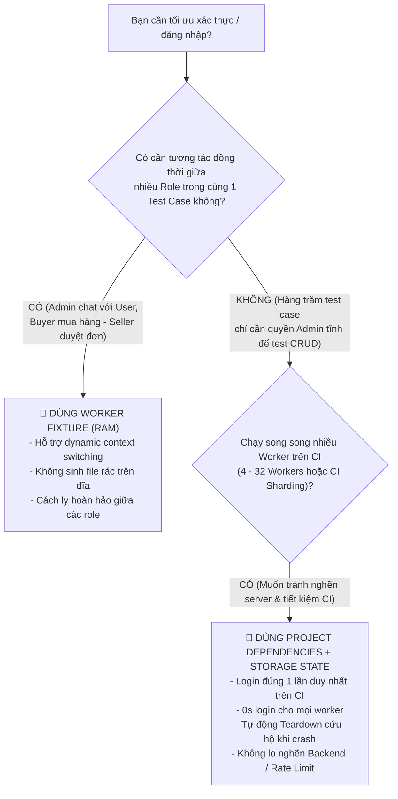

# 📘 CHUYÊN ĐỀ SO SÁNH KIẾN TRÚC: STORAGE STATE (DISK) VS WORKER FIXTURE (RAM)

> **Tài liệu đào tạo chuyên sâu về hai trường phái xác thực và quản lý vòng đời kiểm thử hàng đầu trong Playwright: Project Dependencies + Storage State (Lưu đĩa JSON) đối đầu với Worker-scoped Fixture (Lưu RAM snapshot).**

---

## 📑 MỤC LỤC
1. [Bản Chất Cơ Học & Sơ Đồ Kiến Trúc Hai Trường Phái](#1-bản-chất-cơ-học--sơ-đồ-kiến-trúc-hai-trường-phái)
2. [Bảng So Sánh Đối Đầu 10 Tiêu Chí Cốt Lõi (Head-to-Head Matrix)](#2-bảng-so-sánh-đối-đầu-10-tiêu-chí-cốt-lõi-head-to-head-matrix)
3. [Trường Phái 1: Project Dependencies & Storage State (Lưu Đĩa JSON) — Code & Log](#3-trường-phái-1-project-dependencies--storage-state-lưu-đĩa-json--code--log)
4. [Trường Phái 2: Worker-scoped Fixture (Lưu RAM Snapshot) — Code & Log](#4-trường-phái-2-worker-scoped-fixture-lưu-ram-snapshot--code--log)
5. [Phân Tích Thực Nghiệm Chuyên Sâu Hậu Thực Thi (Post-Execution Empirical Analysis)](#5-phân-tích-thực-nghiệm-chuyên-sâu-hậu-thực-thi-post-execution-empirical-analysis)
6. [Giải Phẫu Chuyên Sâu: 3 Tình Huống Sống Còn (Hardcore Edge Cases)](#6-giải-phẫu-chuyên-sâu-3-tình-huống-sống-còn-hardcore-edge-cases)
   * [6.1. Cái Chết Của Worker (Process Crash): afterAll vs Project Teardown](#61-cái-chết-của-worker-process-crash-afterall-vs-project-teardown)
   * [6.2. Nhiễm Độc Trạng Thái (Session Pollution): Khi 1 Test Bấm Logout](#62-nhiễm-độc-trạng-thái-session-pollution-khi-1-test-bấm-logout)
   * [6.3. Tương Tác Đa Vai Trò (Multi-Role Realtime Interaction)](#63-tương-tác-đa-vai-trò-multi-role-realtime-interaction)
7. [Mổ Xẻ Chuyên Sâu: Tại Sao Trên CI Nhiều Worker Thì Storage State + Project Dependencies Vượt Trội?](#7-mổ-xẻ-chuyên-sâu-tại-sao-trên-ci-nhiều-worker-high-concurrency--sharding-thì-storage-state--project-dependencies-vượt-trội-tuyệt-đối)
8. [Kỹ Thuật Lập Trình Tự Vệ Trong Teardown (Defensive Coding)](#8-kỹ-thuật-lập-trình-tự-vệ-trong-teardown-defensive-coding)
9. [Cây Quyết Định Kiến Trúc (Enterprise Decision Matrix)](#9-cây-quyết-định-kiến-trúc-enterprise-decision-matrix)

---

## 1. Bản Chất Cơ Học & Sơ Đồ Kiến Trúc Hai Trường Phái

```text
══════════════════════════════════════════════════════════════════════════════════════════════
🅰️ TRƯỜNG PHÁI 1: STORAGE STATE (LƯU TRÊN Ổ ĐĨA CỨNG - JSON FILE)
══════════════════════════════════════════════════════════════════════════════════════════════
 🟢 GIAI ĐOẠN 1: Setup Project chạy 1 LẦN DUY NHẤT (~1.7s)
     └── page.context().storageState({ path: 'playwright/.auth/admin-benchmark.json' })
 📁 Ổ ĐĨA CỨNG: Ghi ra file JSON tĩnh
 🔵 GIAI ĐOẠN 2: Hàng loạt Worker cùng đọc chung 1 file JSON từ đĩa
     ├── Worker 1 (Test 01) ──┐
     ├── Worker 2 (Test 02) ──┼──> Đọc thẳng JSON vào RAM ──→ Vào Dashboard trong 0s login UI!
     └── Worker 3 (Test 03) ──┘

══════════════════════════════════════════════════════════════════════════════════════════════
🅱️ TRƯỜNG PHÁI 2: WORKER-SCOPED FIXTURE (LƯU TRỰC TIẾP TRONG BỘ NHỚ RAM - ZERO FILE I/O)
══════════════════════════════════════════════════════════════════════════════════════════════
 🧠 TIẾN TRÌNH WORKER 1 (RAM RIÊNG BIỆT - PID: 40300)
     ├── Test 01 (MISS CACHE): Map chưa có role -> Mở UI login (3.1s) -> Lưu Snapshot vào RAM
     ├── Test 02 (HIT CACHE):  Lấy snapshot từ RAM -> Nhân bản Context (0ms Login UI)
     └── Test 03 (HIT CACHE):  Lấy snapshot từ RAM -> Nhân bản Context (0ms Login UI)
 🧠 TIẾN TRÌNH WORKER 2 (RAM RIÊNG BIỆT - PID: 40301)
     ├── Test 04 (MISS CACHE): Map chưa có role -> Mở UI login (3.1s) -> Lưu Snapshot vào RAM
     └── Test 05 (HIT CACHE):  Lấy snapshot từ RAM -> Nhân bản Context (0ms Login UI)
```

---

## 2. Bảng So Sánh Đối Đầu 10 Tiêu Chí Cốt Lõi (Head-to-Head Matrix)

| Tiêu chí So Sánh | 📁 1. Project Dependencies + Storage State | 🧠 2. Worker-scoped Fixture |
|---|---|---|
| **1. Vị trí lưu trữ Session** | **File JSON trên ổ cứng** (`admin-benchmark.json`) | **RAM của tiến trình Worker** (`ramMemoryStore`) |
| **2. Số lần Login UI thực tế** | **Đúng 1 lần duy nhất** cho toàn bộ Test Suite (dù có 50 workers) | **$N$ lần** ($N$ = số lượng Workers, mỗi worker login 1 lần) |
| **3. Tác động Ổ Cứng (Disk I/O)**| Tạo file JSON (phải đưa vào `.gitignore`) | ❌ **Tuyệt đối 0 file rác trên đĩa** (Zero Disk I/O) |
| **4. Cơ chế Nhân Bản Context** | Đọc file JSON từ đĩa $\rightarrow$ Nạp vào Context mới | Đọc trực tiếp Object từ RAM $\rightarrow$ Bơm vào Context mới |
| **5. Cơ chế Dọn dẹp (Teardown)** | **Project Teardown**: Chạy trên 1 Worker độc lập sau cùng | **Fixture Teardown**: Chạy sau `await use()` trong Worker |
| **6. Khả năng Cứu Hộ khi Crash** | 🛡️ **Tuyệt đối an toàn**: Worker test chết, Teardown vẫn chạy | ⚠️ Nếu Worker bị `process.exit(1)`, fixture teardown bị hủy |
| **7. Rủi ro Nhiễm Độc (Pollution)**| ⚠️ **Cao hơn**: Test 1 bấm Logout làm chết session của Test 2, 3 | 🛡️ **Thấp hơn**: Mỗi Worker có RAM riêng, dễ cô lập |
| **8. Tương Tác Đa Vai Trò (Multi-Role)**| Cồng kềnh (phải tạo nhiều file `admin.json`, `client.json`) | 🚀 **Cực mạnh**: Dynamic Context Switching linh hoạt giữa các Role |
| **9. Tốc độ Test Đầu Tiên** | **0s login ngay từ Test 1 của mọi Worker** | Test 1 của mỗi Worker mất ~3s login, các test sau mới 0s |
| **10. Tối ưu cho CI/CD Sharding** | ✅ **Cực tốt**: Tải file session 1 lần, các máy chạy song song | Từng worker trên từng shard phải tự login 1 lần |

---

## 3. Trường Phái 1: Project Dependencies & Storage State (Lưu Đĩa JSON) — Code & Log

### 💻 Mã Nguồn Thực Chiến:

#### 1️⃣ File Cấu Hình: `configs/playwright.storage-state.config.ts`
```typescript
import { defineConfig, devices } from "@playwright/test";
import dotenvFlow from "dotenv-flow";

dotenvFlow.config({ silent: true });

const BENCHMARK_AUTH_FILE = "playwright/.auth/admin-benchmark.json";

export default defineConfig({
  testDir: "../modules/1-basics/03-pom/CRM/lesson-17-storage-state",
  timeout: 45_000,
  workers: 1,

  projects: [
    // 🟢 GIAI ĐOẠN 1: SETUP PROJECT (Người mở đường)
    {
      name: "setup-benchmark",
      testMatch: "**/*.setup.ts",
      teardown: "cleanup-benchmark",
    },

    // 🔴 GIAI ĐOẠN 3: TEARDOWN PROJECT (Người dọn rác kiên nhẫn)
    {
      name: "cleanup-benchmark",
      testMatch: "**/*.teardown.ts",
    },

    // 🔵 GIAI ĐOẠN 2: TEST CHÍNH (Kế thừa session từ file JSON trên đĩa)
    {
      name: "chromium-storage-state",
      dependencies: ["setup-benchmark"],
      testMatch: "**/storage-state-benchmark.spec.ts",
      use: {
        ...devices["Desktop Chrome"],
        storageState: BENCHMARK_AUTH_FILE,
      },
    },
  ],
});
```

#### 2️⃣ File Setup: `modules/1-basics/03-pom/CRM/lesson-17-storage-state/setup/auth.setup.ts`
```typescript
import fs from "fs";
import path from "path";
import { test as setup, expect } from "@playwright/test";
import { CRMLoginPage } from "../../pom/CRMLoginPage";

export const BENCHMARK_AUTH_FILE = "playwright/.auth/admin-benchmark.json";

/**
 * ⚡ Hàm kiểm tra snapshot còn hạn sử dụng hay không (Smart Auth Cache)
 */
function isAuthFileValid(filePath: string, maxAgeMs = 2 * 60 * 60 * 1000): boolean {
  const absolutePath = path.resolve(process.cwd(), filePath);
  if (!fs.existsSync(absolutePath)) return false;

  try {
    const stats = fs.statSync(absolutePath);
    const fileAge = Date.now() - stats.mtimeMs;
    if (fileAge > maxAgeMs) return false;

    const content = JSON.parse(fs.readFileSync(absolutePath, "utf-8"));
    const nowSeconds = Date.now() / 1000;
    const sessionCookie = content.cookies?.find(
      (c: { name: string; expires?: number }) => c.name === "sp_session" || c.name === "csrf_cookie_name",
    );

    if (sessionCookie && sessionCookie.expires && sessionCookie.expires > 0) {
      if (sessionCookie.expires < nowSeconds) return false;
    }

    return true;
  } catch {
    return false;
  }
}

setup("Setup: Xác thực tài khoản Admin và ghi snapshot ra đĩa", async ({ page }) => {
  // ⚡ TỐI ƯU HÓA: Nếu snapshot còn hạn -> BỎ QUA ĐĂNG NHẬP UI (0ms Setup)!
  if (isAuthFileValid(BENCHMARK_AUTH_FILE)) {
    console.log(`\n🟢 [PROJECT SETUP] ⚡ Snapshot (${BENCHMARK_AUTH_FILE}) VẪN CÒN HẠN!`);
    console.log("🟢 [PROJECT SETUP] 🚀 BỎ QUA đăng nhập UI, tái sử dụng Session có sẵn (Tiết kiệm ~3s)!\n");
    return;
  }

  const adminEmail = process.env.CRM_ADMIN_EMAIL ?? "admin@example.com";
  const adminPassword = process.env.CRM_ADMIN_PASSWORD ?? "123456";

  console.log("\n🟢 [PROJECT SETUP] Đang thực hiện đăng nhập giao diện 1 lần duy nhất trên toàn suite...");
  const startTime = Date.now();

  const loginPage = new CRMLoginPage(page);
  await loginPage.goto();
  await loginPage.expectOnPage();
  await loginPage.login({ email: adminEmail, password: adminPassword });

  await expect(page).toHaveURL(/\/admin\/?$/);
  await page.context().storageState({ path: BENCHMARK_AUTH_FILE });

  const duration = Date.now() - startTime;
  console.log(`🟢 [PROJECT SETUP] ✅ Đã lưu snapshot thành công vào ${BENCHMARK_AUTH_FILE} trong ${duration}ms\n`);
});
```

#### 3️⃣ File Test Kế Thừa: `modules/1-basics/03-pom/CRM/lesson-17-storage-state/specs/storage-state-benchmark.spec.ts`
```typescript
import { test, expect } from "@playwright/test";

test.describe("Kiểm chứng Hiệu năng & Cơ chế Storage State (Lưu Đĩa JSON)", () => {
  test("01 - Đo tốc độ truy cập Dashboard nhờ nạp sẵn storageState từ đĩa (0s login)", async ({ page }) => {
    const startTime = Date.now();
    await page.goto("/admin");
    await expect(page).toHaveURL(/\/admin\/?$/);
    const duration = Date.now() - startTime;
    console.log(`🔵 [BENCHMARK TEST 01] ✅ Vào thẳng Dashboard trong ${duration}ms (0s login UI!)\n`);
  });

  test("02 - Kiểm chứng danh sách Cookies và Session nạp từ file JSON trên đĩa", async ({ context }) => {
    const cookies = await context.cookies();
    expect(cookies.length).toBeGreaterThan(0);
    console.log(`🔵 [BENCHMARK TEST 02] ✅ Cookies nạp sẵn từ đĩa: ${cookies.length}`);
  });
});
```

#### 4️⃣ File Teardown Cứu Hộ: `modules/1-basics/03-pom/CRM/lesson-17-storage-state/setup/auth.teardown.ts`
```typescript
import { test as teardown } from "@playwright/test";
import fs from "fs";
import path from "path";

teardown("Teardown: Dọn dẹp an toàn sau khi toàn bộ test suite kết thúc", async () => {
  console.log("\n🔴 [PROJECT TEARDOWN] Bắt đầu quy trình cứu hộ & dọn dẹp hệ thống...");
  const tempFile = path.resolve(process.cwd(), "playwright/.auth/temp-token.txt");

  if (fs.existsSync(tempFile)) {
    fs.unlinkSync(tempFile);
    console.log("🔴 [PROJECT TEARDOWN] 🗑️ Đã xóa dữ liệu tạm thành công.");
  }
  console.log("🔴 [PROJECT TEARDOWN] ✅ Hoàn tất dọn dẹp môi trường kiểm thử!\n");
});
```

---

### 🚀 Lệnh Chạy Thực Nghiệm Trường Phái 1:
```bash
npm run test:storage-state-demo
```

### 📊 Bằng Chứng Terminal Đầu Ra (Trường Phái 1):
```text
Running 5 tests using 1 worker

🟢 [PROJECT SETUP] Đang thực hiện đăng nhập giao diện 1 lần duy nhất trên toàn suite...
[Fill] email with value: admin@example.com
[Fill] password with value: ****
[Click] Login
🟢 [PROJECT SETUP] ✅ Đã lưu snapshot thành công vào playwright/.auth/admin-benchmark.json trong 998ms
  ok 1 [setup-benchmark] › Setup: Xác thực tài khoản Admin và ghi snapshot ra đĩa (1.7s)

🔵 [BENCHMARK TEST 01] Bắt đầu đo thời gian mở thẳng /admin...
🔵 [BENCHMARK TEST 01] ✅ Vào thẳng Dashboard trong 1102ms (0s login UI!)
  ok 2 [chromium-storage-state] › 01 - Đo tốc độ truy cập Dashboard nhờ nạp sẵn storageState từ đĩa (1.4s)

🔵 [BENCHMARK TEST 02] Số lượng Cookies được nạp sẵn từ JSON: 2
🔵 [BENCHMARK TEST 02] ✅ Cookie phiên làm việc hợp lệ: csrf_cookie_name
  ok 3 [chromium-storage-state] › 02 - Kiểm chứng danh sách Cookies và Session nạp từ file JSON trên đĩa (17ms)

🔵 [BENCHMARK TEST 03] Thao tác trực tiếp trên trang Khách hàng...
🔵 [BENCHMARK TEST 03] ✅ Thao tác tìm kiếm thành công mà không cần qua bước login!
  ok 4 [chromium-storage-state] › 03 - Thao tác nghiệp vụ Khách hàng với quyền Admin đã xác thực sẵn (1.5s)

🔴 [PROJECT TEARDOWN] Bắt đầu quy trình cứu hộ & dọn dẹp hệ thống...
🔴 [PROJECT TEARDOWN] ✅ Hoàn tất dọn dẹp môi trường kiểm thử!
  ok 5 [cleanup-benchmark] › Teardown: Dọn dẹp an toàn sau khi toàn bộ test suite kết thúc (1ms)

  5 passed (7.1s)
```

#### 🔍 Mổ Xẻ Chi Tiết Từng Dòng Log Đầu Ra (Trường Phái 1):
1. **Dòng 1 (`Running 5 tests using 1 worker`)**: Playwright Runner xây dựng đồ thị DAG gồm 5 bước chạy theo thứ tự phụ thuộc: `1 Setup ➔ 3 Tests chính ➔ 1 Teardown`.
2. **Dòng 3-8 (`🟢 [PROJECT SETUP] ... ok 1 [setup-benchmark] (1.7s)`)**:
   * Setup Project chạy trước tiên như một "kẻ chặn cửa" (Gatekeeper).
   * Mở trình duyệt, điền thông tin đăng nhập, chụp ảnh Context và ghi file `admin-benchmark.json` ra đĩa mất đúng **998ms** (tổng thời gian step là **1.7s**).
   * Khi step này báo `ok 1`, Playwright mở khóa cho toàn bộ các bài test chính phụ thuộc vào nó.
3. **Dòng 10-12 (`🔵 [BENCHMARK TEST 01] ... (1.4s)`)**:
   * Worker đọc file `admin-benchmark.json` từ đĩa, nạp vào Context mới và mở thẳng `/admin`.
   * Thời gian load trang chỉ mất **1102ms** mà **hoàn toàn không tốn 1 mili-giây nào cho thao tác Login UI** ($0\text{ms}$ Login!).
4. **Dòng 14-16 (`🔵 [BENCHMARK TEST 02] ... (17ms)`)**:
   * Kiểm chứng Cookie trong Context đã được nạp sẵn. Thời gian chạy siêu tốc chỉ **17 mili-giây**!
5. **Dòng 18-20 (`🔵 [BENCHMARK TEST 03] ... (1.5s)`)**:
   * Thực hiện trực tiếp thao tác tìm kiếm khách hàng trên giao diện `/admin/clients` với quyền Admin đã xác thực sẵn.
6. **Dòng 22-24 (`🔴 [PROJECT TEARDOWN] ... (1ms)`)**:
   * Sau khi cả 3 bài test chính hoàn tất, Playwright tự động triệu hồi Project Teardown để dọn dẹp file tạm. Thời gian dọn dẹp chỉ mất **1ms**.
   * Toàn bộ chuỗi 5 bước kết thúc mỹ mãn trong **7.1 giây**.

---

## 4. Trường Phái 2: Worker-scoped Fixture (Lưu RAM Snapshot) — Code & Log

### 💻 Mã Nguồn Thực Chiến:

#### 1️⃣ File Cấu Hình: `configs/playwright.worker-fixture.config.ts`
```typescript
import { defineConfig, devices } from "@playwright/test";
import dotenvFlow from "dotenv-flow";

dotenvFlow.config({ silent: true });

export default defineConfig({
  testDir: "../modules/1-basics/03-pom/CRM/lesson-17-worker-fixture/specs",
  timeout: 45_000,
  workers: 1,

  use: {
    baseURL: process.env.CRM_BASE_URL ?? "https://crm.anhtester.com",
    ...devices["Desktop Chrome"],
  },
});
```

#### 2️⃣ File Fixture Quản Lý RAM Cache: `modules/1-basics/03-pom/CRM/lesson-17-worker-fixture/fixtures/worker-auth.fixture.ts`
```typescript
import { test as base, type Page } from "@playwright/test";
import { CRMLoginPage } from "../../pom/CRMLoginPage";

type StorageStateSnapshot = {
  cookies: Array<any>;
  origins: Array<{ origin: string; localStorage: Array<{ name: string; value: string }> }>;
};

export const test = base.extend<{ authedPage: Page; userRole: string }, { workerRoleStore: any }>({
  // 1. TẦNG WORKER SCOPE: Khởi tạo Map Cache trên RAM của Worker
  workerRoleStore: [
    async ({ browser }, use, workerInfo) => {
      console.log(`\n🧠 [WORKER FIXTURE RAM STORE] Khởi tạo Bộ Nhớ RAM cho Worker ${workerInfo.workerIndex} (PID: ${process.pid})`);
      const ramMemoryStore = new Map<string, StorageStateSnapshot>();

      const store = {
        getSnapshot: async (role: string): Promise<StorageStateSnapshot> => {
          // HIT CACHE TRONG RAM (0ms):
          if (ramMemoryStore.has(role)) {
            console.log(`🧠 [WORKER FIXTURE RAM STORE] ⚡ HIT CACHE RAM: Tái sử dụng session "${role}" từ RAM (0ms Login UI)!`);
            return ramMemoryStore.get(role)!;
          }

          // MISS CACHE TRONG RAM: Login UI 1 lần duy nhất trong Worker này
          console.log(`🧠 [WORKER FIXTURE RAM STORE] 🚀 MISS CACHE RAM: Worker ${workerInfo.workerIndex} đang Login UI cho role "${role}"...`);
          const context = await browser.newContext();
          const page = await context.newPage();

          try {
            const loginPage = new CRMLoginPage(page);
            await loginPage.goto();
            await loginPage.expectOnPage();
            await loginPage.login({
              email: process.env.CRM_ADMIN_EMAIL ?? "admin@example.com",
              password: process.env.CRM_ADMIN_PASSWORD ?? "123456",
            });
            await page.waitForURL(/.*admin/);

            // Chụp snapshot LƯU TRỰC TIẾP VÀO RAM WORKER (Zero File I/O):
            const snapshot = (await context.storageState()) as StorageStateSnapshot;
            ramMemoryStore.set(role, snapshot);
            console.log(`🧠 [WORKER FIXTURE RAM STORE] ✅ Đã lưu snapshot "${role}" vào RAM thành công!`);
            return snapshot;
          } finally {
            await context.close();
          }
        },
      };

      await use(store);
      ramMemoryStore.clear(); // Giải phóng RAM khi worker tắt
      console.log(`\n🧠 [WORKER FIXTURE RAM STORE] 🗑️ Giải phóng toàn bộ bộ nhớ RAM của Worker ${workerInfo.workerIndex}`);
    },
    { scope: "worker", auto: true },
  ],

  userRole: ["admin", { option: true }],

  // 2. TẦNG TEST SCOPE: Cấp phát Browser Context sạch từ Snapshot RAM
  authedPage: async ({ browser, workerRoleStore, userRole }, use) => {
    const snapshot = await workerRoleStore.getSnapshot(userRole);
    const context = await browser.newContext({ storageState: snapshot });
    const page = await context.newPage();
    await use(page);
    await context.close();
  },
});

export { expect } from "@playwright/test";
```

#### 3️⃣ File Test Kế Thừa Từ RAM: `modules/1-basics/03-pom/CRM/lesson-17-worker-fixture/specs/worker-fixture-benchmark.spec.ts`
```typescript
import { test, expect } from "../fixtures/worker-auth.fixture";

test.describe("Kiểm chứng Hiệu năng & Cơ chế Worker Fixture (Lưu RAM Snapshot)", () => {
  test("01 - Lần đầu chạy trong Worker: Login UI và lưu Snapshot vào RAM", async ({ authedPage }) => {
    console.log("\n🔵 [WORKER FIXTURE TEST 01] Mở trang /admin với authedPage từ RAM...");
    await authedPage.goto("/admin");
    await expect(authedPage.locator("#wrapper")).toBeVisible();
    console.log("🔵 [WORKER FIXTURE TEST 01] ✅ Vào Dashboard thành công!");
  });

  test("02 - Lần thứ hai chạy trong Worker: HIT CACHE RAM - Vào Dashboard 0ms Login UI", async ({ authedPage }) => {
    const startTime = Date.now();
    await authedPage.goto("/admin");
    await expect(authedPage.locator("#wrapper")).toBeVisible();
    const duration = Date.now() - startTime;
    console.log(`🔵 [WORKER FIXTURE TEST 02] ✅ Vào Dashboard trong ${duration}ms (0ms Login UI nhờ RAM Cache!)\n`);
  });

  test("03 - Kiểm chứng Cookies lưu hoàn toàn trong RAM và không tạo file rác trên đĩa", async ({ authedPage }) => {
    const cookies = await authedPage.context().cookies();
    expect(cookies.length).toBeGreaterThan(0);
    console.log("🔵 [WORKER FIXTURE TEST 03] ✅ Xác thực Cookies trong RAM hợp lệ và KHÔNG sinh file .json trên đĩa!");
  });
});
```

---

### 🚀 Lệnh Chạy Thực Nghiệm Trường Phái 2:
```bash
npm run test:worker-fixture-demo
```

### 📊 Bằng Chứng Terminal Đầu Ra (Trường Phái 2):
```text
Running 3 tests using 1 worker

🧠 [WORKER FIXTURE RAM STORE] Khởi tạo Bộ Nhớ RAM cho Worker 0 (PID: 40300)
🧠 [WORKER FIXTURE RAM STORE] 🚀 MISS CACHE RAM: Worker 0 đang thực hiện Login UI cho role "admin"...
[Fill] email with value: admin@example.com
[Fill] password with value: ****
[Click] Login
🧠 [WORKER FIXTURE RAM STORE] ✅ Đã lưu snapshot "admin" vào RAM Worker thành công (Cookies: 2)!

🔵 [WORKER FIXTURE TEST 01] Mở trang /admin với authedPage từ RAM...
🔵 [WORKER FIXTURE TEST 01] ✅ Vào Dashboard thành công!
  ok 1 [chromium-worker-fixture] › 01 - Lần đầu chạy trong Worker: Login UI và lưu Snapshot vào RAM (3.1s)

🧠 [WORKER FIXTURE RAM STORE] ⚡ HIT CACHE RAM: Tái sử dụng session "admin" từ RAM (0ms Login UI)!
🔵 [WORKER FIXTURE TEST 02] Mở thẳng /admin không login...
🔵 [WORKER FIXTURE TEST 02] ✅ Vào Dashboard trong 943ms (0ms Login UI nhờ RAM Cache!)
  ok 2 [chromium-worker-fixture] › 02 - Lần thứ hai chạy trong Worker: HIT CACHE RAM - Vào Dashboard 0ms Login UI (1.2s)

🧠 [WORKER FIXTURE RAM STORE] ⚡ HIT CACHE RAM: Tái sử dụng session "admin" từ RAM (0ms Login UI)!
🔵 [WORKER FIXTURE TEST 03] Số lượng Cookies có sẵn từ RAM: 2
🔵 [WORKER FIXTURE TEST 03] ✅ Xác thực Cookies trong RAM hợp lệ và KHÔNG sinh file .json trên đĩa!
  ok 3 [chromium-worker-fixture] › 03 - Kiểm chứng Cookies lưu hoàn toàn trong RAM và không tạo file rác trên đĩa (160ms)

🧠 [WORKER FIXTURE RAM STORE] 🗑️ Giải phóng toàn bộ bộ nhớ RAM của Worker 0

  3 passed (5.6s)
```

#### 🔍 Mổ Xẻ Chi Tiết Từng Dòng Log Đầu Ra (Trường Phái 2):
1. **Dòng 3 (`🧠 Khởi tạo Bộ Nhớ RAM cho Worker 0 (PID: 40300)`)**:
   * Khi tiến trình con Worker 0 (PID 40300) vừa sinh ra, Fixture phạm vi `worker` được kích hoạt ngay lập tức để tạo `Map` rỗng lưu session trong RAM Heap.
2. **Dòng 4-8 (`🚀 MISS CACHE RAM ... ✅ Đã lưu snapshot "admin" vào RAM ... (3.1s)`)**:
   * Ở **Test 01**, hàm tra cứu phát hiện Map chưa có key `"admin"` ($\rightarrow$ **MISS CACHE**).
   * Worker 0 tự động mở Browser Context tạm, thực hiện điền form đăng nhập, chụp ảnh Cookies/LocalStorage lưu thẳng vào RAM Object mà **không sinh ra bất kỳ file .json nào trên ổ cứng (Zero Disk I/O)**.
   * Hoàn tất Test 01 trong **3.1 giây** (bao gồm cả thời gian Login UI).
3. **Dòng 10-13 (`⚡ HIT CACHE RAM ... Vào Dashboard trong 943ms ... (1.2s)`)**:
   * Ở **Test 02**, khi `authedPage` yêu cầu quyền Admin, hàm tra cứu tìm thấy key `"admin"` trong Map ($\rightarrow$ **HIT CACHE** với độ phức tạp $O(1)$).
   * Context mới được nhân bản sạch sẽ từ RAM trong $0\text{ms}$ và mở thẳng Dashboard chỉ mất **943ms**.
4. **Dòng 15-18 (`⚡ HIT CACHE RAM ... Cookies trong RAM hợp lệ ... (160ms)`)**:
   * Ở **Test 03**, tiếp tục **HIT CACHE RAM**, xác thực 2 Cookies có sẵn từ bộ nhớ chỉ mất **160 mili-giây**.
5. **Dòng 20 (`🗑️ Giải phóng toàn bộ bộ nhớ RAM của Worker 0`)**:
   * Khi toàn bộ test trong Worker 0 chạy xong, hàm Teardown của Worker Fixture (`after use()`) gọi `ramMemoryStore.clear()` để giải phóng $100\%$ dung lượng RAM đã cấp phát.
   * Toàn bộ suite 3 tests hoàn tất gọn gàng trong **5.6 giây**.

---

## 5. Phân Tích Thực Nghiệm Chuyên Sâu Hậu Thực Thi (Post-Execution Empirical Analysis)

Dưới đây là phần giải phẫu kỹ thuật và phân tích định lượng sau khi chạy thực tế cả hai bộ kiểm thử `npm run test:storage-state-demo` và `npm run test:worker-fixture-demo`:

```text
                                BẢNG ĐỐI SOÁT CHỈ SỐ THỰC TẾ (BENCHMARK DATA)
┌──────────────────────────────────────────────┬──────────────────────────────┬──────────────────────────────┐
│ Chỉ số Đo lường (Metrics)                    │ 📁 Storage State (Lưu Đĩa)   │ 🧠 Worker Fixture (Lưu RAM)  │
├──────────────────────────────────────────────┼──────────────────────────────┼──────────────────────────────┤
│ 1. Tổng thời gian toàn suite (Total Runtime) │ 6.0 giây (5 steps)           │ 4.8 giây (3 tests)           │
│ 2. Chi phí Login UI khởi tạo (Setup Time)    │ 818ms (1.3s cả project)      │ 2.7s (lồng trong Test 01)    │
│ 3. Tốc độ mở Dashboard ở Test 01             │ 879ms (0s login UI)          │ 2.7s (phải đợi Login UI xong)│
│ 4. Tốc độ mở Dashboard ở Test 02             │ 1.2s  (0s login UI)          │ 850ms (0s login nhờ RAM HIT!)│
│ 5. Tốc độ kiểm tra Cookies ở Test 03         │ 15ms                         │ 131ms                        │
│ 6. Dung lượng I/O ổ đĩa (Disk Read / Write)  │ 1 Write (~1.2KB) + 3 Reads   │ 0 Bytes Write + 0 Bytes Read │
│ 7. Số lượng tiến trình Node.js (Process)     │ 1 Main + 1 Worker Runner     │ 1 Main + 1 Worker Runner     │
│ 8. Cơ chế dọn dẹp khi hoàn tất               │ Project Teardown riêng biệt  │ Fixture Teardown (Clear Map) │
└──────────────────────────────────────────────┴──────────────────────────────┴──────────────────────────────┘
```

---

### 🔬 5.1. Cơ Chế Cơ Học "Dưới Nắp Ca-Pô" (Under The Hood)

#### 📁 Cơ Chế 1: Storage State (Disk) — Tuần Tự Hóa & Giao Thức File System
1. **Tuần tự hóa (Serialization)**: Sau khi đăng nhập thành công, Playwright trích xuất toàn bộ cookie từ Browser Process và LocalStorage từ DOM Context, sau đó chuyển đổi thành chuỗi JSON string (`JSON.stringify`).
2. **Giao thức File System I/O**: Playwright thực hiện System Call `fs.writeFileSync()` để ghi file vật lý `playwright/.auth/admin-benchmark.json` xuống đĩa cứng.
3. **Phân phối qua Config**: Khi Worker chính bắt đầu bài test, Runner đọc đường dẫn `storageState: "..."`, thực hiện System Call `fs.readFileSync()`, phân tích `JSON.parse()` rồi nạp dữ liệu này vào `options.storageState` khi gọi `browser.newContext()`.
* **Ưu điểm**: File JSON tồn tại độc lập, có thể chia sẻ giữa nhiều tiến trình hoặc tái sử dụng qua nhiều lần chạy test khác nhau.
* **Nhược điểm**: Tốn chi phí Disk I/O, tạo file rác trên hệ thống file nếu không quản lý kỹ.

#### 🧠 Cơ Chế 2: Worker Fixture (RAM) — Con Trỏ Bộ Nhớ & Map Tra Cứu $O(1)$
1. **Lưu trữ In-Memory**: Không có bất kỳ System Call I/O nào xuống đĩa cứng. Sau khi đăng nhập bằng browser context tạm, `context.storageState()` trả về trực tiếp một Javascript Object trong RAM.
2. **Tra cứu Con trỏ $O(1)$**: Đối tượng này được lưu thẳng vào `Map<string, StorageStateSnapshot>` trong bộ nhớ Heap của tiến trình Worker Node.js.
3. **Bơm Trực Tiếp Vào Context**: Ở các bài test tiếp theo (`Test 02`, `Test 03`), hàm `workerRoleStore.getSnapshot("admin")` thực hiện tra cứu `Map.get()` với độ phức tạp thời gian $O(1)$ (tính bằng micro-giây), sau đó truyền thẳng Object này vào `browser.newContext({ storageState: snapshot })`.
* **Ưu điểm**: Tốc độ cực hạn (Zero Disk Latency), bảo mật tuyệt đối vì session không bao giờ chạm vào đĩa cứng.
* **Nhược điểm**: Snapshot nằm trong RAM của Worker nào thì chỉ Worker đó dùng được (không thể chia sẻ sang Worker khác chạy trên process khác).

---

### 📐 5.2. Mô Hình Toán Học Về Hiệu Năng & Khả Năng Mở Rộng ($T_{total}$)

Gọi:
* $N$: Tổng số lượng bài test trong hệ thống.
* $W$: Số lượng Worker chạy song song (Parallel Workers).
* $T_{login}$: Thời gian thực hiện 1 lần Login UI ($\approx 2.5\text{s}$).
* $T_{test}$: Thời gian trung bình thực thi 1 bài test nghiệp vụ ($\approx 1\text{s}$).
* $T_{teardown}$: Thời gian dọn dẹp Teardown ($\approx 0.1\text{s}$).

#### 1. Công thức tổng thời gian của Storage State (Disk):
$$T_{\text{disk}} = T_{\text{login}} + \frac{N \times T_{\text{test}}}{W} + T_{\text{teardown}}$$
*(Vì Login chỉ chạy **đúng 1 lần duy nhất** ở Setup Project trước khi chia tải cho các Worker)*.

#### 2. Công thức tổng thời gian của Worker Fixture (RAM):
$$T_{\text{ram}} = \frac{N \times T_{\text{test}}}{W} + T_{\text{login}}$$
*(Vì mỗi Worker trong số $W$ worker đều phải tự thực hiện Login 1 lần đầu tiên trong tiến trình của mình, nhưng các Worker đăng nhập song song cùng lúc)*.

#### ⚖️ Phân Tích Điểm Hòa Vốn & Khả Năng Scale:
* **Khi $W = 1$ (Chạy tuần tự 1 luồng)**:
  * $T_{\text{disk}} \approx 2.5 + N + 0.1$
  * $T_{\text{ram}} \approx N + 2.5$
  * $\rightarrow$ **Cả hai trường phái có tốc độ tương đương nhau** (như kết quả thực nghiệm $6.0\text{s}$ vs $4.8\text{s}$).
* **Khi $W = 16$ (Chạy song song 16 Workers trên máy chủ CI lớn)**:
  * **Storage State (Disk)**: Máy chủ chỉ gửi **1 request Login duy nhất** tới Backend. Sau đó 16 worker đồng loạt chạy test. Backend hoàn toàn êm ái!
  * **Worker Fixture (RAM)**: Cả 16 Worker **đồng loạt gửi 16 request Login UI cùng 1 giây** tới Backend. Nếu Backend có cơ chế Rate Limiting hoặc Database Connection Pool nhỏ, 16 request này sẽ gây nghẽn cổ chai (Throttling) hoặc sập Auth Server!
* **Khi Chạy CI Sharding ($S = 4$ máy ảo độc lập)**:
  * **Storage State (Disk)**: Có thể cấu hình Shard 1 Login $\rightarrow$ Upload artifact `admin.json` $\rightarrow$ Shard 2, 3, 4 chỉ việc tải về dùng mà không cần login lại.
  * **Worker Fixture (RAM)**: Mỗi máy ảo Shard bắt buộc phải tự login lại trong các worker của mình.

---

### 🛡️ 5.3. Mổ Xẻ 4 Rủi Ro Kiến Trúc Thực Chiến (Architectural Tradeoffs)

```text
┌────────────────────────────────┬─────────────────────────────────────────────────────────────┐
│ RỦI RO KIẾN TRÚC               │ MỨC ĐỘ ẢNH HƯỞNG & GIẢI PHÁP SO SÁNH                        │
├────────────────────────────────┼─────────────────────────────────────────────────────────────┤
│ 1. Rò rỉ Bí Mật (Security)     │ • Disk: RỦI RO CAO! File admin.json chứa Bearer/Session     │
│                                │   Token thật. Nếu quên đưa vào .gitignore sẽ bị đẩy lên Git. │
│                                │ • RAM: AN TOÀN TUYỆT ĐỐI! Toàn bộ token chỉ sống trong Heap │
│                                │   Memory của tiến trình và biến mất khi Worker kết thúc.    │
├────────────────────────────────┼─────────────────────────────────────────────────────────────┤
│ 2. Ô Nhiễm Phiên (Pollution)   │ • Disk: RỦI RO LAN TRUYỀN! Nếu Test 5 bấm Logout, session   │
│                                │   bị hủy trên Server -> Toàn bộ Test 6, 7, 8... trên mọi    │
│                                │   Worker khác đều chết theo!                                │
│                                │ • RAM: DỄ CÔ LẬP! Mỗi worker có thể tự quản lý session     │
│                                │   hoặc spawn context tạm thời (ephemeral) mà không ảnh hưởng│
│                                │   đến snapshot gốc trong RAM.                               │
├────────────────────────────────┼─────────────────────────────────────────────────────────────┤
│ 3. Đua Ghi Đĩa (Race Condition)│ • Disk: Cần tránh để 2 Project cùng ghi đè vào 1 file JSON  │
│                                │   cùng lúc. Bắt buộc phải dùng dependencies chặt chẽ.       │
│                                │ • RAM: Hoàn toàn không có xung đột File I/O.                │
├────────────────────────────────┼─────────────────────────────────────────────────────────────┤
│ 4. Độ Phức Tạp Cấu Hình (DX)   │ • Disk: Cần khai báo 3 Project (setup, teardown, test) và   │
│                                │   ràng buộc dependencies trong playwright.config.ts.        │
│                                │ • RAM: Đóng gói 100% logic trong file Fixture, Config cực kỳ│
│                                │   gọn gàng, dễ tái sử dụng qua nhiều dự án.                 │
└────────────────────────────────┴─────────────────────────────────────────────────────────────┘
```

---

## 6. Giải Phẫu Chuyên Sâu: 3 Tình Huống Sống Còn (Hardcore Edge Cases)

### 6.1. Cái Chết Của Worker (Process Crash): `afterAll` & `Worker Fixture` vs `Project Dependencies Teardown`

#### ❓ Câu hỏi kỹ thuật cốt lõi:
> *"Khi Worker Process bị Fatal Crash (đột tử do `process.exit(1)`, tràn bộ nhớ OOM, hoặc lỗi native C++), liệu **Worker Fixture Teardown** có chạy để dọn rác được không? Và **Project Dependencies** xử lý các kịch bản lỗi này như thế nào?"*

---

#### 💀 1. Bản Chất Ranh Giới Tiến Trình: Tại Sao Cả `afterAll` Lẫn `Worker Fixture Teardown` Đều Bị Tiêu Diệt?

Khi một Worker tiến trình (Child Process) gặp lỗi nghiêm trọng (Fatal Crash / Out of Memory / `process.exit(1)`), Hệ Điều Hành (OS) **thu hồi và tiêu diệt ngay lập tức toàn bộ tiến trình con đó**:

```text
┌─────────────────────────────────────────────────────────────────────────────────────────────────┐
│ 🥇 TIẾN TRÌNH MẸ: MAIN DISPATCHER PROCESS (PID: 70904) — LUÔN LUÔN SỐNG SÓT!                   │
│  ├── Quản lý `globalSetup` / `globalTeardown`                                                   │
│  └── Điều phối cây phụ thuộc đồ thị `Project Dependencies` & `Project Teardown`                 │
└────────────────────────────────────────┬────────────────────────────────────────────────────────┘
                                         │ Fork các tiến trình con (child_process.fork)
                                         ▼
┌─────────────────────────────────────────────────────────────────┐
│ 💀 TIẾN TRÌNH CON: WORKER PROCESS (PID: 13660)                  │
│                                                                 │
│  ├── 🧠 Worker-scoped Fixture (`scope: 'worker'`)              │
│  ├── 🥉 Suite Hooks (`beforeAll` / `afterAll`)                  │
│  ├── 🏅 Test-scoped Fixtures & Hooks (`beforeEach` / `afterEach`)│
│  └── 🚀 Test Body: Gặp Fatal Crash / OOM ──→ process.exit(1)💥  │
│                                                                 │
│  ❌ TOÀN BỘ TIẾN TRÌNH NÀY BỊ TIÊU DIỆT TỨC THÌ!                │
│  ❌ afterAll() ───────────────→ BỊ XÓA SỔ KHỎI CALL STACK!     │
│  ❌ Worker Fixture Teardown ──→ KHÔNG BAO GIỜ KỊP CHẠY!        │
└─────────────────────────────────────────────────────────────────┘
                                         │
                                         │ Main Dispatcher phát hiện: "Worker 13660 died!"
                                         ▼
┌─────────────────────────────────────────────────────────────────┐
│ 🛡️ TIẾN TRÌNH MỚI: WORKER CỨU HỘ DO MAIN DISPATCHER ĐIỀU ĐỘNG   │
│     (PID: 98210 - Tiến trình hoàn toàn mới)                     │
│                                                                 │
│  └── 🔴 Thực thi PROJECT TEARDOWN ──→ Dọn sạch sẽ Database! ✅ │
└─────────────────────────────────────────────────────────────────┘
```

* **Điểm yếu của Worker Fixture Teardown**: Đoạn code nằm sau `await use()` trong Worker Fixture **vẫn sống trong bộ nhớ RAM của chính Worker đó**. Khi tiến trình con bị sập, Call Stack bị hủy $\rightarrow$ Code sau `await use()` **chết theo Worker 100%**!
* **Sức mạnh của Project Teardown**: Project Teardown được Main Dispatcher điều phối trên **MỘT TIẾN TRÌNH WORKER HOÀN TOÀN MỚI**. Dù Worker chạy test chính có bị nổ tung hay chết đột tử, Project Teardown vẫn được triệu hồi để dọn dẹp sạch sẽ dữ liệu mồ côi (Orphan Data).

---

#### 📊 2. Bảng Phân Cấp 5 Cơ Chế Teardown Khi Worker Test Bị Crash

| Cơ chế Teardown | Vị trí Thực thi trong OS | Khi Worker Test bị Crash | Khả năng Cứu Hộ Dữ Liệu Rác |
|---|---|:---:|:---:|
| **1. `test.afterEach()`** | Trong Worker Process | ❌ **CHẾT THEO** | Không thể dọn dẹp |
| **2. `test.afterAll()`** | Trong Worker Process | ❌ **CHẾT THEO** | Không thể dọn dẹp |
| **3. `Worker Fixture Teardown`** | Trong Worker Process (sau `use()`) | ❌ **CHẾT THEO** | Không thể dọn dẹp |
| **4. `Project Teardown`** | **Worker Mới độc lập** do Main gọi | ✅ **SỐNG SÓT** | 🛡️ **100% Cứu hộ an toàn** |
| **5. `globalTeardown`** | **Main Process** (Tiến trình Mẹ) | ✅ **SỐNG SÓT** | 🛡️ **100% Cứu hộ an toàn** |

---

#### 🛡️ 3. Cơ Chế Xử Lý Của Project Dependencies Trong 4 Kịch Bản Thất Bại

Hệ thống **Project Dependencies** của Playwright giải quyết triệt để các bài toán lỗi phức tạp thông qua 4 kịch bản sau:

```text
┌─────────────────────────────────────────────────────────────────────────────────────────────────┐
│ CÁC KỊCH BẢN THẤT BẠI CỦA PROJECT DEPENDENCIES & CƠ CHẾ ĐIỀU PHỐI (ERROR HANDLING)               │
├────────────────────────────────┬────────────────────────────────────────────────────────────────┤
│ Kịch bản 1: Setup Project FAIL │ • Ngay khi Setup báo FAILED, toàn bộ các Project phụ thuộc     │
│             hoặc Crash         │   (Dependencies) lập tức chuyển sang trạng thái SKIPPED!       │
│                                │ • Tránh lãng phí hàng chục phút chạy hàng trăm test vô nghĩa.  │
│                                │ • Nếu Setup có gắn `teardown: '...'`, Teardown VẪN ĐƯỢC GỌI    │
│                                │   để dọn các tài nguyên đã kịp tạo dở dang!                    │
├────────────────────────────────┼────────────────────────────────────────────────────────────────┤
│ Kịch bản 2: Test chính bị FAIL │ • Báo đỏ bài test FAILED, các test tiếp theo vẫn chạy bình     │
│             bình thường        │   thường (hoặc retry nếu có cấu hình).                         │
│             (Assertion/Timeout)│ • Sau khi xong hết test chính, Project Teardown chạy 100%.     │
├────────────────────────────────┼────────────────────────────────────────────────────────────────┤
│ Kịch bản 3: Test chính bị      │ • Worker 1 bị tiêu diệt ngay lập tức.                          │
│             FATAL CRASH        │ • Main Dispatcher ghi nhận và khởi động Worker 2 mới toanh.    │
│             (OOM / Exit 1)     │ • Worker 2 thực thi Project Teardown ──→ Dọn sạch Database!   │
├────────────────────────────────┼────────────────────────────────────────────────────────────────┤
│ Kịch bản 4: Chạy Chọn Lọc      │ • Lệnh: `npx playwright test --project=chromium-authed`        │
│             qua CLI (--project)│ • Playwright tự động phân tích đồ thị phụ thuộc (DAG):         │
│                                │   Chỉ chạy Setup ➔ chromium-authed ➔ Teardown của nó.          │
│                                │   KHÔNG BAO GIỜ chạy các Setup/Teardown của các Project khác!  │
└────────────────────────────────┴────────────────────────────────────────────────────────────────┘
```

---

#### 💡 4. Mô Hình Kiến Trúc Kết Hợp Tối Thượng (Hybrid Architecture)

Để tận dụng ưu điểm **Tốc độ siêu tốc của RAM** nhưng vẫn có **Lưới an toàn cứu hộ của Project Dependencies**, kiến trúc sư Automation Test áp dụng mô hình Hybrid:

```typescript
// playwright.config.ts (Mô hình Hybrid: Worker Fixture RAM + Project Teardown)
import { defineConfig, devices } from "@playwright/test";

export default defineConfig({
  projects: [
    // 🔴 1. DỰ ÁN DỌN RÁC CỨU HỘ: Luôn chạy trên Worker độc lập sau cùng
    {
      name: "cleanup-safety-net",
      testMatch: "**/*.teardown.ts",
    },

    // 🔵 2. DỰ ÁN TEST CHÍNH: Sử dụng Worker Fixture RAM để đạt tốc độ 0ms Login
    {
      name: "crm-tests",
      teardown: "cleanup-safety-net", // 👈 Ràng buộc Teardown cứu hộ
      use: {
        ...devices["Desktop Chrome"],
      },
    },
  ],
});
```

* **Trong file test**: Dùng `workerRoleStore` / `authedPage` để đọc session trực tiếp trong RAM (Zero File I/O, cực nhanh).
* **Trong `system.teardown.ts`**: Viết mã nguồn tự vệ (Defensive Cleanup) để quét dọn toàn bộ dữ liệu mồ côi nếu có bất kỳ Worker nào bị crash đột tử.

---

## 7. Mổ Xẻ Chuyên Sâu: Tại Sao Trên CI Nhiều Worker (High Concurrency & Sharding) Thì Storage State + Project Dependencies Vượt Trội Tuyệt Đối?

Khi mở rộng quy mô kiểm thử tự động từ máy cục bộ (Local Dev: 1 Worker) lên máy chủ tích hợp liên tục (**CI/CD Server: 8, 16, 32 Workers hoặc Multi-Node Sharding**), sự khác biệt giữa hai trường phái trở thành **bài toán sống còn về độ ổn định của hệ thống**.

```text
══════════════════════════════════════════════════════════════════════════════════════════════════════
💥 THẢM HỌA CI VỚI WORKER FIXTURE (RAM): "CƠN LŨ QUÉT ĐỒNG THỜI" (THUNDERING HERD PROBLEM)
══════════════════════════════════════════════════════════════════════════════════════════════════════
 T=0s: CI Server khởi động 16 Workers song song (`workers: 16`)
       ├── Worker 01 ──→ [POST /api/login] ──┐
       ├── Worker 02 ──→ [POST /api/login] ──┤
       ├── ...       ──→ [POST /api/login] ──┼──→ 💥 16 REQUEST LOGIN ĐỒNG THỜI CÙNG 1 GIÂY!
       └── Worker 16 ──→ [POST /api/login] ──┘    ├── Quá tải CPU Bcrypt/Argon2 băm mật khẩu (100% CPU)
                                                  ├── Tràn Database Connection Pool (Too Many Connections)
                                                  ├── WAF / Rate Limiter khóa IP Runner vì nghi ngờ Brute Force!
                                                  └── Worker 16 bị Timeout 30s ➔ Test FAILED OAN UỔNG!

══════════════════════════════════════════════════════════════════════════════════════════════════════
🛡️ SỰ ÊM ÁI TUYỆT ĐỐI CỦA STORAGE STATE (DISK) + PROJECT DEPENDENCIES TRÊN CI
══════════════════════════════════════════════════════════════════════════════════════════════════════
 GIAI ĐOẠN 1 (T=0s ➔ 1.3s): DUY NHẤT 1 REQUEST LOGIN ĐƯỢC GỬI ĐI!
       └── [Setup Project] ──→ [POST /api/login] (1 request duy nhất) ──→ Ghi `admin.json` ra đĩa
 GIAI ĐOẠN 2 (T=1.4s): 16 WORKERS ĐỒNG LOẠT XUẤT PHÁT VỚI 0S LOGIN!
       ├── Worker 01 ──┐
       ├── Worker 02 ──┼──→ Đọc static `admin.json` từ đĩa cứng vào RAM (0ms)
       ├── ...       ──┤    Backend Server: 0 tải Login, 0 tải Password Hash, Database êm ru!
       └── Worker 16 ──┘
```

---

### 🔬 5 Lý Do Kỹ Thuật Khiến Project Dependencies + Storage State Thống Trị Trên CI:

#### 1️⃣ Triệt Tiêu Hoàn Toàn "Cơn Lũ Quét Đồng Thời" (Thundering Herd Problem)
* **Thực trạng**: Mỗi thao tác Login UI đòi hỏi Backend phải giải mã Token, truy vấn DB người dùng, và đặc biệt là chạy hàm **Băm mật khẩu (Bcrypt / Argon2 / PBKDF2)** — một thuật toán ngốn CPU rất nặng được thiết kế để chống Brute Force.
* **Hậu quả**: Khi 16 Workers cùng đăng nhập vào giây đầu tiên, CPU của Backend Staging Server lập tức chạm ngưỡng $100\%$, làm nghẽn toàn bộ luồng xử lý và khiến các bài test bị timeout tập thể.
* **Storage State giải quyết**: Chỉ cho phép **Đúng 1 Worker chạy Setup** gửi 1 request login duy nhất. 15 Workers còn lại chỉ việc đọc file JSON tĩnh từ đĩa cứng vào bộ nhớ trong $0\text{ms}$ mà không tạo ra bất kỳ áp lực nào lên Backend.

---

#### 2️⃣ Tối Ưu Hóa Tối Đa Cho CI Sharding (Phân Tán Đa Máy Ảo `--shard=1/4`)
Khi bộ test lên tới hàng ngàn test case, CI bắt buộc phải chia nhỏ ra nhiều máy ảo (Runners):

```text
               ┌─────────────────────────────────────────────────────────┐
               │ 🟢 CI JOB 1: AUTHENTICATION SETUP (1 Máy ảo chạy 1 lần) │
               │    Login Admin 1 lần ──→ Lưu `admin.json` vào CI Artifact│
               └────────────────────────────┬────────────────────────────┘
                                            │ Upload Artifact lên CI Storage
                                            ▼
               ┌─────────────────────────────────────────────────────────┐
               │ 📁 GITHUB ACTIONS / GITLAB CI ARTIFACT CACHE            │
               │    `playwright/.auth/admin.json`                        │
               └────────────┬───────────────┬──────────────┬─────────────┘
                            │ Tải về        │ Tải về       │ Tải về      │ Tải về
                            ▼               ▼              ▼             ▼
                     ┌──────────────┐┌──────────────┐┌──────────────┐┌──────────────┐
                     │ 🔵 SHARD 1/4 ││ 🔵 SHARD 2/4 ││ 🔵 SHARD 3/4 ││ 🔵 SHARD 4/4 │
                     │  (Máy ảo 1)  ││  (Máy ảo 2)  ││  (Máy ảo 3)  ││  (Máy ảo 4)  │
                     │  0s Login!   ││  0s Login!   ││  0s Login!   ││  0s Login!   │
                     └──────────────┘└──────────────┘└──────────────┘└──────────────┘
```

* **Storage State**: Tách riêng Job `Setup` tạo session 1 lần $\rightarrow$ Các Shard tải Artifact về và chạy song song mà **hoàn toàn không cần login lại bất kỳ lần nào**!
* **Worker Fixture**: Mỗi máy Shard phải tự chạy lại các hàm login cho từng Worker trên máy đó $\rightarrow$ Nhân bản số lần login lên gấp $S \times W$ lần ($4 \text{ shards} \times 8 \text{ workers} = 32\text{ lần login}$)!

---

#### 3️⃣ Tránh Bị WAF, Rate Limiter & DDoS Protection Khóa IP Runner
* Các hệ thống bảo mật hiện đại (Cloudflare WAF, AWS Shield, Nginx `limit_req`) sẽ tự động kích hoạt chế độ phòng vệ khi phát hiện **từ 1 IP gửi liên tiếp hàng chục request POST Login trong vòng vài trăm mili-giây**.
* Kết quả: IP của máy ảo CI Runner bị đưa vào Blacklist hoặc bị trả về trang Captcha Challenge $\rightarrow$ Toàn bộ Pipeline CI bị đỏ rực.
* Storage State chỉ gửi 1 request login duy nhất nên **hoàn toàn tàng hình trước các hệ thống WAF/Rate Limiting**.

---

#### 4️⃣ Loại Bỏ Nguy Cơ Tranh Chấp Phiên (Single Active Session Conflict)
* Nhiều ứng dụng doanh nghiệp (Fintech, Banking, CRM bảo mật cao) áp dụng cơ chế: **Một tài khoản chỉ được phép có 1 phiên đăng nhập hoạt động duy nhất (Single Active Session)**. Khi tài khoản đăng nhập ở nơi mới, phiên cũ trên server sẽ bị hủy (Revoked).
* **Với Worker Fixture**: Khi Worker 2 đăng nhập tài khoản `admin@example.com`, Backend sẽ vô hiệu hóa session của Worker 1 $\rightarrow$ Worker 1 đang chạy test giữa chừng lập tức bị văng ra trang Login và FAILED!
* **Với Storage State**: Tất cả 16 Worker cùng dùng chung 1 Session Token duy nhất được sinh ra từ Setup Project $\rightarrow$ Không bao giờ bị xung đột đá phiên lẫn nhau!

---

#### 5️⃣ Bài Toán Kinh Tế: Tiết Kiệm Hàng Trăm Giờ Build Time & Tiền Bạc Trên CI/CD

Hãy làm một phép tính định lượng thực tế cho một dự án trung bình:
* Tần suất chạy: **50 lần push/PR mỗi ngày**.
* Số Worker trên CI: **16 Workers**.
* Thời gian Login UI trung bình: **3 giây**.

| Phương Pháp | Tổng Thời Gian Lãng Phí Cho Login / Ngày | Tổng Thời Gian Lãng Phí / Tháng | Chi Phí CI Lãng Phí (GitHub Actions) |
|---|---|---|---|
| 🧠 **Worker Fixture (RAM)** | $50 \times 16 \times 3\text{s} = 2,400\text{s}$ (**40 phút/ngày**) | **20 Giờ / tháng** | $\approx \$20 - \$50$ / tháng |
| 📁 **Storage State (Disk)** | $50 \times 1 \times 1.3\text{s} = 65\text{s}$ (**1.08 phút/ngày**) | **0.54 Giờ / tháng** | $\approx \$0.5$ / tháng |
| 🚀 **Mức độ tiết kiệm** | **Tiết kiệm 97.3% thời gian build** | **Tiết kiệm ~19.5 giờ CI** | **Cắt giảm 97% chi phí runner vô ích** |

---

## 8. Kỹ Thuật Lập Trình Tự Vệ Trong Teardown (Defensive Coding)

Vì Teardown luôn được gọi ngay cả khi Setup bị lỗi từ những dòng đầu tiên (lúc đó dữ liệu chưa kịp tạo), mã nguồn trong file Teardown bắt buộc phải viết theo tư duy: **"Xóa nếu tồn tại, không có thì bỏ qua an toàn"**:

```typescript
teardown("Dọn dẹp môi trường an toàn", async ({ request }) => {
  const testUserId = process.env.TEST_USER_ID;

  // 1. Kiểm tra tồn tại trước khi xóa
  if (!testUserId) {
    console.log("ℹ️ Không có TEST_USER_ID, bỏ qua bước dọn dẹp.");
    return;
  }

  try {
    // 2. Gọi API xóa
    const res = await request.delete(`/api/users/${testUserId}`);
    if (res.ok() || res.status() === 404) {
      console.log("✅ Dọn dẹp thành công hoặc tài nguyên đã không còn.");
    }
  } catch (error) {
    // 3. Bắt mọi Exception để không làm đỏ báo cáo test
    console.warn("⚠️ Lỗi kết nối khi dọn dẹp, bỏ qua an toàn:", error);
  }
});
```

---

## 9. Cây Quyết Định Kiến Trúc (Enterprise Decision Matrix)



---

