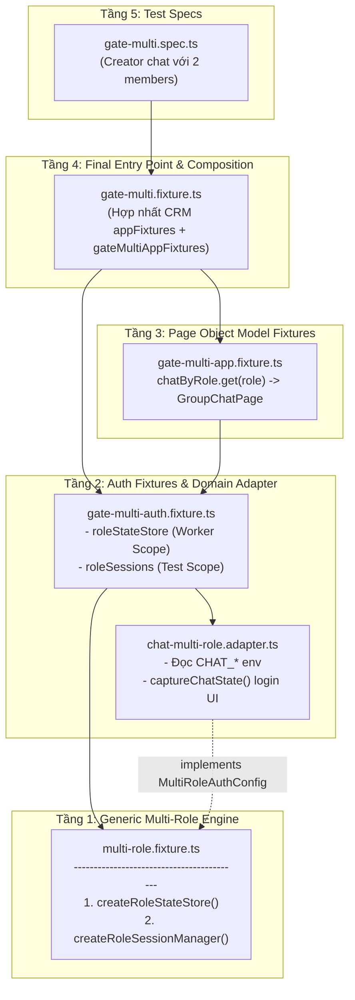
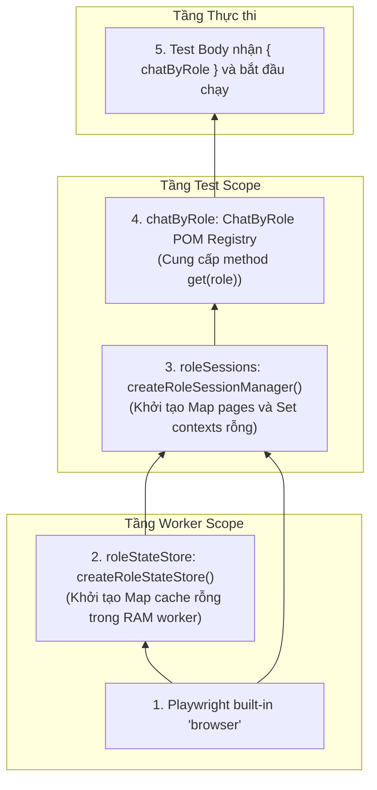
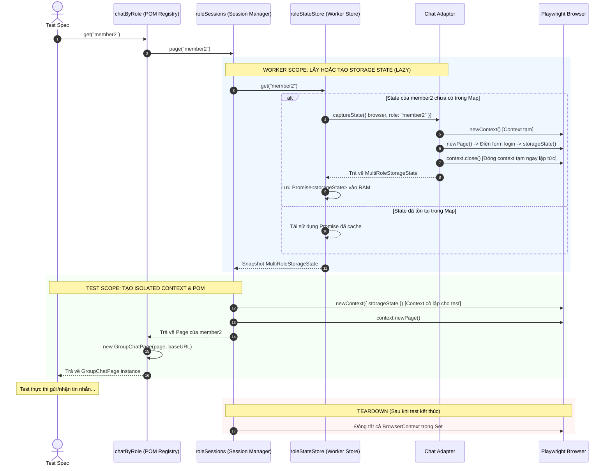
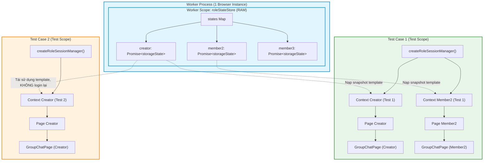
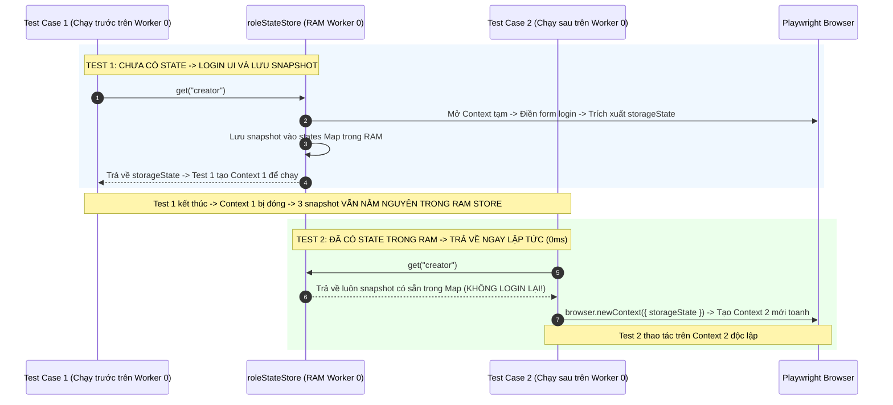
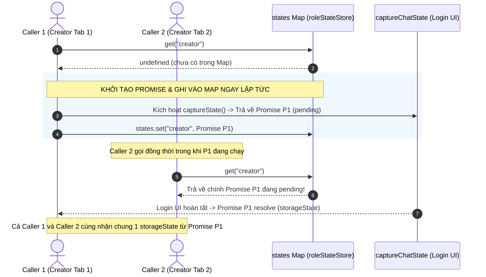

# Kiến trúc Multi-Role Testing

Kiến trúc kiểm thử đồng thời nhiều vai trò người dùng (Multi-Role / Multi-Identity) trong cùng một test case, kết hợp giữa **Generic Engine** tái sử dụng và **Application Adapter** chuyên biệt.

---

## 1. Vấn đề đặt ra & Động lực thiết kế

### 1.1. Các thách thức lớn khi kiểm thử Multi-Role (Pain Points)

Khi xây dựng các kịch bản kiểm thử tương tác đa người dùng (ví dụ: **Group Chat** giữa 3 tài khoản, **Quy trình Phê duyệt** giữa Admin - Seller - Customer, hoặc **Phân quyền**):

1. **Xung đột phiên làm việc (Session & Cookie Pollution)**:
   * Nếu dùng trình duyệt mặc định, khi Role B đăng nhập sẽ ghi đè Cookie/LocalStorage của Role A.
   * Playwright hỗ trợ `BrowserContext` để cô lập, nhưng nếu tự viết logic tạo/đóng context thủ công trong từng test spec thì code sẽ cực kỳ cồng kềnh, phân mảnh và dễ rò rỉ bộ nhớ.
2. **Chi phí thời gian Login UI bùng nổ (Exponential Execution Time)**:
   * Mỗi thao tác Login UI (điền form, submit, chờ redirect) mất trung bình **2 – 5 giây**.
   * Trong kịch bản chat 3 vai (Creator + 2 Members), nếu mỗi test case đều phải tự login UI cho cả 3 tài khoản:
     ```text
     Thời gian Login = (Số lượng test) x (Số lượng role) x (Thời gian login 1 lần)
     Ví dụ: 10 test x 3 roles x 3s = 90 giây.
     ```
     Chỉ với **10 test case**, test suite sẽ mất gần **90 giây chỉ để mở form đăng nhập**.
3. **Trùng lặp mã hạ tầng (Infrastructure Code Duplication)**:
   * Nếu viết logic cache state và session manager gắn chặt vào ứng dụng Chat, khi mở rộng sang module CRM, E-Commerce hay Admin Portal, lập trình viên sẽ phải copy-paste toàn bộ code hạ tầng đó sang nơi mới.
4. **Sự cứng nhắc của Hardcoded Fixtures**:
   * Cách làm truyền thống là định nghĩa các fixture có tên cố định (`creatorPage`, `member2Page`, `member3Page`). Cách này thất bại khi số lượng vai trò thay đổi động (ví dụ: test một group chat có 5 hoặc 10 thành viên lặp qua mảng dữ liệu).

---

### 1.2. Ý tưởng cốt lõi: Phân tách Generic Engine & Application Adapter

Để giải quyết triệt để các vấn đề trên, kiến trúc được thiết kế theo mô hình **Plug & Play (Cắm và Chạy)** gồm 2 phần tách biệt:

1. **Generic Engine (`multi-role.fixture.ts`)**:
   * Đóng vai trò là **khung hạ tầng dùng chung (Zero Business Logic)**.
   * Chịu trách nhiệm: Quản lý cache snapshot trong RAM của Worker, In-flight Promise caching chống race condition, khởi tạo và tự động dọn dẹp `BrowserContext` cho từng test.
   * Hoàn toàn không biết URL, selector hay cách login của bất kỳ ứng dụng nào.
2. **Application Adapter (`chat-multi-role.adapter.ts`)**:
   * Đóng vai trò là **bản cắm nghiệp vụ chuyên biệt**.
   * Chịu trách nhiệm: Khai báo danh sách role (`creator`, `member2`, `member3`), đọc biến môi trường `CHAT_*`, và thực thi các bước login UI trên form của ứng dụng đó.

---

### 1.3. 5 Lợi ích kỹ thuật đạt được (Key Benefits & ROI)

1. ⚡ **Tối ưu tốc độ vượt bậc**:
   * Giảm số lần login UI từ `(Số test x Số role)` xuống tối đa **`(Số worker x Số role)`** (mỗi worker chỉ login đúng 1 lần duy nhất cho mỗi role).
   * Nhờ cơ chế In-flight Promise Caching, các role được login song song và tái sử dụng ngay lập tức cho các test kế tiếp trên cùng worker.
2. 🛡️ **Cô lập phiên tuyệt đối (100% Test Isolation)**:
   * Dữ liệu lưu trong RAM worker chỉ là snapshot template dạng chỉ đọc.
   * Mỗi test case nhận các `BrowserContext` hoàn toàn mới toanh. Mọi thay đổi cookie/localStorage trong Test 1 không bao giờ bị rò rỉ sang Test 2.
3. 🔄 **Tái sử dụng 100% (Zero Code Duplication)**:
   * Khi cần test một hệ thống mới (ví dụ E-Commerce với `admin`, `seller`, `customer`), bạn **chỉ cần viết 1 file Adapter ~40 dòng code**. Toàn bộ Engine generic giữ nguyên 100%.
4. 🧩 **Hỗ trợ Role Động (Dynamic Scalability)**:
   * POM Registry `chatByRole.get(role)` nhận role linh hoạt từ biến, mảng dữ liệu hoặc API (`memberRoles.map(r => chatByRole.get(r))`), không bị giới hạn bởi tên fixture cứng.
5. 🧹 **Không rác ổ đĩa & An toàn bảo mật (Clean In-Memory)**:
   * State nằm hoàn toàn trong RAM của tiến trình worker, tự giải phóng khi worker tắt.
   * Không tạo các file `.auth/*.json` tạm thời trên đĩa, loại bỏ nguy cơ vô tình commit cookie/token nhạy cảm lên Git.

---

## 2. Trạng thái & Cơ chế State hiện tại

Hệ thống hiện tại quản lý trạng thái xác thực trong bộ nhớ **RAM của từng Worker process**, không sử dụng Playwright Project Dependencies dạng ghi file JSON:

* Không phụ thuộc vào `setup` project trong `playwright.config.ts` để ghi các file `creator.json`, `member2.json`, `member3.json` ra ổ đĩa trước khi chạy test.
* Trạng thái đăng nhập được khởi tạo thông qua UI login, lưu dưới dạng object snapshot `MultiRoleStorageState` trong RAM của từng worker và tự động giải phóng khi worker kết thúc.

```text
Biến môi trường CHAT_*
  -> Chat Adapter thực hiện login UI trong context tạm
  -> context.storageState() trích xuất object (Cookies + LocalStorage)
  -> roleStateStore lưu trữ Promise<MultiRoleStorageState> trong RAM worker
  -> roleSessions khởi tạo BrowserContext độc lập cho từng test case
  -> Page
  -> GroupChatPage (POM)
```

### Cú pháp trích xuất Type Snapshot tự động:
```ts
export type MultiRoleStorageState = Awaited<
  ReturnType<BrowserContext["storageState"]>
>;
```
Cú pháp này bóc tách kiểu dữ liệu trả về từ hàm `context.storageState()` của Playwright qua 3 bước:
1. `BrowserContext["storageState"]` (Indexed Access): Lấy type của hàm `storageState`.
2. `ReturnType<...>` (Utility Type): Lấy kiểu giá trị trả về của hàm (`Promise<{ cookies: Cookie[]; origins: Origin[] }>`).
3. `Awaited<...>` (Utility Type): Bóc tách Promise để nhận về kiểu object thực tế bên trong.

*Lợi ích*: Đảm bảo Type luôn tự động đồng bộ khi Playwright cập nhật cấu trúc `storageState` mà không cần định nghĩa lại interface thủ công.

---

## 3. Sơ đồ phân tầng kiến trúc (Layered Architecture)

Toàn bộ hệ thống được phân rã thành **5 tầng** tuân thủ nguyên tắc tách biệt mối quan tâm (Separation of Concerns):



---

## 4. Vai trò & Hoạt động chi tiết của 5 Tầng Kiến Trúc

### 4.1. Tầng 1: Generic Multi-Role Engine (`multi-role.fixture.ts`)
* **Bản chất**: Lõi hạ tầng (Infrastructure Core), hoàn toàn không chứa bất kỳ logic nghiệp vụ, URL, selector hay credential nào.
* **Vai trò & Trách nhiệm**:
  1. **Quản lý Cache State ở Worker Scope (`createRoleStateStore`)**:
     - Nhận vào `browser` và cấu hình adapter `MultiRoleAuthConfig<Role>`.
     - Lưu trữ snapshot trạng thái xác thực trong `Map<Role, Promise<MultiRoleStorageState>>`.
     - **In-flight Promise Caching**: Khi nhiều caller cùng yêu cầu 1 role đồng thời, cả hai cùng await 1 Promise login, đảm bảo quy trình login UI chỉ chạy đúng 1 lần trên worker.
     - **Runtime Role Validation**: Sử dụng `Set<Role>` để chặn đứng các role không hợp lệ trước khi thực thi.
  2. **Quản lý Vòng đời Context & Page ở Test Scope (`createRoleSessionManager`)**:
     - Nhận vào `browser` và `stateStore`.
     - Cung cấp method `page(role)` để tạo một `BrowserContext` cô lập hoàn toàn cho từng role trong từng test case, nạp snapshot `storageState` tương ứng từ worker store.
     - Theo dõi `Set<BrowserContext>` và cung cấp hàm `close()` để tự động dọn dẹp (teardown) sạch sẽ toàn bộ context khi test kết thúc, chống rò rỉ bộ nhớ.
* **Tại sao tách riêng**: Đảm bảo engine có thể tái sử dụng 100% cho bất kỳ ứng dụng nào khác (CRM, E-Commerce, Admin Portal) mà không cần viết lại cơ chế cache hay quản lý session.

---

### 3.2. Tầng 2: Domain Adapter & Auth Bridge
Tầng này gồm 2 file phối hợp chặt chẽ:

#### A. Domain Adapter (`chat-multi-role.adapter.ts`)
* **Bản chất**: Lớp triển khai nghiệp vụ đăng nhập riêng cho ứng dụng Neko Coffee Chat.
* **Vai trò & Trách nhiệm**:
  - Định nghĩa tập role hợp lệ của Chat: `["creator", "member2", "member3"]`.
  - Đọc thông tin xác thực từ biến môi trường tương ứng: `CHAT_CREATOR_USERNAME`, `CHAT_MEMBER2_PASSWORD`,...
  - Hàm `captureChatState()`: Mở context tạm → điền form đăng nhập → xử lý captcha → submit → xác nhận tiêu đề "Thành công!" → truy cập `/chat` → chụp `context.storageState()` → đóng context tạm.

#### B. Auth Bridge (`gate-multi-auth.fixture.ts`)
* **Bản chất**: Tầng tích hợp nối chuỗi `auth` của Playwright với Generic Engine và Chat Adapter.
* **Vai trò & Trách nhiệm**:
  - Đăng ký `roleStateStore` vào Worker Scope thông qua `createRoleStateStore(browser, chatMultiRoleAuthConfig)`.
  - Đăng ký `roleSessions` vào Test Scope thông qua `createRoleSessionManager(browser, roleStateStore)` kèm khối `finally { await sessions.close(); }`.
  - Cung cấp compatibility wrappers (`creatorAuthedPage`, `member2AuthedPage`, `member3AuthedPage`) để giữ tương thích ngược cho test cũ.

---

### 3.3. Tầng 3: Page Object Model Fixtures (`gate-multi-app.fixture.ts`)
* **Bản chất**: Lớp trừu tượng hóa giao diện người dùng (UI Abstraction Layer) cấp ứng dụng.
* **Vai trò & Trách nhiệm**:
  - Cung cấp POM Registry động `chatByRole`:
    ```ts
    const creatorChat = await chatByRole.get("creator");
    const memberChat = await chatByRole.get(roleFromData);
    ```
  - Chuyển đổi từ Playwright `Page` (`await roleSessions.page(role)`) thành instance Page Object Model `GroupChatPage`.
  - Quản lý Map cache cục bộ `pages: Map<GateMultiRole, Promise<GroupChatPage>>` trong phạm vi từng test case để đảm bảo mỗi role chỉ tạo đúng 1 instance POM trong cùng 1 test.
* **Tại sao tách riêng**: Tách biệt hoàn toàn việc quản lý Context/Page của trình duyệt (Tầng Auth/Session) khỏi các thao tác click, fill, assert trên DOM (Tầng POM).

---

### 4.4. Tầng 4: Final Entry Point & Composition (`gate-multi.fixture.ts`)
* **Bản chất**: Cổng tích hợp duy nhất (Single Aggregation Gateway) cho test suite.
* **Vai trò & Trách nhiệm**:
  - Ghép nối tất cả các nhóm fixture vào một đối tượng `test` mở rộng duy nhất:
    - **CRM Base**: `loginPage`, `authedPage`, `dashboardPage`, `customerPage`, `newCustomerPage`
    - **Multi-Role Chat**: `roleSessions`, `chatByRole`, và các wrapper tương thích
  - **Tận dụng Lazy Fixture Graph của Playwright**: Spec chỉ cần import từ 1 file duy nhất (`gate-multi.fixture.ts`), nhưng Playwright chỉ resolve đúng các fixture mà test đó destructure trong tham số.

---

### 4.5. Tầng 5: Test Specs (`gate-multi.spec.ts`)
* **Bản chất**: Kịch bản kiểm thử nghiệp vụ thời gian thực (Real-time Business Test Scenario).
* **Vai trò & Trách nhiệm**:
  - Chỉ tập trung vào luồng nghiệp vụ kiểm thử: Creator tạo phòng, mời 2 member, gửi nhận tin nhắn 3 chiều.
  - Hoàn toàn độc lập với chi tiết kỹ thuật: Không cần biết cách login, không cần tự tạo `BrowserContext` hay quản lý cookies.
  - Thực hiện dọn dẹp dữ liệu nghiệp vụ thông qua khối `finally { await creatorChatPage.deleteRoom(); }`.

---

## 5. Sơ đồ Dependency & Luồng phân giải Fixture (Fixture Dependency Graph)

Khi một test case bắt đầu thực thi với callback:
```ts
test("Creator chat với hai member trong cùng group", async ({ chatByRole }) => { ... });
```

Quá trình phân giải đồ thị phụ thuộc (Dependency Resolution) diễn ra như sau:

### 5.1. Phân tích tham số hàm (Static Destructuring Analysis)
Playwright phân tích cú pháp (AST) của tham số test và nhận biết test này **chỉ yêu cầu `chatByRole`**. Các fixture khác (`dashboardPage`, `customerPage`, `loginPage`,...) lập tức bị bỏ qua, không tốn tài nguyên khởi tạo.

### 5.2. Thứ tự dựng các nút trong đồ thị:

```text
spec (yêu cầu { chatByRole })
  -> test từ gate-multi.fixture.ts
    -> [Test Scope] chatByRole (POM Registry)
      -> [Test Scope] roleSessions (Quản lý BrowserContext & Page)
        -> [Worker Scope] roleStateStore (Cache RAM Promise<storageState>)
          -> [Domain Adapter] chatMultiRoleAuthConfig
            -> [Worker Scope Built-in] browser
```



> [!IMPORTANT]
> 1. **Khởi tạo rỗng**: Ở giai đoạn resolve dependency graph này, `roleStateStore` và `roleSessions` chỉ được tạo với các Map/Set rỗng. **Chưa có bất kỳ form login UI nào được mở**.
> 2. **Ranh giới Scope**: `Page`, `BrowserContext` và `POM` **không bao giờ đặt ở Worker scope**. Chỉ duy nhất snapshot dữ liệu đăng nhập (`MultiRoleStorageState`) được cache trong RAM của worker.

---

## 6. Cơ chế Lazy Loading 2 tầng (Dual Lazy Evaluation)

### 6.1. Tầng 1: Lazy Fixture Graph (Playwright Engine)

Nếu test case chỉ yêu cầu fixture CRM cũ:
```ts
test("CRM Dashboard", async ({ dashboardPage }) => { ... });
```
Playwright chỉ resolve nhánh dependency của CRM. Toàn bộ `chatByRole`, `roleSessions` và `roleStateStore` **hoàn toàn không được khởi tạo**. Test không yêu cầu cấu hình các biến môi trường `CHAT_*`.

Khi test yêu cầu `chatByRole`, Playwright mới dựng cây phụ thuộc:
```text
chatByRole -> roleSessions -> roleStateStore -> browser
```

### 6.2. Tầng 2: Lazy theo Role bên trong Worker Store

Khi `roleStateStore` đã tồn tại, việc đăng nhập cho từng role vẫn chưa xảy ra. Login UI chỉ kích hoạt khi code thực sự gọi đến role đó:

```ts
await chatByRole.get("creator");
// hoặc
await roleSessions.page("creator");
```

Store kiểm tra `Map<Role, Promise<MultiRoleStorageState>>`:
```text
Role chưa có trong Map -> Gọi adapter captureState -> Lưu Promise vào Map
Role đã có trong Map   -> Trả về Promise đã cache
```

Nếu test chỉ sử dụng role `creator`, hai role `member2` và `member3` sẽ **không bao giờ thực hiện login**.

---

## 7. Sơ đồ Sequence: Luồng thực thi chi tiết từ Spec đến DOM



---

## 8. Lifecycle & Phân định Scope (Worker vs Test)



### 8.1. Bảng phân định Scope và Vòng đời:

| Thành phần | Scope | Số instance & Vòng đời |
|---|---|---|
| Built-in `browser` | **Worker** | 1 instance duy nhất cho mỗi worker process. |
| `roleStateStore` | **Worker** | 1 store duy nhất cho mỗi worker cần multi-role. |
| Snapshot State của Role | **Worker RAM** | Tối đa 1 Promise/state cho mỗi role trên mỗi worker. |
| `roleSessions` | **Test** | 1 session manager mới cho từng test case. |
| `BrowserContext` của Role | **Test** | 1 context riêng cho mỗi role được yêu cầu trong test. |
| `Page` chính của Role | **Test** | 1 page riêng cho mỗi role được yêu cầu trong test. |
| `chatByRole` (POM Registry) | **Test** | 1 registry cho mỗi test case. |
| `GroupChatPage` (POM) | **Test** | 1 instance POM tương ứng với Page của role trong test. |

Ví dụ 10 test case cùng chạy trên 1 worker và đều cần `creator`:
```text
Creator login UI:     1 lần duy nhất
Creator state:        1 object template trong RAM worker
BrowserContext:      10 context độc lập (mỗi test 1 context)
Page / POM:          10 bộ độc lập
```

### 8.2. Cơ chế tái sử dụng Snapshot giữa các Test kế tiếp nhau (Zero-Re-Login Caching)

Khi các bài test kế tiếp trên cùng một Worker process gọi `chatByRole.get(role)` (hoặc `roleSessions.page(role)`), hệ thống sẽ **trả về snapshot từ RAM ngay lập tức (0ms)** mà **hoàn toàn không mở lại form login UI**:



#### So sánh thời gian thực thi qua các bài test:

| Bài Test trên cùng Worker | Hành vi xử lý của Role `creator` | Thời gian chuẩn bị Auth |
|---|---|---|
| **Test 1** (Test đầu tiên) | Mở form login UI → Điền form → Lưu snapshot RAM | **~2.5 giây** |
| **Test 2** (Test kế tiếp) | Lấy snapshot từ RAM (0ms) → Mở Context mới | **~10 mili-giây** (Nhanh gấp 250 lần) |
| **Test 3** (Test kế tiếp) | Lấy snapshot từ RAM (0ms) → Mở Context mới | **~10 mili-giây** |

---

## 9. Cơ chế In-flight Promise Caching & Concurrency

### 9.1. Vấn đề: Tại sao lưu `Promise<MultiRoleStorageState>` mà không lưu trực tiếp `MultiRoleStorageState`?

Nếu lưu trực tiếp object `MultiRoleStorageState` sau khi `await`, hệ thống sẽ gặp lỗi nghiêm trọng về **Race Condition (Xung đột đồng thời)**:

#### ❌ Cách làm sai: Settled Object Caching
```ts
// Giả sử lưu trực tiếp object sau khi login xong:
class WrongStore {
  private states = new Map<Role, MultiRoleStorageState>();

  async get(role: Role): Promise<MultiRoleStorageState> {
    if (this.states.has(role)) {
      return this.states.get(role)!;
    }

    // Login UI mất 2-3 giây:
    const state = await config.captureState({ browser, role });
    this.states.set(role, state); // Chỉ lưu khi ĐÃ LOGIN XONG!
    return state;
  }
}
```
**Hậu quả**: Khi test gọi đồng thời `Promise.all([ store.get("creator"), store.get("creator") ])`:
1. Lời gọi 1 kiểm tra `states.has("creator")` → `false` → bắt đầu mở form login (đang chờ 2s).
2. Lời gọi 2 kiểm tra `states.has("creator")` ngay sau đó → vẫn là `false` (vì lời gọi 1 chưa xong) → **cũng bắt đầu mở form login thứ hai!**
3. Kết quả: 2 trình duyệt cùng mở ra login đè lên nhau, gây lãng phí tài nguyên và xung đột phiên (Thundering Herd / Race Condition).

---

#### ✅ Cách làm đúng: In-flight Promise Caching
```ts
// Lưu Promise NGAY LẬP TỨC trước khi await:
export function createRoleStateStore<Role extends string>(
  browser: Browser,
  config: MultiRoleAuthConfig<Role>,
): RoleStateStore<Role> {
  const states = new Map<Role, Promise<MultiRoleStorageState>>();

  return {
    get(role) {
      const oldState = states.get(role);
      if (oldState) return oldState; // Nếu đã có Promise (đang chạy hoặc đã xong) -> Trả về ngay

      // Bắt đầu login và LƯU PROMISE VÀO MAP NGAY LẬP TỨC:
      const newState = config.captureState({ browser, role });
      states.set(role, newState);
      return newState;
    },
  };
}
```



### 9.2. Ưu điểm của In-flight Promise Caching
1. **Triệt tiêu Race Condition**: Bất kể có bao nhiêu caller gọi cùng một role tại cùng một thời điểm, chỉ có đúng **1 BrowserContext tạm** được mở để login UI.
2. **Tiết kiệm thời gian test**: Các caller gọi sau chỉ việc "nghe ké" kết quả từ Promise đang bay (in-flight) mà không cần tạo thêm tác vụ login mới.

---

## 10. Phân phối Scheduler và Tính Độc lập của Worker

Không cần test mồi (`test.beforeAll` giả lập) để khởi tạo state trước. Playwright Test Scheduler tự phân phối test đến các worker:

```text
Worker 0: Test A (không chat), Test B (creator), Test C (creator + member2)
          Test A: không khởi tạo multi-role fixture.
          Test B: login creator (1 lần).
          Test C: tái sử dụng state creator, login thêm member2 (1 lần).

Worker 1: Test D (member3), Test E (member3)
          Test D: login member3 trong store riêng của Worker 1.
          Test E: tái sử dụng state member3.

Worker 2: Test F (chỉ test CRM)
          Không khởi tạo roleStateStore vì dependency graph không chạm tới multi-role.
```

---

## 11. API Dynamic theo Role (`chatByRole.get`)

### 11.1. Khởi tạo role động theo nhu cầu

```ts
// Lấy Page theo role động
const role: GateMultiRole = "member2";
const page = await roleSessions.page(role);

// Lấy POM theo role động
const memberRoles: readonly GateMultiRole[] = ["member2", "member3"];
const [member2Chat, member3Chat] = await Promise.all(
  memberRoles.map((r) => chatByRole.get(r))
);
```

Không có fixture Page/POM cố định cho từng role. Test luôn truyền role vào
`roleSessions.page(role)` hoặc `chatByRole.get(role)`. Nhờ vậy, thêm role mới
không làm thay đổi contract fixture.

---

## 12. So sánh: In-Memory Worker Store vs Project Dependencies

| Tiêu chí | In-Memory Worker Store (`multi-role.fixture.ts`) | Project Dependencies (`setup project`) |
|---|---|---|
| **Vị trí lưu trữ** | RAM của tiến trình worker | File JSON trên ổ đĩa (`playwright/.auth/*.json`) |
| **Số lần Login UI** | Tối đa 1 lần / mỗi role / trên 1 Worker | Đúng 1 lần duy nhất cho toàn bộ test suite |
| **Môi trường đa Worker** | Các worker cùng cần 1 role sẽ login 1 lần độc lập trên mỗi worker | Các worker cùng đọc chung file JSON tĩnh mà không login lại |
| **Dọn dẹp** | Tự hủy khi Worker kết thúc | Cần cấu hình xóa file auth / `.gitignore` |
| **Rủi ro xung đột** | Không có: Các worker hoàn toàn độc lập | Cần chú ý nếu có test làm logout/hết hạn phiên |
| **Context Isolation** | Test fixture tạo context mới cho từng test | Test fixture tạo context mới cho từng test |

---

## 13. Mẫu triển khai cho ứng dụng mới (Plug & Play Template)

Khi bổ sung multi-role cho một ứng dụng mới (ví dụ E-Commerce với các role `admin`, `seller`, `customer`), chỉ cần cung cấp adapter và mở rộng fixture mà không sửa engine:

```ts
import { test as base } from "@playwright/test";
import {
  createRoleSessionManager,
  createRoleStateStore,
  type MultiRoleAuthConfig,
  type MultiRoleTestFixtures,
  type MultiRoleWorkerFixtures,
} from "./multi-role.fixture";

const COMMERCE_ROLES = ["admin", "seller", "customer"] as const;
type CommerceRole = (typeof COMMERCE_ROLES)[number];

const commerceConfig: MultiRoleAuthConfig<CommerceRole> = {
  name: "E-Commerce App",
  roles: COMMERCE_ROLES,
  captureState: async ({ browser, role }) => {
    const context = await browser.newContext();
    try {
      const page = await context.newPage();
      await page.goto("https://shop.test/login");
      await page.fill("#username", process.env[`SHOP_${role.toUpperCase()}_USER`]!);
      await page.fill("#password", process.env[`SHOP_${role.toUpperCase()}_PASS`]!);
      await page.click("#login-button");
      await page.waitForURL("**/dashboard");
      return await context.storageState();
    } finally {
      await context.close();
    }
  },
};

export const test = base.extend<
  MultiRoleTestFixtures<CommerceRole>,
  MultiRoleWorkerFixtures<CommerceRole>
>({
  roleStateStore: [
    async ({ browser }, use) => {
      await use(createRoleStateStore(browser, commerceConfig));
    },
    { scope: "worker" },
  ],

  roleSessions: async ({ browser, roleStateStore }, use) => {
    const sessions = createRoleSessionManager(browser, roleStateStore);
    try {
      await use(sessions);
    } finally {
      await sessions.close();
    }
  },
});
```
