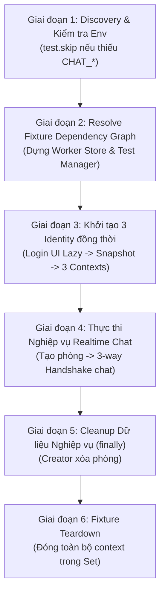
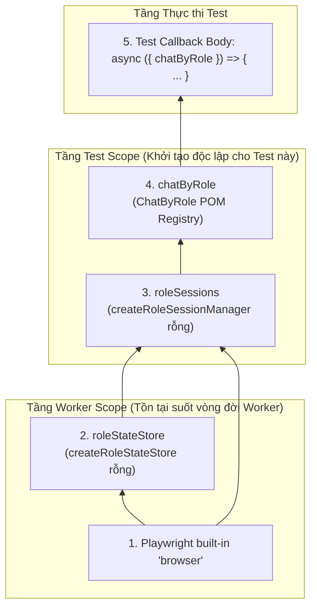
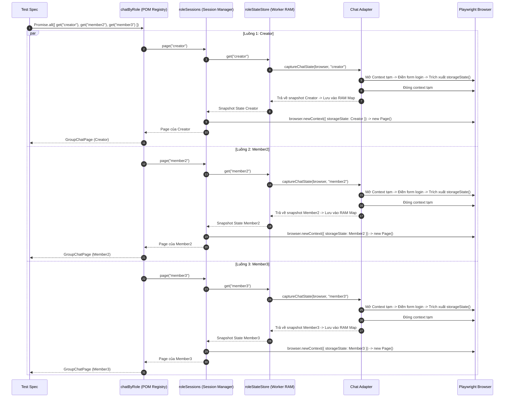
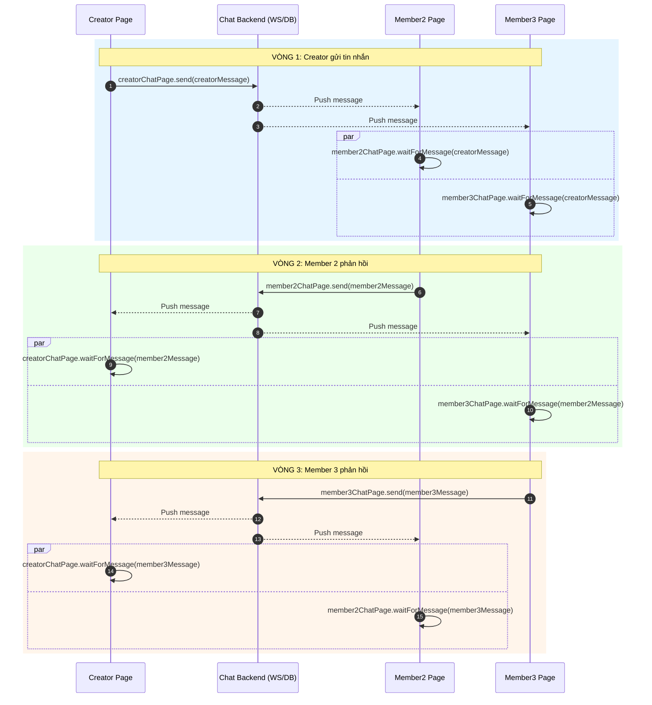

# Multi-Role Spec Execution Flow

Chi tiết luồng thực thi khi Playwright chạy test spec `gate-multi.spec.ts` (`modules/1-basics/03-pom/CRM/specs/gate-multi.spec.ts`).

---

## 1. Vòng đời thực thi 6 giai đoạn



---

## 2. Chi tiết từng giai đoạn trong `gate-multi.spec.ts`

### Giai đoạn 1: Discovery & Kiểm tra điều kiện môi trường

```ts
// gate-multi.spec.ts
const REQUIRED_GATE_MULTI_ENV = [
  "CHAT_BASE_URL",
  "CHAT_CREATOR_USERNAME", "CHAT_CREATOR_PASSWORD",
  "CHAT_MEMBER2_USERNAME", "CHAT_MEMBER2_PASSWORD",
  "CHAT_MEMBER3_USERNAME", "CHAT_MEMBER3_PASSWORD",
] as const;

const missingGateMultiEnv = REQUIRED_GATE_MULTI_ENV.filter(
  (name) => !process.env[name],
);

test.skip(
  missingGateMultiEnv.length > 0,
  `Thiếu Gate Multi env: ${missingGateMultiEnv.join(", ")}`,
);
```

* **Test Discovery**: File spec không throw error ở cấp độ module để Playwright CLI luôn liệt kê được test.
* **Graceful Skip**: Nếu thiếu biến môi trường trong `.env`, test được đánh dấu `Skipped` mà không gây ảnh hưởng đến các test CRM khác.

---

### Giai đoạn 2: Phân tích & Khởi tạo Cây Phụ thuộc Fixture (Resolve Fixture Dependency Graph)

Khi Playwright Test Runner bắt đầu thực thi test case:
```ts
test("Creator chat với hai member trong cùng group", async ({ chatByRole }) => {
  // Test Body...
});
```

Quá trình dựng cây phụ thuộc diễn ra qua các bước kỹ thuật chính xác sau:

#### 1. Phân tích tham số hàm (Static Destructuring Analysis)
* Playwright đọc định nghĩa của hàm test và phân tích cú pháp (AST) để biết test case này **chỉ yêu cầu duy nhất fixture `chatByRole`**.
* Toàn bộ các fixture khác trong hệ thống như `dashboardPage`, `customerPage`, `loginPage`, `authedPage`... bị **bỏ qua hoàn toàn**, không tốn tài nguyên khởi tạo.

#### 2. Dựng đồ thị phụ thuộc (Topological Dependency Graph)
Playwright truy ngược từ lá đến gốc để tìm tất cả các dependency cần thiết:



#### 3. Thứ tự kích hoạt từng nút trong đồ thị:

* **Bước 2.1: Worker Scope - Khởi tạo `roleStateStore`**:
  - Playwright kiểm tra xem Worker process hiện tại đã có `roleStateStore` chưa.
  - Nếu chưa có (test đầu tiên chạy trên worker), Playwright thực thi:
    ```ts
    const store = createRoleStateStore(browser, chatMultiRoleAuthConfig);
    ```
  - Store này tạo ra một `states = new Map<Role, Promise<storageState>>()` **hoàn toàn rỗng** trong bộ nhớ RAM của worker.
  - ⚠️ **Lưu ý quan trọng**: Tại thời điểm này, **CHƯA CÓ BẤT KỲ THAO TÁC LOGIN UI NÀO DIỄN RA**. Không có form đăng nhập nào được mở.

* **Bước 2.2: Test Scope - Khởi tạo `roleSessions`**:
  - Playwright cấp phát một session manager mới toanh cho riêng test case này:
    ```ts
    const sessions = createRoleSessionManager(browser, roleStateStore);
    ```
  - `sessions` khởi tạo với `pages = new Map()` và `contexts = new Set()` rỗng, sẵn sàng quản lý các tab trình duyệt độc lập.

* **Bước 2.3: Test Scope - Khởi tạo POM Registry `chatByRole`**:
  - Playwright khởi tạo object registry `chatByRole`:
    ```ts
    const pages = new Map<GateMultiRole, Promise<GroupChatPage>>();
    const registry: ChatByRole = {
      get(role) { ... }
    };
    ```

* **Bước 2.4: Inject `chatByRole` vào tham số test**:
  - Đối tượng `chatByRole` được truyền vào tham số của hàm test.
  - Quyền điều khiển được trao cho dòng code đầu tiên của Test Body.

#### 4. Quy tắc quyết định thực thi giữa các Test Case trên Worker:

* **Kịch bản A: Test đầu tiên chạy trên Worker (cần `chatByRole`)**:
  Playwright chạy đầy đủ từ **Bước 2.1** (khởi tạo store worker) → **Bước 2.2** (khởi tạo session manager test) → **Bước 2.3** → **Bước 2.4**.

* **Kịch bản B: Test thứ hai trở đi trên CÙNG Worker đó (cũng cần `chatByRole`)**:
  Do `roleStateStore` mang phạm vi **Worker Scope** (đã tồn tại sẵn trong RAM từ test trước):
  - Playwright **BỎ QUA HOÀN TOÀN Bước 2.1**.
  - Playwright nhảy thẳng vào **Bước 2.2** (cấp phát `roleSessions` mới toanh cho test mới) → **Bước 2.3** → **Bước 2.4**.
  - Snapshot `storageState` đã lưu trong RAM ở test trước được tái sử dụng ngay lập tức mà không phải chạy lại login UI.

* **Kịch bản C: Test CRM độc lập (chỉ xin `dashboardPage`)**:
  Playwright phát hiện tham số không chứa `chatByRole` → **Bỏ qua toàn bộ các bước 2.1, 2.2, 2.3**, không khởi tạo `roleStateStore` và không yêu cầu cấu hình các biến môi trường `CHAT_*`.

---

### Giai đoạn 3: Khởi tạo 3 Identity đồng thời (`Promise.all`)

```ts
// gate-multi.spec.ts
const creatorRole: GateMultiRole = "creator";
const memberRoles: readonly GateMultiRole[] = ["member2", "member3"];

const [creatorChatPage, member2ChatPage, member3ChatPage] =
  await Promise.all([
    chatByRole.get(creatorRole),
    ...memberRoles.map(async (role) => chatByRole.get(role)),
  ]);
```

Tại dòng lệnh này, Playwright kích hoạt **3 luồng khởi tạo song song** cho cả 3 vai trò.

---

#### 1. Diễn biến bộ nhớ RAM của Worker Store: Từ Rỗng đến Đủ 3 Snapshot State

* **Trước khi gọi `Promise.all`**:
  Store trong RAM Worker hoàn toàn rỗng:
  ```text
  roleStateStore.states Map = { } (0 state)
  ```

* **Trong quá trình thực thi `Promise.all`**:
  3 lời gọi `chatByRole.get()` đồng thời yêu cầu 3 role. Ngay khi bắt đầu login, 3 Promise pending được đưa ngay vào Map:
  ```text
  roleStateStore.states Map = {
    "creator" => Promise P1 (đang login UI),
    "member2" => Promise P2 (đang login UI),
    "member3" => Promise P3 (đang login UI)
  }
  ```

* **Sau khi `Promise.all` hoàn tất**:
  3 luồng login UI kết thúc thành công. `roleStateStore` trong RAM Worker chính thức lưu trữ **đủ 3 snapshot `MultiRoleStorageState`**:
  ```text
  roleStateStore.states Map (Bộ nhớ RAM Worker)
  ├── "creator" => { cookies: [session_creator], origins: [...] }
  ├── "member2" => { cookies: [session_member2], origins: [...] }
  └── "member3" => { cookies: [session_member3], origins: [...] }
  ```
  *(3 snapshot này được giữ nguyên trong suốt vòng đời của Worker để các test tiếp theo tái sử dụng tức thì mà không cần login lại)*.

---

#### 2. Sơ đồ Sequence: 3 luồng thực thi song song (3-Way Parallel Auth Flow)



---

#### 3. Bảng tổng kết tài nguyên sau khi Giai đoạn 3 hoàn tất:

| Phạm vi (Scope) | Tài nguyên được cấp phát | Trạng thái hiện tại |
|---|---|---|
| **Worker Scope (RAM)** | `roleStateStore.states` | **Đủ 3 snapshot state**: `creator`, `member2`, `member3` |
| **Test Scope (Trình duyệt)** | `BrowserContext` | **3 Context hoàn toàn độc lập**: Cô lập cookie/session riêng biệt |
| **Test Scope (Tab giao diện)** | `Page` | **3 Page riêng biệt**: Tab của Creator, Tab của Member2, Tab của Member3 |
| **Test Scope (POM)** | `GroupChatPage` | **3 instance POM**: `creatorChatPage`, `member2ChatPage`, `member3ChatPage` |

---

### Giai đoạn 4: Thực thi Nghiệp vụ Realtime Chat

#### 4.1. Mở trang Chat đồng thời
```ts
await Promise.all([
  creatorChatPage.open(),
  member2ChatPage.open(),
  member3ChatPage.open(),
]);
```
3 context cùng truy cập `/chat`. Snapshot state đã nạp sẵn cookie và localStorage nên trang vào trực tiếp giao diện chat mà không qua trang login.

#### 4.2. Creator tạo phòng & Mời 2 Member
```ts
roomId = await creatorChatPage.createGroup(roomName, memberUsernames);
expect(roomId).toBeGreaterThan(0);
```
Creator mở dialog tạo nhóm, nhập tên kèm timestamp, tìm kiếm `@member2_username` và `@member3_username` rồi xác nhận. POM lấy `roomId` từ `data-testid="chat-room-<ID>"`.

#### 4.3. Các Role mở phòng Chat
```ts
await Promise.all([
  creatorChatPage.openRoom(roomId),
  member2ChatPage.openRoom(roomId),
  member3ChatPage.openRoom(roomId),
]);
```
Backend đẩy danh sách phòng mới qua WebSocket/Polling đến `member2` và `member3`. Cả 3 bên cùng mở phòng `roomId`.

#### 4.4. Luồng gửi nhận tin nhắn & Assert 3 chiều



Xác minh tin nhắn hiển thị trên UI bằng locator:
```ts
// GroupChatPage.ts
this.page.getByTestId("chat-messages").getByText(content, { exact: true })
```

---

### Giai đoạn 5: Cleanup dữ liệu nghiệp vụ (`finally`)

```ts
// gate-multi.spec.ts
} finally {
  if (roomId !== undefined) {
    await creatorChatPage.deleteRoom();
  }
}
```
Creator thực hiện xóa phòng trong khối `finally` để đảm bảo dữ liệu test luôn được dọn dẹp kể cả khi assert thất bại.

---

### Giai đoạn 6: Fixture Teardown

Sau khi hàm test kết thúc:
1. Playwright gọi block `finally` của fixture `roleSessions`:
   ```ts
   finally {
     await sessions.close();
   }
   ```
2. `sessions.close()` đóng toàn bộ `BrowserContext` trong `contexts` Set:
   ```ts
   await Promise.all([...contexts].map(async (context) => context.close()));
   contexts.clear();
   pages.clear();
   ```
3. `roleStateStore` trong RAM worker vẫn giữ snapshot state cho các test kế tiếp.

---

## 3. Bảng đối chiếu thiết kế

| Hạng mục | Hardcoded Fixtures truyền thống | Dynamic Multi-Role Engine |
|---|---|---|
| **Khai báo trong Spec** | Destructure nhiều fixture cố định theo từng role | Chỉ destructure `async ({ chatByRole })` |
| **Thêm Role mới** | Sửa file fixture, thêm getter mới, sửa interface | Truyền role mới: `await chatByRole.get("admin")` |
| **Duyệt mảng role** | Không hỗ trợ (tên fixture cố định) | `memberRoles.map(role => chatByRole.get(role))` |
| **Khởi tạo tài nguyên** | Login tất cả role được khai báo | Lazy: Chỉ login đúng role được gọi trong code |
| **Quản lý Context** | Quản lý thủ công hoặc dùng context mặc định | Set quản lý tự động, đóng bằng `Promise.all` ở teardown |
