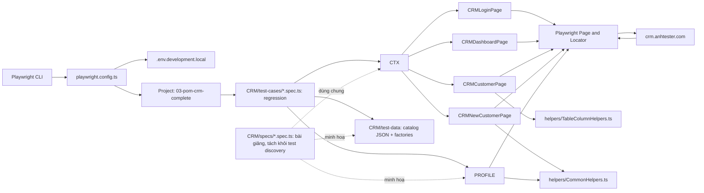
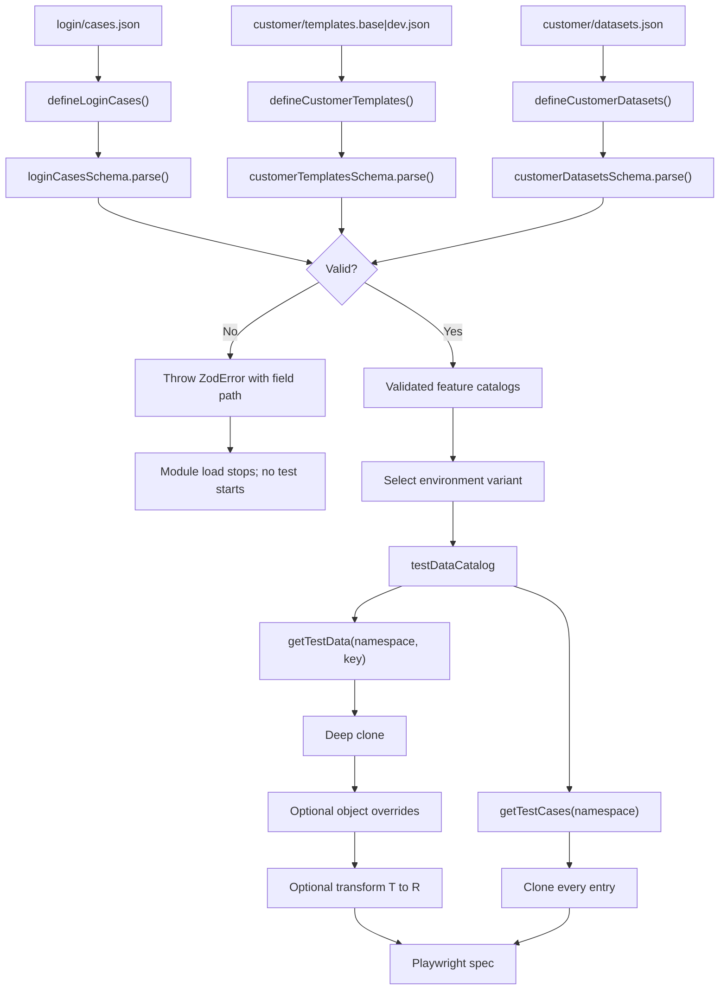
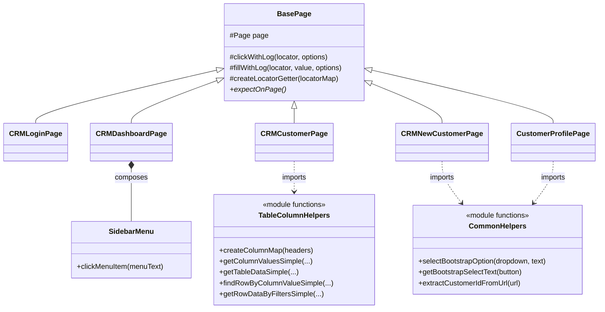
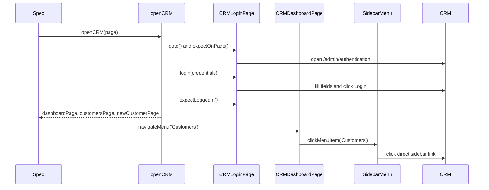
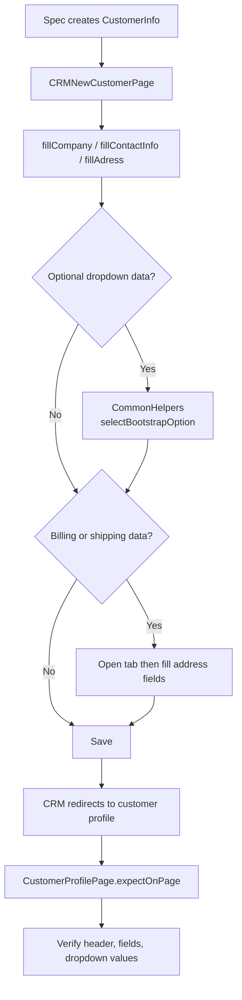
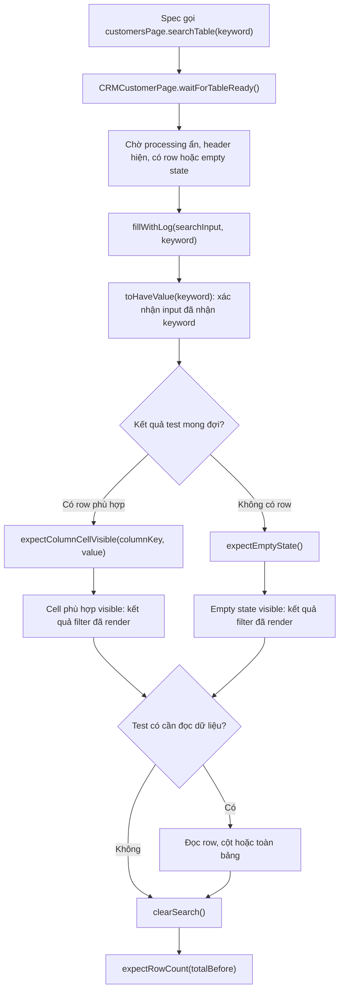
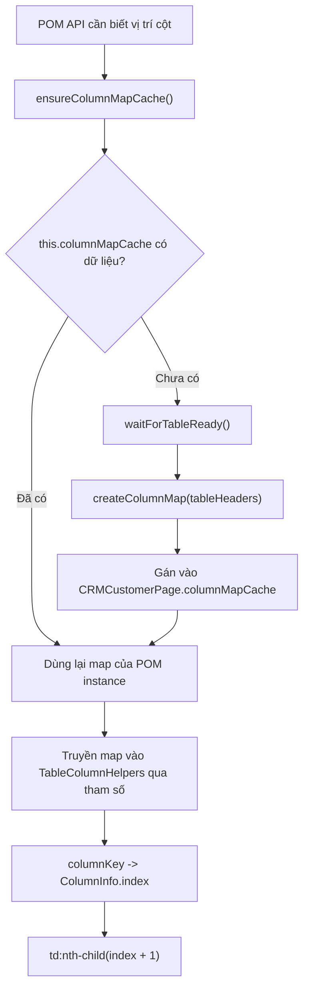

# Tổng Quan Hệ Thống - Module 03 POM CRM

Tài liệu này mô tả kiến trúc **hiện tại** của module `modules/1-basics/03-pom`.
Module dùng Playwright Test để kiểm thử CRM public tại `https://crm.anhtester.com`,
với cấu trúc Page Object Model (POM), component composition, stateless helper
functions và locator web-first.

## 1. Phạm Vi

Module bao gồm luồng sau:

1. Đăng nhập CRM bằng credential từ biến môi trường.
2. Điều hướng Dashboard sang Customers.
3. Tạo customer, kiểm tra validation, Billing/Shipping và profile.
4. Đọc, search, lọc và truy xuất dữ liệu Customers DataTable.

CRM là hệ thống bên ngoài. Test chỉ tạo dữ liệu duy nhất theo timestamp/faker; không
chứa credential thật trong source và không có luồng xóa dữ liệu shared tenant.

## 2. Toàn Cảnh Runtime



`openCRM(page)` là entry point chung của phần lớn CRM spec. Hàm này mở Login,
đọc `CRM_ADMIN_EMAIL` và `CRM_ADMIN_PASSWORD`, đăng nhập, rồi trả các POM đã
khởi tạo trên **cùng một `Page`**.

## 3. Cấu Trúc File

```text
03-pom/
|-- PROJECT-OVERVIEW.md          # Tài liệu này
|-- TEST-CASE-CATALOG.md         # Danh sách test case theo source CRM
`-- CRM/
    |-- components/
    |   `-- SidebarMenu.ts        # Component tái sử dụng cho sidebar
    |-- helpers/
    |   |-- CommonHelpers.ts      # Hàm không state cho Bootstrap dropdown và URL parsing
    |   `-- TableColumnHelpers.ts # Hàm không state cho DataTable column/row data
    |-- models/
    |   |-- customer.ts           # CustomerInfo cho Customer POM/factory
    |   `-- login.ts              # LoginCredentials cho Login POM/factory
    |-- pom/
    |   |-- BasePage.ts
    |   |-- CRMLoginPage.ts
    |   |-- CRMDashboardPage.ts
    |   |-- CRMCustomerPage.ts
    |   |-- CRMNewCustomerPage.ts
    |   `-- CustomerProfilePage.ts
    |-- specs/                    # Ví dụ và nội dung đang dạy
    |   |-- support/crm-test-context.ts
    |   |-- login.spec.ts
    |   |-- table-data.spec.ts
    |   `-- test-data.spec.ts
    |-- test-cases/               # Bộ regression hoàn chỉnh, đánh số theo module
    |   |-- 01.login.spec.ts
    |   |-- 02.customer-creation.spec.ts
    |   `-- 03.customers-table.spec.ts
    `-- test-data/                # Public API cho toàn bộ test data của CRM
        |-- index.ts              # Catalog loader và các export công khai
        |-- test-data.types.ts    # TestDataEntry<T> dùng chung cho mọi catalog
        |-- login/                # Vertical slice của Login test data
        |   |-- cases.json
        |   |-- login.types.ts    # Zod schema + discriminated union runtime
        |   `-- login.factory.ts  # Đọc live credentials từ environment
        `-- customer/             # Vertical slice của Customer test data
            |-- templates.base.json
            |-- templates.dev.json
            |-- datasets.json
            |-- customer.types.ts # Zod schema cho template/dataset catalog
            `-- customer.factory.ts
```

### Vai Trò Từng Vùng

| Vùng          | Trách nhiệm                                                 | Không nên chứa                                |
| ------------- | ----------------------------------------------------------- | --------------------------------------------- |
| `specs/`      | Ví dụ có giải thích phục vụ bài giảng                        | Bộ regression dùng để quản lý release         |
| `test-cases/` | Bộ test hoàn chỉnh, đánh số và nhóm theo module              | Comment giảng bài hoặc thử nghiệm rời rạc      |
| `pom/`        | Hành vi của một màn hình và locator map của màn đó          | Assertion nghiệp vụ của từng test case        |
| `components/` | Một phần UI tái sử dụng giữa các màn hình                   | Logic của một page cụ thể                     |
| `helpers/`    | Hàm dùng lại, nhận input rõ ràng và không sở hữu page state | State page ngầm, locator toàn cục không scope |
| `models/`     | Contract dữ liệu nghiệp vụ dùng chung giữa các tầng         | Locator, Faker factory hoặc metadata test case |
| `test-data/`  | Catalog JSON, chọn dữ liệu theo môi trường và Faker factory | Locator, thao tác Playwright/DOM, credential thật |
| root config   | Chọn project, base URL, timeout, reporter, TypeScript/lint  | Kịch bản test                                 |

### Quản Lý Test Data

Test chỉ import qua public API `CRM/test-data/index.ts`; không import sâu trực tiếp
từ `login/` hoặc `customer/`. Cách này giữ đường import ổn định khi file dữ liệu
được tách hoặc đổi theo môi trường.

Mỗi feature test data là một vertical slice. JSON, test-only type/validator và factory
của Login nằm trong `test-data/login`; Customer tương tự trong
`test-data/customer`. `CRM/models/<feature>.ts` vẫn đứng ngoài test-data vì đó là
contract mà cả POM lẫn factory sử dụng. `CRM/test-data/index.ts` là public API duy
nhất cho spec.

```text
models/login.ts -----> CRMLoginPage.login(credentials)
                  `--> test-data/login/login.factory.ts

models/customer.ts --> CRMNewCustomerPage + CustomerProfilePage
                  `--> test-data/customer/customer.factory.ts

test-data/login/* -----> test-data/index.ts
test-data/customer/* --^         |
                                  `--> specs
```

Login và Customer hiện là hai feature mẫu. Khi thêm Orders, pattern mở rộng là
`models/order.ts` nếu POM cần shared input contract và `test-data/order/` cho JSON,
test-only type/validator hoặc factory thực sự cần thiết. Không bắt buộc feature nào
cũng phải có đủ mọi file.

Mỗi namespace trong registry chỉ chứa một data shape. `loginCases` trả
`LoginCaseData`, `customerTemplates` trả `CustomerInfo`, còn `customerDatasets` trả
`CustomerInfo[]`. Việc tách template khỏi dataset giúp generic API suy ra kiểu ổn
định mà không cần `LoginDataMap`/`CustomerDataMap` liệt kê từng key.

Spec data-driven không tự đọc raw JSON. Chỉ có hai API tổng quát cho mọi feature:
`getTestCases(namespace)` trả toàn bộ case để sinh test, còn
`getTestData(namespace, key)` lấy một dataset cụ thể và hỗ trợ clone, `overrides`
hoặc `transform`. `transform` nhận đúng kiểu dữ liệu của entry nhưng có thể trả về
kiểu khác, ví dụ `CustomerInfo[] -> string[]` hoặc `CustomerInfo -> string`;
TypeScript suy ra kiểu output từ callback. Phân nhánh positive/negative là hành vi của spec dựa trên
discriminant `expectedResult`, không tạo thêm API riêng cho từng nhóm case.

`data` trong một entry có thể là object, array hoặc JSON shape khác. Quy tắc để
type không bị phân mảnh là mỗi namespace chỉ giữ một shape ổn định; khi feature có
cả template object và collection array thì tách thành hai namespace như
`customerTemplates` và `customerDatasets`. `getTestData()` luôn clone sâu trước khi
xử lý. `overrides` chỉ dành cho object và chạy trước `transform`; array dùng
`transform` để `filter`, `map`, `find` hoặc tạo summary. Nếu JSON được nạp động từ
filesystem/API thay vì static import, feature vẫn phải validate tại catalog boundary.
Hiện tất cả catalog Login và Customer đều được Zod `parse()` đúng một lần khi
`test-data/index.ts` load; schema là runtime contract, còn `z.infer` cung cấp
type cho spec. `strict()` giúp bắt field JSON bị gõ sai thay vì im lặng bỏ qua.

#### Luồng JSON → Zod → Spec

Zod chạy tại **catalog boundary** khi `CRM/test-data/index.ts` được import. Nó
không parse lại dữ liệu trong từng test. Nhánh JSON sai dừng suite trước khi
Playwright thao tác UI; nhánh hợp lệ mới được đăng ký vào public catalog.



Luồng compile-time chạy song song nhưng có trách nhiệm khác:

```text
CustomerInfo model --satisfies--> customer schema output
Login Zod schemas -----z.infer---> LoginCaseData discriminated union
testDataCatalog --------typeof---> namespace -> key -> data type
```

| Tầng | Input | Output | Khi lỗi |
| ---- | ----- | ------ | ------- |
| Feature Zod schema | Raw JSON `unknown` | Catalog đã validate | Throw `ZodError` với path field lúc module load |
| Environment selector | Base catalog + map variants | Một catalog cùng shape | Fallback về base nếu không có variant |
| `testDataCatalog` | Các catalog đã validate | Registry duy nhất cho spec | Namespace/key được TypeScript suy ra |
| `getTestData()` | Namespace + key + options | Clone của data hoặc output `R` từ transform | Runtime guard cho key/overrides không hợp lệ |
| `getTestCases()` | Namespace | Mảng `{ key, description, data }` đã clone | Một JSON entry tương ứng một data-driven case |

`index.ts` không tự quét thư mục. Khi thêm JSON/feature mới vẫn phải import raw
JSON, parse bằng schema của feature và đăng ký một namespace trong
`testDataCatalog`. Sau bước đăng ký, hai generic API tự suy ra namespace, key,
input và output; không tạo getter riêng cho từng file hay từng case.

```ts
import {
  createMinimalCustomerInfo,
  getTestCases,
  getTestData,
  testDataCatalog,
} from "../test-data";
```

| Loại dữ liệu | Vị trí | Quy ước tên | Khi sử dụng |
| ------------ | ------ | ------------ | ----------- |
| Ma trận test case | `test-data/login/cases.json` | `cases.json` trong feature | Mỗi entry sinh một test qua `getTestCases()` |
| Template mặc định | `test-data/customer/templates.base.json` | `templates.base.json` | Một object dùng làm baseline |
| Template theo môi trường | `test-data/customer/templates.dev.json` | `templates.<env>.json` | Thay catalog theo environment |
| Dataset dạng mảng | `test-data/customer/datasets.json` | `datasets.json` | Collection dùng với `transform` |
| Dữ liệu runtime | `test-data/<feature>/<feature>.factory.ts` | `<feature>.factory.ts` | Faker, timestamp hoặc environment secrets |

Các contract của API test data được kiểm tra offline trong
`CRM/specs/test-data.spec.ts`: clone độc lập cho object, shallow override cho
template, filter array, map array sang output type khác, clone sâu array/object lồng
nhau, thứ tự `overrides -> transform`, factory runtime và discriminated union Login.

`TEST_ENV` được ưu tiên trước `NODE_ENV`; nếu không khai báo thì catalog dùng
`dev`. Với customer templates, `templates.dev.json` được chọn cho `dev` hoặc
`development`, còn `templates.base.json` là fallback. Dataset không phụ thuộc môi
trường nên chỉ có một file. JSON không chứa credential thật; tài khoản CRM live chỉ
được đọc bởi `login/login.factory.ts` từ `.env.development.local`.

## 4. Quan Hệ POM, Component Và Helper



### Cách Chọn Inheritance, Composition Hay Named Function

Ba quan hệ trong sơ đồ trông giống nhau vì đều tái sử dụng code, nhưng chúng trả lời
ba câu hỏi khác nhau. Dùng đúng quan hệ làm rõ **ai sở hữu state**, **ai chịu trách
nhiệm cho UI** và **code nào chỉ là một thao tác dùng lại**.

| Pattern | Câu hỏi để quyết định | Ví dụ hiện tại | State/lifecycle nằm ở đâu? |
|---|---|---|---|
| Inheritance | “Mọi page có phải tuân theo cùng một contract không?” | `CRMLoginPage extends BasePage` | `BasePage` giữ `protected page` và pipeline logging; page con thêm locator/hành vi riêng. |
| Composition | “Page này có sở hữu một mảnh UI có hành vi riêng không?” | `CRMDashboardPage.sidebarMenu` | Dashboard tạo một `SidebarMenu` dùng cùng `Page`; component giữ root/sidebar locators của chính nó. |
| Named function export | “Có thể truyền đủ input vào hàm mà không cần object nhớ gì không?” | `selectBootstrapOption(dropdown, text)` | Không có instance; state chỉ nằm trong `Locator`/data của lần gọi hiện tại. |

#### 4.1 BasePage: “Là Một” Page Object Chung

Mọi POM kế thừa `BasePage` vì chúng đều **là một page-level abstraction** và có các
quy ước cần đồng nhất: cùng truy cập `page`, log `click`/`fill`, chuyển locator map
thành `element('key')`, và tự cài `expectOnPage()`. Đây không chỉ là chia sẻ method;
`expectOnPage()` là contract bắt buộc. Một POM mới không thể tồn tại mà không nêu được
dấu hiệu màn hình của nó đã sẵn sàng.

Lớp cha chỉ chứa capability chung, không biết “company”, “sidebar” hoặc “billing”.
Nhờ vậy `CRMCustomerPage`, `CRMNewCustomerPage` và `CustomerProfilePage` có cùng cách
làm việc nhưng không bị ép chia sẻ locator/hành vi nghiệp vụ. Đây là dấu hiệu phù hợp
để inheritance: quan hệ là “`CRMCustomerPage` **is a** BasePage”, và lớp con phải
thỏa contract của lớp cha.

Không nên đưa `SidebarMenu` hay TableColumnHelpers vào `BasePage`. Không phải mọi page
có sidebar/table, nên chúng không phải capability chung. Đặt chúng vào lớp cha sẽ làm
POM đơn giản vẫn mang dependency không dùng và làm ranh giới của BasePage dần mơ hồ.

#### 4.2 SidebarMenu: Composition Có Owner Rõ Ràng

`CRMDashboardPage` khai báo `readonly sidebarMenu = new SidebarMenu(this.page)`. Câu
lệnh này là composition theo nghĩa thực tế: dashboard **có một** component sidebar,
truyền cho nó cùng browser `Page`, và delegate `navigateMenu(menuText)` sang
`sidebarMenu.clickMenuItem(menuText)`. Spec không cần biết sidebar gồm `#menu.sidebar`,
`li` hay direct child anchor; đó là chi tiết nội bộ của component.

`SidebarMenu` đáng là class vì nó nhóm state UI liên quan với nhau: `page`, root
locator `sidebar`, và collection `menuItems`. Các giá trị này cùng mô tả một component
và cùng được dùng trong nhiều method hiện tại/tương lai, như click, kiểm tra menu active
hoặc mở submenu. Nếu chỉ export một hàm `clickMenuItem(page, text)`, mỗi hàm sau phải tự
xây lại cùng root/collection locator; logic scope dễ bị copy và lệch dần.

Composition khác inheritance ở chỗ `CRMDashboardPage` **không phải là** SidebarMenu.
Dashboard vẫn chịu trách nhiệm xác nhận dashboard, giữ logo/search locator và quyết định
khi nào cần điều hướng. Sidebar chỉ chịu trách nhiệm tìm đúng menu item trong phạm vi
sidebar. Tách như vậy giúp component có thể được gắn vào page khác dùng cùng sidebar mà
không tạo một cây kế thừa gượng ép như `PageWithSidebar -> DashboardPage`.

Dấu hiệu để tạo component class: phần UI có root riêng, có nhiều
locator/hành vi liên quan và có thể được một page sở hữu. Constructor nhận `Page` hoặc
root `Locator`; method của component không chứa assertion nghiệp vụ của test owner.

#### 4.3 CommonHelpers Và TableColumnHelpers: Stateless Named Functions

`CommonHelpers` và `TableColumnHelpers` không phải “pure function” tuyệt đối: một số
hàm click hoặc đọc DOM qua Playwright `Locator`. Điểm quan trọng là chúng **không giữ
state nội bộ qua nhiều lần gọi**. `selectBootstrapOption(dropdown, text)` nhận đủ hai
đầu vào cần thiết, mở đúng dropdown đã được caller scope và chọn option; sau khi return,
không có instance/cache nào còn sống. `extractCustomerIdFromUrl(url)` còn là utility
thuần theo nghĩa chặt hơn vì chỉ biến đổi string sang string.

`CRMNewCustomerPage` import trực tiếp `selectBootstrapOption` rồi truyền dropdown root
trong locator map và text cần chọn. Đây là dependency minh bạch: nhìn import và lời gọi
là biết POM dùng đúng helper nào. Không cần `new CommonHelpers(page)` vì helper không
cần nhớ page; bọc nó trong class chỉ tăng lifecycle giả tạo, thêm property/constructor
và khiến người đọc tưởng helpers có state dùng chung.

`TableColumnHelpers` nhận headers, rows, key, cleaner và cache qua tham số. Nhờ vậy nó
generic cho DataTable, còn `CRMCustomerPage` giữ phần chỉ đúng với Customers: selector
table, cleaner của cột company và `columnMapCache`. Cache nằm trong POM vì nó là metadata
của **một table DOM trên một Page Object instance**. Đưa cache vào module helper/global
sẽ có nguy cơ test hoặc page khác dùng nhầm schema cũ. Đây là ví dụ quan trọng: helper
stateless không có nghĩa là ứng dụng không có state; state cần sống ở owner có phạm vi
đúng.

Chỉ cân nhắc đổi helper sang component/class khi có state bền vững và hợp lệ cần quản
lý, ví dụ nhiều method dùng cùng root locator/configuration, cache có lifecycle rõ ràng,
hoặc một resource cần setup/cleanup. Trước thời điểm đó, named export là lựa chọn ít
ceremony hơn và làm dependency dễ cô lập/mocking hơn vì input/output hiện rõ. Helper
thuần như `extractCustomerIdFromUrl()` dễ unit-test trực tiếp; helper nhận `Locator`
cần Playwright integration test hoặc mock Locator có chủ đích.

## 5. Tại Sao Kiến Trúc Này Phù Hợp Cho Module Này

CRM là một hệ thống ngoài, form có nhiều trường và Customers là DataTable có DOM thay
đổi theo search. Kiến trúc vì thế được tách theo trách nhiệm: spec giữ kịch bản, POM
sở hữu hành vi màn hình, component sở hữu một vùng UI và helper xử lý logic dùng lại.

### 5.1 Spec Kể Nhanh Câu Chuyện Nghiệp Vụ

Spec là nơi trả lời câu hỏi “người dùng làm gì và điều gì phải đúng?”. Ví dụ: tạo một
customer, kiểm tra profile, search theo company, rồi clear search. Nếu spec tự chứa
selector, chi tiết Bootstrap dropdown và index cột thì người đọc không còn nhìn thấy
nghiệp vụ; khi UI đổi, nhiều test cũng phải sửa cùng lúc.

Vì thế spec chỉ điều phối POM, chuẩn bị `CustomerInfo` theo contract trong
`CRM/models/customer.ts` và viết assertion thuộc về kịch bản. POM nhận phần “làm
thế nào để thao tác với màn hình”. `login.spec.ts` giữ
cả raw locator và bản POM để thể hiện trực tiếp ranh giới giữa test flow và page API.

Spec vẫn được phép có assertion. Điều không nên đặt vào POM là một kết luận chỉ đúng
cho riêng test, chẳng hạn “customer này phải có đúng ba group”. POM nên cung cấp
hành vi/khả năng đọc UI như `getRowDataByFilters()`; spec mới quyết định dữ liệu đó
có đúng với test case hay không. Cách tách này giúp POM tái dùng được cho test create,
validation và table mà không biến nó thành nơi chứa business rule lẫn lộn.

### 5.2 BasePage Dùng Inheritance Cho Contract Chung

Mọi POM đều cần cùng một `Page`, cần log thao tác, cần khai báo locator map và phải
có một dấu hiệu xác nhận màn hình đã đúng. Đây là phần **ổn định, giống nhau và gắn
với bản thân Page Object**, nên inheritance từ `BasePage` hợp lý hơn việc copy code
hoặc tạo nhiều helper rời rạc.

`BasePage` không chứa locator của Customers hay form Customer. Nó chỉ đặt contract
`expectOnPage()` để mỗi trang tự nêu điều kiện ready riêng: Login kiểm tra form,
Customers kiểm tra “New Customer”, profile kiểm tra header của profile. Nhờ vậy,
test có một thói quen thống nhất: điều hướng xong thì xác nhận destination bằng
web-first assertion, thay vì chờ một khoảng thời gian đoán trước.

Logging cũng ở đây vì nó là cross-cutting concern. `fillWithLog()` nhận cờ sensitive
để password được in là `****`, nhưng vẫn gọi `locator.fill()` với giá trị thật. Nếu
đặt logging ở từng spec, format log dễ khác nhau và một thao tác mới có thể quên che
credential. `BasePage` không giữ cache hoặc business state, tránh biến lớp cha thành
“god object” mà mọi page đều phụ thuộc quá mức.

### 5.3 Composition Cho Sidebar, Function Export Cho Helper

`SidebarMenu` là một component UI hoàn chỉnh: nó sở hữu root locator, danh sách menu
và quy tắc chọn direct child link để không click nhầm submenu. `CRMDashboardPage`
**có một** sidebar, nên quan hệ “has-a” (composition) diễn tả đúng hơn “is-a”. Cùng
component đó cũng có thể được dùng bởi một dashboard/page khác mà không buộc page đó
phải kế thừa một lớp trung gian.

Ngược lại, `CommonHelpers` và `TableColumnHelpers` không có `Page` riêng, không giữ
state giữa các lần gọi và không có lifecycle cần khởi tạo/dọn dẹp. Chúng nhận `Locator`
hoặc data qua tham số rồi trả kết quả. Named exports làm dependency hiện rõ tại import,
giảm ceremony `new`, và tránh cảm giác helper là một page/component. Đây là lý do
chúng **không** composition giống `SidebarMenu`: composition chỉ đáng dùng khi object
con thật sự sở hữu state, configuration hay hành vi UI gắn với một owner.

Quy tắc lựa chọn là: dùng inheritance cho contract chung của mọi page,
composition cho mảnh UI có ownership riêng, và function export cho biến đổi/tiện ích
không state. Một helper chỉ nên đổi thành class khi xuất hiện state chung có ý nghĩa,
ví dụ cache, configuration hoặc resource lifecycle cần quản lý.

### 5.4 openCRM Tập Trung Luồng Khởi Tạo Và Login

Phần lớn spec bắt đầu cùng một việc: mở login, đọc credential từ environment, login
và dựng POM trên cùng một browser `Page`. `openCRM(page)` gom đúng chuỗi lặp này để
một thay đổi ở login chỉ sửa tại một nơi; nó cũng fail sớm với message rõ ràng nếu
thiếu `CRM_ADMIN_EMAIL` hoặc `CRM_ADMIN_PASSWORD`.

Hàm này trả về các POM cụ thể thay vì một object “toàn năng”. Người đọc vẫn nhìn thấy
test đang dùng `customersPage` hay `newCustomerPage`, còn các POM chia sẻ cùng session
đã đăng nhập trên chính fixture `page` được truyền vào. `CustomerProfilePage` được spec
tạo từ `page` khi cần profile; context không cần trả thêm alias `authedPage` hoặc tạo
trước mọi POM chưa được sử dụng. Khi suite lớn hơn, function context này có thể chuyển
thành Playwright fixture mà không đổi ranh giới POM.

### 5.5 DataTable Cần Metadata Động Thay Vì Index Hardcode

Customers table có checkbox và số thứ tự đứng trước dữ liệu nghiệp vụ, đồng thời DOM
có thể thêm empty row hoặc action link trong cell company. Viết `td:nth-child(3)` trực
tiếp trong spec tưởng ngắn nhưng ràng buộc test vào vị trí hiện tại của cột; thêm hoặc
đổi cột sẽ làm test đọc nhầm dữ liệu mà không nhất thiết fail rõ ràng.

`TableColumnHelpers.createColumnMap()` đọc header thật rồi tạo map từ tên cột sang
index. Nó hỗ trợ cả `dateCreated` và `date created`, nên test có thể dùng key dễ đọc
mà vẫn phản chiếu header UI. `CRMCustomerPage` giữ `columnMapCache` ở instance của nó
vì cache chỉ đúng khi table DOM của page đó còn cùng schema. Cache không được đưa vào
helper global: làm vậy có thể vô tình dùng metadata của page/test trước cho page/test
sau. Khi không tìm thấy key, helper ném error có tên cột, tốt hơn một giá trị `undefined`
âm thầm đi tiếp.

Cleaner cho `company` là ví dụ khác của ownership đúng chỗ: chỉ CRM Customer table
biết cell company có tên company kèm `View`, `Contacts`, `Delete`; helper tổng quát
không nên biết các action riêng của CRM. POM inject cleaner vào helper, giữ helper
generic nhưng vẫn đọc đúng UI thật.

### 5.6 Web-First Assertion Là Đồng Bộ Hóa, Không Phải Sleep

DataTables render bất đồng bộ sau navigation hoặc search. Hard wait có hai vấn đề:
nó làm test chậm khi UI đã xong sớm, và vẫn flaky khi UI chậm hơn số mili-giây đã chọn.
Module dùng `expect(...).toBeVisible()`, `toHaveValue()` và `toHaveCount()` vì các
matcher này tự retry đến expect timeout; test chờ một trạng thái quan sát được thay vì
chờ thời gian.

`waitForTableReady()` mô tả “ready” bằng contract UI: processing đã ẩn, header đã
hiện, và table có data row **hoặc** empty-state hợp lệ. Điều kiện “hoặc” rất quan trọng:
search không có kết quả không phải lỗi hạ tầng. Sau khi assertion ổn định UI, code mới
đọc text/row object sang JavaScript rồi dùng `expect(value)` thông thường. Thứ tự này
tách rõ assertion retrying trên locator với assertion tức thời trên giá trị JavaScript.

### 5.7 Locator Phản Ánh Cấu Trúc Người Dùng Và Component

Locator không bị ép vào một quy tắc duy nhất. Form CRM có `id` ổn định như `#company`,
nên dùng trực tiếp ID là rõ và ngắn. Với button/link có accessible name, `getByRole()`
gần với cách người dùng nhận biết UI hơn. Với Bootstrap dropdown hoặc sidebar lặp,
test scope vào component root trước, sau đó dùng `filter({ has })` và locator con.
Cách này tránh chọn option/menu giống tên ở nơi khác trong page mà không cần XPath
dài hoặc selector traversal dễ vỡ.

Không dùng XPath ở module này không phải vì XPath luôn sai; lý do là các role, label,
CSS component root và `filter()` đã thể hiện được intent của CRM rõ hơn. XPath chỉ
nên cân nhắc khi DOM thực tế không cung cấp một semantic/structural anchor tương đương.

### 5.8 Test Data Và Cấu Hình Phản Ánh Rủi Ro Của CRM Ngoài

CRM là tenant dùng chung, nên test tạo company có suffix faker/timestamp để giảm mạnh
khả năng trùng thay vì dựa vào một record cố định có thể bị người khác sửa. Đây là dữ
liệu gần-unique, không phải bảo đảm tuyệt đối khi nhiều process tạo cùng lúc. Module
không có luồng xóa dữ liệu để tránh phá dữ liệu của shared tenant; đổi lại, test cần ưu
tiên kiểm tra dữ liệu vừa tạo hoặc row vừa đọc được hơn là giả định toàn bộ bảng có một
tập dữ liệu bất biến.

Project `03-pom-crm` đặt `fullyParallel: false`, nên các test trong **cùng một spec
file** không chạy fully parallel. Các spec file vẫn có thể chạy trên worker khác theo
cấu hình mặc định; do đó đây không phải bảo đảm tuần tự cho toàn bộ project hay giải
pháp tuyệt đối cho shared tenant. Log và thao tác browser trong từng spec file vẫn giữ
thứ tự dễ theo dõi. Nếu cần loại bỏ concurrency giữa các spec file, project/CLI phải giới hạn
`workers: 1` và cần cân nhắc thời gian chạy. Timeout test 90 giây và expect 10 giây tạo
ngân sách thực tế cho network/UI ngoài, nhưng không thay thế assertion web-first. Khi
đưa lên CI hoặc mở rộng suite, có thể đánh giá lại isolation, retry và mức độ parallel
dựa trên dữ liệu thật.

## 6. Luồng Chạy Chính

### 6.1 Login Và Điều Hướng



`BasePage.fillWithLog()` che password trong log bằng `****`. `clickWithLog()` và
`fillWithLog()` vẫn gọi action Playwright thật sau khi log.

### 6.2 Tạo Customer Và Xác Nhận Profile



`createCustomer(info, { save })` là aggregate method cho full form. Các test vẫn có
thể gọi từng method nhỏ khi cần kiểm tra state trung gian trước Save.

### 6.3 Bảng Customers Và Luồng Tìm Kiếm

Phần table được chia thành ba tầng có trách nhiệm khác nhau:

| Tầng | File chính | Trách nhiệm |
|---|---|---|
| Test case | `CRM/test-cases/03.customers-table.spec.ts` | Nêu hành vi cần kiểm tra và kết luận dữ liệu đúng hay sai |
| Page Object | `CRM/pom/CRMCustomerPage.ts` | Sở hữu locator, đồng bộ trạng thái DataTables, giữ cache cột và gọi helper |
| Helper | `CRM/helpers/TableColumnHelpers.ts` | Chuyển header/row/cell đã được POM scope thành dữ liệu JavaScript hoặc row Locator |

Spec không biết selector `#clients`, vị trí cột hay markup của cell company. Helper cũng
không biết cách đăng nhập, URL Customers hoặc lúc nào DataTables đã sẵn sàng.
`CRMCustomerPage` đứng giữa hai tầng: nó hiểu UI của trang và chuẩn bị đúng context
trước khi giao việc trích xuất dữ liệu cho helper.

#### 6.3.1 Luồng Tìm Kiếm: Từ Spec Đến Kết Quả Đã Ổn Định



Đường đi bắt đầu từ spec, ví dụ TC_TBL_02:

```ts
await customersPage.searchTable(targetCompany);

// toHaveValue() bên trong searchTable chỉ xác nhận input đã nhận keyword.
// Assertion cell này mới chờ DataTables render kết quả sau khi filter.
await customersPage.expectCompanyCellVisible(targetCompany);

const filtered = await customersPage.getColumnValues('company');
expect(filtered.length).toBeGreaterThan(0);

await customersPage.clearSearch();
await customersPage.expectRowCount(totalBefore);
```

Bên trong `searchTable()`, thứ tự code hiện tại là:

```ts
async searchTable(keyword: string) {
  await this.waitForTableReady();
  await this.fillWithLog(this.element('saerchInput'), keyword);
  await expect(this.element('saerchInput')).toHaveValue(keyword);
}
```

`waitForTableReady()` ở đây ổn định trạng thái table **trước khi fill**. Sau khi fill,
DataTables bắt đầu lọc lại rows. `toHaveValue(keyword)` là locator assertion retrying,
nhưng nó chỉ quan sát search input; nó không chứng minh row đã được render xong. Vì vậy
spec tiếp tục dùng `expectColumnCellVisible()` hoặc `expectEmptyState()` để chờ
trạng thái kết quả cụ thể. Không cần và không được chèn `waitForTimeout()` giữa các bước.

`waitForTableReady()` chấp nhận hai trạng thái hợp lệ:

1. Có ít nhất một data row.
2. Không có data row nhưng có cell `dataTables_empty`.

Điều kiện thứ hai giúp các flow search không có kết quả vẫn nhận diện empty table là
một trạng thái hợp lệ, thay vì biến nó thành timeout giả.

#### 6.3.2 Cache Cột Nằm Ở Đâu Và Được Tạo Khi Nào



Cache được khai báo trực tiếp trong `CRMCustomerPage`:

```ts
private columnMapCache: ColumnMap | null = null;

private async ensureColumnMapCache(): Promise<ColumnMap> {
  if (!this.columnMapCache) {
    await this.waitForTableReady();
    this.columnMapCache = await createColumnMap(this.element('tableHeaders'));
  }
  return this.columnMapCache;
}
```

Lifecycle của cache:

1. Khi tạo `new CRMCustomerPage(page)`, cache bắt đầu bằng `null`.
2. Method đầu tiên cần vị trí cột gọi `ensureColumnMapCache()`.
3. POM đọc toàn bộ `<th>`, tạo `ColumnMap` và lưu vào property của instance đó.
4. Các method sau dùng lại cùng map; search chỉ đổi rows, không đổi schema header.
5. Một `CRMCustomerPage` khác có cache riêng, nên không có cache global chạy xuyên test.

Các method sử dụng cache gồm `expectColumnCellVisible()`, `getColumnValues()`,
`getTableData()`, `findRowByColumnValue()` và `getRowDataByFilters()`.
`getRowCount()`, `expectRowCount()` và `expectEmptyState()` không cần cache vì
chúng không tra cứu cột theo tên.

`TableColumnHelpers` chỉ nhận map qua tham số. Nếu `getColumnInfoSimple()` không tìm
thấy key, nó đọc lại headers một lần và trả map mới cho lời gọi helper hiện tại. Nó
không thể tự gán lại `CRMCustomerPage.columnMapCache`. Ownership này có chủ đích:
POM biết lifecycle của table; helper chỉ biết cách diễn giải dữ liệu đã nhận.

#### 6.3.3 Ví Dụ: getColumnValues Đi Qua POM Và Helper Như Thế Nào

Code trong `CRMCustomerPage.ts`:

```ts
async getColumnValues(columnKey: string) {
  await this.waitForTableReady();
  const columnMap = await this.ensureColumnMapCache();

  return getColumnValuesSimple(
    this.element('tableHeaders'),
    this.getRowsLocator(),
    columnKey,
    this.columnCleaner,
    columnMap
  );
}
```

Ý nghĩa từng tham số POM truyền xuống:

| Tham số | Nguồn từ POM | Mục đích |
|---|---|---|
| `tableHeaders` | `#clients thead th` | Cho helper đọc hoặc refresh metadata cột |
| `rowsLocator` | Data rows đã loại `dataTables_empty` | Không đọc nhầm empty-state như một customer |
| `columnKey` | Spec truyền, ví dụ `company` | Chọn cột theo tên thay vì hardcode index |
| `columnCleaner` | Logic riêng của Customers page | Làm sạch markup đặc biệt của từng cột |
| `columnMap` | Cache của POM instance | Tránh đọc lại headers ở mỗi lần gọi |

Trong helper, `getColumnValuesSimple()` lấy `ColumnInfo.index`, đếm số rows, rồi với
mỗi row tạo locator `td:nth-child(index + 1)`. `ColumnInfo.index` là 0-based vì nó
đến từ vòng lặp headers; CSS `nth-child` là 1-based nên phải cộng một.

Kết quả là `string[]`. Spec phải ổn định UI trước, sau đó mới dùng generic assertion:

```ts
const companies = await customersPage.getColumnValues('company');
expect(companies.length).toBeGreaterThan(0);
```

#### 6.3.4 Vì Sao Cột Company Cần Cleaner Riêng

Cell company không chỉ chứa tên công ty. Nó còn có row actions như `View`,
`Contacts`, `Delete`. Nếu helper dùng toàn bộ `textContent()`, giá trị có thể thành
`ACMEViewContactsDelete`, làm search và assertion sai.

`CRMCustomerPage.columnCleaner` giải quyết knowledge riêng của trang:

1. Tìm anchor đầu tiên trong cell và ưu tiên text của anchor đó.
2. Nếu không có anchor, đọc raw text.
3. Nếu raw text chứa `View`, chỉ giữ phần trước action.
4. Trả text sạch cho `TableColumnHelpers`.

Cleaner nằm trong POM, không nằm trong helper generic, vì chỉ POM biết markup và ý
nghĩa nghiệp vụ của cột company. Helper chỉ hỏi: “column key này có cleaner không?”;
nếu có thì gọi cleaner, nếu không thì dùng `textContent().trim()`.

#### 6.3.5 Bốn Đường Đọc Dữ Liệu Từ CRMCustomerPage

| POM method | Helper được gọi | Giá trị trả về | Cách kiểm tra tiếp |
|---|---|---|---|
| `getColumnValues(key)` | `getColumnValuesSimple` | `string[]` | Generic `expect` sau khi UI đã ổn định |
| `getTableData(keys)` | `getTableDataSimple` | Mảng row object | Generic `expect` trên shape/data |
| `findRowByColumnValue(key, matcher)` | `findRowByColumnValueSimple` | `Locator` của row đầu tiên khớp | Web-first locator assertion hoặc action |
| `getRowDataByFilters(filters, keys?)` | `getRowDataByFiltersSimple` | Một row object | Generic `expect` trên field |

Ví dụ TC_TBL_02 dùng cả Locator path và JavaScript-data path:

```ts
const matchedRow = await customersPage.findRowByColumnValue(
  'company',
  (text) => text.trim() === targetCompany || text.includes(targetCompany)
);

// Helper trả Locator, nên tiếp tục dùng locator assertions có auto-retry.
await expect(matchedRow).toBeVisible();
await expect(matchedRow).toContainText(targetCompany);

const rowData = await customersPage.getRowDataByFilters(
  { company: targetCompany },
  ['company', 'primaryContact', 'active']
);

// Helper trả object JavaScript sau khi UI đã ổn định, nên dùng generic expect.
expect(rowData.company).toContain(targetCompany);
```

`TextMatcher` hỗ trợ string và predicate. String dùng substring `includes`; predicate
cho phép test diễn tả điều kiện cụ thể. `getRowDataByFilters()` dùng quan hệ AND:
tất cả filter phải khớp trên cùng một row, tránh lấy company ở row này và email ở row khác.

#### 6.3.6 Luồng Lỗi Và Cách Đọc Failure

| Failure | Tầng phát hiện | Ý nghĩa |
|---|---|---|
| Search input không có keyword | `searchTable -> toHaveValue` | Fill chưa phản ánh vào input |
| Cell/empty-state không xuất hiện | Locator assertion trong POM/spec | DataTables không đạt kết quả mong đợi |
| `Column <key> không tìm thấy` | POM hoặc helper khi tra `ColumnMap` | Key sai hoặc schema header đã thay đổi |
| Không tìm thấy row theo matcher | Row finder helper | Cột hợp lệ nhưng không có data row khớp |
| Generic assertion fail | Spec | UI đã đọc được, nhưng dữ liệu không đúng business expectation |

Cách debug theo thứ tự là: kiểm tra table đã ready, kiểm tra search input, kiểm tra
cell/empty-state, kiểm tra column key, rồi mới kiểm tra object JavaScript. Thứ tự này
giữ đúng nguyên tắc của module:

```text
web-first assertion -> đọc dữ liệu UI -> generic expect trên JavaScript
```

## 7. Chiến Lược Locator Và Assertion

| Tình huống                     | Pattern hiện dùng                                                        | Lý do                                                      |
| ------------------------------ | ------------------------------------------------------------------------ | ---------------------------------------------------------- |
| Form input rõ id               | `page.locator('#company')`                                               | ID là contract thực của form                               |
| Button/link có accessible name | `getByRole(...)`                                                         | Gần hành vi người dùng                                     |
| Bootstrap dropdown wrapper     | `.bootstrap-select.filter({ has: page.locator('button[data-id=...]') })` | Scope component root trước, rồi tìm trigger/menu bên trong |
| Sidebar menu lặp               | parent `li` + `filter({ has })` + direct child link                      | Tránh click link ở submenu                                 |
| Table cell lặp                 | rows -> `td:nth-child(...)` -> `filter({ hasText })`                     | Column index lấy từ header thật, không hardcode            |
| Table rỗng                     | `emptyState.toBeVisible()`                                               | Empty là state hợp lệ, không phải timeout                  |

Quy tắc cho snippet/test có dữ liệu đọc sang JavaScript:

```text
web-first locator assertion -> đọc text/object -> generic expect(value)
```

Ví dụ, search trước tiên chờ `expectColumnCellVisible()` hoặc
`expectEmptyState()`, rồi mới gọi `getColumnValues()`/`getTableData()`.
Không dùng `waitForTimeout()` hay polling thời gian cứng trong CRM module.

## 8. Hai Test Suite Tách Biệt

- `CRM/specs` chứa code minh hoạ và nội dung đang dạy. Project `03-pom-crm` hiện có
  `testMatch: []`, nên Playwright không tự discovery các file này.
- Project `03-pom-crm-complete` chỉ chạy `CRM/test-cases`: bộ regression hoàn chỉnh được đánh số.

### 8.1 Complete Suite

| Spec                          | Số test | Phân loại | Trọng tâm                                                     | POM/helper chính                            |
| ----------------------------- | ------: | --------- | ------------------------------------------------------------- | ------------------------------------------- |
| `01.login.spec.ts`             |       3 | Positive Cases, Negative Cases | Đăng nhập hợp lệ bằng raw locator/POM; từ chối credential sai | `CRMLoginPage`                              |
| `02.customer-creation.spec.ts` |       7 | Positive Cases, Negative Cases | Tạo Customer, Billing/Shipping, required và duplicate Company | `CRMNewCustomerPage`, `CustomerProfilePage`, `CRMCustomerPage` |
| `03.customers-table.spec.ts`   |       7 | Positive Cases, Negative Cases | Search, table data, helper flow, empty state và invalid column | `CRMCustomerPage`, `TableColumnHelpers`      |

Tổng complete suite: **17 test** trong project `03-pom-crm-complete`.

Lệnh chạy thường dùng:

```powershell
npm test -- --project=03-pom-crm-complete
npm test -- --project=03-pom-crm-complete modules/1-basics/03-pom/CRM/test-cases/03.customers-table.spec.ts
npm run typecheck
npm exec eslint -- modules/1-basics/03-pom/CRM
```

## 9. Cấu Hình Và Môi Trường

`playwright.config.ts` nạp `.env.development.local` nếu file tồn tại. File này chỉ
cần đặt ở root `202603-PW_BASIC` và không commit credential.

| Hạng mục           | Giá trị hiện tại                     |
| ------------------ | ------------------------------------ |
| Complete/regression project | `03-pom-crm-complete`          |
| Lesson project     | `03-pom-crm`; `testMatch: []`, không discovery test |
| Base URL mặc định  | `https://crm.anhtester.com`          |
| Browser project    | Desktop Chrome                       |
| Test timeout CRM   | 90 giây/test                         |
| Expect timeout CRM | 10 giây/assertion web-first          |
| Retry              | Chưa khai báo, Playwright mặc định 0 |
| Trace              | `on-first-retry`                     |
| Reporter           | HTML                                 |
| Parallel trong một spec file | `fullyParallel: false`; các spec file vẫn có thể chạy trên worker khác |

`headless: false` đang bật để hiển thị browser trong lúc chạy local. Test
artifacts/HTML report nằm ngoài source module theo config Playwright.

## 10. Bản Đồ Mở Rộng Hệ Thống

| Muốn thêm tính năng       | Điểm vào nên sửa                                            | Ghi chú                                             |
| ------------------------- | ----------------------------------------------------------- | --------------------------------------------------- |
| Thêm màn CRM mới          | Tạo POM mới trong `CRM/pom` và regression spec trong `CRM/test-cases` | Kế thừa `BasePage`, cài `expectOnPage()`            |
| Tái dùng phần UI          | Tạo component trong `CRM/components`                        | Dùng composition như `SidebarMenu`                  |
| Thêm helper không state   | Export function trong `CRM/helpers`                         | Truyền `Locator`/data rõ ràng                       |
| Thêm thao tác table       | `CRMCustomerPage` + `TableColumnHelpers`                    | Không hardcode index cột                            |
| Thêm feature model        | `CRM/models/<feature>.ts`                                   | Contract input dùng chung cho POM và factory        |
| Thêm test-data feature    | `CRM/test-data/<feature>/`                                  | Đặt JSON, test-only type và factory cạnh nhau       |
| Thêm JSON case cùng shape | `CRM/test-data/<feature>/*.json`                            | Không tạo API/type map mới; test sinh qua `getTestCases()` |
| Thêm data factory         | `CRM/test-data/<feature>/<feature>.factory.ts`              | Chỉ tạo khi cần Faker, timestamp hoặc env data      |
| Thêm behavior app/POM     | Update complete suite; cập nhật `CRM/specs` nếu bài giảng liên quan | Ít nhất happy path và chạy spec bị ảnh hưởng        |
| Xem phạm vi test          | Xem `TEST-CASE-CATALOG.md`                                  | Catalog phản ánh `CRM/test-cases`; cập nhật khi thêm hoặc sửa test |

## 11. Trình Tự Đọc Mã Nguồn Gợi Ý

1. Bắt đầu ở `login.spec.ts`: raw locator trước, POM sau.
2. Mở `BasePage.ts`: inheritance dùng cho contract và logging chung.
3. Mở `CRMDashboardPage.ts` + `SidebarMenu.ts`: composition cho component UI.
4. Mở `CRMNewCustomerPage.ts`: locator map, atomic actions, aggregate method.
5. Mở `CommonHelpers.ts`: named function export cho helper không state.
6. Mở `CRMCustomerPage.ts` + `TableColumnHelpers.ts`: dynamic column map, cleaner,
   generic matcher và empty-state contract.
7. Kết thúc ở `table-search.spec.ts`: web-first assertion trước khi đọc UI data
   sang JavaScript.

## 12. Quy Tắc Bảo Trì Nhanh

- Không ghi credential, URL secret hoặc dữ liệu nhạy cảm vào spec/log/document.
- Không biến stateless helper thành class nếu chưa có state/configuration dùng chung.
- Không dùng XPath hay `waitForTimeout()` khi locator native hoặc
  web-first assertion mô tả được intent.
- Khi test data là giá trị UI động, lấy một row thật, kiểm tra nó search được, rồi
  mới dùng làm keyword.
- Tách assertion UI retrying (`toBeVisible`, `toHaveValue`, `toHaveCount`) khỏi
  generic assertion JavaScript (`toBe`, `toEqual`, `toContain`).
- Sau thay đổi POM/behavior, chạy lint, typecheck và spec owner tương ứng.
