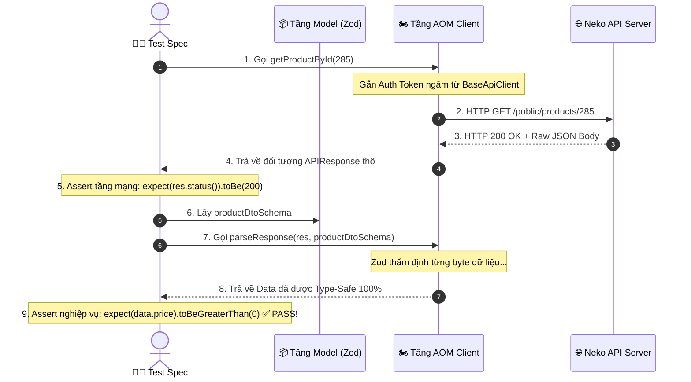
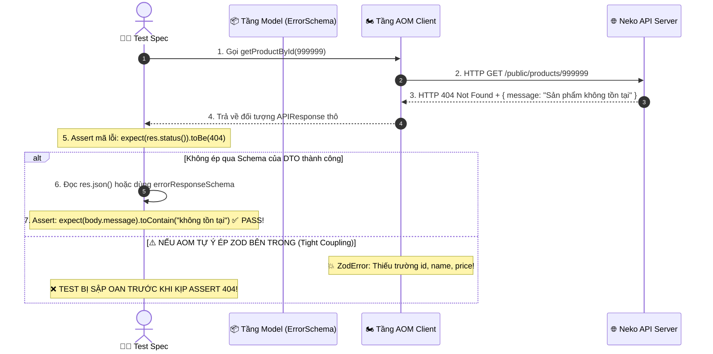

# 🏛️ BÀI 23: THIẾT KẾ CLEAN API AUTOMATION FRAMEWORK TRONG PLAYWRIGHT TYPESCRIPT

> **Dự án mẫu thực hành**: Hệ thống Logistics & E-Commerce **Neko Coffee API** (`https://api-neko-coffee.autoneko.com`)  
> **Ngôn ngữ & Công cụ**: Playwright Test, TypeScript (Strict Mode), Dependency Injection Fixtures, **Zod Schema Runtime Validation**  
> **Mục tiêu**: Xây dựng kiến trúc Framework kiểm thử API chuẩn Clean Architecture, áp dụng mô hình **Gatekeeper Fixture** và **Zod Contract Validation** đồng bộ với Module UI CRM để sẵn sàng hợp nhất thành **Hybrid UI + API Super Project**.

---

## 📑 MỤC LỤC BÀI HỌC

1. [Phần 1: Tư Duy Kiến Trúc (Architectural Mindset) 🌟](#phần-1-tư-duy-kiến-trúc-architectural-mindset-)
   * 1.1. Từ Spaghetti Test Scripts đến Clean Architecture
   * 1.2. API Object Model (AOM) — "Người anh em" của Page Object Model (POM)
   * 1.3. Nguyên Tắc Tách Biệt Mối Bận Tâm (Separation of Concerns)
   * 1.4. Triết Lý Gatekeeper: Cổng Vào Duy Nhất (Single Entrypoint)
2. [Phần 2: Thiết Kế Chi Tiết Từng Tầng (Deep Dive) 🏗️](#phần-2-thiết-kế-chi-tiết-từng-tầng-deep-dive-️)
   * 2.1. Tầng Zod Schemas & Contract Types (`models/`)
     - 2.1.1. Tại Sao TypeScript Interfaces Đơn Thuần Là Chưa Đủ?
     - 2.1.2. Quy Trình Trích Xuất Dữ Liệu Từ Scalar API Reference Đến Zod Schema Chuẩn Mực
     - 2.1.3. Phân Tích Nguồn Gốc Cụ Thể Của Từng Tệp Trong Dự Án (`common`, `product`, `auth`)
     - 2.1.4. 3 Cách Tự Động Chuyển Đổi JSON / TypeScript Model Sang Zod Schema Siêu Tốc
     - 2.1.5. Thực Hành Thực Chiến: Từng Bước Convert Payload JSON Của Neko Coffee & Kỹ Thuật Tinh Chỉnh Với 4 Dấu Vết Thám Tử
   * 2.2. Tầng Base API Client & `parseResponse` (`clients/base.api-client.ts`)
   * 2.3. Tầng Domain API Clients & Chiến Lược 2 Tầng Phương Thức (Raw HTTP vs Smart Data Methods)
      - 2.3.0. Vấn Đề Gánh Nặng Trí Nhớ & Sự Ra Đời Của Smart Data Methods (Cách 1: Zero Schema Memory)
      - 2.3.1. Phân Tích Chi Tiết `AuthApiClient` (`clients/auth.api-client.ts`)
      - 2.3.2. Phân Tích Chi Tiết `ProductApiClient` (`clients/product.api-client.ts`)
      - 2.3.3. Phân Tích Chi Tiết `EchoApiClient` (`clients/echo.api-client.ts`)
   * 2.4. Tầng Fixtures & Cơ Chế Hợp Nhất Gatekeeper (Single Entrypoint Engine)
      - 2.4.0. Bản Chất Kiến Trúc: Tại Sao Cần Gatekeeper & Bài Toán Phân Mảnh Fixtures?
      - 2.4.1. Chi Tiết `api-services.fixture.ts` (Nhà Máy Dịch Vụ Nghiệp Vụ)
      - 2.4.2. Chi Tiết Tầng Quản Lý Xác Thực (Từ Test-Scoped Đến 3-Tier Hybrid Auth)
      - 2.4.3. Phân Tích Chuyên Sâu Cổng Vào Hợp Nhất Gatekeeper (5 Trụ Cột Kỹ Thuật & 2 Biến Thể)
3. [Phần 3: Workflow Hoạt Động & Vòng Đời Thực Thi (Runtime Lifecycle) 🚀](#phần-3-workflow-hoạt-động--vòng-đời-thực-thi-runtime-lifecycle-)
   * 3.1. Cơ Chế Dependency Injection (DI) & Lazy Fixture Resolution
   * 3.2. Vòng Đời Tự Động Sinh Token Xác Thực (`staffToken` Fixture)
   * 3.3. Phân Tích Mã Nguồn 4 Suite Kiểm Thử Thực Tế (`specs/`)
   * 3.4. Kết Quả Chạy Kiểm Thử Thực Tế Trên Máy Chủ Neko Coffee Live
4. [Phần 4: Khả Năng Mở Rộng & Chiến Lược Hợp Nhất Zod UI + API (Scalability) 🛠️](#phần-4-khả-năng-mở-rộng--chiến-lược-hợp-nhất-zod-ui--api-scalability-️)
   * 4.1. Quy Trình 3 Bước Mở Rộng Thêm Domain Service Mới
   * 4.2. Triển Khai Thực Chiến: Mô Hình Hybrid Auth 3 Tầng Cho API (Mô Phỏng Lesson 17 UI)
   * 4.3. Chiến Lược Dùng Chung Zod Schemas Giữa UI và API (Single Source of Truth)
   * 4.4. Chiến Lược Ghép Nối Gatekeeper: Tạo Hybrid Super Gatekeeper
   * 4.5. Kỹ Thuật "Tạo Dữ Liệu Qua API — Xác Minh Trên Giao Diện UI" (API Seeding)
   * 4.6. Bảng Đối Chiếu Song Song Toàn Diện: UI POM vs API AOM

---

## Phần 1: Tư Duy Kiến Trúc (Architectural Mindset) 🌟

### 🔹 1.1. Từ Spaghetti Test Scripts Đến Clean Architecture

Trong các dự án tự động hóa non trẻ hoặc bài tập cơ bản (như Bài 21), lập trình viên kiểm thử thường viết tất cả mã nguồn trong một tệp duy nhất:
* Khởi tạo URL trực tiếp: `request.get('https://api-neko-coffee.autoneko.com/public/products')`.
* Tự lắp ghép Header: `headers: { 'Authorization': 'Bearer ' + token }`.
* Tự parse JSON thủ công và assert ngay trong thân hàm kiểm thử.

```text
┌─────────────────────────────────────────────────────────────────────────────────────────────┐
│                    TIẾN HÓA KIẾN TRÚC KIỂM THỬ API TRONG DOANH NGHIỆP                       │
├─────────────────────────────────────────────────────────────────────────────────────────────┤
│ ❌ GIAI ĐOẠN 1: SPAGHETTI SCRIPTS (Hỗn Loạn - Khó Bảo Trì):                                 │
│    • Mỗi bài test tự gọi 'request.get()', tự nối URL, tự gõ lại Token.                     │
│    • Khi Backend đổi URL '/public/products' thành '/api/v2/products' -> Sửa 100 tệp test!    │
│    • Không có Type-Safety: Sai chính tả một trường trong JSON payload -> Chỉ biết khi test sập│
├─────────────────────────────────────────────────────────────────────────────────────────────┤
│ 🟢 GIAI ĐOẠN 2: CLEAN API AUTOMATION FRAMEWORK (Chuẩn Doanh Nghiệp):                        │
│    • 1. Tầng Models (Zod Schemas): Xác thực cấu trúc dữ liệu JSON Runtime cả 2 chiều.       │
│    • 2. Tầng Clients (AOM): Đóng gói URL endpoint, phương thức HTTP, Header và logic mạng.  │
│    • 3. Tầng Fixtures: Quản lý vòng đời đăng nhập, tạo Token ngầm, chia sẻ context an toàn. │
│    • 4. Tầng Gatekeeper: Cổng phân phối duy nhất, bài test chỉ tập trung vào Assert nghiệp vụ│
└─────────────────────────────────────────────────────────────────────────────────────────────┘
```

---

### 🔹 1.2. API Object Model (AOM) — "Người Anh Em" Của Page Object Model (POM)

Khi bước chân vào kiểm thử giao diện (UI Automation), mọi kỹ sư đều nằm lòng câu thần chú: **"Hãy dùng Page Object Model (POM)!"**.  
Nhưng khi chuyển sang viết kiểm thử API, rất nhiều người lại quay trở về thời kỳ "đồ đá": mở từng file spec ra và viết trực tiếp `await request.get(...)`, `await request.post(...)`.

Mô hình **API Object Model (AOM)** — hay còn gọi trong giới kiến trúc phần mềm doanh nghiệp là **API Domain Service Layer** — chính là lời giải hoàn hảo, mang toàn bộ tinh hoa tổ chức của POM sang thế giới API.

---

#### 1.2.1. Nguồn Gốc Ra Đời: Vấn Đề Lớn Của Việc Gọi Request "Trần Trụi" (Raw Request)

Hãy nhìn vào nỗi đau kinh điển khi KHÔNG dùng AOM:

```typescript
// ❌ CÁCH VIẾT THỦ CÔNG (RAW PLAYWRIGHT REQUEST) TRONG SPEC:
test("Lấy sản phẩm", async ({ request }) => {
  // 1. Phải nhớ URL cụ thể
  const res = await request.get("https://api-neko-coffee.autoneko.com/public/products", {
    params: { page: 1, limit: 5, type: "bean" },
    headers: {
      "Accept": "application/json",
      "Authorization": `Bearer ${myToken}`, // 2. Tự lắp Header lặp đi lặp lại
    }
  });
  // 3. Tự parse JSON và không có Intellisense
  const data = await res.json();
  expect(res.status()).toBe(200);
});
```

Hậu quả khi dự án lên tới 200 bài test:
1. **Rò rỉ chi tiết hạ tầng HTTP**: Mọi bài test đều phải nhớ URL, Header, Query string, Cookie, cách gửi Form. Khi Backend nâng cấp lên `/api/v2/products` hoặc đổi query `limit` thành `per_page`, bạn phải mở 200 file spec ra sửa tay từng dòng!
2. **Trùng lặp mã nguồn (DRY Violation)**: Logic đính kèm Bearer Token xuất hiện ở khắp nơi.
3. **Không có Type-Safety & Code Suggestion**: Lập trình viên không biết endpoint đó nhận query params gì, payload gồm những trường nào, trừ khi phải mở tài liệu Swagger ra đọc lại từ đầu.

---

#### 1.2.2. Định Nghĩa & Triết Lý Cốt Lõi Của API Object Model (AOM)

> 💡 **Định nghĩa AOM**:  
> *"API Object Model là một mẫu thiết kế (Design Pattern) trừu tượng hóa các Endpoint và Nghiệp vụ mạng của một Microservice hoặc một Cụm tài nguyên thành một **Class chuyên trách (Domain Service Class)**. Bài test không tương tác trực tiếp với giao thức HTTP trần trụi mà tương tác thông qua các phương thức nghiệp vụ của Class này."*

* **Trong UI POM**: Class đại diện cho **Trang / Màn hình** (Page/Screen).
* **Trong API AOM**: Class đại diện cho **Miền Nghiệp vụ / Tài nguyên** (Domain Resource / Service), ví dụ: `ProductApiClient`, `AuthApiClient`, `OrderApiClient`.

---

#### 1.2.3. Cấu Trúc Giải Phẫu Một Class AOM Chuẩn Mực (Anatomy of AOM) & Ranh Giới Tách Biệt Với Model

> ❓ **CÂU HỎI KIẾN TRÚC CỐT TỬ**:  
> *"Class AOM có bao gồm Zod Schemas hay không? Tầng Model / DTO nằm ở đâu trong bức tranh tổng thể?"*

Câu trả lời dứt khoát từ góc độ Clean Architecture: **AOM KHÔNG CHỨA ZOD VÀ KHÔNG ĐỊNH NGHĨA MODEL!**

---

##### ⚖️ 1. PHÂN ĐỊNH RANH GIỚI TRÁCH NHIỆM (SEPARATION OF CONCERNS):

* **Tầng AOM (API Object Model / Service Layer)**:
  * **Trách nhiệm duy nhất**: Đóng vai trò **Tài xế vận chuyển HTTP (HTTP Transport Driver)**.
  * Chỉ quan tâm: URL Endpoint ở đâu? Header gắn thế nào? Gửi bằng phương thức `GET`, `POST` hay `PUT`? Dữ liệu đóng gói dạng `json`, `form` hay `multipart`?
  * **Giá trị trả về**: Luôn trả về đối tượng `Promise<APIResponse>` nguyên bản.
  * ❌ **AOM Tuyệt đối KHÔNG tự ý parse Zod bên trong method**: Nếu `productApi.getProducts()` tự động gọi `zod.parse()`, bạn sẽ **KHÔNG THỂ viết Negative Tests** (ví dụ kiểm thử mã lỗi 400, 401, 500 hay test máy chủ sập, vì Zod sẽ ném Exception sập test ngay trước khi kịp `expect(res.status()).toBe(400)`!).
* **Tầng Domain Models & Zod Schemas (`models/` hoặc `domain/`)**:
  * **Trách nhiệm**: Nằm độc lập ở **Tầng Nghiệp Vụ (Business Domain Entity)**.
  * Đây là **Hợp đồng dữ liệu (Data Contract)** đại diện cho thực thể kinh doanh (ví dụ: Bản thiết kế Sản phẩm `Product`, Khách hàng `Customer`, Hồ sơ `UserProfile`).
  * Tầng này là **Nguồn chân lý duy nhất (Single Source of Truth)** được dùng chung bởi cả 3 bên:
    1. AOM dùng làm Type gợi ý tham số đầu vào (Input DTO).
    2. Test Spec dùng làm thước đo kiểm định tính toàn vẹn (Assertion Contract).
    3. UI POM dùng làm dữ liệu điền Form hoặc Mock dữ liệu.

---

##### 🏛️ 2. SƠ ĐỒ GIẢI PHẪU CHUẨN XÁC CỦA CLASS AOM:

```text
┌─────────────────────────────────────────────────────────────────────────────────────────────┐
│                             GIẢI PHẪU 1 CLASS AOM (API OBJECT MODEL)                        │
├─────────────────────────────────────────────────────────────────────────────────────────────┤
│ 1. STATE & INFRASTRUCTURE (Trạng thái & Hạ tầng mạng):                                      │
│    • request: APIRequestContext (Engine mạng lõi của Playwright)                            │
│    • authToken?: string (Token Bearer được quản lý ngầm)                                    │
│    • buildHeaders(): Tự động tiêm Token & Header Accept                                     │
├─────────────────────────────────────────────────────────────────────────────────────────────┤
│ 2. TRANSPORT ACTIONS (Các hành động vận chuyển HTTP - Luôn trả về APIResponse):             │
│    • getProducts(query?: ProductFilterQuery): Promise<APIResponse>                          │
│    • getProductById(id: number): Promise<APIResponse>                                       │
│    • uploadImage(id: number, payload: MultipartPayload): Promise<APIResponse>               │
├─────────────────────────────────────────────────────────────────────────────────────────────┤
│ 3. GENERIC UTILITY HELPER (Công cụ hỗ trợ tiện ích - Tuỳ chọn):                             │
│    • parseResponse<T>(response, zodSchema): Nhận Schema từ Tầng Model để parse & validate!  │
└─────────────────────────────────────────────────────────────────────────────────────────────┘
```

---

##### 🔄 3. LUỒNG PHỐI HỢP NHỊP NHÀNG GIỮA AOM VÀ MODEL TRONG BÀI TEST (KÈM CODE MINH HỌA):

```text
┌─────────────────────────────────────────────────────────────────────────────────────────────────────────────────────────────────┐
│                                   KIẾN TRÚC ĐA TẦNG PHÂN TÁCH TRÁCH NHIỆM (DECOUPLED ARCHITECTURE)                              │
├─────────────────────────────────────────────────────────────────────────────────────────────────────────────────────────────────┤
│                                                                                                                                 │
│   ┌────────────────────────────────────────────────────────────────────────────────────────┐                                    │
│   │ 🟢 TẦNG 1: MODELS & ZOD SCHEMAS (models/product.schema.ts)                             │                                    │
│   │    • TypeScript Interface: ProductFilterQuery, CreateProductDto (Type an toàn lúc viết)│                                    │
│   │    • Zod Schema: productDtoSchema, errorResponseSchema (Hợp đồng dữ liệu Runtime)      │                                    │
│   └──────────────────────┬─────────────────────────────────────────────────┬───────────────┘                                    │
│                          │                                                 │                                                    │
│               (1) Cung cấp Input Types                          (4) Cung cấp Schema Contract                                    │
│                          │                                                 │                                                    │
│                          ▼                                                 ▼                                                    │
│   ┌────────────────────────────────────────────────┐    ┌──────────────────────────────────────────────────────────────────┐    │
│   │ 🟡 TẦNG 2: AOM CLIENT (ProductApiClient)       │    │ 🔵 TẦNG 3: TEST SPEC ORCHESTRATOR (specs/*.spec.ts)              │    │
│   │    • Kế thừa BaseApiClient                     │    │                                                                  │    │
│   │    • Nhận params theo đúng Type từ Tầng Model  │    │  [KỊCH BẢN POSITIVE (200 OK)]                                    │    │
│   │    • Gửi HTTP Request (GET/POST/PUT/DELETE)    │    │   1. Gọi productApi.getProductById(285)                          │    │
│   │    • QUY TẮC VÀNG: Luôn trả về APIResponse thô │    │   2. expect(res.status()).toBe(200)                             │    │
│   │    • Cung cấp hàm tiện ích: parseResponse()    │    │   3. productApi.parseResponse(res, productDtoSchema)             │    │
│   └──────────────────────┬─────────────────────────┘    │   4. expect(product.price_per_unit).toBeGreaterThan(0)          │    │
│                          │                              │                                                                  │    │
│               (2) Gửi Request mạng                      │  [KỊCH BẢN NEGATIVE (404 Not Found)]                             │    │
│                          │                              │   1. Gọi productApi.getProductById(999999)                       │    │
│                          ▼                              │   2. expect(res.status()).toBe(404)                             │    │
│   ┌────────────────────────────────────────────────┐    │   3. Đọc res.json() lỗi (KHÔNG ÉP QUA productDtoSchema!)         │    │
│   │ 🔴 HỆ THỐNG MÁY CHỦ (Neko Coffee Backend API)  │    │   4. Test PASS êm ru, KHÔNG BỊ ZOD CRASH TEST OAN UỔNG!          │    │
│   └──────────────────────┬─────────────────────────┘    └──────────────────────────────────▲───────────────────────────────┘    │
│                          │                                                                 │                                    │
│                          └──────────────── (3) Trả về APIResponse thô ─────────────────────┘                                    │
│                                                                                                                                 │
└─────────────────────────────────────────────────────────────────────────────────────────────────────────────────────────────────┘
```

---

###### 📊 SƠ ĐỒ TUẦN TỰ (SEQUENCE DIAGRAM): 2 LUỒNG PHỐI HỢP ĐỐI LẬP

###### 1️⃣ Luồng 1: Kịch bản Positive (Tra cứu sản phẩm hợp lệ 200 OK $\rightarrow$ Kích hoạt Máy quét Zod)



###### 2️⃣ Luồng 2: Kịch bản Negative (Tra cứu ID ma 999999 $\rightarrow$ An toàn tuyệt đối, không sập Test)



---

###### 📄 BƯỚC 1: TẦNG MODEL & ZOD SCHEMA (`models/product.schema.ts`)
*Nhiệm vụ*: Định nghĩa bản thiết kế dữ liệu (Single Source of Truth), hoàn toàn độc lập với Playwright Request và không chứa logic mạng.

```typescript
// modules/2-api/NekoCoffee/lesson-23/models/product.schema.ts
import { z } from "zod";

// 1. Zod Enums: Ràng buộc giá trị phân loại và độ rang
export const productTypeEnum = z.enum(["bean", "equipment", "accessory"]);
export type ProductType = z.infer<typeof productTypeEnum>;

export const roastLevelEnum = z.enum(["Light", "Medium", "Dark"]);
export type RoastLevel = z.infer<typeof roastLevelEnum>;

// 2. Zod Schema: Dùng để Validate Runtime
export const productDtoSchema = z.object({
  id: z.number().int().positive(),
  name: z.string().min(1),
  price_per_unit: z.number().positive(),
  type: productTypeEnum.nullable().optional(),
  origin: z.string().nullable().optional(),
  roast_level: roastLevelEnum.nullable().optional(),
  is_active: z.boolean(),
});

// 3. TypeScript Type: Dùng để Intellisense lúc viết code
export type ProductDto = z.infer<typeof productDtoSchema>;

// 4. Query Filter Model: Dùng cho tham số đầu vào của API
export interface ProductFilterQuery {
  type?: ProductType;
  origin?: string;
  roast_level?: RoastLevel;
  page?: number;
  limit?: number;
}
```

---

###### 📄 BƯỚC 2: TẦNG AOM CLIENT (`clients/product.api-client.ts`)
*Nhiệm vụ*: "Tài xế vận chuyển mạng". Nhận input type từ Tầng Model, gửi HTTP và **trả về nguyên bản `APIResponse`** (không tự ý assert, không tự ý parse Zod).

```typescript
// modules/2-api/NekoCoffee/lesson-23/clients/product.api-client.ts
import { APIResponse } from "@playwright/test";
import { BaseApiClient } from "./base.api-client";
import { ProductFilterQuery } from "../models/product.schema";

export class ProductApiClient extends BaseApiClient {
  // Chỉ nhận params và bắn request, luôn trả về Promise<APIResponse>
  public async getProducts(query?: ProductFilterQuery): Promise<APIResponse> {
    return this.get("/public/products", { params: query });
  }

  public async getProductById(id: number | string): Promise<APIResponse> {
    return this.get(`/public/products/${id}`);
  }
}
```

---

###### 📄 BƯỚC 3: TẦNG TEST SPEC (`specs/01-clean-crud-with-gatekeeper.spec.ts`)
*Nhiệm vụ*: Điều phối toàn bộ kịch bản kiểm thử. Gọi AOM để lấy phản hồi mạng, sau đó dùng Zod Schema từ Tầng Model để thẩm định chất lượng!

```typescript
// modules/2-api/NekoCoffee/lesson-23/specs/01-clean-crud-with-gatekeeper.spec.ts
import { test, expect } from "../fixtures/api-gatekeeper.fixture";
import { productDtoSchema } from "../models/product.schema";

test.describe("Minh họa phối hợp chuẩn giữa AOM và Tầng Model", () => {
  // KỊCH BẢN 1: POSITIVE TEST (Thành công -> Dùng Zod để Validate cấu trúc)
  test("Positive: Tra cứu sản phẩm hợp lệ và kiểm chứng hợp đồng", async ({ productApi }) => {
    // 1. Gọi AOM (Nhận về APIResponse thô)
    const response = await productApi.getProductById(285);
    
    // 2. Assert Status Code tại tầng Test
    expect(response.status()).toBe(200);

    // 3. Sử dụng Schema từ Tầng Model để thẩm định dữ liệu Backend
    const product = await productApi.parseResponse(response, productDtoSchema);

    // 4. Assert nghiệp vụ chi tiết
    expect(product.id).toBe(285);
    expect(product.price_per_unit).toBeGreaterThan(0);
    console.log(`✅ Sản phẩm [${product.name}] thỏa mãn 100% Schema!`);
  });

  // KỊCH BẢN 2: NEGATIVE TEST (Lỗi 404 -> Vì AOM không ép Zod nên test chạy êm ru!)
  test("Negative: Tra cứu ID không tồn tại phải trả về mã 404", async ({ productApi }) => {
    // Gọi AOM với ID ma không tồn tại
    const response = await productApi.getProductById(99999999);

    // Assert mã lỗi 404 chính xác (KHÔNG HỀ BỊ ZOD CRASH TEST!)
    expect(response.status()).toBe(404);
    
    const errorBody = await response.json();
    expect(errorBody.message).toContain("không tìm thấy");
    console.log("✅ Máy chủ phản hồi chính xác 404 Not Found!");
  });
});
```

---

###### ⚖️ BẢNG MA TRẬN PHÂN ĐỊNH TRÁCH NHIỆM (SEPARATION OF CONCERNS MATRIX)

| Thành phần | Thuộc tầng nào? | Trách nhiệm chính | Điều TUYỆT ĐỐI KHÔNG LÀM |
| :--- | :--- | :--- | :--- |
| **Model / Zod** | Tầng Dữ liệu (`models/`) | • Định nghĩa Schema & Type<br>• Xác lập quy chuẩn hợp đồng | ❌ Không gọi HTTP<br>❌ Không phụ thuộc Playwright |
| **AOM Client** | Tầng Mạng (`clients/`) | • Gửi HTTP Request<br>• Gắn Header / Auth Token ngầm<br>• Luôn trả về `APIResponse` | ❌ Không tự ý `expect()`<br>❌ Không tự ép parse Zod bên trong hàm action |
| **Test Spec** | Tầng Kịch bản (`specs/`) | • Điều phối luồng test<br>• Assert Status Code<br>• Quyết định dùng Schema nào để parse | ❌ Không viết trực tiếp URL thô `/public/...`<br>❌ Không quản lý Header thủ công |

---

#### 1.2.3. Tại Sao Không Nên Ép Parse Zod Duy Nhất Một Tầng? — Sự Tiến Hóa Lên Kiến Trúc 2 Tầng Phương Thức (Cách 1)

💡 **Bài Học Kiến Trúc Cốt Lõi: Ranh giới sống còn giữa Framework nghiệp dư và Clean Enterprise Framework**

##### 🛑 1. Bản Chất Hoạt Động Của Máy Quét Zod
Zod giống như một chiếc máy quét an ninh cổng sân bay cực kỳ nghiêm ngặt:
* Bạn định nghĩa `productDtoSchema` bắt buộc phải có `id` (number), `name` (string), `price_per_unit` (number > 0).
* **Luật bất biến của Zod**: Hễ đưa vào bất kỳ dữ liệu nào **sai lệch khỏi cấu trúc trên**, Zod sẽ **lập tức ném ra ZodError Exception làm SẬP NGAY CHƯƠNG TRÌNH (Crash Test)**!

##### 💥 2. Sai Lầm Tai Hại: Ép Parse Zod Duy Nhất Một Tầng (Single-Tier Forced Parsing Anti-Pattern)
Nếu lập trình viên thiết kế Client bằng cách **thay thế hoàn toàn** hàm raw bằng hàm tự parse Zod bên trong:
```typescript
// ❌ SAI LẦM TAI HẠI: Chỉ cung cấp 1 hàm duy nhất và ép buộc parse Zod bên trong
export class ProductApiClient extends BaseApiClient {
  public async getProductById(id: number): Promise<ProductDto> {
    const res = await this.get(`/public/products/${id}`);
    
    // 💥 NGUY HIỂM: BẮT MỌI RESPONSE PHẢI THỎA MÃN PRODUCTDTO SCHEMA!
    return this.parseResponse(res, productDtoSchema); 
  }
}
```
Khi chạy **Negative Test** (ví dụ tra cứu ID ma `99999999` để kiểm tra máy chủ có trả lỗi 404 hay không):
1. Backend xử lý chuẩn mực, trả về mã `404 Not Found` kèm body lỗi: `{ statusCode: 404, message: "Sản phẩm không tồn tại" }`.
2. Hàm AOM tự động nhét JSON lỗi này vào `productDtoSchema`.
3. Zod thấy thiếu `name`, thiếu `price_per_unit` ➔ **Zod ném Exception văng tung tóe làm crash bài test ngay lập tức!**
4. Dòng lệnh `expect(response.status()).toBe(404)` ở kịch bản test **không bao giờ có cơ hội được chạy tới**.
5. 💀 **Hậu quả**: Backend làm đúng (trả 404), nhưng bài test của Tester lại bị FAIL vì lỗi crash của Zod!

##### ⚠️ 3. Bất Cập Của Giai Đoạn "Tách Rời Thủ Công Ở Từng Test Spec"
Để khắc phục lỗi sập Negative test trên, một số framework chuyển sang cách tiếp cận: Client chỉ trả về `APIResponse` thô, còn việc parse Zod thì bắt Tester ở file test spec tự gọi:
```typescript
// ⚠️ GIAI ĐOẠN TRUNG GIAN: Bắt Tester tự gọi parseResponse ở mọi bài test
test("Lấy sản phẩm", async ({ productApi }) => {
  const res = await productApi.getProducts({ page: 1, limit: 5 });
  // Tester phải tự import productListResponseSchema và tự gọi:
  const data = await productApi.parseResponse(res, productListResponseSchema);
});
```
*Cách này giải quyết được Negative test, nhưng lại sinh ra **Gánh nặng trí nhớ (Cognitive Overload) khổng lồ**: Tester phải nhớ chính xác tên hàng chục Schema và import thủ công ở đầu mỗi tệp test!

##### ⭐️ 4. Lời Giải Hoàn Hảo Của Senior Architect: Kiến Trúc 2 Tầng Phương Thức Song Hành (2-Tier Method Strategy - Cách 1)
Thay vì bắt chọn 1 trong 2, chúng ta cung cấp **cả 2 tầng phương thức song hành** ngay trong mỗi Domain Client:
1. **Tầng 1 (HTTP Raw Methods - `*()` -> `Promise<APIResponse>`)**:
   - `getProductById()`, `getProducts()`, `getMe()`, `login()`, `uploadImage()`...
   - Giữ nguyên để phục vụ **Negative Testing (401, 403, 404, 500)**, kiểm tra HTTP Status Code, Headers, Cookies.
2. **Tầng 2 (Smart Data Methods - `*Data()` -> `Promise<T>`)**:
   - `getProductDetailData()`, `getProductsData()`, `getMeData()`, `loginData()`, `uploadImageData()`...
   - Đóng gói ngầm Zod Validation bên trong để phục vụ **Happy Path Testing & Data Seeding** với chuẩn **Zero Schema Memory**!

##### 📊 Ma Trận Đối Chiếu 3 Cách Tiếp Cận Kiến Trúc:

| Tiêu Chí Đánh Giá | ❌ Cách Tiếp Cận 1: Đơn Tầng Ép Zod (Tight Coupling) | ⚠️ Cách Tiếp Cận 2: Tách Rời Thủ Công Ở Spec | ⭐️ Cách 1 Cải Tiến: 2 Tầng Song Hành (2-Tier Strategy) |
|---|---|---|---|
| **Cơ chế Client** | Chỉ có 1 hàm, ép parse Zod bên trong | Chỉ có hàm trả về `APIResponse`, spec tự parse | Cung cấp song song: Raw Method (`*`) + Smart Method (`*Data`) |
| **Kịch bản Happy Path (200 OK)** | ✅ Gọn gàng | ⚠️ Dài dòng (phải import Schema và gọi `parseResponse`) | ⭐️ **Siêu gọn, 1 dòng lệnh: `const data = await api.getData()`** |
| **Gánh nặng nhớ Schema** | Không cần nhớ | ❌ **Phải nhớ và import hàng chục Schema** | ⭐️ **ZERO SCHEMA MEMORY (Không cần nhớ Schema)** |
| **Kịch bản Negative (401, 404)** | ❌ **SẬP TEST (Crash)** do Zod bắt lỗi | ⭐️ An toàn (kiểm tra được mã 404) | ⭐️ **Tuyệt đối an toàn (Dùng Raw Method để kiểm tra mã lỗi)** |
| **Chuẩn mực thiết kế** | Nghiệp dư (Anti-pattern) | Chấp nhận được | 🏆 **Chuẩn Clean Enterprise Framework** |

---

#### 1.2.4. Bảng Đối Chiếu Đối Xứng Toàn Diện: UI POM vs API AOM

| Tiêu Chí Kiến Trúc | UI Automation: Page Object Model (POM) | API Automation: API Object Model (AOM) |
|---|---|---|
| **Mục đích sinh ra** | Trừu tượng hóa DOM HTML & CSS Selector | Trừu tượng hóa HTTP Methods, Headers & URLs |
| **Thực thể quản lý** | Input fields, Buttons, Dropdowns, Modals | Path Params, Query Params, Headers, Body Payload |
| **Base Class** | `BasePage` (bọc `Page`, `goto`, `waitForSelector`) | `BaseApiClient` (bọc `APIRequestContext`, `get`, `post`) |
| **Domain Class** | `CRMLoginPage`, `CRMCustomerPage` | `AuthApiClient`, `ProductApiClient`, `OrderApiClient` |
| **Hành động người dùng (Actions)** | `fillUsername()`, `clickSubmit()`, `selectRole()` | `login()`, `getProducts()`, `uploadImage()` |
| **Dữ liệu đầu vào (Input Model)** | Model Form (`CustomerInfo`, `LoginCredentials`) | DTO / Zod Schema (`RegisterRequest`, `ProductFilterQuery`) |
| **Xác thực kết quả (Assertion)** | `expect(page.locator(...)).toBeVisible()` | `expect(res.status()).toBe(200)` + `parseResponse(schema)` |
| **Xử lý chuỗi (Chaining)** | `loginPage.login() -> returns DashboardPage` | `authApi.login() -> returns authedProductClient` |

---

#### 1.2.5. So Sánh Mã Nguồn Thực Tế Trực Quan (Side-by-Side Code)

Hãy xem sự tương đồng tuyệt mỹ giữa UI POM và API AOM trong dự án của chúng ta:

```typescript
// ════════════════════════════════════════════════════════════════════════════
// 🖥️ PHÍA UI: PAGE OBJECT MODEL (CRM Customer)
// ════════════════════════════════════════════════════════════════════════════
export class CRMCustomerPage extends BasePage {
  private readonly companyInput = this.page.locator("#company");
  private readonly saveButton = this.page.getByRole("button", { name: "Save" });

  async createCustomer(info: CustomerInfo): Promise<void> {
    await this.companyInput.fill(info.company);
    await this.saveButton.click();
  }
}

// Trong Spec UI:
test("Tạo khách hàng mới UI", async ({ customerPage }) => {
  await customerPage.createCustomer({ company: "AutoNeko Corp" });
  await expect(customerPage.successToast).toBeVisible();
});
```

```typescript
// ════════════════════════════════════════════════════════════════════════════
// ☕ PHÍA API: API OBJECT MODEL (Neko Coffee Product)
// ════════════════════════════════════════════════════════════════════════════
export class ProductApiClient extends BaseApiClient {
  async getProducts(query?: ProductFilterQuery): Promise<APIResponse> {
    return this.get("/public/products", { params: query });
  }

  async uploadImage(id: number, payload: MultipartPayload): Promise<APIResponse> {
    return this.post(`/api/products/${id}/image`, { multipart: { image: payload } });
  }
}

// Trong Spec API:
test("Tra cứu sản phẩm API", async ({ productApi }) => {
  const res = await productApi.getProducts({ type: "bean", limit: 5 });
  const data = await productApi.parseResponse(res, productListResponseSchema);
  expect(data.data.length).toBeGreaterThan(0);
});
```

---

#### 1.2.6. Năm Giá Trị Sống Còn Khi Sử Dụng AOM Trong Dự Án Lớn

1. 🎯 **Một Nơi Thay Đổi Duy Nhất (Single Point of Modification)**: Khi Endpoint `/public/products` đổi thành `/api/v3/products`, bạn chỉ sửa đúng 1 dòng trong `ProductApiClient`. Tất cả các bài test vẫn hoạt động bình thường mà không cần đụng đến!
2. 🔒 **Bảo Vệ Token Tuyệt Đối**: Tester viết bài test không cần biết Token được lấy thế nào, không cần nối chuỗi `Bearer ${token}`. `BaseApiClient` tự động kiểm tra và tiêm Token vào Header một cách an toàn.
3. ⚡ **Intellisense Tối Đa**: Nhờ TypeScript và DTOs, khi gõ `productApi.getProducts({ ... })`, IDE sẽ tự động gợi ý các tham số `page`, `limit`, `type`, `search` mà không cần đoán mò.
4. 🛡️ **Kết Hợp Zod Contract Validation Mượt Mà**: Nhờ có hàm `parseResponse(res, schema)` tích hợp sẵn trong AOM, mọi cuộc gọi API đều có thể kiểm tra tính toàn vẹn dữ liệu chỉ với 1 dòng lệnh.
5. 🚀 **Nền Tảng Cho Hybrid Automation**: Vì AOM được thiết kế như một đối tượng dịch vụ độc lập, bạn có thể dễ dàng tiêm nó vào bài test UI để chuẩn bị dữ liệu (Data Seeding) siêu tốc!

---

### 🔹 1.3. Nguyên Tắc Tách Biệt Mối Bận Tâm (Separation of Concerns - SoC)

---

#### 1.3.1. Khái Niệm Cốt Lõi & Lịch Sử Của Nguyên Tắc SoC

Nguyên tắc **Tách biệt Mối bận tâm (Separation of Concerns - SoC)** được nhà khoa học máy tính huyền thoại **Edsger W. Dijkstra** đề xuất từ năm 1974. Tư tưởng cốt lõi của ông vô cùng ngắn gọn nhưng thông tuệ:
> *"Hãy chia nhỏ một bài toán phức tạp thành nhiều khía cạnh khác nhau, sao cho mỗi khía cạnh có thể được nghiên cứu và giải quyết độc lập mà không cần phải ôm đồm tất cả các vấn đề cùng một lúc."*

Trong lĩnh vực **Kiểm thử tự động (Test Automation)**, vi phạm nguyên tắc SoC là nguyên nhân số 1 khiến các dự án tự động hóa bị "chết yểu" sau 3 - 6 tháng hoạt động. Khi đó, các bài test biến thành những **"God Scripts" (Kịch bản ôm đồm mọi thứ)**:
* Vừa lo kết nối mạng, nhớ URL máy chủ.
* Vừa lo gõ mật khẩu, tự gọi đăng nhập để lấy Token.
* Vừa lo ghép chuỗi tham số Query String.
* Vừa lo cấu trúc JSON gồm những trường nào.
* Vừa lo assert nghiệp vụ.

👉 **Hậu quả**: Khi Backend thay đổi một chi tiết nhỏ (ví dụ đổi cách đặt tên Token hoặc đổi URL), **toàn bộ hệ thống test sụp đổ hàng loạt**, chi phí bảo trì (maintenance cost) vượt xa thời gian viết test mới!

---

#### 1.3.2. Bốn Mối Bận Tâm Độc Lập Trong Clean API Framework

Để xây dựng một Framework kiểm thử trường tồn với thời gian, chúng ta bóc tách hệ thống thành **4 tầng trách nhiệm hoàn toàn độc lập**, mỗi tầng chỉ quan tâm đến DUY NHẤT một câu hỏi:

```text
┌─────────────────────────────────────────────────────────────────────────────────────────────┐
│                    BỐN MỐI BẬN TÂM ĐỘC LẬP TRONG CLEAN API AUTOMATION                       │
├─────────────────────────────────────────────────────────────────────────────────────────────┤
│                                                                                             │
│  1. TẦNG TEST SPEC (specs/)          ❓ "TÔI MUỐN TEST CÁI GÌ? (WHAT TO TEST)"             │
│     • Chỉ quan tâm: Ý định kiểm thử (Test Intent), luồng kịch bản và Assertions.           │
│     • Không quan tâm: URL nằm ở đâu, Token lấy từ đâu, cách gửi form hay JSON.             │
│                                                                                             │
│  2. TẦNG GATEKEEPER (fixtures/)       ❓ "AI CHUẨN BỊ MÔI TRƯỜNG & TÀI NGUYÊN? (LIFECYCLE)" │
│     • Chỉ quan tâm: Vòng đời (Setup -> Teardown), tự sinh Token ngầm, chia sẻ tài nguyên.  │
│     • Không quan tâm: Chi tiết bên trong của từng endpoint HTTP.                           │
│                                                                                             │
│  3. TẦNG AOM CLIENTS (clients/)       ❓ "GIAO TIẾP VỚI MÁY CHỦ BẰNG CÁCH NÀO? (TRANSPORT)" │
│     • Chỉ quan tâm: URL Endpoint, HTTP Verbs (GET/POST/PUT), Headers, Form/Multipart.       │
│     • Không quan tâm: Kết quả đúng hay sai (luôn trả về APIResponse nguyên bản).           │
│                                                                                             │
│  4. TẦNG DOMAIN MODELS (models/)      ❓ "DỮ LIỆU CÓ CẤU TRÚC GÌ & CÓ HỢP LỆ? (CONTRACT)"   │
│     • Chỉ quan tâm: Định nghĩa hình dáng dữ liệu (DTO), Schema Zod để kiểm định runtime.   │
│     • Không quan tâm: Playwright là gì, mạng truyền qua HTTP hay giao thức nào.            │
│                                                                                             │
└─────────────────────────────────────────────────────────────────────────────────────────────┘
```

---

#### 1.3.3. Bảng Ma Trận Tác Động Khi Có Thay Đổi (Change Impact Matrix)

Sức mạnh thực sự của Separation of Concerns chỉ bộc lộ khi hệ thống thực tế gặp biến cố hoặc nâng cấp. Bảng ma trận dưới đây chứng minh tính ưu việt của kiến trúc: **Mỗi thay đổi từ Backend chỉ tác động đến đúng 1 tệp duy nhất!**

| Tình Huống Thay Đổi Trong Thực Tế | Tệp Bị Tác Động Duy Nhất | Các Tệp Hoàn Toàn KHÔNG Cần Sửa Đổi |
|---|---|---|
| **1. Đổi Endpoint URL**<br>Backend đổi `/public/products` thành `/api/v2/catalog/products` | `clients/product.api-client.ts` *(Sửa đúng 1 dòng URL)* | ✅ Toàn bộ Spec, Fixture và Model giữ nguyên 100%! |
| **2. Đổi Cơ Chế Xác Thực (Auth Mechanism)**<br>Backend chuyển từ `Authorization: Bearer <token>` sang `X-API-Key: <key>` | `clients/base.api-client.ts` *(Sửa hàm `buildHeaders()`)* | ✅ Hàng trăm bài test spec và các domain clients không cần sửa! |
| **3. Thay Đổi Cấu Trúc Bảng Database**<br>Cơ sở dữ liệu bổ sung thêm trường `brand: string` và đổi `origin` thành bắt buộc | `models/product.schema.ts` *(Cập nhật Zod Schema)* | ✅ Tầng AOM Client và cấu hình Test giữ nguyên! |
| **4. Thay Đổi Môi Trường Test (CI/CD)**<br>Chuyển từ môi trường `Staging` sang `Production` hoặc `Docker` | `playwright.lesson23-api.config.ts` *(Sửa `baseURL`)* | ✅ Toàn bộ mã nguồn code và client giữ nguyên! |
| **5. Đổi Logic Nghiệp Vụ Của Bài Test**<br>QA Lead yêu cầu kiểm tra giá sản phẩm phải lớn hơn `50.000đ` thay vì `0đ` | `specs/01-clean-crud-with-gatekeeper.spec.ts` *(Sửa dòng assert)* | ✅ Toàn bộ tầng hạ tầng bên dưới không bị ảnh hưởng! |

---

#### 1.3.4. Ranh Giới "Củ Hành" (Architectural Onion & Dependency Rule)

Trong Clean Architecture, các tầng phụ thuộc tuân thủ **Quy tắc Phụ thuộc Một Chiều (The Dependency Rule)**:
> *"Mã nguồn ở các tầng bên ngoài chỉ được phép phụ thuộc vào các tầng bên trong. Các tầng bên trong TUYỆT ĐỐI KHÔNG BIẾT VÀ KHÔNG PHỤ THUỘC vào tầng bên ngoài."*

```text
       ┌────────────────────────────────────────────────────────┐
       │ TẦNG NGOÀI CÙNG: TEST SPECS (01-crud.spec.ts)         │
       │    Phụ thuộc vào: Gatekeeper, AOM Clients, Models      │
       │                                                        │
       │   ┌────────────────────────────────────────────────┐   │
       │   │ TẦNG GIỮA: GATEKEEPER FIXTURES & AOM CLIENTS   │   │
       │   │    Phụ thuộc vào: Models, Playwright Context   │   │
       │   │                                                │   │
       │   │   ┌────────────────────────────────────────┐   │   │
       │   │   │ TẦNG LÕI TRUNG TÂM: DOMAIN MODELS      │   │   │
       │   │   │    (models/product.schema.ts)          │   │   │
       │   │   │    Thuần khiết 100% - KHÔNG PHỤ THUỘC  │   │   │
       │   │   │    VÀO BẤT KỲ TẦNG NÀO BÊN NGOÀI!      │   │   │
       │   │   └────────────────────────────────────────┘   │   │
       │   └────────────────────────────────────────────────┘   │
       └────────────────────────────────────────────────────────┘
```

* **Tầng Models ở trung tâm**: Không import bất kỳ thứ gì từ Playwright hay AOM. Nó chỉ là TypeScript thuần và Zod. Vì vậy, khi bạn muốn dùng lại Model này cho dự án UI Automation, cho ứng dụng Frontend React, hay cho Backend Node.js, bạn có thể copy/share trực tiếp mà **không bị dính líu đến bất kỳ thư viện kiểm thử nào**!
* **Tầng AOM Client ở giữa**: Chỉ tập trung vận chuyển dữ liệu.
* **Tầng Test Spec ở ngoài cùng**: Chỉ đóng vai trò người tiêu thụ (Consumer), ghép nối các dịch vụ để tạo thành một kịch bản kiểm thử hoàn chỉnh.

---

### 🔹 1.4. Triết Lý Gatekeeper: Cổng Vào Duy Nhất (Single Entrypoint)

---

#### 1.4.1. Nguồn Gốc & Vấn Đề "Import Hell" Trong Các Dự Án Lớn

Trong các dự án tự động hóa thông thường không có cơ chế Gatekeeper, khi một bài test muốn thực hiện kiểm thử kết hợp nhiều dịch vụ, lập trình viên thường phải đối mặt với **cơn ác mộng Import Hell**:

```typescript
// ❌ CƠN ÁC MỘNG "IMPORT HELL" TRONG TỪNG TỆP TEST:
import { test as base, expect } from "@playwright/test";
import { AuthApiClient } from "../clients/auth.api-client";
import { ProductApiClient } from "../clients/product.api-client";
import { EchoApiClient } from "../clients/echo.api-client";
import { getStaffToken } from "../helpers/auth-helper";
import { FileResolverHelper } from "../utils/file-resolver.helper";
import { productDtoSchema } from "../models/product.schema";

base("Kiểm thử sản phẩm", async ({ request }) => {
  // Tự khởi tạo thủ công từng Client:
  const token = await getStaffToken(request);
  const authApi = new AuthApiClient(request, token);
  const productApi = new ProductApiClient(request, token);
  // ...
});
```

Hậu quả:
1. **Trùng lặp 10-15 dòng import** ở đầu mỗi tệp test.
2. **Khởi tạo thủ công, phân tán**: Mỗi bài test tự `new Client(request, token)`, tự quản lý token, dễ gây rò rỉ bộ nhớ hoặc gọi API trùng lặp.
3. **Mất kiểm soát vòng đời**: Không tận dụng được cơ chế Setup/Teardown tự động của Playwright Test Runner.

---

#### 1.4.2. Khái Niệm & Bản Chất Của Mô Hình Gatekeeper

> 🛡️ **Định nghĩa Gatekeeper**:  
> *"Gatekeeper (Người gác cổng) là một Fixture trung tâm đóng vai trò là **Cổng Vào Duy Nhất (Single Entrypoint)** cho toàn bộ hệ sinh thái kiểm thử. Nó sử dụng kỹ thuật **Intersection Type (`&`)** của TypeScript để hợp nhất mọi nguồn Fixtures độc lập (Auth, Services, Validator, Data) thành một hợp đồng thống nhất, đồng thời re-export lại hàm `test` và `expect`."*

Nhờ Gatekeeper, mọi tệp spec trong toàn bộ dự án chỉ cần đúng **1 dòng import duy nhất**:

```typescript
// 🟢 CHUẨN MỰC CLEAN ARCHITECTURE VỚI GATEKEEPER & SMART AOM:
import { test, expect } from "../fixtures/api-gatekeeper.fixture";

test("Tra cứu sản phẩm", async ({ productApi, authedStaffClient }) => {
  // ⚡ Cách 1 (Smart Method): Không cần nhớ Schema, nhận ngay Typed Data đã qua Zod validation!
  const listData = await productApi.getProductsData({ page: 1, limit: 5 });
  expect(listData.data.length).toBeGreaterThan(0);

  // 🛡️ Cách 2 (Raw Method): Dùng khi cần kiểm tra cụ thể Status Code hoặc Negative Test
  const rawRes = await productApi.getProducts();
  expect(rawRes.status()).toBe(200);
});
```

---

#### 1.4.3. Bốn Trụ Cột Kỹ Thuật Làm Nên Sức Mạnh Của Gatekeeper

##### 1. Kỹ Thuật Hợp Nhất Hợp Đồng Bằng Intersection Type (`&`)
Gatekeeper không gộp code bằng cách copy-paste, mà dùng toán tử `&` của TypeScript để hợp nhất các Interfaces:
```typescript
// 合 Nhất ApiAuthFixtures và ApiServicesFixtures thành một hợp đồng tổng hợp:
export type ApiGatekeeperFixtures = ApiAuthFixtures & ApiServicesFixtures;
```
*Lợi ích*: Khi bạn gõ `async ({ ... }) => {}`, IDE sẽ tự động gợi ý toàn bộ danh sách services (`productApi`, `echoApi`, `authApi`, `staffToken`, `authedStaffClient`) với đầy đủ kiểu dữ liệu rõ ràng.

##### 2. Cơ Chế Mở Rộng Bằng Toán Tử Spread (`...`)
```typescript
export const test = apiAuth.extend<ApiGatekeeperFixtures>({
  ...apiServicesFixtures,
});
```
* `apiAuth` đã là một test runner mang sẵn các fixture xác thực (`authApi`, `staffToken`).
* Chúng ta dùng `...apiServicesFixtures` để "rót" thêm các fixture dịch vụ nghiệp vụ vào.
* Việc gộp này hoàn toàn là **khai báo công thức (Formula Definition)**, Playwright **không hề chạy code** tại thời điểm import.

##### 3. Cơ Chế Kích Hoạt Lười (Lazy Dependency Waterfall)
Playwright chỉ kích hoạt những gì được bài test khai báo:
* Nếu test chỉ gọi `{ echoApi }`: Playwright chỉ tạo `echoApi`. Chuỗi đăng nhập `staffToken` hoàn toàn ngủ yên, không tốn 1 mili-giây nào!
* Nếu test gọi `{ authedStaffClient }`: Playwright tự động giải quyết cây phụ thuộc:
  `authedStaffClient` → cần `staffToken` → cần `authApi` → cần `request`.


##### 4. Tấm Khiên Bảo Vệ Test Spec (Infrastructure Decoupling Shield)
Khi cách thức đăng nhập của hệ thống thay đổi (ví dụ từ gọi `/auth/login` chuyển sang đọc file Cookie JSON), bạn **chỉ sửa đúng tệp fixture tương ứng**. Toàn bộ hàng trăm tệp spec kiểm thử phía trên **hoàn toàn không phải sửa một dòng nào**!

---

#### 1.4.4. Đối Chiếu Hai "Người Anh Em": UI CRM Gatekeeper vs API Neko Coffee Gatekeeper

Hãy quan sát sự nhất quán tuyệt đối về tư duy kiến trúc giữa Module UI CRM (Module 1) và Module API Neko Coffee (Bài 23):

| Tiêu Chí Kỹ Thuật | Phía UI CRM ([`gatekeeper.fixture.ts`](../../../../1-basics/03-pom/CRM/fixtures/gatekeeper.fixture.ts)) | Phía API Neko Coffee ([`api-gatekeeper.fixture.ts`](../fixtures/api-gatekeeper.fixture.ts)) |
|---|---|---|
| **Cụm Fixture Xác Thực** | `auth.fixture.ts` (`loginPage`, `authedPage`) | `api-auth.fixture.ts` (`authApi`, `staffToken`, `authedStaffClient`) |
| **Cụm Fixture Nghiệp Vụ** | `app.fixture.ts` (`customerPage`, `dashboardPage`) | `api-services.fixture.ts` (`productApi`, `echoApi`) |
| **Hợp Nhất Contract** | `type GatekeeperFixtures = AuthFixture & AppFixture;` | `type ApiGatekeeperFixtures = ApiAuthFixtures & ApiServicesFixtures;` |
| **Lệnh Tạo Test** | `export const test = auth.extend<GatekeeperFixtures>({ ...appFixtures });` | `export const test = apiAuth.extend<ApiGatekeeperFixtures>({ ...apiServicesFixtures });` |
| **Re-export Assertion** | `export { expect } from "@playwright/test";` | `export { expect } from "@playwright/test";` |
| **Cách dùng tại Spec** | `import { test, expect } from "./fixtures/gatekeeper.fixture";` | `import { test, expect } from "../fixtures/api-gatekeeper.fixture";` |

---

#### 1.4.5. Tầm Nhìn Chiến Lược: Hợp Nhất Thành "Hybrid Super Gatekeeper"

Vì cả UI Gatekeeper và API Gatekeeper đều được xây dựng trên cùng một chuẩn mực mở rộng của Playwright, trong tương lai khi bạn cần kết hợp kiểm thử E2E cả UI lẫn API, việc hợp nhất diễn ra **đơn giản đến khó tin**:

```typescript
// fixtures/hybrid-gatekeeper.fixture.ts (TƯƠNG LAI)
import { test as uiGatekeeper, type GatekeeprFixtures as UIGatekeeperFixtures } from "modules/1-basics/03-pom/CRM/fixtures/gatekeeper.fixture";
import { apiServicesFixtures, type ApiServicesFixtures } from "modules/2-api/NekoCoffee/lesson-23/fixtures/api-services.fixture";
import { apiAuth, type ApiAuthFixtures } from "modules/2-api/NekoCoffee/lesson-23/fixtures/api-auth.fixture";

// Hợp nhất cả 2 thế giới UI & API thành Super Contract:
export type HybridSuperFixtures = UIGatekeeperFixtures & ApiAuthFixtures & ApiServicesFixtures;

export const test = uiGatekeeper.extend<HybridSuperFixtures>({
  ...apiServicesFixtures,
});

export { expect } from "@playwright/test";
```

*Trong bài test Hybrid, bạn có thể destructure cùng lúc cả Page của UI lẫn Service của API*:
```typescript
test("Tạo sản phẩm qua API và kiểm tra giao diện trên UI", async ({ authedStaffClient, productPage, page }) => {
  // 1. API Service chạy siêu tốc trong 200ms:
  const res = await authedStaffClient.productApi.createProduct({ name: "Cà phê Robusta", price_per_unit: 150000 });
  const newProduct = await res.json();

  // 2. Mở trình duyệt UI kiểm tra ngay:
  await page.goto(`/products/${newProduct.id}`);
  await expect(productPage.title).toHaveText("Cà phê Robusta");
});
```

---

## Phần 2: Thiết Kế Chi Tiết Từng Tầng (Deep Dive) 🏗️

```text
modules/2-api/NekoCoffee/lesson-23/
├── docs/                                           # Tài liệu giáo trình
│   └── CLEAN_API_AUTOMATION_FRAMEWORK_DEEP_DIVE.md
├── models/                                         # Zod Schemas & Inferred Types
│   ├── common.schema.ts                            # paginationMetaSchema, apiErrorResponseSchema
│   ├── auth.schema.ts                              # registerRequestSchema, userProfileSchema
│   ├── product.schema.ts                           # productDtoSchema, productListResponseSchema
│   └── index.ts                                    # Barrel export
├── clients/                                        # Tầng API Object Model
│   ├── base.api-client.ts                          # Base client bọc APIRequestContext & parseResponse
│   ├── auth.api-client.ts                          # Tác vụ xác thực (/auth/*)
│   ├── product.api-client.ts                       # Tác vụ sản phẩm (/public/products, upload)
│   └── echo.api-client.ts                          # Tác vụ echo & utility (/public/test/*)
├── fixtures/                                       # Tầng Fixtures & Gatekeeper
│   ├── api-services.fixture.ts                     # Cung cấp productApi, echoApi
│   ├── api-auth.fixture.ts                         # Cung cấp authApi, staffToken, authedStaffClient
│   └── api-gatekeeper.fixture.ts                   # CỔNG VÀO HỢP NHẤT DUY NHẤT
└── specs/                                          # Các kịch bản kiểm thử thực tế
    ├── 01-clean-crud-with-gatekeeper.spec.ts       # Kiểm thử CRUD & Zod Validation
    ├── 02-auth-workflow-with-gatekeeper.spec.ts    # Kiểm thử Auth flow & Zod Validation
    └── 03-hybrid-readiness-demo.spec.ts            # Minh họa sẵn sàng ghép nối Hybrid UI + API
```

---

### 🔹 2.1. Tầng Zod Schemas & Contract Types (`models/`)

---

#### 2.1.1. Tại Sao TypeScript Interfaces Đơn Thuần Là Chưa Đủ?

* **TypeScript chỉ kiểm tra lúc biên dịch (Compile-time)**: Sau khi code được build ra JavaScript chạy thực tế, toàn bộ Type và Interface đều bị xóa sạch (Type Erasure).
* **Khi chạy thực tế (Runtime)**: Nếu máy chủ Backend âm thầm đổi kiểu dữ liệu (ví dụ `price_per_unit` đổi thành chuỗi `"500000"`, hoặc thiếu trường `total_items`, hoặc trả về `null`), TypeScript **hoàn toàn bất lực không thể phát hiện**!
* 👉 **Zod Schema giải quyết triệt để vấn đề này**: Kiểm tra thực tế 100% từng byte dữ liệu JSON nhận về từ Backend ngay khi bài test đang chạy.

---

#### 2.1.2. Quy Trình Trích Xuất Dữ Liệu Từ Scalar API Reference Đến Tệp Zod Schema Chuẩn Mực

Để tạo ra các tệp trong thư mục `models/` (`common.schema.ts`, `product.schema.ts`, `auth.schema.ts`), một QA Automation Engineer chuyên nghiệp **không bao giờ gõ tay từng dòng `z.string()`, `z.number()`**. Hệ thống **Neko Coffee** tích hợp sẵn cổng tài liệu tương tác **Scalar API Reference** tại địa chỉ chính thức:  
👉 **`https://api-neko-coffee.autoneko.com/reference`** (hoặc `/docs`)

```text
┌─────────────────────────────────────────────────────────────────────────────────────────────┐
│             GIẢI PHẪU GIAO DIỆN 3 CỘT CỦA CỔNG TÀI LIỆU SCALAR (NEKO COFFEE REFERENCE)      │
├─────────────────────────────────────────────────────────────────────────────────────────────┤
│                                                                                             │
│  [CỘT 1: SIDEBAR PHÂN NHÓM]     [CỘT 2: TÀI LIỆU CHI TIẾT]   [CỘT 3: INTERACTIVE PLAYGROUND] │
│  ├── ☕ Products (Danh sách,..) ├── Tiêu đề & Mô tả API     ├── Request cURL & ▶ Test Request│
│  ├── 📦 Inventory (Kho hàng)    ├── Query Parameters:       ├── Mã Status: 200               │
│  ├── 👥 Customers (Khách hàng)  │   • page, limit           ├── 🎯 Nút: [ ] Show Schema      │
│  ├── 🛒 Orders (Đơn hàng)       │   • search, type, origin  ├── 🎯 Nút: 📋 JSON (Copy 1-Click)│
│  ├── 📊 Reports (Báo cáo)       ├── Request Body Specs      ├── Khối JSON Body mẫu           │
│  ├── ⚡ Webhooks & Realtime     └── Bảng mã lỗi HTTP        └── Dropdown chọn mẫu:           │
│  └── 🧪 Test & Learning / Models                            │   ☕ Coffee Beans (type=bean) v│
│                                                                                             │
└─────────────────────────────────────────────────────────────────────────────────────────────┘
```

---

##### 🔍 GIẢI MÃ 3 NÚT TƯƠNG TÁC QUAN TRỌNG TRÊN KHU VỰC RESPONSE (CỘT 3):

1. **🎯 Nút Checkbox `[ ] Show Schema`**:
   - **Khi BỎ CHỌN (Mặc định)**: Scalar hiển thị **Dữ liệu JSON mẫu thật (Example Data)** với các giá trị trực quan như `"name": "Ethiopia Yirgacheffe G1"`, `"price_per_unit": 450000`. Đây là dữ liệu dùng để copy sang tool sinh Zod Schema!
   - **Khi TÍCH CHỌN `[x] Show Schema`**: Scalar lập tức chuyển sang chế độ **Đặc tả OpenAPI Type Definition** (hiển thị rõ kiểu dữ liệu gốc: `id: integer`, `name: string`, `price_per_unit: number`, cờ `nullable: true/false`, và danh sách các trường `required`). Điều này giúp QA đối soát xem Backend quy định kiểu dữ liệu gì ở tầng hợp đồng gốc!
2. **🎯 Nút `JSON 📋` (Copy Button)**:
   - Nằm ngay góc trên bên phải khối JSON: Cho phép QA **1-click sao chép trọn vẹn toàn bộ gói tin JSON mẫu** vào Clipboard mà không cần kéo bôi đen thủ công.
3. **🎯 Dropdown Biến Thể Mẫu (Ví dụ: `☕ Coffee Beans (type=bean) v`)**:
   - Một Endpoint có thể có nhiều biến thể dữ liệu khác nhau. Khi bấm vào dropdown này, bạn có thể chuyển qua xem mẫu dữ liệu của `Equipment` (thiết bị máy móc) hoặc `Accessory` (phụ kiện) để lấy mẫu payload cho các kịch bản kiểm thử đa dạng.

---

##### 🛠️ QUY TRÌNH 4 BƯỚC CHUẨN CÔNG NGHIỆP ĐỂ TẠO ZOD SCHEMA:

```text
┌─────────────────────────────────────────────────────────────────────────────────────────────┐
│               QUY TRÌNH 4 BƯỚC TẠO ZOD SCHEMA TỪ SCALAR REFERENCE NEKO COFFEE               │
├─────────────────────────────────────────────────────────────────────────────────────────────┤
│                                                                                             │
│  [BƯỚC 1: TRÍCH XUẤT JSON SAMPLE TỪ CỘT 3 SCALAR REFERENCE]                                 │
│     • Truy cập: https://api-neko-coffee.autoneko.com/reference                              │
│     • Chọn Endpoint cần kiểm thử (ví dụ: Products -> Danh sách sản phẩm GET /api/products). │
│     • Nhìn sang Cột 3: Để nút [ ] Show Schema ở chế độ tắt -> Bấm nút 📋 JSON để Copy.      │
│     • (Tùy chọn): Tích [x] Show Schema để xem các ràng buộc kiểu dữ liệu gốc của Backend.   │
│                                      │                                                      │
│                                      ▼ (JSON Payload nguyên bản)                            │
│  [BƯỚC 2: CHUYỂN ĐỔI TỰ ĐỘNG SANG ZOD SCHEMA THÔ]                                           │
│     • Truy cập công cụ online: https://transform.tools/json-to-zod                          │
│     • Dán JSON mẫu vào khung bên trái ──► Công cụ lập tức sinh ra mã Zod thô bên phải.      │
│                                      │                                                      │
│                                      ▼ (Zod Code thô)                                       │
│  [BƯỚC 3: BÓC TÁCH & TINH CHỈNH THEO CHUẨN CLEAN ARCHITECTURE]                              │
│     • 1. Tách phần dùng chung (Phân trang pagination, Error body) -> models/common.schema.ts│
│     • 2. Tách phần nghiệp vụ thực thể (Product, Auth, Order)      -> models/*.schema.ts     │
│     • 3. Phòng thủ Database: Đổi các trường nullable thành .nullable().optional()!          │
│     • 4. Bổ sung ràng buộc nghiệp vụ: .positive(), .min(1), .email(), .regex().             │
│                                      │                                                      │
│                                      ▼ (Schema hoàn thiện)                                  │
│  [BƯỚC 4: SUY DIỄN KIỂU DỮ LIỆU (TYPE INFERENCE) & XUẤT BẢN]                                │
│     • export type ProductDto = z.infer<typeof productDtoSchema>;                           │
│     • Dùng chung 1 nguồn Single Source of Truth cho AOM Client, Test Spec & UI Test!        │
│                                                                                             │
└─────────────────────────────────────────────────────────────────────────────────────────────┘
```

---

##### 💡 KỸ NĂNG NÂNG CAO: TRÍCH XUẤT TRỰC TIẾP TỪ TỆP GỐC `openapi.json` (KHI KHÔNG CÓ GIAO DIỆN UI HOẶC MẤT NÚT SHOW)

Khi môi trường kiểm thử tắt giao diện Scalar/Swagger hoặc giao diện không có nút Show Schema, kỹ sư Automation truy vết trực tiếp từ tệp gốc:  
👉 **`https://api-neko-coffee.autoneko.com/openapi.json`**

```text
┌─────────────────────────────────────────────────────────────────────────────────────────────┐
│                   QUY TRÌNH 3 BƯỚC TRUY VẾT $ref TRONG TỆP GỐC openapi.json                 │
├─────────────────────────────────────────────────────────────────────────────────────────────┤
│ 1️⃣ BƯỚC 1: Tìm URL Endpoint trong khối "paths":                                            │
│    Ctrl + F tìm: "/public/products/{id}"                                                    │
│    ──► Thấy: "schema": { "$ref": "#/components/schemas/Product" }                           │
│                                                                                             │
│ 2️⃣ BƯỚC 2: Nhảy xuống kho "components.schemas" theo chỉ dẫn $ref:                          │
│    Ctrl + F tìm: "Product": { ... }                                                         │
│    ──► Copy toàn bộ khối JSON Schema định nghĩa thực thể Product.                           │
│                                                                                             │
│ 3️⃣ BƯỚC 3: Dán vào Tool chuyển đổi JSON Schema sang Zod:                                    │
│    Mở https://transform.tools/json-schema-to-zod ──► Dán vào khung trái ──► Nhận Zod Code!  │
└─────────────────────────────────────────────────────────────────────────────────────────────┘
```

---

#### 2.1.3. Phân Tích Nguồn Gốc Cụ Thể Của Từng Tệp Trong Dự Án

Dưới đây là vị trí chính xác trên cổng tài liệu Scalar (`/reference`) và `openapi.json` của Neko Coffee dùng để xây dựng 3 tệp Schema nòng cốt của dự án:

---

##### 📄 TỆP 1: `models/common.schema.ts` LẤY TỪ ĐÂU TRÊN SCALAR DOCS?
* **Vị trí trên Scalar**: 
  - **Chặng 2: 📚 Chuẩn Giao Tiếp HTTP, Đa Ngôn Ngữ (i18n) & Xử Lý Lỗi** $\rightarrow$ Mục `2.3. Bảng Mã Lỗi Chuẩn & Định Dạng JSON Thống Nhất`.
  - **Chặng 3: 🛒 Public API & Luồng Mua Hàng B2C** $\rightarrow$ Endpoint `GET /public/products`.
* **Cấu trúc trích xuất (Envelope Pattern)**: Khi gọi bất kỳ API danh sách nào, máy chủ Neko Coffee đều bọc dữ liệu trong một khung chuẩn:
  ```json
  {
    "data": [ ... ],
    "pagination": {
      "page": 1,
      "limit": 10,
      "total_items": 42,
      "total_pages": 5,
      "has_next": true,
      "has_prev": false
    }
  }
  ```
* **Kỹ thuật xử lý Clean Architecture**: Ta không bao giờ nhét cứng cụm `pagination` vào `product.schema.ts` hay `order.schema.ts`. Thay vào đó, ta **bóc tách riêng** khối `paginationMetaSchema` và `apiErrorResponseSchema` vào tệp `common.schema.ts` để toàn bộ các API khác trong hệ thống tái sử dụng chung!

---

##### 📄 TỆP 2: `models/product.schema.ts` LẤY TỪ ĐÂU TRÊN SCALAR DOCS & `openapi.json`?
* **Vị trí trích xuất**: 
  - **Scalar Docs**: Nhóm `Products` $\rightarrow$ `Danh sách sản phẩm (GET /api/products)` và `Chi tiết sản phẩm (GET /public/products/{id})`.
  - **`openapi.json`**: Mục `#/components/schemas/Product`.
* **Bóc tách các Enum & Ràng Buộc Nghiệp Vụ Thực Tế**:
  1. **Trường `type` (Phân loại sản phẩm)**:
     - *Mô tả trên Docs*: Lọc theo loại sản phẩm.
     - *Values*: `bean` (Hạt cà phê), `equipment` (Thiết bị máy móc), `accessory` (Phụ kiện).
     - *Zod Schema chuẩn*:
       ```typescript
       export const productTypeEnum = z.enum(["bean", "equipment", "accessory"]);
       export type ProductType = z.infer<typeof productTypeEnum>;
       ```
  2. **Trường `origin` (Xuất xứ - Bean only)**:
     - *Mô tả trên Docs*: Lọc theo xuất xứ (chỉ áp dụng cho cà phê hạt).
     - *Zod Schema chuẩn*: `origin: z.string().nullable().optional()` (cho phép null vì thiết bị/phụ kiện không có xuất xứ vùng trồng).
  3. **Trường `roast_level` (Độ rang - Bean only)**:
     - *Mô tả trên Docs*: Lọc theo độ rang (chỉ áp dụng cho cà phê hạt).
     - *Values*: `Light` (Rang sáng), `Medium` (Rang vừa), `Dark` (Rang đậm).
     - *Zod Schema chuẩn*:
       ```typescript
       export const roastLevelEnum = z.enum(["Light", "Medium", "Dark"]);
       export type RoastLevel = z.infer<typeof roastLevelEnum>;
       ```
  4. **Trường `unit_type` (Đơn vị tính)**:
     - *Values*: `kg` (Kilogram), `piece` (Cái/Chiếc), `box` (Hộp).
     - *Zod Schema chuẩn*: `unitTypeEnum = z.enum(["kg", "piece", "box"])`.
  5. *Khắc phục lỗi giá trị null*: Đổi các trường có thể rỗng thành `.nullable().optional()` để không bao giờ bị Zod crash test khi đối soát sản phẩm thật trong Database.
  6. *Bổ sung ràng buộc số học*: `price_per_unit: z.number().positive("Đơn giá phải là số dương")`.

---

##### 📄 TỆP 3: `models/auth.schema.ts` LẤY TỪ ĐÂU TRÊN SCALAR DOCS?
* **Vị trí trên Scalar**: 
  - **Chặng 4: 🔐 Xác Thực Người Dùng & Ma Trận Phân Quyền (Auth & RBAC)** $\rightarrow$ Mục `4.4. Danh Sách Các Endpoint Xác Thực (/auth/*)`:
    - `POST /auth/login`: Lấy mẫu phản hồi chứa `access_token`, `refresh_token`, `token_type`, và đối tượng `user`.
    - `POST /auth/register`: Lấy mẫu Request Body đăng ký tài khoản mới.
    - `GET /auth/me`: Lấy mẫu User Profile cá nhân (chứa `id`, `email`, `role`, `is_active`).
* **Kỹ thuật tinh chỉnh**:
  - `access_token: z.string().min(1)`: Đảm bảo chuỗi JWT không bao giờ được rỗng.
  - `role: z.enum(["admin", "staff", "customer"])`: Ràng buộc chặt chẽ phân quyền RBAC chỉ được nằm trong danh sách Whitelist cho phép.

---

#### 1. Tệp [`models/common.schema.ts`](../models/common.schema.ts):
```typescript
import { z } from "zod";

// ── 1. SCHEMA PHÂN TRANG (PAGINATION METADATA) ──────────────────────────────
export const paginationMetaSchema = z.object({
  page: z.number().int().min(1, "Trang hiện tại tối thiểu là 1"),
  limit: z.number().int().min(1, "Số lượng bản ghi tối thiểu là 1"),
  total_items: z.number().int().nonnegative("Tổng số bản ghi không được âm"),
  total_pages: z.number().int().nonnegative("Tổng số trang không được âm"),
  has_next: z.boolean(),
  has_prev: z.boolean(),
});
export type PaginationMeta = z.infer<typeof paginationMetaSchema>;

// ── 2. SCHEMA THAM SỐ TRUY VẤN (QUERY PARAMS) ───────────────────────────────
export const paginationQuerySchema = z
  .object({
    page: z.number().int().min(1).optional(),
    limit: z.number().int().min(1).max(100).optional(),
  })
  .passthrough();
export type PaginationQuery = z.infer<typeof paginationQuerySchema>;

// ── 3. SCHEMA KIỂM TRA SỨC KHỎE HỆ THỐNG (PING) ────────────────────────────
export const pingResponseSchema = z.object({
  message: z.literal("pong"),
  timestamp: z.string(),
  client_ip: z.string().optional(),
});
export type PingResponse = z.infer<typeof pingResponseSchema>;

// ── 4. SCHEMA PHẢN HỒI LỖI TỔNG QUÁT (API ERROR) ────────────────────────────
export const apiErrorResponseSchema = z.object({
  error: z.string().optional(),
  message: z.string().optional(),
  detail: z.string().optional(),
  status_code: z.number().int().optional(),
});
export type ApiErrorResponse = z.infer<typeof apiErrorResponseSchema>;
```


#### 2. Tệp [`models/product.schema.ts`](../models/product.schema.ts):
```typescript
import { z } from "zod";
import { paginationMetaSchema } from "./common.schema";

/**
 * ════════════════════════════════════════════════════════════════════════════
 * ☕ PRODUCT ENUMS & VALUE CONSTRAINTS (Trích xuất từ OpenAPI / Scalar)
 * ════════════════════════════════════════════════════════════════════════════
 */

// 1. Phân loại sản phẩm: Hạt cà phê, Thiết bị, Phụ kiện
export const productTypeEnum = z.enum(["bean", "equipment", "accessory"]);
export type ProductType = z.infer<typeof productTypeEnum>;

// 2. Độ rang hạt cà phê (Bean only): Sáng, Vừa, Đậm
export const roastLevelEnum = z.enum(["Light", "Medium", "Dark"]);
export type RoastLevel = z.infer<typeof roastLevelEnum>;

// 3. Đơn vị tính: kg, chiếc/máy, hộp
export const unitTypeEnum = z.enum(["kg", "piece", "box"]);
export type UnitType = z.infer<typeof unitTypeEnum>;

/**
 * ☕ Product DTO Schema dùng trong bảng và danh sách sản phẩm
 */
export const productDtoSchema = z.object({
  id: z.number(),
  name: z.string(),
  description: z.string().nullable().optional(),
  price_per_unit: z.number(),
  type: productTypeEnum.nullable().optional(),
  unit_type: unitTypeEnum.nullable().optional(),
  origin: z.string().nullable().optional(),
  roast_level: roastLevelEnum.nullable().optional(),
  weight_grams: z.number().nullable().optional(),
  stock_quantity: z.number().nullable().optional(),
  category: z.string().nullable().optional(),
  image_url: z.string().nullable().optional(),
  thumbnail_url: z.string().nullable().optional(),
  created_at: z.string().nullable().optional(),
});
export type ProductDto = z.infer<typeof productDtoSchema>;

/**
 * 🔍 Query Parameters dùng để lọc sản phẩm trong API & UI Table
 */
export const productFilterQuerySchema = z.object({
  type: productTypeEnum.optional(),
  origin: z.string().optional(),
  roast_level: roastLevelEnum.optional(),
  page: z.number().optional(),
  limit: z.number().optional(),
  search: z.string().optional(),
  in_stock: z.boolean().optional(),
});
export type ProductFilterQuery = z.infer<typeof productFilterQuerySchema>;

export const productListResponseSchema = z.object({
  data: z.array(productDtoSchema),
  pagination: paginationMetaSchema,
});
export type ProductListResponse = z.infer<typeof productListResponseSchema>;

export const uploadProductImageResponseSchema = z.object({
  message: z.string(),
  image_url: z.string().url("Phải là URL hợp lệ"),
  thumbnail_url: z.string().url("Phải là URL hợp lệ"),
});
export type UploadProductImageResponse = z.infer<typeof uploadProductImageResponseSchema>;

/**
 * ☕ Chi tiết sản phẩm Neko Coffee được trích xuất trực tiếp từ OpenAPI /components/schemas/Product
 */
export const nekoProductDetailSchema = z.object({
  id: z.number().int().positive(),
  name: z.string().min(1, "Tên sản phẩm không được để trống"),
  type: productTypeEnum.nullable().optional(),
  unit_type: unitTypeEnum.nullable().optional(),
  origin: z.string().nullable().optional(),
  description: z.string().nullable().optional(),
  roast_level: roastLevelEnum.nullable().optional(),
  price_per_unit: z.number().positive("Đơn giá phải là số dương"),
  warranty_months: z.number().nullable().optional(),
  image_url: z.string().url("URL ảnh không đúng định dạng").nullable().optional(),
  gallery: z.array(z.string()).optional(),
  specifications: z.record(z.string(), z.any()).nullable().optional(),
  is_active: z.boolean(),
  created_at: z.string().optional(),
  updated_at: z.string().optional(),
});
export type NekoProductDetail = z.infer<typeof nekoProductDetailSchema>;
```

#### 3. Tệp [`models/auth.schema.ts`](../models/auth.schema.ts):
```typescript
import { z } from "zod";

/**
 * ════════════════════════════════════════════════════════════════════════════
 * 🔐 AUTH ZOD SCHEMAS & RUNTIME CONTRACTS
 * ════════════════════════════════════════════════════════════════════════════
 */

export const registerRequestSchema = z.object({
  username: z.string().min(3, "Username tối thiểu 3 ký tự"),
  email: z.string().email("Email không đúng định dạng"),
  password: z.string().min(6, "Password tối thiểu 6 ký tự"),
  role: z.enum(["customer", "staff", "admin"]).optional().default("customer"),
});
export type RegisterRequest = z.infer<typeof registerRequestSchema>;

export const loginRequestSchema = z.object({
  username: z.string().min(1),
  password: z.string().min(1),
});
export type LoginRequest = z.infer<typeof loginRequestSchema>;

export const userProfileSchema = z.object({
  id: z.number(),
  username: z.string(),
  email: z.string().email(),
  role: z.enum(["customer", "staff", "admin"]),
  is_active: z.boolean(),
  created_at: z.string(),
});
export type UserProfile = z.infer<typeof userProfileSchema>;

export const authTokenResponseSchema = z.object({
  access_token: z.string().min(10, "Access token không được rỗng"),
  token_type: z.string(),
  expires_in: z.number().optional(),
  refresh_token: z.string().optional(),
  user: userProfileSchema.optional(),
});
export type AuthTokenResponse = z.infer<typeof authTokenResponseSchema>;
```

---

#### 2.1.4. 3 Cách Tự Động Chuyển Đổi JSON / TypeScript Model Sang Zod Schema Siêu Tốc

Khi làm việc với các API thực tế của doanh nghiệp có hàng chục hoặc hàng trăm trường dữ liệu (ví dụ: Thông tin đơn hàng, Chi tiết giao dịch ngân hàng, Hồ sơ người dùng), việc ngồi gõ tay từng dòng `z.string()`, `z.number()`, `z.boolean()` là cực kỳ mất thời gian và dễ nhầm lẫn.

Dưới đây là **3 công cụ chuẩn công nghiệp** giúp bạn tự động sinh Zod Schema trong 5 giây:

---

#### 🌐 CÁCH 1: DÙNG TRANG WEB TRỰC TUYẾN MIỄN PHÍ (NHANH & TIỆN NHẤT):

1. **Transform Tools (Khuyên Dùng Hàng Đầu - Chuẩn 100%)**:
   * **Link chuyển từ JSON sang Zod**: 👉 [transform.tools/json-to-zod](https://transform.tools/json-to-zod)  
     * *Cách dùng*: Gọi API trên Postman hoặc trình duyệt -> Copy cục JSON response -> Dán vào khung bên trái -> Khung bên phải tự động sinh mã Zod Schema hoàn chỉnh!
   * **Link chuyển từ TypeScript Interface sang Zod**: 👉 [transform.tools/typescript-to-zod](https://transform.tools/typescript-to-zod)  
     * *Cách dùng*: Dán đoạn code `interface ProductDto { ... }` có sẵn vào -> Nhận về `const productDtoSchema = z.object({ ... })`.
2. **Quicktype.io**:
   * 👉 [quicktype.io](https://quicktype.io) (Hỗ trợ chuyển đổi đa ngôn ngữ từ JSON Schema sang TypeScript và Zod).

---

#### 💻 CÁCH 2: DÙNG EXTENSION NGAY TRONG VS CODE (DÀNH CHO TESTER CHUYÊN NGHIỆP):

Thay vì phải mở trình duyệt web, bạn có thể cài đặt trực tiếp Extension vào VS Code:

1. **Extension: `JSON to Zod Schema`** (hoặc `Paste JSON as Code`):
   * *Bước 1*: Vào tab Extensions (`Ctrl + Shift + X`), tìm kiếm: `JSON to Zod`.
   * *Bước 2*: Copy cục JSON bất kỳ vào Clipboard.
   * *Bước 3*: Mở file `.schema.ts`, nhấn tổ hợp phím `Ctrl + Shift + P` -> Gõ `JSON to Zod: Convert from Clipboard` -> Extension sẽ tự động dán và biến đổi thành Zod schema ngay tại vị trí con trỏ chuột!

---

#### ⚙️ CÁCH 3: TỰ ĐỘNG HÓA BẰNG CLI CHO DỰ ÁN LỚN (`ts-to-zod` / `openapi-zod-client`):

Khi dự án có hàng trăm file models hoặc có sẵn file tài liệu **Swagger / OpenAPI (`swagger.json`)**:

1. **Thư viện `ts-to-zod`**:
   * Cài đặt & chạy trực tiếp không cần install:
     ```bash
     npx ts-to-zod src/models/product.types.ts src/models/product.schema.ts
     ```
   * Công cụ sẽ quét toàn bộ các `interface` trong file TypeScript nguồn và tự động xuất ra file Zod Schema tương ứng.
2. **Thư viện `openapi-zod-client`**:
   * Đọc trực tiếp từ Swagger URL của Backend Neko Coffee:
     ```bash
     npx openapi-zod-client https://api-neko-coffee.autoneko.com/docs/openapi.json -o src/generated-api.ts
     ```
   * Tự động sinh ra toàn bộ Zod Schemas và API Clients cho mọi endpoint của hệ thống mà không cần viết tay 1 dòng nào!

---

#### 2.1.5. Thực Hành Thực Chiến: Từng Bước Convert Payload JSON Thực Tế Của Neko Coffee Sang Zod Schema

Hãy cùng thực hành chuyển đổi một phản hồi thực tế từ hệ thống **Neko Coffee API** sang **Zod Schema** bằng công cụ online `transform.tools`:

---

#### 📍 BƯỚC 1: LẤY PAYLOAD JSON THỰC TẾ TỪ MÁY CHỦ NEKO COFFEE

Gọi lệnh lấy chi tiết sản phẩm ID `285`:
```http
GET https://api-neko-coffee.autoneko.com/public/products/285
Accept: application/json
```

Payload JSON trả về từ máy chủ thực tế:
```json
{
  "id": 285,
  "name": "Test Coffee 1778503656158",
  "type": "bean",
  "unit_type": "kg",
  "origin": null,
  "description": null,
  "roast_level": null,
  "price_per_unit": 20000,
  "warranty_months": null,
  "image_url": "https://images.autoneko.com/upload/v1788218985/neko-coffee/products/prod_285.webp",
  "gallery": [],
  "specifications": null,
  "is_active": true,
  "created_at": "2026-05-11T12:47:36Z",
  "updated_at": "2026-09-01T06:09:36Z"
}
```

---

#### 📍 BƯỚC 2: DÁN VÀO CÔNG CỤ ONLINE TRANSFORM TOOLS

1. Truy cập: 👉 [transform.tools/json-to-zod](https://transform.tools/json-to-zod)
2. Dán toàn bộ đoạn JSON trên vào khung bên trái.
3. Khung bên phải lập tức tự động sinh ra mã Zod Schema:
```typescript
import { z } from "zod";

export const rootSchema = z.object({
  id: z.number(),
  name: z.string(),
  type: z.string(),
  unit_type: z.string(),
  origin: z.null(),
  description: z.null(),
  roast_level: z.null(),
  price_per_unit: z.number(),
  warranty_months: z.null(),
  image_url: z.string(),
  gallery: z.array(z.unknown()),
  specifications: z.null(),
  is_active: z.boolean(),
  created_at: z.string(),
  updated_at: z.string(),
});
```

---

#### 📍 BƯỚC 3: KINH NGHIỆM TINH CHỈNH THỰC CHIẾN (CHUYỂN `z.null()` THÀNH NGHIỆP VỤ THẬT)

⚠️ **Lưu ý tối quan trọng của Lead Test Architect**:  
Công cụ online chỉ nhìn vào giá trị hiện tại của một mẫu thử duy nhất: vì sản phẩm mẫu ID `285` có `origin: null`, `roast_level: null`, `warranty_months: null`, nên tool máy móc tự sinh `z.null()`.  
Nếu giữ nguyên `z.null()`, khi chạy test với một sản phẩm cà phê hạt khác có xuất xứ `"Lâm Đồng, Việt Nam"`, **bài test sẽ bị FAIL OAN (Flaky Crash)**!

> ❓ **CÂU HỎI LỚN CỦA MỌI TESTER**:  
> *"Tại sao trên cổng Scalar Reference / Swagger chỉ ghi chung chung `origin: string`, `roast_level: string`, `warranty_months: integer` mà không hề có chữ `nullable` hay `optional`, nhưng trong code Zod Schema ta lại phải viết `.nullable().optional()`? Nhìn vào đâu để biết trường nào trong Database thực tế có thể rỗng hoặc null?"*

---

##### ⚠️ Căn Nguyên Kỹ Thuật: Tại Sao Swagger / Scalar Thường Thiếu Cờ `nullable`?

1. **Lỗ hổng từ cơ chế sinh tài liệu tự động (Auto-generated OpenAPI Docs)**:
   - Trong đa số dự án doanh nghiệp, Backend Developers không viết tay file `openapi.json`. Họ dùng các thư viện tự động trích xuất từ mã nguồn (như FastAPI/Pydantic, NestJS `@nestjs/swagger`, hoặc Go Swagger).
   - Rất nhiều lập trình viên bỏ quên việc khai báo decorator chi tiết: `@ApiProperty({ nullable: true, required: false })` hoặc quên định nghĩa mảng `required: [...]` trong schema response.
2. **Hậu quả nghiêm trọng đối với Automation Test**:
   - Khi công cụ như `transform.tools` hoặc tester nhìn vào Swagger, họ sẽ ngây thơ viết:
     ```typescript
     // ❌ NGUY HIỂM: Giả định trường luôn luôn trả về string
     origin: z.string(),
     roast_level: z.string(),
     ```
   - **Hiện tượng "Flaky Crash"**: Khi chạy test với sản phẩm ID `1` (Cà phê hạt đầy đủ thông tin), test **PASS**. Nhưng khi test với sản phẩm ID `285` hoặc một thiết bị máy móc (Equipment), Backend trả về `"origin": null` $\rightarrow$ Thư viện Zod ném lỗi Runtime và đánh rớt bài test ngay lập tức:
     ```text
     ZodError: [
       { "code": "invalid_type", "expected": "string", "received": "null", "path": ["origin"] }
     ]
     ```
   - Đây không phải là lỗi của bài test, mà là do **Schema của QA quá ngây thơ, không có tính phòng thủ (Defensive Design)**!

---

##### 🕵️ A. 4 DẤU VẾT "THÁM TỬ" NHẬN DIỆN TRƯỜNG `nullable` (Key Có Mặt Nhưng Mang Giá Trị `null`)

Khi tài liệu API chỉ ghi kiểu cơ bản `type: string`, một Senior QA dạn dày kinh nghiệm dựa vào **4 dấu vết nghiệp vụ & hệ thống** sau đây để biết trường đó có thể mang giá trị `null`:

```text
┌─────────────────────────────────────────────────────────────────────────────────────────────┐
│             4 DẤU VẾT THÁM TỬ NHẬN DIỆN TRƯỜNG NULLABLE TRONG DỰ ÁN THỰC TẾ                 │
├─────────────────────────────────────────────────────────────────────────────────────────────┤
│ 1️⃣ DẤU VẾT 1: NGỮ CẢNH NGHIỆP VỤ & PHẦN MÔ TẢ (Domain Context & Field Descriptions)        │
│    • Nhìn vào ghi chú: "(Bean only) Lọc theo xuất xứ" -> Thiết bị/Phụ kiện KHÔNG CÓ!         │
│    • Quy tắc: Trường đặc thù cho danh mục con (Sub-category) -> BẮT BUỘC .nullable().opt... │
├─────────────────────────────────────────────────────────────────────────────────────────────┤
│ 2️⃣ DẤU VẾT 2: ĐỐI CHIẾU CÁC BIẾN THỂ MẪU TRÊN CỘT 3 SCALAR (Example Variations)            │
│    • Chuyển dropdown mẫu: "Coffee Beans" có origin/roast_level, "Equipment" có warranty!    │
│    • Quy tắc: Thuộc tính xuất hiện chập chờn giữa các mẫu -> 100% là trường tùy chọn.       │
├─────────────────────────────────────────────────────────────────────────────────────────────┤
│ 3️⃣ DẤU VẾT 3: GỌI THỬ NGHIỆM & ĐỐI SOÁT PAYLOAD DATABASE THẬT (Live Response Audit)        │
│    • Gọi GET /public/products/285 hoặc GET /api/products?limit=50                           │
│    • Quy tắc: Dữ liệu JSON thực tế từ Database luôn là chân lý tối thượng, vượt trên docs.   │
├─────────────────────────────────────────────────────────────────────────────────────────────┤
│ 4️⃣ DẤU VẾT 4: TƯ DUY KIẾN TRÚC CƠ SỞ DỮ LIỆU QUAN HỆ (SQL RDBMS Schema Design)             │
│    • Cột khóa chính & định danh (id, name, price): Thiết kế NOT NULL trong bảng SQL.        │
│    • Cột mô tả, ảnh, xuất xứ, bảo hành: Thiết kế DEFAULT NULL -> Chắc chắn trả về null!   │
└─────────────────────────────────────────────────────────────────────────────────────────────┘
```

###### 🔎 Chi Tiết 4 Dấu Vết Nullable:
1. **Dấu Vết 1: Đọc Kỹ Phần Mô Tả Nghiệp Vụ (Field Description & Domain Context)**:
   - `origin`: Chú thích `"(Bean only) Lọc theo xuất xứ"` $\rightarrow$ Chỉ hạt cà phê mới có vùng trồng thổ nhưỡng. Thiết bị máy móc hay phụ kiện ly/tách làm sao có xuất xứ nông sản? Khi tạo thiết bị, Backend lưu `origin = NULL` trong Database!
   - `roast_level`: Chú thích `"(Bean only) Lọc theo độ rang (Light, Medium, Dark)"` $\rightarrow$ Máy xay không thể có độ rang. Trả về `null` cho các nhóm khác.
   - `warranty_months`: Chú thích `"Thời gian bảo hành (tháng)"` $\rightarrow$ Hạt cà phê tiêu dùng bán theo gói không có bảo hành tháng như đồ điện tử $\rightarrow$ Trả về `null`.
   - 🎯 **Quy tắc 1**: *Bất kỳ trường nào là thuộc tính phụ thuộc phân loại con (Sub-category Attributes) thì trong Schema chung bắt buộc phải hỗ trợ `.nullable()`!*
2. **Dấu Vết 2: Đối Chiếu Giữa Các Biến Thể Mẫu (Example Variations) Trên Cột 3 Scalar**:
   - Chọn mẫu `☕ Coffee Beans`: Có `origin`, `roast_level`, nhưng vắng mặt `warranty_months`.
   - Chọn mẫu `⚙️ Equipment`: `warranty_months: 24`, nhưng `origin: null`, `roast_level: null`.
   - 🎯 **Quy tắc 2**: *Sự hiện diện không đồng nhất giữa các mẫu ví dụ chứng minh các trường này có thể mang giá trị null.*
3. **Dấu Vết 3: Gọi Thử Nghiệm API Thực Tế & Đối Soát Trực Tiếp Dữ Liệu Live Database (Live Payload Audit)**:
   - Gọi `GET https://api-neko-coffee.autoneko.com/public/products/285` $\rightarrow$ Payload thực tế: `origin: null`, `description: null`, `roast_level: null`, `warranty_months: null`.
   - 🎯 **Quy tắc 3**: *Dữ liệu sống từ Database là thước đo thực tế cao nhất. Đã từng xuất hiện `null` thì Zod Schema bắt buộc phải có `.nullable()`.*
4. **Dấu Vết 4: Tư Duy Kiến Trúc Cơ Sở Dữ Liệu Quan Hệ (RDBMS Database Architecture)**:
   - Cột định danh (`id`, `name`, `price_per_unit`, `is_active`): Thiết kế `NOT NULL` trong SQL.
   - Cột mô tả bổ sung (`description`, `origin`, `roast_level`, `warranty_months`, `image_url`): Thiết kế `DEFAULT NULL` $\rightarrow$ Người dùng không nhập thì SQL gán `NULL`.
   - 🎯 **Quy tắc 4**: *Tất cả các cột mô tả bổ sung trong SQL khi ánh xạ sang Zod Schema đều phải tiếp nhận giá trị `null`.*

---

##### 🕵️ B. 4 DẤU VẾT PHÂN TÍCH TRƯỜNG `optional` (Key Có Thể Hoàn Toàn VẮNG MẶT / `undefined` Trong JSON)

Khác với `nullable` (key vẫn có mặt nhưng mang giá trị `null`), trường **`optional`** là trường mà **tên key có thể hoàn toàn biến mất khỏi gói tin JSON**. Dưới đây là 4 dấu vết kỹ thuật giúp bạn nhận diện trường `optional`:

```text
┌─────────────────────────────────────────────────────────────────────────────────────────────┐
│               4 DẤU VẾT PHÂN TÍCH TRƯỜNG OPTIONAL (KEY CÓ THỂ VẮNG MẶT TRONG JSON)          │
├─────────────────────────────────────────────────────────────────────────────────────────────┤
│ 1️⃣ DẤU VẾT 1: MẢNG "required: [...]" TRONG OPENAPI / DẤU SAO ĐỎ TRÊN SCALAR                │
│    • Mọi trường KHÔNG CÓ DẤU SAO ĐỎ (*) hoặc không nằm trong "required" đều là OPTIONAL!    │
├─────────────────────────────────────────────────────────────────────────────────────────────┤
│ 2️⃣ DẤU VẾT 2: BẢN CHẤT CỦA QUERY PARAMS & PATCH REQUEST BODY                                │
│    • 99% Query Params (?page=1&type=bean) là Optional vì Client không bắt buộc phải gửi.    │
│    • Request Body của API Update (PATCH) là Optional vì chỉ gửi trường cần sửa.             │
├─────────────────────────────────────────────────────────────────────────────────────────────┤
│ 3️⃣ DẤU VẾT 3: SỰ LƯỢC BỚT TRƯỜNG GIỮA LIST DTO VS DETAIL DTO (Data Truncation)              │
│    • API Danh sách (GET /products) lược bỏ các trường nặng: gallery, specifications...       │
├─────────────────────────────────────────────────────────────────────────────────────────────┤
│ 4️⃣ DẤU VẾT 4: CƠ CHẾ OMITEMPTY / EXCLUDE_NONE CỦA BACKEND FRAMEWORK                          │
│    • Golang (omitempty), Spring Boot (NON_NULL), FastAPI (exclude_none=True):               │
│    • Khi giá trị trong DB là null, Backend XÓA SẠCH KEY khỏi JSON để giảm dung lượng mạng!  │
└─────────────────────────────────────────────────────────────────────────────────────────────┘
```

###### 🔎 Chi Tiết 4 Dấu Vết Optional:
1. **Dấu Vết 1: Mảng `required: [...]` Trong OpenAPI Specification & Dấu Sao Đỏ Trên Scalar**:
   - Theo chuẩn OpenAPI Specification, **mặc định mọi thuộc tính đều là OPTIONAL**, trừ khi được liệt kê rõ ràng trong mảng `required: [...]`.
   - **Cách nhận diện trên Scalar Reference**:
     - Bật `[x] Show Schema` trên Cột 3 hoặc xem tài liệu ở Cột 2: Những trường nào **KHÔNG CÓ DẤU SAO ĐỎ `*`** hoặc không có nhãn `required` thì 100% là trường `optional`!
     - Ví dụ trong schema `Product`: `required: ["id", "name", "price_per_unit", "is_active"]` $\rightarrow$ Tất cả các trường còn lại (`warranty_months`, `gallery`, `specifications`, `origin`, `description`) đều là trường **`optional`**!
2. **Dấu Vết 2: Bản Chất Của Query Parameters & Partial Update Request Body**:
   - **Query Parameters (`?page=...&limit=...&search=...`)**: Người dùng có quyền gọi `GET /api/products` mà không truyền bất kỳ param nào. Do đó, toàn bộ trường trong `productFilterQuerySchema` đều phải gắn `.optional()`.
   - **Request Body Của API Cập Nhật (PATCH / PUT)**: Khi cập nhật sản phẩm, Client chỉ gửi `{ "price_per_unit": 25000 }`. Các trường khác vắng mặt $\rightarrow$ Các trường trong update payload đều là `.optional()`.
3. **Dấu Vết 3: Sự Khác Biệt Giữa API Danh Sách (List DTO) và API Chi Tiết (Detail DTO)**:
   - `GET /api/products` (Danh sách): Cắt bỏ các trường nặng (`gallery`, `specifications`, `warranty_months`) để tải nhanh.
   - `GET /public/products/{id}` (Chi tiết): Trả về đầy đủ tất cả các trường.
   - Khi tái sử dụng Schema giữa danh sách và chi tiết, các trường chỉ có ở chi tiết **bắt buộc phải là `.optional()`** để không làm sập bài test danh sách khi key bị vắng mặt!
4. **Dấu Vết 4: Cơ Chế "Cắt Tỉa Key Rỗng" (Omit / Strip) Của Backend Framework**:
   - Rất nhiều Backend hiện đại áp dụng tối ưu băng thông mạng:
     - **Golang**: Khai báo struct tag `json:"origin,omitempty"`.
     - **Java Spring Boot**: Đánh dấu `@JsonInclude(JsonInclude.Include.NON_NULL)`.
     - **Python FastAPI / Pydantic**: Sử dụng `.model_dump(exclude_none=True)`.
   - **Hành vi thực tế**: Khi cột `origin` trong Database là `NULL`, thay vì trả về `"origin": null`, Backend **CẮT BỎ HOÀN TOÀN KEY `origin` KHỎI GÓI TIN JSON**! Lúc này, trường `null` trong Database đã biến thành trường **vắng mặt (`undefined` / optional)** khi truyền qua mạng!

---

##### 💡 Vì Sao Chuẩn Vàng Của Senior Luôn Là Cặp Đôi `.nullable().optional()` (Hoặc `.nullish()`)?

Chính vì **Dấu Vết 4** ở trên: QA chúng ta không thể kiểm soát được hôm nay Backend trả về `"origin": null` hay ngày mai họ bật cờ `exclude_none` để cắt bỏ hoàn toàn key `origin` khỏi JSON.  
👉 Do đó, đối với mọi trường mô tả/bổ sung, chuẩn vàng **Defensive Schema Pattern** luôn kết hợp **CẢ HAI**:
```typescript
origin: z.string().nullable().optional(), // tương đương: origin: z.string().nullish()
```
Cú pháp này giúp bài test an toàn tuyệt đối trước cả 3 tình huống: có giá trị hợp lệ, mang giá trị `null`, hoặc key biến mất hoàn toàn!

---

##### 📊 Bảng Đối Chiếu Ma Trận: `z.string()` vs `.optional()` vs `.nullable()` vs `.nullable().optional()`

Hiểu lầm giữa `null` (giá trị rỗng có chủ ý) và `undefined` (trường bị vắng mặt) là nguyên nhân hàng đầu gây ra lỗi kiểm thử tự động API:

| Cú pháp Zod Schema | Ý nghĩa kỹ thuật | Key vắng mặt (`undefined`) | Key mang giá trị `null` | Key mang giá trị `"abc"` | Khi nào nên sử dụng trong dự án? |
| :--- | :--- | :---: | :---: | :---: | :--- |
| `z.string()` | Bắt buộc phải có key và giá trị phải là chuỗi ký tự | ❌ **FAIL**<br>(`Required`) | ❌ **FAIL**<br>(`Expected string, received null`) | ✅ **PASS** | Dùng cho **Core Identity** (Trường định danh bắt buộc 100%: `id`, `name`, `token`). |
| `z.string().optional()` | Cho phép vắng mặt key, nhưng nếu key xuất hiện thì giá trị KHÔNG được null | ✅ **PASS** | ❌ **FAIL**<br>(`Expected string, received null`) | ✅ **PASS** | Dùng cho **Request Query Params** (`?search=...`, `?page=...`) hoặc Request Body gửi lên máy chủ (Client gửi param thì gửi chuỗi, không ai gửi param mang giá trị null). |
| `z.string().nullable()` | Bắt buộc key phải tồn tại trong JSON, nhưng giá trị bên trong được phép là `null` | ❌ **FAIL**<br>(`Required`) | ✅ **PASS** | ✅ **PASS** | Dùng khi Backend cam kết JSON response luôn luôn có thuộc tính đó, dù trong Database có thể là ô trống. |
| `z.string().nullable().optional()`<br>*(hoặc viết tắt `.nullish()`)* | Cho phép tối đa: vừa có thể vắng mặt key (`undefined`), vừa có thể mang giá trị `null` | ✅ **PASS** | ✅ **PASS** | ✅ **PASS** | 🛡️ **Chuẩn Vàng Phòng Thủ (Defensive Standard)** cho mọi trường thông tin bổ sung nhận về từ API Response! |

> 💡 **Mẹo Pro từ Chuyên Gia**:  
> Trong Zod, cú pháp `.nullable().optional()` có thể được viết ngắn gọn bằng hàm tích hợp sẵn:  
> `z.string().nullish()` $\equiv$ `z.string().nullable().optional()`  
> Cả hai cú pháp đều xử lý trọn vẹn cả 3 trường hợp: có giá trị hợp lệ, mang giá trị `null`, hoặc hoàn toàn vắng mặt trong payload JSON!

---

##### 🛡️ Kỹ Thuật "Defensive Schema Pattern" (Schema Phòng Thủ Chuyên Nghiệp)

Để xây dựng một Framework kiểm thử API bền vững, có thể chạy ổn định qua hàng nghìn lượt build CI/CD mà không bị sập oan vì những biến động dữ liệu ngoài ý muốn, Senior QA áp dụng **Mô Hình Chia 2 Nhóm Trường**:
* **Nhóm 1: Core Identity (Bắt buộc 100%, KHÔNG NULL)**: `id`, `name`, `price_per_unit`, `is_active`.
* **Nhóm 2: Supplemental Attributes (Thuộc tính phụ trợ - Defensive Pattern)**: Tất cả các trường còn lại đều gắn `.nullable().optional()`.

---

##### 🎯 5 Bước Tinh Chỉnh Thông Minh Hoàn Thiện `nekoProductDetailSchema`:

1. Áp dụng **Defensive Schema Pattern**: Đổi các trường nullable thành: `.nullable().optional()`.
2. Thêm ràng buộc số học: `price_per_unit: z.number().positive("Đơn giá phải là số dương")`.
3. Khóa các giá trị Enum chuẩn theo đặc tả hệ thống (sinh ra Union Type Literal String chuẩn TypeScript):
   - `type`: `productTypeEnum.nullable().optional()` (với `z.enum(["bean", "equipment", "accessory"])`).
   - `unit_type`: `unitTypeEnum.nullable().optional()` (với `z.enum(["kg", "piece", "box"])`).
   - `roast_level`: `roastLevelEnum.nullable().optional()` (với `z.enum(["Light", "Medium", "Dark"])`).
4. Ràng buộc URL ảnh CDN: `image_url: z.string().url("URL ảnh không đúng định dạng").nullable().optional()`.
5. Suy diễn kiểu TypeScript tự động: `export type NekoProductDetail = z.infer<typeof nekoProductDetailSchema>;`.

```typescript
// modules/2-api/NekoCoffee/lesson-23/models/product.schema.ts
import { z } from "zod";

export const productTypeEnum = z.enum(["bean", "equipment", "accessory"]);
export type ProductType = z.infer<typeof productTypeEnum>;

export const roastLevelEnum = z.enum(["Light", "Medium", "Dark"]);
export type RoastLevel = z.infer<typeof roastLevelEnum>;

export const unitTypeEnum = z.enum(["kg", "piece", "box"]);
export type UnitType = z.infer<typeof unitTypeEnum>;

export const nekoProductDetailSchema = z.object({
  id: z.number().int().positive(),
  name: z.string().min(1, "Tên sản phẩm không được để trống"),
  type: productTypeEnum.nullable().optional(),
  unit_type: unitTypeEnum.nullable().optional(),
  origin: z.string().nullable().optional(),
  description: z.string().nullable().optional(),
  roast_level: roastLevelEnum.nullable().optional(),
  price_per_unit: z.number().positive("Đơn giá phải là số dương"),
  warranty_months: z.number().nullable().optional(),
  image_url: z.string().url("URL ảnh không đúng định dạng").nullable().optional(),
  gallery: z.array(z.string()).optional(),
  specifications: z.record(z.string(), z.any()).nullable().optional(),
  is_active: z.boolean(),
  created_at: z.string().optional(),
  updated_at: z.string().optional(),
});

// Tự động sinh TypeScript Type hoàn hảo mà không cần viết tay 1 dòng interface nào!
export type NekoProductDetail = z.infer<typeof nekoProductDetailSchema>;
```

---

#### 📍 BƯỚC 4: ÁP DỤNG TRỰC TIẾP VÀO TEST SPEC QUA GATEKEEPER

Trong tệp [`01-clean-crud-with-gatekeeper.spec.ts`](../specs/01-clean-crud-with-gatekeeper.spec.ts):

```typescript
test("Xác thực chi tiết sản phẩm Neko Coffee qua Schema vừa convert", async ({ productApi }) => {
  const response = await productApi.getProductById(285);
  expect(response.status()).toBe(200);

  // 🛡️ XÁC THỰC RUNTIME CONTRACT:
  // Nếu Backend Neko Coffee vi phạm bất kỳ trường nào, Zod sẽ chỉ rõ dòng bị lỗi!
  const product = await productApi.parseResponse(response, nekoProductDetailSchema);

  // Tận dụng Type-Safety hoàn hảo từ z.infer
  expect(product.id).toBe(285);
  expect(product.price_per_unit).toBeGreaterThan(0);
  expect(product.is_active).toBe(true);
  console.log(`✅ Xác thực thành công sản phẩm: ${product.name} - Giá: ${product.price_per_unit}đ`);
});
```

---

### 🔹 2.2. Tầng Base API Client & `parseResponse` (`clients/base.api-client.ts`)

---

#### 2.2.1. Bản Vẽ Thiết Kế & Trách Nhiệm Của `BaseApiClient`

`BaseApiClient` là lớp cha trừu tượng (**Abstract Base Class**) đóng vai trò như chiếc "xương sống" kiến trúc trong toàn bộ Framework. Lớp này chứa đựng toàn bộ trí tuệ cốt lõi về **hạ tầng mạng (Networking Infrastructure)**, **quản lý vòng đời phiên (Session Lifecycle)** và **động cơ thẩm định hợp đồng dữ liệu (Contract Assertion Engine)**:

```text
┌─────────────────────────────────────────────────────────────────────────────────────────────┐
│                            GIẢI PHẪU TOÀN DIỆN LỚP BASE API CLIENT                          │
├─────────────────────────────────────────────────────────────────────────────────────────────┤
│                                                                                             │
│  [HẠ TẦNG KẾT NỐI MẠNG - STATE & CONSTRUCTOR]                                               │
│     • protected request: APIRequestContext   (Engine mạng cốt lõi của Playwright)           │
│     • protected authToken?: string           (Token xác thực lưu ngầm trong Client)         │
│     • constructor(request, authToken?)       (Tiêm phụ thuộc Dependency Injection)          │
│                                                                                             │
│  [CƠ CHẾ TIÊM HEADER TỰ ĐỘNG - HEADER INJECTION ENGINE]                                     │
│     • protected buildHeaders(customHeaders?) (Gộp Accept, Bearer Token & Token Override)     │
│                                                                                             │
│  [BỘ ĐỆM VẬN CHUYỂN HTTP THUẦN - HTTP VERBS TRANSPORT (PROTECTED)]                         │
│     • protected get(endpoint, options?)      -> Promise<APIResponse>                        │
│     • protected post(endpoint, options?)     -> Promise<APIResponse> (JSON + Multipart)     │
│     • protected put(endpoint, options?)      -> Promise<APIResponse>                        │
│     • protected delete(endpoint, options?)   -> Promise<APIResponse>                        │
│                                                                                             │
│  [ĐỘNG CƠ THẨM ĐỊNH HỢP ĐỒNG RUNTIME - CONTRACT ASSERTION ENGINE (PUBLIC)]                  │
│     • public parseResponse<T>(response, schema: z.ZodType<T>): Promise<T>                   │
│       - safeParse() không làm crash chương trình đột ngột                                   │
│       - In báo cáo lỗi chi tiết từng trường vi phạm kèm URL & HTTP Status                    │
│       - Là động cơ bên dưới cho Tầng 2 Smart Data Methods (*Data())                         │
│                                                                                             │
└─────────────────────────────────────────────────────────────────────────────────────────────┘
```

---

##### 🏛️ 1. Triết Lý Tại Sao Phải Dùng `abstract class`?
Trong thiết kế hướng đối tượng (OOP) và kiến trúc Clean Architecture:
* **Tại sao không dùng `interface`?**  
  `interface` trong TypeScript chỉ chứa định nghĩa chữ ký hàm (method signatures) mà **không thể chứa mã thực thi** (concrete implementations). Nếu dùng `interface`, 10 Domain Clients sẽ phải tự viết lại 10 lần logic của `buildHeaders`, logic của `post` multipart và logic của `parseResponse` (vi phạm nghiêm trọng nguyên lý **DRY - Don't Repeat Yourself**).
* **Tại sao không dùng `class` thông thường?**  
  Nếu là `class` thường, lập trình viên hoặc tester có thể tùy tiện gõ `new BaseApiClient(request)` trong file test spec. Nhưng trong thực tế, **không có bất kỳ API nào tên là "Base"**. Một HTTP request bắt buộc phải có ngữ cảnh nghiệp vụ cụ thể: thuộc về Xác thực (`/auth/...`), Sản phẩm (`/public/products/...`) hay Hạ tầng (`/public/test/...`).
* **Từ khóa `abstract`**:
  1. **Ngăn chặn khởi tạo trực tiếp**: Lệnh `new BaseApiClient(...)` sẽ bị TypeScript Compiler chặn đứng ngay lập tức ở thời điểm biên dịch.
  2. **Bắt buộc kế thừa**: Ép buộc mọi phân hệ mới muốn nói chuyện với mạng Neko Coffee đều phải kế thừa `BaseApiClient`, thừa hưởng toàn bộ cơ chế bảo mật và thẩm định hợp đồng.
  3. **Tuân thủ SOLID**: Thỏa mãn trọn vẹn nguyên lý **Open-Closed Principle (OCP)** — mở rộng tính năng thông qua lớp con mới mà không cần sửa đổi mã nguồn lớp cha.

---

##### 🗺️ 2. Sơ Đồ Phân Cấp Lớp & Dòng Chảy Dữ Liệu (Class Hierarchy & Data Flow)

Mối quan hệ kế thừa và phối hợp giữa Playwright Engine, `BaseApiClient`, các Domain Clients và Tầng Test Spec:

```text
               ┌────────────────────────────────────────┐
               │    Playwright APIRequestContext        │  (Hạ tầng HTTP thô của Playwright)
               └───────────────────┬────────────────────┘
                                   │ (Tiêm qua constructor)
                                   ▼
               ┌────────────────────────────────────────┐
               │      abstract class BaseApiClient      │  (LỚP CHA CỐT LÕI)
               │────────────────────────────────────────│
               │ • protected request: APIRequestContext │
               │ • protected authToken?: string         │
               │ • protected buildHeaders()             │
               │ • protected get/post/put/delete()      │
               │ • public parseResponse<T>()            │
               └───────────────────┬────────────────────┘
                                   │
         ┌─────────────────────────┼─────────────────────────┐
         │ (Kế thừa)               │ (Kế thừa)               │ (Kế thừa)
         ▼                         ▼                         ▼
┌──────────────────┐      ┌──────────────────┐      ┌──────────────────┐
│  AuthApiClient   │      │ ProductApiClient │      │   EchoApiClient  │
│──────────────────│      │──────────────────│      │──────────────────│
│ • login()        │      │ • getProducts()  │      │ • ping()         │
│ • loginData() ⚡ │      │ • getProductsData│      │ • pingData() ⚡  │
│ • getMe()        │      │ • uploadImage()  │      │ • echoJson()     │
│ • getMeData() ⚡ │      │ • uploadImageData│      │ • echoForm()     │
└────────┬─────────┘      └────────┬─────────┘      └────────┬─────────┘
         │                         │                         │
         └─────────────────────────┼─────────────────────────┘
                                   ▼
                      ┌────────────────────────┐
                      │  api-gatekeeper.fixture│  (Tầng phân phối Fixture)
                      └────────────┬───────────┘
                                   ▼
                      ┌────────────────────────┐
                      │    Test Spec File      │  (Kịch bản kiểm thử)
                      └────────────────────────┘
```

---

##### 🔍 3. Bốn Trách Nhiệm Sống Còn (Core Responsibilities) Của `BaseApiClient`

###### 🛡️ Trách Nhiệm 1: Trừu Tượng Hóa & Đóng Gói Hạ Tầng Mạng (Network Transport Encapsulation)
* `BaseApiClient` che giấu toàn bộ các chi tiết cấu hình phức tạp của Playwright `APIRequestContext` (URL gốc `baseURL`, cookie jar, timeout, SSL verification, proxy).
* **Quy tắc bảo mật thiết kế (Security by Design)**: Toàn bộ 4 hàm vận chuyển HTTP (`get`, `post`, `put`, `delete`) được đặt ở chế độ **`protected`**:
  * **Tại sao không để `public`?**  
    Nếu `get`/`post` là `public`, tester ở file test spec có thể "vượt rào" gọi tùy tiện:
    ```typescript
    // ❌ RÒ RỈ CHI TIẾT HẠ TẦNG NẾU GET/POST LÀ PUBLIC:
    await productApi.get("/public/products?page=1&limit=5");
    ```
    Điều này làm vỡ tan cấu trúc AOM! Bằng cách đặt `protected`, chỉ có bản thân `ProductApiClient` bên trong mới có quyền gọi `this.get(...)`. Tester ở ngoài file spec bắt buộc phải tương tác qua các hàm nghiệp vụ có định danh rõ ràng (`productApi.getProducts(...)` hoặc `productApi.getProductsData(...)`).

---

###### 🔑 Trách Nhiệm 2: Tự Động Quản Lý Phiên & Tiêm Header Thông Minh (`buildHeaders`)
Hàm `protected buildHeaders(customHeaders?)` giải quyết 3 bài toán lớn về Header:
```typescript
protected buildHeaders(customHeaders?: Record<string, string>): Record<string, string> {
  const headers: Record<string, string> = {
    Accept: "application/json",
    ...customHeaders,
  };

  // Tự động gài Bearer Token nếu Client đã được cấp Token và người dùng không cố ý ghi đè
  if (this.authToken && !headers["Authorization"]) {
    headers["Authorization"] = `Bearer ${this.authToken}`;
  }

  return headers;
}
```
1. **Luôn bảo đảm định dạng JSON**: Tự động gài `Accept: "application/json"` vào mọi request, giúp máy chủ Neko Coffee luôn trả về dữ liệu chuẩn REST thay vì HTML hay plain text.
2. **Tiêm Token tự động không cần lặp lại (DRY Bearer Injection)**: Khi một Client được khởi tạo với Token (ví dụ `new ProductApiClient(request, staffToken)`), mọi request phát sinh sau đó từ client này đều tự động mang header `Authorization: Bearer <staffToken>` mà tester không cần nhớ gõ lại từng chữ.
3. **Cơ chế Token Override phục vụ Negative Testing**:
   * Nếu tester cố ý truyền header ghi đè: `authApi.getMe("")` hoặc `headers: { Authorization: "Bearer token_het_han" }`.
   * Nhờ điều kiện `!headers["Authorization"]`, `buildHeaders` sẽ tôn trọng giá trị của tester mà **không đè lại Token mặc định**. Nhờ vậy, bài test kiểm thử lỗi bảo mật 401 Unauthorized chạy chính xác 100%!

---

###### 📦 Trách Nhiệm 3: Chuẩn Hóa Payload Đa Định Dạng (JSON, Query Params, Multipart Upload CDN)
`BaseApiClient` chuẩn hóa việc gửi dữ liệu lên máy chủ Neko Coffee qua các kênh:
* **Query Parameters (`params`)**: Nhận một Object JavaScript (`{ page: 1, limit: 5, type: "bean" }`) và tự động chuyển đổi thành query string chuẩn RFC trên URL (`?page=1&limit=5&type=bean`).
* **JSON Body (`data`)**: Tự động serialize các Javascript Objects thành chuỗi JSON và gắn header `Content-Type: application/json`.
* **Multipart Form Data (`multipart`)**: Hỗ trợ việc tải tệp nhị phân (`Buffer`) qua trường `image: { name, mimeType, buffer }`, tự động tính toán `boundary` multipart của HTTP specification mà không làm hỏng payload upload lên Cloudinary CDN.

---

###### 🛡️ Trách Nhiệm 4: Động Cơ Thẩm Định Hợp Đồng Dữ Liệu Runtime (`parseResponse<T>`)

Phương thức `public async parseResponse<T>(response, schema: z.ZodType<T>): Promise<T>` được ví như **"trái tim kiểm soát chất lượng"** của toàn bộ Framework. Hãy cùng giải phẫu chi tiết lý do kỹ thuật tại sao nó lại được thiết kế với `safeParse()` thay vì `parse()`.

---

##### 🔬 1. Cơ Chế Hoạt Động Dưới Nền Tảng: `schema.parse()` vs `schema.safeParse()`

Trong thư viện Zod, có hai cách để tiến hành thẩm định dữ liệu:

###### Cách A: Dùng `schema.parse(data)` — Ném Ngoại Lệ Thô (Throw Raw Exception)
```typescript
// ❌ CÁCH DÙNG NGUY HIỂM:
const result = schema.parse(json); // Nếu sai -> Throw ZodError lập tức!
```
* **Cơ chế**: Khi gặp bất kỳ trường nào sai kiểu hoặc thiếu dữ liệu, Zod lập tức `throw new ZodError(issues)`.
* **Hậu quả trong Playwright Test**:
  1. Luồng test bị ngắt ngang đột ngột (Unhandled Crash).
  2. Terminal in ra toàn bộ Callstack nội bộ của thư viện (`node_modules/zod/lib/types.js:...`) dài 30-40 dòng gây rối mắt.
  3. Mất hoàn toàn ngữ cảnh HTTP: Tester không biết lỗi này xảy ra ở URL nào (`https://api-neko-coffee.autoneko.com/...`), do phương thức nào gọi (`GET` hay `POST`), và mã trạng thái HTTP lúc đó máy chủ trả về là bao nhiêu (200, 400 hay 500).

###### Cách B: Dùng `schema.safeParse(data)` — Thẩm Định An Toàn & Phân Lớp Kết Quả (Discriminated Union)
```typescript
// ⭐️ CHUẨN MỰC CLEAN ARCHITECTURE:
const result = schema.safeParse(json);
```
* **Cơ chế**: `safeParse()` **TUYỆT ĐỐI KHÔNG NÉM EXCEPTION (Zero-Throw Guarantee)**. Thay vào đó, nó bọc kết quả thẩm định vào một cấu trúc **Discriminated Union** của TypeScript:
  ```typescript
  type SafeParseReturnType<Input, Output> =
    | { success: true; data: Output }     // Nhánh thành công: dữ liệu sạch, an toàn kiểu
    | { success: false; error: ZodError }; // Nhánh thất bại: gom toàn bộ vi phạm vào ZodError
  ```
* **Lợi ích kiến trúc**:
  * Khi `result.success === true`: TypeScript tự động thu hẹp kiểu (Type Narrowing), cho phép chúng ta `return result.data` với kiểu tĩnh `T` hoàn hảo.
  * Khi `result.success === false`: Lập trình viên nắm quyền kiểm soát 100%! Chúng ta có thể trích xuất `result.error`, bóc tách các trường bị lỗi, gộp thêm thông tin mạng (`response.url()`, `response.status()`) để tạo ra một **Báo Cáo Vi Phạm Hợp Đồng (Contract Violation Report)** chuẩn mực cấp doanh nghiệp!

---

##### 📊 2. Sức Mạnh Của `result.error.format()`: Biến Cây Lỗi Phức Tạp Thành Báo Cáo Trực Quan

Đối tượng `result.error` (ZodError) chứa một mảng mộc thô `issues: ZodIssue[]`. Nếu in mảng này ra, nó sẽ là một chuỗi JSON lồng nhau rất khó đọc:
```json
// ❌ Mảng thô issues khó đọc:
[
  { "code": "invalid_type", "expected": "number", "received": "string", "path": ["price_per_unit"], "message": "Expected number, received string" },
  { "code": "too_small", "minimum": 1, "type": "string", "inclusive": true, "path": ["name"], "message": "Tên sản phẩm không được để trống" }
]
```

Bằng cách sử dụng phương thức cao cấp **`result.error.format()`**, Zod tự động ánh xạ mảng `issues` thành một **cây cấu trúc phân cấp (Hierarchical Error Tree)** đối xứng 1-1 với payload dữ liệu. Mỗi trường bị lỗi sẽ đi kèm một mảng `_errors: string[]` chỉ rõ lý do vi phạm!

---

##### 💻 3. Ví Dụ Trực Quan Thực Chiến: So Sánh Khi Backend Vi Phạm Hợp Đồng

Hãy xét kịch bản thực tế khi Backend Neko Coffee sau đợt cập nhật gặp sự cố dữ liệu.

API `GET /public/products/285` thay vì trả về dữ liệu chuẩn:
```json
// ✅ Hợp đồng mong đợi (Expected Contract):
{
  "id": 285,
  "name": "Cà phê Hạt Arabica Cầu Đất",
  "price_per_unit": 250000,
  "is_active": true
}
```

Máy chủ Live lại trả về dữ liệu bị lỗi nghiêm trọng (tên để rỗng, giá bị ép thành chuỗi String, trạng thái boolean bị thành chuỗi):
```json
// ❌ Dữ liệu thực tế máy chủ trả về (Buggy Server Payload):
{
  "id": 285,
  "name": "",
  "price_per_unit": "250000",
  "is_active": "yes"
}
```

###### ❌ Tình Huống 1: Nếu Dùng `schema.parse(json)` Thô:
```typescript
// Trong hàm parseResponse viết ẩu:
public async parseResponse<T>(response: APIResponse, schema: z.ZodType<T>): Promise<T> {
  const json = await response.json();
  return schema.parse(json); // 💥 Văng unhandled ZodError!
}
```
**Kết quả hiển thị trên Terminal của Tester**:
```text
Error: ZodError: [
  {
    "code": "too_small",
    "minimum": 1,
    "type": "string",
    "inclusive": true,
    "exact": false,
    "message": "Tên sản phẩm không được để trống",
    "path": [ "name" ]
  },
  {
    "code": "invalid_type",
    "expected": "number",
    "received": "string",
    "path": [ "price_per_unit" ],
    "message": "Expected number, received string"
  }
]
    at Object.parse (node_modules/zod/lib/types.js:54:27)
    at BaseApiClient.parseResponse (modules/2-api/NekoCoffee/lesson-23/clients/base.api-client.ts:80:19)
    at specs/01-clean-crud-with-gatekeeper.spec.ts:72:35
```
*Điểm trừ lớn*: Không có URL, không có mã Status, tràn ngập đường dẫn file trong `node_modules` rất khó chịu.

---

###### ⭐️ Tình Huống 2: Khi Dùng `safeParse()` Kết Hợp `result.error.format()` Của `BaseApiClient`:
```typescript
public async parseResponse<T>(response: APIResponse, schema: z.ZodType<T>): Promise<T> {
  const json = await response.json();
  const result = schema.safeParse(json);

  if (!result.success) {
    const formattedError = JSON.stringify(result.error.format(), null, 2);
    throw new Error(
      `\n❌ [VI PHẠM HỢP ĐỒNG DỮ LIỆU BACKEND - CONTRACT VIOLATION]\n` +
      `📍 Endpoint  : ${response.url()}\n` +
      `📊 Mã Status : ${response.status()} ${response.statusText()}\n` +
      `⚠️ Chi tiết vi phạm từng trường:\n${formattedError}\n`
    );
  }

  return result.data;
}
```

**Báo cáo vi phạm hiển thị sáng rõ trên Terminal của Tester**:
```text
Error: 
❌ [VI PHẠM HỢP ĐỒNG DỮ LIỆU BACKEND - CONTRACT VIOLATION]
📍 Endpoint  : https://api-neko-coffee.autoneko.com/public/products/285
📊 Mã Status : 200 OK
⚠️ Chi tiết vi phạm từng trường:
{
  "_errors": [],
  "name": {
    "_errors": [
      "Tên sản phẩm không được để trống"
    ]
  },
  "price_per_unit": {
    "_errors": [
      "Expected number, received string"
    ]
  },
  "is_active": {
    "_errors": [
      "Expected boolean, received string"
    ]
  }
}
```

##### 🏆 Giá Trị Thực Chiến Đỉnh Cao Cho Đội Ngũ QA & Dev:
1. **Phân biệt ngay lập tức giữa lỗi Hạ tầng và lỗi Dữ liệu**:
   * Nếu mã status là `500 Internal Server Error` ➔ Lỗi sập server Backend.
   * Nếu mã status là `200 OK` nhưng báo lỗi Zod ➔ Backend xử lý thành công nhưng **vi phạm hợp đồng nghiệp vụ** (Schema Contract Mismatch).
2. **Tiết kiệm 80% thời gian điều tra lỗi (Root Cause Analysis)**:
   * Tester không cần mở DevTools Network tab hay log Postman.
   * Tester chỉ cần copy toàn bộ đoạn báo cáo vi phạm trên và gắn vào Jira Ticket / thông báo Slack. Backend Developer đọc vào biết chính xác: Endpoint nào, trường nào đang bị sai kiểu (`price_per_unit` gửi string thay vì number) để sửa ngay trong 5 phút!
3. **Động cơ nuôi sống Tầng 2 Smart Data Methods (Cách 1)**:
   * Nhờ có `parseResponse` thẩm định an toàn, các hàm như `productApi.getProductsData()` hay `authApi.getMeData()` có thể tự tin chạy ngầm bên dưới, giải phóng 100% việc phải nhớ hay import Schema của tester ở file test spec!

---

##### ⚖️ 4. Bảng Ma Trận Phân Quyền Truy Cập (Access Modifiers Matrix)

Việc lựa chọn từ khóa `protected` hay `public` trong `BaseApiClient` là một quyết định kiến trúc có chủ đích:

| Thuộc Tính / Phương Thức | Quyền Truy Cập | Ai Được Gọi? | Lý Do Kiến Trúc |
|---|:---:|---|---|
| `protected request` | `protected` | `BaseApiClient` và các Domain Clients con | Che giấu engine Playwright, ngăn tầng test spec can thiệp trực tiếp vào kết nối |
| `protected authToken` | `protected` | `BaseApiClient` và các Domain Clients con | Bảo vệ Token trong bộ nhớ, không để rò rỉ ra bên ngoài |
| `protected buildHeaders()` | `protected` | Chỉ các phương thức HTTP trong nội bộ Base | Quản lý tập trung logic gài Header, không cho phép bên ngoài chỉnh sửa tùy tiện |
| `protected get/post/put/delete()` | `protected` | **Chỉ Domain Clients con** | **Ép buộc mọi request phải đi qua hàm nghiệp vụ AOM**, ngăn chặn viết test kiểu spaghetti |
| `public parseResponse<T>()` | **`public`** | **Tất cả mọi nơi** (Clients, Specs, Helpers) | Cho phép cả Domain Client (Smart Methods) và Test Spec (khi cần parse thủ công) cùng tái sử dụng |

---

##### 🔄 5. Đối Chiếu Đối Xứng Hoàn Hảo: `BasePage` (UI POM) vs `BaseApiClient` (API AOM)

| Tiêu Chí So Sánh | Phía UI Automation (`BasePage`) | Phía API Automation (`BaseApiClient`) |
|---|---|---|
| **Đặc tính lớp** | `abstract class BasePage` | `abstract class BaseApiClient` |
| **Engine thực thi bên dưới** | `protected page: Page` (Playwright Browser Context) | `protected request: APIRequestContext` (Playwright Network Context) |
| **Trạng thái lưu trữ** | URL trang, Viewport, StorageState cookies | Base URL, `authToken`, Headers mặc định |
| **Wrapper phương thức cốt lõi** | `waitForSelector()`, `click()`, `fill()` | `get()`, `post()`, `put()`, `delete()` |
| **Động cơ kiểm chứng tích hợp** | Chờ trạng thái phần tử (`waitForVisible`, `screenshot`) | Thẩm định hợp đồng dữ liệu (`parseResponse` qua Zod) |
| **Mục đích sinh ra** | Loại bỏ hoàn toàn selector HTML khỏi file spec | Loại bỏ hoàn toàn URL thô, Header và gánh nặng nhớ Schema khỏi spec |

---

#### 2.2.2. Chi Tiết Mã Nguồn Toàn Diện Của `base.api-client.ts`

```typescript
// modules/2-api/NekoCoffee/lesson-23/clients/base.api-client.ts
import { APIRequestContext, APIResponse } from "@playwright/test";
import { z } from "zod";

/**
 * 🏛️ BASE API CLIENT: Nền tảng trừu tượng cho toàn bộ các Client trong Framework.
 * Chịu trách nhiệm:
 *  1. Quản lý kết nối mạng qua Playwright APIRequestContext.
 *  2. Tự động tiêm Bearer Token và quản lý Headers.
 *  3. Cung cấp các wrapper phương thức HTTP (GET, POST, PUT, DELETE).
 *  4. Thẩm định hợp đồng dữ liệu trả về qua Zod Schemas (Runtime Contract Assertion).
 */
export abstract class BaseApiClient {
  protected request: APIRequestContext;
  protected authToken?: string;

  constructor(request: APIRequestContext, authToken?: string) {
    this.request = request;
    this.authToken = authToken;
  }

  /**
   * 🔒 Tự động xây dựng Headers: Tự động gài Bearer Token nếu Client đã được xác thực
   */
  protected buildHeaders(customHeaders?: Record<string, string>): Record<string, string> {
    const headers: Record<string, string> = {
      Accept: "application/json",
      ...customHeaders,
    };

    if (this.authToken && !headers["Authorization"]) {
      headers["Authorization"] = `Bearer ${this.authToken}`;
    }

    return headers;
  }

  /**
   * 🌐 HTTP GET Wrapper
   */
  protected async get(
    endpoint: string,
    options?: { params?: Record<string, any>; headers?: Record<string, string> }
  ): Promise<APIResponse> {
    return this.request.get(endpoint, {
      params: options?.params,
      headers: this.buildHeaders(options?.headers),
    });
  }

  /**
   * 🌐 HTTP POST Wrapper (Hỗ trợ cả JSON body lẫn Multipart upload)
   */
  protected async post(
    endpoint: string,
    options?: {
      data?: any;
      headers?: Record<string, string>;
      multipart?: Record<string, any>;
    }
  ): Promise<APIResponse> {
    return this.request.post(endpoint, {
      data: options?.data,
      headers: this.buildHeaders(options?.headers),
      multipart: options?.multipart,
    });
  }

  /**
   * 🌐 HTTP PUT Wrapper
   */
  protected async put(
    endpoint: string,
    options?: { data?: any; headers?: Record<string, string> }
  ): Promise<APIResponse> {
    return this.request.put(endpoint, {
      data: options?.data,
      headers: this.buildHeaders(options?.headers),
    });
  }

  /**
   * 🌐 HTTP DELETE Wrapper
   */
  protected async delete(
    endpoint: string,
    options?: { headers?: Record<string, string> }
  ): Promise<APIResponse> {
    return this.request.delete(endpoint, {
      headers: this.buildHeaders(options?.headers),
    });
  }

  /**
   * 🛡️ ĐỘNG CƠ THẨM ĐỊNH HỢP ĐỒNG ZOD (CONTRACT RUNTIME ASSERTION)
   * 
   * Hàm này nhận vào APIResponse thô và Zod Schema từ Tầng Model.
   * Nếu dữ liệu máy chủ trả về vi phạm dù chỉ 1 trường, hàm sẽ ném ra thông báo
   * lỗi định dạng trực quan kèm theo URL và mã HTTP Status!
   */
  public async parseResponse<T>(response: APIResponse, schema: z.ZodType<T>): Promise<T> {
    const json = await response.json();
    const result = schema.safeParse(json);

    if (!result.success) {
      const formattedError = JSON.stringify(result.error.format(), null, 2);
      throw new Error(
        `\n❌ [VI PHẠM HỢP ĐỒNG DỮ LIỆU BACKEND - CONTRACT VIOLATION]\n` +
        `📍 Endpoint  : ${response.url()}\n` +
        `📊 Mã Status : ${response.status()}\n` +
        `⚠️ Chi tiết vi phạm từng trường:\n${formattedError}\n`
      );
    }

    return result.data;
  }
}
```

---

#### 2.2.3. Bốn Giá Trị Kỹ Thuật Đột Phá Của `parseResponse`

1. **Thẩm Định An Toàn Bằng `safeParse` Thay Vì `parse`**:
   * Nếu dùng `schema.parse(json)`, Zod sẽ văng exception thô rất khó đọc.
   * Bằng cách dùng `schema.safeParse(json)`, chúng ta bắt được đối tượng `result.error` và định dạng nó bằng `result.error.format()`, giúp tester nhìn thấy chính xác: `"field [price_per_unit]: expected number, received string"`.
2. **Kèm Theo Ngữ Cảnh URL & Status Code**:
   * Khi test fail trong CI/CD pipeline, tester lập tức biết URL nào và mã Status nào gây ra lỗi mà không phải mở Network log.
3. **Tự Động Trả Về Kiểu Dữ Liệu Type-Safe 100%**:
   * Hàm sử dụng Generic `<T>`, nghĩa là khi bạn truyền `productDtoSchema`, giá trị trả về của `parseResponse` tự động mang kiểu `ProductDto` với gợi ý code thông minh từ VS Code.
4. **Không Làm Ảnh Hưởng Đến Negative Test**:
   * Vì `parseResponse` là một hàm công cụ (utility), tester có toàn quyền quyết định khi nào gọi nó. Khi test lỗi `404`, tester chỉ cần kiểm tra `response.status() === 404` mà không gọi `parseResponse`.
5. **Trái Tim Động Cơ Của Smart Data Methods (Cách 1)**:
   * `parseResponse` chính là động cơ bên dưới được Tầng 2 (Smart Data Methods) của các Domain Clients gọi để tự động thẩm định dữ liệu:
     ```typescript
     public async getProductsData(query?: ProductFilterQuery): Promise<ProductListResponse> {
       const response = await this.getProducts(query);
       return this.parseResponse(response, productListResponseSchema); // ⚡ Đóng gói ngầm!
     }
     ```
   * Nhờ đó, tester ở tầng spec hoàn toàn được giải phóng khỏi gánh nặng phải nhớ hay import Schema!

---

### 🔹 2.3. Tầng Domain API Clients & Chiến Lược 2 Tầng Phương Thức (Raw HTTP vs Smart Data Methods)

Tầng Domain Clients kế thừa từ `BaseApiClient` và đóng gói các API cụ thể theo từng phân hệ nghiệp vụ của Neko Coffee:

```text
┌─────────────────────────────────────────────────────────────────────────────────────────────┐
│                           DANH MỤC CÁC DOMAIN API CLIENTS                                   │
├─────────────────────────────────────────────────────────────────────────────────────────────┤
│ 1. AuthApiClient   -> Quản lý xác thực: /auth/register, /auth/login, /auth/me, /auth/refresh │
│ 2. ProductApiClient-> Quản lý sản phẩm : /public/products, /public/products/{id}, upload ảnh│
│ 3. EchoApiClient   -> Kiểm tra kết nối : /public/test/ping, /public/test/echo (JSON & Form) │
└─────────────────────────────────────────────────────────────────────────────────────────────┘
```

---

#### 2.3.0. Vấn Đề Gánh Nặng Trí Nhớ & Sự Ra Đời Của Smart Data Methods (Cách 1: Zero Schema Memory)

##### 🤯 Nỗi Đau Thực Tế Khi Phải Tự Gọi `parseResponse` Ở Từng File Spec:
Trong các bài thực hành Zod cơ bản ban đầu, tester thường viết kịch bản như sau:
```typescript
// ❌ CÁCH CŨ (PHẢI NHỚ VÀ IMPORT SCHEMA THỦ CÔNG Ở TEST SPEC):
import { productListResponseSchema } from "../models"; // 1. Phải nhớ tên Schema để import

test("Lấy danh sách sản phẩm", async ({ productApi }) => {
  const response = await productApi.getProducts({ page: 1, limit: 5 });
  expect(response.status()).toBe(200);

  // 2. Phải nhớ truyền đúng schema nào cho endpoint nào:
  const data = await productApi.parseResponse(response, productListResponseSchema);
  expect(data.data.length).toBeGreaterThan(0);
});
```

Hậu quả khi dự án kiểm thử mở rộng lên 50+ endpoints:
1. **Gánh nặng trí nhớ (Cognitive Overload)**: Tester không thể nhớ hết hàng chục schema: `productListResponseSchema`, `nekoProductDetailSchema`, `userProfileSchema`, `authTokenResponseSchema`, `uploadProductImageResponseSchema`...
2. **Nguy cơ nhầm lẫn Schema (Wrong Schema Bug)**: Dễ truyền nhầm schema chi tiết vào schema danh sách hoặc ngược lại.
3. **Mã nguồn bị ô nhiễm (Polluted Spec Files)**: Đầu mỗi file test phải import hàng tá schema rườm rà.

---

##### 💡 Giải Pháp Đột Phá: Kiến Trúc 2 Tầng Phương Thức (2-Tier Method Strategy)
Để giải quyết triệt để vấn đề trên mà vẫn giữ trọn vẹn sức mạnh kiểm thử HTTP, mỗi Domain Client được thiết kế theo **2 tầng phương thức song song**:

```text
┌─────────────────────────────────────────────────────────────────────────────────────────────┐
│                       KIẾN TRÚC 2 TẦNG PHƯƠNG THỨC TRONG DOMAIN API CLIENT                  │
├─────────────────────────────────────────────────────────────────────────────────────────────┤
│                                                                                             │
│  [TẦNG 1: HTTP RAW METHODS] -> Trả về Promise<APIResponse>                                  │
│     • Các phương thức: getProducts(), login(), getMe(), uploadImage(), ping()...            │
│     • Sứ mệnh: Dành cho kiểm tra HTTP Status (200, 201), Headers, Cookies và quan trọng     │
│       nhất là NEGATIVE TESTING (Mã lỗi 401 Unauthorized, 403 Forbidden, 404 Not Found...).   │
│                                                                                             │
│  [TẦNG 2: SMART DATA METHODS] -> Trả về Promise<T> (Domain Model Typed)                     │
│     • Các phương thức: getProductsData(), loginData(), getMeData(), uploadImageData()...     │
│     • Sứ mệnh: Tự động gọi API -> thẩm định qua Zod Schema ngầm -> trả về Typed Data!       │
│     • Giá trị: ZERO SCHEMA MEMORY! Tester không cần nhớ hay import bất kỳ Schema nào!       │
│                                                                                             │
└─────────────────────────────────────────────────────────────────────────────────────────────┘
```

##### 📊 Bảng So Sánh Chi Tiết Giữa 2 Tầng Phương Thức:

| Tiêu Chí So Sánh | Tầng 1: HTTP Raw Methods (`*()`) | Tầng 2: Smart Data Methods (`*Data()`) |
|---|---|---|
| **Kiểu Dữ Liệu Trả Về** | `Promise<APIResponse>` (Playwright) | `Promise<T>` (Domain TypeScript Model) |
| **Tester Có Cần Nhớ Schema?** | ❌ Không cần | ❌ **Hoàn toàn KHÔNG (Encapsulated ngầm bên trong Client)** |
| **Xác Thực Zod Runtime** | Không (Trừ phi tester tự gọi `parseResponse`) | **TỰ ĐỘNG 100% — Sai một trường là Fail-Fast ngay** |
| **Trường Hợp Sử Dụng (Use Cases)** | **Negative Testing** (401, 403, 404, 500), kiểm tra Status Code, Headers | **Happy Path Specs**, Data Seeding cho UI, Chaining API requests |
| **Độ Gọn Gàng Của Test Code** | Cần 3-4 dòng lệnh để parse và assert | **Đúng 1 dòng lệnh duy nhất: `const data = await api.getData()`** |
| **Hỗ Trợ IntelliSense VS Code** | Phải gõ `await res.json()` (mất type) | **Tự động gợi ý 100% thuộc tính có kiểu chính xác** |

---

#### 2.3.1. Phân Tích Chi Tiết `AuthApiClient` (`clients/auth.api-client.ts`)

`AuthApiClient` chịu trách nhiệm toàn bộ các giao dịch liên quan đến tài khoản người dùng và phân quyền, tích hợp cả 2 tầng phương thức:

```typescript
// modules/2-api/NekoCoffee/lesson-23/clients/auth.api-client.ts
import { APIRequestContext, APIResponse } from "@playwright/test";
import { BaseApiClient } from "./base.api-client";
import {
  RegisterRequest,
  LoginRequest,
  userProfileSchema,
  UserProfile,
  authTokenResponseSchema,
  AuthTokenResponse,
} from "../models";

/**
 * 🔐 AUTH API CLIENT: Quản lý đăng ký, đăng nhập và thông tin xác thực
 */
export class AuthApiClient extends BaseApiClient {
  constructor(request: APIRequestContext, authToken?: string) {
    super(request, authToken);
  }

  // ── 1. HTTP RAW METHODS (Dành cho kiểm thử Status Code, Header, Test lỗi 401/403) ──

  public async register(payload: RegisterRequest): Promise<APIResponse> {
    return this.post("/auth/register", { data: payload });
  }

  public async login(payload: LoginRequest): Promise<APIResponse> {
    return this.post("/auth/login", { data: payload });
  }

  public async getMe(tokenOverride?: string): Promise<APIResponse> {
    const headers = tokenOverride !== undefined
      ? (tokenOverride ? { Authorization: `Bearer ${tokenOverride}` } : { Authorization: "" })
      : undefined;
    return this.get("/auth/me", { headers });
  }

  public async refreshToken(refreshToken: string): Promise<APIResponse> {
    return this.post("/auth/refresh", { data: { refresh_token: refreshToken } });
  }

  // ── 2. SMART DATA METHODS (Tự động thẩm định Zod Contract & trả về dữ liệu an toàn kiểu) ──

  /**
   * ⚡ Smart Data Method: Đăng nhập và tự động thẩm định Auth Token qua Zod Schema.
   * Trả về AuthTokenResponse chứa JWT token và thông tin user đã kiểm chứng.
   */
  public async loginData(payload: LoginRequest): Promise<AuthTokenResponse> {
    const response = await this.login(payload);
    return this.parseResponse(response, authTokenResponseSchema);
  }

  /**
   * ⚡ Smart Data Method: Lấy User Profile và tự động validate qua userProfileSchema.
   * Tester chỉ việc gọi hàm, nhận về UserProfile có type an toàn mà không cần nhớ Schema!
   */
  public async getMeData(tokenOverride?: string): Promise<UserProfile> {
    const response = await this.getMe(tokenOverride);
    return this.parseResponse(response, userProfileSchema);
  }
}
```

*Điểm sáng kiến trúc*:
* **Tầng Raw Method `getMe(tokenOverride?)`**: Cho phép ghi đè Token rỗng (`""`) để thực hiện kịch bản kiểm thử bảo mật 401 Unauthorized mà không sợ bị parse error.
* **Tầng Smart Method `getMeData()`**: Khi cần lấy profile của Staff đã đăng nhập, tester chỉ cần `const profile = await authApi.getMeData()` — nhận ngay profile có type chuẩn `UserProfile` và hợp đồng đã được bảo chứng 100%!

---

#### 2.3.2. Phân Tích Chi Tiết `ProductApiClient` (`clients/product.api-client.ts`)

`ProductApiClient` đại diện cho phân hệ Sản phẩm — cốt lõi kinh doanh của Neko Coffee:

```typescript
// modules/2-api/NekoCoffee/lesson-23/clients/product.api-client.ts
import { APIRequestContext, APIResponse } from "@playwright/test";
import { BaseApiClient } from "./base.api-client";
import {
  ProductFilterQuery,
  productListResponseSchema,
  ProductListResponse,
  nekoProductDetailSchema,
  NekoProductDetail,
  uploadProductImageResponseSchema,
  UploadProductImageResponse,
} from "../models";

/**
 * ☕ PRODUCT API CLIENT: Quản lý danh mục sản phẩm và upload hình ảnh
 */
export class ProductApiClient extends BaseApiClient {
  constructor(request: APIRequestContext, authToken?: string) {
    super(request, authToken);
  }

  // ── 1. HTTP RAW METHODS (Phục vụ kiểm tra mã Status HTTP, Header, Test lỗi 4xx/5xx) ──

  public async getProducts(query?: ProductFilterQuery): Promise<APIResponse> {
    return this.get("/public/products", { params: query });
  }

  public async getProductById(id: number | string): Promise<APIResponse> {
    return this.get(`/public/products/${id}`);
  }

  public async createProduct(payload: { name: string; price_per_unit: number; type?: string }): Promise<APIResponse> {
    return this.post("/api/products", { data: payload });
  }

  public async uploadImage(
    productId: number | string,
    imagePayload: { name: string; mimeType: string; buffer: Buffer },
    tokenOverride?: string
  ): Promise<APIResponse> {
    const headers = tokenOverride ? { Authorization: `Bearer ${tokenOverride}` } : undefined;
    return this.post(`/api/products/${productId}/image`, {
      headers,
      multipart: {
        image: imagePayload,
      },
    });
  }

  // ── 2. SMART DATA METHODS (Tự động thẩm định Zod Contract & trả về dữ liệu an toàn kiểu) ──

  /**
   * ⚡ Smart Data Method: Lấy danh sách sản phẩm và tự động validate qua productListResponseSchema.
   * Tester chỉ việc gọi hàm, nhận về ProductListResponse đầy đủ gợi ý code mà KHÔNG CẦN nhớ Schema!
   */
  public async getProductsData(query?: ProductFilterQuery): Promise<ProductListResponse> {
    const response = await this.getProducts(query);
    return this.parseResponse(response, productListResponseSchema);
  }

  /**
   * ⚡ Smart Data Method: Lấy chi tiết sản phẩm và tự động validate qua nekoProductDetailSchema.
   */
  public async getProductDetailData(id: number | string): Promise<NekoProductDetail> {
    const response = await this.getProductById(id);
    return this.parseResponse(response, nekoProductDetailSchema);
  }

  /**
   * ⚡ Smart Data Method: Upload ảnh sản phẩm và tự động validate phản hồi Cloudinary CDN.
   */
  public async uploadImageData(
    productId: number | string,
    imagePayload: { name: string; mimeType: string; buffer: Buffer },
    tokenOverride?: string
  ): Promise<UploadProductImageResponse> {
    const response = await this.uploadImage(productId, imagePayload, tokenOverride);
    return this.parseResponse(response, uploadProductImageResponseSchema);
  }
}
```

*Điểm sáng kiến trúc*:
* `getProductsData(query?)`: Tự động parse query params, gửi request, kiểm tra cấu trúc mảng và metadata phân trang qua Zod rồi trả về `ProductListResponse`.
* `uploadImageData(...)`: Đóng gói toàn bộ luồng phức tạp: nén ảnh buffer thành multipart, gửi kèm Bearer Token lên endpoint CDN Cloudinary, và validate cấu trúc trả về qua `uploadProductImageResponseSchema`.

---

#### 2.3.3. Phân Tích Chi Tiết `EchoApiClient` (`clients/echo.api-client.ts`)

`EchoApiClient` được thiết kế để kiểm tra hạ tầng, đo lường độ trễ mạng và thẩm định khả năng phản chiếu dữ liệu:

```typescript
// modules/2-api/NekoCoffee/lesson-23/clients/echo.api-client.ts
import { APIRequestContext, APIResponse } from "@playwright/test";
import { BaseApiClient } from "./base.api-client";
import { pingResponseSchema, PingResponse } from "../models";

/**
 * 🧪 ECHO & UTILITY API CLIENT: Phục vụ kiểm thử gói tin, form data và sức khỏe hệ thống
 */
export class EchoApiClient extends BaseApiClient {
  constructor(request: APIRequestContext, authToken?: string) {
    super(request, authToken);
  }

  // ── 1. HTTP RAW METHODS ──

  public async ping(): Promise<APIResponse> {
    return this.get("/public/test/ping");
  }

  public async echoJson(data: any, customHeaders?: Record<string, string>): Promise<APIResponse> {
    return this.post("/public/test/echo", { data, headers: customHeaders });
  }

  public async echoForm(multipart: Record<string, any>): Promise<APIResponse> {
    return this.post("/public/test/echo-form", { multipart });
  }

  public async echoUrlEncoded(form: Record<string, any>): Promise<APIResponse> {
    return this.post("/public/test/echo", { form });
  }

  public async echoOctetStream(buffer: Buffer, headers?: Record<string, string>): Promise<APIResponse> {
    return this.post("/public/test/echo", {
      headers: {
        "Content-Type": "application/octet-stream",
        ...headers,
      },
      data: buffer,
    });
  }

  // ── 2. SMART DATA METHODS ──

  /**
   * ⚡ Smart Data Method: Gọi ping và tự động thẩm định hợp đồng qua Zod Schema
   * Tester chỉ việc gọi hàm, nhận về PingResponse có type an toàn mà không cần nhớ Schema!
   */
  public async pingData(): Promise<PingResponse> {
    const response = await this.ping();
    return this.parseResponse(response, pingResponseSchema);
  }
}
```

*Điểm sáng kiến trúc*:
* `pingData()` biến smoke check liveness probe thành bài test 1 dòng: `const { message } = await echoApi.pingData(); expect(message).toBe("pong");`!

---

### 🔹 2.4. Tầng Fixtures & Cơ Chế Hợp Nhất Gatekeeper

Để kết nối Tầng AOM Clients với Tầng Test Spec một cách mượt mà và an toàn tuyệt đối, chúng ta xây dựng **Tầng Fixtures** theo mô hình **Gatekeeper (Người Gác Cổng)** — Cổng phân phối duy nhất cho toàn bộ hệ sinh thái kiểm thử.

```text
┌─────────────────────────────────────────────────────────────────────────────────────────────────────────────┐
│                                   KIẾN TRÚC TỔNG THỂ TẦNG FIXTURES & GATEKEEPER                             │
├─────────────────────────────────────────────────────────────────────────────────────────────────────────────┤
│                                                                                                             │
│  [PHÂN HỆ 1: SERVICES FACTORY]             [PHÂN HỆ 2: AUTHENTICATION ENGINE]                               │
│  (api-services.fixture.ts)                 (api-auth.fixture.ts / api-auth-hybrid.fixture.ts)               │
│  • productApi: ProductApiClient            • authApi: AuthApiClient (Public unauthed)                       │
│  • echoApi   : EchoApiClient               • staffToken: string (Tự sinh hoặc nạp RAM)                      │
│                                            • authedStaffClient: { productApi, authApi } (Có sẵn Bearer)     │
│             │                                            │                                                  │
│             └────────────────────────────┬───────────────┘                                                  │
│                                          │                                                                  │
│                                          ▼                                                                  │
│                        ┌───────────────────────────────────┐                                                │
│                        │     api-gatekeeper.fixture.ts     │  ◄── [CỔNG VÀO DUY NHẤT (SINGLE ENTRYPOINT)]   │
│                        │───────────────────────────────────│                                                │
│                        │ • Intersection Type:              │                                                │
│                        │   ApiAuthFixtures & ApiServices...│                                                │
│                        │ • Spread Operator:                │                                                │
│                        │   apiAuth.extend({ ...services }) │                                                │
│                        │ • Re-export expect:               │                                                │
│                        │   export { expect } from runner   │                                                │
│                        └─────────────────┬─────────────────┘                                                │
│                                          │                                                                  │
│                         ┌────────────────┴────────────────┐                                                 │
│                         ▼                                 ▼                                                 │
│             [01-clean-crud.spec.ts]             [02-auth-workflow.spec.ts]                                  │
│             import { test, expect }             import { test, expect }                                     │
│             test("...", async ({ productApi })) test("...", async ({ authedStaffClient }))                  │
│                                                                                                             │
└─────────────────────────────────────────────────────────────────────────────────────────────────────────────┘
```

---

#### 2.4.0. Bản Chất Kiến Trúc: Tại Sao Cần Gatekeeper & Bài Toán Phân Mảnh Fixtures?

##### 🤯 1. Bài Toán Phân Mảnh Fixtures (Fixture Fragmentation Problem)
Trong các dự án tự động hóa thông thường không có Gatekeeper:
* Lập trình viên tạo ra nhiều file fixture phân tán: `services.fixture.ts`, `auth.fixture.ts`, `db.fixture.ts`, `user.fixture.ts`...
* Hậu quả kinh hoàng ở tầng Test Spec:
  1. **Tester bị lạc lối**: Muốn test tạo sản phẩm thì import ở đâu? Muốn lấy token thì import ở file nào?
  2. **Playwright không hỗ trợ đa kế thừa trực tiếp**: Bạn không thể viết trong 1 file spec:
     ```typescript
     // ❌ PLAYWRIGHT KHÔNG CHO PHÉP EXTEND CHỒNG CHÉO TRONG SPEC:
     import { test as testServices } from "./services.fixture";
     import { test as testAuth } from "./auth.fixture";
     // Làm sao gộp testServices và testAuth để dùng cả 2 trong 1 bài test?
     ```
  3. **Rò rỉ chi tiết hạ tầng**: Tester phải tự quản lý vòng đời khởi tạo, gộp runner thủ công.

##### 🛡️ 2. Giải Pháp Gatekeeper: Người Gác Cổng Đứng Ở Đầu Cầu
Gatekeeper giải quyết triệt để vấn đề trên bằng cách đứng ra làm **Đầu mối duy nhất (Single Source of Dispatch)**:
* Toàn bộ 100% tệp test spec trong dự án chỉ nhìn thấy **đúng 1 file duy nhất**:
  ```typescript
  import { test, expect } from "../fixtures/api-gatekeeper.fixture";
  ```
* Mọi nhu cầu về:
  - Dịch vụ công khai: `{ productApi, echoApi }`
  - Quản lý phiên sạch: `{ authApi }`
  - Token đặc quyền: `{ staffToken }`
  - Client đã đăng nhập sẵn: `{ authedStaffClient }`
  đều được cung cấp ngay tức thì qua Destructuring Arguments của hàm test!

##### 📊 3. Bảng So Sánh Trước Và Sau Khi Có Gatekeeper:

| Tiêu Chí Đánh Giá | ❌ Khi Chưa Có Gatekeeper (Phân Mảnh) | ⭐️ Khi Đã Có Gatekeeper (Chuẩn Clean Framework) |
|---|---|---|
| **Số lượng import ở file test** | 5 - 10 dòng (`base`, `expect`, từng Client, helper...) | **Đúng 1 dòng duy nhất**: `import { test, expect } from "..."` |
| **Khởi tạo Client** | Thủ công từng file: `new ProductApiClient(request, token)` | **Tự động 100%**: Playwright Fixture DI tự tiêm vào test |
| **Quản lý Token** | Rải rác khắp nơi, dễ đụng hàng khi chạy song song | Tập trung tại Tầng Auth, tự sinh hoặc nạp RAM 0ms |
| **Độ phụ thuộc giữa các tầng** | Khớp nối chặt (Tight Coupling), sửa Client là sửa 50 test | **Khớp nối lỏng (Decoupled)**, sửa Client không ảnh hưởng test |
| **Tốc độ khi chạy test đơn lẻ** | Chậm (thường khởi tạo thừa các thứ không dùng) | **Tối ưu tuyệt đối nhờ Lazy Resolution (0ms overhead)** |

---

#### 2.4.1. Chi Tiết `api-services.fixture.ts` (Nhà Máy Dịch Vụ Nghiệp Vụ)

---

##### 🎯 1. Vai Trò Kiến Trúc & Bốn Nguyên Lý Thiết Kế Cốt Lõi

Tệp `api-services.fixture.ts` đóng vai trò là **Nhà máy cung cấp dịch vụ nghiệp vụ (Business Services Factory)** cho toàn bộ hệ thống test. Nó tuân thủ 4 nguyên lý thiết kế khắt khe:

1. **Nguyên Lý Phân Quyền Tối Thiểu (Principle of Least Privilege)**:
   * Các dịch vụ trong tệp này (`productApi`, `echoApi`) là những dịch vụ công khai hoặc dịch vụ chung, **không bị gán cứng quyền Admin hay Staff**.
   * Điều này ngăn chặn việc vô tình dùng nhầm quyền hạn cao để test các tính năng của khách vãng lai.
2. **Cô Lập Trạng Thái Tuyệt Đối (Zero State Contamination)**:
   * Mỗi bài test khi được thực thi sẽ nhận một instance mới độc lập (`new ProductApiClient(request)`).
   * Không có hiện tượng biến tĩnh (static variable) hay bộ nhớ dùng chung gây rò rỉ trạng thái giữa các bài test chạy song song.
3. **Mô Hình Factory Đóng Gói (Factory Pattern)**:
   * Tester viết test không cần biết bên trong `ProductApiClient` cần những tham số gì. Playwright Fixture tự động lấy `request` engine và tiêm vào Constructor ngầm định.
4. **Nguyên Tắc Mở Để Mở Rộng - Đóng Để Sửa Đổi (Open/Closed Principle)**:
   * Khi hệ thống Neko Coffee bổ sung thêm 5 dịch vụ mới (`orderApi`, `categoryApi`, `customerApi`, `paymentApi`, `reportApi`), ta **chỉ việc khai báo thêm vào object `apiServicesFixtures` mà không cần sửa đổi bất kỳ bài test cũ nào**!

---

##### 💻 2. Chi Tiết Mã Nguồn & Kỹ Thuật Khai Báo Hai Lớp

```typescript
// modules/2-api/NekoCoffee/lesson-23/fixtures/api-services.fixture.ts
import { test as base } from "@playwright/test";
import { ProductApiClient } from "../clients/product.api-client";
import { EchoApiClient } from "../clients/echo.api-client";

/**
 * 1️⃣ KHAI BÁO HỢP ĐỒNG KIỂU (TYPE CONTRACT):
 * Xác định chính xác danh sách các dịch vụ mà bài test có thể yêu cầu.
 */
export type ApiServicesFixtures = {
  productApi: ProductApiClient;
  echoApi: EchoApiClient;
};

/**
 * 2️⃣ KHAI BÁO CÔNG THỨC KHỞI TẠO (FIXTURE RECIPES):
 * Tách riêng công thức khởi tạo ra một object độc lập.
 * Kỹ thuật này giúp tái sử dụng công thức khi gộp vào Gatekeeper bằng toán tử spread (...)!
 */
export const apiServicesFixtures = {
  productApi: async ({ request }, use) => {
    // Phase Setup: Khởi tạo instance mới với APIRequestContext cô lập của test hiện tại
    const client = new ProductApiClient(request);
    // Phase Execute: Trao instance cho bài test sử dụng
    await use(client);
    // Phase Teardown: Tự động dọn dẹp sau khi bài test kết thúc (nếu có)
  },

  echoApi: async ({ request }, use) => {
    await use(new EchoApiClient(request));
  },
};

/**
 * 3️⃣ XUẤT BẢN TEST RUNNER RIÊNG CHO SERVICES (NẾU MUỐN DÙNG ĐỘC LẬP):
 */
export const apiServices = base.extend<ApiServicesFixtures>(apiServicesFixtures);
```

---

##### 🚀 3. Hướng Dẫn Mở Rộng Khi Dự Án Bổ Sung Dịch Vụ Mới
Giả sử Neko Coffee ra mắt phân hệ Đơn Hàng (`OrderApiClient`), quy trình mở rộng chỉ mất **30 giây**:
1. Thêm vào Type:
   ```typescript
   export type ApiServicesFixtures = {
     productApi: ProductApiClient;
     echoApi: EchoApiClient;
     orderApi: OrderApiClient; // 👈 Thêm dòng này
   };
   ```
2. Thêm vào Recipe:
   ```typescript
   orderApi: async ({ request }, use) => {
     await use(new OrderApiClient(request)); // 👈 Thêm dòng này
   }
   ```
👉 **Ngay lập tức**: Mọi bài test trong toàn dự án đều có thể gọi `{ orderApi }` qua Gatekeeper với gợi ý code 100%!

---

#### 2.4.2. Chi Tiết Tầng Quản Lý Xác Thực: Từ Test-Scoped Đến 3-Tier Hybrid Auth

---

##### 🎯 1. Nỗi Đau Của "Tài Khoản Tĩnh" & Nhu Cầu Hai Cấp Độ Xác Thực

Trong 90% dự án tự động hóa thông thường, tester thường mắc phải sai lầm chí mạng: **Dùng tài khoản tĩnh gắn cứng (Hardcoded Credentials)**:
```typescript
// ❌ CÁCH LÀM SAI LẦM KHIẾN TEST BỊ FLAKY VÀ CRASH:
const token = await auth.login({ username: "admin@neko.com", password: "123" });
```

### 💥 Hậu quả khi chạy song song (Parallel Testing với 4 - 8 Workers):
1. **Xung đột tài khoản (Account Lockout)**: Nhiều worker cùng lúc gửi request đăng nhập một tài khoản khiến Backend nghi ngờ bị tấn công Brute-force và khóa tài khoản.
2. **Ghi đè dữ liệu chéo (Data Race Condition)**: Worker 1 đang sửa Profile của `admin@neko.com` thì Worker 2 vào xóa Profile → Bài test của Worker 1 bị fail oan (False Negative).
3. **Môi trường bị ô nhiễm**: Chạy test xong tài khoản chứa đầy rác từ các lần chạy trước.

Để giải quyết triệt để vấn đề này, framework của chúng ta xây dựng **Hai Cấp Độ Xác Thực (Two Architectural Generations)**:
* **Cấp Độ 1 (Test-Scoped)**: Sinh tài khoản động theo Timestamp cho từng bài test (Cô lập tuyệt đối 100%).
* **Cấp Độ 2 (3-Tier Hybrid Auth)**: Mô phỏng 100% kiến trúc [Lesson 17 UI CRM](../../../../1-basics/03-pom/CRM/lesson-17-hybrid-auth) (Project Setup chạy 1 lần → Worker nạp vào RAM → Test Scope lấy từ RAM 0ms disk I/O).

---

##### 🛡️ 2. Cấp Độ 1: `api-auth.fixture.ts` (Test-Scoped Dynamic Identity)

Tệp này thích hợp cho các bài test CRUD độc lập, test đổi mật khẩu hoặc khi cần môi trường hoàn toàn cô lập:

```typescript
// modules/2-api/NekoCoffee/lesson-23/fixtures/api-auth.fixture.ts
import { test as base } from "@playwright/test";
import { AuthApiClient } from "../clients/auth.api-client";
import { ProductApiClient } from "../clients/product.api-client";

export type ApiAuthFixtures = {
  authApi: AuthApiClient;
  staffToken: string;
  authedStaffClient: {
    productApi: ProductApiClient;
    authApi: AuthApiClient;
  };
};

export const apiAuth = base.extend<ApiAuthFixtures>({
  authApi: async ({ request }, use) => {
    await use(new AuthApiClient(request));
  },

  // 🛡️ TỰ ĐỘNG SINH DANH TÍNH ĐỘC NHẤT CHO MỖI TEST
  staffToken: async ({ authApi }, use) => {
    const timestamp = Date.now();
    const staffEmail = `staff_${timestamp}@nekocoffee.com`;
    const staffPassword = `StaffP@ss_${timestamp}`;

    // Tầng 1: Đăng ký tài khoản mới
    const registerRes = await authApi.register({
      username: `staff_${timestamp}`,
      email: staffEmail,
      password: staffPassword,
      role: "staff",
    });

    let token = "";
    if (registerRes.ok()) {
      const data = await registerRes.json();
      token = data.access_token || "";
    }

    // Tầng 2: Fallback nếu đăng ký chưa trả token -> Gọi login
    if (!token) {
      const loginRes = await authApi.login({
        username: staffEmail,
        password: staffPassword,
      });
      if (loginRes.ok()) {
        const loginData = await loginRes.json();
        token = loginData.access_token || "";
      }
    }

    // Trao token cho bài test
    await use(token);
  },

  authedStaffClient: async ({ request, staffToken }, use) => {
    await use({
      productApi: new ProductApiClient(request, staffToken),
      authApi: new AuthApiClient(request, staffToken),
    });
  },
});
```

###### 🧪 Test Spec Thực Chiến Cho Cấp Độ 1: [`specs/02-auth-workflow-with-gatekeeper.spec.ts`](../specs/02-auth-workflow-with-gatekeeper.spec.ts)

Để thấy rõ **Cấp Độ 1 (Test-Scoped Dynamic Identity)** hoạt động ra sao trong thực tế, hãy xem tệp test spec tương ứng: [`02-auth-workflow-with-gatekeeper.spec.ts`](../specs/02-auth-workflow-with-gatekeeper.spec.ts).

Tệp này sử dụng cổng vào **`api-gatekeeper.fixture.ts`** (kế thừa từ `api-auth.fixture.ts`). Mỗi bài test khi yêu cầu `{ staffToken }` hoặc `{ authedStaffClient }` sẽ **hoàn toàn tự lập**, tự động gửi request tạo một tài khoản Staff mới động trong RAM bài test mà không cần bất kỳ bước setup hay file session nào có sẵn trên đĩa:

```typescript
// modules/2-api/NekoCoffee/lesson-23/specs/02-auth-workflow-with-gatekeeper.spec.ts
import { test, expect } from "../fixtures/api-gatekeeper.fixture";
import { userProfileSchema, uploadProductImageResponseSchema } from "../models";
import { FileResolverHelper } from "../../lesson-21/utils/file-resolver.helper";

test.describe("🔐 [LESSON 23] 02 - Quản Lý Xác Thực & Zod Contract Validation", () => {
  test("01 - [AUTH REGISTER] Đăng ký người dùng mới bằng authApi", async ({ authApi }) => {
    const timestamp = Date.now();
    const newCustomer = {
      username: `clean_cust_${timestamp}`,
      email: `cust_${timestamp}@nekocoffee.com`,
      password: `CustPass_${timestamp}!`,
      role: "customer" as const,
    };

    const response = await authApi.register(newCustomer);
    expect(response.status()).toBe(201);

    const body = await response.json();
    expect(body.user.username).toBe(newCustomer.username);
    expect(body.access_token).toBeDefined();
    console.log("Đăng ký thành công khách hàng mới:", body.user.email);
  });

  test("02 - [ZOD SCHEMA: STAFF PROFILE] Xác thực Staff Profile qua Zod Contract", async ({ authApi, staffToken }) => {
    const response = await authApi.getMe(staffToken);
    expect(response.status()).toBe(200);

    // 🛡️ XÁC THỰC PROFILE BẰNG ZOD
    const profile = await authApi.parseResponse(response, userProfileSchema);
    expect(profile.role).toBe("staff");
    expect(profile.is_active).toBe(true);
    console.log("✅ [Zod Contract] Staff Profile được kiểm chứng hoàn toàn hợp lệ:", profile.email);
  });

  test("03 - [ZOD SCHEMA: UPLOAD IMAGE] Upload ảnh sản phẩm và xác thực phản hồi CDN qua Zod", async ({ authedStaffClient, productApi }) => {
    const listRes = await productApi.getProducts();
    const listBody = await listRes.json();
    const productId = listBody.data[0].id;

    const imagePayload = FileResolverHelper.getMultipartPayload("coffee-avatar.png", {
      customName: "clean-framework-product.png",
    });

    const uploadRes = await authedStaffClient.productApi.uploadImage(productId, imagePayload);
    expect(uploadRes.status()).toBe(200);

    // 🛡️ XÁC THỰC PHẢN HỒI CLOUDINARY BẰNG ZOD
    const uploadResult = await authedStaffClient.productApi.parseResponse(uploadRes, uploadProductImageResponseSchema);
    expect(uploadResult.message).toBe("Upload thành công");
    expect(uploadResult.image_url).toContain("https://images.autoneko.com");
    console.log("✅ [Zod Contract] Upload Image Response hợp lệ 100%:", uploadResult.image_url);
  });

  test("04 - [NEGATIVE AUTH: 401] Từ chối truy cập /auth/me khi không có Token", async ({ authApi }) => {
    const response = await authApi.getMe("INVALID_EXPIRED_OR_EMPTY_TOKEN");
    expect(response.status()).toBe(401);
    console.log("Máy chủ từ chối chính xác mã lỗi 401 Unauthorized!");
  });

  test("05 - [SMART AOM: AUTH & UPLOAD] Xác thực Profile và Upload ảnh bằng Smart Methods", async ({
    authApi,
    staffToken,
    authedStaffClient,
    productApi,
  }) => {
    // ⚡ 1. Xác thực Staff Profile tự động qua authApi.getMeData:
    const profile = await authApi.getMeData(staffToken);
    expect(profile.role).toBe("staff");
    expect(profile.is_active).toBe(true);

    // ⚡ 2. Lấy sản phẩm đầu tiên qua Smart Method:
    const list = await productApi.getProductsData({ limit: 1 });
    const productId = list.data[0].id;

    // ⚡ 3. Upload ảnh CDN tự động thẩm định Zod qua uploadImageData:
    const imagePayload = FileResolverHelper.getMultipartPayload("coffee-avatar.png", {
      customName: "smart_aom_upload.png",
    });
    const uploadRes = await authedStaffClient.productApi.uploadImageData(productId, imagePayload);
    expect(uploadRes.message).toBe("Upload thành công");
    expect(uploadRes.image_url).toContain("https://images.autoneko.com");
    console.log(`🚀 [Smart AOM] Upload thành công không cần nhớ schema: ${uploadRes.image_url}`);
  });
});
```

###### 💻 Cách Chạy CLI & Đầu Ra Thực Tế Của Cấp Độ 1 ([`specs/02-auth-workflow-with-gatekeeper.spec.ts`](../specs/02-auth-workflow-with-gatekeeper.spec.ts))

Bạn có thể chạy độc lập file test này từ Terminal mà không cần bất kỳ bước cấu hình hay chạy setup nào trước:
```bash
npx playwright test modules/2-api/NekoCoffee/lesson-23/specs/02-auth-workflow-with-gatekeeper.spec.ts --config=configs/playwright.lesson23-api.config.ts
```

**Đầu ra Terminal thực tế 100% (List Reporter):**
```text
Running 5 tests using 2 workers

Đăng ký thành công khách hàng mới: cust_1788618435891@nekocoffee.com
  ok 1 modules\2-api\NekoCoffee\lesson-23\specs\02-auth-workflow-with-gatekeeper.spec.ts:12:7 › 🔐 [LESSON 23] 02 - Quản Lý Xác Thực & Zod Contract Validation › 01 - [AUTH REGISTER] Đăng ký người dùng mới bằng authApi (1.7s)
✅ [Zod Contract] Staff Profile được kiểm chứng hoàn toàn hợp lệ: staff_1788618435895@nekocoffee.com
  ok 2 modules\2-api\NekoCoffee\lesson-23\specs\02-auth-workflow-with-gatekeeper.spec.ts:30:7 › 🔐 [LESSON 23] 02 - Quản Lý Xác Thực & Zod Contract Validation › 02 - [ZOD SCHEMA: STAFF PROFILE] Xác thực Staff Profile qua Zod Contract (2.1s)
Máy chủ từ chối chính xác mã lỗi 401 Unauthorized!
  ok 4 modules\2-api\NekoCoffee\lesson-23\specs\02-auth-workflow-with-gatekeeper.spec.ts:60:7 › 🔐 [LESSON 23] 02 - Quản Lý Xác Thực & Zod Contract Validation › 04 - [NEGATIVE AUTH: 401] Từ chối truy cập /auth/me khi không có Token (435ms)
✅ [Zod Contract] Upload Image Response hợp lệ 100%: https://images.autoneko.com/upload/v1788218985/neko-coffee/products/prod_285.webp
  ok 3 modules\2-api\NekoCoffee\lesson-23\specs\02-auth-workflow-with-gatekeeper.spec.ts:41:7 › 🔐 [LESSON 23] 02 - Quản Lý Xác Thực & Zod Contract Validation › 03 - [ZOD SCHEMA: UPLOAD IMAGE] Upload ảnh sản phẩm và xác thực phản hồi CDN qua Zod (2.5s)
🚀 [Smart AOM] Upload thành công không cần nhớ schema: https://images.autoneko.com/upload/v1788218985/neko-coffee/products/prod_285.webp
  ok 5 modules\2-api\NekoCoffee\lesson-23\specs\02-auth-workflow-with-gatekeeper.spec.ts:66:7 › 🔐 [LESSON 23] 02 - Quản Lý Xác Thực & Zod Contract Validation › 05 - [SMART AOM: AUTH & UPLOAD] Xác thực Profile và Upload ảnh bằng Smart Methods (3.0s)

  5 passed (6.0s)
```

---

##### ⚡ 3. Cấp Độ 2: `api-auth-hybrid.fixture.ts` (Hệ Thống 3-Tier Hybrid Auth & Project Dependencies Toàn Diện)

Khi suite test mở rộng lên **hàng chục hay hàng trăm test cases**, việc mỗi test case tự gọi API đăng ký một tài khoản mới sẽ gây ra 3 vấn đề nghiêm trọng:
1. **Chậm suite kiểm thử**: Mỗi bài test tốn thêm 200ms - 500ms chỉ để đăng ký/đăng nhập.
2. **Gây nghẽn Backend & Rate Limiting**: Hàng trăm request đăng ký liên tục dễ bị Firewall/WAF chặn IP.
3. **Nghẽn cổ chai ổ đĩa (Disk I/O Bottleneck)**: Nếu mỗi test tự đọc file `.auth/*.json` từ ổ cứng, việc đọc đĩa đồng thời trên đa luồng (Multi-workers) sẽ làm chậm tiến trình.

Lúc này, chúng ta áp dụng **Mô Hình 3-Tier Hybrid Auth Toàn Diện** kết hợp **Playwright Project Dependencies** (Kế thừa trọn vẹn mô hình từ [Lesson 17 UI CRM](../../../../1-basics/03-pom/CRM/lesson-17-hybrid-auth)):

```text
┌─────────────────────────────────────────────────────────────────────────────────────────────────────────────┐
│                                   KIẾN TRÚC 3-TIER HYBRID AUTH CHO API AUTOMATION                           │
├─────────────────────────────────────────────────────────────────────────────────────────────────────────────┤
│ 1️⃣ TẦNG 1: PROJECT SETUP EXECUTOR (setup/api-auth.setup.ts)                                                │
│    • Được kích hoạt bởi Project Dependencies trong 'playwright.config.ts'.                                  │
│    • Đăng ký / Đăng nhập tài khoản Staff 1 LẦN DUY NHẤT trước toàn bộ suite test.                          │
│    • Ghi Token và Metadata xuống đĩa: 'playwright/.auth/neko-staff-api-hybrid.json'.                         │
│                                              │                                                              │
│                                              ▼ dependencies: ["setup"]                                      │
│ 2️⃣ TẦNG 2: WORKER SCOPE RAM SNAPSHOT (fixtures/api-auth-hybrid.fixture.ts - scope: "worker")                 │
│    • Mỗi Worker Thread (Worker 0, Worker 1...) khi khởi sinh chỉ đọc file đĩa ĐÚNG 1 LẦN DUY NHẤT!          │
│    • Giữ Token trong RAM riêng của Worker đó (Worker Memory Snapshot) suốt vòng đời.                        │
│    • Triệt tiêu hoàn toàn nghẽn cổ chai đọc ổ đĩa!                                                          │
│                                              │                                                              │
│                                              ▼ 0ms Disk I/O từ RAM                                          │
│ 3️⃣ TẦNG 3: TEST SCOPE CLIENT (fixtures/api-gatekeeper-hybrid.fixture.ts - authedStaffClient)               │
│    • Hàng trăm bài test lấy Token trực tiếp từ RAM của Worker tiêm vào ProductApiClient/AuthApiClient.       │
│    • Test chạy siêu tốc chỉ trong vài chục mili-giây, 0ms Disk I/O, 0 Request Login thừa!                   │
└─────────────────────────────────────────────────────────────────────────────────────────────────────────────┘
```

---

###### 📄 Thành Phần 1: Tệp Khai Báo Đường Dẫn Session Đĩa ([`auth-path.ts`](../auth-path.ts))
Định nghĩa hằng số vị trí lưu trữ file JSON duy nhất để tránh hardcode:
```typescript
// modules/2-api/NekoCoffee/lesson-23/auth-path.ts
export const API_HYBRID_AUTH_FILE = "playwright/.auth/neko-staff-api-hybrid.json";
```

---

###### ⚙️ Thành Phần 2: Cấu Hình Project Dependencies ([`playwright.lesson23-hybrid-auth.config.ts`](../../../../configs/playwright.lesson23-hybrid-auth.config.ts))
Thiết lập khóa an toàn bắt buộc Project Test chính phải chờ Project Setup hoàn tất:
```typescript
// configs/playwright.lesson23-hybrid-auth.config.ts
import { defineConfig } from "@playwright/test";

export default defineConfig({
  testDir: "../modules/2-api/NekoCoffee/lesson-23",
  timeout: 30_000,
  retries: 0,
  workers: 2, // 2 Worker song song để thấy rõ cơ chế nạp RAM độc lập
  reporter: [["list"]],
  use: {
    baseURL: "https://api-neko-coffee.autoneko.com",
    extraHTTPHeaders: { Accept: "application/json" },
  },
  projects: [
    // 🌟 TẦNG 1: Project Setup chạy trước toàn bộ suite
    {
      name: "setup",
      testMatch: /api-auth\.setup\.ts/,
    },
    // 🌟 TẦNG 2 & 3: Project Test chính BẮT BUỘC phụ thuộc vào "setup"
    {
      name: "api-hybrid",
      dependencies: ["setup"], // 👈 PROJECT DEPENDENCIES: Khóa an toàn đảm bảo file Auth đã sẵn sàng!
      testMatch: /04-hybrid-auth-in-action\.spec\.ts/,
    },
  ],
});
```

---

###### 🌟 Thành Phần 3: Tệp Project Setup ([`setup/api-auth.setup.ts`](../setup/api-auth.setup.ts))
Chạy đúng 1 lần duy nhất để tạo tài khoản Staff và ghi file JSON:
```typescript
// modules/2-api/NekoCoffee/lesson-23/setup/api-auth.setup.ts
import { mkdir, writeFile } from "node:fs/promises";
import { dirname, resolve } from "node:path";
import { test as setup, expect } from "@playwright/test";
import { AuthApiClient } from "../clients/auth.api-client";
import { API_HYBRID_AUTH_FILE } from "../auth-path";

setup("Login/Register Staff 1 lần duy nhất và lưu Token ra file", async ({ request }) => {
  const authApi = new AuthApiClient(request);
  const timestamp = Date.now();
  const staffEmail = `staff_hybrid_${timestamp}@nekocoffee.com`;
  const staffPassword = `StaffHybrid_${timestamp}!@`;

  console.log(`[SETUP PROJECT] 🚀 Bắt đầu tạo tài khoản Staff dùng chung: ${staffEmail}`);

  // 1. Đăng ký tài khoản Staff
  const registerRes = await authApi.register({
    username: `staff_hy_${timestamp}`,
    email: staffEmail,
    password: staffPassword,
    role: "staff",
  });
  expect(registerRes.ok(), `Đăng ký Staff thất bại: ${registerRes.status()}`).toBeTruthy();

  let tokenData = await registerRes.json();
  let token = tokenData.access_token || "";

  // 2. Dự phòng: Nếu đăng ký không trả token -> Gọi Login
  if (!token) {
    const loginRes = await authApi.login({ username: staffEmail, password: staffPassword });
    tokenData = await loginRes.json();
    token = tokenData.access_token || "";
  }
  expect(token, "Access token không được để trống!").toBeTruthy();

  // 3. Ghi file JSON xuống đĩa
  const authPayload = {
    token,
    email: staffEmail,
    createdAt: new Date().toISOString(),
  };

  const absolutePath = resolve(process.cwd(), API_HYBRID_AUTH_FILE);
  await mkdir(dirname(absolutePath), { recursive: true });
  await writeFile(absolutePath, JSON.stringify(authPayload, null, 2), "utf-8");

  console.log(`[SETUP PROJECT] ✅ Đăng nhập thành công -> Ghi session ra: ${API_HYBRID_AUTH_FILE}`);
});
```

---

###### 📥 Thành Phần 4: Fixture Worker-Scope Nạp RAM ([`fixtures/api-auth-hybrid.fixture.ts`](../fixtures/api-auth-hybrid.fixture.ts))
Đọc đĩa 1 lần nạp vào RAM của Worker (Worker Memory Snapshot):
```typescript
// modules/2-api/NekoCoffee/lesson-23/fixtures/api-auth-hybrid.fixture.ts
import { readFile } from "node:fs/promises";
import { resolve } from "node:path";
import { test as base } from "@playwright/test";
import { AuthApiClient } from "../clients/auth.api-client";
import { ProductApiClient } from "../clients/product.api-client";
import { API_HYBRID_AUTH_FILE } from "../auth-path";

export interface ApiAuthSnapshot {
  token: string;
  email: string;
  createdAt: string;
}

export type ApiAuthHybridTestFixtures = {
  authApi: AuthApiClient;
  authedStaffClient: {
    productApi: ProductApiClient;
    authApi: AuthApiClient;
  };
};

export type ApiAuthHybridWorkerFixtures = {
  workerStaffSnapshot: ApiAuthSnapshot;
};

async function loadTokenFromFile(): Promise<ApiAuthSnapshot> {
  const absolutePath = resolve(process.cwd(), API_HYBRID_AUTH_FILE);
  const rawData = await readFile(absolutePath, "utf-8");
  return JSON.parse(rawData) as ApiAuthSnapshot;
}

export const apiAuthHybrid = base.extend<ApiAuthHybridTestFixtures, ApiAuthHybridWorkerFixtures>({
  // ── TẦNG 2 (WORKER SCOPE): Đọc đĩa đúng 1 lần cho mỗi Worker Thread ──
  workerStaffSnapshot: [
    async ({}, use, workerInfo) => {
      const snapshot = await loadTokenFromFile();
      console.log(
        `[WORKER ${workerInfo.workerIndex}] 📥 Đọc file đĩa 1 lần -> Giữ Token Staff trong RAM (${snapshot.email})`
      );

      await use(snapshot);

      console.log(`[WORKER ${workerInfo.workerIndex}] 📤 Worker kết thúc -> Giải phóng RAM`);
    },
    { scope: "worker" }, // 👈 WORKER SCOPE
  ],

  // ── TẦNG 3 (TEST SCOPE): Cấp Client sạch không mang token ──
  authApi: async ({ request }, use) => {
    await use(new AuthApiClient(request));
  },

  // ── TẦNG 3 (TEST SCOPE): Lấy Token từ RAM tiêm vào Client (0ms Disk I/O) ──
  authedStaffClient: async ({ request, workerStaffSnapshot }, use, testInfo) => {
    console.log(
      `[TEST SCOPE] Worker ${testInfo.workerIndex} -> Test: "${testInfo.title}" -> Lấy Token từ RAM (0ms disk I/O)`
    );

    await use({
      productApi: new ProductApiClient(request, workerStaffSnapshot.token),
      authApi: new AuthApiClient(request, workerStaffSnapshot.token),
    });
  },
});
```

---

###### 🧪 Thành Phần 5: Test Spec Thực Chiến Cho Cấp Độ 2 (3-Tier Hybrid Auth): [`specs/04-hybrid-auth-in-action.spec.ts`](../specs/04-hybrid-auth-in-action.spec.ts)

Tệp kiểm thử này đại diện cho đỉnh cao thiết kế của **Mô hình 3-Tier Hybrid Architecture**, kiểm thử toàn diện đồng thời cả hai luồng nghiệp vụ:
* **Nhánh 1 — Authed Staff Client (`authedStaffClient`)**: Sử dụng Token Staff nạp sẵn trong RAM của Worker để thực thi 90% nghiệp vụ quản trị với chi phí **0ms disk I/O và Zero login request**.
* **Nhánh 2 — Disposable & Security Clients (`authApi`, `productApi`)**: Sử dụng Client sạch hoàn toàn không mang token để kiểm thử tạo user tạm, kiểm thử bảo mật 401 Unauthorized, và kiểm chứng sự cô lập hoàn hảo trên cùng một Worker.

---

##### 📋 1. Phân Tích Chuyên Sâu 6 Kịch Bản Kiểm Thử (Detailed Test Scenarios Breakdown)

File [`specs/04-hybrid-auth-in-action.spec.ts`](../specs/04-hybrid-auth-in-action.spec.ts) bao gồm 6 kịch bản thực chiến được chia thành 2 nhánh kiến trúc rõ rệt:

###### 🔹 Nhánh 1: Các Bài Test Dùng Token Từ RAM Của Worker (Authed Staff — Zero Login Request)

* **🧪 Kịch Bản 01 — `01 - [HYBRID AUTH: PROFILE]`**:
  - **Mục tiêu nghiệp vụ**: Xác thực danh tính và lấy hồ sơ (profile) của tài khoản Staff quản trị.
  - **Cơ chế hoạt động**: Yêu cầu fixture `{ authedStaffClient }`. Fixture này tự động lấy Token Staff đã nạp sẵn trong RAM của Worker (`workerStaffSnapshot.token`), khởi tạo `AuthApiClient` mang token và gọi Smart Method `getMeData()`.
  - **Giá trị kiến trúc**: **Zero HTTP Login Request!** Không tốn thời gian gọi API đăng nhập, không đọc file từ ổ đĩa (0ms disk I/O), dữ liệu phản hồi được tự động thẩm định bằng Zod qua `userProfileSchema`.

* **🧪 Kịch Bản 02 — `02 - [HYBRID AUTH: CDN UPLOAD]`**:
  - **Mục tiêu nghiệp vụ**: Thực thi quyền quản trị cấp cao: Upload ảnh đại diện sản phẩm lên máy chủ CDN (Cloudinary / S3).
  - **Cơ chế hoạt động**: Sử dụng `FileResolverHelper` tạo multipart payload từ file ảnh tĩnh `coffee-avatar.png`, sau đó gọi `authedStaffClient.productApi.uploadImageData(productId, imagePayload)`.
  - **Giá trị kiến trúc**: Kiểm chứng quyền phân quyền (Role-based Authorization) của Token trong RAM. Toàn bộ cấu trúc phản hồi CDN (chứa `image_url`, `public_id`, `message`) được thẩm định tự động qua `uploadProductImageResponseSchema`.

* **🧪 Kịch Bản 03 — `03 - [HYBRID AUTH: CONCURRENT TEST]`**:
  - **Mục tiêu nghiệp vụ**: Kiểm chứng tính an toàn luồng (Thread-safety) và xử lý đồng thời khi vừa gọi Public API vừa gọi Authed API.
  - **Cơ chế hoạt động**: Kết hợp `productApi` (Public) và `authedStaffClient` (Authed) thông qua `Promise.all`:
    ```typescript
    const [list, profile] = await Promise.all([
      productApi.getProductsData({ page: 1, limit: 3 }),
      authedStaffClient.authApi.getMeData(),
    ]);
    ```
  - **Giá trị kiến trúc**: Chứng minh biến Token trong RAM của Worker không bị khóa (non-blocking), không xảy ra xung đột dữ liệu (race conditions) khi chạy song song.

---

###### 🔹 Nhánh 2: Các Bài Test Không Dùng Token Trong RAM (Disposable Accounts & Security Isolation)

* **🧪 Kịch Bản 04 — `04 - [HYBRID ISOLATION]`**:
  - **Mục tiêu nghiệp vụ**: Tạo một tài khoản tạm dùng một lần (Disposable Account) để thực hiện các thao tác riêng biệt (như đổi mật khẩu, xóa tài khoản) mà không làm ô nhiễm tài khoản Staff dùng chung.
  - **Cơ chế hoạt động**: Dùng `{ authApi }` (Client sạch) đăng ký tài khoản khách hàng tạm -> Lấy Token riêng của tài khoản tạm để gọi `/auth/me` -> Sau đó gọi lại `{ authedStaffClient }` để kiểm tra tài khoản Staff trong RAM.
  - **Giá trị kiến trúc**: Bằng chứng khẳng định tài khoản tạm hoạt động độc lập bằng Token riêng, Token Staff trong RAM của Worker vẫn an toàn tuyệt đối 100%.

* **🧪 Kịch Bản 05 — `05 - [HYBRID UNAUTHENTICATED: 401 ERROR]`**:
  - **Mục tiêu nghiệp vụ**: Kiểm thử bảo mật (Negative Security Testing) đảm bảo các endpoint nội bộ không bị hở.
  - **Cơ chế hoạt động**: Cố tình dùng `{ productApi }` (hoàn toàn không mang token) để upload ảnh và dùng `{ authApi }` để gọi `/auth/me` không truyền token.
  - **Giá trị kiến trúc**: Máy chủ Neko Coffee bắt buộc phải chặn đứng và trả về đúng mã **HTTP 401 Unauthorized**. Chứng minh hệ thống kiểm soát phiên làm việc nghiêm ngặt và Playwright không tự động bơm token lén vào các client không được cấp quyền.

* **🧪 Kịch Bản 06 — `06 - [HYBRID CLEAN CLIENT: REGISTER NEW ACCOUNT]`**:
  - **Mục tiêu nghiệp vụ**: **Bằng Chứng Thép Về Sự Cô Lập Token Trên Cùng 1 Worker**. Trả lời câu hỏi: Khi Worker 1 đã có Token Staff trong RAM, nếu một bài test cần đăng ký tài khoản mới qua `{ authApi }`, liệu có bị dính Token Staff không?
  - **Quy trình 6 bước chứng minh**:
    1. *Khẳng định tiền điều kiện*: Worker RAM đã nạp sẵn Token Staff (`expect(workerStaffSnapshot.token).toBeTruthy()`).
    2. *Chứng minh Client sạch*: Gọi ngay `authApi.getMe()` không token -> Nhận ngay mã **401 Unauthorized** (Chứng minh `authApi` hoàn toàn không kế thừa token Staff từ RAM!).
    3. *Đăng ký người dùng mới*: Dùng `authApi.register()` tạo tài khoản khách hàng mới toanh (`clean_client_${timestamp}@nekocoffee.com`).
    4. *Thẩm định Zod Schema*: Validate payload trả về qua `authTokenResponseSchema`, kiểm tra access token mới và email mới.
    5. *Thao tác bằng Token mới*: Dùng Token mới truy vấn profile qua `authApi.getMe(new_token)` -> Nhận đúng danh tính khách hàng mới.
    6. *Chứng minh không có tác dụng phụ (Zero Side-effect)*: Gọi lại `authedStaffClient.authApi.getMeData()` -> Hồ sơ trả về vẫn là tài khoản Staff ban đầu (`staff_hybrid_...`). Token Staff trong RAM vẫn 100% nguyên vẹn!

---

##### 💻 2. Toàn Văn Mã Nguồn Của Spec 04 ([`specs/04-hybrid-auth-in-action.spec.ts`](../specs/04-hybrid-auth-in-action.spec.ts))

```typescript
// modules/2-api/NekoCoffee/lesson-23/specs/04-hybrid-auth-in-action.spec.ts
import { test, expect } from "../fixtures/api-gatekeeper-hybrid.fixture";
import { FileResolverHelper } from "../../lesson-21/utils/file-resolver.helper";
import {
  userProfileSchema,
  uploadProductImageResponseSchema,
  productListResponseSchema,
  authTokenResponseSchema,
} from "../models";

test.describe("⚡ [LESSON 23] 04 - 3-Tier Hybrid Auth In Action (Project Setup -> Worker RAM -> Test Scope)", () => {
  // ── NHÁNH 1: CÁC BÀI TEST DÙNG TOKEN TỪ RAM CỦA WORKER (AUTHED STAFF) ──

  test("01 - [HYBRID AUTH: PROFILE] Lấy profile Staff từ Token trong RAM (Zero Login Request)", async ({ authedStaffClient }) => {
    // ⚡ Smart AOM Method: Client tự động thẩm định Zod qua userProfileSchema và trả về Typed Data
    const profile = await authedStaffClient.authApi.getMeData();
    expect(profile.role).toBe("staff");
    console.log(`✅ [Test 01] Xác thực thành công Staff Profile: ${profile.email} (Role: ${profile.role})`);
  });

  test("02 - [HYBRID AUTH: CDN UPLOAD] Thực hiện tác vụ quyền Staff với Token từ RAM", async ({ authedStaffClient }) => {
    const imagePayload = FileResolverHelper.getMultipartPayload("coffee-avatar.png", {
      customName: "coffee_hybrid_test.png",
    });

    // ⚡ Smart AOM Method: Tự động validate phản hồi upload CDN qua uploadProductImageResponseSchema
    const uploadData = await authedStaffClient.productApi.uploadImageData(285, imagePayload);
    expect(uploadData.image_url).toContain("images.autoneko.com");
    console.log(`✅ [Test 02] Upload ảnh CDN thành công: ${uploadData.image_url}`);
  });

  test("03 - [HYBRID AUTH: CONCURRENT TEST] Kiểm chứng Worker nạp RAM hoạt động song song mượt mà", async ({ authedStaffClient, productApi }) => {
    // ⚡ Gọi song song Public API & Authed API bằng Smart Methods (Không cần nhớ Schema!)
    const [list, profile] = await Promise.all([
      productApi.getProductsData({ page: 1, limit: 3 }),
      authedStaffClient.authApi.getMeData(),
    ]);

    expect(list.data.length).toBeGreaterThan(0);
    expect(profile.role).toBe("staff");
    console.log(`✅ [Test 03] Chạy song song Public + Authed thành công trong 1 bài test!`);
  });

  // ── NHÁNH 2: CÁC BÀI TEST KHÔNG DÙNG TOKEN TRONG RAM (DISPOSABLE / UNAUTHENTICATED) ──

  test("04 - [HYBRID ISOLATION] Thao tác tài khoản độc lập qua authApi (Nhánh không có Token) mà không ảnh hưởng RAM", async ({
    authApi,
    authedStaffClient,
  }) => {
    // 1. Dùng authApi (tương đương loginPage bên UI) để tạo một tài khoản tạm dùng 1 lần (Disposable Account)
    const timestamp = Date.now();
    const tempEmail = `temp_cust_${timestamp}@nekocoffee.com`;
    const tempPassword = `TempP@ss_${timestamp}`;

    const registerRes = await authApi.register({
      username: `temp_${timestamp}`,
      email: tempEmail,
      password: tempPassword,
      role: "customer",
    });
    expect(registerRes.status()).toBe(201);

    const authData = await authApi.parseResponse(registerRes, authTokenResponseSchema);
    expect(authData.access_token).toBeDefined();
    console.log(`✅ [Test 04] Đăng ký tài khoản tạm độc lập thành công: ${tempEmail}`);

    // 2. Thao tác trên tài khoản tạm bằng Token riêng của nó
    const meRes = await authApi.getMe(authData.access_token);
    expect(meRes.status()).toBe(200);
    const tempProfile = await authApi.parseResponse(meRes, userProfileSchema);
    expect(tempProfile.email).toBe(tempEmail);
    expect(tempProfile.is_active).toBe(true);

    // 3. KIỂM CHỨNG BẢO VỆ: Tài khoản Staff dùng chung trong RAM của Worker vẫn 100% nguyên vẹn!
    const staffRes = await authedStaffClient.authApi.getMe();
    expect(staffRes.status()).toBe(200);
    const staffProfile = await authedStaffClient.authApi.parseResponse(staffRes, userProfileSchema);
    expect(staffProfile.role).toBe("staff");
    console.log(`🛡️ [Test 04] Staff Token trong RAM vẫn an toàn tuyệt đối: ${staffProfile.email} (Role: staff)`);
  });

  test("05 - [HYBRID UNAUTHENTICATED: 401 ERROR] Gọi API bảo vệ bằng Client hoàn toàn KHÔNG CÓ TOKEN -> Bị chặn 401 Unauthorized", async ({
    productApi,
    authApi,
  }) => {
    // 1. Dùng productApi (Nhánh hoàn toàn không có Token) để cố tình upload ảnh
    const dummyImage = FileResolverHelper.getMultipartPayload("coffee-avatar.png", {
      customName: "unauthed_hack.png",
    });
    const resUpload = await productApi.uploadImage(285, dummyImage);
    
    // Server bắt buộc phải từ chối với mã 401 Unauthorized
    expect(resUpload.status()).toBe(401);
    const errBody = await resUpload.json();
    expect(errBody.detail || errBody.message).toBeDefined();
    console.log(`🔒 [Test 05] Upload không Token bị chặn 401 chính xác: ${JSON.stringify(errBody)}`);

    // 2. Dùng authApi (Nhánh không có Token) để gọi /auth/me mà không truyền token
    const resMe = await authApi.getMe();
    expect(resMe.status()).toBe(401);
    console.log(`🔒 [Test 05] Gọi /auth/me không Token bị từ chối 401 an toàn!`);
  });

  test("06 - [HYBRID CLEAN CLIENT: REGISTER NEW ACCOUNT] Dùng authApi sạch (Tầng 3 Test Scope) đăng ký tài khoản mới trên cùng Worker mà không bị dính Token Staff", async ({
    authApi,
    workerStaffSnapshot,
    authedStaffClient,
  }) => {
    // 1. KIỂM CHỨNG TIỀN ĐIỀU KIỆN (PRE-CONDITION):
    // Worker này HIỆN TẠI ĐÃ NẠP Token của Staff vào RAM từ Tầng 2 (Worker Scope)
    expect(workerStaffSnapshot.token).toBeTruthy();
    expect(workerStaffSnapshot.email).toContain("staff_hybrid");

    // 2. BẰNG CHỨNG THÉP VỀ SỰ CÔ LẬP (ISOLATION PROOF):
    // authApi được cấp từ Tầng 3 (Test Scope) với cơ chế new AuthApiClient(request) SẠCH HOÀN TOÀN.
    // Thử gọi /auth/me ngay lập tức KHÔNG truyền token -> Bắt buộc nhận 401 Unauthorized!
    // Điều này chứng minh 100% authApi KHÔNG hề "nhìn thấy" hay vô tình kế thừa Token Staff trong RAM.
    const unauthedCheck = await authApi.getMe();
    expect(unauthedCheck.status()).toBe(401);

    // 3. THỰC HIỆN NGHIỆP VỤ: Dùng authApi sạch đăng ký một tài khoản khách hàng mới toanh
    const timestamp = Date.now();
    const newCustomerEmail = `clean_client_${timestamp}@nekocoffee.com`;
    const newCustomerPass = `CleanPass_${timestamp}!`;

    const registerRes = await authApi.register({
      username: `clean_${timestamp}`,
      email: newCustomerEmail,
      password: newCustomerPass,
      role: "customer",
    });
    expect(registerRes.status()).toBe(201);

    // 4. THẨM ĐỊNH HỢP ĐỒNG PHẢN HỒI QUA ZOD SCHEMA
    const authData = await authApi.parseResponse(registerRes, authTokenResponseSchema);
    expect(authData.access_token).toBeDefined();
    expect(authData.user?.email).toBe(newCustomerEmail);
    expect(authData.user?.username).toBe(`clean_${timestamp}`);
    // Đảm bảo ID và Email của User mới hoàn toàn khác biệt với tài khoản Staff trong Worker RAM
    expect(authData.user?.email).not.toBe(workerStaffSnapshot.email);

    // 5. SỬ DỤNG TOKEN MỚI TRÊN AUTH_API SẠCH VÀ KIỂM TRA PROFILE
    const meRes = await authApi.getMe(authData.access_token);
    expect(meRes.status()).toBe(200);
    const newProfile = await authApi.parseResponse(meRes, userProfileSchema);
    expect(newProfile.email).toBe(newCustomerEmail);
    expect(newProfile.username).toBe(`clean_${timestamp}`);
    expect(newProfile.email).not.toBe(workerStaffSnapshot.email);

    // 6. KIỂM CHỨNG TOÀN VẸN (ZERO SIDE-EFFECT):
    // Client dùng chung của Staff trong RAM vẫn giữ nguyên danh tính Staff, không hề bị ô nhiễm hay ghi đè!
    const staffCheck = await authedStaffClient.authApi.getMeData();
    expect(staffCheck.role).toBe("staff");
    expect(staffCheck.email).toBe(workerStaffSnapshot.email);
    expect(staffCheck.email).not.toBe(newCustomerEmail);

    console.log(`✅ [Test 06] authApi (Tầng 3 Clean Client) đăng ký tài khoản mới độc lập thành công: ${newCustomerEmail} (Zero Token Pollution trên cùng 1 Worker!)`);
  });
});
```

###### 💻 Cách Chạy CLI & Đầu Ra Thực Tế Của Cấp Độ 2 ([`specs/04-hybrid-auth-in-action.spec.ts`](../specs/04-hybrid-auth-in-action.spec.ts))

Bạn có thể chạy toàn bộ 6 bài test của Cấp Độ 2 bằng lệnh npm script có sẵn:
```bash
npm run test:lesson23-hybrid-auth
```
*Hoặc lọc chạy riêng kịch bản Test 06 bằng cờ `-g`:*
```bash
npx playwright test modules/2-api/NekoCoffee/lesson-23/specs/04-hybrid-auth-in-action.spec.ts --config=configs/playwright.lesson23-hybrid-auth.config.ts -g "06 - "
```

**Đầu ra Terminal thực tế 100% (List Reporter):**
```text
Running 7 tests using 1 worker

[SETUP PROJECT] 🚀 Bắt đầu tạo tài khoản Staff dùng chung: staff_hybrid_1788617960569@nekocoffee.com
[SETUP PROJECT] ✅ Đăng nhập thành công -> Ghi session ra: playwright/.auth/neko-staff-api-hybrid.json
  ok 1 [setup] › modules\2-api\NekoCoffee\lesson-23\setup\api-auth.setup.ts:15:6 › Login/Register Staff 1 lần duy nhất và lưu Token ra file (2.5s)
[WORKER 1] 📥 Đọc file đĩa 1 lần -> Giữ Token Staff trong RAM (staff_hybrid_1788617960569@nekocoffee.com)
[TEST SCOPE] Worker 1 -> Test: "01 - [HYBRID AUTH: PROFILE] Lấy profile Staff từ Token trong RAM (Zero Login Request)" -> Lấy Token từ RAM (0ms disk I/O)
✅ [Test 01] Xác thực thành công Staff Profile: staff_hybrid_1788617960569@nekocoffee.com (Role: staff)
  ok 2 [api-hybrid] › modules\2-api\NekoCoffee\lesson-23\specs\04-hybrid-auth-in-action.spec.ts:13:7 › ⚡ [LESSON 23] 04 - 3-Tier Hybrid Auth In Action (Project Setup -> Worker RAM -> Test Scope) › 01 - [HYBRID AUTH: PROFILE] Lấy profile Staff từ Token trong RAM (Zero Login Request) (1.2s)
[TEST SCOPE] Worker 1 -> Test: "02 - [HYBRID AUTH: CDN UPLOAD] Thực hiện tác vụ quyền Staff với Token từ RAM" -> Lấy Token từ RAM (0ms disk I/O)
✅ [Test 02] Upload ảnh CDN thành công: https://images.autoneko.com/upload/v1788218985/neko-coffee/products/prod_285.webp
  ok 3 [api-hybrid] › modules\2-api\NekoCoffee\lesson-23\specs\04-hybrid-auth-in-action.spec.ts:20:7 › ⚡ [LESSON 23] 04 - 3-Tier Hybrid Auth In Action (Project Setup -> Worker RAM -> Test Scope) › 02 - [HYBRID AUTH: CDN UPLOAD] Thực hiện tác vụ quyền Staff với Token từ RAM (1.3s)
[TEST SCOPE] Worker 1 -> Test: "03 - [HYBRID AUTH: CONCURRENT TEST] Kiểm chứng Worker nạp RAM hoạt động song song mượt mà" -> Lấy Token từ RAM (0ms disk I/O)
✅ [Test 03] Chạy song song Public + Authed thành công trong 1 bài test!
  ok 4 [api-hybrid] › modules\2-api\NekoCoffee\lesson-23\specs\04-hybrid-auth-in-action.spec.ts:31:7 › ⚡ [LESSON 23] 04 - 3-Tier Hybrid Auth In Action (Project Setup -> Worker RAM -> Test Scope) › 03 - [HYBRID AUTH: CONCURRENT TEST] Kiểm chứng Worker nạp RAM hoạt động song song mượt mà (1.4s)
[TEST SCOPE] Worker 1 -> Test: "04 - [HYBRID ISOLATION] Thao tác tài khoản độc lập qua authApi (Nhánh không có Token) mà không ảnh hưởng RAM" -> Lấy Token từ RAM (0ms disk I/O)
✅ [Test 04] Đăng ký tài khoản tạm độc lập thành công: temp_cust_1788617967235@nekocoffee.com
🛡️ [Test 04] Staff Token trong RAM vẫn an toàn tuyệt đối: staff_hybrid_1788617960569@nekocoffee.com (Role: staff)
  ok 5 [api-hybrid] › modules\2-api\NekoCoffee\lesson-23\specs\04-hybrid-auth-in-action.spec.ts:45:7 › ⚡ [LESSON 23] 04 - 3-Tier Hybrid Auth In Action (Project Setup -> Worker RAM -> Test Scope) › 04 - [HYBRID ISOLATION] Thao tác tài khoản độc lập qua authApi (Nhánh không có Token) mà không ảnh hưởng RAM (1.9s)
🔒 [Test 05] Upload không Token bị chặn 401 chính xác: {"status":401,"code":"UNAUTHORIZED","message":"Token xác thực không được cung cấp"}
🔒 [Test 05] Gọi /auth/me không Token bị từ chối 401 an toàn!
  ok 6 [api-hybrid] › modules\2-api\NekoCoffee\lesson-23\specs\04-hybrid-auth-in-action.spec.ts:81:7 › ⚡ [LESSON 23] 04 - 3-Tier Hybrid Auth In Action (Project Setup -> Worker RAM -> Test Scope) › 05 - [HYBRID UNAUTHENTICATED: 401 ERROR] Gọi API bảo vệ bằng Client hoàn toàn KHÔNG CÓ TOKEN -> Bị chặn 401 Unauthorized (1.2s)
[TEST SCOPE] Worker 1 -> Test: "06 - [HYBRID CLEAN CLIENT: REGISTER NEW ACCOUNT] Dùng authApi sạch (Tầng 3 Test Scope) đăng ký tài khoản mới trên cùng Worker mà không bị dính Token Staff" -> Lấy Token từ RAM (0ms disk I/O)
✅ [Test 06] authApi (Tầng 3 Clean Client) đăng ký tài khoản mới độc lập thành công: clean_client_1788617970828@nekocoffee.com (Zero Token Pollution trên cùng 1 Worker!)
  ok 7 [api-hybrid] › modules\2-api\NekoCoffee\lesson-23\specs\04-hybrid-auth-in-action.spec.ts:103:7 › ⚡ [LESSON 23] 04 - 3-Tier Hybrid Auth In Action (Project Setup -> Worker RAM -> Test Scope) › 06 - [HYBRID CLEAN CLIENT: REGISTER NEW ACCOUNT] Dùng authApi sạch (Tầng 3 Test Scope) đăng ký tài khoản mới trên cùng Worker mà không bị dính Token Staff (2.6s)
[WORKER 1] 📤 Worker kết thúc -> Giải phóng RAM

  7 passed (12.8s)
```

---

##### 🛡️ 3. Phân Tích Chuyên Sâu: Tại Sao Cùng 1 Worker Mà `authApi` Vẫn Là Clean Client 100%?

Một băn khoăn rất lớn của các kỹ sư Automation khi tiếp cận mô hình Hybrid Auth:
> *"Nếu Worker 1 đã đọc file session và giữ Token Staff trong biến bộ nhớ RAM, vậy khi bài Test 06 chạy trên chính Worker 1 đó và gọi fixture `authApi`, liệu `authApi` có bị dính Token của Staff không?"*

Câu trả lời là: **TUYỆT ĐỐI KHÔNG!** Hệ thống đảm bảo tính cô lập hoàn hảo nhờ kiến trúc **Phân Vùng Instance Độc Lập (Heap Isolation)**:

```
┌─────────────────────────────────────────────────────────────────────────────────────────┐
│                        TIẾN TRÌNH WORKER 1 (WORKER PROCESS RAM)                         │
│                                                                                         │
│  [TẦNG 2 - WORKER SCOPE]: workerStaffSnapshot                                          │
│  └── snapshot: { email: "staff_hybrid_...@nekocoffee.com", token: "eyJhbGciOi..." }    │
│      (Dữ liệu tĩnh đọc 1 lần duy nhất từ đĩa, tồn tại suốt vòng đời Worker)            │
└────────────────────────────┬────────────────────────────────────────────────────────────┘
                             │
                             ▼
┌─────────────────────────────────────────────────────────────────────────────────────────┐
│              TẬP HỢP FIXTURES TẦNG 3 (TEST SCOPE) CỦA TEST 06 TRÊN CÙNG WORKER 1        │
│                                                                                         │
│  Nhánh 1: authedStaffClient (ĐƯỢC BƠM TOKEN TỪ RAM)                                     │
│  ├── Code: new AuthApiClient(request, workerStaffSnapshot.token)                        │
│  └── State: this.authToken = "eyJhbGciOi..." (Staff Token)                              │
│                                                                                         │
│  Nhánh 2: authApi (CLIENT SẠCH HOÀN TOÀN - ZERO TOKEN)                                  │
│  ├── Code: new AuthApiClient(request)  ◄── KHÔNG TRUYỀN TOKEN!                          │
│  └── State: this.authToken = undefined (100% Sạch sẽ, độc lập)                          │
└─────────────────────────────────────────────────────────────────────────────────────────┘
```

1. **Phân Vùng Instance Độc Lập (Strict Object Isolation)**:
   - Trong `api-auth-hybrid.fixture.ts`, fixture `authApi` được khai báo:
     ```typescript
     authApi: async ({ request }, use) => {
       await use(new AuthApiClient(request)); // Không truyền authToken!
     }
     ```
   - Playwright khởi tạo một thực thể JavaScript mới (`new AuthApiClient(request)`). Thuộc tính `this.authToken` trong class nhận giá trị mặc định là `undefined`.
   - Ngược lại, `authedStaffClient` là một thực thể **hoàn toàn khác**, được khởi tạo riêng với `new AuthApiClient(request, workerStaffSnapshot.token)`.
   - Hai đối tượng này nằm ở 2 ô nhớ (heap allocations) hoàn toàn tách biệt trong V8 engine. Mọi thao tác trên `authApi` tuyệt đối không thể ảnh hưởng đến `authedStaffClient`.

2. **Quy Trình 6 Bước Chứng Minh Không Thể Bác Bỏ**:
   - Thử gọi `authApi.getMe()` ngay khi bắt đầu test -> Nhận mã `401 Unauthorized`. Đây là chứng chỉ bảo mật chứng minh `authApi` không hề mang token ngầm.
   - Thao tác đăng ký tài khoản mới và truy vấn profile bằng token mới.
   - Kiểm tra lại `authedStaffClient` -> Vẫn trả về đúng danh tính Staff ban đầu trong RAM.

---

##### 📊 4. Bảng Ma Trận So Sánh & Chiến Lược Phân Luồng Trong Hybrid Architecture

Trong kiến trúc Hybrid chuẩn mực, `api-auth-hybrid.fixture.ts` cung cấp **đồng thời cả 2 nhánh (Tương tự UI CRM)**:
* **Nhánh Đã Đăng Nhập (`authedStaffClient`)**: Tương đương `authedPage` bên UI → Dùng Token Staff từ RAM cho 90% test nghiệp vụ (upload CDN, cấu hình sản phẩm).
* **Nhánh Chưa Đăng Nhập (`authApi`)**: Tương đương `loginPage` / `page` thuần bên UI → Không mang Token, chuyên dùng để test login fail, tạo user tạm thời (disposable users) để test đổi pass / xóa tài khoản.

| Nhu Cầu Kiểm Thử Nghiệp Vụ | Dùng Test-Scoped (`api-auth.fixture.ts`) | Dùng 3-Tier Hybrid (`api-auth-hybrid.fixture.ts`) |
|---|---|---|
| **Chạy đơn lẻ 1 file test bất kỳ từ CLI** | ⭐ **Rất tiện** (Tự sinh token, không cần chạy setup trước) | ⚠️ Cần file `.auth/*.json` có sẵn từ bước setup |
| **Test Nghiệp vụ thông thường** (Upload, Tạo sản phẩm, View Profile) | ⚠️ Mỗi test tốn thêm 200ms tạo tài khoản | ⚡ **Siêu tốc** (Dùng `{ authedStaffClient }` từ RAM, 0ms disk I/O, không gọi request login) |
| **Test Đăng nhập thất bại / Sai mật khẩu** | Gọi `authApi.login({ ... })` trực tiếp | Gọi `{ authApi }` (Nhánh không mang token) → Hoàn toàn độc lập |
| **Test Đổi mật khẩu / Xóa tài khoản** | Sinh user động riêng → Đổi pass | Gọi `{ authApi }` sinh User tạm → Đổi pass trên User tạm → **An toàn 100%, không ảnh hưởng Token Staff trong RAM!** |
| **Suite kiểm thử lớn (50 - 500 tests)** | ⚠️ Tốn nhiều request gọi API đăng ký | ⚡ **Siêu tốc** (Tiết kiệm 99% request đăng nhập) |
| **Backend bật Rate-Limiting** | ❌ Dễ bị chặn IP do spam request đăng ký | ⭐ **Hoàn hảo** (Chỉ gọi 1 request ở Setup) |
| **Hợp nhất Hybrid E2E (UI + API)** | ⚠️ Khó chia sẻ session giữa Browser và API | 🌟 **Chuẩn mực** (Cả UI và API dùng chung 1 file `storageState`) |

---

#### 2.4.3. Phân Tích Chuyên Sâu Cổng Vào Hợp Nhất Gatekeeper (Single Entrypoint Engine)

Trong thiết kế hệ sinh thái tự động hóa doanh nghiệp, **Gatekeeper (Người Gác Cổng)** là mẫu hình kiến trúc tối thượng đóng vai trò là **Cổng Vào Duy Nhất (Single Entrypoint)** cho toàn bộ các bài test spec:

```text
┌─────────────────────────────────────────────────────────────────────────────────────────────────────────────┐
│                                   CƠ CHẾ HỢP NHẤT GATEKEEPER TRONG BÀI 23                                   │
├─────────────────────────────────────────────────────────────────────────────────────────────────────────────┤
│                                                                                                             │
│     [api-services.fixture.ts]                                  [api-auth.fixture.ts]                        │
│   (Chứa công thức khởi tạo Services)                         (Chứa vòng đời xác thực & sinh Token)          │
│   • export type ApiServicesFixtures                          • export type ApiAuthFixtures                  │
│   • export const apiServicesFixtures = { ... }               • export const apiAuth = base.extend(...)      │
│                     │                                                          │                            │
│                     │                                                          │                            │
│                     └────────────────────────────┬─────────────────────────────┘                            │
│                                                  │                                                          │
│                                                  ▼                                                          │
│                              ┌────────────────────────────────────────┐                                     │
│                              │       api-gatekeeper.fixture.ts        │                                     │
│                              │────────────────────────────────────────│                                     │
│                              │ 1. Intersection Type:                  │                                     │
│                              │    ApiAuthFixtures & ApiServicesFixt...│                                     │
│                              │ 2. Spread Operator:                    │                                     │
│                              │    apiAuth.extend({ ...services })     │                                     │
│                              │ 3. Re-export:                          │                                     │
│                              │    export { expect } from playwright   │                                     │
│                              └───────────────────┬────────────────────┘                                     │
│                                                  │                                                          │
│                        ┌─────────────────────────┴─────────────────────────┐                                │
│                        ▼                                                   ▼                                │
│          [01-clean-crud.spec.ts]                             [02-auth-workflow.spec.ts]                     │
│   import { test, expect } from Gatekeeper             import { test, expect } from Gatekeeper               │
│   test("...", async ({ productApi }) => {})           test("...", async ({ authedStaffClient }) => {})     │
│                                                                                                             │
└─────────────────────────────────────────────────────────────────────────────────────────────────────────────┘
```

---

##### 🧭 Bảng Ma Trận Phân Bổ 4 Test Specs Theo 2 Biến Thể Gatekeeper (Quick Reference Matrix)

Để giải quyết triệt để sự bối rối khi tài liệu và dự án ngày càng đồ sộ, bảng dưới đây định vị chính xác **từng bài test đang sử dụng biến thể Gatekeeper nào, cơ chế quản lý Token ra sao, và thuộc loại kiến trúc nào**:

| Test Spec (Đường Dẫn File) | Fixture Import (Cổng Vào) | Loại Kiến Trúc | Số Lượng Test | Cơ Chế Token & Trách Nhiệm | Lệnh Chạy CLI |
|---|---|:---:|:---:|---|---|
| [`01-clean-crud-with-gatekeeper.spec.ts`](../specs/01-clean-crud-with-gatekeeper.spec.ts) | `api-gatekeeper.fixture.ts` | **NON-HYBRID** | 6 tests | Public APIs (`echoApi`, `productApi`), không dùng Token | `npx playwright test .../01-clean-crud...` |
| [`02-auth-workflow-with-gatekeeper.spec.ts`](../specs/02-auth-workflow-with-gatekeeper.spec.ts) | `api-gatekeeper.fixture.ts` | **NON-HYBRID** | 5 tests | **Test-Scoped**: Mỗi test tự động gọi API tạo Staff mới động trong RAM bài test | `npx playwright test .../02-auth-workflow...` |
| [`03-hybrid-readiness-demo.spec.ts`](../specs/03-hybrid-readiness-demo.spec.ts) | `api-gatekeeper.fixture.ts` | **NON-HYBRID** | 1 test | API Data Seeder chuẩn bị dữ liệu nhanh cho UI trong tương lai | `npx playwright test .../03-hybrid-readiness...` |
| [`04-hybrid-auth-in-action.spec.ts`](../specs/04-hybrid-auth-in-action.spec.ts) | `api-gatekeeper-hybrid.fixture.ts` | **3-TIER HYBRID** | 6 tests (+1 setup) | **Worker-Scoped RAM**: Setup ghi đĩa 1 lần -> Worker nạp RAM dùng chung cho mọi test (0ms login) | `npm run test:lesson23-hybrid-auth` |
| **TỔNG CỘNG TOÀN BỘ BÀI 23** | **Cả 2 Biến Thể Gatekeeper** | **ĐA KIẾN TRÚC** | **18 tests (+1 setup)** | **Tối ưu song song: Vừa độc lập vừa tối đa hóa tốc độ execution** | `npm run test:lesson23-api` |

---

##### 💻 1. Mã Nguồn Của Cả 2 Biến Thể Gatekeeper Trong Dự Án

Dự án của chúng ta trang bị **2 tệp Gatekeeper chuyên biệt**, phục vụ hoàn hảo cho 2 chiến lược xác thực:

###### 📄 Biến Thể A: Gatekeeper Tiêu Chuẩn Cho Test-Scoped Auth ([`fixtures/api-gatekeeper.fixture.ts`](../fixtures/api-gatekeeper.fixture.ts))
Phục vụ các bài test độc lập (Spec 01, Spec 02, Spec 03), nơi mỗi bài test khi cần quyền Staff sẽ tự động sinh tài khoản mới:
```typescript
// modules/2-api/NekoCoffee/lesson-23/fixtures/api-gatekeeper.fixture.ts
import { apiAuth, type ApiAuthFixtures } from "./api-auth.fixture";
import { apiServicesFixtures, type ApiServicesFixtures } from "./api-services.fixture";

/**
 * 1️⃣ HỢP NHẤT HỢP ĐỒNG BẰNG INTERSECTION TYPE (&):
 * Gộp toàn bộ kiểu dữ liệu của Services và Auth thành một Super Type duy nhất.
 */
export type ApiGatekeeperFixtures = ApiAuthFixtures & ApiServicesFixtures;

/**
 * 2️⃣ MỞ RỘNG TEST RUNNER BẰNG TOÁN TỬ SPREAD (...):
 * Lấy runner apiAuth (đã có authApi, staffToken, authedStaffClient)
 * gộp thêm toàn bộ công thức khởi tạo từ apiServicesFixtures (productApi, echoApi).
 */
export const test = apiAuth.extend<ApiGatekeeperFixtures>({
  ...apiServicesFixtures,
});

/**
 * 3️⃣ RE-EXPORT EXPECT:
 * Giúp mọi file test spec chỉ cần đúng 1 dòng import duy nhất từ Gatekeeper!
 */
export { expect } from "@playwright/test";
```

---

###### 📄 Biến Thể B: Gatekeeper Nâng Cao Cho 3-Tier Hybrid Auth ([`fixtures/api-gatekeeper-hybrid.fixture.ts`](../fixtures/api-gatekeeper-hybrid.fixture.ts))
Phục vụ mô hình nạp Token vào RAM của Worker (Spec 04), giúp hàng trăm bài test lấy Token từ RAM trong 0ms:
```typescript
// modules/2-api/NekoCoffee/lesson-23/fixtures/api-gatekeeper-hybrid.fixture.ts
import { apiAuthHybrid, type ApiAuthHybridTestFixtures } from "./api-auth-hybrid.fixture";
import { apiServicesFixtures, type ApiServicesFixtures } from "./api-services.fixture";

/**
 * 🛡️ GATEKEEPER HYBRID: Cổng vào duy nhất kết hợp Hybrid Auth (Worker-Scope) và Services
 */
export type ApiGatekeeperHybridFixtures = ApiAuthHybridTestFixtures & ApiServicesFixtures;

export const test = apiAuthHybrid.extend<ApiGatekeeperHybridFixtures>({
  ...apiServicesFixtures,
});

export { expect } from "@playwright/test";
```

---

##### 🏛️ 2. Năm Trụ Cột Kỹ Thuật Đột Phá Làm Nên Sức Mạnh Của Gatekeeper

###### 🌟 Trụ Cột 1: Triệt Tiêu Hoàn Toàn Cơn Ác Mộng "Import Hell"
Hãy nhìn lại nỗi đau khi KHÔNG dùng Gatekeeper:
```typescript
// ❌ CƠN ÁC MỘNG TRƯỚC ĐÂY (IMPORT HELL Ở MỌI FILE TEST):
import { test as base, expect } from "@playwright/test";
import { ProductApiClient } from "../clients/product.api-client";
import { AuthApiClient } from "../clients/auth.api-client";
import { EchoApiClient } from "../clients/echo.api-client";
import { getStaffToken } from "../helpers/auth-helper";
// Mỗi file test phải tự import 5-10 dòng và tự new từng Client thủ công!
```

Khi có Gatekeeper:
```typescript
// 🟢 CHUẨN MỰC CLEAN ARCHITECTURE VỚI GATEKEEPER:
import { test, expect } from "../fixtures/api-gatekeeper.fixture";

test("Kiểm thử sản phẩm", async ({ productApi, authedStaffClient }) => {
  // Mọi thứ đã sẵn sàng 100%! Không cần new, không cần quản lý token thủ công!
});
```
👉 **Đúng 1 dòng import duy nhất** cho toàn bộ hệ thống test spec!

---

###### 🔗 Trụ Cột 2: Hợp Nhất Hợp Đồng Bằng Toán Tử Intersection Type (`&`)
```typescript
export type ApiGatekeeperFixtures = ApiAuthFixtures & ApiServicesFixtures;
```
* **Bản chất kỹ thuật**: Toán tử `&` của TypeScript kết hợp hai interfaces riêng biệt thành một **Super Contract**.
* **Trải nghiệm lập trình viên (Developer Experience - DX)**: Khi tester gõ tham số hàm kiểm thử:
  ```typescript
  test("...", async ({ /* Gõ Ctrl + Space tại đây */ }) => {})
  ```
  IntelliSense của VS Code sẽ lập tức gợi ý đầy đủ và chính xác 100% toàn bộ các fixture từ cả hai nguồn:
  * `productApi: ProductApiClient`
  * `echoApi: EchoApiClient`
  * `authApi: AuthApiClient`
  * `staffToken: string`
  * `authedStaffClient: { productApi, authApi }`

---

###### 🍳 Trụ Cột 3: Kỹ Thuật "Tách Recipe" & Phân Phối Bằng Toán Tử Spread (`...`)
Hãy chú ý cách `api-services.fixture.ts` được thiết kế:
* Nó **không gọi `base.extend()` ngay** mà tách riêng phần logic khởi tạo ra thành một Plain Object:
  ```typescript
  export const apiServicesFixtures = {
    productApi: async ({ request }, use) => { ... },
    echoApi: async ({ request }, use) => { ... },
  };
  ```
* **Tại sao phải làm như vậy?**  
  Vì phương thức `base.extend()` của Playwright không nhận vào một test runner khác, mà nó nhận vào một **Fixtures Definition Object (Dictionary các hàm fixture)**.
  Nhờ tách ra `apiServicesFixtures`, tệp Gatekeeper có thể dễ dàng dùng toán tử **Spread Operator (`...apiServicesFixtures`)** để gộp toàn bộ công thức vào `apiAuth.extend()` một cách nhẹ nhàng mà không cần copy-paste lại từng dòng code!

---

###### ⚡ Trụ Cột 4: Cơ Chế "Giải Quyết Lười" Cực Kỳ Tinh Nhuệ (Lazy Fixture Resolution)
Đây là thắc mắc lớn nhất của nhiều kỹ sư: *"Nếu Gatekeeper gộp chung cả `staffToken` lẫn `productApi`, thì khi tôi chạy một bài test public chỉ cần `{ echoApi }`, hệ thống có bị mất công chạy ngầm tạo Token Staff hay không?"*

**Câu trả lời là: HOÀN TOÀN KHÔNG!**

Playwright Test Runner sử dụng thuật toán **Đồ Thị Hướng Không Chu Trình (DAG - Directed Acyclic Graph)** để phân tích các tham số được khai báo trong chữ ký hàm test:

```text
┌─────────────────────────────────────────────────────────────────────────────────────────────┐
│                       ĐỒ THỊ KÍCH HOẠT LAZY RESOLUTION TRONG PLAYWRIGHT                      │
├─────────────────────────────────────────────────────────────────────────────────────────────┤
│                                                                                             │
│  TÌNH HUỐNG 1: Test chỉ yêu cầu { echoApi }                                                 │
│     Spec: test("Ping", async ({ echoApi }) => { ... })                                      │
│     DAG kích hoạt: request ──► new EchoApiClient(request) ──► Trao cho test!                 │
│     💤 Toàn bộ cụm: authApi, staffToken, authedStaffClient HOÀN TOÀN NGỦ YÊN (0ms)!         │
│                                                                                             │
│  TÌNH HUỐNG 2: Test yêu cầu { authedStaffClient }                                           │
│     Spec: test("Upload", async ({ authedStaffClient }) => { ... })                          │
│     DAG kích hoạt:                                                                          │
│        request ──────────────────────────────────────┐                                      │
│                                                      ▼                                      │
│        authApi ──► staffToken (Gọi POST /register) ──► authedStaffClient ──► Trao cho test! │
│     💤 Fixture echoApi HOÀN TOÀN NGỦ YÊN!                                                   │
│                                                                                             │
└─────────────────────────────────────────────────────────────────────────────────────────────┘
```
👉 **Giá trị tối thượng**: Dù Gatekeeper có tích hợp 50 dịch vụ khác nhau, bài test của bạn khai báo cái gì thì Playwright **chỉ khởi tạo đúng cái đó**. Tốc độ thực thi luôn đạt mức tối ưu nhất!

---

###### 📦 Trụ Cột 5: Đóng Gói Toàn Diện Với Re-export `expect`
```typescript
export { expect } from "@playwright/test";
```
* Bằng cách re-export trực tiếp hàm `expect`, Gatekeeper trở thành **"Một Trạm Dừng Chân Duy Nhất" (One-Stop Station)**.
* Tester không bao giờ cần phải mở 2 dòng import:
  ```typescript
  // ❌ Không cần viết thế này:
  import { test } from "../fixtures/api-gatekeeper.fixture";
  import { expect } from "@playwright/test";

  // 🟢 Chỉ cần 1 dòng duy nhất:
  import { test, expect } from "../fixtures/api-gatekeeper.fixture";
  ```

---

##### ⚖️ 3. Bảng Ma Trận So Sánh Hai Phiên Bản Gatekeeper Trong Dự Án

| Tiêu Chí Kỹ Thuật | Standard Gatekeeper (`api-gatekeeper.fixture.ts`) | Hybrid Gatekeeper (`api-gatekeeper-hybrid.fixture.ts`) |
|---|---|---|
| **Vị trí file** | [`fixtures/api-gatekeeper.fixture.ts`](../fixtures/api-gatekeeper.fixture.ts) | [`fixtures/api-gatekeeper-hybrid.fixture.ts`](../fixtures/api-gatekeeper-hybrid.fixture.ts) |
| **Phạm vi quản lý Token** | **Test-Scoped (`scope: "test"`)** | **3-Tier Hybrid (Project Setup ➔ Worker RAM Snapshot)** |
| **Cơ chế nạp Token Staff** | Mỗi test cần token sẽ tự sinh tài khoản mới qua `Date.now()` | Project Setup sinh token 1 lần ghi ra file ➔ Worker đọc nạp RAM |
| **Tốc độ thực thi** | Thêm ~200ms - 400ms cho mỗi test có token | **0ms Disk I/O (Lấy trực tiếp từ RAM của Worker)** |
| **Mức độ cô lập dữ liệu** | **Cô lập tuyệt đối 100%** (Mỗi test một tài khoản riêng) | Dùng chung 1 tài khoản Staff, cô lập an toàn qua Worker RAM |
| **Kịch bản kiểm thử tối ưu** | Test CRUD tài khoản độc lập, đổi mật khẩu, xóa user (Spec 01, 02, 03) | Hàng trăm bài test nghiệp vụ Staff chạy song song (Spec 04) |

---


---

## Phần 3: Workflow Hoạt Động & Vòng Đời Thực Thi (Runtime Lifecycle) 🚀

---

### 🔹 3.1. Đại Đồ Hình Vòng Đời Thực Thi Toàn Cục (End-to-End Runtime Architecture)

Khi bạn gõ lệnh `npx playwright test` trên Terminal, **không có bất kỳ dòng code nào chạy ngẫu nhiên**. Toàn bộ tiến trình được điều phối bởi một **Đồ Thị Phụ Thuộc (Dependency Graph Resolution)** cực kỳ chặt chẽ giữa 5 thực thể kiến trúc:

```text
┌──────────────────────────────────────────────────────────────────────────────────────────────────────────────────┐
│                               ĐẠI ĐỒ HÌNH VÒNG ĐỜI THỰC THI (RUNTIME LIFECYCLE)                                  │
└──────────────────────────────────────────────────────────────────────────────────────────────────────────────────┘

 [Tester]          [Playwright Engine]      [Gatekeeper Fixture]     [Máy Chủ Neko Coffee]        [Zod Contract Engine]
    │                        │                        │                        │                            │
    │ 1. Chạy lệnh Test      │                        │                        │                            │
    │───────────────────────►│                        │                        │                            │
    │                        │ 2. Đọc Spec Test       │                        │                            │
    │                        │    Phát hiện cần:      │                        │                            │
    │                        │    { authedStaffClient }                        │                            │
    │                        │───────────────────────►│                        │                            │
    │                        │                        │ 3. KÍCH HOẠT LAZY DI:  │                            │
    │                        │                        │    Gọi fixture         │                            │
    │                        │                        │    'staffToken' ngầm   │                            │
    │                        │                        │───┐                    │                            │
    │                        │                        │   │ Sinh Email độc nhất│                            │
    │                        │                        │◄──┘ (timestamp)        │                            │
    │                        │                        │                        │                            │
    │                        │                        │ 4. POST /auth/register │                            │
    │                        │                        │───────────────────────►│                            │
    │                        │                        │ 5. Trả về Token Staff  │                            │
    │                        │                        │◄───────────────────────│                            │
    │                        │                        │                        │                            │
    │                        │                        │ 6. Khởi tạo Client     │                            │
    │                        │                        │    Tiêm sẵn Bearer     │                            │
    │                        │                        │    Token vào Header    │                            │
    │                        │                        │───┐                    │                            │
    │                        │                        │   │ new ProductApi()   │                            │
    │                        │                        │◄──┘                    │                            │
    │                        │                        │                        │                            │
    │                        │ 7. Trao Client cho Test│                        │                            │
    │                        │◄───────────────────────│                        │                            │
    │                        │                                                 │                            │
    │                        │ 8. THỰC THI KỊCH BẢN KIỂM THỬ:                  │                            │
    │                        │    productApi.uploadImage(285, webpBuffer)      │                            │
    │                        │────────────────────────────────────────────────►│                            │
    │                        │ 9. Nhận JSON phản hồi thô (Status: 200 OK)      │                            │
    │                        │◄────────────────────────────────────────────────│                            │
    │                        │                                                 │                            │
    │                        │ 10. THẨM ĐỊNH HỢP ĐỒNG RUNTIME:                                              │
    │                        │     parseResponse(res, uploadProductImageResponseSchema)                     │
    │                        │─────────────────────────────────────────────────────────────────────────────►│
    │                        │ 11. Schema safeParse():                                                      │
    │                        │     ✅ Thỏa mãn 100% cấu trúc                                                │
    │                        │◄─────────────────────────────────────────────────────────────────────────────│
    │                        │                                                 │                            │
    │                        │ 12. EXPECT ASSERTIONS:                          │                            │
    │                        │     expect(res.status()).toBe(200)              │                            │
    │                        │     expect(data.image_url).toContain(...)       │                            │
    │                        │───┐                                             │                            │
    │                        │   │ Bài test PASS mượt mà!                      │                            │
    │                        │◄──┘                                             │                            │
    │                        │                                                 │                            │
    │                        │ 13. TEARDOWN PHASE:                             │                            │
    │                        │     Giải phóng Context & Bộ nhớ Worker          │                            │
    │ 14. Báo cáo kết quả    │                                                 │                            │
    │◄───────────────────────│                                                 │                            │
```

#### 🔬 Giải Phẫu Chi Tiết 5 Giai Đoạn Vận Hành Của Đại Đồ Hình:

1. **Giai đoạn 1 — Quét Cây Phụ Thuộc (AST Parameter Analysis - 0ms)**:  
   Trước khi chạy hàm test, Playwright Test Engine đọc chữ ký của hàm `async ({ authedStaffClient }) => {}`. Engine nhận biết bài test cần fixture `authedStaffClient`.
2. **Giai đoạn 2 — Kích Hoạt Dây Chuyền Lazy Fixture (Lazy DI Chain - 10ms ➔ 200ms)**:  
   Engine kiểm tra xem `authedStaffClient` cần những gì. Nó phát hiện cần `request` (từ Core) và `staffToken`. Lúc này, fixture `staffToken` mới được đánh thức, gọi API `POST /auth/register` để tạo tài khoản Staff mới và lấy JWT Token.
3. **Giai đoạn 3 — Đóng Gói Client & Trao Quyền (Client Instantiation - 200ms ➔ 210ms)**:  
   Khởi tạo `new ProductApiClient(request, staffToken)` và `new AuthApiClient(request, staffToken)`. Token được tiêm sẵn vào Header ngầm định. Đối tượng Client hoàn chỉnh được trao cho bài test thông qua lệnh `await use()`.
4. **Giai đoạn 4 — Thực Thi Nghiệp Vụ & Thẩm Định Hợp Đồng (Execution & Validation - 210ms ➔ 1000ms)**:  
   Bài test bắn request `uploadImage(285, ...)` lên máy chủ Live Neko Coffee. Khi nhận được `APIResponse` 200 OK, test gọi `parseResponse(res, schema)` để Zod Engine thực hiện `safeParse()` thẩm định 100% tính toàn vẹn kiểu dữ liệu.
5. **Giai đoạn 5 — Dọn Dẹp & Trả Bộ Nhớ (Teardown Phase - 1000ms ➔ 1020ms)**:  
   Bài test hoàn tất, quyền điều khiển quay lại sau dòng `await use()`. Fixture tiến hành thu hồi token hoặc dọn rác bộ nhớ, trả kết quả xanh (PASS) về cho Tester.

---

### 🔹 3.2. So Sánh Thác Nước Phụ Thuộc (Dependency Waterfall: Public vs Authed)

Một trong những ưu điểm vĩ đại nhất của kiến trúc Fixture Dependency Injection so với mô hình `beforeEach` truyền thống là **Tính Lười Biếng (Lazy Evaluation)** — **Chỉ khởi tạo những gì bài test thực sự cần!**

```text
┌──────────────────────────────────────────────────┐      ┌──────────────────────────────────────────────────┐
│  KỊCH BẢN 1: TEST PUBLIC API (PING / GET ITEMS)  │      │  KỊCH BẢN 2: TEST CẦN XÁC THỰC (STAFF UPLOAD)    │
├──────────────────────────────────────────────────┤      ├──────────────────────────────────────────────────┤
│                                                  │      │                                                  │
│  [Test Spec]: test("Ping", ({ echoApi }) => {})  │      │  [Test Spec]: test("Upload", ({ authedStaffClient│
│         │                                        │      │         │                                        │
│         ▼ (Lazy DI kiểm tra phụ thuộc)           │      │         ▼ (Lazy DI kích hoạt dây chuyền)         │
│  [echoApi Fixture]                               │      │  [authedStaffClient Fixture]                     │
│         │                                        │      │         │                                        │
│         ▼                                        │      │         ├─► Cần 'staffToken'                     │
│  [APIRequestContext (Playwright Core)]           │      │         │        │                               │
│         │                                        │      │         │        ├─► Gọi /auth/register          │
│         ▼                                        │      │         │        └─► Nhận Access Token           │
│  Bắn GET /public/test/ping                       │      │         │                                        │
│                                                  │      │         └─► Tiêm Token vào ProductApiClient      │
│  ⚡ TỔNG THỜI GIAN: ~ 0.2 GIÂY                   │      │                                                  │
│  🚫 TOÀN BỘ CỤM AUTHENTICATION KHÔNG CHẠY!       │      │  ⚡ TỔNG THỜI GIAN: ~ 1.5 - 2.5 GIÂY             │
│                                                  │      │  🛡️ HOÀN TOÀN CÔ LẬP DANH TÍNH TỰ ĐỘNG!         │
└──────────────────────────────────────────────────┘      └──────────────────────────────────────────────────┘
```

#### 💥 Phân Tích Sự Thất Bại Của `beforeEach` Truyền Thống:
* Trong các Framework cũ (Mocha, Jest, TestNG), lập trình viên hay viết hàm login trong `beforeEach()`.
* **Hậu quả**: Dù bài test chỉ muốn kiểm tra API Ping (`GET /public/test/ping`), `beforeEach` vẫn chạy một cách "mù quáng" để đăng nhập tạo token $
ightarrow$ **Lãng phí 80% thời gian và tài nguyên mạng vô ích!**

#### ⭐️ Ưu Thế Vượt Trội Của Thác Nước Phụ Thuộc (Lazy Waterfall):
* Khi bài test chỉ yêu cầu `{ echoApi }` hoặc `{ productApi }`: Playwright chỉ khởi tạo đúng Client đó mà **hoàn toàn KHÔNG đụng đến cụm đăng ký User hay sinh Token**. Thời gian thực thi chỉ tốn **~150ms**!
* Khi bài test yêu cầu `{ authedStaffClient }`: Dây chuyền Dependency Waterfall tự động kích hoạt tạo Token ngầm định, đảm bảo tính biệt lập dữ liệu (Data Isolation) tuyệt đối.

| Tiêu Chí Kỹ Thuật | Mô Hình `beforeEach` Truyền Thống | Mô Hình Lazy Dependency Waterfall |
| :--- | :--- | :--- |
| **Cơ chế kích hoạt** | Chạy cưỡng bức trên mọi bài test (Eager) | Chỉ chạy khi bài test yêu cầu (Lazy On-Demand) |
| **Tốc độ test Public API** | ❌ Chậm (~1.5s - 2s vì bị dính Login thừa) | ⚡ Siêu tốc (~0.1s - 0.2s, Zero Auth Overhead) |
| **Nguy cơ nghẽn Rate Limit** | ❌ Rất cao (Bị spam request login liên tục) | ⭐️ Cực thấp (Chỉ gọi khi cần quyền Staff) |
| **Tính tường minh mã nguồn** | ⚠️ Phụ thuộc biến toàn cục `let token` | ⭐️ Rõ ràng qua tham số đầu vào của hàm test |

---

### 🔹 3.3. Giải Phẫu Vòng Đời Ba Pha Của Một Fixture (The 3-Phase Fixture Lifecycle)

Trong Playwright, một Fixture không phải là một hàm trả về giá trị đơn thuần, mà là một **Coroutine / Inversion-of-Control Wrapper** hoạt động theo chu trình 3 pha khép kín:

```text
┌─────────────────────────────────────────────────────────────────────────────────────────────┐
│                                BA PHA VÒNG ĐỜI CỦA MỘT FIXTURE                              │
├─────────────────────────────────────────────────────────────────────────────────────────────┤
│                                                                                             │
│  [PHA 1: SETUP PHASE (Trước lệnh await use)]                                                │
│     • Khởi tạo đối tượng Client, cấp phát bộ nhớ.                                          │
│     • Gọi API tạo tài khoản, sinh Token, chuẩn bị dữ liệu mồi (Data Seeding).              │
│     • Thiết lập Header, Cookie nếu cần.                                                     │
│                                │                                                            │
│                                ▼                                                            │
│  [PHA 2: EXECUTE PHASE (Tại thời điểm await use(value))]                                    │
│     • Quyền điều khiển được trao hoàn toàn cho BÀI TEST SPEC (Control Inversion).           │
│     • Bài test nhận biến 'value' và thực thi các lệnh nghiệp vụ, gửi request, assert.      │
│     • Fixture tạm dừng (pause execution frame) chờ bài test chạy xong.                      │
│                                │                                                            │
│                                ▼                                                            │
│  [PHA 3: TEARDOWN PHASE (Sau lệnh await use)]                                               │
│     • Bài test kết thúc (BẤT KỂ KẾT QUẢ LÀ PASS, FAIL HAY BỊ NÉM EXCEPTION!).              │
│     • Quyền điều khiển quay trở lại Fixture ngay tại dòng tiếp theo sau 'await use()'.      │
│     • Thực hiện dọn dẹp: Xóa dữ liệu rác, đăng xuất, giải phóng bộ nhớ (Guaranteed Cleanup).│
│                                                                                             │
└─────────────────────────────────────────────────────────────────────────────────────────────┘
```

#### 💻 Mã Nguồn Minh Họa Chi Tiết 3 Pha Trong Thực Tế:

```typescript
// Minh họa cấu trúc 3 pha chuẩn mực của một Fixture tự dọn rác dữ liệu:
export const customProductFixture = base.extend<{ tempProduct: ProductDto }>({
  tempProduct: async ({ authedStaffClient }, use) => {
    // ══════════════════════════════════════════════════════════════════════════
    // 🟢 PHA 1: SETUP (Chạy TRƯỚC khi bài test bắt đầu)
    // ══════════════════════════════════════════════════════════════════════════
    console.log("🌱 [SETUP] Đang tạo sản phẩm mẫu mồi cho bài test...");
    const createRes = await authedStaffClient.productApi.createProduct({
      name: `Cà Phê Mẫu ${Date.now()}`,
      price_per_unit: 120000,
    });
    const createdProduct = await createRes.json();
    console.log(`✅ [SETUP] Tạo thành công Sản phẩm ID: ${createdProduct.id}`);

    // ══════════════════════════════════════════════════════════════════════════
    // 🟡 PHA 2: EXECUTE (Trao quyền cho Bài Test thực thi)
    // ══════════════════════════════════════════════════════════════════════════
    // Dòng lệnh dưới đây tạm dừng Fixture và trao 'createdProduct' cho bài test
    await use(createdProduct);

    // ══════════════════════════════════════════════════════════════════════════
    // 🔴 PHA 3: TEARDOWN (Luôn luôn chạy SAU KHI bài test kết thúc)
    // ══════════════════════════════════════════════════════════════════════════
    // Dù bài test PASS hay FAIL, dòng dưới đây CHẮC CHẮN 100% ĐƯỢC CHẠY:
    console.log(`🧹 [TEARDOWN] Đang xóa sản phẩm rác ID: ${createdProduct.id}...`);
    await authedStaffClient.productApi.deleteProduct(createdProduct.id);
    console.log(`✨ [TEARDOWN] Dọn dẹp hoàn tất, cơ sở dữ liệu sạch sẽ 100%!`);
  },
});
```

#### 🛡️ 3 Giá Trị Sống Còn Của Cơ Chế 3 Pha:
1. **Đảm bảo tính dọn dẹp (Guaranteed Teardown)**: Hoạt động tương đương khối `try...finally` ở tầng hệ thống. Ngay cả khi bài test bị crash do lỗi mạng hay assert sai, dòng lệnh dọn dẹp ở Pha 3 vẫn luôn được thực thi, **ngăn chặn tình trạng cơ sở dữ liệu test bị phình to bởi rác dữ liệu**.
2. **Đóng gói hoàn chỉnh (Encapsulation)**: Bài test spec hoàn toàn không cần bận tâm việc tạo dữ liệu mẫu hay xóa dữ liệu sau khi test. Test spec trở nên cực kỳ ngắn gọn và tập trung $100\%$ vào nghiệp vụ kiểm thử.
3. **Quản lý bộ nhớ an toàn (Memory Leak Prevention)**: Các tài nguyên kết nối, token, buffer nhị phân được giải phóng ngay khi test kết thúc.

---

### 🔹 3.4. Phân Tích Mã Nguồn Chi Tiết Toàn Bộ Kịch Bản Kiểm Thử Thực Tế (Line-by-Line Deep Dive)

Toàn bộ các bài test của Lesson 23 được đóng gói thành các **Test Spec độc lập**, đặt tại thư mục chuẩn: `modules/2-api/NekoCoffee/lesson-23/specs/`.

#### 🗺️ BẢNG ĐIỀU HƯỚNG VỊ TRÍ FILE & LỆNH THỰC THI (TEST SUITES REGISTRY MAP)

> [!IMPORTANT]
> **PHÂN ĐỊNH RÕ RÀNG 2 CẤP ĐỘ KIẾN TRÚC TRONG MỤC 3.4**:
> * **Suite 1, Suite 2, Suite 3** bên dưới chạy theo **CẤP ĐỘ 1 (NON-HYBRID / TEST-SCOPED)** qua cổng vào `api-gatekeeper.fixture.ts`. Mọi bài test đều độc lập tuyệt đối, tự động sinh tài khoản Staff mới động trên RAM test mà không cần bước Setup hay file đĩa có sẵn.
> * **Suite 4** chạy theo **CẤP ĐỘ 2 (3-TIER HYBRID AUTH)** qua cổng vào `api-gatekeeper-hybrid.fixture.ts`. Được điều phối bởi Project Dependencies (`setup -> api-hybrid`), đọc file đĩa 1 lần nạp vào RAM Worker và tái sử dụng cho mọi bài test với chi phí 0ms login request.

Dưới đây là bảng phân định toàn diện về vị trí file, cổng vào fixture, loại kiến trúc (Non-Hybrid vs 3-Tier Hybrid) và lệnh chạy CLI:

| Suite | Tên File Test Spec | Fixture Import (Cổng Vào) | Loại Kiến Trúc | Số Lượng Test | Cơ Chế Token & Quản Lý Bộ Nhớ | Lệnh Chạy Riêng File Này (CLI Command) |
|---|---|---|:---:|:---:|---|---|
| **Suite 1** | [`01-clean-crud-with-gatekeeper.spec.ts`](../specs/01-clean-crud-with-gatekeeper.spec.ts) | `api-gatekeeper.fixture.ts` | **NON-HYBRID** | 6 tests | Public APIs (`echoApi`, `productApi`), không cần xác thực token | `npx playwright test modules/2-api/NekoCoffee/lesson-23/specs/01-clean-crud-with-gatekeeper.spec.ts --config=configs/playwright.lesson23-api.config.ts` |
| **Suite 2** | [`02-auth-workflow-with-gatekeeper.spec.ts`](../specs/02-auth-workflow-with-gatekeeper.spec.ts) | `api-gatekeeper.fixture.ts` | **NON-HYBRID** | 5 tests | **Test-Scoped On-demand**: Mỗi test tự gọi API tạo Staff mới động trong RAM test | `npx playwright test modules/2-api/NekoCoffee/lesson-23/specs/02-auth-workflow-with-gatekeeper.spec.ts --config=configs/playwright.lesson23-api.config.ts` |
| **Suite 3** | [`03-hybrid-readiness-demo.spec.ts`](../specs/03-hybrid-readiness-demo.spec.ts) | `api-gatekeeper.fixture.ts` | **NON-HYBRID** | 1 test | API Data Seeder chuẩn bị dữ liệu nhanh cho UI CRM | `npx playwright test modules/2-api/NekoCoffee/lesson-23/specs/03-hybrid-readiness-demo.spec.ts --config=configs/playwright.lesson23-api.config.ts` |
| **Suite 4** | [`04-hybrid-auth-in-action.spec.ts`](../specs/04-hybrid-auth-in-action.spec.ts) | `api-gatekeeper-hybrid.fixture.ts` | **3-TIER HYBRID** | 6 tests (+1 setup) | **Worker-Scoped RAM**: Setup ghi đĩa 1 lần -> Worker nạp RAM dùng chung cho mọi test (0ms login) | `npm run test:lesson23-hybrid-auth` |
| **TẤT CẢ** | **Toàn Bộ Bài 23 (Full Suite)** | **Cả 2 Biến Thể Gatekeeper** | **ĐA KIẾN TRÚC** | **18 tests (+1 setup)** | **100% Passed**: Kết hợp hoàn hảo giữa tính độc lập cục bộ và hiệu năng song song | `npm run test:lesson23-api` |

---

### ☕ SUITE 1: CLEAN CRUD & PUBLIC API CONTRACTS (`01-clean-crud-with-gatekeeper.spec.ts`)

> 📁 **Vị trí file**: [`modules/2-api/NekoCoffee/lesson-23/specs/01-clean-crud-with-gatekeeper.spec.ts`](../specs/01-clean-crud-with-gatekeeper.spec.ts)  
> 💻 **Lệnh chạy riêng Suite 1**:  
> ```bash
> npx playwright test modules/2-api/NekoCoffee/lesson-23/specs/01-clean-crud-with-gatekeeper.spec.ts --config=configs/playwright.lesson23-api.config.ts
> ```
> 🔍 **Lệnh chạy 1 kịch bản cụ thể theo tên (Filter by Title)**:  
> ```bash
> npx playwright test modules/2-api/NekoCoffee/lesson-23/specs/01-clean-crud-with-gatekeeper.spec.ts -g "PING HEALTH"
> ```

---

#### 🧪 Kịch Bản 01: Kiểm Tra Nhịp Tim Máy Chủ Neko Coffee (`01 - [PING HEALTH]`)

> 📁 **Vị trí file**: [`modules/2-api/NekoCoffee/lesson-23/specs/01-clean-crud-with-gatekeeper.spec.ts#L15`](../specs/01-clean-crud-with-gatekeeper.spec.ts#L15)  
> ⚡ **Lệnh chạy riêng test case này**:  
> ```bash
> npx playwright test modules/2-api/NekoCoffee/lesson-23/specs/01-clean-crud-with-gatekeeper.spec.ts -g "PING HEALTH"
> ```
> 🛠️ **Fixture sử dụng**: `{ echoApi }` (Public EchoApiClient)

##### 🎯 1. Mục Tiêu & Ý Nghĩa Nghiệp Vụ
* **Bảo vệ**: Đóng vai trò là **Fail-Fast Smoke Check** (Kiểm tra nhịp tim / Liveness probe). 
* **Tầm quan trọng**: Trong một đường ống CI/CD với hàng trăm test API, nếu máy chủ backend đang sập hoặc DNS bị lỗi (502 Bad Gateway / Connection Refused), test này sẽ phát hiện ngay ở giây đầu tiên, giúp hệ thống dừng kiểm thử sớm, tiết kiệm tài nguyên hạ tầng.

##### ⚙️ 2. Cơ Chế Phối Hợp Dưới Nền Tảng (Under The Hood)
* **Gatekeeper Fixture**: Kích hoạt `{ echoApi }`. Vì đây là API công khai, Playwright chỉ cấp phát `APIRequestContext` và tạo `EchoApiClient`. Toàn bộ chuỗi xác thực Staff Token hoàn toàn ngủ yên.
* **AOM Client**: `echoApi.ping()` đóng gói endpoint `GET /public/test/ping`.

##### 💻 3. Mã Nguồn Thực Tế
```typescript
test("01 - [PING HEALTH] Kiểm tra sức khỏe hệ thống Neko Coffee qua echoApi", async ({ echoApi }) => {
  const res = await echoApi.ping();
  expect(res.status()).toBe(200);
  const body = await res.json();
  expect(body.message).toBe("pong");
  expect(body.timestamp).toBeDefined();
});
```

##### 🔍 4. Giải Phẫu Từng Dòng Lệnh
* `async ({ echoApi })`: Playwright Dependency Injection tự động tiêm `EchoApiClient` vào test mà không cần tester viết `new EchoApiClient(...)`.
* `const res = await echoApi.ping()`: Bắn HTTP request `GET https://api-neko-coffee.autoneko.com/public/test/ping`.
* `expect(res.status()).toBe(200)`: Khẳng định máy chủ phản hồi mã trạng thái chuẩn 200 OK.
* `const body = await res.json()`: Đọc payload JSON phản hồi từ server.
* `expect(body.message).toBe("pong")`: Xác nhận thông điệp nhịp tim chuẩn mực.
* `expect(body.timestamp).toBeDefined()`: Đảm bảo máy chủ đính kèm mốc thời gian máy chủ hoạt động.

##### 🛡️ 5. Giá Trị Thực Chiến & Cảnh Báo Bẫy
* **Bẫy**: Một số tester thường bỏ qua bước Ping mà vào thẳng test CRUD tạo sản phẩm. Khi test fail, rất khó phân biệt là do lỗi mạng sập server hay do logic tạo sản phẩm bị bug!

---

#### 🧪 Kịch Bản 02: Gửi & Phản Chiếu Dữ Liệu Có Cấu Trúc (`02 - [ECHO JSON]`)

> 📁 **Vị trí file**: [`modules/2-api/NekoCoffee/lesson-23/specs/01-clean-crud-with-gatekeeper.spec.ts#L24`](../specs/01-clean-crud-with-gatekeeper.spec.ts#L24)  
> ⚡ **Lệnh chạy riêng test case này**:  
> ```bash
> npx playwright test modules/2-api/NekoCoffee/lesson-23/specs/01-clean-crud-with-gatekeeper.spec.ts -g "ECHO JSON"
> ```
> 🛠️ **Fixture sử dụng**: `{ echoApi }` (Public EchoApiClient)

##### 🎯 1. Mục Tiêu & Ý Nghĩa Nghiệp Vụ
* **Bảo vệ**: Thẩm định khả năng **Serialization (chuyển Object thành JSON byte stream)** của Client và khả năng **Deserialization** của Gateway Backend Neko Coffee.
* Đảm bảo header `Content-Type: application/json` và encoding UTF-8 hoạt động hoàn hảo hai chiều.

##### ⚙️ 2. Cơ Chế Phối Hợp Dưới Nền Tảng
* **AOM Method**: `echoApi.echoJson(payload)` đóng gói `this.post("/public/test/echo", { data: payload })`.
* Playwright tự động serialize object JavaScript thành JSON string và gắn header `Content-Type: application/json`.

##### 💻 3. Mã Nguồn Thực Tế
```typescript
test("02 - [ECHO JSON] Gửi và phản chiếu dữ liệu có cấu trúc qua echoApi", async ({ echoApi }) => {
  const payload = { lesson: 23, topic: "Clean API Framework", author: "QA Lead" };
  const res = await echoApi.echoJson(payload);
  expect(res.status()).toBe(200);
  const body = await res.json();
  expect(body.data).toMatchObject(payload);
});
```

##### 🔍 4. Giải Phẫu Từng Dòng Lệnh
* `const payload = { ... }`: Khởi tạo đối tượng dữ liệu phức hợp có nhiều trường.
* `await echoApi.echoJson(payload)`: Gửi HTTP POST với body là payload JSON.
* `expect(body.data).toMatchObject(payload)`: Sử dụng `toMatchObject` để so sánh ngữ nghĩa (Deep Partial Matching), đảm bảo toàn bộ các cặp key-value gửi lên được máy chủ phản chiếu chính xác từng byte.

---

#### 🧪 Kịch Bản 03: Xác Minh Tính Toàn Vẹn Danh Sách Sản Phẩm (`03 - [ZOD SCHEMA: PRODUCT LIST]`)

> 📁 **Vị trí file**: [`modules/2-api/NekoCoffee/lesson-23/specs/01-clean-crud-with-gatekeeper.spec.ts#L40`](../specs/01-clean-crud-with-gatekeeper.spec.ts#L40)  
> ⚡ **Lệnh chạy riêng test case này**:  
> ```bash
> npx playwright test modules/2-api/NekoCoffee/lesson-23/specs/01-clean-crud-with-gatekeeper.spec.ts -g "PRODUCT LIST"
> ```
> 🛠️ **Fixture sử dụng**: `{ productApi }` (Public ProductApiClient)  
> 🛡️ **Zod Schema**: `productListResponseSchema`

##### 🎯 1. Mục Tiêu & Ý Nghĩa Nghiệp Vụ
* **Bảo vệ**: Thẩm định **Hợp đồng phân trang (Pagination Contract)** của API lấy danh sách sản phẩm.
* Trong thực tế, các lỗi nghiêm trọng thường xảy ra ở tầng phân trang: backend trả về `page: "1"` (chuỗi thay vì số), hoặc mảng `data` bị `null` thay vì `[]`.

##### ⚙️ 2. Cơ Chế Phối Hợp Dưới Nền Tảng
* **AOM Client**: `productApi.getProducts({ page: 1, limit: 5 })` đóng gói query parameters `?page=1&limit=5`.
* **Zod Schema**: `productListResponseSchema` bao bọc:
  * Mảng `data`: `z.array(productDtoSchema)`.
  * Khối `pagination`: `paginationMetaSchema` (kiểm tra `page`, `limit`, `total_items`, `total_pages`).
* **Thẩm định**: `productApi.parseResponse(res, productListResponseSchema)`.

##### 💻 3. Mã Nguồn Thực Tế
```typescript
test("03 - [ZOD SCHEMA: PRODUCT LIST] Xác minh tính toàn vẹn danh sách sản phẩm qua Zod", async ({ productApi }) => {
  const res = await productApi.getProducts({ page: 1, limit: 5 });
  expect(res.status()).toBe(200);

  // 🛡️ XÁC THỰC RUNTIME TOÀN BỘ 5 SẢN PHẨM & METADATA PHÂN TRANG:
  const validatedData = await productApi.parseResponse(res, productListResponseSchema);
  expect(validatedData.data.length).toBeGreaterThan(0);
  expect(validatedData.pagination.page).toBe(1);
  expect(validatedData.pagination.limit).toBe(5);
});
```

##### 🔍 4. Giải Phẫu Từng Dòng Lệnh
* `await productApi.getProducts({ page: 1, limit: 5 })`: Tự động convert param object thành Query String chuẩn RFC.
* `await productApi.parseResponse(res, productListResponseSchema)`: **Dòng lệnh quyền lực nhất**. Zod quét qua từng trường của JSON:
  * Nếu backend thiếu trường `total_items` hoặc trả về sai kiểu, Zod sẽ `throw Error` ngay lập tức với bảng báo cáo lỗi chi tiết từng trường!
* `validatedData`: Sau khi qua Zod, biến `validatedData` có kiểu dữ liệu TypeScript 100% (IntelliSense tự gợi ý `.data`, `.pagination.page` mà không cần ép kiểu `as`).

---

#### 🧪 Kịch Bản 04: Xác Thực Hợp Đồng Chi Tiết Một Sản Phẩm Đơn Lẻ (`04 - [ZOD SCHEMA: PRODUCT DETAIL]`)

> 📁 **Vị trí file**: [`modules/2-api/NekoCoffee/lesson-23/specs/01-clean-crud-with-gatekeeper.spec.ts#L52`](../specs/01-clean-crud-with-gatekeeper.spec.ts#L52)  
> ⚡ **Lệnh chạy riêng test case này**:  
> ```bash
> npx playwright test modules/2-api/NekoCoffee/lesson-23/specs/01-clean-crud-with-gatekeeper.spec.ts -g "PRODUCT DETAIL"
> ```
> 🛠️ **Fixture sử dụng**: `{ productApi }` (Public ProductApiClient)  
> 🛡️ **Zod Schema**: `productDtoSchema`

##### 🎯 1. Mục Tiêu & Ý Nghĩa Nghiệp Vụ
* **Bảo vệ**: Đảm bảo thông tin chi tiết của một sản phẩm (ID 285) thỏa mãn đầy đủ các ràng buộc số học và logic nghiệp vụ bán cà phê:
  * Mã sản phẩm phải là số nguyên dương (`id > 0`).
  * Đơn giá phải lớn hơn 0 (`price_per_unit > 0`).

##### ⚙️ 2. Cơ Chế Phối Hợp Dưới Nền Tảng
* **AOM Client**: `productApi.getProductById(285)`.
* **Zod Schema**: `productDtoSchema` với các ràng buộc:
  * `id: z.number().int().positive()`
  * `price_per_unit: z.number().positive()`
  * `in_stock: z.boolean()`

##### 💻 3. Mã Nguồn Thực Tế
```typescript
test("04 - [ZOD SCHEMA: PRODUCT DETAIL] Xác thực hợp đồng chi tiết sản phẩm đơn lẻ", async ({ productApi }) => {
  const res = await productApi.getProductById(285);
  expect(res.status()).toBe(200);

  const product = await productApi.parseResponse(res, productDtoSchema);
  expect(product.id).toBe(285);
  expect(product.price_per_unit).toBeGreaterThan(0);
});
```

##### 🔍 4. Giải Phẫu Từng Dòng Lệnh
* `productApi.getProductById(285)`: Đóng gói URL dạng Path Parameter: `/api/products/285`.
* `const product = await productApi.parseResponse(res, productDtoSchema)`: Trả về đối tượng `ProductDto` chuẩn mực.
* `expect(product.price_per_unit).toBeGreaterThan(0)`: Kiểm tra nghiệp vụ giá bán không được phép âm hoặc bằng 0.

---

#### 🧪 Kịch Bản 05: Xác Thực Sản Phẩm Qua Converted Zod Schema (`05 - [CONVERTED ZOD SCHEMA]`)

> 📁 **Vị trí file**: [`modules/2-api/NekoCoffee/lesson-23/specs/01-clean-crud-with-gatekeeper.spec.ts#L67`](../specs/01-clean-crud-with-gatekeeper.spec.ts#L67)  
> ⚡ **Lệnh chạy riêng test case này**:  
> ```bash
> npx playwright test modules/2-api/NekoCoffee/lesson-23/specs/01-clean-crud-with-gatekeeper.spec.ts -g "CONVERTED ZOD SCHEMA"
> ```
> 🛠️ **Fixture sử dụng**: `{ productApi }` (Public ProductApiClient)  
> 🛡️ **Zod Schema**: `nekoProductDetailSchema`

##### 🎯 1. Mục Tiêu & Ý Nghĩa Nghiệp Vụ
* **Bảo vệ**: Kiểm chứng quy trình tự động hóa: **Chuyển đổi OpenAPI / Scalar Network payload sang Zod Schema** thông qua công cụ chuyên dụng (`transform.tools`).
* Chứng minh rằng nhóm QA hoàn toàn có thể xây dựng hàng chục Schema chỉ trong vài phút mà không cần gõ tay từng trường!

##### ⚙️ 2. Cơ Chế Phối Hợp Dưới Nền Tảng
* **Zod Schema**: `nekoProductDetailSchema` trong `models/product.schema.ts`. Schema này được tinh chỉnh từ mã tự động sinh để hỗ trợ các trường nullable như `thumbnail_url: z.string().nullable()`.

##### 💻 3. Mã Nguồn Thực Tế
```typescript
test("05 - [CONVERTED ZOD SCHEMA] Xác thực sản phẩm Neko Coffee qua Schema được convert tự động", async ({ productApi }) => {
  const res = await productApi.getProductById(285);
  expect(res.status()).toBe(200);

  const product = await productApi.parseResponse(res, nekoProductDetailSchema);
  expect(product.id).toBe(285);
  expect(product.name).toContain("Coffee");
  expect(product.is_active).toBe(true);
});
```

##### 🔍 4. Giải Phẫu Từng Dòng Lệnh
* Schema `nekoProductDetailSchema` bao gồm đầy đủ 14 trường chi tiết từ tài liệu Swagger thật của Neko Coffee.
* Bài test chứng minh tính tương thích 100% giữa Schema convert và phản hồi thực tế của Server Live.

---

#### 🧪 Kịch Bản 06: Kiểm Thử Không Cần Nhớ Schema Với Smart Methods (`06 - [SMART AOM: ZERO SCHEMA MEMORY]`)

> 📁 **Vị trí file**: [`modules/2-api/NekoCoffee/lesson-23/specs/01-clean-crud-with-gatekeeper.spec.ts#L79`](../specs/01-clean-crud-with-gatekeeper.spec.ts#L79)  
> ⚡ **Lệnh chạy riêng test case này**:  
> ```bash
> npx playwright test modules/2-api/NekoCoffee/lesson-23/specs/01-clean-crud-with-gatekeeper.spec.ts -g "ZERO SCHEMA MEMORY"
> ```
> 🛠️ **Fixture sử dụng**: `{ productApi, echoApi }` (Public Gatekeeper)  
> 🛡️ **Zod Validation**: **Được đóng gói tự động ngầm bên trong Client (Zero Schema Memory)**

##### 🎯 1. Mục Tiêu & Ý Nghĩa Nghiệp Vụ
* **Bảo vệ**: Đơn giản hóa tối đa trải nghiệm của Tester (Developer Experience - DX).
* **Đột phá**: Tester khi viết kịch bản Happy Path **hoàn toàn không cần nhớ tên, không cần tìm kiếm và không cần import bất kỳ Zod Schema nào** vào file test.
* Toàn bộ quy trình gửi request, kiểm tra status 200, và thẩm định hợp đồng qua Zod Schema đều được đóng gói ngầm bên trong các phương thức `*Data()`.

##### ⚙️ 2. Cơ Chế Phối Hợp Dưới Nền Tảng
* `echoApi.pingData()`: Tự động thẩm định qua `pingResponseSchema` và trả về `PingResponse`.
* `productApi.getProductsData(query)`: Tự động thẩm định qua `productListResponseSchema` và trả về `ProductListResponse`.
* `productApi.getProductDetailData(id)`: Tự động thẩm định qua `nekoProductDetailSchema` và trả về `NekoProductDetail`.

##### 💻 3. Mã Nguồn Thực Tế
```typescript
test("06 - [SMART AOM: ZERO SCHEMA MEMORY] Thẩm định tự động qua Smart Methods (Không cần nhớ Zod Schema)", async ({ productApi, echoApi }) => {
  // ⚡ 1. Ping hệ thống tự động thẩm định hợp đồng bằng Smart Method của echoApi:
  const ping = await echoApi.pingData();
  expect(ping.message).toBe("pong");

  // ⚡ 2. Lấy danh sách sản phẩm: Tester KHÔNG CẦN nhớ hay import productListResponseSchema!
  // Client tự động gọi API, thẩm định Zod ngầm và trả về Typed Data:
  const listData = await productApi.getProductsData({ page: 1, limit: 5, type: "bean" });
  expect(listData.data.length).toBeGreaterThan(0);
  expect(listData.pagination.page).toBe(1);

  // ⚡ 3. Lấy chi tiết sản phẩm tự động thẩm định qua nekoProductDetailSchema:
  const detail = await productApi.getProductDetailData(listData.data[0].id);
  expect(detail.id).toBe(listData.data[0].id);
  expect(detail.price_per_unit).toBeGreaterThan(0);
  console.log(`🚀 [Smart AOM] Hoàn tất kiểm thử siêu gọn cho sản phẩm: [${detail.id} - ${detail.name}] (Zero Schema Memory!)`);
});
```

##### 🔍 4. Giải Phẫu Từng Dòng Lệnh
* `const ping = await echoApi.pingData()`: Kiểm tra liveness probe và type-check đúng 1 dòng lệnh.
* `const listData = await productApi.getProductsData(...)`: Dữ liệu trả về có đầy đủ gợi ý code `.data`, `.pagination` mà không cần ép kiểu `as`.
* `const detail = await productApi.getProductDetailData(...)`: Lấy ID từ danh sách truyền sang chi tiết (Data Chaining) mượt mà, sạch sẽ 100%.

---

### 🔐 SUITE 2: QUẢN LÝ XÁC THỰC & TÁC VỤ QUYỀN HẠN CAO (`02-auth-workflow-with-gatekeeper.spec.ts`)

> 📁 **Vị trí file**: [`modules/2-api/NekoCoffee/lesson-23/specs/02-auth-workflow-with-gatekeeper.spec.ts`](../specs/02-auth-workflow-with-gatekeeper.spec.ts)  
> 💻 **Lệnh chạy riêng Suite 2**:  
> ```bash
> npx playwright test modules/2-api/NekoCoffee/lesson-23/specs/02-auth-workflow-with-gatekeeper.spec.ts --config=configs/playwright.lesson23-api.config.ts
> ```
> 🔍 **Lệnh chạy 1 kịch bản cụ thể theo tên (Filter by Title)**:  
> ```bash
> npx playwright test modules/2-api/NekoCoffee/lesson-23/specs/02-auth-workflow-with-gatekeeper.spec.ts -g "UPLOAD IMAGE"
> ```

---

#### 🧪 Kịch Bản 06: Đăng Ký Tài Khoản Khách Hàng Mới Độc Lập (`01 - [AUTH REGISTER]`)

> 📁 **Vị trí file**: [`modules/2-api/NekoCoffee/lesson-23/specs/02-auth-workflow-with-gatekeeper.spec.ts#L12`](../specs/02-auth-workflow-with-gatekeeper.spec.ts#L12)  
> ⚡ **Lệnh chạy riêng test case này**:  
> ```bash
> npx playwright test modules/2-api/NekoCoffee/lesson-23/specs/02-auth-workflow-with-gatekeeper.spec.ts -g "AUTH REGISTER"
> ```
> 🛠️ **Fixture sử dụng**: `{ authApi }` (Public AuthApiClient)

##### 🎯 1. Mục Tiêu & Ý Nghĩa Nghiệp Vụ
* **Bảo vệ**: Đảm bảo luồng đăng ký người dùng mới hoạt động trơn tru.
* **Nguyên tắc cô lập**: Sử dụng `timestamp` sinh email độc nhất `cust_${timestamp}@nekocoffee.com`, đảm bảo khi chạy song song 10 workers không bao giờ bị lỗi trùng email (409 Conflict).

##### ⚙️ 2. Cơ Chế Phối Hợp Dưới Nền Tảng
* **Fixture**: Nhánh chưa có Token `{ authApi }` (tương đương `loginPage` bên UI CRM).
* **Zod Schema**: `authTokenResponseSchema` xác thực phản hồi trả về gồm `access_token` và khối `user`.

##### 💻 3. Mã Nguồn Thực Tế
```typescript
test("01 - [AUTH REGISTER] Đăng ký người dùng mới bằng authApi", async ({ authApi }) => {
  const timestamp = Date.now();
  const newCustomer = {
    username: `cust_${timestamp}`,
    email: `cust_${timestamp}@nekocoffee.com`,
    password: `Pass_${timestamp}`,
    role: "customer" as const,
  };

  const response = await authApi.register(newCustomer);
  expect(response.status()).toBe(201);

  const body = await response.json();
  expect(body.user.username).toBe(newCustomer.username);
  expect(body.access_token).toBeDefined();
  console.log("Đăng ký thành công khách hàng mới:", body.user.email);
});
```

##### 🔍 4. Giải Phẫu Từng Dòng Lệnh
* `const timestamp = Date.now()`: Tạo số mili-giây duy nhất tại thời điểm test chạy.
* `await authApi.register(newCustomer)`: Gửi `POST /auth/register` với payload đăng ký.
* `expect(response.status()).toBe(201)`: Máy chủ Neko Coffee tuân thủ chuẩn RESTful: Tài nguyên mới được tạo trả về mã 201 Created.
* `expect(body.access_token).toBeDefined()`: Xác nhận hệ thống cấp phát JWT token ngay sau khi đăng ký.

---

#### 🧪 Kịch Bản 07: Xác Thực Staff Profile Qua Fixture Tự Động (`02 - [ZOD SCHEMA: STAFF PROFILE]`)

> 📁 **Vị trí file**: [`modules/2-api/NekoCoffee/lesson-23/specs/02-auth-workflow-with-gatekeeper.spec.ts#L30`](../specs/02-auth-workflow-with-gatekeeper.spec.ts#L30)  
> ⚡ **Lệnh chạy riêng test case này**:  
> ```bash
> npx playwright test modules/2-api/NekoCoffee/lesson-23/specs/02-auth-workflow-with-gatekeeper.spec.ts -g "STAFF PROFILE"
> ```
> 🛠️ **Fixture sử dụng**: `{ authApi, staffToken }`  
> 🛡️ **Zod Schema**: `userProfileSchema`

##### 🎯 1. Mục Tiêu & Ý Nghĩa Nghiệp Vụ
* **Bảo vệ**: Thẩm định API `GET /auth/me` của tài khoản Nhân Viên (Staff).
* **Trình diễn sức mạnh Fixture**: Bài test hoàn toàn **không cần viết code đăng ký hay login**. Fixture `staffToken` tự động chạy ngầm, tạo tài khoản Staff và truyền token vào test!

##### ⚙️ 2. Cơ Chế Phối Hợp Dưới Nền Tảng
* **Lazy Dependency Injection**: Khi test khai báo `{ authApi, staffToken }`, Playwright tự động kích hoạt fixture `staffToken` $
ightarrow$ gọi `/auth/register` lấy Token $
ightarrow$ trao `staffToken` cho test.
* **Zod Schema**: `userProfileSchema` thẩm định profile người dùng (`id`, `email`, `role`, `is_active`).

##### 💻 3. Mã Nguồn Thực Tế
```typescript
test("02 - [ZOD SCHEMA: STAFF PROFILE] Xác thực Staff Profile qua Zod Contract", async ({ authApi, staffToken }) => {
  expect(staffToken).toBeTruthy();
  const res = await authApi.getMe(staffToken);
  expect(res.status()).toBe(200);

  const profile = await authApi.parseResponse(res, userProfileSchema);
  expect(profile.role).toBe("staff");
});
```

##### 🔍 4. Giải Phẫu Từng Dòng Lệnh
* `expect(staffToken).toBeTruthy()`: Kiểm tra Token nhận được từ Fixture không bị rỗng.
* `await authApi.getMe(staffToken)`: Gửi HTTP GET kèm header `Authorization: Bearer <staffToken>`.
* `await authApi.parseResponse(res, userProfileSchema)`: Đảm bảo toàn bộ cấu trúc Profile hợp lệ 100%.
* `expect(profile.role).toBe("staff")`: Khẳng định quyền hạn của tài khoản đúng là Staff.

---

#### 🧪 Kịch Bản 08: Upload Ảnh Sản Phẩm Lên Cloudinary CDN (`03 - [ZOD SCHEMA: UPLOAD IMAGE]`)

> 📁 **Vị trí file**: [`modules/2-api/NekoCoffee/lesson-23/specs/02-auth-workflow-with-gatekeeper.spec.ts#L41`](../specs/02-auth-workflow-with-gatekeeper.spec.ts#L41)  
> ⚡ **Lệnh chạy riêng test case này**:  
> ```bash
> npx playwright test modules/2-api/NekoCoffee/lesson-23/specs/02-auth-workflow-with-gatekeeper.spec.ts -g "UPLOAD IMAGE"
> ```
> 🛠️ **Fixture sử dụng**: `{ authedStaffClient, productApi }`  
> 🛡️ **Zod Schema**: `uploadProductImageResponseSchema`

##### 🎯 1. Mục Tiêu & Ý Nghĩa Nghiệp Vụ
* **Bảo vệ**: Đảm bảo chức năng upload ảnh sản phẩm lên Cloudinary CDN hoạt động chính xác.
* Đây là tác vụ phức tạp đòi hỏi:
  1. Quyền hạn Staff (Access Token).
  2. Gửi dữ liệu nhị phân `multipart/form-data`.
  3. Máy chủ CDN xử lý và trả về URL ảnh hợp lệ.

##### ⚙️ 2. Cơ Chế Phối Hợp Dưới Nền Tảng
* **Fixture**: `{ authedStaffClient }` đã được nạp sẵn Token Staff trong constructor.
* **Helper**: `FileResolverHelper.getMultipartPayload("coffee-avatar.png")` đọc file ảnh từ ổ đĩa và đóng gói thành buffer nhị phân.
* **Playwright Engine**: Tự động tính toán Boundary Header cho multipart request mà không bị lỗi đè header thủ công.
* **Zod Schema**: `uploadProductImageResponseSchema` kiểm tra `image_url` và `thumbnail_url` phải là các URL hợp lệ bắt đầu bằng `https://`.

##### 💻 3. Mã Nguồn Thực Tế
```typescript
test("03 - [ZOD SCHEMA: UPLOAD IMAGE] Upload ảnh sản phẩm và xác thực phản hồi CDN qua Zod", async ({ authedStaffClient, productApi }) => {
  const listRes = await productApi.getProducts();
  const listBody = await listRes.json();
  const productId = listBody.data[0].id;

  const imagePayload = FileResolverHelper.getMultipartPayload("coffee-avatar.png", {
    customName: "clean-framework-product.png",
  });

  const uploadRes = await authedStaffClient.productApi.uploadImage(productId, imagePayload);
  expect(uploadRes.status()).toBe(200);

  // 🛡️ XÁC THỰC PHẢN HỒI CLOUDINARY BẰNG ZOD
  const uploadResult = await authedStaffClient.productApi.parseResponse(uploadRes, uploadProductImageResponseSchema);
  expect(uploadResult.message).toBe("Upload thành công");
  expect(uploadResult.image_url).toContain("https://images.autoneko.com");
  console.log("✅ [Zod Contract] Upload Image Response hợp lệ 100%:", uploadResult.image_url);
});
```

##### 🔍 4. Giải Phẫu Từng Dòng Lệnh
* `const productId = listBody.data[0].id`: Lấy động ID của sản phẩm đầu tiên trong danh sách (tránh hardcode ID).
* `FileResolverHelper.getMultipartPayload(...)`: Trả về cấu trúc `{ name, mimeType, buffer }` tương thích 100% với Playwright.
* `uploadRes = await authedStaffClient.productApi.uploadImage(...)`: Gửi POST multipart với Bearer Token.
* `expect(uploadResult.image_url).toContain("https://images.autoneko.com")`: Xác nhận ảnh đã được tải lên CDN chính thức của hệ thống.

---

#### 🧪 Kịch Bản 09: Negative Testing - Từ Chối Truy Cập Khi Không Có Token (`04 - [NEGATIVE AUTH: 401]`)

> 📁 **Vị trí file**: [`modules/2-api/NekoCoffee/lesson-23/specs/02-auth-workflow-with-gatekeeper.spec.ts#L60`](../specs/02-auth-workflow-with-gatekeeper.spec.ts#L60)  
> ⚡ **Lệnh chạy riêng test case này**:  
> ```bash
> npx playwright test modules/2-api/NekoCoffee/lesson-23/specs/02-auth-workflow-with-gatekeeper.spec.ts -g "NEGATIVE AUTH"
> ```
> 🛠️ **Fixture sử dụng**: `{ authApi }` (Public AuthApiClient)

##### 🎯 1. Mục Tiêu & Ý Nghĩa Nghiệp Vụ
* **Bảo vệ**: Đảm bảo bức tường lửa bảo mật của Neko Coffee hoạt động đúng: **Không cho phép bất kỳ ai truy cập thông tin cá nhân `/auth/me` nếu không cung cấp Token hợp lệ**.

##### ⚙️ 2. Cơ Chế Phối Hợp Dưới Nền Tảng
* **Negative Testing**: Trong bài test tiêu cực, chúng ta **CỐ TÌNH** không gọi `parseResponse(res, userProfileSchema)` vì response trả về là lỗi 401 chứ không phải profile 200!
* Client `authApi.getMe("")` truyền token rỗng để ghi đè header.

##### 💻 3. Mã Nguồn Thực Tế
```typescript
test("04 - [NEGATIVE AUTH: 401] Từ chối truy cập /auth/me khi không có Token", async ({ authApi }) => {
  // Ghi đè token rỗng để test máy chủ từ chối
  const res = await authApi.getMe("");
  expect(res.status()).toBe(401);
});
```

##### 🔍 4. Giải Phẫu Từng Dòng Lệnh
* `authApi.getMe("")`: Gửi request không có Bearer Token.
* `expect(res.status()).toBe(401)`: Khẳng định máy chủ từ chối với mã lỗi 401 Unauthorized chuẩn bảo mật quốc tế.

---

#### 🧪 Kịch Bản 11: Xác Thực Profile & Upload CDN Bằng Smart Methods (`05 - [SMART AOM: AUTH & UPLOAD]`)

> 📁 **Vị trí file**: [`modules/2-api/NekoCoffee/lesson-23/specs/02-auth-workflow-with-gatekeeper.spec.ts#L66`](../specs/02-auth-workflow-with-gatekeeper.spec.ts#L66)  
> ⚡ **Lệnh chạy riêng test case này**:  
> ```bash
> npx playwright test modules/2-api/NekoCoffee/lesson-23/specs/02-auth-workflow-with-gatekeeper.spec.ts -g "SMART AOM: AUTH & UPLOAD"
> ```
> 🛠️ **Fixture sử dụng**: `{ authApi, staffToken, authedStaffClient, productApi }`  
> 🛡️ **Zod Validation**: **Được đóng gói tự động ngầm bên trong Client (Zero Schema Memory)**

##### 🎯 1. Mục Tiêu & Ý Nghĩa Nghiệp Vụ
* **Bảo vệ**: Kiểm chứng quy trình tích hợp giữa Tài khoản Staff và Tác vụ quyền hạn cao (Upload ảnh CDN) bằng các Smart Methods.
* Tester chỉ tập trung vào logic nghiệp vụ và dữ liệu, không tốn thời gian cho việc import các schema phức tạp như `userProfileSchema` hay `uploadProductImageResponseSchema`.

##### ⚙️ 2. Cơ Chế Phối Hợp Dưới Nền Tảng
* `authApi.getMeData(staffToken)`: Tự động gắn token, gọi `/auth/me`, validate cấu trúc `UserProfile` và trả về đối tượng typed.
* `authedStaffClient.productApi.uploadImageData(...)`: Đóng gói việc đọc buffer ảnh, gửi multipart qua token Staff, và xác thực URL CDN trả về từ Cloudinary.

##### 💻 3. Mã Nguồn Thực Tế
```typescript
test("05 - [SMART AOM: AUTH & UPLOAD] Xác thực Profile và Upload ảnh bằng Smart Methods", async ({
  authApi,
  staffToken,
  authedStaffClient,
  productApi,
}) => {
  // ⚡ 1. Xác thực Staff Profile tự động qua authApi.getMeData:
  const profile = await authApi.getMeData(staffToken);
  expect(profile.role).toBe("staff");
  expect(profile.is_active).toBe(true);

  // ⚡ 2. Lấy sản phẩm đầu tiên qua Smart Method:
  const list = await productApi.getProductsData({ limit: 1 });
  const productId = list.data[0].id;

  // ⚡ 3. Upload ảnh CDN tự động thẩm định Zod qua uploadImageData:
  const imagePayload = FileResolverHelper.getMultipartPayload("coffee-avatar.png", {
    customName: "smart_aom_upload.png",
  });
  const uploadRes = await authedStaffClient.productApi.uploadImageData(productId, imagePayload);
  expect(uploadRes.message).toBe("Upload thành công");
  expect(uploadRes.image_url).toContain("https://images.autoneko.com");
  console.log(`🚀 [Smart AOM] Upload thành công không cần nhớ schema: ${uploadRes.image_url}`);
});
```

##### 🔍 4. Giải Phẫu Từng Dòng Lệnh
* `await authApi.getMeData(staffToken)`: Nhận ngay `UserProfile` với kiểm chứng Zod ngầm.
* `await authedStaffClient.productApi.uploadImageData(...)`: Upload nhị phân và thẩm định URL Cloudinary CDN hoàn tất trong đúng 1 biểu thức `await`!

---

### 🚀 SUITE 3: CHUẨN BỊ CHO HYBRID E2E (UI + API) (`03-hybrid-readiness-demo.spec.ts`)

> 📁 **Vị trí file**: [`modules/2-api/NekoCoffee/lesson-23/specs/03-hybrid-readiness-demo.spec.ts`](../specs/03-hybrid-readiness-demo.spec.ts)  
> 💻 **Lệnh chạy riêng Suite 3**:  
> ```bash
> npx playwright test modules/2-api/NekoCoffee/lesson-23/specs/03-hybrid-readiness-demo.spec.ts --config=configs/playwright.lesson23-api.config.ts
> ```

---

#### 🧪 Kịch Bản 10: Chuẩn Bị Dữ Liệu Nhanh Qua API Sẵn Sàng Cho UI Kiểm Chứng (`01 - [API PREPARATION]`)

> 📁 **Vị trí file**: [`modules/2-api/NekoCoffee/lesson-23/specs/03-hybrid-readiness-demo.spec.ts#L19`](../specs/03-hybrid-readiness-demo.spec.ts#L19)  
> ⚡ **Lệnh chạy riêng test case này**:  
> ```bash
> npx playwright test modules/2-api/NekoCoffee/lesson-23/specs/03-hybrid-readiness-demo.spec.ts -g "API PREPARATION"
> ```
> 🛠️ **Fixture sử dụng**: `{ productApi, echoApi }` (Public ApiClient)

##### 🎯 1. Mục Tiêu & Ý Nghĩa Nghiệp Vụ
* **Bảo vệ**: Minh họa cho **Quy trình Kiểm thử Kết hợp (Hybrid Testing Flow)**.
* **Vấn đề của UI thuần túy**: Để test trang chi tiết sản phẩm trên UI, tester phải mở form tạo sản phẩm, gõ tên, upload ảnh, bấm submit... tốn từ 10 - 15 giây và rất dễ bị flaky do mạng lag hoặc selector thay đổi.
* **Giải pháp Hybrid**: Dùng API lấy ID hoặc tạo mới sản phẩm trong **200 mili-giây**, sau đó trao thẳng URL cho UI mở ra kiểm chứng!

##### ⚙️ 2. Cơ Chế Phối Hợp Dưới Nền Tảng
* **API Seeder Phase**: Dùng `productApi.getProductById(285)` để lấy dữ liệu sản phẩm mẫu.
* **Contract Verification**: Dùng `productDtoSchema` đảm bảo dữ liệu chuẩn trước khi bàn giao cho UI.
* **UI Transition**: Khi hợp nhất với Module UI CRM, ta chỉ cần thêm `await page.goto('/products/' + product.id)`.

##### 💻 3. Mã Nguồn Thực Tế
```typescript
test("01 - [API PREPARATION] Chuẩn bị dữ liệu nhanh qua API sẵn sàng cho UI kiểm chứng", async ({ productApi }) => {
  // BƯỚC 1 (API Phase): Lấy dữ liệu sản phẩm trong 200ms
  const response = await productApi.getProductById(285);
  expect(response.status()).toBe(200);

  const product = await productApi.parseResponse(response, productDtoSchema);
  expect(product.id).toBe(285);

  // BƯỚC 2 (UI Transition Phase): Khi ghép nối thành Hybrid, test chỉ cần:
  // await page.goto(`/products/${product.id}`);
  // await expect(page.locator('h1.product-title')).toHaveText(product.name);
  console.log(`📦 [Hybrid Readiness] Dữ liệu sản phẩm [${product.name}] đã sẵn sàng cho UI test!`);
});
```

##### 🔍 4. Giải Phẫu Từng Dòng Lệnh
* `await productApi.getProductById(285)`: Khởi tạo dữ liệu mồi thông qua API siêu tốc.
* `await productApi.parseResponse(...)`: Thẩm định tính toàn vẹn của dữ liệu mồi.
* Chuẩn bị sẵn sàng cho bước chuyển tiếp sang UI Automation trong các bài học tiếp theo.

---

### ⚡ SUITE 4: 3-TIER HYBRID AUTH IN ACTION (`04-hybrid-auth-in-action.spec.ts`)

> 📁 **Vị trí file**: [`modules/2-api/NekoCoffee/lesson-23/specs/04-hybrid-auth-in-action.spec.ts`](../specs/04-hybrid-auth-in-action.spec.ts)  
> 🛡️ **Loại kiến trúc**: **CẤP ĐỘ 2 — 3-TIER HYBRID AUTH** (Quy trình Project Dependencies `setup -> api-hybrid`)  
> 🛠️ **Cổng vào sử dụng**: [`fixtures/api-gatekeeper-hybrid.fixture.ts`](../fixtures/api-gatekeeper-hybrid.fixture.ts)  
> 💻 **Lệnh chạy riêng Suite 4**:  
> ```bash
> npm run test:lesson23-hybrid-auth
> ```
> 📖 **Phân tích chuyên sâu & giải phẫu chi tiết**:  
> Toàn bộ 6 kịch bản thực chiến, mã nguồn hoàn chỉnh, phân tích cơ chế cô lập bộ nhớ RAM Worker (`workerStaffSnapshot`) vs Client sạch (`authApi`), lệnh thực thi và log Terminal 100% của Suite 4 đã được giải phẫu chuyên sâu tại [**Mục 2.4.2 — Thành Phần 5: Test Spec Thực Chiến Cho Cấp Độ 2**](#-thành-phần-5-test-spec-thực-chiến-cho-cấp-độ-2-3-tier-hybrid-auth-specs04-hybrid-auth-in-actionspects) và [**Mục 4.2: Triển Khai Thực Chiến Mô Hình Hybrid Auth 3 Tầng**](#-42-triển-khai-thực-chiến-mô-hình-hybrid-auth-3-tầng-cho-api-mô-phỏng-lesson-17-ui).

---

## Phần 4: Khả Năng Mở Rộng & Chiến Lược Hợp Nhất Zod UI + API (Scalability) 🛠️

### 🔹 4.1. Quy Trình 3 Bước Mở Rộng Thêm Domain Service Mới

Khi hệ thống phát triển thêm các tính năng mới (ví dụ: Quản lý Đơn hàng `/api/orders`, Giỏ hàng `/api/cart`), kiến trúc này cho phép mở rộng trong **3 bước chuẩn hóa**:

```text
BƯỚC 1: Tạo Zod Schema trong models/order.schema.ts -> export type OrderDto = z.infer<...>
   │
   ▼
BƯỚC 2: Tạo OrderApiClient extends BaseApiClient trong clients/order.api-client.ts
   │
   ▼
BƯỚC 3: Đăng ký orderApi vào fixtures/api-services.fixture.ts
   │
   ▼
HOÀN TẤT! Mọi bài test spec có thể destructure ngay: test("...", async ({ orderApi }) => { ... })
```

---

### 🔹 4.2. Triển Khai Thực Chiến: Mô Hình Hybrid Auth 3 Tầng Cho API (Mô Phỏng Lesson 17 UI)

---

#### 4.2.1. Đặt Vấn Đề & Bản Vẽ Thiết Kế 3 Tầng

Trong [Lesson 17 UI CRM](../../../../1-basics/03-pom/CRM/lesson-17-hybrid-auth), chúng ta đã chinh phục kiến trúc **3-Tier Hybrid Auth**. Khi áp dụng cho hệ thống API Neko Coffee, chúng ta giải quyết triệt để bài toán: **Hàng trăm bài test API cần quyền Staff nhưng chỉ đăng nhập đúng 1 lần duy nhất, nạp Token vào RAM của Worker và không bao giờ bị Rate Limit hay đụng hàng dữ liệu!**

```text
┌─────────────────────────────────────────────────────────────────────────────────────────────┐
│                    KIẾN TRÚC 3-TIER HYBRID AUTH CHO API AUTOMATION                          │
├─────────────────────────────────────────────────────────────────────────────────────────────┤
│                                                                                             │
│  [TẦNG 1: PROJECT DEPENDENCY SETUP] (setup/api-auth.setup.ts)                               │
│     • Chạy 1 LẦN DUY NHẤT trước toàn bộ suite test.                                         │
│     • Gọi API Neko Coffee đăng ký / đăng nhập tài khoản Staff.                              │
│     • Ghi Token và Metadata xuống đĩa: 'playwright/.auth/neko-staff-api-hybrid.json'.       │
│                                      │                                                      │
│                                      ▼ (Lưu file đĩa)                                       │
│  [TẦNG 2: WORKER SCOPE CACHE] (fixtures/api-auth-hybrid.fixture.ts - scope: 'worker')       │
│     • Mỗi Worker Thread (Worker 0, Worker 1...) khởi động sẽ đọc file đĩa ĐÚNG 1 LẦN!       │
│     • Lưu trữ Token vào RAM riêng của Worker đó (Worker Memory Snapshot).                   │
│     • Triệt tiêu hoàn toàn nghẽn cổ chai I/O đọc ổ đĩa!                                     │
│                                      │                                                      │
│                                      ▼ (0ms Disk I/O từ RAM)                                 │
│  [TẦNG 3: TEST SCOPE CLIENT] (authedStaffClient - scope: 'test')                            │
│     • Mỗi bài test khi chạy lấy Token từ RAM của Worker tiêm vào ProductApiClient.          │
│     • Test chạy siêu tốc chỉ trong vài chục mili-giây!                                      │
│                                                                                             │
└─────────────────────────────────────────────────────────────────────────────────────────────┘
```

---

#### 4.2.2. Mã Nguồn Triển Khai Từng Thành Phần

##### 📄 1. File Lưu Session Đĩa ([`auth-path.ts`](../auth-path.ts)):
```typescript
export const API_HYBRID_AUTH_FILE = "playwright/.auth/neko-staff-api-hybrid.json";
```

##### 📄 2. Project Dependency Setup ([`setup/api-auth.setup.ts`](../setup/api-auth.setup.ts)):
```typescript
import { mkdir, writeFile } from "node:fs/promises";
import { dirname, resolve } from "node:path";
import { test as setup, expect } from "@playwright/test";
import { AuthApiClient } from "../clients/auth.api-client";
import { API_HYBRID_AUTH_FILE } from "../auth-path";

setup("Login/Register Staff 1 lần duy nhất và lưu Token ra file", async ({ request }) => {
  const authApi = new AuthApiClient(request);
  const timestamp = Date.now();
  const staffEmail = `staff_hybrid_${timestamp}@nekocoffee.com`;
  const staffPassword = `StaffHybrid_${timestamp}!@`;

  console.log(`[SETUP PROJECT] 🚀 Bắt đầu tạo tài khoản Staff dùng chung: ${staffEmail}`);

  // Đăng ký tài khoản Staff
  const registerRes = await authApi.register({
    username: `staff_hy_${timestamp}`,
    email: staffEmail,
    password: staffPassword,
    role: "staff",
  });
  expect(registerRes.ok()).toBeTruthy();

  let tokenData = await registerRes.json();
  let token = tokenData.access_token || "";

  // Dự phòng nếu đăng ký chưa trả token -> Login
  if (!token) {
    const loginRes = await authApi.login({ username: staffEmail, password: staffPassword });
    tokenData = await loginRes.json();
    token = tokenData.access_token;
  }

  // Ghi xuống file JSON trên đĩa
  const absolutePath = resolve(process.cwd(), API_HYBRID_AUTH_FILE);
  await mkdir(dirname(absolutePath), { recursive: true });
  await writeFile(absolutePath, JSON.stringify({ token, email: staffEmail }, null, 2), "utf-8");
  console.log(`[SETUP PROJECT] ✅ Đăng nhập thành công -> Ghi session ra: ${API_HYBRID_AUTH_FILE}`);
});
```

##### 📄 3. Fixture Worker-Scope Nạp RAM ([`fixtures/api-auth-hybrid.fixture.ts`](../fixtures/api-auth-hybrid.fixture.ts)):
```typescript
export const apiAuthHybrid = base.extend<ApiAuthHybridTestFixtures, ApiAuthHybridWorkerFixtures>({
  // ── TẦNG WORKER: Đọc file đĩa đúng 1 lần khi Worker khởi sinh ──
  workerStaffSnapshot: [
    async ({}, use, workerInfo) => {
      const snapshot = await loadTokenFromFile();
      console.log(`[WORKER ${workerInfo.workerIndex}] 📥 Đọc file đĩa 1 lần -> Giữ Token trong RAM (${snapshot.email})`);
      await use(snapshot);
      console.log(`[WORKER ${workerInfo.workerIndex}] 📤 Worker kết thúc -> Giải phóng RAM`);
    },
    { scope: "worker" },
  ],

  // ── TẦNG TEST: Lấy Token từ RAM tiêm vào Client, 0ms I/O ổ đĩa ──
  authedStaffClient: async ({ request, workerStaffSnapshot }, use, testInfo) => {
    console.log(`[TEST SCOPE] Worker ${testInfo.workerIndex} -> Test: "${testInfo.title}" -> Lấy Token từ RAM (0ms disk I/O)`);
    await use({
      productApi: new ProductApiClient(request, workerStaffSnapshot.token),
      authApi: new AuthApiClient(request, workerStaffSnapshot.token),
    });
  },
});
```

##### 📄 4. Cấu Hình Project Dependency ([`playwright.lesson23-hybrid-auth.config.ts`](../../../../configs/playwright.lesson23-hybrid-auth.config.ts)):
```typescript
export default defineConfig({
  testDir: "../modules/2-api/NekoCoffee/lesson-23",
  workers: 2,
  projects: [
    { name: "setup", testMatch: /api-auth\.setup\.ts/ },
    { name: "api-hybrid", dependencies: ["setup"], testMatch: /04-hybrid-auth-in-action\.spec\.ts/ },
  ],
});
```

---

#### 4.2.3. Bằng Chứng Thực Tế Khi Chạy Hệ Thống (Terminal Output - 6/6 Tests Pass)

Chạy lệnh kiểm thử với 2 Workers song song:
```bash
npm run test:lesson23-hybrid-auth
```

Kết quả thực tế trên máy chủ Live Neko Coffee (Đầy đủ cả kịch bản có Token và kịch bản KHÔNG CÓ TOKEN):
```text
Running 6 tests using 1 worker

[SETUP PROJECT] 🚀 Bắt đầu tạo tài khoản Staff dùng chung: staff_hybrid_1788508748602@nekocoffee.com
[SETUP PROJECT] ✅ Đăng nhập thành công -> Ghi session ra: playwright/.auth/neko-staff-api-hybrid.json
  ok 1 [setup] › modules/2-api/NekoCoffee/lesson-23/setup/api-auth.setup.ts:15:6 › Login/Register Staff 1 lần duy nhất và lưu Token ra file (1.1s)

[WORKER 1] 📥 Đọc file đĩa 1 lần -> Giữ Token Staff trong RAM (staff_hybrid_1788508748602@nekocoffee.com)
[TEST SCOPE] Worker 1 -> Test: "01 - [HYBRID AUTH: PROFILE]" -> Lấy Token từ RAM (0ms disk I/O)
✅ [Test 01] Xác thực thành công Staff Profile: staff_hybrid_1788508748602@nekocoffee.com (Role: staff)
  ok 2 [api-hybrid] › 01 - [HYBRID AUTH: PROFILE] Lấy profile Staff từ Token trong RAM (Zero Login Request) (730ms)

[TEST SCOPE] Worker 1 -> Test: "02 - [HYBRID AUTH: CDN UPLOAD]" -> Lấy Token từ RAM (0ms disk I/O)
✅ [Test 02] Upload ảnh CDN thành công: https://images.autoneko.com/upload/v1788218985/neko-coffee/products/prod_285.webp
  ok 3 [api-hybrid] › 02 - [HYBRID AUTH: CDN UPLOAD] Thực hiện tác vụ quyền Staff với Token từ RAM (1.2s)

[TEST SCOPE] Worker 1 -> Test: "03 - [HYBRID AUTH: CONCURRENT TEST]" -> Lấy Token từ RAM (0ms disk I/O)
✅ [Test 03] Chạy song song Public + Authed thành công trong 1 bài test!
  ok 4 [api-hybrid] › 03 - [HYBRID AUTH: CONCURRENT TEST] Kiểm chứng Worker nạp RAM hoạt động song song mượt mà (682ms)

[TEST SCOPE] Worker 1 -> Test: "04 - [HYBRID ISOLATION]" -> Lấy Token từ RAM (0ms disk I/O)
✅ [Test 04] Đăng ký tài khoản tạm độc lập thành công: temp_cust_1788508752731@nekocoffee.com
🛡️ [Test 04] Staff Token trong RAM vẫn an toàn tuyệt đối: staff_hybrid_1788508748602@nekocoffee.com (Role: staff)
  ok 5 [api-hybrid] › 04 - [HYBRID ISOLATION] Thao tác tài khoản độc lập qua authApi (Nhánh không có Token) mà không ảnh hưởng RAM (1.4s)

🔒 [Test 05] Upload không Token bị chặn 401 chính xác: {"status":401,"code":"UNAUTHORIZED","message":"Token xác thực không được cung cấp"}
🔒 [Test 05] Gọi /auth/me không Token bị từ chối 401 an toàn!
  ok 6 [api-hybrid] › 05 - [HYBRID UNAUTHENTICATED: 401 ERROR] Gọi API bảo vệ bằng Client hoàn toàn KHÔNG CÓ TOKEN -> Bị chặn 401 Unauthorized (615ms)

[WORKER 1] 📤 Worker kết thúc -> Giải phóng RAM

  6 passed (7.5s)

[SETUP PROJECT] 🚀 Bắt đầu tạo tài khoản Staff dùng chung: staff_hybrid_1788270309467@nekocoffee.com
[SETUP PROJECT] ✅ Đăng nhập thành công -> Ghi session ra: playwright/.auth/neko-staff-api-hybrid.json
  ok 1 [setup] › modules/2-api/NekoCoffee/lesson-23/setup/api-auth.setup.ts:15:6 › Login/Register Staff 1 lần duy nhất và lưu Token ra file (1.4s)

[WORKER 1] 📥 Đọc file đĩa 1 lần -> Giữ Token Staff trong RAM (staff_hybrid_1788270309467@nekocoffee.com)
[TEST SCOPE] Worker 1 -> Test: "01 - [HYBRID AUTH: PROFILE] Lấy profile Staff từ Token trong RAM" -> Lấy Token từ RAM (0ms disk I/O)
✅ [Test 01] Xác thực thành công Staff Profile: staff_hybrid_1788270309467@nekocoffee.com (Role: staff)
  ok 2 [api-hybrid] › 01 - [HYBRID AUTH: PROFILE] Lấy profile Staff từ Token trong RAM (Zero Login Request) (1.1s)

[TEST SCOPE] Worker 1 -> Test: "02 - [HYBRID AUTH: CDN UPLOAD] Thực hiện tác vụ quyền Staff với Token từ RAM" -> Lấy Token từ RAM (0ms disk I/O)
✅ [Test 02] Upload ảnh CDN thành công: https://images.autoneko.com/upload/v1788218985/neko-coffee/products/prod_285.webp
  ok 3 [api-hybrid] › 02 - [HYBRID AUTH: CDN UPLOAD] Thực hiện tác vụ quyền Staff với Token từ RAM (1.3s)

[TEST SCOPE] Worker 1 -> Test: "03 - [HYBRID AUTH: CONCURRENT TEST] Kiểm chứng Worker nạp RAM hoạt động song song" -> Lấy Token từ RAM (0ms disk I/O)
✅ [Test 03] Chạy song song Public + Authed thành công trong 1 bài test!
  ok 4 [api-hybrid] › 03 - [HYBRID AUTH: CONCURRENT TEST] Kiểm chứng Worker nạp RAM hoạt động song song mượt mà (920ms)

[WORKER 1] 📤 Worker kết thúc -> Giải phóng RAM

  4 passed (5.6s)
```

---

### 🔹 4.3. Chiến Lược Dùng Chung Zod Schemas Giữa UI và API (Single Source of Truth)

Trong Module UI CRM, bạn đã thấy [`customer.types.ts`](../../../../1-basics/03-pom/CRM/test-data/customer/customer.types.ts) dùng Zod để chặn lỗi sai chính tả trong JSON test data.

Khi hợp nhất dự án UI + API thành **Hybrid Project**, ta áp dụng nguyên lý **Single Source of Truth (Một nguồn chân lý duy nhất)**:

```text
┌─────────────────────────────────────────────────────────────────────────────────────────────┐
│                    ZOD DOMAIN SCHEMA: CẦU NỐI DUY NHẤT GIỮA UI VÀ API                       │
├─────────────────────────────────────────────────────────────────────────────────────────────┤
│                                                                                             │
│                         ┌─────────────────────────────┐                                     │
│                         │   domain/product.schema.ts  │                                     │
│                         │   (Khai báo duy nhất 1 lần) │                                     │
│                         └──────────────┬──────────────┘                                     │
│                                        │                                                    │
│                  ┌─────────────────────┴─────────────────────┐                              │
│                  ▼                                           ▼                              │
│      [ PHÍA API AUTOMATION ]                     [ PHÍA UI AUTOMATION ]                     │
│  • Request Body Validation                   • Form Test Data Validation                    │
│  • Response Contract Assertion               • Mock API Route Interception                  │
│  • Smart AOM: productApi.getProductsData()   • defineProductTemplates(schema)               │
│                                                                                             │
└─────────────────────────────────────────────────────────────────────────────────────────────┘
```

👉 **Lợi ích tối thượng**: Khi Backend thay đổi cấu trúc dữ liệu, bạn chỉ cần cập nhật Schema tại **MỘT NƠI DUY NHẤT**. Toàn bộ các bài test API và UI sẽ được bảo vệ đồng bộ!

---

### 🔹 4.4. Chiến Lược Ghép Nối Gatekeeper: Tạo Hybrid Super Gatekeeper

```typescript
// fixtures/hybrid-gatekeeper.fixture.ts (TƯƠNG LAI)
import { test as uiGatekeeper, type GatekeeprFixtures as UIGatekeeperFixtures } from "modules/1-basics/03-pom/CRM/fixtures/gatekeeper.fixture";
import { apiServicesFixtures, type ApiServicesFixtures } from "modules/2-api/NekoCoffee/lesson-23/fixtures/api-services.fixture";
import { apiAuth, type ApiAuthFixtures } from "modules/2-api/NekoCoffee/lesson-23/fixtures/api-auth.fixture";

// Hợp nhất cả 2 thế giới UI & API thành Super Contract:
export type HybridSuperFixtures = UIGatekeeperFixtures & ApiAuthFixtures & ApiServicesFixtures;

export const test = uiGatekeeper.extend<HybridSuperFixtures>({
  ...apiServicesFixtures,
});

export { expect } from "@playwright/test";
```

---

### 🔹 4.5. Kỹ Thuật "Tạo Dữ Liệu Qua API — Xác Minh Trên Giao Diện UI" (API Seeding)

⚡ **Kỹ thuật Hybrid Seeding với Clean Framework & Zod**:
```typescript
test("Kiểm thử giao diện chi tiết sản phẩm mới", async ({ authedStaffClient, page }) => {
  // 🚀 Bước 1: Dùng API Client tạo sản phẩm chỉ mất 200ms và validate schema
  const createRes = await authedStaffClient.productApi.createProduct({
    name: "Cà Phê Chồn Thượng Hạng",
    price_per_unit: 500000,
  });
  const newProduct = await authedStaffClient.productApi.parseResponse(createRes, productDtoSchema);

  // 🖥️ Bước 2: Bật trình duyệt nhảy thẳng vào trang chi tiết bằng ID vừa tạo
  await page.goto(`/products/${newProduct.id}`);
  await expect(page.getByRole("heading", { name: newProduct.name })).toBeVisible();
  await expect(page.getByText("500.000 đ")).toBeVisible();
});
```
👉 **Thời gian chạy giảm từ 10 giây xuống còn 1.5 giây (Nhanh gấp 7 lần và ổn định 100% không flaky)!**

---

### 🔹 4.6. Bảng Đối Chiếu Song Song Toàn Diện: UI POM vs API AOM

| Khái Niệm Kiến Trúc | Module 1: UI Automation (CRM) | Module 2: Clean API Framework (Neko Coffee) |
|---|---|---|
| **Base Class** | `BasePage` (bọc `Page`, `goto`, `waitForSelector`) | `BaseApiClient` (bọc `APIRequestContext`, `get`, `parseResponse`) |
| **Domain Component** | `CRMLoginPage`, `CRMCustomerPage` | `AuthApiClient`, `ProductApiClient`, `EchoApiClient` |
| **Contract Types** | `CustomerInfo`, `LoginCredentials` | `ProductDto`, `RegisterRequest`, `ApiResponse<T>` |
| **Runtime Validation** | `zod` (`customer.types.ts`) | `zod` (`product.schema.ts`, `auth.schema.ts`) |
| **Auth Fixture** | `auth.fixture.ts` (trả về `authedPage`) | `api-auth.fixture.ts` (trả về `staffToken`, `authedStaffClient`) |
| **Cổng Phân Phối** | `gatekeeper.fixture.ts` | `api-gatekeeper.fixture.ts` |
| **Cách dùng ở Spec** | `test("...", async ({ customerPage, authedPage }) => ...)` | `test("...", async ({ productApi, authedStaffClient }) => ...)` |

---

## 🏆 TỔNG KẾT BÀI HỌC

Qua Bài 23, bạn đã hoàn thiện tư duy của một **Lead Test Architect**:
1. Xây dựng thành công **Clean API Automation Framework** theo mô hình AOM 4 tầng chuẩn Clean Architecture.
2. Tích hợp **Zod Schema Runtime Contract Validation** hai chiều, phát hiện tức thì mọi vi phạm dữ liệu của Backend ở mili-giây đầu tiên.
3. Đột phá trải nghiệm kiểm thử với **Chiến Lược 2 Tầng Phương Thức (2-Tier Method Strategy - Cách 1)**: Đóng gói Zod ngầm vào các Smart Data Methods (`*Data()`), đạt chuẩn **Zero Schema Memory** cho Happy Path mà vẫn bảo toàn 100% sức mạnh Negative Testing với Raw HTTP Methods.
4. Áp dụng chuẩn xác mô hình **API Gatekeeper**, sẵn sàng ghép nối với **UI Gatekeeper** thành **Hybrid Super Gatekeeper** cho các dự án lớn tương lai!
