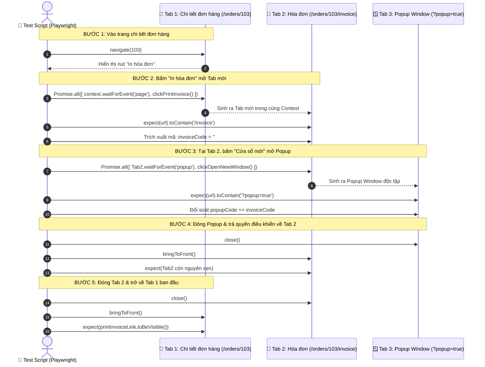
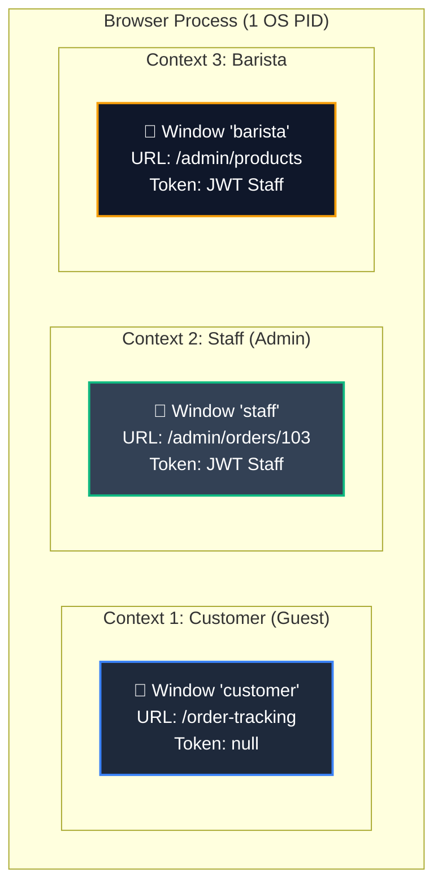

# 📑 BÀI 25: XỬ LÝ MULTIPLE TABS VÀ POPUPS TRONG PLAYWRIGHT TYPESCRIPT

> **Dự án thực chiến**: Hệ sinh thái Neko Coffee (`https://coffee.autoneko.com`)  
> **Bộ công cụ cốt lõi**: Playwright Test Runner, `BrowserContext`, `Page`, `context.waitForEvent('page')`, `page.waitForEvent('popup')`, `bringToFront()`, `TabManager` Helper, POM & Multi-Context RBAC Isolation.  
> **Tập tin cấu hình**: `configs/playwright.lesson25-tabs.config.ts`  
> **Lệnh chạy bộ test**: `npm run test:lesson25-tabs`

---

## 📑 MỤC LỤC TOÀN DIỆN (TABLE OF CONTENTS)

1. [🧠 Phần 1: Bản Chất Cốt Lõi Về Cấu Trúc Phân Cấp Trình Duyệt (Hierarchy)](#-phần-1-bản-chất-cốt-lõi-về-cấu-trúc-phân-cấp-trình-duyệt-hierarchy)
   - 1.1. Phân cấp 4 tầng: `Browser` ➔ `BrowserContext` ➔ `Page` ➔ `Frame`.
   - 1.2. Giải phẫu `Page`: Tại sao Tab mới và Popup Window đều là instance của `Page`?
   - 1.3. Mô hình lưu trữ dữ liệu: Shared Storage trong Multi-Tab.
   - 1.4. Vấn đề "Mù định danh" (Identity Blindness) của mảng `context.pages()`.
   - 1.5. Sơ đồ kiến trúc phân cấp trực quan.
2. [⚡ Phần 2: Cơ Chế Bắt Sự Kiện: `context.waitForEvent('page')` vs `page.waitForEvent('popup')`](#-phần-2-cơ-chế-bắt-sự-kiện-contextwaitforeventpage-vs-pagewaitforeventpopup)
   - 2.1. Sự kiện `page` trên `BrowserContext`: Khi nào phát sinh?
   - 2.2. Sự kiện `popup` trên `Page`: Mối quan hệ Trang Mẹ (Opener) - Trang Con (Popup).
   - 2.3. Bảng so sánh đối đầu chi tiết 8 tiêu chí kỹ thuật.
   - 2.4. Phân tích các thuộc tính HTML kích hoạt (`target="_blank"`, `window.open`).
   - 2.5. Tác động của Next.js SPA Client-side Routing lên sự kiện mở tab.
3. [💣 Phần 3: Cạm Bẫy Race Condition Kinh Điển & Kỹ Thuật Đồng Bộ Nguyên Tử `Promise.all`](#-phần-3-cạm-bẫy-race-condition-kinh-điển--kỹ-thuật-đồng-bộ-nguyên-tử-promiseall)
   - 3.1. Sai lầm chết người: "Hành động trước — Lắng nghe sau" (Action-then-Listen).
   - 3.2. Đo lường thời gian: 20ms cửa sổ sự kiện (Event Window) trong Node.js Event Loop.
   - 3.3. Giải pháp Senior: "Giăng lưới trước — Thả mồi sau" với `Promise.all`.
   - 3.4. Trật tự nạp trạng thái (Load States): `commit`, `domcontentloaded`, `load`.
   - 3.5. Timeout Strategy & Kỹ thuật ngăn ngừa treo Worker trên CI/CD.
4. [☕ Phần 4: Luồng Nghiệp Vụ Thực Chiến Neko Coffee: Đơn Hàng #103 ➔ In Hóa Đơn ➔ Cửa Sổ Mới](#-phần-4-luồng-nghiệp-vụ-thực-chiến-neko-coffee-đơn-hàng-103--in-hóa-đơn--cửa-sổ-mới)
   - 4.1. Bối cảnh bài toán thực tế: Hệ thống Logistics & Bán lẻ Cafe.
   - 4.2. Khảo sát thực địa DOM trên Neko Coffee (`https://coffee.autoneko.com`):
     - Màn hình Chi tiết đơn hàng: `/vi/admin/orders/103`.
     - Màn hình Tab Hóa đơn: `/vi/admin/orders/103/invoice`.
     - Màn hình Popup Window: `/vi/admin/orders/103/invoice?popup=true`.
   - 4.3. Quy trình 5 bước kiểm thử E2E 3 cấp cửa sổ.
   - 4.4. Sơ đồ tuần tự (Sequence Diagram) tương tác 3 cửa sổ.
   - 4.5. Điểm nhấn kiến trúc: Bản chất của Cửa sổ mới (`?popup=true`) dưới góc nhìn Playwright vs Frontend Next.js.
5. [🏰 Phần 5: Xây Dựng `TabManager` Helper — Bộ Điều Phối Đa Tab Chuẩn Enterprise & Thực Chiến Chi Tiết](#-phần-5-xây-dựng-tabmanager-helper--bộ-điều-phối-đa-tab-chuẩn-enterprise--thực-chiến-chi-tiết)
   - 5.1. Triết lý thiết kế: Xóa bỏ "mù định danh", chống rò rỉ tài nguyên.
   - 5.2. Giải phẫu chi tiết mã nguồn `TabManager.ts`.
   - 5.3. Đối sánh trước và sau khi áp dụng `TabManager`.
   - 5.4. Thực chiến chi tiết từng case đơn lẻ bằng mã nguồn Test Specs (Mở tab, Mở popup, Switch, Đóng, Bắt lỗi phòng vệ, Dọn dẹp).
   - 5.5. Thực chiến Full Flow Neko Coffee: Giải phẫu mã nguồn Spec 02 (Native) vs Spec 03 (TabManager):
     - Kịch bản 1: Full Flow Native API (`02-invoice-order-workflow.spec.ts`).
     - Kịch bản 2: Full Flow Enterprise `TabManager` (`03-tab-manager-named-switch.spec.ts`).
     - 🚀 Hướng dẫn các câu lệnh chạy chi tiết trên Terminal (CLI Execution Guide).
     - ❓ Giải đáp chuyên sâu: Tại sao phải gọi `new NekoInvoicePage(popupWindow)` mà không dùng Fixture `invoicePage`?
     - Bảng ma trận đối chiếu 7 phương diện Native Flow vs TabManager Flow.
   - 5.6. Bằng chứng thực thi Terminal của bộ test TabManager.
6. [⚖️ Phần 6: Multi-Tab Trong 1 Context vs Multi-BrowserContexts: Kỹ Thuật & Bảo Mật](#-phần-6-multi-tab-trong-1-context-vs-multi-browsercontexts-kỹ-thuật--bảo-mật)
   - 6.1. Phân biệt chuyên sâu: Single-Context Multi-Tab vs Multi-Context Multi-Window.
   - 6.2. Ma trận đối chiếu 10 phương diện kỹ thuật.
   - 6.3. Bài toán kiểm thử phân quyền RBAC (Staff vs Anonymous Customer).
   - 6.4. Bài toán Realtime Collaboration & Order Locking.
7. [🏗️ Phần 7: Kiến Trúc Fixtures Phân Tầng & Page Object Model (POM)](#-phần-7-kiến-trúc-fixtures-phân-tầng--page-object-model-pom)
   - 7.1. Trách nhiệm phân tầng trong ứng dụng đa cửa sổ.
   - 7.2. Tầng Xác thực Đa Tab (`tab-auth.fixture.ts`) & Ma thuật `context.addInitScript`.
   - 7.3. Tầng Ứng dụng & POM (`tab-app.fixture.ts`) & Auto-Teardown.
   - 7.4. Tầng Cổng Kiểm Soát (`tab-gatekeeper.fixture.ts`) — Single Entrypoint.
   - 7.5. Thiết kế Page Objects `NekoAdminOrderDetailPage` và `NekoInvoicePage`.
8. [⚠️ Phần 8: Bộ 6 Cạm Bẫy Nguy Hiểm Khi Kiểm Thử Đa Tab Trên CI/CD & Cách Hóa Giải](#-phần-8-bộ-6-cạm-bẫy-nguy-hiểm-khi-kiểm-thử-đa-tab-trên-cicd--cách-hóa-giải)
   - 8.1. Cạm bẫy 1: Headless Mode làm ẩn Popup hoặc chặn `window.open`.
   - 8.2. Cạm bẫy 2: "Rò rỉ Tab treo" (Dangling Pages) làm tràn bộ nhớ Worker.
   - 8.3. Cạm bẫy 3: Next.js Client Hydration & Flash "Đang kiểm tra quyền truy cập...".
   - 8.4. Cạm bẫy 4: Case-sensitivity và Text mismatch giữa Tab và Popup POS.
   - 8.5. Cạm bẫy 5: Lỗi `Target Closed Error` khi thao tác trên tab đã đóng.
   - 8.6. Cạm bẫy 6: Xung đột tài nguyên khi chạy song song (`workers > 1`).
9. [💻 Phần 9: Tổng Hợp & Thẩm Định Toàn Diện 5 Bộ Test Specs (10/10 Tests Pass 100%)](#-phần-9-tổng-hợp--thẩm-định-toàn-diện-5-bộ-test-specs-1010-tests-pass-100)
   - 9.1. Ma trận phân bổ 5 bộ test specs trong toàn khóa học.
   - 9.2. Bằng chứng kết quả thực tế trên Terminal (10/10 Tests Pass 100% in 59.0s).
10. [🎯 Phần 10: Bộ Câu Hỏi Phỏng Vấn Senior SDET Chuyên Đề Multi-Tab & Popup](#-phần-10-bộ-câu-hỏi-phỏng-vấn-senior-sdet-chuyên-đề-multi-tab--popup)
11. [🌐 Phần 11: Quản Lý Nhiều Cửa Sổ Bằng Nhiều BrowserContexts (`ContextWindowManager`)](#-phần-11-quản-lý-nhiều-cửa-sổ-bằng-nhiều-browsercontexts-contextwindowmanager)
    - 11.1. Bản chất kiến trúc: Single-Context Multi-Tab vs Multi-Context Multi-Window.
    - 11.2. Giải phẫu mã nguồn `ContextWindowManager.ts`: Cấu trúc Map, createSession, switchTo, closeAll.
    - 11.3. Kịch bản thực chiến: Khách hàng (Context 1) & Thu ngân (Context 2) không ô nhiễm session.
    - 11.4. Bảng tổng kết đối chiếu 2 Helper: `TabManager` vs `ContextWindowManager`.

---

# 🧠 PHẦN 1: BẢN CHẤT CỐT LÕI VỀ CẤU TRÚC PHÂN CẤP TRÌNH DUYỆT (HIERARCHY)

---

### 🔹 1.1. Phân Cấp 4 Tầng Trong Playwright: `Browser` ➔ `BrowserContext` ➔ `Page` ➔ `Frame`

Để không bị nhầm lẫn giữa Tab, Window, Popup và Context, chúng ta cần nắm vững cây phân cấp 4 tầng của Playwright:

```text
┌───────────────────────────────────────────────────────────────────────────────────┐
│ 🌐 1. BROWSER (Tiến trình hệ điều hành: Chromium, Firefox, WebKit)                │
│    ├─────────────────────────────────────────────────────────────────────────┐    │
│    │ 📦 2. BROWSERCONTEXT A (Staff Session - Chứa Cookie, LocalStorage riêng) │    │
│    │    ├──────────────────────────┬──────────────────────────┐              │    │
│    │    │ 📄 3. PAGE 1 (Tab Main)  │ 📄 PAGE 2 (Tab Hóa đơn)  │ 🪟 PAGE 3 (Popup)│
│    │    │    └─ 🖼️ 4. Frames       │    └─ 🖼️ Frames          │    └─ 🖼️ Frames  │
│    │    └──────────────────────────┴──────────────────────────┴──────────────┘    │
│    ├─────────────────────────────────────────────────────────────────────────┐    │
│    │ 📦 BROWSERCONTEXT B (Customer / Anonymous Session - Cách ly 100%)       │    │
│    │    └─ 📄 PAGE 4 (Tra cứu đơn hàng)                                       │    │
│    └─────────────────────────────────────────────────────────────────────────┘    │
└───────────────────────────────────────────────────────────────────────────────────┘
```

1. **`Browser`**: Là một tiến trình Chrome/WebKit độc lập được khởi chạy ở tầng OS. Việc bật/tắt Browser rất nặng (tốn 500ms - 2s và hàng trăm MB RAM).
2. **`BrowserContext`**: Là một hồ sơ ẩn danh (Incognito Profile) siêu nhẹ được tạo trong vài mili-giây. Mọi cookie, token hay cache được lưu trữ biệt lập hoàn toàn trong Context này.
3. **`Page`**: Đại diện cho **một màn hình hiển thị trực quan** mà người dùng tương tác. Trong Playwright:
   - Một thẻ mới (Tab) = `Page`.
   - Một cửa sổ trình duyệt mới (Window) = `Page`.
   - Một cửa sổ popup con (Popup Window) = `Page`.
4. **`Frame`**: Các khung nhúng (iframe) nằm bên trong cấu trúc DOM của một `Page`.

---

### 🔹 1.2. Giải Phẫu `Page`: Tại Sao Tab Mới Và Popup Đều Là Instance Của `Page`?

Trong kiến trúc tự động hóa trước đây (như Selenium WebDriver), Tester phải đối mặt với khái niệm rối rắm: `window_handles`, `switchTo().window(handle)`, và phải tự phân biệt giữa tab và OS window.

Playwright đã đơn giản hóa triệt để bằng mô hình hướng đối tượng thống nhất: **Mọi thẻ duyệt web (Tab) và mọi cửa sổ con (Popup Window) đều là các thực thể độc lập của lớp `Page` (`import { Page } from '@playwright/test'`)**. Playwright hoàn toàn **không có class `Tab` hay `Window` riêng biệt**.

#### 1. Dưới góc nhìn Chrome DevTools Protocol (CDP):
- Cả Tab thông thường (sinh ra từ `<a target="_blank">`) và Cửa sổ OS rời (sinh ra từ `window.open(...)` với kích thước popup) đều được Chromium định danh là **Target kiểu `"page"`** (`TargetInfo.type === "page"`).
- Sự khác biệt duy nhất trên màn hình máy tính của bạn là cờ giao diện (`window features`: ẩn thanh công cụ, không có tab bar, kích thước nhỏ). Còn đối với Playwright Engine, cả hai đều có:
  - Một tiến trình render và cây DOM hoàn chỉnh (`page.$`, `page.locator`).
  - Một vòng đời điều hướng độc lập (`page.goto`, `page.reload`, `page.waitForLoadState`).
  - Một bộ bắt sự kiện mạng riêng (`page.route`, `page.waitForResponse`).
  - Một giao diện điều khiển console/dialog riêng (`page.on('dialog')`, `page.on('console')`).

#### 2. Minh chứng thực tế qua hệ sinh thái Neko Coffee:
Khi kiểm thử luồng in hóa đơn của Neko Coffee:
1. Trang đơn hàng gốc (`https://coffee.autoneko.com/vi/admin/orders/103`) $\rightarrow$ **`Page` 1**.
2. Click "In hóa đơn" mở Tab mới (`.../orders/103/invoice`) $\rightarrow$ **`Page` 2**.
3. Click "Cửa sổ mới" mở Popup Window in POS (`.../orders/103/invoice?popup=true`) $\rightarrow$ **`Page` 3**.

Cả 3 đối tượng này đều xuất hiện bình đẳng trong mảng `context.pages(): Page[]`:
```typescript
const [mainPage, invoiceTab, invoicePopup] = context.pages();
console.log(invoicePopup instanceof Page); // true 100%
```
Vì vậy, bạn có thể truyền thẳng `invoicePopup` vào Page Object Model (`new NekoInvoicePage(invoicePopup)`) và gọi mọi API kiểm thử (`click`, `fill`, `expect`, `screenshot`) mà không cần bất kỳ bước chuyển đổi handle phức tạp nào!

---

### 🔹 1.3. Mô Hình Lưu Trữ Dữ Liệu: Shared Storage Trong Multi-Tab

Một trong những tính chất quan trọng nhất mà Automation Engineer cần ghi nhớ:

> 🔑 **QUY TẮC BẤT BIẾN**:  
> **Tất cả các `Page` (Tabs / Popups) cùng sinh ra bên trong một `BrowserContext` sẽ CHIA SẺ CHUNG 100% dữ liệu tầng lưu trữ (Origin Storage) bao gồm:**
> - `Cookies` (Phiên đăng nhập HTTP-Only, Session ID).
> - `localStorage` (JWT Token, User Profile, Flags).
> - `sessionStorage` (áp dụng khi mở tab con từ `window.open` giữ ngữ cảnh).
> - `Cache Storage` và `IndexedDB`.

**Hệ quả thực chiến**:
- Khi bạn đăng nhập tài khoản Staff ở Tab 1, sau đó click mở Tab 2 hoặc Popup Window, **Tab 2 và Popup Window tự động có phiên đăng nhập của Staff ngay lập tức** mà không cần gọi API đăng nhập lại hay gõ lại username/password.

---

### 🔹 1.4. Vấn Đề "Mù Định Danh" (Identity Blindness) Của Mảng `context.pages()`

Playwright cung cấp sẵn API `context.pages()` trả về mảng các trang đang mở:
```typescript
const pages = context.pages(); // [ Page, Page, Page ]
```
Tuy nhiên, trong các bài toán doanh nghiệp phức tạp:
1. **Thứ tự không ổn định**: Khi mở nhiều tab song song qua các liên kết mạng chậm, tab nào load xong trước có thể làm xáo trộn nhận thức của tester.
2. **Khó đọc & Dễ gãy (Brittle)**: Gọi `pages[1]` hay `pages[2]` làm cho người đọc code không biết trang đó là "Hóa đơn", "Cổng thanh toán", hay "Thông tin khách hàng".
3. **Nguy cơ thao tác trên Tab đã đóng**: Nếu `pages[1]` đã bị đóng, việc gọi `pages[1].click()` sẽ ném lỗi `Target page closed`.

Đây chính là lý do ra đời của **`TabManager` Helper** được hướng dẫn chi tiết tại [Phần 5](#-phần-5-xây-dựng-tabmanager-helper--bộ-điều-phối-đa-tab-chuẩn-enterprise).

---

# ⚡ PHẦN 2: CƠ CHẾ BẮT SỰ KIỆN: `context.waitForEvent('page')` VS `page.waitForEvent('popup')`

---

### 🔹 2.1. Sự Kiện `page` Trên `BrowserContext`: Khi Nào Phát Sinh?

Sự kiện `context.waitForEvent('page')` được kích hoạt ở cấp độ toàn bộ `BrowserContext` khi:
1. Người dùng bấm vào một thẻ `<a href="..." target="_blank">`.
2. Ứng dụng gọi hàm `window.open(...)`.
3. Đoạn mã test gọi lệnh `await context.newPage()`.
4. Người dùng nhấn giữ `Ctrl + Click` (hoặc `Cmd + Click`) trên một liên kết thông thường.
5. Một chuyển hướng mạng (OAuth redirect / Single Sign-On) mở ra cửa sổ xác thực bên ngoài.

```typescript
// Lắng nghe trên BROWSER CONTEXT:
const [newPage] = await Promise.all([
  context.waitForEvent('page', { timeout: 15000 }),
  page.getByRole('link', { name: 'In hóa đơn' }).click(),
]);
```

---

### 🔹 2.2. Sự Kiện `popup` Trên `Page`: Mối Quan Hệ Trang Mẹ (Opener) - Trang Con (Popup)

Sự kiện `page.waitForEvent('popup')` là một API ngữ nghĩa cao cấp hơn, được kích hoạt **trực tiếp từ một trang cụ thể (`parentPage`)** khi trang đó chủ động tạo ra một cửa sổ con:
- Phải có mối liên kết quan hệ (Relationship): Cửa sổ mới được sinh ra có thuộc tính `window.opener` trỏ về chính `parentPage`.
- Khi người dùng click một button có kịch bản JavaScript:
  ```javascript
  // Đoạn mã nguồn trên Frontend Neko Coffee
  window.open('/vi/admin/orders/103/invoice?popup=true', '_blank', 'width=900,height=800');
  ```

```typescript
// Lắng nghe trực tiếp trên TRANG CHA (Parent Page):
const [popupWindow] = await Promise.all([
  parentPage.waitForEvent('popup', { timeout: 15000 }),
  parentPage.getByRole('button', { name: 'Cửa sổ mới' }).click(),
]);
```

---

### 🔹 2.3. Bảng So Sánh Đối Đầu 8 Tiêu Chí Kỹ Thuật

| Tiêu chí | `context.waitForEvent('page')` | `page.waitForEvent('popup')` |
|---|---|---|
| **Cấp độ lắng nghe (Scope)** | `BrowserContext` (Toàn cục) | `Page` (Cục bộ trang mẹ) |
| **Tính ràng buộc nguồn** | Bắt mọi trang mới xuất hiện trong context | Chỉ bắt trang con sinh ra từ chính `page` đó |
| **Liên kết `window.opener`** | Không yêu cầu | Bắt buộc phải có quan hệ cha - con |
| **Trường hợp `<a target="_blank">`** | Bắt được 100% | Bắt được (vì browser gắn quan hệ opener) |
| **Trường hợp `context.newPage()`** | Bắt được | **Không bắt được** (do không có trang cha) |
| **Trường hợp OAuth / SSO đa domain** | Tối ưu tuyệt đối | Có thể bị mất liên kết nếu mở domain ngoài |
| **Độ tường minh mã nguồn (Readability)**| Rất tốt cho luồng tổng thể | Rất tốt cho popup thoại, print preview |
| **Khả năng bị xung đột đa luồng** | Dễ bắt nhầm nếu có 2 tab cùng mở đồng thời | Không bao giờ bắt nhầm vì gắn chặt trang mẹ |

---

### 🔹 2.4. Phân Tích Thuộc Tính HTML Kích Hoạt

1. **Thẻ liên kết chuẩn với thuộc tính Target Blank**:
   ```html
   <!-- Nút In hóa đơn trên Neko Coffee Admin -->
   <a href="/admin/orders/103/invoice" target="_blank" class="px-4 py-2 bg-slate-100 rounded-lg">
     In hóa đơn
   </a>
   ```
   *Khi click vào liên kết này, trình duyệt gửi tín hiệu `Target.targetCreated` qua CDP. Playwright chuyển hóa thành sự kiện `'page'` trên context và `'popup'` trên trang hiện tại.*

2. **Button gắn JavaScript gọi `window.open`**:
   ```html
   <!-- Nút Cửa sổ mới trên Neko Coffee Invoice -->
   <button onclick="window.open('/admin/orders/103/invoice?popup=true', '_blank', 'width=800,height=900')">
     Cửa sổ mới
   </button>
   ```
   *Kích hoạt một cửa sổ popup độc lập với kích thước tùy chỉnh.*

---

# 💣 PHẦN 3: CẠM BẪY RACE CONDITION KINH ĐIỂN & KỸ THUẬT ĐỒNG BỘ NGUYÊN TỬ `Promise.all`

---

### 🔹 3.1. Sai Lầm Chết Người: "Hành Động Trước — Lắng Nghe Sau" (Action-Then-Listen)

Hãy xem đoạn mã mà 90% kỹ sư Automation mới làm quen với Playwright từng mắc phải:

```typescript
// ❌ CẠM BẪY RACE CONDITION (FLAKY HOẶC TIMEOUT 30S)
await page.getByRole('link', { name: 'In hóa đơn' }).click(); // (1) Hành động Click đã diễn ra!

// 💣 NGUY HIỂM: Sự kiện 'page' đã được trình duyệt phát ra và hoàn tất trong 20ms.
// Đến dòng dưới đây ta mới "mở tai ra nghe" -> Bộ lắng nghe treo mãi mãi chờ sự kiện kế tiếp!
const newTab = await context.waitForEvent('page'); // Error: Timeout 30000ms exceeded!
```

---

### 🔹 3.2. Đo Lường Thời Gian: 20ms Cửa Sổ Sự Kiện (Event Window) Trong Node.js Event Loop

Tại sao điều này lại xảy ra?
1. Trình duyệt Chromium chạy trên các luồng C++ riêng biệt tốc độ cực cao. Khi nhận lệnh `click()`, nó tạo ngay một target tab mới trong vòng **10 - 25 mili-giây**.
2. Mã kiểm thử của bạn chạy trên tiến trình Node.js đơn luồng (Single Thread).
3. Do độ trễ truyền thông WebSocket giữa Node.js và Chrome DevTools Protocol (CDP), khi câu lệnh `click()` trả về kết quả thành công (`resolved`), thì sự kiện `page` bên phía trình duyệt **đã nổ ra xong từ trước đó**!
4. Khi câu lệnh kế tiếp `context.waitForEvent('page')` được gửi đến trình duyệt, Chromium đã "quên" sự kiện cũ và chỉ ngồi chờ sự kiện mới $\rightarrow$ **Treo vĩnh viễn (Hang)**!

---

### 🔹 3.3. Giải Pháp Senior: "Giăng Lưới Trước — Thả Mồi Sau" Với `Promise.all`

Nguyên tắc vàng của kiểm thử bất đồng bộ là: **BẬT BỘ LẮNG NGHE TRƯỚC KHI THỰC HIỆN HÀNH ĐỘNG KÍCH HOẠT**.

```typescript
// ✅ ĐỒNG BỘ HÓA NGUYÊN TỬ (ATOMIC SYNCHRONIZATION)
const [newTab] = await Promise.all([
  // 1. Giăng lưới đón sẵn: Đăng ký listener lắng nghe sự kiện TRƯỚC
  context.waitForEvent('page', { timeout: 15000 }),

  // 2. Thả mồi: Kích hoạt hành vi bấm chuột
  page.getByRole('link', { name: 'In hóa đơn' }).click(),
]);

// 3. Đợi DOM của Tab mới sẵn sàng hoàn toàn
await newTab.waitForLoadState('domcontentloaded');
```

```mermaid
gantt
    title Biểu Đồ Thời Gian Đồng Bộ Hóa Bằng Promise.all
    dateFormat X
    axisFormat %s ms

    section Sai Lầm (Tuần tự)
    Click mở tab (0-30ms)        :crit, a1, 0, 30
    Sự kiện Page phát ra (20ms)   :milestone, 20, 20
    Mới bắt đầu waitForEvent (35ms):a2, 35, 100
    Bị treo Timeout 30s          :crit, 35, 100

    section Chuẩn Mực (Promise.all)
    Lắng nghe waitForEvent (0ms) :done, b1, 0, 80
    Click mở tab song song (5ms) :active, b2, 5, 35
    Bắt trúng sự kiện (25ms)      :milestone, 25, 25
    Trả về newTab thành công      :done, 35, 80
```

---

### 🔹 3.4. Trật Tự Nạp Trạng Thái (Load States) Trên Tab Mới

Khi `newTab` vừa được khởi tạo, nó mới chỉ là một khung trình duyệt trắng (`about:blank` hoặc đang tải URL). Bạn cần đồng bộ trạng thái nạp bằng phương thức `waitForLoadState`:

- `await newTab.waitForLoadState('commit')`: Máy chủ vừa trả về HTTP Header đầu tiên (nhanh nhất).
- `await newTab.waitForLoadState('domcontentloaded')`: Toàn bộ cây DOM đã nạp xong (Khuyến nghị dùng trong đa số trường hợp).
- `await newTab.waitForLoadState('load')`: Tất cả hình ảnh, stylesheet và script đã tải hoàn tất.
- `await newTab.waitForLoadState('networkidle')`: Không còn kết nối mạng nào hoạt động trong 500ms (Cẩn thận: có thể gây timeout nếu ứng dụng có polling hoặc WebSocket liên tục).

---

# ☕ PHẦN 4: LUỒNG NGHIỆP VỤ THỰC CHIẾN NEKO COFFEE: ĐƠN HÀNG #103 ➔ IN HÓA ĐƠN ➔ CỬA SỔ MỚI

---

### 🔹 4.1. Bối Cảnh Bài Toán Thực Tế

Trong các hệ thống bán lẻ và chuỗi cà phê (POS / Logistics), nhân viên thu ngân hoặc quản lý đơn hàng thường xuyên thực hiện nghiệp vụ:
1. Mở xem chi tiết một đơn đặt hàng đang xử lý.
2. Bấm nút **"In hóa đơn"** để mở giao diện in ấn đầy đủ (khổ A4 hoặc xem trước biểu mẫu).
3. Tại giao diện in ấn, bấm **"Cửa sổ mới"** để tách riêng một Popup thu gọn kích thước chuẩn cho máy in bill nhiệt (POS Thermal Printer 80mm).
4. Kiểm tra đối soát dữ liệu (Mã đơn hàng, Tổng tiền, Món nước, Thông tin người nhận) phải trùng khớp 100% giữa cả 3 màn hình.
5. Đóng popup và tab hóa đơn, quay trở lại màn hình quản trị để tiếp tục xử lý các đơn hàng khác.

---

### 🔹 4.2. Khảo Sát Thực Địa DOM Trên Neko Coffee (`coffee.autoneko.com`)

Dưới đây là cấu trúc DOM thực tế đã được khảo sát trực tiếp từ hệ thống đang vận hành:

#### 1. Màn hình Chi tiết đơn hàng (`/vi/admin/orders/103`)
```html
<div class="flex items-center gap-2">
  <!-- Thẻ a target="_blank" kích hoạt mở Tab mới -->
  <a href="/admin/orders/103/invoice" target="_blank" class="flex items-center gap-2 px-4 py-2 ...">
    In hóa đơn
  </a>
  <button class="bg-primary text-white ...">Lưu thay đổi</button>
  <button class="bg-red-50 text-red-500 ...">Hủy đơn hàng</button>
</div>
```

#### 2. Màn hình Tab Hóa đơn (`/vi/admin/orders/103/invoice`)
```html
<main>
  <h2>Neko Coffee Admin</h2>
  <!-- Nút in trực tiếp -->
  <button class="bg-[#1a1a1a] text-white">In hóa đơn</button>
  <!-- Nút mở cửa sổ popup độc lập -->
  <button class="bg-[#ededed] text-[#1a1a1a]">Cửa sổ mới</button>
  <a href="/admin/orders/103">Quay lại</a>

  <!-- Nội dung hóa đơn chuẩn -->
  <h1>Hóa Đơn Bán Hàng</h1>
  <p>Mã: #B2C-20260905-4221</p>
  <p>Ngày: 5/9/2026</p>
  <p>Cộng tiền hàng: 290.000đ</p>
</main>
```

#### 3. Màn hình Popup Window (`/vi/admin/orders/103/invoice?popup=true`)
```html
<!-- Cửa sổ popup đã được Next.js tối ưu bỏ toàn bộ thanh Sidebar và Navbar Admin -->
<div>
  <span>XEM TRƯỚC HÓA ĐƠN</span>
  <h1>HÓA ĐƠN</h1>
  <span>Số hóa đơn: #B2C-20260905-4221</span>
  <p>NEKO COFFEE - 123 Đường Mèo Con, Phường 4, Quận 10</p>
</div>
```

---

### 🔹 4.3. Quy Trình 5 Bước Kiểm Thử E2E 3 Cấp Cửa Sổ



---

### 🔹 4.5. Điểm Nhấn Kiến Trúc: Bản Chất Của Cửa Sổ Mới (`?popup=true`) Dưới Góc Nhìn Playwright vs Frontend Next.js

Một trong những thắc mắc phổ biến nhất của kỹ sư kiểm thử khi làm việc với luồng in hóa đơn của Neko Coffee:
> *"Khi bấm 'Cửa sổ mới' từ `https://coffee.autoneko.com/vi/admin/orders/103/invoice`, trình duyệt mở ra một cửa sổ popup độc lập có URL gắn query param `?popup=true`. Vậy đối tượng này trong Playwright có phải là một `Page` không, hay là một class Window riêng biệt? Và tại sao giao diện của nó lại khác biệt hoàn toàn so với tab hóa đơn ban đầu?"*

#### 1. Góc nhìn Playwright Engine: 100% Là Đối Tượng `Page`
- **Thống nhất tuyệt đối**: Playwright **không có** class `Window` hay `Tab`. Mọi bề mặt render web từ Tab đến Popup đều là instance của class `Page` (`import { Page } from '@playwright/test'`).
- **Target CDP**: Dưới tầng Chrome DevTools Protocol, cả hai đều có thuộc tính `TargetInfo.type === "page"`.
- **Bắt sự kiện**: Bắt qua `page.waitForEvent("popup")` trên tab nguồn và nhận về một `Promise<Page>`.
- **Tái sử dụng Page Object Model (POM)**:
  ```typescript
  const [popupWindow] = await Promise.all([
    invoiceTab.waitForEvent("popup"),
    invoiceTab.getByRole("button", { name: "Cửa sổ mới" }).click(),
  ]);

  // popupWindow là một Page thực thụ -> Bọc trực tiếp vào POM:
  const invoicePopupPage = new NekoInvoicePage(popupWindow);
  await invoicePopupPage.expectOnPage();
  ```

#### 2. Góc nhìn Frontend (Next.js): Conditional Rendering Phục Vụ In Ấn
- Nút "Cửa sổ mới" trên trang hóa đơn kích hoạt:
  ```javascript
  window.open(
    "/vi/admin/orders/103/invoice?popup=true",
    "_blank",
    "width=900,height=750,menubar=no,toolbar=no,location=no,status=no"
  );
  ```
- **Cơ chế Conditional Rendering**: 
  Nhờ cờ `?popup=true`, Next.js/React component nhận diện môi trường in ấn chuyên dụng (POS Bill / Thermal Receipt). 
  - Hệ thống tự động **loại bỏ Admin Shell** (Navbar, Sidebar, nút "Quay lại", nút "Cửa sổ mới").
  - Đổi tiêu đề sang **`XEM TRƯỚC HÓA ĐƠN`** và **`HÓA ĐƠN`** căn giữa khổ in nhiệt 80mm.
  - Đây là lý do locator của tab hóa đơn và popup cần được xử lý linh hoạt (dùng Regex `/hóa đơn/i` trong POM `NekoInvoicePage`).

#### 3. Bảng Ma Trận So Sánh 3 Cấp Cửa Sổ Trong Hệ Sinh Thái Neko Coffee

| Đặc Điểm Phân Tích | Cấp 1: Chi Tiết Đơn Hàng | Cấp 2: Tab Hóa Đơn Chuẩn | Cấp 3: Popup Hóa Đơn POS |
|---|---|---|---|
| **Đường dẫn URL** | `.../admin/orders/103` | `.../admin/orders/103/invoice` | `.../admin/orders/103/invoice?popup=true` |
| **Cơ chế kích hoạt** | `page.goto(...)` | `<a target="_blank">` | `button` + `window.open(..., 'features')` |
| **Giao diện người dùng** | Giao diện quản trị đầy đủ (Admin Shell) | Giao diện xem trước khổ A4 + nút chức năng | Cửa sổ OS rời, lược bỏ thanh điều hướng, căn lề in |
| **Kiểu dữ liệu Playwright** | `Page` | `Page` | `Page` |
| **API lắng nghe** | `page.goto()` | `context.waitForEvent('page')` | `page.waitForEvent('popup')` |
| **Trạng thái Session** | Gốc (Nạp từ JWT) | Thừa hưởng 100% từ context | Thừa hưởng 100% từ context |
| **Mục đích kiểm thử** | Thao tác trạng thái đơn hàng | Kiểm tra biểu mẫu hóa đơn đầy đủ | Đối soát hóa đơn in nhiệt không bị vỡ layout |

---

# 🏰 PHẦN 5: XÂY DỰNG `TabManager` HELPER — BỘ ĐIỀU PHỐI ĐA TAB CHUẨN ENTERPRISE

---

### 🔹 5.1. Triết Lý Thiết Kế

Khi một kịch bản kiểm thử cần mở qua lại giữa 3-5 tabs, việc viết lại các đoạn mã `Promise.all([ context.waitForEvent('page'), ... ])` kèm theo việc quản lý mảng `context.pages()` rời rạc sẽ dẫn đến thảm họa bảo trì (Spaghetti Code).

Lớp **`TabManager`** được thiết kế nhằm đạt được 4 chuẩn mực:
1. **Semantic Naming (Định danh ngữ nghĩa)**: Gọi tab bằng tên thân thiện (`'main'`, `'invoice'`, `'invoice-popup'`, `'vnpay-gateway'`).
2. **One-Liner Execution (Thực thi trong 1 dòng)**: Gom toàn bộ logic `Promise.all`, `waitForEvent`, `waitForLoadState` và `register` vào một lời gọi hàm duy nhất.
3. **Context Focus Controller**: Cung cấp `switchTo('alias')` tự động gọi `page.bringToFront()` và cập nhật con trỏ `activeAlias`.
4. **Zero-Pollution Auto Teardown**: Cung cấp hàm `closeAllExcept('main')` giúp dọn dẹp sạch sẽ toàn bộ các tab rác khi test kết thúc, bảo vệ tài nguyên hệ thống.

---

### 🔹 5.2. Giải Phẫu Chi Tiết Mã Nguồn `TabManager.ts`

Toàn bộ mã nguồn nằm tại: [`modules/2-api/NekoCoffee/lesson-25/helpers/TabManager.ts`](file:///e:/playwright-pro/202603-PW_BASIC/modules/2-api/NekoCoffee/lesson-25/helpers/TabManager.ts)

```typescript
import { BrowserContext, Page } from "@playwright/test";

export class TabManager {
  // Danh bạ lưu trữ cặp: Bí danh (Alias) -> Đối tượng Page
  private readonly tabs: Map<string, Page> = new Map();
  // Bí danh của Tab đang giữ tiêu điểm hoạt động hiện tại
  private activeAlias: string | null = null;
  private autoIndex = 1;

  constructor(
    private readonly context: BrowserContext,
    initialPage?: Page,
    initialAlias: string = "main",
  ) {
    if (initialPage) {
      this.register(initialAlias, initialPage);
      this.activeAlias = initialAlias;
    }
  }

  /**
   * 🏷️ Đăng ký thủ công một Page vào danh bạ quản lý theo tên bí danh
   */
  public register(alias: string, page: Page): void {
    if (this.tabs.has(alias) && this.tabs.get(alias) !== page) {
      console.warn(`⚠️ [TabManager] Bí danh '${alias}' đã tồn tại, đang ghi đè.`);
    }
    this.tabs.set(alias, page);

    // 🛡️ Tự động dọn dẹp khi Tab bị đóng bởi người dùng hoặc script
    page.once("close", () => {
      this.tabs.delete(alias);
      if (this.activeAlias === alias) {
        this.activeAlias = this.tabs.has("main") ? "main" : (this.tabs.keys().next().value ?? null);
      }
      console.log(`🧹 [TabManager] Tab '${alias}' đã đóng và được dọn khỏi danh bạ.`);
    });
  }

  /**
   * ⚡ Đón bắt TAB MỚI an toàn tuyệt đối từ sự kiện 'page'
   */
  public async waitForNewTab(
    alias: string,
    triggerAction: () => Promise<unknown>,
    options: { timeout?: number } = { timeout: 15000 },
  ): Promise<Page> {
    console.log(`⏳ [TabManager] Đang đón bắt Tab mới với tên '${alias}'...`);

    const [newPage] = await Promise.all([
      this.context.waitForEvent("page", { timeout: options.timeout }),
      triggerAction(),
    ]);

    await newPage.waitForLoadState("domcontentloaded");
    this.register(alias, newPage);
    this.activeAlias = alias;
    return newPage;
  }

  /**
   * 🪟 Đón bắt POPUP WINDOW an toàn từ sự kiện 'popup'
   */
  public async waitForPopup(
    sourcePageOrAlias: Page | string,
    popupAlias: string,
    triggerAction: () => Promise<unknown>,
    options: { timeout?: number } = { timeout: 15000 },
  ): Promise<Page> {
    const sourcePage = typeof sourcePageOrAlias === "string" 
      ? this.getPage(sourcePageOrAlias) 
      : sourcePageOrAlias;

    const [popupPage] = await Promise.all([
      sourcePage.waitForEvent("popup", { timeout: options.timeout }),
      triggerAction(),
    ]);

    await popupPage.waitForLoadState("domcontentloaded");
    this.register(popupAlias, popupPage);
    this.activeAlias = popupAlias;
    return popupPage;
  }

  /**
   * 🔄 Chuyển đổi quyền điều khiển (Focus / Bring to Front) sang Tab chỉ định
   */
  public async switchTo(alias: string): Promise<Page> {
    const page = this.getPage(alias);
    await page.bringToFront();
    this.activeAlias = alias;
    return page;
  }

  /**
   * 🔍 Trích xuất Page theo bí danh (Bắt lỗi trực quan nếu không tồn tại hoặc đã đóng)
   */
  public getPage(alias: string): Page {
    const page = this.tabs.get(alias);
    if (!page) {
      const existing = Array.from(this.tabs.keys()).join(", ");
      throw new Error(`❌ [TabManager] Không tìm thấy Tab '${alias}'! Các tab hiện có: [${existing}]`);
    }
    if (page.isClosed()) {
      this.tabs.delete(alias);
      throw new Error(`❌ [TabManager] Tab '${alias}' đã bị đóng trước đó!`);
    }
    return page;
  }

  /**
   * 🛡️ Đóng toàn bộ các Tab phụ, chỉ giữ lại một Tab chỉ định (mặc định là 'main')
   */
  public async closeAllExcept(keepAlias: string = "main"): Promise<void> {
    for (const [alias, page] of Array.from(this.tabs.entries())) {
      if (alias !== keepAlias && !page.isClosed()) {
        await page.close();
        this.tabs.delete(alias);
      }
    }
    if (this.hasTab(keepAlias)) {
      await this.switchTo(keepAlias);
    }
  }
}
```

---

### 🔹 5.3. Đối Sánh Trước Và Sau Khi Áp Dụng `TabManager`

```typescript
// ❌ CÁCH TRUYỀN THỐNG (RƯỜM RÀ, DỄ SAI SỐ THỨ TỰ INDEX):
const [invoiceTab] = await Promise.all([
  context.waitForEvent('page'),
  page.getByRole('link', { name: 'In hóa đơn' }).click(),
]);
await invoiceTab.waitForLoadState('domcontentloaded');

const [popupWindow] = await Promise.all([
  invoiceTab.waitForEvent('popup'),
  invoiceTab.getByRole('button', { name: 'Cửa sổ mới' }).click(),
]);
await popupWindow.waitForLoadState('domcontentloaded');

// Khi muốn quay lại tab đầu tiên:
await context.pages()[0].bringToFront();
// Khi muốn đóng tab popup:
await popupWindow.close();
// Quên đóng invoiceTab -> Rò rỉ RAM!
```

```typescript
// 🚀 CÁCH DOANH NGHIỆP VỚI TAB MANAGER (RÕ RÀNG, CHUẨN MỰC, TỰ DỌN DẸP):
const invoiceTab = await tabManager.waitForNewTab("invoice", () => orderDetailPage.clickPrintInvoice());
const popupWindow = await tabManager.waitForPopup("invoice", "invoice-popup", () => invoicePom.clickOpenNewWindow());

// Chuyển đổi tiêu điểm nhẹ nhàng theo tên:
await tabManager.switchTo("main");
await tabManager.switchTo("invoice");

// Dọn dẹp đóng toàn bộ tab phụ chỉ trong 1 dòng:
await tabManager.closeAllExcept("main");
```

---

### 🔹 5.4. Thực Chiến Chi Tiết Từng Case Đơn Lẻ Bằng Mã Nguồn Test Specs

Thay vì chỉ đưa ra cú pháp trừu tượng, phần này sẽ đưa trực tiếp **toàn bộ mã nguồn thực tế từ các bộ test specs** (`01-native-tabs-and-popups.spec.ts` và `03-tab-manager-named-switch.spec.ts`) để kỹ sư thấy rõ sự khác biệt giữa cách viết Native và cách viết tối ưu bằng `TabManager`:

```
┌──────────────────────────────────────────────────────────────────────────────────┐
│  BỘ 6 CASES ĐƠN LẺ ĐIỀU PHỐI BẰNG TABMANAGER TRONG TEST SPECS                    │
├───────────────────┬──────────────────────────────────────────────────────────────┤
│ 1. Mở Tab mới     │ Spec 01 Test 01 (Native) vs Spec 03 Test 01 Bước 2           │
│ 2. Mở Popup OS    │ Spec 01 Test 02 (Native) vs Spec 03 Test 01 Bước 3           │
│ 3. Switch Tab     │ Spec 03 Test 01 Bước 4 (Chuyển tiêu điểm 3 cửa sổ theo tên)  │
│ 4. Đóng 1 Tab     │ Spec 03 Test 01 Bước 5 (Đóng riêng 1 tab & fallback tiêu điểm│
│ 5. Bắt Lỗi An Toàn│ Spec 03 Test 02 (Kiểm thử sức chịu lỗi Error Resilience)    │
│ 6. Dọn Dẹp Sạch Sẽ│ Spec 03 Test 01 Bước 6 & Fixture Hook Auto-Teardown          │
└───────────────────┴──────────────────────────────────────────────────────────────┘
```

#### 📌 Case 1: Mở và Đăng Ký 1 Tab Mới Từ Thẻ `<a target="_blank">`
- **Tình huống**: Click liên kết "In hóa đơn" trên màn hình chi tiết đơn hàng, trình duyệt sinh ra một Tab mới.
- **Đối chiếu mã nguồn thực tế giữa 2 cách**:

```typescript
// 1️⃣ CÁCH NATIVE (Từ 01-native-tabs-and-popups.spec.ts: Dòng 30-44)
// Phải dùng Promise.all và context.waitForEvent('page')
const [invoiceTab] = await Promise.all([
  context.waitForEvent("page", { timeout: 15000 }),
  orderDetailPage.element("printInvoiceLink").click(),
]);
await invoiceTab.waitForLoadState("domcontentloaded");
expect(invoiceTab.url()).toContain("/admin/orders/103/invoice");
const brandHeader = invoiceTab.getByText(/neko coffee/i).first();
await expect(brandHeader).toBeVisible({ timeout: 10000 });
```

```typescript
// 2️⃣ CÁCH ENTERPRISE VỚI TAB MANAGER (Từ 03-tab-manager-named-switch.spec.ts: Dòng 34-44)
// Gói gọn toàn bộ listener, trigger và load state vào 1 dòng duy nhất:
const invoiceTab = await tabManager.waitForNewTab("invoice", async () => {
  await orderDetailPage.clickPrintInvoice();
});

// TabManager tự động kiểm tra số lượng và gán activeAlias:
expect(tabManager.getTabCount()).toBe(2);
expect(tabManager.getAllAliases()).toEqual(["main", "invoice"]);
expect(tabManager.getCurrentAlias()).toBe("invoice");

const invoicePom = new NekoInvoicePage(invoiceTab);
await invoicePom.expectOnPage();
```

---

#### 📌 Case 2: Mở và Đăng Ký 1 Popup Window Từ `window.open(...)`
- **Tình huống**: Từ Tab hóa đơn, bấm nút "Cửa sổ mới" để mở cửa sổ POS nhỏ gọn phục vụ in bill (`?popup=true`).
- **Đối chiếu mã nguồn thực tế giữa 2 cách**:

```typescript
// 1️⃣ CÁCH NATIVE (Từ 01-native-tabs-and-popups.spec.ts: Dòng 63-75)
// Lắng nghe sự kiện 'popup' trên đối tượng page nguồn
const [popupWindow] = await Promise.all([
  page.waitForEvent("popup", { timeout: 15000 }),
  invoicePage.element("openNewWindowBtn").click(),
]);
await popupWindow.waitForLoadState("domcontentloaded");
expect(popupWindow.url()).toContain("?popup=true");
```

```typescript
// 2️⃣ CÁCH ENTERPRISE VỚI TAB MANAGER (Từ 03-tab-manager-named-switch.spec.ts: Dòng 46-60)
// Truyền bí danh tab mẹ 'invoice' và tên gán cho popup 'invoice-popup':
const popupWindow = await tabManager.waitForPopup(
  "invoice",
  "invoice-popup",
  async () => {
    await invoicePom.clickOpenNewWindow();
  },
);

// TabManager tự động quản lý mảng 3 cửa sổ:
expect(tabManager.getTabCount()).toBe(3);
expect(tabManager.getAllAliases()).toEqual(["main", "invoice", "invoice-popup"]);
expect(tabManager.getCurrentAlias()).toBe("invoice-popup");

const popupPom = new NekoInvoicePage(popupWindow);
await popupPom.expectOnPage();
```

---

#### 📌 Case 3: Chuyển Đổi Tiêu Điểm (Switching Focus) Giữa Các Cửa Sổ Bằng `switchTo`
- **Tình huống**: Cần nhảy cóc kiểm tra dữ liệu qua lại giữa Đơn hàng gốc (`'main'`), Tab Hóa đơn (`'invoice'`) và Cửa sổ in (`'invoice-popup'`).
- **Mã nguồn thực tế (Từ `03-tab-manager-named-switch.spec.ts: Dòng 61-73`)**:

```typescript
// Chuyển tiêu điểm về Tab Đơn hàng gốc:
console.log("🔄 Chuyển tiêu điểm về 'main'...");
await tabManager.switchTo("main");
expect(tabManager.getCurrentAlias()).toBe("main");

// Chuyển tiêu điểm sang Tab Hóa đơn:
console.log("🔄 Chuyển tiêu điểm về 'invoice'...");
await tabManager.switchTo("invoice");
expect(tabManager.getCurrentAlias()).toBe("invoice");

// Chuyển tiêu điểm sang Cửa sổ Popup POS:
console.log("🔄 Chuyển tiêu điểm về 'invoice-popup'...");
await tabManager.switchTo("invoice-popup");
expect(tabManager.getCurrentAlias()).toBe("invoice-popup");
```
- **Bản chất kỹ thuật ngầm**: Hàm `switchTo('alias')` thực hiện 3 thao tác nguyên tử:
  1. `this.getPage(alias)` để kiểm tra tab có tồn tại và còn mở không.
  2. `await page.bringToFront()` gửi tín hiệu Chrome DevTools Protocol kích hoạt tab lên mặt trước.
  3. Cập nhật con trỏ `this.activeAlias = alias`.

---

#### 📌 Case 4: Đóng 1 Tab Đơn Lẻ & Tự Động Điều Phối Tiêu Điểm Bằng `closeTab`
- **Tình huống**: In xong hóa đơn trên popup, muốn đóng riêng cửa sổ popup mà không ảnh hưởng tới Tab Hóa đơn hay Tab chính.
- **Mã nguồn thực tế (Từ `03-tab-manager-named-switch.spec.ts: Dòng 74-79`)**:

```typescript
console.log("🗑️ Đóng tab 'invoice-popup'...");
await tabManager.closeTab("invoice-popup");

// TabManager tự động giải phóng khỏi danh bạ Map:
expect(tabManager.hasTab("invoice-popup")).toBe(false);
expect(tabManager.getTabCount()).toBe(2);
// Tiêu điểm tự động fallback về 'main' an toàn!
expect(tabManager.getCurrentAlias()).toBe("main");
```

---

#### 📌 Case 5: Cơ Chế Chịu Lỗi Phòng Vệ Cho Từng Case Lỗi Đơn Lẻ (Error Resilience)
- **Tình huống**: Kiểm thử khả năng chịu lỗi khi kiểm thử viên gọi nhầm tên tab hoặc khi tab bị đóng bất ngờ bởi mã ngoài.
- **Mã nguồn thực tế trọn vẹn (Từ `03-tab-manager-named-switch.spec.ts: Dòng 89-117`)**:

```typescript
test("02 - [ERROR RESILIENCE] Bắt lỗi trực quan khi truy cập tab không tồn tại hoặc đã đóng", async ({
  orderDetailPage,
  tabManager,
}) => {
  console.log("🚀 [Test 02] Kiểm thử cơ chế bảo vệ lỗi của TabManager...");

  await orderDetailPage.navigate(103);

  // ❌ TÌNH HUỐNG LỖI 1: Thử lấy một tab chưa từng được đăng ký trong hệ thống
  // Mong đợi: Ném lỗi có thông điệp rõ ràng kèm danh sách các tab đang có
  expect(() => tabManager.getPage("non_existent_tab")).toThrow(
    /Không tìm thấy Tab với bí danh 'non_existent_tab'! Các tab hiện có: \[main\]/,
  );

  // ❌ TÌNH HUỐNG LỖI 2: Tab bị đóng bất ngờ bằng native page.close() thay vì qua TabManager
  const newTab = await tabManager.waitForNewTab("temp_tab", async () => {
    await orderDetailPage.clickPrintInvoice();
  });
  expect(tabManager.hasTab("temp_tab")).toBe(true);

  // Đóng tab bằng native API:
  await newTab.close();

  // Nhờ có listener: page.once('close', () => this.tabs.delete(alias))
  // TabManager tự động dọn dẹp sạch mà không gây crash hệ thống!
  expect(tabManager.hasTab("temp_tab")).toBe(false);
  expect(() => tabManager.getPage("temp_tab")).toThrow();

  console.log("✅ [Test 02] Cơ chế bảo vệ và dọn dẹp lỗi kiểm chứng thành công!");
});
```

---

#### 📌 Case 6: Dọn Dẹp Sạch Toàn Bộ Tab Phụ Sau Test (Zero-Leak Teardown) Bằng `closeAllExcept`
- **Tình huống**: Kết thúc kịch bản kiểm thử, hệ thống cần đóng toàn bộ các tab trung gian (`invoice`, `invoice-popup`), chỉ giữ lại tab gốc `'main'` để sẵn sàng cho test case kế tiếp.
- **Mã nguồn thực tế (Từ `03-tab-manager-named-switch.spec.ts: Dòng 80-86`)**:

```typescript
console.log("🧹 Dọn dẹp đóng tất cả chỉ giữ 'main'...");
await tabManager.closeAllExcept("main");

// Khẳng định chỉ còn duy nhất 1 tab 'main' tồn tại:
expect(tabManager.getTabCount()).toBe(1);
expect(tabManager.getAllAliases()).toEqual(["main"]);
```
- **Tự động hóa hoàn toàn qua Fixture**: Trong [`tab-app.fixture.ts`](file:///e:/playwright-pro/202603-PW_BASIC/modules/2-api/NekoCoffee/lesson-25/fixtures/tab-app.fixture.ts), `tabManager` được cấu hình hook auto-teardown:
  ```typescript
  tabManager: async ({ context, page }, use) => {
    const manager = new TabManager(context, page, "main");
    await use(manager);
    // 🛡️ BẢO VỆ WORKER: Dù test PASS hay FAIL, tự động đóng toàn bộ tab thừa!
    await manager.closeAllExcept("main").catch(() => {});
  },
  ```

---

### 🔹 5.5. Thực Chiến Full Flow Neko Coffee: Giải Phẫu Chi Tiết Native Spec 02 vs TabManager Spec 03

Dưới đây là màn mổ xẻ mã nguồn chi tiết của toàn bộ quy trình nghiệp vụ thực tế của Neko Coffee: **Đơn hàng #103 ➔ Mở Tab Hóa đơn ➔ Mở Popup Cửa sổ mới ➔ Đối soát mã `#B2C-...` ➔ Dọn dẹp an toàn**.

#### 1️⃣ Kịch Bản Full Flow Bằng Native API ([`02-invoice-order-workflow.spec.ts`](file:///e:/playwright-pro/202603-PW_BASIC/modules/2-api/NekoCoffee/lesson-25/specs/02-invoice-order-workflow.spec.ts))

Toàn bộ mã nguồn thực tế của Spec 02:
```typescript
test("01 - [FULL E2E WORKFLOW] Chi tiết đơn hàng #103 -> Mở Tab Hóa Đơn -> Mở Popup Cửa Sổ Mới -> Đối soát & Đóng trật tự", async ({
  context,
  page,
  orderDetailPage,
}) => {
  console.log("🚀 [Workflow 01] Khởi động luồng nghiệp vụ kiểm thử Đơn hàng & Hóa đơn...");

  // BƯỚC 1: Vào trang chi tiết đơn hàng #103
  await orderDetailPage.navigate(103);
  console.log("📍 [Tab 1 - Main] Đang ở trang Chi tiết đơn hàng #103");

  // BƯỚC 2: Click "In hóa đơn" để mở Tab mới
  console.log("🖱️ [Tab 1 - Main] Click 'In hóa đơn' (target='_blank')...");
  const [invoiceTab] = await Promise.all([
    context.waitForEvent("page", { timeout: 15000 }),
    orderDetailPage.clickPrintInvoice(),
  ]);

  await invoiceTab.waitForLoadState("domcontentloaded");
  console.log(`🌟 [Tab 2 - Invoice] Đã mở thành công Tab Hóa đơn: ${invoiceTab.url()}`);
  expect(invoiceTab.url()).toContain("/admin/orders/103/invoice");

  // Khởi tạo POM cho Tab Hóa đơn mới mở
  const invoicePom = new NekoInvoicePage(invoiceTab);
  await invoicePom.expectOnPage();

  // Lấy mã đơn hàng hiển thị trên Hóa đơn
  const invoiceCode = await invoicePom.getInvoiceOrderCode();
  console.log(`🧾 [Tab 2 - Invoice] Mã đơn hàng trích xuất: ${invoiceCode}`);
  expect(invoiceCode).toMatch(/#B2C-/);

  // BƯỚC 3: Trên Tab Hóa đơn, click "Cửa sổ mới" để mở Popup Window
  console.log("🖱️ [Tab 2 - Invoice] Click 'Cửa sổ mới'...");
  const [popupWindow] = await Promise.all([
    invoiceTab.waitForEvent("popup", { timeout: 15000 }),
    invoicePom.clickOpenNewWindow(),
  ]);

  await popupWindow.waitForLoadState("domcontentloaded");
  console.log(`🪟 [Tab 3 - Popup] Đã mở Popup Window thành công: ${popupWindow.url()}`);
  expect(popupWindow.url()).toContain("/admin/orders/103/invoice?popup=true");

  // Khởi tạo POM cho Popup Window và đối soát dữ liệu
  const popupPom = new NekoInvoicePage(popupWindow);
  await popupPom.expectOnPage();

  const popupInvoiceCode = await popupPom.getInvoiceOrderCode();
  console.log(`🧾 [Tab 3 - Popup] Mã đơn hàng trên Popup: ${popupInvoiceCode}`);
  expect(popupInvoiceCode).toBe(invoiceCode);

  // BƯỚC 4: Đóng Popup Window và quay lại Tab Hóa đơn
  console.log("❌ [Tab 3 - Popup] Đóng Popup Window...");
  await popupWindow.close();
  expect(popupWindow.isClosed()).toBe(true);

  // Kích hoạt lại Tab Hóa đơn
  await invoiceTab.bringToFront();
  await invoicePom.expectOnPage();
  console.log("📍 [Tab 2 - Invoice] Tiêu điểm đã quay trở lại Tab Hóa đơn.");

  // BƯỚC 5: Đóng Tab Hóa đơn và quay về Tab Chi tiết đơn hàng gốc (#103)
  console.log("❌ [Tab 2 - Invoice] Đóng Tab Hóa đơn...");
  await invoiceTab.close();
  expect(invoiceTab.isClosed()).toBe(true);

  // Kích hoạt lại Tab gốc
  await page.bringToFront();
  await orderDetailPage.expectOnPage();
  console.log("📍 [Tab 1 - Main] Đã trở về Tab đơn hàng gốc an toàn!");
  expect(context.pages().length).toBe(1);

  console.log("🎉 [Workflow 01] Luồng nghiệp vụ Multi-Tab & Popup hoàn tất 100%!");
});
```

---

#### 2️⃣ Kịch Bản Full Flow Chuẩn Enterprise Bằng `TabManager` ([`03-tab-manager-named-switch.spec.ts`](file:///e:/playwright-pro/202603-PW_BASIC/modules/2-api/NekoCoffee/lesson-25/specs/03-tab-manager-named-switch.spec.ts))

Toàn bộ mã nguồn thực tế của Spec 03 (Test 01):
```typescript
test("01 - [NAMED MANAGEMENT] Điều phối đa tab & popup theo tên bí danh trực quan", async ({
  orderDetailPage,
  tabManager,
}) => {
  console.log("🚀 [Test 01] Thao tác luồng đa tab hoàn toàn bằng TabManager...");

  // BƯỚC 1: Vào trang chi tiết đơn hàng (Tab 'main' đã được tự động đăng ký trong fixture)
  await orderDetailPage.navigate(103);
  expect(tabManager.getCurrentAlias()).toBe("main");
  expect(tabManager.getTabCount()).toBe(1);

  // BƯỚC 2: Mở Tab Hóa đơn và đăng ký bí danh 'invoice'
  const invoiceTab = await tabManager.waitForNewTab("invoice", async () => {
    await orderDetailPage.clickPrintInvoice();
  });

  expect(tabManager.getTabCount()).toBe(2);
  expect(tabManager.getAllAliases()).toEqual(["main", "invoice"]);
  expect(tabManager.getCurrentAlias()).toBe("invoice");

  const invoicePom = new NekoInvoicePage(invoiceTab);
  await invoicePom.expectOnPage();

  // BƯỚC 3: Từ Tab 'invoice', mở Popup Window và đăng ký bí danh 'invoice-popup'
  const popupWindow = await tabManager.waitForPopup(
    "invoice",
    "invoice-popup",
    async () => {
      await invoicePom.clickOpenNewWindow();
    },
  );

  expect(tabManager.getTabCount()).toBe(3);
  expect(tabManager.getAllAliases()).toEqual(["main", "invoice", "invoice-popup"]);
  expect(tabManager.getCurrentAlias()).toBe("invoice-popup");

  const popupPom = new NekoInvoicePage(popupWindow);
  await popupPom.expectOnPage();

  // BƯỚC 4: Chuyển đổi tiêu điểm linh hoạt bằng bí danh
  console.log("🔄 Chuyển tiêu điểm về 'main'...");
  await tabManager.switchTo("main");
  expect(tabManager.getCurrentAlias()).toBe("main");

  console.log("🔄 Chuyển tiêu điểm về 'invoice'...");
  await tabManager.switchTo("invoice");
  expect(tabManager.getCurrentAlias()).toBe("invoice");

  console.log("🔄 Chuyển tiêu điểm về 'invoice-popup'...");
  await tabManager.switchTo("invoice-popup");
  expect(tabManager.getCurrentAlias()).toBe("invoice-popup");

  // BƯỚC 5: Đóng một Tab cụ thể qua bí danh
  console.log("🗑️ Đóng tab 'invoice-popup'...");
  await tabManager.closeTab("invoice-popup");
  expect(tabManager.hasTab("invoice-popup")).toBe(false);
  expect(tabManager.getTabCount()).toBe(2);

  // BƯỚC 6: Dọn dẹp đóng toàn bộ các tab phụ, chỉ giữ lại 'main'
  console.log("🧹 Dọn dẹp đóng tất cả chỉ giữ 'main'...");
  await tabManager.closeAllExcept("main");
  expect(tabManager.getTabCount()).toBe(1);
  expect(tabManager.getAllAliases()).toEqual(["main"]);

  console.log("✅ [Test 01] TabManager điều phối hoàn hảo không tì vết!");
});
```

---

#### 🚀 Hướng Dẫn Các Câu Lệnh Chạy Chi Tiết Trên Terminal (CLI Execution Guide)

Dự án có nhiều thư mục bài học và nhiều file cấu hình Playwright khác nhau (như `playwright.config.ts`, `configs/playwright.neko-hybrid.config.ts`, `configs/playwright.lesson25-tabs.config.ts`). Để chạy chính xác kịch bản Full Flow của Bài 25 mà không bị xung đột, hãy sử dụng các câu lệnh sau:

```bash
# ─────────────────────────────────────────────────────────────────────────────
# 1️⃣ CÁCH 1: Chạy toàn bộ 10 test cases Bài 25 qua NPM Script (Khuyến nghị dùng)
# ─────────────────────────────────────────────────────────────────────────────
npm run test:lesson25-tabs

# ─────────────────────────────────────────────────────────────────────────────
# 2️⃣ CÁCH 2: Chạy riêng biệt tập tin Spec 03 (Full Flow & TabManager)
# ─────────────────────────────────────────────────────────────────────────────
npx playwright test modules/2-api/NekoCoffee/lesson-25/specs/03-tab-manager-named-switch.spec.ts --config=configs/playwright.lesson25-tabs.config.ts

# ─────────────────────────────────────────────────────────────────────────────
# 3️⃣ CÁCH 3: Chạy đúng duy nhất 1 test case Full Flow (Filter theo tên với cờ -g)
# ─────────────────────────────────────────────────────────────────────────────
npx playwright test modules/2-api/NekoCoffee/lesson-25/specs/03-tab-manager-named-switch.spec.ts -g "01 - \[NAMED MANAGEMENT\]" --config=configs/playwright.lesson25-tabs.config.ts

# ─────────────────────────────────────────────────────────────────────────────
# 4️⃣ CÁCH 4: Chế độ có đầu (Headed Mode) để tận mắt quan sát trình duyệt nhảy tab
# ─────────────────────────────────────────────────────────────────────────────
npx playwright test modules/2-api/NekoCoffee/lesson-25/specs/03-tab-manager-named-switch.spec.ts --config=configs/playwright.lesson25-tabs.config.ts --headed

# ─────────────────────────────────────────────────────────────────────────────
# 5️⃣ CÁCH 5: Mở giao diện trực quan Playwright UI Mode (Tua ngược timeline từng tab)
# ─────────────────────────────────────────────────────────────────────────────
npx playwright test --config=configs/playwright.lesson25-tabs.config.ts --ui

# ─────────────────────────────────────────────────────────────────────────────
# 6️⃣ CÁCH 6: Xem báo cáo HTML Report trực quan sau khi kiểm thử kết thúc
# ─────────────────────────────────────────────────────────────────────────────
npx playwright show-report playwright-report/lesson25-tabs
```

---

#### ❓ Giải Đáp Chuyên Sâu: Tại Sao Phải Gọi `new NekoInvoicePage(popupWindow)` Mà Không Dùng Trực Tiếp Fixture `invoicePage`?

Một câu hỏi rất hay mà hầu hết kỹ sư khi chuyển từ kiểm thử đơn tab sang đa tab đều thắc mắc:
> *"Trong fixture `tab-app.fixture.ts` chúng ta đã định nghĩa sẵn fixture `invoicePage`. Tại sao trong bài test lại phải gọi thủ công `const popupPom = new NekoInvoicePage(popupWindow)` mà không gọi trực tiếp `await invoicePage.expectOnPage()`?"*

Dưới đây là lời giải thấu đáo từ góc độ **Kiến trúc Vòng đời Fixture (Fixture Lifecycle Architecture)** trong Playwright:

##### 1. Bản chất gắn kết tĩnh (Static Binding) của Fixture
Hãy nhìn vào cách fixture `invoicePage` được khởi tạo trong [`tab-app.fixture.ts`](file:///e:/playwright-pro/202603-PW_BASIC/modules/2-api/NekoCoffee/lesson-25/fixtures/tab-app.fixture.ts):
```typescript
invoicePage: async ({ page }, use) => {
  await use(new NekoInvoicePage(page)); // ⚠️ 'this.page' bị gắn chết vào Tab 1!
}
```
- Playwright giải quyết Dependency Injection **ngay trước khi hàm test thực thi**.
- Tại thời điểm `t = 0`, trình duyệt mới chỉ có **DUY NHẤT một trang ban đầu (`page`)** — tức là Tab 1.
- Biến `invoicePage` được gán cố định với đối tượng `page` đó.
- Lúc này, **Tab Hóa đơn 2 (`invoiceTab`) và Cửa sổ Popup 3 (`popupWindow`) HOÀN TOÀN CHƯA TỒN TẠI** trong bộ nhớ trình duyệt! Chúng là các thực thể động (Dynamic Runtime Instances) chỉ được sinh ra sau khi sự kiện click chuột diễn ra ở bước 2 và bước 3.

##### 2. Hậu quả tai hại nếu dùng sai Fixture cho Popup
Nếu tại Bước 3, sau khi mở popup bạn gọi:
```typescript
// ❌ SAI LẦM NGHIÊM TRỌNG:
await invoicePage.expectOnPage();
```
- Vì `invoicePage` giữ tham chiếu đến Tab 1 (đang ở URL `/admin/orders/103`), nó sẽ cố gắng tìm kiếm thẻ `<h1>Hóa đơn</h1>` trên **Tab Chi tiết đơn hàng**!
- Màn hình đơn hàng không có thẻ này $\rightarrow$ Playwright sẽ retry cho đến khi **ném lỗi Timeout 15000ms**, mặc dù trên màn hình Cửa sổ Popup thì hóa đơn đã hiển thị rực rỡ!

##### 3. Khi nào thì dùng Fixture `invoicePage`?
- Dùng fixture `invoicePage` khi kịch bản test **đi thẳng vào trang hóa đơn làm trang chính** (không qua luồng nhảy tab), ví dụ như trong [`01-native-tabs-and-popups.spec.ts:52`](file:///e:/playwright-pro/202603-PW_BASIC/modules/2-api/NekoCoffee/lesson-25/specs/01-native-tabs-and-popups.spec.ts#L52):
  ```typescript
  test("02 - [POPUP WINDOW] Mở Popup Window độc lập", async ({ invoicePage }) => {
    await invoicePage.navigate(103); // 'page' chính là trang Hóa đơn từ đầu!
    await invoicePage.expectOnPage(); // ✅ Chạy chuẩn xác 100%!
  });
  ```

##### 4. Ba cách giải quyết chuẩn mực cho cửa sổ động (Dynamic Windows)
Tùy vào quy mô dự án, bạn có thể lựa chọn 1 trong 3 phong cách sau:

- **Cách 1: Khởi tạo trực tiếp (Tường minh & Dễ hiểu nhất)**:
  ```typescript
  const popupPom = new NekoInvoicePage(popupWindow);
  await popupPom.expectOnPage();
  ```
- **Cách 2: Sử dụng Helper `tabManager.getPom` (Chuẩn Enterprise)**:
  ```typescript
  // TabManager tự động lấy đúng Page theo alias và bọc vào POM:
  const popupPom = tabManager.getPom("invoice-popup", NekoInvoicePage);
  await popupPom.expectOnPage();
  ```
- **Cách 3: Sử dụng Factory Fixture `createInvoicePage`**:
  ```typescript
  // Khai báo trong tham số test: async ({ createInvoicePage, tabManager }) => { ...
  const popupPom = createInvoicePage(popupWindow);
  await popupPom.expectOnPage();
  ```

---

| Phương diện so sánh | Native Flow ([`02-invoice-order-workflow.spec.ts`](file:///e:/playwright-pro/202603-PW_BASIC/modules/2-api/NekoCoffee/lesson-25/specs/02-invoice-order-workflow.spec.ts)) | TabManager Flow ([`03-tab-manager-named-switch.spec.ts`](file:///e:/playwright-pro/202603-PW_BASIC/modules/2-api/NekoCoffee/lesson-25/specs/03-tab-manager-named-switch.spec.ts)) |
|---|---|---|
| **Cú pháp mở Tab** | `Promise.all([ context.waitForEvent('page'), click() ])` | `tabManager.waitForNewTab('invoice', () => click())` (Gói gọn 1 dòng) |
| **Cú pháp mở Popup** | `Promise.all([ tab.waitForEvent('popup'), click() ])` | `tabManager.waitForPopup('invoice', 'invoice-popup', () => click())` |
| **Quản lý biến Page** | Tester phải tự khai báo `let/const invoiceTab`, `popupWindow` | Quản lý tập trung trong `Map<string, Page>` theo tên bí danh |
| **Chuyển đổi tiêu điểm** | `await invoiceTab.bringToFront()` rời rạc | `await tabManager.switchTo('invoice')` minh bạch |
| **Kiểm soát Tab hiện tại** | ❌ Không có cách nào biết được nếu không tự theo dõi | ✅ `tabManager.getCurrentAlias()` trả về `'invoice'` |
| **Đóng và giải phóng** | Tự gọi `close()` từng tab, nếu fail ở giữa sẽ rò rỉ | Tự xóa khỏi Map khi tab đóng + `closeAllExcept('main')` trong fixture |
| **Khả năng tái sử dụng** | Thấp, mã nguồn dài dòng (95 dòng) | Cực cao, code tinh gọn, dễ bảo trì theo chuẩn Enterprise |

---

### 🔹 5.6. Bằng Chứng Thực Thi Terminal Của Bộ Test TabManager

Kết quả chạy thực tế của các test cases liên quan trực tiếp đến `TabManager` và Native Tab/Popup trên hệ thống Neko Coffee:

```text
PS E:\playwright-pro\202603-PW_BASIC> npm run test:lesson25-tabs

[TAB WORKER 0] 🚀 Khởi tạo Staff RAM Snapshot: staff_tab_w0_...

# [CASE ĐƠN NATIVE] Spec 01 Test 01 & 02:
  ok 1 ... 01 - [RACE-CONDITION FREE] Mở Tab mới từ thẻ <a target='_blank'> bằng context.waitForEvent('page') (8.9s)
  ok 2 ... 02 - [POPUP WINDOW] Mở Popup Window độc lập bằng page.waitForEvent('popup') (6.7s)
  ok 3 ... 03 - [CONTEXT PAGES TRACKING] Giám sát danh sách context.pages() khi mở nhiều tab (1.5s)

# [FULL FLOW NATIVE] Spec 02 Test 01:
  ok 4 ... 01 - [FULL E2E WORKFLOW] Chi tiết đơn hàng #103 -> Mở Tab Hóa Đơn -> Mở Popup Cửa Sổ Mới -> Đối soát & Đóng trật tự (8.0s)

# [FULL FLOW TABMANAGER] Spec 03 Test 01:
🚀 [Test 01] Thao tác luồng đa tab hoàn toàn bằng TabManager...
⏳ [TabManager] Đang đón bắt Tab mới với tên 'invoice'...
✅ [TabManager] Đã bắt thành công Tab 'invoice' | URL: .../admin/orders/103/invoice
⏳ [TabManager] Đang đón bắt Popup Window 'invoice-popup' từ nguồn 'invoice'...
✅ [TabManager] Đã bắt thành công Popup 'invoice-popup' | URL: .../admin/orders/103/invoice?popup=true
🎯 [TabManager] Đã chuyển đổi tiêu điểm sang Tab 'main'
🎯 [TabManager] Đã chuyển đổi tiêu điểm sang Tab 'invoice'
🎯 [TabManager] Đã chuyển đổi tiêu điểm sang Tab 'invoice-popup'
🧹 [TabManager] Tab 'invoice-popup' đã đóng và được dọn khỏi danh bạ.
🧹 [TabManager] Bắt đầu đóng tất cả các Tab ngoại trừ 'main'...
🧹 [TabManager] Tab 'invoice' đã đóng và được dọn khỏi danh bạ.
🎯 [TabManager] Đã chuyển đổi tiêu điểm sang Tab 'main'
✅ [Test 01] TabManager điều phối hoàn hảo không tì vết!
  ok 5 ... 01 - [NAMED MANAGEMENT] Điều phối đa tab & popup theo tên bí danh trực quan (8.0s)

# [ERROR RESILIENCE TỪNG CASE LỖI] Spec 03 Test 02:
🚀 [Test 02] Kiểm thử cơ chế bảo vệ lỗi của TabManager...
⏳ [TabManager] Đang đón bắt Tab mới với tên 'temp_tab'...
🧹 [TabManager] Tab 'temp_tab' đã đóng và được dọn khỏi danh bạ.
✅ [Test 02] Cơ chế bảo vệ và dọn dẹp lỗi kiểm chứng thành công!
  ok 6 ... 02 - [ERROR RESILIENCE] Bắt lỗi trực quan khi truy cập tab không tồn tại hoặc đã đóng (8.3s)
```

---

# ⚖️ PHẦN 6: MULTI-TAB TRONG 1 CONTEXT VS MULTI-BROWSERCONTEXTS: KỸ THUẬT & BẢO MẬT

Một câu hỏi phỏng vấn kinh điển dành cho Senior Automation Engineer:  
> *"Khi nào nên mở nhiều Tab trong cùng một Context, và khi nào BẮT BUỘC phải mở nhiều BrowserContext riêng biệt?"*

---

### 🔹 6.1. Ma Trận Đối Chiếu 10 Phương Diện Kỹ Thuật

| Phương diện kỹ thuật | Multiple Tabs (Trong cùng 1 Context) | Multiple BrowserContexts |
|---|---|---|
| **Bộ nhớ Cookie** | **Dùng chung 100%** | **Biệt lập tuyệt đối 100%** |
| **`localStorage` / `sessionStorage`** | Dùng chung trên cùng domain | Tách biệt hoàn toàn như 2 thiết bị khác nhau |
| **Phiên xác thực (Authentication)** | Tab A đăng nhập ➔ Tab B tự động có quyền | Context A đăng nhập ➔ Context B vẫn là Anonymous/Guest |
| **Tốc độ khởi tạo** | Cực nhanh (10 - 20ms) | Rất nhanh (30 - 50ms, không tốn như Browser) |
| **Tiêu tốn RAM & CPU** | Tối thiểu (chia sẻ tài nguyên render engine) | Tăng nhẹ (mỗi context có bộ cache riêng) |
| **Kiểm thử phân quyền (RBAC)** | ❌ **Không thể làm được** (bị dính chung session) | ✅ **Bắt buộc áp dụng** (Admin vs Customer vs Guest) |
| **Kiểm thử cộng tác thời gian thực** | ❌ Dễ gây race condition session | ✅ Tuyệt hảo (Chat song song, Khóa đơn hàng) |
| **Luồng thanh toán bên thứ 3** | ✅ Tuyệt hảo (VNPay, Momo, Stripe) | ❌ Không cần thiết |
| **In ấn hóa đơn / Preview POS** | ✅ Tối ưu tuyệt đối | ❌ Lãng phí |
| **Dọn dẹp (Teardown)** | Phải đóng từng tab bằng tay hoặc TabManager | Chỉ cần gọi `await context.close()` là dọn sạch |

---

### 🔹 6.2. Bài Toán Kiểm Thử Phân Quyền RBAC (Staff vs Anonymous Customer)

Trong file spec [`04-tab-vs-context-isolation.spec.ts`](file:///e:/playwright-pro/202603-PW_BASIC/modules/2-api/NekoCoffee/lesson-25/specs/04-tab-vs-context-isolation.spec.ts), chúng ta chứng minh tính cần thiết của việc tách Context:

```typescript
test("Mở BrowserContext độc lập để kiểm thử từ chối truy cập (Anonymous)", async ({
  browser,
  orderDetailPage,
}) => {
  // 1. CONTEXT 1 (Staff Context có sẵn từ Fixture): Truy cập hợp lệ
  await orderDetailPage.navigate(103);
  console.log("👮 [Context 1 - Staff] Truy cập hợp lệ vào đơn hàng 103");

  // 2. CONTEXT 2 (Guest / Anonymous Context mới toanh, không có Token):
  const guestContext = await browser.newContext();
  const guestPage = await guestContext.newPage();

  console.log("🕵️ [Context 2 - Anonymous] Thử truy cập đơn hàng 103 mà không đăng nhập...");
  await guestPage.goto("https://coffee.autoneko.com/vi/admin/orders/103", {
    waitUntil: "domcontentloaded",
  });

  // Next.js phát hiện không có quyền Staff trong localStorage -> Hiển thị màn hình từ chối:
  const deniedBanner = guestPage.locator("text=/Truy cập bị từ chối|Vui lòng đăng nhập|Đăng nhập/i").first();
  await expect(deniedBanner).toBeVisible({ timeout: 15000 });

  // Dọn dẹp sạch Context khách vãng lai
  await guestContext.close();
});
```

---

# 🏗️ PHẦN 7: KIẾN TRÚC FIXTURES PHÂN TẦNG & PAGE OBJECT MODEL (POM)

Tiếp nối kiến trúc tinh hoa từ Bài 24, Bài 25 áp dụng triệt để nguyên lý phân tách trách nhiệm (Separation of Concerns):

```text
               ┌──────────────────────────────────────────────────┐
               │    🛡️ tab-gatekeeper.fixture.ts                  │
               │    (Single Entrypoint cho toàn bộ Specs)         │
               └────────────────────────┬─────────────────────────┘
                                        │
                    ┌───────────────────┴───────────────────┐
                    ▼                                       ▼
       ┌─────────────────────────┐             ┌─────────────────────────┐
       │  🔐 tab-auth.fixture.ts │             │  🖥️ tab-app.fixture.ts  │
       │  (Worker RAM Snapshot & │             │  (Page Objects &        │
       │   context.addInitScript)│             │   TabManager Teardown)  │
       └─────────────────────────┘             └────────────┬────────────┘
                                                            │
                                             ┌──────────────┴──────────────┐
                                             ▼                             ▼
                                ┌─────────────────────────┐   ┌─────────────────────────┐
                                │ NekoAdminOrderDetailPage│   │ NekoInvoicePage         │
                                │ (POM Đơn Hàng #103)     │   │ (POM Hóa Đơn & Popup)   │
                                └─────────────────────────┘   └─────────────────────────┘
```

### 🔹 7.1. Tầng Xác Thực Đa Tab: Sức Mạnh Của `context.addInitScript`

Nếu sử dụng `page.evaluate()` để tiêm token, bạn sẽ chỉ tiêm được vào đúng 1 tab duy nhất. Khi click mở Tab 2 hoặc Popup, tab mới sẽ không có token và bị đá văng ra màn hình Login!

Giải pháp chuẩn Senior: **Sử dụng `context.addInitScript(...)`** trong [`tab-auth.fixture.ts`](file:///e:/playwright-pro/202603-PW_BASIC/modules/2-api/NekoCoffee/lesson-25/fixtures/tab-auth.fixture.ts):

```typescript
// ── TỰ ĐỘNG TIÊM PHIÊN STAFF VÀO TOÀN BỘ CÁC TAB CỦA BROWSER CONTEXT ──
page: async ({ page, context, tabStaffSnapshot }, use) => {
  // context.addInitScript đảm bảo: BẤT KỲ TAB HOẶC POPUP NÀO MỞ RA TRONG CONTEXT
  // ĐỀU ĐƯỢC CHẠY SCRIPT NÀY TRƯỚC TIÊN TRƯỚC KHI TRANG KỊP TẢI!
  await context.addInitScript(
    ({ token, user }) => {
      localStorage.setItem("access_token", token);
      localStorage.setItem("refresh_token", token);
      localStorage.setItem("user", JSON.stringify(user));
      localStorage.setItem(
        "neko_auth",
        JSON.stringify({
          state: { user, accessToken: token, refreshToken: token, isAuthenticated: true },
          version: 0,
        }),
      );
    },
    { token: tabStaffSnapshot.token, user: tabStaffSnapshot.user },
  );

  await use(page);
}
```

---

### 🔹 7.2. Tầng Ứng Dụng Với Auto-Teardown Chống Rò Rỉ Bộ Nhớ

Trong [`tab-app.fixture.ts`](file:///e:/playwright-pro/202603-PW_BASIC/modules/2-api/NekoCoffee/lesson-25/fixtures/tab-app.fixture.ts):

```typescript
tabManager: async ({ context, page }: any, use: (tm: TabManager) => Promise<void>) => {
  const manager = new TabManager(context, page, "main");
  await use(manager);

  // 🛡️ BẢO HIỂM AUTO-TEARDOWN: Khi bài test chạy xong (dù PASS hay FAIL),
  // tự động dọn dẹp đóng toàn bộ các tab hóa đơn, tab popup phụ rác!
  await manager.closeAllExcept("main").catch(() => {});
}
```

---

# ⚠️ PHẦN 8: BỘ 6 CẠM BẪY NGUY HIỂM KHI KIỂM THỬ ĐA TAB TRÊN CI/CD & CÁCH HÓA GIẢI

---

### 🔹 8.1. Cạm Bẫy 1: Headless Mode Làm Ẩn Popup Hoặc Chặn `window.open`
- **Hiện tượng**: Chạy giao diện có đầu (`headless: false`) thì popup mở bình thường, nhưng chạy trên CI Docker/Linux (`headless: true`) thì sự kiện `popup` không bao giờ bắn ra.
- **Nguyên nhân**: Một số trình duyệt headless khởi tạo viewport kích thước `0x0`. Thư viện giao diện Frontend (như Radix UI hoặc custom hook) coi đây là thiết bị lỗi và ngăn không cho mở popup.
- **Cách hóa giải**: Cài đặt kích thước viewport mặc định trong config:
  ```typescript
  use: {
    viewport: { width: 1280, height: 720 },
    headless: true,
  }
  ```

---

### 🔹 8.2. Cạm Bẫy 2: "Rò Rỉ Tab Treo" (Dangling Pages) Làm Tràn Bộ Nhớ Worker
- **Hiện tượng**: Chạy 50 test cases thì RAM của máy chủ CI tăng từ 1GB lên 12GB khiến hệ thống báo lỗi `OutOfMemory: Worker process died`.
- **Nguyên nhân**: Mỗi bài test mở ra 2-3 tabs nhưng tester chỉ assert mà không có cơ chế đóng tab. Các tab cũ tiếp tục giữ kết nối WebSocket, DOM tree và streaming events.
- **Cách hóa giải**: Sử dụng cơ chế Auto-Teardown `tabManager.closeAllExcept('main')` trong fixture của Bài 25.

---

### 🔹 8.3. Cạm Bẫy 3: Next.js Client Hydration & Flash "Đang Kiểm Tra Quyền Truy Cập..."
- **Hiện tượng**: Mở tab popup nhưng `expect(locator).toBeVisible()` bị timeout dù sau đó nhìn screenshot thì thấy nội dung.
- **Nguyên nhân**: Khi vừa mở URL `?popup=true`, Next.js component chưa mount xong state, nó hiển thị một dòng chữ tạm thời: *"Đang kiểm tra quyền truy cập..."*. Lúc này cây DOM của hóa đơn chưa hề render!
- **Cách hóa giải**: Trong Page Object, chờ cho thông báo tạm này biến mất:
  ```typescript
  await this.page
    .locator("text=Đang kiểm tra quyền truy cập...")
    .waitFor({ state: "detached", timeout: 15000 })
    .catch(() => {});
  ```

---

### 🔹 8.4. Cạm Bẫy 4: Case-Sensitivity Và Text Mismatch Giữa Tab Và Popup POS
- **Hiện tượng**: Tab Hóa đơn có tiêu đề là `Hóa Đơn Bán Hàng`, nhưng sang Popup Window xem trước thì tiêu đề lại là `HÓA ĐƠN` (hoặc `XEM TRƯỚC HÓA ĐƠN`).
- **Nguyên nhân**: Các màn hình phục vụ cho 2 mục đích khác nhau (Tab = giao diện web cho kế toán, Popup = giao diện in bill nhiệt POS).
- **Cách hóa giải**: Sử dụng Regular Expression không phân biệt hoa thường và linh hoạt:
  ```typescript
  // ✅ Khớp cả "Hóa Đơn Bán Hàng" và "HÓA ĐƠN"
  invoiceTitle: (page: Page) => page.getByRole("heading", { name: /hóa đơn/i }).first()
  ```

---

### 🔹 8.5. Cạm Bẫy 5: Lỗi `Target Closed Error` Khi Thao Tác Trên Tab Đã Đóng
- **Hiện tượng**: `Error: Target page, context or browser has been closed`.
- **Nguyên nhân**: Kịch bản gọi lệnh đóng `await tab.close()`, nhưng các bước sau đó hoặc các hook `afterEach` vẫn cố gọi `tab.url()`.
- **Cách hóa giải**: Luôn bọc kiểm tra `if (!page.isClosed())` trước khi gọi đóng, và lắng nghe sự kiện `page.once('close')` để xóa khỏi danh bạ `TabManager`.

---

### 🔹 8.6. Cạm Bẫy 6: Xung Đột Tài Nguyên Khi Chạy Song Song (`workers > 1`)
- **Hiện tượng**: Chạy đơn lẻ từng test thì pass, nhưng bật 4 workers chạy song song thì các tab mở loạn xạ và rớt test.
- **Nguyên nhân**: Tài nguyên CPU bị nghẽn khi mở cùng lúc 12-16 tab trình duyệt trên máy có cấu hình yếu.
- **Cách hóa giải**: Trong cấu hình `configs/playwright.lesson25-tabs.config.ts`, đối với các bài học chuyên sâu về Multiple Tabs, đặt `workers: 1` hoặc giới hạn số worker phù hợp với số nhân CPU (`workers: process.env.CI ? 2 : 1`).

---

# 💻 PHẦN 9: TỔNG HỢP & THẨM ĐỊNH TOÀN DIỆN 5 BỘ TEST SPECS (10/10 TESTS PASS 100%)

---

### 🔹 9.1. Ma Trận Phân Bổ 5 Bộ Test Specs Trong Toàn Khóa Học

Hệ thống kiểm thử Bài 25 được chia thành 5 bộ test specs độc lập, phân bổ mạch lạc theo từng cấp độ chuyên môn:

| STT | Tập tin Test Spec | Số tests | Mục tiêu & Phạm vi kiểm thử | Vị trí phân tích chuyên sâu trong tài liệu |
|---|---|---|---|---|
| **01** | [`01-native-tabs-and-popups.spec.ts`](file:///e:/playwright-pro/202603-PW_BASIC/modules/2-api/NekoCoffee/lesson-25/specs/01-native-tabs-and-popups.spec.ts) | 3 | Nền tảng Native Playwright APIs (`context.waitForEvent('page')`, `page.waitForEvent('popup')`, `context.pages()`) | [Mục 5.4 — Thực chiến từng case đơn lẻ](#-54-thực-chiến-chi-tiết-từng-case-đơn-lẻ-bằng-mã-nguồn-test-specs) |
| **02** | [`02-invoice-order-workflow.spec.ts`](file:///e:/playwright-pro/202603-PW_BASIC/modules/2-api/NekoCoffee/lesson-25/specs/02-invoice-order-workflow.spec.ts) | 1 | Full E2E luồng Neko Coffee (Đơn hàng #103 ➔ Tab Hóa đơn ➔ Popup POS ➔ Đối soát mã `#B2C-...`) bằng Native | [Mục 5.5 — Thực chiến Full Flow Neko Coffee](#-55-thực-chiến-full-flow-neko-coffee-giải-phẫu-chi-tiết-native-spec-02-vs-tabmanager-spec-03) |
| **03** | [`03-tab-manager-named-switch.spec.ts`](file:///e:/playwright-pro/202603-PW_BASIC/modules/2-api/NekoCoffee/lesson-25/specs/03-tab-manager-named-switch.spec.ts) | 2 | Enterprise `TabManager`: Điều phối đa tab theo tên bí danh, nhảy cóc 3 cửa sổ & cơ chế chịu lỗi phòng vệ | [Mục 5.4 & 5.5 — Ứng dụng thực chiến TabManager](#-54-thực-chiến-chi-tiết-từng-case-đơn-lẻ-bằng-mã-nguồn-test-specs) |
| **04** | [`04-tab-vs-context-isolation.spec.ts`](file:///e:/playwright-pro/202603-PW_BASIC/modules/2-api/NekoCoffee/lesson-25/specs/04-tab-vs-context-isolation.spec.ts) | 2 | Thực nghiệm đối sánh: Multi-Tab chia sẻ phiên Staff vs Multi-Context cách ly hoàn toàn chặn Anonymous | [Phần 6 — Multi-Tab vs Multi-BrowserContexts](#-phần-6-multi-tab-trong-1-context-vs-multi-browsercontexts-kỹ-thuật--bảo-mật) |
| **05** | [`05-multi-context-realtime-collaboration.spec.ts`](file:///e:/playwright-pro/202603-PW_BASIC/modules/2-api/NekoCoffee/lesson-25/specs/05-multi-context-realtime-collaboration.spec.ts) | 2 | Enterprise `ContextWindowManager`: Quản lý nhiều cửa sổ từ nhiều BrowserContext độc lập (Khách hàng vs Thu ngân) | [Phần 11 — Quản lý nhiều cửa sổ bằng nhiều BrowserContexts](#-phần-11-quản-lý-nhiều-cửa-sổ-bằng-nhiều-browsercontexts-contextwindowmanager) |

---

### 🔹 9.2. Bằng Chứng Kết Quả Thực Tế Trên Terminal (10/10 Tests Pass 100% in 59.0s)

Toàn bộ 10 test cases trong 5 bộ test specs của Bài 25 đã được thực thi và vượt qua 100%:

```text
PS E:\playwright-pro\202603-PW_BASIC> npm run test:lesson25-tabs

> 202603-pw_basic@1.0.0 test:lesson25-tabs
> npx playwright test --config=configs/playwright.lesson25-tabs.config.ts

Running 10 tests using 1 worker

[TAB WORKER 0] 🚀 Khởi tạo Staff RAM Snapshot: staff_tab_w0_1788703080000@nekocoffee.com
🚀 [Test 01] Bắt đầu luồng kiểm thử mở Tab mới nguyên bản...
📍 Đã tải trang Chi tiết đơn hàng #103
🌟 Đã bắt được Tab mới thành công!
🔗 URL của Tab mới: https://coffee.autoneko.com/vi/admin/orders/103/invoice
✅ [Test 01] Đóng tab an toàn và kiểm tra số lượng page thành công!
  ok 1 modules\2-api\NekoCoffee\lesson-25\specs\01-native-tabs-and-popups.spec.ts:17:7 › 📑 [LESSON 25] 01 - Native Tabs & Popups Fundamentals › 01 - [RACE-CONDITION FREE] Mở Tab mới từ thẻ <a target='_blank'> bằng context.waitForEvent('page') (8.9s)

🚀 [Test 02] Bắt đầu kiểm thử Popup Window từ nút 'Cửa sổ mới'...
🪟 Đã bắt được Popup Window: https://coffee.autoneko.com/vi/admin/orders/103/invoice?popup=true
✅ [Test 02] Thao tác với Popup Window hoàn tất xuất sắc!
  ok 2 modules\2-api\NekoCoffee\lesson-25\specs\01-native-tabs-and-popups.spec.ts:52:7 › 📑 [LESSON 25] 01 - Native Tabs & Popups Fundamentals › 02 - [POPUP WINDOW] Mở Popup Window độc lập bằng page.waitForEvent('popup') (6.7s)

🚀 [Test 03] Kiểm tra quản lý mảng context.pages()...
📊 Tổng số tab hiện có trong BrowserContext: 3
✅ [Test 03] Hoàn tất điều phối đa tab native!
  ok 3 modules\2-api\NekoCoffee\lesson-25\specs\01-native-tabs-and-popups.spec.ts:88:7 › 📑 [LESSON 25] 01 - Native Tabs & Popups Fundamentals › 03 - [CONTEXT PAGES TRACKING] Giám sát danh sách context.pages() khi mở nhiều tab (1.5s)

🚀 [Workflow 01] Khởi động luồng nghiệp vụ kiểm thử Đơn hàng & Hóa đơn...
📍 [Tab 1 - Main] Đang ở trang Chi tiết đơn hàng #103
🖱️ [Tab 1 - Main] Click 'In hóa đơn' (target='_blank')...
[Click] In hóa đơn
🌟 [Tab 2 - Invoice] Đã mở thành công Tab Hóa đơn: https://coffee.autoneko.com/vi/admin/orders/103/invoice
🧾 [Tab 2 - Invoice] Mã đơn hàng trích xuất: #B2C-20260905-4221
🖱️ [Tab 2 - Invoice] Click 'Cửa sổ mới'...
[Click] Cửa sổ mới
🪟 [Tab 3 - Popup] Đã mở Popup Window thành công: https://coffee.autoneko.com/vi/admin/orders/103/invoice?popup=true
🧾 [Tab 3 - Popup] Mã đơn hàng trên Popup: #B2C-20260905-4221
❌ [Tab 3 - Popup] Đóng Popup Window...
📍 [Tab 2 - Invoice] Tiêu điểm đã quay trở lại Tab Hóa đơn.
❌ [Tab 2 - Invoice] Đóng Tab Hóa đơn...
📍 [Tab 1 - Main] Đã trở về Tab đơn hàng gốc an toàn!
🎉 [Workflow 01] Luồng nghiệp vụ Multi-Tab & Popup hoàn tất 100%!
  ok 4 modules\2-api\NekoCoffee\lesson-25\specs\02-invoice-order-workflow.spec.ts:21:7 › ☕ [LESSON 25] 02 - Real-World Invoice Multi-Tab & Popup Workflow › 01 - [FULL E2E WORKFLOW] Chi tiết đơn hàng #103 -> Mở Tab Hóa Đơn -> Mở Popup Cửa Sổ Mới -> Đối soát & Đóng trật tự (8.0s)

🚀 [Test 01] Thao tác luồng đa tab hoàn toàn bằng TabManager...
⏳ [TabManager] Đang đón bắt Tab mới với tên 'invoice'...
[Click] In hóa đơn
✅ [TabManager] Đã bắt thành công Tab 'invoice' | URL: https://coffee.autoneko.com/vi/admin/orders/103/invoice
⏳ [TabManager] Đang đón bắt Popup Window 'invoice-popup' từ nguồn 'invoice'...
[Click] Cửa sổ mới
✅ [TabManager] Đã bắt thành công Popup 'invoice-popup' | URL: https://coffee.autoneko.com/vi/admin/orders/103/invoice?popup=true
🔄 Chuyển tiêu điểm về 'main'...
🎯 [TabManager] Đã chuyển đổi tiêu điểm sang Tab 'main' (https://coffee.autoneko.com/vi/admin/orders/103)
🔄 Chuyển tiêu điểm về 'invoice'...
🎯 [TabManager] Đã chuyển đổi tiêu điểm sang Tab 'invoice' (https://coffee.autoneko.com/vi/admin/orders/103/invoice)
🔄 Chuyển tiêu điểm về 'invoice-popup'...
🎯 [TabManager] Đã chuyển đổi tiêu điểm sang Tab 'invoice-popup' (https://coffee.autoneko.com/vi/admin/orders/103/invoice?popup=true)
🗑️ Đóng tab 'invoice-popup'...
🧹 [TabManager] Tab 'invoice-popup' đã đóng và được dọn khỏi danh bạ.
🗑️ [TabManager] Đã đóng Tab 'invoice-popup'.
🧹 Dọn dẹp đóng tất cả chỉ giữ 'main'...
🧹 [TabManager] Bắt đầu đóng tất cả các Tab ngoại trừ 'main'...
🧹 [TabManager] Tab 'invoice' đã đóng và được dọn khỏi danh bạ.
🎯 [TabManager] Đã chuyển đổi tiêu điểm sang Tab 'main' (https://coffee.autoneko.com/vi/admin/orders/103)
✅ [Test 01] TabManager điều phối hoàn hảo không tì vết!
  ok 5 modules\2-api\NekoCoffee\lesson-25\specs\03-tab-manager-named-switch.spec.ts:22:7 › 📑 [LESSON 25] 03 - Enterprise TabManager Named Switching › 01 - [NAMED MANAGEMENT] Điều phối đa tab & popup theo tên bí danh trực quan (8.0s)

🚀 [Test 02] Kiểm thử cơ chế bảo vệ lỗi của TabManager...
⏳ [TabManager] Đang đón bắt Tab mới với tên 'temp_tab'...
[Click] In hóa đơn
✅ [TabManager] Đã bắt thành công Tab 'temp_tab' | URL: https://coffee.autoneko.com/vi/admin/orders/103/invoice
🧹 [TabManager] Tab 'temp_tab' đã đóng và được dọn khỏi danh bạ.
✅ [Test 02] Cơ chế bảo vệ và dọn dẹp lỗi kiểm chứng thành công!
  ok 6 modules\2-api\NekoCoffee\lesson-25\specs\03-tab-manager-named-switch.spec.ts:89:7 › 📑 [LESSON 25] 03 - Enterprise TabManager Named Switching › 02 - [ERROR RESILIENCE] Bắt lỗi trực quan khi truy cập tab không tồn tại hoặc đã đóng (8.3s)

🚀 [Test 01] Chứng minh tính chia sẻ Session giữa các Tab trong cùng Context...
📍 [Tab 1] Đã tải trang Admin Đơn hàng
📍 [Tab 2] Mở tab mới và truy cập thẳng trang Hóa đơn...
✅ [Tab 2] Thừa hưởng thành công phiên Staff từ Tab 1!
  ok 7 modules\2-api\NekoCoffee\lesson-25\specs\04-tab-vs-context-isolation.spec.ts:28:7 › 🛡️ [LESSON 25] 04 - Multi-Tab vs Multi-Context Architecture › 01 - [SHARED STATE IN MULTI-TAB] Các Tab cùng Context tự động thừa hưởng phiên đăng nhập (5.7s)

🚀 [Test 02] Chứng minh tính cách ly giữa 2 BrowserContext...
👮 [Context 1 - Staff] Truy cập hợp lệ vào đơn hàng 103
🕵️ [Context 2 - Anonymous] Thử truy cập đơn hàng 103 không có quyền...
🛡️ [Context 2 - Anonymous] Đã bị chặn truy cập chính xác!
✅ [Test 02] Hoàn tất kiểm thử cách ly đa context!
  ok 8 modules\2-api\NekoCoffee\lesson-25\specs\04-tab-vs-context-isolation.spec.ts:54:7 › 🛡️ [LESSON 25] 04 - Multi-Tab vs Multi-Context Architecture › 02 - [ISOLATED CONTEXTS FOR RBAC] Mở BrowserContext độc lập để kiểm thử từ chối truy cập (Anonymous) (5.0s)

🚀 [Test 01] Bắt đầu khởi tạo luồng 2 Cửa sổ từ 2 BrowserContext độc lập...
🌐 [ContextWindowManager] Khởi tạo BrowserContext độc lập: 'customer'...
✅ [ContextWindowManager] Đã tạo thành công Window 'customer' | URL: about:blank
☕ [Window 1 - Customer] Đã mở màn hình Tra cứu đơn hàng
🌐 [ContextWindowManager] Khởi tạo BrowserContext độc lập: 'staff'...
✅ [ContextWindowManager] Đã tạo thành công Window 'staff' | URL: about:blank
👮 [Window 2 - Staff] Đã mở màn hình Quản lý đơn hàng #103
🔒 [Security Audit] Token của Customer: null
🔑 [Security Audit] Token của Staff: Đã có JWT Staff
🔄 Chuyển tiêu điểm về cửa sổ 'customer'...
🎯 [ContextWindowManager] Đã chuyển đổi tiêu điểm sang Window 'customer' (https://coffee.autoneko.com/vi/order-tracking)
🔄 Chuyển tiêu điểm về cửa sổ 'staff'...
🎯 [ContextWindowManager] Đã chuyển đổi tiêu điểm sang Window 'staff' (https://coffee.autoneko.com/vi/admin/orders/103)
🧹 [ContextWindowManager] Window 'customer' đã đóng và được dọn khỏi danh bạ.
🧹 [ContextWindowManager] Đã đóng và giải phóng Window 'customer'.
🧹 [ContextWindowManager] Window 'staff' đã đóng và được dọn khỏi danh bạ.
🧹 [ContextWindowManager] Đã đóng và giải phóng Window 'staff'.
✅ [Test 01] Điều phối 2 Contexts độc lập hoàn tất 100%!
  ok 9 modules\2-api\NekoCoffee\lesson-25\specs\05-multi-context-realtime-collaboration.spec.ts:22:7 › 🌐 [LESSON 25] 05 - Multi-Context Realtime Window Management › 01 - [MULTI-ROLE COLLABORATION] Phối hợp đồng thời Khách hàng & Thu ngân (5.7s)

🚀 [Test 02] Kiểm thử vòng đời mở đồng thời 3 BrowserContexts...
🌐 [ContextWindowManager] Khởi tạo BrowserContext độc lập: 'admin'...
✅ [ContextWindowManager] Đã tạo thành công Window 'admin' | URL: about:blank
🌐 [ContextWindowManager] Khởi tạo BrowserContext độc lập: 'barista'...
✅ [ContextWindowManager] Đã tạo thành công Window 'barista' | URL: about:blank
🌐 [ContextWindowManager] Khởi tạo BrowserContext độc lập: 'customer'...
✅ [ContextWindowManager] Đã tạo thành công Window 'customer' | URL: about:blank
🧹 [ContextWindowManager] Window 'barista' đã đóng và được dọn khỏi danh bạ.
🧹 [ContextWindowManager] Đã đóng và giải phóng Window 'barista'.
🧹 [ContextWindowManager] Đang dọn dẹp sạch toàn bộ các Windows/Contexts...
🧹 [ContextWindowManager] Window 'admin' đã đóng và được dọn khỏi danh bạ.
🧹 [ContextWindowManager] Window 'customer' đã đóng và được dọn khỏi danh bạ.
✅ [ContextWindowManager] Hoàn tất dọn dẹp sạch sẽ 100%!
✅ [Test 02] Vòng đời 3 Cửa sổ Context độc lập hoàn tất mỹ mãn!
  ok 10 modules\2-api\NekoCoffee\lesson-25\specs\05-multi-context-realtime-collaboration.spec.ts:102:7 › 🌐 [LESSON 25] 05 - Multi-Context Realtime Window Management › 02 - [TRI-CONTEXT LIFECYCLE & AUTO-TEARDOWN] Quản lý vòng đời 3 Cửa sổ độc lập (Admin, Barista, Customer) (855ms)

[TAB WORKER 0] 📤 Giải phóng Staff RAM Snapshot

  10 passed (59.0s)
```

---

# 🎯 PHẦN 10: BỘ CÂU HỎI PHỎNG VẤN SENIOR SDET CHUYÊN ĐỀ MULTI-TAB & POPUP

---

### ❓ Câu 1: Trình duyệt mở popup bằng `window.open(...)` thì Playwright bắt qua `context` hay `page`?
**Trả lời:**  
Cả hai đều bắt được!  
- Nếu dùng `context.waitForEvent('page')`, Playwright bắt ở cấp độ toàn bộ BrowserContext.
- Nếu dùng `page.waitForEvent('popup')`, Playwright bắt ở cấp độ trang mẹ kích hoạt popup.  
👉 **Senior Best Practice**: Nếu popup xuất phát từ một nút bấm xác định trên trang mẹ, **ưu tiên dùng `page.waitForEvent('popup')`** vì tính tường minh và tránh nguy cơ bắt nhầm tab khác nếu có tiến trình ngầm mở trang đồng thời.

---

### ❓ Câu 2: Tại sao gọi `click()` trước rồi `waitForEvent()` sau lại bị coi là tội đồ của Flaky Test?
**Trả lời:**  
Vì **Race Condition**! Chromium mở tab mới cực nhanh (trong 10-25ms). Trong khi đó, Node.js truyền lệnh qua WebSocket CDP. Khi `click()` hoàn thành và trả về resolved, sự kiện tạo trang có thể đã nổ ra xong và kết thúc. Việc đặt `waitForEvent()` sau đó sẽ khiến listener ngồi đợi một sự kiện không bao giờ đến $\rightarrow$ Bài test bị treo cho đến khi dính lỗi Timeout.  
👉 **Giải pháp**: Luôn dùng `Promise.all([ waitForEvent, click() ])`.

---

### ❓ Câu 3: Khi nào bắt buộc phải dùng `browser.newContext()` thay vì mở thêm `page` mới?
**Trả lời:**  
Khi cần kiểm thử **Cách ly phiên (Session Isolation)** hoặc **Phân quyền (RBAC)**:  
- Nếu mở thêm `page` trong cùng Context, 2 tab sẽ dùng chung Cookies và LocalStorage. Do đó không thể giả lập được trường hợp User A (Admin) và User B (Customer) thao tác đồng thời.  
- `browser.newContext()` tạo ra một Profile ẩn danh mới 100%, không dính líu đến session của Context cũ, lý tưởng để kiểm thử bảo mật, giỏ hàng độc lập và realtime chat giữa 2 người dùng.

---

### ❓ Câu 4: Lệnh `page.bringToFront()` có bắt buộc phải gọi trước khi tương tác với Tab mới không?
**Trả lời:**  
**KHÔNG BẮT BUỘC** đối với các thao tác DOM thông thường! Trong Playwright, mỗi đối tượng `Page` kết nối trực tiếp với một target CDP riêng. Bạn hoàn toàn có thể gọi `await page2.click()` hoặc `await page2.fill()` ngay cả khi `page2` đang nằm ẩn ở dưới nền.  
👉 **TUY NHIÊN**: `bringToFront()` rất cần thiết khi:
1. Chụp ảnh màn hình (Screenshot) toàn bộ cửa sổ nhìn thấy.
2. Kiểm tra các hiệu ứng thị giác phụ thuộc vào CSS `:focus` hoặc sự kiện `window.onfocus`.
3. Khi chạy ở chế độ có đầu (`headless: false`) để lập trình viên dễ dàng quan sát luồng chạy trực quan.

---

### ❓ Câu 5: Làm sao để ngăn ngừa rò rỉ bộ nhớ (Memory Leak) khi bộ test mở hàng trăm tab trên CI/CD?
**Trả lời:**  
1. Áp dụng quy tắc dọn dẹp nguyên tử (Atomic Teardown): Mọi tab phụ mở ra đều phải được gọi `page.close()` ngay khi xong việc.
2. Đóng gói trong Fixture thông qua Helper như `TabManager`:
   ```typescript
   await manager.closeAllExcept("main");
   ```
3. Cài đặt giới hạn bộ nhớ và khởi động lại Worker định kỳ thông qua cấu hình Playwright nếu cần thiết.

---

# 🌐 PHẦN 11: QUẢN LÝ NHIỀU CỬA SỔ BẰNG NHIỀU BROWSERCONTEXTS (`ContextWindowManager`)

---

### 🔹 11.1. Bản Chất Kiến Trúc: Single-Context Multi-Tab vs Multi-Context Multi-Window

Khi kiểm thử giao diện trong các hệ thống doanh nghiệp, Automation Engineer phải phân biệt dứt khoát hai bài toán quản lý đa cửa sổ:

```text
┌──────────────────────────────────────────────────────────────────────────────────────────────────┐
│ 📌 BÀI TOÁN 1: QUẢN LÝ ĐA TAB (Single Context — Nhiều Tabs/Popups)                               │
│    • Giải pháp: Dùng TabManager                                                                  │
│    • Đặc tính: Dùng chung 100% Cookies, LocalStorage, JWT Token.                                 │
│    • Áp dụng: 1 Người dùng thực hiện các tác vụ mở tab (In hóa đơn, redirect cổng thanh toán).  │
├──────────────────────────────────────────────────────────────────────────────────────────────────┤
│ 📌 BÀI TOÁN 2: QUẢN LÝ ĐA CỬA SỔ BIỆT LẬP (Multi-Context — Nhiều Windows Riêng Biệt)           │
│    • Giải pháp: Dùng ContextWindowManager                                                        │
│    • Đặc tính: Cách ly 100% Session. Cửa sổ A là Admin, Cửa sổ B là Khách hàng, Cửa sổ C là Guest│
│    • Áp dụng: Kiểm thử phân quyền RBAC, Realtime Chat, Đơn hàng 2 đầu (Khách đặt - Thu ngân duyệt)│
└──────────────────────────────────────────────────────────────────────────────────────────────────┘
```

#### Chromium Process Under The Hood:
- Khi chạy `browser.newContext()`, trình duyệt Chromium **KHÔNG hề sinh thêm process hệ điều hành mới**.
- Thay vào đó, nó tạo ra một **V8 Sandbox In-Memory** độc lập. Nhờ vậy, bạn có thể tạo 5-10 context/windows chỉ trong vòng 30 - 50ms mà không làm đơ máy!



---

### 🔹 11.2. Giải Phẫu Mã Nguồn `ContextWindowManager.ts`

Mã nguồn nằm tại: [`modules/2-api/NekoCoffee/lesson-25/helpers/ContextWindowManager.ts`](file:///e:/playwright-pro/202603-PW_BASIC/modules/2-api/NekoCoffee/lesson-25/helpers/ContextWindowManager.ts)

```typescript
export interface ManagedSession {
  context: BrowserContext;
  page: Page;
  alias: string;
}

export class ContextWindowManager {
  // Danh bạ lưu trữ: Alias -> { context, page }
  private readonly sessions = new Map<string, ManagedSession>();
  private activeAlias: string | null = null;

  constructor(private readonly browser: Browser) {}

  /**
   * 🚀 Khởi tạo một Cửa sổ mới gắn với một BrowserContext độc lập
   */
  async createSession(
    alias: string,
    options: BrowserContextOptions = {},
    initFn?: (context: BrowserContext, page: Page) => Promise<void>,
  ): Promise<Page> {
    if (this.sessions.has(alias)) {
      throw new Error(`❌ [ContextWindowManager] Session '${alias}' đã tồn tại!`);
    }

    const context = await this.browser.newContext(options);
    const page = await context.newPage();

    if (initFn) {
      await initFn(context, page);
    }

    this.sessions.set(alias, { context, page, alias });
    this.activeAlias = alias;

    // Tự động dọn dẹp khi cửa sổ bị đóng
    page.once("close", () => {
      this.sessions.delete(alias);
      if (this.activeAlias === alias) {
        this.activeAlias = this.sessions.keys().next().value ?? null;
      }
    });

    return page;
  }

  /**
   * 🎯 Lấy đối tượng Page theo tên bí danh
   */
  getPage(alias: string): Page {
    const session = this.sessions.get(alias);
    if (!session || session.page.isClosed()) {
      throw new Error(`❌ Không tìm thấy hoặc Window '${alias}' đã đóng!`);
    }
    return session.page;
  }

  /**
   * 🔄 Chuyển đổi tiêu điểm thị giác giữa các Cửa sổ (bringToFront)
   */
  async switchTo(alias: string): Promise<Page> {
    const page = this.getPage(alias);
    await page.bringToFront();
    this.activeAlias = alias;
    return page;
  }

  /**
   * 🛡️ Dọn dẹp sạch toàn bộ các Contexts khi test kết thúc (Auto-Teardown)
   */
  async closeAll(): Promise<void> {
    for (const [alias, session] of Array.from(this.sessions.entries())) {
      if (!session.page.isClosed()) {
        await session.page.close().catch(() => {});
      }
      await session.context.close().catch(() => {});
      this.sessions.delete(alias);
    }
    this.sessions.clear();
  }
}
```

---

### 🔹 11.3. Kịch Bản Thực Chiến: Khách Hàng (Context 1) & Thu Ngân (Context 2)

Xem kịch bản [`05-multi-context-realtime-collaboration.spec.ts`](file:///e:/playwright-pro/202603-PW_BASIC/modules/2-api/NekoCoffee/lesson-25/specs/05-multi-context-realtime-collaboration.spec.ts):

```typescript
test("Phối hợp đồng thời Khách hàng (Context 1) & Thu ngân (Context 2)", async ({
  contextWindowManager,
  tabStaffSnapshot,
}) => {
  // 1. CỬA SỔ 1 (Khách hàng - Anonymous Context không token):
  const customerPage = await contextWindowManager.createSession("customer");
  await customerPage.goto("https://coffee.autoneko.com/vi/order-tracking");

  // 2. CỬA SỔ 2 (Thu ngân - Context có tiêm Token Staff):
  const staffPage = await contextWindowManager.createSession("staff", {}, async (context) => {
    await context.addInitScript(({ token, user }) => {
      localStorage.setItem("access_token", token);
      localStorage.setItem("user", JSON.stringify(user));
    }, { token: tabStaffSnapshot.token, user: tabStaffSnapshot.user });
  });

  const staffOrderPom = new NekoAdminOrderDetailPage(staffPage);
  await staffOrderPom.navigate(103);

  // 3. THẨM ĐỊNH BẢO MẬT & ZERO STATE POLLUTION:
  const customerToken = await customerPage.evaluate(() => localStorage.getItem("access_token"));
  const staffToken = await staffPage.evaluate(() => localStorage.getItem("access_token"));

  expect(customerToken).toBeNull(); // Khách hàng 100% sạch sẽ, không có quyền admin
  expect(staffToken).toBe(tabStaffSnapshot.token); // Staff có JWT hợp lệ

  // 4. CHUYỂN ĐỔI TIÊU ĐIỂM LINH HOẠT THEO TÊN:
  await contextWindowManager.switchTo("customer");
  await contextWindowManager.switchTo("staff");

  // 5. AUTO-TEARDOWN TỰ ĐỘNG ĐÓNG TOÀN BỘ KHI TEST XONG!
});
```

---

### 🔹 11.4. Bảng Tổng Kết Đối Chiếu 2 Helper Quản Lý

| Tiêu chí | `TabManager` (Bài 25) | `ContextWindowManager` (Bài 25 Mở Rộng) |
|---|---|---|
| **Cấp độ quản lý** | Quản lý các `Page` (Tabs/Popups) trong **1 Context** | Quản lý các `Page` và `BrowserContext` **Đa Context** |
| **Chia sẻ phiên (Session)** | **Có** (Dùng chung Cookies & LocalStorage) | **Không** (Mỗi Window là một User hoàn toàn riêng biệt) |
| **Định danh bằng tên** | `'main'`, `'invoice'`, `'invoice-popup'` | `'customer'`, `'staff'`, `'admin'`, `'guest'` |
| **Kỹ thuật chuyển đổi** | `await tabManager.switchTo('invoice')` | `await contextWindowManager.switchTo('staff')` |
| **Kỹ thuật dọn dẹp** | `await tabManager.closeAllExcept('main')` | `await contextWindowManager.closeAll()` |
| **Trường hợp áp dụng** | In hóa đơn, Popup POS, Cổng thanh toán redirect | Phân quyền RBAC, Realtime Chat, Đơn hàng 2 đầu |

