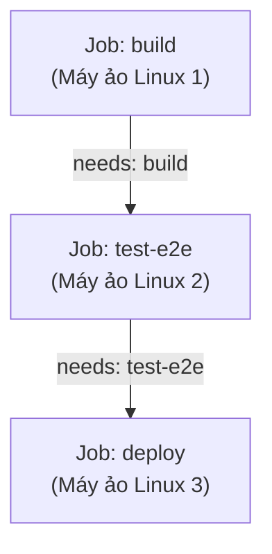
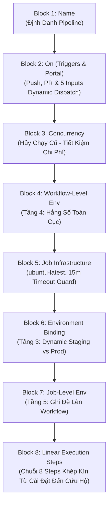
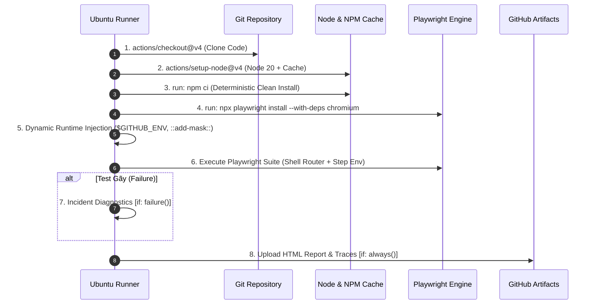
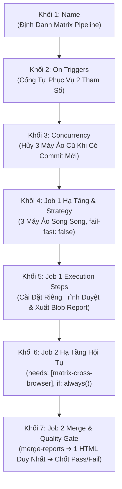

# 📑 BÀI 26: CI/CD VỚI GITHUB ACTIONS CHO PLAYWRIGHT TYPESCRIPT

> **Dự án thực chiến**: Hệ sinh thái Neko Coffee (`https://coffee.autoneko.com`)  
> **Bộ công cụ cốt lõi**: GitHub Actions, YAML Workflow Engine, Playwright Test Runner, Ubuntu Runner, HTML Artifacts, Caching, Matrix Strategy, Environment Secrets.  
> **Mục tiêu chuyên đề**: Xây dựng Pipeline kiểm thử tự động hóa chuẩn Enterprise, biến Playwright thành "Cổng gác chất lượng" (Quality Gate) chặn đứng 100% hồi quy lỗi (Regression Bugs) trước khi code được merge vào nhánh chính.

---

## 📑 MỤC LỤC TOÀN DIỆN (TABLE OF CONTENTS)

1. [🧠 Phần 1: Tổng Quan Tư Duy Về CI/CD Trong Kiểm Thử Tự Động Playwright](#-phần-1-tổng-quan-tư-duy-về-cicd-trong-kiểm-thử-tự-động-playwright)
   - 1.1. Triết lý "Shift-Left Testing" & Cổng Gác Chất Lượng (Quality Gate).
   - 1.2. Nỗi đau kinh điển: *"Works on My Machine"* vs Máy chủ CI.
   - 1.3. Khảo sát thực địa: Đối sánh 6 yếu tố giữa Local Machine và GitHub Actions Runner (`ubuntu-latest`).
   - 1.4. Tư duy cấu hình thích ứng môi trường (`process.env.CI` Adaptation).
   - 1.5. Chiến lược thu thập bằng chứng sau thảm họa (Post-Mortem: Trace, Video, Screenshot).
2. [🛠️ Phần 2: Giải Phẫu Chi Tiết Các Thành Phần Cơ Bản Của File YML](#-phần-2-giải-phẫu-chi-tiết-các-thành-phần-cơ-bản-của-file-yml)
   - 2.0. Vị trí lưu trữ bắt buộc (`.github/workflows/`), Quy ước đặt tên & Cơ chế phân xử khi có nhiều file YML.
   - 2.1. Bản chất định dạng YAML và Quy tắc thụt lề (Indentation Rules).
   - 2.2. Kiến trúc phân cấp 3 tầng: `Workflow` ➔ `Job` ➔ `Step`.
   - 2.3. Giải mã chi tiết 9 từ khóa trụ cột trong file YAML (`name`, `on`, `concurrency`, `jobs`, `runs-on`, `timeout-minutes`, `steps`, `with`, `env` & `needs`).
   - 2.4. Điều kiện rẽ nhánh và cơ chế sống còn của `if-else` trong GitHub Actions:
     - 4 hàm kiểm tra trạng thái: `always()`, `success()`, `failure()`, `cancelled()`.
     - Biểu thức điều kiện nâng cao (`&&`, `||`, `!`, `contains()`, `startsWith()`).
     - Rẽ nhánh kịch bản trong Shell (`case ... esac`, `if ... then ... else ... fi`).
   - 2.5. So sánh đối đầu: `npm ci` vs `npm install` trên môi trường CI.
   - 2.6. Giải mã lệnh cài đặt trình duyệt Linux: Tại sao bắt buộc dùng `npx playwright install --with-deps`?
   - 2.7. Chiến lược đóng gói & lưu trữ Artifacts (`actions/upload-artifact@v4`).
   - 2.8. Mã nguồn mẫu chuẩn mực file `.github/workflows/playwright.yml` (chú thích chi tiết từng dòng).
3. [🏛️ Phần 3: Kiến Trúc 10 Phân Tầng Biến Môi Trường (Env) & Bảo Mật Secrets Trong Git](#-phần-3-kiến-trúc-10-phân-tầng-biến-môi-trường-env--bảo-mật-secrets-trong-git)
   - 3.1. Cú pháp biểu thức `${{ }}` & các kiểu khai báo biến trong `env:` (Direct, Fallback `||`, Ternary, Interpolation).
   - 3.2. Sơ đồ kim tự tháp & Giải phẫu chi tiết 10 phân tầng kỹ thuật.
   - 3.3. Ma trận thứ tự ưu tiên ghi đè (Precedence Order & Cascading Rules) & Cẩm nang setup trên Web UI.
   - 3.4. Cơ chế bảo mật Secrets Masking Engine (`***`) & lệnh che giấu động `::add-mask::`.
   - 3.5. Cẩm nang thiết lập Secrets & Variables qua GitHub CLI (`gh secret set`, `gh variable set`).
4. [🧪 Phần 4: Triển Khai Thực Nghiệm Sandbox: Bộ Ma Trận 10 Test Cases Chuẩn Enterprise & Bảng Điều Khiển Động](#-phần-4-triển-khai-thực-nghiệm-sandbox-bộ-ma-trận-10-test-cases-chuẩn-enterprise--bảng-điều-khiển-động)
   - 4.1. Thiết kế kiến trúc Sandbox: File cấu hình độc lập `configs/playwright.lesson26-cicd.config.ts`.
   - 4.2. File Workflow đa năng `.github/workflows/playwright-lesson26.yml` (Dynamic Self-Service Portal).
   - 4.2.1. Giải phẫu & phân tích kỹ thuật chi tiết 8 khối (blocks) trong file `playwright-lesson26.yml`.
   - 4.3. Giải phẫu chi tiết 10 Test Cases thực nghiệm (Env Precedence, Secrets Masking, Runtime Injection, Staging vs Prod, Flaky Self-Healing, Timeout Guard, Artifacts Failure, Headless & Viewport, API Mock Isolation, Live Smoke E2E).
   - 4.4. Cẩm nang hướng dẫn kiểm tra (Check) từng case chi tiết tại Local và trên GitHub Actions / `gh` CLI.
   - 4.5. Bằng chứng thực thi Terminal thực tế (10 passed, 1 flaky).
5. [⚡ Phần 5: Kỹ Thuật Tối Ưu Tốc Độ CI — Browser Caching & Dependencies (Khái Quát Lộ Trình)](#-phần-5-kỹ-thuật-tối-ưu-tốc-độ-ci--browser-caching--dependencies-khái-quát-lộ-trình)
6. [🌐 Phần 6: Chiến Lược Chạy Song Song Đa Trình Duyệt Với Matrix Strategy Chuyên Sâu](#-phần-6-chiến-lược-chạy-song-song-đa-trình-duyệt-với-matrix-strategy-chuyên-sâu)
   - 6.1. Bản chất & Nguyên lý hoạt động của Matrix Strategy (Tích Descartes, `fail-fast: false`, `max-parallel`).
   - 6.2. Kiến trúc Đa Job: Mô hình Fan-Out (Matrix) & Fan-In (Tổng kết) kết hợp `needs:`.
   - 6.3. File Workflow Ma Trận `.github/workflows/playwright-lesson26-matrix.yml` (Tích Hợp Tự Động Ghép Báo Cáo).
   - 6.3.1. Giải phẫu & phân tích kỹ thuật chi tiết 7 khối (blocks) trong file `playwright-lesson26-matrix.yml` (Cơ chế gộp ĐÚNG 1 Report duy nhất).
   - 6.4. Ghép nối kịch bản thực nghiệm: CASE 08 (Headless & Viewport Matrix Integrity).
   - 6.5. Cẩm nang lệnh thực thi và đối chiếu Log Terminal thực tế 3 Browser Engines.
7. [📊 Phần 7: Tự Động Xuất Bản Dashboard Kiểm Thử Lên GitHub Pages Với `playwright-smart-reporter`](#-phần-7-tự-động-xuất-bản-dashboard-kiểm-thử-lên-github-pages-với-playwright-smart-reporter)
   - 7.1. Tại sao `playwright-smart-reporter` + GitHub Pages là bộ đôi hoàn hảo chuẩn Enterprise?
   - 7.2. Bí quyết bảo lưu lịch sử (`test-history.json`) giữa các máy ảo CI vô trạng thái bằng `actions/cache@v4`.
   - 7.3. Thiết lập phân quyền `permissions` & Chuỗi Steps triển khai tự động (`peaceiris/actions-gh-pages@v4`).
   - 7.4. Hướng dẫn 3 bước kích hoạt GitHub Pages trên giao diện Web Repository (Settings ➔ Pages).
   - 7.5. Trải nghiệm Dashboard thực chiến: Phân tích chỉ số KPI, Flaky Tests & History Trend Lines.

---

## 🧠 PHẦN 1: TỔNG QUAN TƯ DUY VỀ CI/CD TRONG KIỂM THỬ TỰ ĐỘNG PLAYWRIGHT

### 1.1. Triết lý "Shift-Left Testing" & Cổng Gác Chất Lượng (Quality Gate)

Trong mô hình phát triển phần mềm truyền thống (Thác nước - Waterfall), kiểm thử thường bị đẩy về giai đoạn cuối cùng (bên phải của timeline). Hậu quả là khi phát hiện lỗi nghiêm trọng, toàn bộ đội ngũ phải hoãn release, chi phí khắc phục (fix bug) lúc này cao gấp **10 đến 100 lần** so với lúc viết code.

```
MÔ HÌNH TRUYỀN THỐNG (Shift-Right - Rủi ro cao & Chi phí đắt):
[ Phân tích ] ──► [ Code ] ──► [ Deploy Staging ] ──► [ QA Test thủ công ] ──► 🔥 Phát hiện Bug (Trễ!)

MÔ HÌNH HIỆN ĐẠI (Shift-Left với Playwright CI/CD - Bắt lỗi ngay tại Pull Request):
[ Phân tích ] ──► [ Code + Unit ] ──► 🛡️ [ PLAYWRIGHT CI GATE ] ──► [ Merge ] ──► [ Production ]
                                              │
                                        ❌ Bắt Bug tức thì
                                        (Phút thứ 3 sau commit)
```

**Continuous Integration (Tích hợp liên tục - CI)** trong bối cảnh Playwright là việc:
* Mọi thay đổi mã nguồn (Commit hoặc Pull Request) đều kích hoạt một quy trình kiểm thử tự động trên máy chủ độc lập.
* Bộ test Playwright đóng vai trò như một **Cổng gác chất lượng (Quality Gate)**:
  * Nếu toàn bộ test case màu Xanh (`Passed`): GitHub tự động mở khóa nút **Merge** cho Pull Request.
  * Nếu chỉ cần 1 test case màu Đỏ (`Failed`): GitHub **chặn đứng** việc merge code, gửi cảnh báo đỏ và đính kèm báo cáo chi tiết cho developer sửa ngay lập tức.

---

### 1.2. Nỗi Đau Kinh Điển: *"Works on My Machine"* vs Máy Chủ CI

Một kịch bản xảy ra hàng ngày trong các nhóm phát triển phần mềm:
> **Developer / QA**: *"Ơ, test case này em chạy trên máy em 10 lần đều PASS 100%, sao đẩy lên CI lại gãy (FAIL) đỏ lòm thế kia?"*

Nguyên nhân không phải do Playwright "chập chờn", mà xuất phát từ sự **bất đối xứng hoàn toàn về môi trường thực thi**:
1. **Dữ liệu cục bộ**: Máy cá nhân đã đăng nhập sẵn, `localStorage` và `cookies` đã được lưu, cache trình duyệt đã nạp đầy đủ tài nguyên tĩnh (CSS, JS, Fonts).
2. **Độ phân giải màn hình**: Máy cá nhân dùng màn hình Retina / 4K với Viewport lớn, các nút bấm không bị che khuất. Máy CI chạy mặc định 1280x720 headless, nếu responsive bị vỡ thì phần tử sẽ bị che hoặc rơi vào menu hamburger.
3. **Tài nguyên phần cứng**: Máy cá nhân có 8–16 core CPU, RAM 16GB–32GB nên test chạy mượt mà. Máy ảo CI của GitHub chỉ có 2 vCPU chia sẻ, tải trang chậm hơn, dễ phát sinh độ trễ mạng (Network Latency) dẫn đến các lỗi Timeout nếu không viết code đón đợi thông minh.

---

### 1.3. Khảo Sát Thực Địa: Đối Sánh 6 Yếu Tố Local Machine vs GitHub Runner

Để làm chủ CI/CD, bạn bắt buộc phải hiểu rõ bản chất của máy chủ thực thi GitHub Actions (`ubuntu-latest`):

| Phương diện kỹ thuật | Máy Local cá nhân (Windows / macOS) | GitHub Actions Runner (`ubuntu-latest`) | Tác động kỹ thuật đến Playwright Suite |
|---|---|---|---|
| **Hệ điều hành** | Windows 11 / macOS | Ubuntu Linux 22.04 / 24.04 LTS | Linux **phân biệt chữ hoa/thường** (Case-sensitive). Ví dụ: `import { LoginPage } from './loginpage'` sẽ chạy được trên Windows nhưng sẽ ném lỗi crash trên Linux! Đường dẫn file dùng `/` thay vì `\`. |
| **Màn hình hiển thị (Display Server)** | Có màn hình vật lý (GUI), Display Server sẵn có | **Headless hoàn toàn** (Không có màn hình X11/Wayland) | Playwright **bắt buộc chạy Headless (`headless: true`)**. Nếu cố tình để `headless: false`, Chromium sẽ crash ngay lập tức vì không tìm thấy `$DISPLAY`. |
| **Thư viện hệ thống (OS Dependencies)** | Đầy đủ driver đồ họa, âm thanh, font chữ | Máy ảo Linux tối giản, **thiếu các thư viện C++**: `libasound2`, `libgbm1`, `libnss3`... | Bắt buộc phải chạy lệnh `npx playwright install --with-deps` để apt-get cài đặt đủ thư viện hệ điều hành trước khi mở browser. |
| **Cấu hình phần cứng (Hardware Specs)** | 8 – 16 vCPUs, 16GB – 32GB RAM | **2 vCPUs, 7GB RAM** (GitHub Free Runner) | **Cực kỳ nguy hiểm nếu bật quá nhiều workers**. Nếu chạy `--workers=4` hoặc `fullyParallel: true` trên suite nặng, Chromium sẽ ngốn sạch 7GB RAM và bị hệ điều hành Linux gửi tín hiệu `SIGKILL` (OOM Crash). Khuyến nghị: `workers: 2` hoặc `workers: 1`. |
| **Vòng đời môi trường (Lifecycle)** | Có trạng thái (Stateful): Giữ nguyên file, dependencies | **Vô trạng thái (Ephemeral)**: Máy ảo sinh ra khi bắt đầu Job và **bị tiêu hủy vĩnh viễn** sau khi Job xong | Mỗi lần chạy là một máy mới toanh. Phải tải lại Node, dependencies, browsers. Cần áp dụng chiến lược Caching để rút ngắn thời gian từ 8 phút xuống 2 phút. |
| **Quan sát kết quả (Observability)** | Mở mắt nhìn thẳng màn hình browser, xem console | **Mù hoàn toàn**: Chỉ có màn hình console dòng lệnh | Phải cấu hình cơ chế tự động **Upload Artifacts** để lưu trữ HTML Report, Trace file, Video khi có lỗi. |

---

### 1.4. Tư Duy Cấu Hình "Thích Ứng Môi Trường" (`process.env.CI` Adaptation)

Một kỹ sư Automation chuyên nghiệp **không bao giờ duy trì hai file config riêng biệt** cho Local và CI một cách thủ công. Thay vào đó, chúng ta xây dựng file `playwright.config.ts` có khả năng **tự động biến hình** nhờ biến môi trường toàn cục `process.env.CI` mà GitHub Actions tự động cung cấp:

```typescript
import { defineConfig, devices } from '@playwright/test';

// GitHub Actions tự động đặt CI=true trong môi trường chạy
const isCI = !!process.env.CI;

export default defineConfig({
  // 1. CHỐNG SÓT TEST: Không cho phép commit dính 'test.only' lên nhánh chính
  forbidOnly: isCI,

  // 2. CHỐNG FLAKY: Trên máy local chạy 0 retry để debug nhanh. Trên CI retry 2 lần để lọc lỗi mạng
  retries: isCI ? 2 : 0,

  // 3. ĐIỀU TIẾT TẢI: Local tận dụng tối đa CPU. Trên CI giới hạn 2 workers để không tràn RAM 7GB
  workers: isCI ? 2 : undefined,

  // 4. BÁO CÁO: CI xuất định dạng 'github' để gắn cờ annotation thẳng vào từng dòng code của PR
  reporter: isCI
    ? [
        ['github'],
        ['html', { outputFolder: 'playwright-report', open: 'never' }],
        ['list'],
      ]
    : [['html', { open: 'on-failure' }]],

  use: {
    // 5. TRÌNH DUYỆT: Local có thể bật headed để nhìn; CI bắt buộc 100% headless
    headless: isCI ? true : false,

    // 6. THU THẬP BẰNG CHỨNG: Chỉ ghi Trace ở lần retry đầu tiên để tiết kiệm dung lượng đĩa
    trace: isCI ? 'on-first-retry' : 'retain-on-failure',
    screenshot: 'only-on-failure',
    video: isCI ? 'retain-on-failure' : 'off',

    // 7. TIMEOUT AN TOÀN: Mạng trên CI có thể trễ hơn, tăng nhẹ actionTimeout nếu cần
    actionTimeout: 15_000,
    navigationTimeout: 30_000,
  },
});
```

---

### 1.5. Chiến Lược Thu Thập Bằng Chứng Sau Thảm Họa (Post-Mortem Evidence)

Khi một test case bị FAIL trên máy local, bạn có thể đặt `await page.pause()`, mở DevTools để inspect element. Nhưng trên máy ảo GitHub Actions ở tận trung tâm dữ liệu của Microsoft, bạn **không thể tương tác trực tiếp**.

Do đó, tư duy CI yêu cầu **Hộp đen cứu hộ (Blackbox Flight Recorder)**:
1. **Playwright Trace Viewer (`trace.zip`)**: Ghi lại từng frame chụp màn hình DOM, timeline mạng, log console tại đúng mili-giây xảy ra lỗi.
2. **Screenshot On Failure**: Ảnh chụp chụp ngay thời khắc assertion bị gãy.
3. **Video Recording**: Đoạn video ngắn ghi lại hành động của con trỏ chuột và giao diện web.
4. **HTML Report Standalone**: Toàn bộ trang web báo cáo tĩnh được nén lại và đẩy lên GitHub Artifacts để tải về xem offline bằng lệnh `npx playwright show-report`.

---

## 🛠️ PHẦN 2: GIẢI PHẪU CHI TIẾT CÁC THÀNH PHẦN CƠ BẢN CỦA FILE YML

### 2.0. Vị Trí Lưu Trữ Bắt Buộc, Quy Ước Đặt Tên & Cơ Chế Phân Xử Khi Có Nhiều File YML

Một trong những sai lầm phổ biến nhất của kỹ sư khi bắt đầu tiếp cận CI/CD là tạo file workflow sai thư mục hoặc sai quy ước, khiến GitHub hoàn toàn không nhận diện được pipeline dù cú pháp YAML bên trong viết chuẩn xác 100%.

#### 📍 1. Vị Trí Lưu Trữ Bắt Buộc (Hard Requirement)

GitHub Actions Workflow Engine có cơ chế quét file tự động với quy tắc bất biến:

```text
┌─────────────────────────────────────────────────────────────────────────────────────────────────────────┐
│                      QUY TẮC CẤU TRÚC THƯ MỤC BẮT BUỘC CỦA GITHUB ACTIONS                               │
├─────────────────────────────────────────────────────────────────────────────────────────────────────────┤
│                                                                                                         │
│  📁 <PROJECT_ROOT>/                                  (Thư mục gốc của Repository)                       │
│  └── 📁 .github/                                     (Bắt buộc có dấu chấm '.', chữ thường)            │
│      └── 📁 workflows/                               (Bắt buộc là 'workflows' số nhiều, chữ thường)     │
│          ├── 📄 playwright.yml                       (✅ Hợp lệ: GitHub tự động phát hiện & kích hoạt)  │
│          ├── 📄 playwright-lesson26.yml              (✅ Hợp lệ: Pipeline động Bài 26)                  │
│          └── 📁 sub-folder/                          (⚠️ CHÚ Ý NGUY HIỂM)                              │
│              └── 📄 test.yml                         (❌ VÔ HIỆU: GitHub KHÔNG quét thư mục con lồng nhau)│
│                                                                                                         │
└─────────────────────────────────────────────────────────────────────────────────────────────────────────┘
```

* **Đường dẫn tương đối chuẩn**: `.github/workflows/<ten-file>.yml` (tính từ gốc repository).
* **Đường dẫn tuyệt đối trong dự án hiện tại**:
  `.github/workflows/` (tại thư mục gốc repository)
* ⚠️ **3 cấm kỵ về vị trí file**:
  1. **Sai tên thư mục**: Đặt thành `.github/workflow/` (thiếu chữ `s`) hoặc `workflows/` (không nằm trong `.github/`) $\rightarrow$ GitHub bỏ qua 100%.
  2. **Thư mục con (Sub-directories)**: GitHub Actions chỉ đọc các file `.yml`/`.yaml` nằm **trực tiếp** ở cấp 1 của `.github/workflows/`. File nằm trong `.github/workflows/e2e/test.yml` sẽ **không bao giờ được nhận diện**.
  3. **Đặt ở thư mục gốc**: Để `playwright.yml` ngay ngoài thư mục gốc repository $\rightarrow$ GitHub coi đó là file text bình thường.

---

#### 🏷️ 2. Quy Ước Đặt Tên File (Naming Conventions)

| Tiêu Chí | Quy Ước Chuẩn Enterprise | Ví Dụ Thực Tế Trong Dự Án |
|---|---|---|
| **Đuôi mở rộng (Extension)** | Bắt buộc `.yml` hoặc `.yaml` (Khuyến nghị dùng nhất quán đuôi `.yml`). | `playwright.yml`, `playwright-lesson26.yml` |
| **Quy tắc đặt tên file (File Name)** | Dùng chữ thường, nối bằng dấu gạch ngang (`kebab-case`). Tên file phải phản ánh rõ phạm vi hoặc mục tiêu kiểm thử. | • `playwright.yml`: Pipeline chung toàn dự án.<br>• `playwright-lesson26.yml`: Pipeline chuyên đề Bài 26.<br>• `smoke-test.yml`: Kịch bản kiểm thử khói.<br>• `nightly-regression.yml`: Kịch bản hồi quy định kỳ. |
| **Phân biệt Tên File vs. Tên Workflow** | **Tên File** (`playwright-lesson26.yml`) dùng để quản trị mã nguồn trong Git.<br>**Tên Workflow** (`name: 🚀 Lesson 26 - Playwright CI/CD Sandbox`) khai báo ở dòng đầu file YML dùng để hiển thị trên tab **Actions** của GitHub UI. | Hai khái niệm này **hoàn toàn độc lập**. Bạn có thể đổi tên file mà không làm đổi tên hiển thị trên web, và ngược lại. |

---

#### 📂 3. Khảo Sát Thực Địa: 2 File Workflow Hiện Có Trong Dự Án

Trong thư mục `.github/workflows/` (tại thư mục gốc repository), dự án đã được thiết lập sẵn 2 file quy trình:

1. **`playwright.yml`** *(604 bytes, 25 dòng)*:
   - Pipeline khung cơ bản do Playwright scaffold sinh ra.
   - Kích hoạt qua `workflow_dispatch` (thủ công) để chạy toàn bộ suite mặc định `npx playwright test`.
2. **`playwright-lesson26.yml`** *(10,484 bytes, 215 dòng)*:
   - Pipeline Enterprise chuyên sâu của Bài 26.
   - Tích hợp **Bảng điều khiển động (Self-Service Portal)** với các input tùy chọn: 10 test cases, 2 môi trường (Staging/Prod), chỉnh số workers (1-2), retries (0-2), mô phỏng failure, nạp runtime env và mask secrets.

---

#### 🔀 4. Cơ Chế Phân Xử & Điều Phối Khi Có Nhiều File YML (Multiple Workflows Resolution)

Một câu hỏi kinh điển trong thực tế: *"Nếu trong thư mục `.github/workflows/` có nhiều file `.yml` (ví dụ `playwright.yml`, `playwright-lesson26.yml`, `smoke.yml`), GitHub sẽ chọn file nào để chạy?"*

👉 **Nguyên tắc cốt lõi của GitHub Actions**: **GitHub KHÔNG chọn 1 file duy nhất theo kiểu ưu tiên hay ghi đè!** Thay vào đó, nó duyệt **TẤT CẢ** các file `.yml`/`.yaml` trong `.github/workflows/` và kích hoạt bất kỳ file nào **thỏa mãn điều kiện sự kiện (`on:`)**.

```text
┌─────────────────────────────────────────────────────────────────────────────────────────────────────────┐
│                    CƠ CHẾ PHÂN XỬ ĐIỀU PHỐI NHIỀU FILE YML TRÊN GITHUB ACTIONS                          │
├─────────────────────────────────────────────────────────────────────────────────────────────────────────┤
│                                                                                                         │
│  SỰ KIỆN PHÁT SINH (Event: git push, pull_request, cron schedule, hoặc bấm nút thủ công)               │
│                                    │                                                                    │
│                                    ▼                                                                    │
│  GitHub Actions Workflow Engine quét toàn bộ .github/workflows/*.yml                                   │
│                                    │                                                                    │
│         ┌──────────────────────────┼──────────────────────────┐                                         │
│         ▼                          ▼                          ▼                                         │
│  📄 File A: on.push?        📄 File B: on.schedule?    📄 File C: on.workflow_dispatch?                 │
│     • KHỚP ĐIỀU KIỆN!          • KHÔNG KHỚP               • KHÔNG KHỚP                                  │
│     ➔ 🚀 KÍCH HOẠT THỰC THI    ➔ ⏸️ BỎ QUA (Idle)          ➔ ⏸️ BỎ QUA (Idle)                             │
│                                                                                                         │
│  ⚠️ NẾU CẢ FILE A VÀ FILE D CÙNG KHỚP on.push (Ví dụ: ui-test.yml & api-test.yml):                     │
│     ➔ ⚡ CẢ 2 ĐỀU CHẠY SONG SONG (PARALLEL) trên 2 cụm Runner máy ảo Ubuntu hoàn toàn độc lập!           │
│                                                                                                         │
└─────────────────────────────────────────────────────────────────────────────────────────────────────────┘
```

##### 🔹 3 Kịch Bản Phân Xử Thực Tế:

1. **Kịch bản 1: Nhiều file cùng lắng nghe 1 sự kiện ➔ Chạy SONG SONG độc lập**:
   - Nếu cả `ui-test.yml` và `api-test.yml` đều có `on: push: branches: [main]`, khi push code lên `main`, GitHub sẽ khởi tạo **2 Workflow Runs chạy đồng thời**. Chúng không xung đột và không đè lên nhau.
2. **Kịch bản 2: Mỗi file nghe một sự kiện khác nhau ➔ Chỉ file khớp mới chạy**:
   - `nightly.yml` lắng nghe `on: schedule` $\rightarrow$ chỉ chạy tự động lúc 2:00 sáng.
   - `release.yml` lắng nghe `on: release` $\rightarrow$ chỉ chạy khi release phiên bản mới.
   - `debug.yml` lắng nghe `on: workflow_dispatch` $\rightarrow$ chỉ chạy khi người dùng chủ động bấm nút.
3. **Kịch bản 3: Tối ưu bằng Bộ lọc đường dẫn (`paths` / `paths-ignore`) ➔ Tránh chạy lãng phí**:
   - Sử dụng từ khóa `paths:` để chỉ định phạm vi code ảnh hưởng:
     ```yaml
     on:
       push:
         paths:
           - 'modules/2-api/NekoCoffee/lesson-26/**'
     ```
   - Khi commit chỉ chỉnh sửa Lesson 26, chỉ workflow của Lesson 26 chạy; workflow của các bài học khác sẽ hoàn toàn nằm yên, tiết kiệm tối đa phút chạy CI.

---

##### 🔍 Bảng Đối Chiếu Thực Tế 2 File Workflow Trong Dự Án Hiện Tại:

```text
.github/workflows/
├── 📄 playwright.yml           (Cấu hình on: workflow_dispatch)
└── 📄 playwright-lesson26.yml  (Cấu hình on: push, pull_request [paths: lesson-26/**] & workflow_dispatch)
```

| Tình Huống Thực Tế | `playwright.yml` | `playwright-lesson26.yml` | Cơ Chế Phân Xử Của GitHub |
|---|:---:|:---:|---|
| **Bạn `git push` sửa code trong `lesson-26/`** | ❌ Bỏ qua | ✅ **Tự động chạy** | `playwright.yml` không nghe `push`. Chỉ `playwright-lesson26.yml` khớp nhánh `main` và khớp đường dẫn `paths: ['modules/.../lesson-26/**']`. |
| **Bạn `git push` chỉ sửa file tài liệu `*.md`** | ❌ Bỏ qua | ❌ Bỏ qua | Cả 2 file đều không khớp bộ lọc đường dẫn (do `paths` chỉ nhắm vào mã nguồn hoặc `paths-ignore: ['**.md']`). |
| **Bạn vào tab Actions trên GitHub Web UI** | 👉 Chạy khi được bấm | 👉 Chạy khi được bấm | GitHub hiển thị **danh sách toàn bộ workflow ở cột bên trái** (theo `name:`). Bạn click vào workflow nào và nhấn **"Run workflow"** thì chỉ đúng file đó được nạp vào máy ảo. |

---

### 2.1. Bản Chất Định Dạng YAML Và Quy Tắc Thụt Lề

Tập tin cấu hình của GitHub Actions sử dụng ngôn ngữ **YAML** (*YAML Ain't Markup Language*). Đây là định dạng lưu trữ cấu trúc dữ liệu phân cấp cực kỳ tinh gọn nhưng có quy tắc cú pháp vô cùng nghiêm ngặt:

```yaml
# ❌ LỖI NGHIÊM TRỌNG: Dùng phím TAB để thụt lề -> GitHub Actions sẽ báo cú pháp invalid!
jobs:
	test:
		runs-on: ubuntu-latest

# ✅ CÚ PHÁP CHUẨN: Sử dụng đúng 2 khoảng trắng (2 SPACES) cho mỗi cấp thụt lề
jobs:
  test:
    runs-on: ubuntu-latest
```

> ⚠️ **3 Quy tắc vàng khi viết YAML trong GitHub Actions**:
> 1. **Thụt lề bằng đúng 2 dấu cách (spaces)**: Tuyệt đối không dùng phím `Tab`.
> 2. **Dấu hai chấm (`:`)**: Luôn phải có **1 dấu cách phía sau** dấu hai chấm (ví dụ: `name: value`, không viết `name:value`).
> 3. **Dấu gạch ngang (`-`)**: Biểu thị một phần tử trong danh sách mảng (Array). Sau dấu gạch ngang phải có **1 khoảng trắng** (ví dụ: `- uses: ...`).

---

### 2.2. Kiến Trúc Phân Cấp 3 Tầng: Workflow ➔ Job ➔ Step

Tất cả các quy trình CI/CD trên GitHub đều tuân theo mô hình hình cây 3 cấp bậc:

```
📁 TẦNG 1: WORKFLOW (.github/workflows/playwright.yml)
   │  (Toàn bộ quy trình kiểm thử tự động của dự án)
   │
   └── 🖥️ TẦNG 2: JOB (Đơn vị máy ảo thực thi độc lập)
         │  (Chạy trên 1 máy ảo Ubuntu: runs-on: ubuntu-latest)
         │
         ├── 🔹 TẦNG 3: STEP 1 (Checkout mã nguồn)
         ├── 🔹 TẦNG 3: STEP 2 (Cài đặt Node.js)
         ├── 🔹 TẦNG 3: STEP 3 (Cài dependencies: npm ci)
         ├── 🔹 TẦNG 3: STEP 4 (Cài Playwright Browser binaries)
         ├── 🔹 TẦNG 3: STEP 5 (Chạy lệnh test: npx playwright test)
         └── 🔹 TẦNG 3: STEP 6 (Upload HTML Report lên Artifacts)
```

* **Workflow**: Đại diện cho 1 file `.yml` nằm trong thư mục `.github/workflows/`. Bạn có thể tạo nhiều workflow (ví dụ: `smoke-test.yml`, `regression-nightly.yml`).
* **Job**: Một khối công việc chạy trên một máy chủ riêng biệt. Mặc định các Jobs trong cùng một Workflow sẽ chạy **song song** (Parallel) trừ khi dùng từ khóa `needs:` để bắt chúng chạy tuần tự.
* **Step**: Các bước lệnh chạy **tuần tự từ trên xuống dưới** trong cùng một máy ảo của Job đó. Nếu Step phía trước bị FAIL, các Step thông thường phía sau sẽ lập tức bị hủy bỏ (Abort).

---

### 2.3. Giải Mã Chi Tiết 8 Từ Khóa Trụ Cột Trong File YAML

#### 1. `name` (Tên Định Danh)
Là chuỗi văn bản hiển thị trên giao diện thẻ **Actions** của GitHub để giúp nhóm phát triển nhận diện quy trình:
```yaml
name: 🚀 Neko Coffee E2E Playwright Pipeline
```

#### 2. `on` (Cơ Chế Kích Hoạt & Toàn Bộ Bộ Lọc - Event Triggers & Filters)

Từ khóa `on:` quyết định **sự kiện nào** trên GitHub sẽ đánh thức workflow dậy chạy. Không chỉ đơn thuần là `push` hay `pull_request`, GitHub Actions cung cấp một hệ sinh thái **Bộ lọc chuyên sâu (Filters)** và **Kiểu hành động (Activity Types)** giúp kiểm soát chính xác 100% thời điểm runner được phép khởi động.

##### 🔹 1. Bảng Tổng Hợp Các Bộ Lọc Cốt Lõi (Filters) Bên Trong `push` & `pull_request`:

| Bộ Lọc (Filter) | Cú Pháp Khai Báo | Ý Nghĩa Kỹ Thuật & Tác Động Thực Tế |
|---|---|---|
| **`branches`** | `branches: [ main, master, 'release/**' ]` | Chỉ kích hoạt khi sự kiện xảy ra trên các nhánh được chỉ định. Hỗ trợ ký tự đại diện (Glob/Wildcard `**`). |
| **`branches-ignore`** | `branches-ignore: [ 'temp/**', 'experiment/*' ]` | Chạy trên mọi nhánh **ngoại trừ** các nhánh nằm trong danh sách này. *(Lưu ý: Không dùng chung với `branches`)*. |
| **`tags`** | `tags: [ 'v[0-9]+.[0-9]+.[0-9]+' ]` | Chỉ kích hoạt khi một Git Tag phiên bản mới được đẩy lên (ví dụ: `git push origin v1.2.0`). |
| **`tags-ignore`** | `tags-ignore: [ 'alpha-*', 'beta-*' ]` | Bỏ qua không chạy test khi gắn các tag thử nghiệm nội bộ. *(Lưu ý: Không dùng chung với `tags`)*. |
| **`paths`** | `paths: [ 'modules/lesson-26/**', 'configs/**' ]` | **⚡ Bộ lọc then chốt (Targeted Testing)**: Chỉ kích hoạt workflow nếu commit có chỉnh sửa ít nhất 1 file thuộc các đường dẫn này. Nếu sửa file ngoài phạm vi ➔ GitHub bỏ qua hoàn toàn, tiết kiệm 100% phút chạy CI! |
| **`paths-ignore`** | `paths-ignore: [ '**.md', 'docs/**', '.gitignore' ]` | Chạy test khi có code thay đổi, nhưng **tự động bỏ qua** nếu commit đó chỉ chỉnh sửa tài liệu, markdown, ảnh minh họa. |
| **`types`** *(Chỉ PR)* | `types: [ opened, synchronize, reopened, ready_for_review ]` | **Kiểu hành động chi tiết trên PR**: Mặc định chỉ chạy khi `opened`, `synchronize`, `reopened`. Nếu muốn bắt thêm sự kiện chuyển từ Draft sang Ready hoặc khi PR bị đóng/merge (`closed`), bắt buộc phải khai báo `types`. |

> ⚠️ **Quy tắc loại trừ của GitHub Actions**:
> - Không được dùng đồng thời cả `branches` và `branches-ignore` trong cùng một sự kiện.
> - Không được dùng đồng thời cả `paths` và `paths-ignore` trong cùng một sự kiện.

---

##### 🔹 2. Giải Phẫu Thực Tế Cấu Hình `on:` Trong File `playwright-lesson26.yml`

Dưới đây là mã nguồn thực tế đang vận hành trong file `playwright-lesson26.yml` của dự án, kết hợp đầy đủ cả 3 trụ cột: **`push` (với `paths`)** + **`pull_request` (với `paths`)** + **`workflow_dispatch` (với bảng `inputs` động)**:

```yaml
# ── 1. ĐIỀU KIỆN KÍCH HOẠT (TRIGGERS & TARGETED PATHS) ──────────────────────
on:
  # 🎯 TRỤ CỘT 1: KHI PUSH CODE TRỰC TIẾP
  push:
    branches: [ main, master ]
    # ⚡ BỘ LỌC PATHS: Chỉ chạy khi có thay đổi trong đúng 3 phạm vi then chốt:
    paths:
      - 'modules/2-api/NekoCoffee/lesson-26/**'        # Mã nguồn test specs Bài 26
      - 'configs/playwright.lesson26-cicd.config.ts'  # File cấu hình riêng của Bài 26
      - '.github/workflows/playwright-lesson26.yml'   # Chính file workflow này

  # 🎯 TRỤ CỘT 2: KHI MỞ HOẶC CẬP NHẬT PULL REQUEST (QUALITY GATE)
  pull_request:
    branches: [ main, master ]
    # ⚡ BỘ LỌC PATHS TRÊN PR: Đảm bảo chỉ thẩm định PR nếu có động chạm tới Bài 26
    paths:
      - 'modules/2-api/NekoCoffee/lesson-26/**'
      - 'configs/playwright.lesson26-cicd.config.ts'
      - '.github/workflows/playwright-lesson26.yml'

  # 🎯 TRỤ CỘT 3: KÍCH HOẠT THỦ CÔNG QUA WEB UI (SELF-SERVICE TESTING PORTAL)
  workflow_dispatch:
    inputs:
      test_case:
        description: '🎯 Chọn Kịch Bản Muốn Kiểm Thử (1 - 10 hoặc all)'
        required: true
        default: 'all'
        type: choice
        options:
          - 'all'
          - 'case-01-env-hierarchy'
          - 'case-02-secrets-masking'
          - 'case-03-runtime-injection'
          - 'case-04-environments'
          - 'case-05-flaky-retry'
          - 'case-06-timeout-guard'
          - 'case-07-artifacts-fail'
          - 'case-08-headless-viewport'
          - 'case-09-api-mock-isolation'
          - 'case-10-live-smoke'

      target_env:
        description: '🌐 Chọn Tầng Môi Trường (GitHub Environments)'
        required: true
        default: 'production'
        type: choice
        options:
          - 'production'
          - 'staging'

      retries:
        description: '🔄 Số lần Retry (Chọn 0 để xem Case 05 bị ĐỎ thế nào)'
        required: true
        default: '2'
        type: choice
        options: [ '2', '1', '0' ]

      workers:
        description: '👥 Số lượng Workers thực thi'
        required: true
        default: '2'
        type: choice
        options: [ '2', '1' ]

      simulate_failure:
        description: '🚨 Cố tình kích hoạt Test Fail để kiểm chứng if: always()'
        required: false
        type: boolean
        default: false

  # 🎯 TRỤ CỘT 4: KÍCH HOẠT ĐỊNH KỲ VÀO BAN ĐÊM (SCHEDULED CRON)
  # schedule:
  #   - cron: '0 19 * * 1-5' # 19:00 UTC = 02:00 sáng VN (UTC+7) từ Thứ 2 đến Thứ 6
```

---

#### 3. `concurrency` (Chống Lãng Phí Tài Nguyên Máy Ảo)
Khi developer liên tục bấm Save và đẩy 3 commit liên tiếp trong vòng 2 phút lên cùng một Pull Request:
* Không có `concurrency`: GitHub sẽ mở 3 máy ảo chạy đồng thời cho 3 commit cũ và mới $\rightarrow$ Lãng phí phút chạy và làm nghẽn hàng đợi CI.
* Có `concurrency` với `cancel-in-progress: true`: GitHub sẽ **tự động hủy ngay lập tức** các lần chạy của commit cũ, chỉ giữ lại commit mới nhất.
```yaml
concurrency:
  group: ${{ github.workflow }}-${{ github.ref }}
  cancel-in-progress: true
```

#### 4. `jobs` & `runs-on` (Khai Báo Máy Chủ Thực Thi)
Định nghĩa định danh của job và hệ điều hành của máy ảo:
```yaml
jobs:
  playwright-execution:
    name: 🧪 Run E2E Test Suite
    runs-on: ubuntu-latest # Máy ảo Ubuntu Linux mới nhất (chi phí rẻ và khởi động nhanh nhất)
```

#### 5. `timeout-minutes` (Giới Hạn Trần Thời Gian)
Tránh thảm họa kẹt test: Giả sử một test case bị kẹt trong vòng lặp vô tận hoặc chờ một request không bao giờ trả về, máy ảo sẽ chạy liên tục tới mức trần mặc định 6 tiếng (360 phút) của GitHub và ngốn sạch toàn bộ hạn mức tài khoản của bạn!
```yaml
    timeout-minutes: 45 # Nếu quá 45 phút chưa xong, GitHub sẽ tự động ngắt kết nối và báo lỗi
```

#### 6. `steps` — `uses` vs. `run`
* **`uses`**: Gọi một **Action có sẵn** từ GitHub Marketplace (như một thư viện đóng gói sẵn):
  * `actions/checkout@v4`: Kéo toàn bộ mã nguồn repository vào máy ảo.
  * `actions/setup-node@v4`: Cài đặt môi trường runtime Node.js.
  * `actions/upload-artifact@v4`: Tải thư mục kết quả lên lưu trữ của GitHub.
* **`run`**: Chạy một **câu lệnh shell** trực tiếp trên terminal của máy ảo (`bash` trên Linux):
  ```yaml
  - name: 📦 Run npm test
    run: npm run test:lesson25-tabs
  ```

#### 7. `with` & `env` (Tham Số & Biến Môi Trường)
* `with`: Dùng để truyền các tham số cấu hình vào action được gọi qua `uses`.
* `env`: Nạp biến môi trường cho cả Job hoặc riêng cho từng Step:
```yaml
      - name: 🟢 Setup Node.js
        uses: actions/setup-node@v4
        with:
          node-version: 20
          cache: 'npm' # Bật tính năng tự động cache thư mục ~/.npm

      - name: 🎭 Run Tests with Environment
        run: npx playwright test
        env:
          CI: true
          BASE_URL: https://coffee.autoneko.com
          STAFF_PASSWORD: ${{ secrets.STAFF_PASSWORD }} # Bảo mật tuyệt đối qua GitHub Secrets
```

#### 8. `needs` (Điều Phối Đa Jobs & Chuỗi Phụ Thuộc DAG)

Trong GitHub Actions, khi bạn khai báo từ 2 `jobs` trở lên trong cùng một file YML, **hành vi mặc định của hệ thống là chạy tất cả các jobs đó SONG SONG (In Parallel)** trên các máy ảo hoàn toàn độc lập.

Nếu Job sau bắt buộc phải đợi Job trước hoàn thành (ví dụ: Job `test` phải đợi Job `build` xong, hoặc Job `deploy` phải đợi Job `test` xanh 100%), bạn bắt buộc phải dùng từ khóa **`needs:`** để thiết lập chuỗi phụ thuộc có thứ tự (Directed Acyclic Graph - DAG).



##### 🔹 1. Cú Pháp Cơ Bản: Phụ Thuộc Đơn & Phụ Thuộc Mảng Nhiều Jobs
```yaml
jobs:
  build:
    runs-on: ubuntu-latest
    steps:
      - run: npm ci && npm run build

  test-e2e:
    needs: build # 👈 Bắt buộc đợi job 'build' hoàn thành thành công mới chạy
    runs-on: ubuntu-latest
    steps:
      - run: npx playwright test

  deploy:
    needs: [build, test-e2e] # 👈 Nhận mảng: Đợi CẢ HAI jobs 'build' và 'test-e2e' thành công
    runs-on: ubuntu-latest
    steps:
      - run: echo "Deploying to production..."
```

##### 🔹 2. Chia Sẻ Dữ Liệu Giữa Các Jobs Qua `outputs` & `needs.<job_id>.outputs`
Vì mỗi Job chạy trên một máy ảo Linux hoàn toàn độc lập (vùng nhớ RAM và ổ cứng hoàn toàn tách biệt), các biến trong `$GITHUB_ENV` của Job A **không thể được đọc bởi Job B**. Để truyền dữ liệu từ Job A sang Job B, bạn bắt buộc phải dùng cơ chế `outputs`:

```yaml
jobs:
  setup-env:
    runs-on: ubuntu-latest
    # Khai báo outputs cấp Job (trích xuất từ step bên dưới)
    outputs:
      release_tag: ${{ steps.gen_tag.outputs.tag }}
    steps:
      - id: gen_tag
        run: echo "tag=v2.5.0-$(date +%s)" >> $GITHUB_OUTPUT

  playwright-test:
    needs: setup-env # 👈 Khai báo phụ thuộc để lấy context
    runs-on: ubuntu-latest
    steps:
      - name: Đọc dữ liệu từ Job trước qua needs context
        run: |
          echo "Phiên bản cần kiểm thử: ${{ needs.setup-env.outputs.release_tag }}"
```

##### 🔹 3. Kiểm Soát Trạng Thái Khi Job Phía Trước Bị Lỗi (`needs.<job_id>.result`)
* **Mặc định**: Nếu Job phía trước bị `failure` (hoặc `cancelled`), toàn bộ các Job phía sau có khai báo `needs:` sẽ tự động bị **BỎ QUA (Skipped)**.
* **Cơ chế Cứu Hộ / Dọn Dẹp (Teardown & Notification)**: Nếu bạn muốn một Job dọn dẹp hoặc gửi thông báo Slack BẤT KỂ Job test trước đó thành công hay thất bại, hãy kết hợp `needs` với `if: always()`:

```yaml
  send-notification:
    needs: [test-e2e]
    runs-on: ubuntu-latest
    if: always() # ⚡ Đảm bảo LUÔN CHẠY dù test-e2e bị PASS hay FAIL
    steps:
      - name: Báo cáo kết quả
        run: |
          echo "Trạng thái của test-e2e: ${{ needs.test-e2e.result }}"
          # Giá trị có thể là: 'success', 'failure', 'cancelled', 'skipped'
```

##### 🔹 4. ❓ Câu Hỏi Thực Chiến: Tại Sao File `playwright-lesson26.yml` Không Dùng `needs:`?
* **Bản chất**: File `playwright-lesson26.yml` được thiết kế theo **Kiến trúc Đơn Job (Single-Job Architecture)** với duy nhất 1 job mang tên `playwright-sandbox:`.
* **Lý do kỹ thuật**:
  1. Trong GitHub Actions, từ khóa `needs:` chỉ có ý nghĩa **giữa Job này với Job khác**. Khi một workflow chỉ có đúng 1 Job, nó không có Job nào khác để mà "cần" (`needs`).
  2. Bên trong 1 Job duy nhất, toàn bộ 8 `steps` (Checkout ➔ Setup Node ➔ npm ci ➔ Install Browsers ➔ Dynamic Env ➔ Run Tests ➔ Diagnostics ➔ Upload Artifacts) **mặc định luôn luôn chạy tuần tự 100% trên cùng một máy ảo Linux** mà không cần bất kỳ từ khóa `needs:` nào!
* **Bảng Đối Sánh: Kiến Trúc 1 Job (Single-Job) vs. Đa Job (Multi-Job với `needs`)**:

| Tiêu chí | Single-Job Architecture (Như Bài 26) | Multi-Job Architecture (Với `needs:`) |
|---|---|---|
| **Cấu trúc** | Duy nhất 1 Job, bên trong có nhiều `steps`. | Nhiều Jobs tách rời (`build`, `test`, `deploy`). |
| **Máy ảo Runner** | Dùng **1 máy ảo Ubuntu duy nhất** cho toàn bộ quá trình. | Khởi tạo **nhiều máy ảo Ubuntu độc lập** cho từng công đoạn. |
| **Thời gian khởi động** | **Tối ưu nhất**: Chỉ mất 1 lần cấp phát máy ảo (~10s) và 1 lần cài môi trường. | **Lâu hơn**: Mỗi Job mới phải chờ GitHub xếp hàng và cấp phát máy ảo mới (~10s - 30s/job). |
| **Chia sẻ File / Cache** | Chia sẻ trực tiếp qua ổ đĩa máy ảo cực nhanh (0ms). | Bắt buộc phải đóng gói qua `upload-artifact` rồi `download-artifact` lại giữa các jobs (tốn băng thông và thời gian). |
| **Sử dụng `needs:`** | ❌ **Không cần dùng** (vì các `steps` tự động tuần tự). | ✅ **Bắt buộc dùng** (để khóa thứ tự thực thi và tránh chạy song song bừa bãi). |
| **Khi nào nên dùng?** | Rất phù hợp cho **Test Sandbox, Automation Suite tập trung** (như Bài 26), nơi mục tiêu chính là chạy test và xuất báo cáo khép kín. | Phù hợp cho **Enterprise Delivery Pipeline hoàn chỉnh**: Đội Dev cần `build`, Đội QA cần `test`, Đội Ops cần `deploy` độc lập. |

---

### 2.4. Điều Kiện Rẽ Nhánh & Bản Chất Cơ Chế "If-Else" Trong GitHub Actions

Trong file YML, không có cấu trúc `if ... else ...` lồng nhau dạng khối lệnh như ngôn ngữ lập trình thông thường. Thay vào đó, GitHub Actions sử dụng **Thuộc tính `if:` ở cấp độ Job hoặc Step** kết hợp với **Hàm kiểm tra trạng thái máy ảo (Status Check Functions)** và **Biểu thức Logic (Expressions)** để điều khiển luồng thực thi:

#### 🔹 1. Bốn Hàm Kiểm Tra Trạng Thái Sống Còn (Job Status Check Functions)

Mặc định, mọi Step trong GitHub Actions đều có ngầm định là `if: success()` — nghĩa là nếu một step phía trước bị lỗi (exit code khác 0), runner sẽ **lập tức dừng pipeline và bỏ qua (skip) toàn bộ các step phía sau**. Để thay đổi hành vi này, chúng ta dùng:

| Cú pháp điều kiện | Thời điểm thực thi | Kịch bản áp dụng kinh điển trong Playwright CI |
|---|---|---|
| **`if: always()`** | **Luôn luôn chạy**, bất kể các step trước đó Pass, Fail, hay bị Cancelled. | **Upload Báo cáo HTML & Artifacts**: Dù test gãy hay đỗ, bước upload báo cáo bắt buộc phải chạy để cung cấp bằng chứng điều tra. |
| **`if: failure()`** | **Chỉ chạy khi có ít nhất một step trước đó bị FAIL**. | **Bắn cảnh báo khẩn cấp & Triage**: Gửi tin nhắn Slack/Teams, kích hoạt webhook báo động đỏ, hoặc trích xuất log chẩn đoán sự cố (`dmesg`, `free -m`). |
| **`if: success()`** | **Chỉ chạy khi tất cả các step trước đó thành công** (Hành vi mặc định). | **Deploy Production / Cập nhật cache**: Chỉ khi toàn bộ test pass 100% thì mới tiến hành deploy hoặc xuất bản báo cáo lên GitHub Pages. |
| **`if: cancelled()`** | **Chỉ chạy khi workflow bị hủy thủ công** (User bấm nút Cancel run). | **Dọn dẹp tài nguyên (Teardown)**: Hủy các container Docker phụ trợ, đóng tunnel mạng tạm thời. |

#### 🔹 2. Biểu Thức Điều Kiện Nâng Cao & Toán Tử Logic (Expressions & Operators)

Bạn có thể kết hợp các hàm kiểm tra trạng thái với các toán tử logic `&&` (AND), `||` (OR), `!` (NOT):

```yaml
# Ví dụ 1: Chỉ chạy khi test bị FAIL VÀ sự kiện kích hoạt là PUSH vào nhánh main
- name: 🚨 Báo động Slack khi nhánh chính bị gãy
  if: failure() && github.ref == 'refs/heads/main'
  run: curl -X POST -H 'Content-type: application/json' --data '{"text":"🔥 Main branch broken!"}' $SLACK_WEBHOOK

# Ví dụ 2: Chạy khi có yêu cầu mô phỏng lỗi từ người dùng (Tham số boolean)
- name: 🧪 Kích hoạt chế độ chẩn đoán sâu
  if: always() && github.event.inputs.simulate_failure == 'true'
  run: echo "Mode: Deep Diagnostic Enabled"

# Ví dụ 3: Toán tử 3 ngôi (Ternary Operator) để gán giá trị động inline
env:
  TARGET_URL: ${{ github.event.inputs.target_env == 'staging' && 'https://staging.coffee.autoneko.com' || 'https://coffee.autoneko.com' }}
```

#### 🔹 3. Rẽ Nhánh Điều Kiện Cục Bộ Trong Câu Lệnh Shell (`run:`)

Ngoài thuộc tính `if:` ở cấp độ step, bên trong khối `run:`, bạn có toàn quyền sử dụng cú pháp rẽ nhánh mạnh mẽ của Linux Bash:
* **Cấu trúc `case ... in ... esac`**: Dùng để phân luồng chọn Test Case hoặc Môi trường cực kỳ gọn gàng (như trong workflow Bài 26).
* **Cấu trúc `if [ ... ]; then ... else ... fi`**: Xử lý logic nghiệp vụ chi tiết trên hệ điều hành.

```bash
# Ví dụ phân nhánh trong step shell:
if [ "$TARGET_ENV" = "staging" ]; then
  echo "🌐 Đang trỏ tới môi trường STAGING"
else
  echo "🚀 Đang trỏ tới môi trường PRODUCTION"
fi
```

---

### 2.5. So Sánh Đối Đầu: `npm ci` vs. `npm install` Trên CI

Tại sao trên máy CI chúng ta **tuyệt đối không bao giờ dùng `npm install`** mà bắt buộc phải dùng `npm ci`?

| Tiêu chí | `npm install` (Thích hợp cho Local) | `npm ci` (*Continuous Integration* - Bắt buộc trên CI) |
|---|---|---|
| **Cơ sở cài đặt** | Đọc `package.json`, cố gắng tìm version mới nhất thỏa mãn dải ký tự (`^`, `~`) | Đọc **chính xác 100% `package-lock.json`**, không nâng bất kỳ version nào |
| **Xử lý thư mục `node_modules`** | Ghi đè hoặc cập nhật vào thư mục hiện có | **Tự động xóa sạch hoàn toàn** `node_modules` trước khi cài mới |
| **Ghi đè file lock** | Có thể tự động sửa đổi file `package-lock.json` nếu có version mới | **Không bao giờ sửa file lock**. Nếu `package.json` lệch với `package-lock.json`, nó sẽ **ném lỗi và dừng lại ngay** |
| **Tốc độ thực thi** | Chậm hơn vì phải tính toán cây phụ thuộc (Dependency tree resolution) | **Nhanh gấp 2 – 3 lần** vì cài đặt trực tiếp từ cây đã đóng băng sẵn trong lockfile |
| **Tính nhất quán (Reproducibility)** | ❌ Kém: Hôm nay cài version 1.2.0, ngày mai có thể bị kéo lên 1.2.1 gây gãy build | ✅ Tuyệt đối: Đảm bảo 1000 lần chạy trên CI đều dùng đúng 100% các byte mã nguồn giống hệt nhau |

---

### 2.6. Giải Mã Lệnh Cài Đặt Linux: Tại Sao Bắt Buộc Dùng `npx playwright install --with-deps`?

Khi chạy Playwright trên máy local (Windows/Mac), bạn chỉ cần gõ `npx playwright install chromium`. Nhưng trên máy ảo Ubuntu Linux của GitHub Actions, nếu bạn chỉ gõ như vậy, khi test khởi động bạn sẽ gặp ngay lỗi kinh hoàng sau:

```text
browserType.launch: Host system is missing dependencies to run browsers.
Missing libraries:
  libasound.so.2
  libgbm.so.1
  libnspr4.so
  libnss3.so
  libnssutil3.so
```

**Bản chất nguyên nhân**:
* Trình duyệt Chromium không phải là một file thực thi độc lập. Để render đồ họa, phát âm thanh, xử lý chứng chỉ bảo mật SSL, nó cần các thư viện chia sẻ cấp hệ điều hành (Shared OS Libraries `.so` của Linux).
* Máy ảo Ubuntu của GitHub là bản tối giản (Minimal Server Image) để nhẹ và khởi động nhanh, do đó nó không cài sẵn các thư viện đồ họa này.

**Giải pháp toàn diện**:
Cờ `--with-deps` (*with dependencies*) ra lệnh cho Playwright:
> *"Hãy tự động gọi trình quản lý gói `apt-get` của Linux với quyền `sudo` để tải và cài đặt toàn bộ danh sách thư viện C++ hệ thống còn thiếu trước khi tải file thực thi của Chromium!"*

```bash
# Cú pháp chuẩn tối ưu thời gian (chỉ cài đúng trình duyệt chromium và thư viện kèm theo):
npx playwright install --with-deps chromium
```

---

### 2.7. Chiến Lược Đóng Gói & Lưu Trữ Báo Cáo (Artifacts Retention Policy)

Mỗi lần chạy trên CI tạo ra thư mục `playwright-report/` chứa trang web tĩnh HTML, ảnh chụp màn hình và file nén trace.
Hành động `actions/upload-artifact@v4` đảm nhiệm việc nén toàn bộ thư mục này thành file `.zip` và gắn trực tiếp vào trang tóm tắt của lần chạy (Action Run Summary).

* **Định danh duy nhất (`name`)**: Nên gắn kèm `${{ github.run_id }}` hoặc tên job để tránh bị trùng lặp khi chạy matrix.
* **Thời hạn lưu trữ (`retention-days`)**:
  * Mặc định của GitHub là 90 ngày (dễ làm đầy dung lượng lưu trữ miễn phí của tài khoản).
  * Khuyến nghị cho dự án Automation: Đặt từ **7 đến 14 ngày**. Bất kỳ lỗi nào cũng cần được điều tra và xử lý trong vòng 1 tuần, không cần thiết lưu vết quá lâu gây tốn chi phí.

---

### 2.8. Mã Nguồn Mẫu Hoàn Chỉnh File `.github/workflows/playwright.yml`

Dưới đây là mã nguồn hoàn chỉnh của một pipeline kiểm thử chuẩn Enterprise, kết hợp đầy đủ tất cả các nguyên lý và kỹ thuật đã phân tích ở trên:

```yaml
# ══════════════════════════════════════════════════════════════════════════════
# 🚀 NEKO COFFEE AUTOMATION PIPELINE — PLAYWRIGHT E2E QUALITY GATE
# ══════════════════════════════════════════════════════════════════════════════
name: 🚀 Playwright E2E Tests

# ── 1. ĐIỀU KIỆN KÍCH HOẠT (TRIGGERS) ────────────────────────────────────────
on:
  push:
    branches: [ main, master ]
    paths-ignore:
      - '**.md'
      - 'docs/**'
  pull_request:
    branches: [ main, master ]
  workflow_dispatch:

# ── 2. TỐI ƯU CHI PHÍ: TỰ ĐỘNG HỦY LƯỢT CHẠY CŨ KHI CÓ COMMIT MỚI ───────────
concurrency:
  group: ${{ github.workflow }}-${{ github.ref }}
  cancel-in-progress: true

# ── 3. DANH SÁCH CÁC JOBS THỰC THI ──────────────────────────────────────────
jobs:
  playwright-test:
    name: 🧪 Run Playwright Suite on Ubuntu
    timeout-minutes: 30
    runs-on: ubuntu-latest

    steps:
      # Bước 1: Kéo toàn bộ mã nguồn repository về máy ảo
      - name: 📥 Checkout Repository
        uses: actions/checkout@v4

      # Bước 2: Cài đặt Node.js LTS và bật cơ chế cache npm
      - name: 🟢 Setup Node.js Environment
        uses: actions/setup-node@v4
        with:
          node-version: 20
          cache: 'npm'

      # Bước 3: Cài đặt dependencies đóng băng từ package-lock.json
      - name: 📦 Install NPM Dependencies (Clean Install)
        run: npm ci

      # Bước 4: Cài đặt Chromium Browser và các thư viện hệ thống Linux còn thiếu
      - name: 🌐 Install Playwright Chromium & OS Dependencies
        run: npx playwright install --with-deps chromium

      # Bước 5: Thực thi bộ kiểm thử tự động hóa Playwright
      - name: 🎭 Execute Playwright Tests
        run: npx playwright test --config=configs/playwright.lesson25-tabs.config.ts
        env:
          CI: true
          NODE_ENV: test

      # Bước 6: Đóng gói và Upload HTML Report làm Artifact (Luôn chạy kể cả khi test gãy)
      - name: 📊 Upload Playwright HTML Report
        uses: actions/upload-artifact@v4
        if: always() # ⚡ Quan trọng: Luôn luôn upload báo cáo để điều tra nguyên nhân lỗi
        with:
          name: playwright-report-${{ github.run_id }}
          path: playwright-report/
          retention-days: 14
```

---

---

### 🏛️ PHẦN 3: KIẾN TRÚC 10 PHÂN TẦNG BIẾN MÔI TRƯỜNG (ENV) & BẢO MẬT SECRETS TRONG GIT

Trong GitHub Actions và Playwright, biến môi trường và thông tin bí mật không đơn thuần là một danh sách phẳng. Chúng được quản lý theo mô hình **Kim Tự Tháp 10 Phân Tầng Kỹ Thuật (10-Tier Enterprise Hierarchy)**. Càng ở tầng thấp (càng gần câu lệnh thực thi trong shell), quyền ưu tiên **GHI ĐÈ (OVERRIDE)** càng cao.

```
                         KIM TỰ THÁP 10 PHÂN TẦNG ENV TRÊN GITHUB ACTIONS
                                               ▲
                                              / \
                                             /   \
                                            / T10 \  GitHub Context & Runner Metadata (github.*, runner.*)
                                           /───────\
                                          /   T9:   \  Step & Job Outputs ($GITHUB_OUTPUT)
                                         /───────────\
                                        /     T8:     \  Dynamic Secrets Masking (::add-mask::)
                                       /───────────────\
                                      /       T7:       \  Dynamic Runtime Env ($GITHUB_ENV)
                                     /───────────────────\
                                    /         T6:         \  Step-level env: (Ưu tiên ghi đè CAO NHẤT trong YAML)
                                   /───────────────────────\
                                  /           T5:           \  Job-level env: (Cục bộ một Job)
                                 /───────────────────────────\
                                /             T4:             \  Workflow-level env: (Toàn cục file YML)
                               /───────────────────────────────\
                              /               T3:               \  GitHub Environments (staging, prod + Reviewers)
                             /───────────────────────────────────\
                            /                 T2:                 \  Repository Secrets & Variables (Kho chứa)
                           /───────────────────────────────────────\
                          /                   T1:                   \  Organization Secrets & Vars (Toàn doanh nghiệp)
                         /───────────────────────────────────────────\
                                               ▲
                                    [ T0: Local .env / dotenv ]
```

---

### 🔹 3.1. Cú Pháp Biểu Thức ${{ }} & Các Kiểu Khai Báo Biến Trong `env:` (GitHub Actions Expression Syntax)

Trước khi đi sâu vào kim tự tháp phân tầng, việc hiểu tường tận **cơ chế nội suy biểu thức `${{ <expression> }}`** trong khối `env:` là điều kiện tiên quyết để xây dựng pipeline CI/CD an toàn, linh hoạt và không bị lỗi cú pháp YAML ngớ ngẩn.

#### 1. Bản Chất Kỹ Thuật: `${{ }}` Hoạt Động Như Thế Nào?
* **Thời điểm phân giải (Workflow Parser Time)**: Máy chủ GitHub đọc và biên dịch toàn bộ các biểu thức nằm trong cặp ngoặc `${{ }}` **TRƯỚC KHI** máy ảo (Runner) khởi động và trước khi bất kỳ câu lệnh Shell nào trong `run:` được thực thi.
* **Quy tắc vàng**:
  - **Trong khối YAML (`env:`, `with:`, `name:`, `runs-on:`)**: Bắt buộc dùng cú pháp `${{ <expression> }}` để truy cập secrets, variables, contexts hoặc logic rẽ nhánh.
  - **Trong mệnh đề điều kiện (`if:`)**: Không bắt buộc dùng `${{ }}` (GitHub tự động coi nội dung của `if:` là biểu thức, ví dụ: `if: always()` hoặc `if: github.event_name == 'push'`).
  - **Trong khối lệnh Shell (`run:`)**: Không lạm dụng `${{ }}` để tránh lỗ hổng bảo mật **Script Injection**. Thay vào đó, hãy nạp qua `env:` rồi dùng biến Shell (`$TEN_BIEN` trên Linux hoặc `$env:TEN_BIEN` trên PowerShell).

---

#### 2. Ma Trận 8 Nguồn Dữ Liệu Truy Xuất Qua `${{ }}` Trong `env:`

| Nguồn Dữ Liệu | Cú Pháp Khai Báo Trong `env:` | Ví Dụ Thực Tế | Ý Nghĩa Kỹ Thuật |
|---|---|---|---|
| **1. GitHub Secrets** | `${{ secrets.<SECRET_NAME> }}` | `STAFF_PASSWORD: ${{ secrets.STAFF_PASSWORD }}` | Lấy giá trị bí mật đã được mã hóa trong Settings (tự động mask `***` trên console). |
| **2. GitHub Variables** | `${{ vars.<VAR_NAME> }}` | `BASE_URL: ${{ vars.BASE_URL }}` | Lấy biến cấu hình công khai không nhạy cảm ở cấp Repo hoặc Org. |
| **3. Workflow Inputs** | `${{ inputs.<INPUT_NAME> }}` | `TARGET_ENV: ${{ inputs.target_env }}` | Lấy tham số do người dùng chọn khi bấm nút chạy `workflow_dispatch` thủ công. |
| **4. GitHub Context** | `${{ github.<FIELD> }}` | `RUN_ID: ${{ github.run_id }}` | Trích xuất siêu dữ liệu phiên chạy: `github.sha`, `github.actor`, `github.ref_name`. |
| **5. Runner Context** | `${{ runner.<FIELD> }}` | `RUNNER_OS: ${{ runner.os }}` | Trích xuất thông tin môi trường máy ảo: `runner.os`, `runner.temp`, `runner.arch`. |
| **6. Step Outputs** | `${{ steps.<STEP_ID>.outputs.<KEY> }}` | `AUTH_TOKEN: ${{ steps.auth.outputs.token }}` | Lấy kết quả được step trước xuất ra thông qua `$GITHUB_OUTPUT`. |
| **7. Job Outputs** | `${{ needs.<JOB_ID>.outputs.<KEY> }}` | `APP_VER: ${{ needs.build.outputs.version }}` | Lấy dữ liệu từ Job tiền đề (chạy song song hoặc chạy trước phụ thuộc `needs:`). |
| **8. Kế Thừa Env** | `${{ env.<ENV_NAME> }}` | `API_URL: "${{ env.BASE_URL }}/api/v1"` | Truy cập và tái sử dụng biến `env` đã được định nghĩa ở cấp Workflow hoặc Job cha. |

---

#### 3. Các Kiểu Biểu Thức & Toán Tử Phổ Biến Trong `env:`

##### A. Kiểu 1: Gán Trực Tiếp (Direct Reference)
Khai báo 1-1 đơn giản nhất, lấy nguyên vẹn giá trị từ Context, Secret hoặc Variable:
```yaml
env:
  NODE_ENV: test
  CI: true
  CI_RUN_ID: ${{ github.run_id }}
  STAFF_PASSWORD: ${{ secrets.STAFF_PASSWORD }}
```

##### B. Kiểu 2: Giá Trị Dự Phòng An Toàn (Fallback / Default Value với `||`)
* **Vấn đề**: Nếu repo mới clone chưa kịp cấu hình Secret trên GitHub, pipeline sẽ bị crash hoặc biến bị rỗng (`undefined`).
* **Giải pháp**: Dùng toán tử logic `||` để cấp giá trị mặc định khi biến vế trái bị rỗng/falsy:
```yaml
env:
  # Nếu secrets.STAFF_PASSWORD chưa được set trên GitHub, tự động fallback về giá trị demo:
  STAFF_PASSWORD: ${{ secrets.STAFF_PASSWORD || 'NekoStaffVaultPass2026!' }}
  # Nếu không truyền input retries, tự động lấy mặc định là 2:
  RETRIES: ${{ inputs.retries || '2' }}
  # Nếu không chọn target_env, mặc định chọn production:
  TARGET_ENV: ${{ inputs.target_env || 'production' }}
```

##### C. Kiểu 3: Rẽ Nhánh Điều Kiện 3 Ngôi (Ternary Operator: `(condition && a) || b`)
* GitHub Actions **không hỗ trợ** toán tử ternary kiểu C/JS (`condition ? a : b`).
* Thay vào đó, chúng ta kết hợp toán tử logic `&&` (and) và `||` (or) chuẩn mực:
```yaml
env:
  # Nếu target_env là 'staging' thì nhận domain staging, ngược lại nhận domain production:
  BASE_URL: ${{ (inputs.target_env == 'staging') && 'https://staging-coffee.autoneko.com' || 'https://coffee.autoneko.com' }}

  # Bật chế độ debug nếu chạy trên nhánh dev/test:
  DEBUG_FLAG: ${{ (github.ref == 'refs/heads/main') && 'false' || 'true' }}
```

##### D. Kiểu 4: Nối Chuỗi Nội Suy (String Concatenation & Interpolation)
Khi cần ghép biến `${{ }}` với các chuỗi ký tự cố định:
```yaml
env:
  # Cách 1: Bọc dấu nháy kép ngoài cùng (Khuyến nghị cho độ ổn định YAML cao nhất):
  LOGIN_URL: "${{ env.BASE_URL }}/login"
  REPORT_NAME: "test-run-${{ github.run_id }}-${{ github.run_attempt }}"

  # Cách 2: Sử dụng hàm tích hợp format():
  HEALTH_CHECK_URL: ${{ format('{0}/api/health', env.BASE_URL) }}
  SUMMARY_TITLE: ${{ format('Test Suite {0} triggered by {1}', github.workflow, github.actor) }}
```

##### E. Kiểu 5: Sử Dụng Các Hàm Tích Hợp Sẵn (Built-in Helper Functions)
GitHub Actions cung cấp bộ hàm tích hợp rất mạnh mẽ để xử lý điều kiện trong `${{ }}`:
```yaml
env:
  # contains(): Kiểm tra chuỗi con
  IS_RELEASE_BRANCH: ${{ contains(github.ref, 'release') }}

  # startsWith() / endsWith(): Kiểm tra tiền tố, hậu tố
  IS_VERSION_TAG: ${{ startsWith(github.ref, 'refs/tags/v') }}

  # toJSON(): Serialize toàn bộ object context thành chuỗi JSON (rất hữu ích khi debug):
  ALL_EVENT_DATA: ${{ toJSON(github.event) }}
```

---

#### 4. Bảng So Sánh 3 Cấp Độ Truy Cập Biến Trong Toàn Bộ Hệ Thống

Một trong những sai lầm phổ biến nhất của người mới là **dùng lẫn lộn giữa cú pháp GitHub Actions, Shell Script và Node.js**:

| Phương Diện So Sánh | `${{ env.VAR }}` hoặc `${{ secrets.VAR }}` | `$VAR` (Linux) / `$env:VAR` (Windows) | `process.env.VAR` |
|---|---|---|---|
| **Nơi được phép viết** | Trong các trường YAML (`env:`, `with:`, `name:`) | Bên trong khối script `run: \| ...` | Trong file mã nguồn TypeScript/JavaScript (`*.spec.ts`, `*.config.ts`) |
| **Engine thông dịch** | GitHub Workflow Parser (Đám mây) | Shell Runner (Bash, sh, PowerShell) | Node.js V8 Virtual Machine |
| **Thời điểm phân giải** | **Parser Time** (Trước khi Runner khởi chạy) | **Shell Runtime** (Khi dòng lệnh shell đang chạy) | **Test Runtime** (Khi Playwright test execute) |
| **Ví dụ câu lệnh** | `BASE_URL: ${{ vars.BASE_URL }}` | `echo "Endpoint: $BASE_URL"` | `const url = process.env.BASE_URL;` |

---

#### 5. ⚠️ 3 "Cạm Bẫy Tử Thần" (Gotchas) & Quy Tắc An Toàn Sống Còn

1. **Quy tắc dấu nháy (Quotes Rule)**:
   - **Bên trong dấu `${{ ... }}`**: Bắt buộc dùng **dấu nháy đơn `'...'`** cho chuỗi text (ví dụ: `${{ inputs.env == 'staging' }}`).
   - **Nếu vô tình dùng nháy kép `"..."` bên trong `${{ }}`**: Bộ parser YAML sẽ bị xung đột cú pháp và báo lỗi không thể khởi chạy pipeline ngay lập tức (`YAML syntax error`)!
2. **Luôn bọc dấu nháy kép bên ngoài nếu dòng bắt đầu bằng `${{`**:
   - Nếu bạn viết: `URL: ${{ env.BASE_URL }}/api` $\rightarrow$ Một số phiên bản parser YAML sẽ báo lỗi do hiểu nhầm ký tự đặc biệt.
   - Viết chuẩn Enterprise: `URL: "${{ env.BASE_URL }}/api"`.
3. **Phòng chống lỗ hổng nghiêm trọng Script Injection**:
   - ❌ **CẤM KỴ TUYỆT ĐỐI**: Nhúng trực tiếp `${{ }}` chứa nội dung do người dùng kiểm soát vào câu lệnh `run:`:
     ```yaml
     # LỖ HỔNG LỚN: Nếu tên commit có ký tự `"; rm -rf / ; echo "`, shell sẽ bị tấn công injection!
     run: echo "Commit message is: ${{ github.event.head_commit.message }}"
     ```
   - ✅ **CHUẨN MỰC AN TOÀN**: Luôn map context qua khối `env:` trước, sau đó trong shell chỉ gọi biến môi trường `$COMMIT_MSG`:
     ```yaml
     env:
       COMMIT_MSG: ${{ github.event.head_commit.message }}
     run: echo "Commit message is: $COMMIT_MSG"
     ```

---

### 🔹 3.2. Giải Phẫu Chi Tiết 10 Phân Tầng Kỹ Thuật

#### 1️⃣ TẦNG 1: ORGANIZATION LEVEL (Cấp Doanh Nghiệp / Tổ Chức)
* **Vị trí**: Cài đặt tại `Organization Settings -> Secrets and variables -> Actions`.
* **Phạm vi**: Chia sẻ tập trung cho toàn bộ hàng trăm kho chứa mã nguồn (repositories) của công ty.
* **Ví dụ thực tế**:
  * `ORG_NPM_TOKEN`: Quyền truy cập các thư viện npm nội bộ của doanh nghiệp.
  * `SONAR_TOKEN`: Token quét mã nguồn bảo mật SonarQube.
  * `SLACK_WEBHOOK_URL`: Bắn thông báo kết quả kiểm thử về kênh chat chung của công ty.

#### 2️⃣ TẦNG 2: REPOSITORY LEVEL (Cấp Kho Chứa `meomew-auto/PW-BASIC-202603`)
* **Vị trí**: Cài đặt tại `Repo Settings -> Secrets and variables -> Actions`:
  * **Repository Secrets** (Bảo mật tuyệt đối): Chứa mật khẩu, Access Token, Private Key (`STAFF_PASSWORD`, `DATABASE_URL`). GitHub tự động mã hóa 1 chiều bằng libsodium và che giấu `***` trên console log.
  * **Repository Variables** (Công khai): Cấu hình chung không nhạy cảm (`DEFAULT_BROWSER=chromium`, `TEST_TIMEOUT=30000`).

#### 3️⃣ TẦNG 3: GITHUB ENVIRONMENTS (Cấp Môi Trường: Staging vs Production)
* **Vị trí**: Cài đặt tại `Repo Settings -> Environments`. Đây là "vũ khí" phân định môi trường mạnh mẽ nhất:
  * Ta tạo ra các môi trường biệt lập: `staging`, `production`, `uat`.
  * Cùng một tên biến `BASE_URL`, nhưng khi chạy trong môi trường `staging` nó nhận giá trị `https://staging-coffee.autoneko.com`, còn trong `production` nó nhận `https://coffee.autoneko.com`.
  * **Quy tắc bảo vệ (Protection Rules & Required Reviewers)**: Khi test nhắm vào `production`, GitHub Actions sẽ tự động **tạm dừng (Wait)** và bắt buộc **Lead QA hoặc Manager phải bấm nút phê duyệt (Approve)** trên Web thì máy ảo mới được phép chạy!

#### 4️⃣ TẦNG 4: WORKFLOW-LEVEL `env:` (Toàn Cục File YML)
* **Vị trí**: Khai báo ở mức root cao nhất của file `.github/workflows/*.yml`.
* **Phạm vi**: Áp dụng cho mọi job và mọi step trong file workflow đó.
* **Ví dụ**: `WORKFLOW_SCOPE: "Workflow-Scope-Global-Value"`.

#### 5️⃣ TẦNG 5: JOB-LEVEL `env:` (Cục Bộ Máy Ảo / Job)
* **Vị trí**: Khai báo ngay dưới thẻ tên job (ví dụ: `jobs.playwright-sandbox.env`).
* **Phạm vi**: Chỉ áp dụng cho các step thuộc duy nhất job đó.
* **Ví dụ**: `JOB_SCOPE: "Job-Scope-Runner-Value"`.

#### 6️⃣ TẦNG 6: STEP-LEVEL `env:` (Cục Bộ Câu Lệnh Shell — ƯU TIÊN CAO NHẤT TRONG YAML)
* **Vị trí**: Khai báo ngay dưới một step cụ thể (ví dụ: `steps[i].env`).
* **Đặc tính**: **Ghi đè trực tiếp lên Job env và Workflow env** cho duy nhất một lệnh shell đó.
* **Ví dụ**: `SCOPED_ENV_OVERRIDE: "Override-From-Step"`.

#### 7️⃣ TẦNG 7: DYNAMIC RUNTIME ENV INJECTION QUA `$GITHUB_ENV`
* **Nỗi đau kỹ thuật**: Trong Linux Bash của GitHub Actions, mỗi Step chạy trên một subshell độc lập. Nếu bạn gõ `export MY_TOKEN=123` ở Step 1, sang Step 2 biến này sẽ **hoàn toàn biến mất**!
* **Giải pháp sống còn**: Ghi biến vào file đặc biệt `$GITHUB_ENV`:
  ```bash
  echo "DYNAMIC_PIPELINE_ID=pipe-$(date +%s)" >> $GITHUB_ENV
  echo "RUNNER_TIMESTAMP=$(date -u +"%Y-%m-%dT%H:%M:%SZ")" >> $GITHUB_ENV
  ```
  Ngay lập tức ở các step phía sau, Node.js Playwright đọc được `process.env.DYNAMIC_PIPELINE_ID`!

#### 8️⃣ TẦNG 8: DYNAMIC SECRETS MASKING ENGINE QUA `::add-mask::`
* **Vấn đề**: Các secret cấu hình tĩnh trên Web UI thì GitHub tự che mặt nạ `***`. Nhưng nếu trong pipeline bạn gọi API lấy một **Session Token tạm thời** (Dynamic Auth Token), làm sao để token này không bị lộ trên console log?
* **Giải pháp**: Sử dụng lệnh workflow đặc biệt `::add-mask::`:
  ```bash
  DYNAMIC_SECRET="token_live_$(date +%s)"
  echo "::add-mask::$DYNAMIC_SECRET"
  echo "DYNAMIC_MASKED_SECRET=$DYNAMIC_SECRET" >> $GITHUB_ENV
  ```
  Từ thời điểm này, bất kỳ lệnh nào in chuỗi này ra console log đều bị máy ảo biến thành `***`!

#### 9️⃣ TẦNG 9: STEP OUTPUTS & JOB OUTPUTS QUA `$GITHUB_OUTPUT`
* Dùng để truyền dữ liệu định danh hoặc kết quả tính toán có cấu trúc giữa các Step hoặc giữa các Job phụ thuộc nhau (`needs:`):
  ```bash
  echo "runner_cpu_cores=$(nproc)" >> $GITHUB_OUTPUT
  ```
  Step sau có thể đọc qua cú pháp: `${{ steps.dynamic_env_builder.outputs.runner_cpu_cores }}`.

#### 🔟 TẦNG 10: GITHUB CONTEXT & RUNNER BUILT-IN METADATA
GitHub Actions tự động tiêm sẵn hàng loạt siêu dữ liệu hệ thống mà không cần khai báo:
* **Context `github.*`**: `github.run_id`, `github.run_number`, `github.run_attempt`, `github.sha`, `github.actor`, `github.event_name`, `github.workflow`, `github.server_url`, `github.repository`.
* **Runner `runner.*`**: `runner.os` (`Linux`, `Windows`, `macOS`), `runner.arch` (`X64`, `ARM64`), `runner.temp`, `runner.tool_cache`.

#### 📌 PHỤ LỤC: TẦNG 0 — LOCAL `.env` FILE (DOTENV FALLBACK)
Khi chạy tại máy cá nhân không có GitHub Runner, Playwright đọc file `.env` qua thư viện `dotenv`:
```typescript
import dotenv from 'dotenv';
dotenv.config({ path: process.env.ENV_FILE || '.env' });
```
Khi chạy trên CI, biến môi trường hệ thống thật của máy ảo sẽ tự động chiếm quyền ưu tiên cao hơn giá trị trong file `.env`.

---

### 🔹 3.3. Ma Trận Thứ Tự Ưu Tiên Ghi Đè (Precedence Order & Cascading Rules) & Hướng Dẫn Setup Toàn Diện

Khi cùng một biến (ví dụ `SCOPED_ENV_OVERRIDE` hoặc `BASE_URL`) được định nghĩa ở nhiều tầng khác nhau, Playwright sẽ nhận giá trị theo quy tắc: **Càng ở tầng thấp (càng gần câu lệnh thực thi trong subshell), quyền ưu tiên GHI ĐÈ (OVERRIDE) càng cao.**

```text
┌─────────────────────────────────────────────────────────────────────────────────────────────────────────┐
│              MA TRẬN THỨ TỰ ƯU TIÊN GHI ĐÈ BIẾN TRÊN GITHUB ACTIONS (TỪ CAO XUỐNG THẤP)                 │
├─────────────────────────────────────────────────────────────────────────────────────────────────────────┤
│                                                                                                         │
│  [1. Step-level env:]                👑 ƯU TIÊN CAO NHẤT (Ghi đè tất cả các cấp bên dưới)              │
│            ▼                                                                                            │
│  [2. Dynamic Runtime Env: $GITHUB_ENV]  (Ghi đè Job env, nạp biến động trong lúc chạy)                  │
│            ▼                                                                                            │
│  [3. Job-level env:]                 (Cục bộ máy ảo Job đó)                                            │
│            ▼                                                                                            │
│  [4. Workflow-level env:]            (Toàn cục file YML)                                                │
│            ▼                                                                                            │
│  [5. GitHub Environment Variables]   (Riêng theo staging / production)                                  │
│            ▼                                                                                            │
│  [6. Repository Variables & Secrets] (Toàn bộ kho chứa hiện tại)                                        │
│            ▼                                                                                            │
│  [7. Organization Secrets & Vars]    (Toàn doanh nghiệp / tổ chức)                                      │
│            ▼                                                                                            │
│  [8. Local .env / Default Fallback]  🔻 ƯU TIÊN THẤP NHẤT (Bị tất cả các cấp trên đè bẹp)              │
│                                                                                                         │
└─────────────────────────────────────────────────────────────────────────────────────────────────────────┘
```

---

#### 📊 1. Bảng Đối Chiếu Ma Trận 8 Tầng Ưu Tiên: Vị Trí Setup Web UI vs. Khai Báo YAML

| Tầng Ưu Tiên | Tên Phân Tầng | Vị Trí Thiết Lập Trên Web UI | Cách Khai Báo Trong File YML / Code | Lệnh GitHub CLI (`gh`) |
|:---:|---|---|---|---|
| **1 (Cao nhất)** | **Step-level `env:`** | Trực tiếp trong file YML | `steps[i].env.TEN_BIEN` | Không có (Viết trực tiếp vào file YML) |
| **2** | **Dynamic `$GITHUB_ENV`** | Không có (Sinh ra trong lúc chạy) | `echo "TEN_BIEN=val" >> $GITHUB_ENV` | Không có (Lệnh shell trong Runner) |
| **3** | **Job-level `env:`** | Trực tiếp trong file YML | `jobs.<job_id>.env.TEN_BIEN` | Không có (Viết trực tiếp vào file YML) |
| **4** | **Workflow-level `env:`** | Trực tiếp trong file YML | `env.TEN_BIEN` (root file) | Không có (Viết trực tiếp vào file YML) |
| **5** | **GitHub Environments** | `Repo Settings ➔ Environments` | `environment: staging`<br>`${{ vars.TEN_BIEN }}` | `gh variable set TEN_BIEN --env staging` |
| **6** | **Repository Level** | `Repo Settings ➔ Secrets and vars ➔ Actions` | `${{ secrets.TEN_SECRET }}`<br>`${{ vars.TEN_VAR }}` | `gh secret set TEN_SECRET`<br>`gh variable set TEN_VAR` |
| **7** | **Organization Level** | `Org Settings ➔ Secrets and vars ➔ Actions` | Kế thừa tự động vào Repo | `gh secret set TEN_SECRET --org <org_name>` |
| **8 (Thấp nhất)** | **Local `.env` Fallback** | Không có trên GitHub | `dotenv.config({ path: '.env' })` | Không có (File cục bộ máy cá nhân) |

---

#### 🖱️ 2. Hướng Dẫn Từng Bước Thiết Lập Trên Giao Diện Web GitHub (Click-by-Click Web UI Guide)

Dưới đây là thao tác chi tiết trên giao diện Web của GitHub cho các tầng cấu hình mà kỹ sư cần thiết lập:

##### 🏢 TẦNG 7: Thiết Lập Organization Secrets & Variables (Toàn Công Ty)
> 💡 *Dành cho tài khoản doanh nghiệp (GitHub Organization). Nếu dùng tài khoản cá nhân, bạn bắt đầu từ Tầng 6.*
1. Mở trang chủ Organization của bạn: `https://github.com/organizations/<your-org>/settings/secrets/actions`.
2. Tại thanh menu bên trái, chọn **Settings** ➔ Cuộn xuống mục **Security** ➔ Chọn **Secrets and variables** ➔ Bấm **Actions**.
3. **Tab Secrets (Bảo mật)**:
   - Bấm nút **New organization secret** màu xanh.
   - Nhập **Name**: ví dụ `ORG_NPM_TOKEN`, `SONAR_TOKEN`.
   - Nhập **Secret**: Dán chuỗi token bảo mật.
   - Chọn **Repository access**:
     - *All repositories*: Mọi repo trong công ty đều được dùng.
     - *Private repositories*: Chỉ repo riêng tư mới được dùng.
     - *Selected repositories*: Chỉ định rõ repo `PW-BASIC-202603` được dùng.
   - Bấm **Add secret**.
4. **Tab Variables (Biến công khai)**:
   - Chuyển sang tab **Variables** ➔ Bấm **New organization variable** ➔ Nhập Name và Value ➔ Bấm **Add variable**.

---

##### 📦 TẦNG 6: Thiết Lập Repository Secrets & Variables (Toàn Kho Chứa Hiện Tại)
1. Truy cập vào Repository của dự án: `https://github.com/<owner>/<repo>`.
2. Bấm vào tab **Settings** ở thanh menu ngang trên cùng (cạnh Insights, Security).
3. Tại menu bên trái, cuộn tới mục **Security** ➔ Bấm mở rộng **Secrets and variables** ➔ Chọn **Actions**:

```text
┌─────────────────────────────────────────────────────────────────────────────┐
│  GITHUB REPOSITORY ➔ SETTINGS ➔ SECRETS AND VARIABLES ➔ ACTIONS             │
├─────────────────────────────────────────────────────────────────────────────┤
│                                                                             │
│  [ Tab: Secrets ]                             [ Tab: Variables ]            │
│  • Bấm nút: [ New repository secret ]         • Bấm nút: [ New repository variable ]
│  • Điền Name  : STAFF_PASSWORD                • Điền Name  : DEFAULT_BROWSER│
│  • Điền Secret: NekoStaffVaultPass2026!       • Điền Value : chromium       │
│  • Bấm: [ Add secret ]                        • Bấm: [ Add variable ]       │
│  👉 Giá trị được MÃ HÓA 1 chiều bằng libsodium👉 Giá trị KHÔNG mã hóa, hiện │
│     và tự động che giấu '***' trên Console!      rõ trên màn hình giao diện! │
│                                                                             │
└─────────────────────────────────────────────────────────────────────────────┘
```

###### ⚖️ PHÂN BIỆT ĐỐI ĐẦU BẢN CHẤT: `[ TAB: SECRETS ]` VS. `[ TAB: VARIABLES ]`

Rất nhiều kỹ sư khi mới tiếp cận GitHub Actions thường bối rối không biết khi nào nên đưa biến vào **Tab Secrets** và khi nào nên đưa vào **Tab Variables**. Dưới đây là bảng phân định rạch ròi 7 tiêu chuẩn cốt lõi:

| Tiêu Chí So Sánh | 🔐 [ TAB: SECRETS ] (Thông Tin Bí Mật) | 🌐 [ TAB: VARIABLES ] (Cấu Hình Công Khai) |
|---|---|---|
| **1. Bản chất dữ liệu** | Dữ liệu **tối mật, nhạy cảm**: Mật khẩu tài khoản test, Access Token, API Key, Khóa ký SSL, Private Key. | Dữ liệu **cấu hình thông thường, phi nhạy cảm**: Tên trình duyệt, số workers, timeout, URL công khai, cờ feature flag. |
| **2. Cơ chế mã hóa & Lưu trữ** | Được mã hóa 1 chiều bất đối xứng bằng thuật toán **NaCl / libsodium** trước khi lưu vào cơ sở dữ liệu của GitHub. | Lưu trữ dưới dạng **văn bản thuần (Plaintext)**, hoàn toàn không mã hóa. |
| **3. Khả năng xem lại sau khi lưu** | ❌ **VĨNH VIỄN KHÔNG THỂ XEM LẠI**: Sau khi bấm *Add secret*, ngay cả Owner/Admin của Repo cũng **không thể đọc lại giá trị** (chỉ có thể bấm *Update* ghi đè giá trị mới hoặc *Delete* xóa bỏ). | ✅ **XEM VÀ CHỈNH SỬA TỰ DO**: Mọi thành viên có quyền truy cập repo đều nhìn thấy rõ giá trị trên Web UI và có thể bấm sửa trực tiếp. |
| **4. Cơ chế che giấu trên Console Log** | 🛡️ **Tự động che giấu (`***`)**: Engine Masking của GitHub Actions Runner tự động đối soát trong RAM và biến bất kỳ chuỗi nào trùng khớp với Secret thành `***` trên console log. | 👁️ **Hiển thị nguyên bản**: In ra bình thường trên console log (`echo`, `console.log`) để phục vụ debug. |
| **5. Cú pháp gọi trong File YML** | 🔑 Bắt buộc dùng ngữ cảnh `secrets`: <br>`${{ secrets.STAFF_PASSWORD }}` | 🏷️ Bắt buộc dùng ngữ cảnh `vars`: <br>`${{ vars.DEFAULT_BROWSER }}` |
| **6. Quyền truy cập từ Forked Pull Requests** | 🚫 **Khóa 100% đối với PR từ bên ngoài**: GitHub tự động tước bỏ toàn bộ Secrets khi có PR gửi từ Fork Repo để chống hacker mở PR độc hại nhằm in trộm secret ra console. | 🟢 **Có thể truy cập**: Fork PRs vẫn đọc được các biến cấu hình công khai để chạy suite kiểm thử. |
| **7. Ví dụ thực tế trong Bài 26** | `STAFF_PASSWORD`, `NEKO_API_KEY`, `DATABASE_PASSWORD`. | `DEFAULT_BROWSER=chromium`, `MAX_WORKERS=2`, `TEST_TIMEOUT=30000`, `BASE_URL`. |

###### ⚠️ 3 CẠM BẪY KINH ĐIỂN CẦN TRÁNH KHI SỬ DỤNG SECRETS & VARIABLES:

1. **🚨 Cạm bẫy 1: Gõ nhầm cú pháp `${{ variables.TEN_BIEN }}` thay vì `${{ vars.TEN_BIEN }}`**:
   * *Sai lầm*: Trong khi Secrets dùng từ đầy đủ `${{ secrets.X }}`, thì Variables GitHub lại bắt buộc rút gọn thành **`${{ vars.X }}`**.
   * *Hậu quả*: Nếu viết `${{ variables.DEFAULT_BROWSER }}`, GitHub Actions sẽ trả về chuỗi rỗng `""` (undefined) trong âm thầm mà không báo lỗi cú pháp!
2. **🚨 Cạm bẫy 2: Lạm dụng Secrets cho các biến cấu hình vô hại**:
   * *Sai lầm*: Đưa cả `TARGET_ENV=staging` hoặc `DEFAULT_BROWSER=chromium` vào Secrets.
   * *Hậu quả*: Trên console log, chữ `staging` và `chromium` sẽ bị GitHub che sạch thành `***`, biến toàn bộ log debug thành ma trận sao `***`, khiến việc chẩn đoán lỗi trở nên bất khả thi!
3. **🚨 Cạm bẫy 3: Lưu mật khẩu vào Variables để "tiện xem lại"**:
   * *Sai lầm*: Vì Secrets không xem lại được nên nhiều người đưa token/pass vào Variables.
   * *Hậu quả*: Bất kỳ ai clone hoặc có quyền view repo đều thấy mật khẩu, và khi chạy test mật khẩu sẽ in thẳng lên terminal log của GitHub Actions, gây lộ lọt dữ liệu nghiêm trọng.

---

##### 🌐 TẦNG 5: Thiết Lập GitHub Environments (Staging vs. Production Biệt Lập)
Đây là tính năng tối thượng để phân định ranh giới giữa môi trường kiểm thử và môi trường triển khai thực tế:
1. Tại tab **Settings** của Repo ➔ Menu bên trái chọn **Environments**.
2. Bấm nút **New environment**:
   - Nhập tên: `staging` ➔ Bấm **Configure environment**.
   - Tại mục **Environment variables**: Bấm **Add variable** ➔ Name: `BASE_URL`, Value: `https://staging-coffee.autoneko.com`.
   - Bấm **Save variable**.
3. Bấm lại **New environment**:
   - Nhập tên: `production` ➔ Bấm **Configure environment**.
   - **Kích hoạt Quy tắc Bảo vệ (Protection Rules)**:
     - Tick chọn **Required reviewers** ➔ Gõ tên tài khoản Tech Lead / QA Lead (ví dụ: `@lead-qa`). Khi pipeline chạy nhắm vào Production, GitHub sẽ tạm dừng máy ảo và gửi email thông báo yêu cầu Lead duyệt mới được chạy tiếp!
     - Tick chọn **Deployment branches** ➔ Chọn *Selected branches* ➔ Bấm *Add deployment branch rule* ➔ Nhập `main`. Đảm bảo nhánh tạm `feature/*` không bao giờ được phép chạy kiểm thử trên Production.
   - Tại mục **Environment variables**: Bấm **Add variable** ➔ Name: `BASE_URL`, Value: `https://coffee.autoneko.com`.

---

##### 📄 TẦNG 4, 3, 1: Khai Báo Trong File Workflow YAML (`.github/workflows/playwright-lesson26.yml`)
Các tầng này được cấu hình trực tiếp bằng mã YAML trong Git repository:

```yaml
# ── TẦNG 4: WORKFLOW-LEVEL ENV (Áp dụng toàn bộ file) ────────────────────────
env:
  WORKFLOW_SCOPE: "Workflow-Scope-Global-Value"
  SCOPED_ENV_OVERRIDE: "Override-From-Workflow"

jobs:
  playwright-sandbox:
    runs-on: ubuntu-latest
    
    # ── TẦNG 5: LIÊN KẾT GITHUB ENVIRONMENT (Được Web UI cấp quyền) ──────────
    environment: ${{ github.event.inputs.target_env || 'production' }}

    # ── TẦNG 3: JOB-LEVEL ENV (Cục bộ duy nhất Job này) ──────────────────────
    env:
      JOB_SCOPE: "Job-Scope-Runner-Value"
      SCOPED_ENV_OVERRIDE: "Override-From-Job"

    steps:
      # ── TẦNG 2: DYNAMIC RUNTIME INJECTION QUA $GITHUB_ENV ──────────────────
      - name: ⚙️ Dynamic Runtime Injection
        run: |
          echo "DYNAMIC_PIPELINE_ID=pipe-$(date +%s)" >> $GITHUB_ENV

      # ── TẦNG 1: STEP-LEVEL ENV (ƯU TIÊN CAO NHẤT — ĐÈ TẤT CẢ CÁC CẤP TRÊN) ───
      - name: 🎭 Run Tests
        env:
          STEP_SCOPE: "Step-Scope-Command-Value"
          SCOPED_ENV_OVERRIDE: "Override-From-Step" # 👈 Thắng Job env & Workflow env!
        run: npx playwright test
```

---

##### 💻 TẦNG 0: Thiết Lập Môi Trường Fallback Cục Bộ (Local `.env`)
Khi chạy test trên máy cá nhân không có máy ảo GitHub Actions:
1. Tạo file `.env` tại thư mục gốc dự án (`.env`):
   ```env
   CI=false
   BASE_URL=https://coffee.autoneko.com
   STAFF_PASSWORD=LocalStaffVaultPass123!
   SCOPED_ENV_OVERRIDE=fallback_local_env
   ```
2. Thêm file `.env` vào `.gitignore` để tránh đẩy password máy cá nhân lên Git công khai!
3. Trong file test TypeScript, nạp thư viện `dotenv`:
   ```typescript
   import dotenv from "dotenv";
   dotenv.config();
   ```

---

#### 🧪 3. Kịch Bản Thực Nghiệm Xung Đột Biến (Collision Simulation)

Giả sử cùng một biến `SCOPED_ENV_OVERRIDE` được khai báo ở cả 4 tầng đồng thời:

```text
┌─────────────────────────────────────────────────────────────────────────────┐
│                       THỬ NGHIỆM XUNG ĐỘT 4 TẦNG BIẾN                       │
├─────────────────────────────────────────────────────────────────────────────┤
│                                                                             │
│  Tầng 0 (Local .env)         : SCOPED_ENV_OVERRIDE = "fallback_local"       │
│  Tầng 4 (Workflow env YML)   : SCOPED_ENV_OVERRIDE = "Override-From-Workflow"│
│  Tầng 3 (Job env YML)        : SCOPED_ENV_OVERRIDE = "Override-From-Job"     │
│  Tầng 1 (Step env YML)       : SCOPED_ENV_OVERRIDE = "Override-From-Step"    │
│                                                                             │
│  👉 KHI PLAYWRIGHT CHẠY LỆNH process.env.SCOPED_ENV_OVERRIDE:                │
│     Giá trị nhận được CHÍNH XÁC 100% là:                                    │
│     🏆 "Override-From-Step" (Tầng 1 thắng tuyệt đối!)                       │
│                                                                             │
└─────────────────────────────────────────────────────────────────────────────┘
```

Khi chạy kịch bản `01-env-hierarchy-and-precedence.spec.ts`, kết quả kiểm tra Console in ra:
```text
🔍 [Env Resolution] Đối soát thứ tự ưu tiên của biến môi trường:
   ├─ WORKFLOW_SCOPE : Workflow-Scope-Global-Value
   ├─ JOB_SCOPE      : Job-Scope-Runner-Value
   ├─ STEP_SCOPE     : Step-Scope-Command-Value
   └─ SCOPED_OVERRIDE: Override-From-Step   <-- Đã ghi đè thành công!
```

---

### 🔹 3.4. Cơ Chế Bảo Mật GitHub Secrets Masking Engine (`***`)

* Khi bạn đưa một biến vào **GitHub Secrets** hoặc gọi lệnh `::add-mask::`, GitHub Actions Runner kích hoạt **Bộ lọc Mặt nạ (Masking Engine)**.
* Mọi chuỗi ký tự xuất hiện trên console log trùng khớp với giá trị Secret sẽ tự động bị thay thế bằng `***`.
* **Trong mã nguồn Playwright**: Giá trị thực sự của Secret vẫn được truyền nguyên vẹn vào bộ nhớ RAM (`process.env.STAFF_PASSWORD`) để thực hiện đăng nhập và gọi API, nhưng log xuất ra ngoài sẽ hoàn toàn sạch bóng thông tin nhạy cảm.

---

### 🔹 3.5. Cẩm Nang Thiết Lập Secrets & Variables Qua GitHub CLI (`gh`)

Ngoài việc bấm chuột trên giao diện Web, một Kỹ sư DevOps / Automation chuyên nghiệp có thể cấu hình toàn bộ hệ thống biến qua Terminal bằng lệnh `gh`.

> 💡 **Cơ Chế Nhận Diện Repository Của `gh`**:
> * **Cơ chế ngầm định (Implicit)**: Khi bạn đứng trong thư mục dự án, `gh` tự động đọc cấu hình `git remote origin` để biết đích đến là kho chứa nào (`meomew-auto/PW-BASIC-202603`).
> * **Chuẩn an toàn tuyệt đối (Explicit)**: Bạn có thể thêm cờ `-R <owner>/<repo>` để lệnh có thể chạy chính xác từ bất kỳ đâu (kể cả ngoài Desktop) mà không phụ thuộc vào thư mục hiện tại.

```bash
# 1. Thiết lập Repository Secret (Bảo mật - thêm -R để định danh tường minh)
gh secret set STAFF_PASSWORD --body "NekoStaffVaultPass2026!" -R meomew-auto/PW-BASIC-202603
gh secret set NEKO_API_KEY --body "neko_sec_live_998877665544" -R meomew-auto/PW-BASIC-202603

# 2. Thiết lập Repository Variable (Công khai)
gh variable set DEFAULT_BROWSER --body "chromium" -R meomew-auto/PW-BASIC-202603
gh variable set MAX_TEST_RETRIES --body "2" -R meomew-auto/PW-BASIC-202603

# 3. Thiết lập Environment Secret riêng cho môi trường Staging
gh secret set BASE_URL --env staging --body "https://staging-coffee.autoneko.com" -R meomew-auto/PW-BASIC-202603

# 4. Kiểm tra danh sách Secrets & Variables hiện có trên GitHub
gh secret list -R meomew-auto/PW-BASIC-202603
gh variable list -R meomew-auto/PW-BASIC-202603
```

---

## 🧪 PHẦN 4: TRIỂN KHAI THỰC NGHIỆM SANDBOX: BỘ MA TRẬN 10 TEST CASES & BẢNG ĐIỀU KHIỂN ĐỘNG

Để kiểm chứng toàn diện từ 10 phân tầng Env, cơ chế điều kiện `if-else` đến các tình huống thực chiến chuẩn Enterprise, Bài 26 được trang bị trọn bộ **10 Test Cases độc lập** và **Bảng điều khiển động (Self-Service Portal)**.

---

### 🔹 4.1. Thiết Kế Cấu Hình Độc Lập Sandbox: `playwright.lesson26-cicd.config.ts`

Tệp cấu hình: `configs/playwright.lesson26-cicd.config.ts`

Để phục vụ môi trường thực nghiệm CI/CD mà không gây ảnh hưởng đến các cấu hình kiểm thử chung toàn dự án, Bài 26 sử dụng một file cấu hình tách biệt hoàn toàn:

#### 📄 1. Mã Nguồn Cấu Hình Hoàn Chỉnh (Có Chú Thích Chi Tiết Từng Dòng):

```typescript
import { defineConfig, devices } from "@playwright/test";

// 1. Nhận diện môi trường CI tự động từ GitHub Actions
const isCI = !!process.env.CI;

export default defineConfig({
  // ⚡ QUY CHUẨN ĐƯỜNG DẪN: File nằm trong 'configs/' nên phải lùi 1 cấp ('../') để trỏ đúng thư mục test specs
  testDir: "../modules/2-api/NekoCoffee/lesson-26/specs",
  timeout: 30_000,
  expect: {
    timeout: 5_000,
  },

  // 2. Chặn đứng việc vô tình commit 'test.only' lên nhánh chính
  forbidOnly: isCI,

  // 3. Cơ chế Retry: Trên CI retry 2 lần để lọc lỗi mạng/flaky; ở local retry 1 lần để dev debug
  retries: isCI ? 2 : 1,

  // 4. Giới hạn 2 workers trên CI để bảo vệ máy ảo Ubuntu 2 vCPU 7GB RAM; ở local dùng tối đa tài nguyên
  workers: isCI ? 2 : undefined,

  // 5. Hệ thống Báo cáo kép:
  //    - Trên CI: Xuất 'github' annotation trực tiếp vào PR diff + 'html' report độc lập tại root
  //    - Ở Local: Xuất 'list' console và 'html' report
  reporter: isCI
    ? [
        ["github"],
        ["list"],
        ["html", { outputFolder: "../playwright-report-lesson26", open: "never" }],
      ]
    : [
        ["list"],
        ["html", { outputFolder: "../playwright-report-lesson26", open: "never" }],
      ],

  use: {
    baseURL: process.env.BASE_URL || "https://coffee.autoneko.com",

    // 6. Bắt buộc Headless 100% trên môi trường CI Linux
    headless: true,

    // 7. Hộp đen cứu hộ: Chỉ ghi Trace ở lần retry đầu tiên để tiết kiệm dung lượng đĩa CI
    trace: "on-first-retry",

    // 8. Tự động chụp ảnh khi assertion thất bại
    screenshot: "only-on-failure",

    // 9. Giữ lại video khi test case thất bại
    video: "retain-on-failure",

    viewport: { width: 1280, height: 720 },
    actionTimeout: 10_000,
    navigationTimeout: 20_000,
  },

  projects: [
    {
      name: "chromium-ci",
      use: {
        ...devices["Desktop Chrome"],
      },
    },
  ],
});
```

---

#### 🔍 2. Giải Mã 4 Quy Chuẩn Kỹ Thuật Then Chốt Trong File Cấu Hình:

##### 📁 A. Tại Sao Bắt Buộc Dùng Đường Dẫn Tương Đối `../`?
* **Nguyên lý Playwright**: Khi bạn truyền tham số `--config=configs/playwright.lesson26-cicd.config.ts`, Playwright sẽ coi **thư mục chứa file config** (`configs/`) làm mốc gốc (Base Directory) để giải quyết mọi đường dẫn tương đối.
* **Hậu quả nếu không dùng `../`**:
  - Nếu viết `testDir: "modules/..."`, Playwright sẽ tìm kiếm tại `configs/modules/...` ➔ **Báo lỗi không tìm thấy bất kỳ test spec nào!**
  - Nếu viết `outputFolder: "playwright-report-lesson26"`, báo cáo HTML sẽ bị sinh nhầm vào bên trong thư mục `configs/playwright-report-lesson26`.
* **Giải pháp chuẩn xác**: Luôn sử dụng tiền tố `../` (`../modules/...` và `../playwright-report-lesson26`) để đưa đường dẫn quay ngược ra thư mục gốc của repository.

##### 🛡️ B. Cơ Chế Tự Động Thích Ứng Môi Trường (`process.env.CI`)
* GitHub Actions Runner luôn tự động tiêm biến `CI=true` vào môi trường.
* Nhờ `const isCI = !!process.env.CI;`, cấu hình có thể:
  - **Bật `forbidOnly: isCI`**: Khi chạy Local, developer thoải mái dùng `test.only` để debug 1 case. Nhưng nếu sơ suất commit lên GitHub, pipeline sẽ lập tức báo lỗi đỏ và từ chối chạy, chống sót test toàn diện.
  - **Điều tiết `workers`**: Tránh tình trạng runner 2 vCPU bị treo hoặc tràn RAM khi chạy song song quá tải.

##### 📊 C. Báo Cáo Kép: `['github']` Annotation + Standalone HTML Report
* `['github']`: Sử dụng tính năng GitHub Workflow Commands (`::error::`, `::warning::`). Khi có test fail, lỗi sẽ được ghim cờ chú thích trực tiếp vào từng dòng code trong thẻ **Files changed** của Pull Request.
* `['html', { outputFolder: '../playwright-report-lesson26', open: 'never' }]`: Đặt tên thư mục báo cáo chuyên biệt cho Bài 26, ngăn chặn việc ghi đè lên thư mục báo cáo mặc định `playwright-report/` của các bài học khác. Cờ `open: 'never'` ngăn Playwright cố gắng mở trình duyệt GUI trên máy ảo Linux.

##### 📼 D. Chiến Lược Ghi Trace Tiết Kiệm Đĩa: `trace: 'on-first-retry'`
* Nếu đặt `trace: 'on'`, dung lượng thư mục báo cáo có thể phình to từ vài chục MB lên hàng trăm MB (do chụp ảnh DOM liên tục mỗi mili-giây).
* Sử dụng `trace: 'on-first-retry'` đảm bảo:
  - Các test case chạy Pass ở lần đầu ➔ **Không sinh file trace** ➔ Tối ưu tốc độ và dung lượng lưu trữ.
  - Chỉ khi test bị FAIL và bước vào lần Retry ➔ **Playwright mới bật máy ghi hình Trace Viewer** để phục vụ điều tra sự cố.

---

### 🔹 4.2. File Workflow Đa Năng: `playwright-lesson26.yml` (Dynamic Self-Service Portal)

Tệp workflow: `playwright-lesson26.yml`

File YML này biến pipeline thành một **Bảng điều khiển tự phục vụ**, hỗ trợ chọn Case, chọn Môi trường, chọn Retries, và bật tắt chế độ Test Fail:

```yaml
name: 🚀 Lesson 26 - Playwright CI/CD Sandbox

on:
  push:
    branches: [ main, master ]
    paths:
      - 'modules/2-api/NekoCoffee/lesson-26/**'
      - 'configs/playwright.lesson26-cicd.config.ts'
      - '.github/workflows/playwright-lesson26.yml'

  workflow_dispatch:
    inputs:
      test_case:
        description: '🎯 Chọn Kịch Bản Muốn Kiểm Thử (1 - 10 hoặc all)'
        required: true
        default: 'all'
        type: choice
        options:
          - 'all'
          - 'case-01-env-hierarchy'
          - 'case-02-secrets-masking'
          - 'case-03-runtime-injection'
          - 'case-04-environments'
          - 'case-05-flaky-retry'
          - 'case-06-timeout-guard'
          - 'case-07-artifacts-fail'
          - 'case-08-headless-viewport'
          - 'case-09-api-mock-isolation'
          - 'case-10-live-smoke'

      target_env:
        description: '🌐 Chọn Tầng Môi Trường (GitHub Environments)'
        required: true
        default: 'production'
        type: choice
        options:
          - 'production'
          - 'staging'

      retries:
        description: '🔄 Số lần Retry (Chọn 0 để xem Case 05 bị ĐỎ thế nào)'
        required: true
        default: '2'
        type: choice
        options:
          - '2'
          - '1'
          - '0'

      workers:
        description: '👥 Số lượng Workers thực thi'
        required: true
        default: '2'
        type: choice
        options:
          - '2'
          - '1'

      simulate_failure:
        description: '🚨 Cố tình kích hoạt Test Fail để kiểm chứng if: always()'
        required: false
        type: boolean
        default: false

concurrency:
  group: ${{ github.workflow }}-${{ github.ref }}
  cancel-in-progress: true

# ── TẦNG 4: WORKFLOW-LEVEL ENV ───────────────────────────────────────────────
env:
  WORKFLOW_SCOPE: "Workflow-Scope-Global-Value"
  SCOPED_ENV_OVERRIDE: "Override-From-Workflow"

jobs:
  playwright-sandbox:
    name: 🧪 Run Playwright Suite
    timeout-minutes: 15
    runs-on: ubuntu-latest

    # ── TẦNG 3: GITHUB ENVIRONMENTS ─────────────────────────────────────────
    environment: ${{ github.event.inputs.target_env || 'production' }}

    # ── TẦNG 5: JOB-LEVEL ENV ───────────────────────────────────────────────
    env:
      JOB_SCOPE: "Job-Scope-Runner-Value"
      SCOPED_ENV_OVERRIDE: "Override-From-Job"

    steps:
      - name: 📥 Checkout Repository Code
        uses: actions/checkout@v4

      - name: 🟢 Setup Node.js v20 with NPM Cache
        uses: actions/setup-node@v4
        with:
          node-version: 20
          cache: 'npm'

      - name: 📦 Install NPM Dependencies (Clean Install)
        run: npm ci

      - name: 🌐 Install Playwright Chromium & OS Dependencies
        run: npx playwright install --with-deps chromium

      # ── TẦNG 7 & 8: DYNAMIC RUNTIME INJECTION ($GITHUB_ENV & ::ADD-MASK::) ──
      - name: ⚙️ Dynamic Runtime Env Injection ($GITHUB_ENV & ::add-mask::)
        id: dynamic_env_builder
        run: |
          echo "DYNAMIC_PIPELINE_ID=pipe-$(date +%s)" >> $GITHUB_ENV
          echo "RUNNER_TIMESTAMP=$(date -u +"%Y-%m-%dT%H:%M:%SZ")" >> $GITHUB_ENV
          DYNAMIC_SECRET="neko_runtime_token_$(date +%s)"
          echo "::add-mask::$DYNAMIC_SECRET"
          echo "DYNAMIC_MASKED_SECRET=$DYNAMIC_SECRET" >> $GITHUB_ENV
          echo "runner_cpu_cores=$(nproc)" >> $GITHUB_OUTPUT

      # ── THỰC THI SUITE PLAYWRIGHT VỚI STEP-LEVEL ENV (TẦNG 6) ───────────────
      - name: 🎭 Execute Dynamic Playwright Test Suite
        run: |
          TARGET_SPEC=""
          case "${{ github.event.inputs.test_case }}" in
            "case-01-env-hierarchy") TARGET_SPEC="modules/2-api/NekoCoffee/lesson-26/specs/01-env-hierarchy-and-precedence.spec.ts" ;;
            "case-02-secrets-masking") TARGET_SPEC="modules/2-api/NekoCoffee/lesson-26/specs/02-secrets-masking-and-security.spec.ts" ;;
            "case-03-runtime-injection") TARGET_SPEC="modules/2-api/NekoCoffee/lesson-26/specs/03-dynamic-runtime-env-injection.spec.ts" ;;
            "case-04-environments") TARGET_SPEC="modules/2-api/NekoCoffee/lesson-26/specs/04-environment-staging-vs-prod.spec.ts" ;;
            "case-05-flaky-retry") TARGET_SPEC="modules/2-api/NekoCoffee/lesson-26/specs/05-flaky-retry-self-healing.spec.ts" ;;
            "case-06-timeout-guard") TARGET_SPEC="modules/2-api/NekoCoffee/lesson-26/specs/06-timeout-and-deadlock-guard.spec.ts" ;;
            "case-07-artifacts-fail") TARGET_SPEC="modules/2-api/NekoCoffee/lesson-26/specs/07-failure-artifacts-postmortem.spec.ts" ;;
            "case-08-headless-viewport") TARGET_SPEC="modules/2-api/NekoCoffee/lesson-26/specs/08-headless-and-viewport-matrix.spec.ts" ;;
            "case-09-api-mock-isolation") TARGET_SPEC="modules/2-api/NekoCoffee/lesson-26/specs/09-api-mock-network-isolation.spec.ts" ;;
            "case-10-live-smoke") TARGET_SPEC="modules/2-api/NekoCoffee/lesson-26/specs/10-neko-live-smoke-e2e.spec.ts" ;;
            *) TARGET_SPEC="modules/2-api/NekoCoffee/lesson-26/specs" ;;
          esac

          npx playwright test $TARGET_SPEC \
            --config=configs/playwright.lesson26-cicd.config.ts \
            --workers=${{ github.event.inputs.workers || '2' }} \
            --retries=${{ github.event.inputs.retries || '2' }}
        # ── TẦNG 6: STEP-LEVEL ENV ──────────────────────────────────────────
        env:
          CI: true
          NODE_ENV: test
          STEP_SCOPE: "Step-Scope-Command-Value"
          SCOPED_ENV_OVERRIDE: "Override-From-Step"
          TARGET_ENV: ${{ github.event.inputs.target_env || 'production' }}
          BASE_URL: https://coffee.autoneko.com
          SIMULATE_FAILURE: ${{ github.event.inputs.simulate_failure || 'false' }}
          STAFF_PASSWORD: ${{ secrets.STAFF_PASSWORD || 'NekoStaffVaultPass2026!' }}
          NEKO_API_KEY: ${{ secrets.NEKO_API_KEY || 'neko_sec_live_998877665544' }}

      # ── ĐIỀU KIỆN IF-ELSE: CHẨN ĐOÁN LỖI KHI PIPELINE GÃY (IF: FAILURE()) ────
      - name: "🚨 Incident Diagnostics [if: failure()]"
        if: failure()
        run: |
          echo "❌ [INCIDENT ALERT] Test suite phát hiện lỗi! Run ID: ${{ github.run_id }}"

      # ── ĐIỀU KIỆN IF-ELSE: CỨU HỘ BÁO CÁO TOÀN DIỆN (IF: ALWAYS()) ────────────
      - name: "📊 Upload Playwright HTML Report & Traces [if: always()]"
        uses: actions/upload-artifact@v4
        if: always() # ⚡ LUÔN LUÔN CHẠY KỂ CẢ KHI TEST BỊ FAIL
        with:
          name: playwright-report-lesson26-${{ github.run_id }}
          path: playwright-report-lesson26/
          retention-days: 7
```

---

### 🔹 4.2.1. Giải Phẫu & Phân Tích Kỹ Thuật Chi Tiết 8 Khối (Blocks) Trong File `playwright-lesson26.yml`

File cấu hình `.github/workflows/playwright-lesson26.yml` không đơn thuần là một danh sách lệnh chạy tuần tự, mà được thiết kế theo **Kiến trúc Pipeline Hướng Sự Kiện Chuẩn Enterprise (Event-Driven Enterprise Pipeline Architecture)**. Toàn bộ file được module hóa thành **8 khối kỹ thuật độc lập**, đảm nhiệm từng mắt xích then chốt trong chuỗi cung ứng chất lượng phần mềm (CI/CD Quality Supply Chain).



---

#### 🧱 KHỐI 1: METADATA ĐỊNH DANH WORKFLOW (`name`)

```yaml
name: 🚀 Lesson 26 - Playwright CI/CD Sandbox
```

* **Mục đích thiết kế**: Đặt tên định danh duy nhất cho toàn bộ Pipeline. Tên này xuất hiện ở:
  1. Thanh điều hướng bên trái của Tab **Actions** trên GitHub Web UI.
  2. Kết quả liệt kê dòng lệnh khi quản trị viên gõ `gh workflow list`.
  3. Huy hiệu trạng thái (Status Badge Markdown) gắn trên file `README.md` của dự án.
* **Quy chuẩn Enterprise**:
  - Nên bắt đầu bằng một Emoji đại diện (`🚀`, `🛡️`, `☕`) để phân biệt trực quan với hàng chục workflow khác trong tổ chức.
  - Tên phải phản ánh rõ ràng mục đích: Tên Module/Bài học + Nhiệm vụ kiểm thử (`Playwright CI/CD Sandbox`).

---

#### 🧱 KHỐI 2: BỘ KÍCH HOẠT ĐA PHƯƠNG THỨC & CỔNG TỰ PHỤC VỤ (`on`)

Khối này định nghĩa **khi nào** và **bằng cách nào** pipeline được phép khởi động:

```yaml
on:
  push:
    branches: [ main, master ]
    paths:
      - 'modules/2-api/NekoCoffee/lesson-26/**'
      - 'configs/playwright.lesson26-cicd.config.ts'
      - '.github/workflows/playwright-lesson26.yml'

  pull_request:
    branches: [ main, master ]
    paths:
      - 'modules/2-api/NekoCoffee/lesson-26/**'
      - 'configs/playwright.lesson26-cicd.config.ts'
      - '.github/workflows/playwright-lesson26.yml'

  workflow_dispatch:
    inputs:
      test_case: ...
      target_env: ...
      retries: ...
      workers: ...
      simulate_failure: ...
```

##### 1. Kỹ Thuật Lọc Đường Dẫn Thông Minh (`paths:` Filtering):
* **Vấn đề thực tế**: Trong một kho mã nguồn lớn (Monorepo), nếu một kỹ sư chỉ sửa tài liệu `README.md` hoặc code của Bài 01 mà GitHub lại kích hoạt toàn bộ test của Bài 26, tổ chức sẽ lãng phí hàng nghìn phút máy ảo vô ích.
* **Giải pháp**: Bộ lọc `paths:` hoạt động như một "Màng lọc thông minh":
  - Chỉ khi có sự thay đổi trong thư mục `lesson-26/**`, file cấu hình `playwright.lesson26-cicd.config.ts` hoặc chính file YAML này thì GitHub mới cấp phát máy ảo để chạy.
  - Mọi commit ngoài phạm vi trên đều bị GitHub tự động bỏ qua (**Skipped**) trong 0 giây!

##### 2. Bảng Điều Khiển Động Tự Phục Vụ (`workflow_dispatch` Portal):
Khối này biến GitHub Actions từ một kịch bản thụ động thành một **Cổng kiểm thử tương tác (Interactive Testing Portal)** với 5 tham số đầu vào:

| Tham số Input | Kiểu dữ liệu | Giá trị lựa chọn | Ý nghĩa kỹ thuật & Nghiệp vụ |
|---|---|---|---|
| `test_case` | `choice` | `all`, `case-01` ➔ `case-10` | Cho phép chạy cô lập từng test case riêng lẻ để debug siêu tốc trong vài giây, thay vì bắt buộc phải chạy cả bộ 10 cases tốn thời gian. |
| `target_env` | `choice` | `production`, `staging` | Điều phối môi trường kiểm thử. Tự động kết nối với GitHub Environments để nạp đúng URL và Secrets tương ứng. |
| `retries` | `choice` | `'2'`, `'1'`, `'0'` | Công cụ nghiên cứu Flaky Test: Đặt `0` để quan sát Case 05 ném lỗi mạng ĐỎ; đặt `2` để chứng minh cơ chế tự chữa lành (Self-Healing). |
| `workers` | `choice` | `'2'`, `'1'` | Điều chỉnh mức độ song song hóa phù hợp với năng lực phần cứng của máy ảo 2 vCPU. |
| `simulate_failure` | `boolean` | `true`, `false` | Bật công tắc cố tình gây lỗi Assertion nhằm kiểm chứng bước cứu hộ Báo cáo Artifacts (`if: always()`). |

---

#### 🧱 KHỐI 3: TỐI ƯU CHI PHÍ & CHỐNG ĐUA TIẾN TRÌNH (`concurrency`)

```yaml
concurrency:
  group: ${{ github.workflow }}-${{ github.ref }}
  cancel-in-progress: true
```

* **Bản chất kỹ thuật**:
  - Khi một developer push một commit lên Pull Request, GitHub khởi tạo Job 1.
  - Nếu 30 giây sau, developer nhận ra lỗi chính tả và push tiếp commit thứ 2, GitHub mặc định sẽ khởi tạo tiếp Job 2 và chạy song song cả hai.
  - Kết quả: Tốn gấp đôi số phút máy ảo (Run Minutes), gây quá tải server backend và có thể tạo ra tình trạng chạy đua (Race Condition) khi ghi dữ liệu.
* **Cơ chế cứu cánh `cancel-in-progress: true`**:
  - Tự động phát hiện có commit mới trong cùng một nhánh (`github.ref`).
  - **Lập tức hủy bỏ (Cancel) lượt chạy cũ đang dang dở** và chỉ dành toàn bộ tài nguyên chạy commit mới nhất.
  - Tiết kiệm ngay lập tức **30% – 50% chi phí CI/CD** cho doanh nghiệp!

---

#### 🧱 KHỐI 4: TẦNG BIẾN MÔI TRƯỜNG TOÀN CỤC (`env` Workflow-Level - Tầng 4)

```yaml
env:
  WORKFLOW_SCOPE: "Workflow-Scope-Global-Value"
  SCOPED_ENV_OVERRIDE: "Override-From-Workflow"
```

* **Phạm vi tác động**: Toàn bộ mọi Job và mọi Step bên trong workflow này đều tự động kế thừa (Inherit) hai biến trên.
* **Ứng dụng thực tế**: Thường dùng để đặt các hằng số bất biến của toàn bộ dự án: phiên bản framework, đường dẫn tài liệu chung, hoặc các cờ cấu hình hệ thống.
* **Ý nghĩa trong Sandbox**: Đóng vai trò là **Tầng 4** trong Kim tự tháp Env để chứng minh quy tắc ghi đè: nếu Job hoặc Step khai báo biến cùng tên `SCOPED_ENV_OVERRIDE`, giá trị ở cấp Workflow sẽ bị đè bẹp.

---

#### 🧱 KHỐI 5: ĐỊNH NGHĨA MÁY CHỦ & HẠ TẦNG THỰC THI (`jobs.<job_id>`)

```yaml
jobs:
  playwright-sandbox:
    name: 🧪 Run Playwright Suite
    timeout-minutes: 15
    runs-on: ubuntu-latest
```

* **`runs-on: ubuntu-latest`**:
  - Chỉ định hệ điều hành của máy ảo là Ubuntu Linux LTS mới nhất (22.04 / 24.04).
  - Máy ảo này hoàn toàn không có màn hình vật lý (Display Server X11), do đó Playwright **bắt buộc phải chạy ở chế độ Headless (`headless: true`)**.
  - Phần cứng tiêu chuẩn của GitHub Free Runner: **2 vCPU, 7GB RAM, 14GB SSD**.
* **`timeout-minutes: 15` — "Vòng Kim Cô" Bảo Vệ Ngân Sách**:
  - Mặc định của GitHub Actions: Một job có thể treo tối đa **360 phút (6 tiếng)** trước khi bị ngắt.
  - Nếu một bài test tự động bị Deadlock mạng hoặc vòng lặp vô tận (Infinite Wait) do selector sai, runner sẽ chạy suốt 6 tiếng và ngốn sạch 360 phút hạn mức tài khoản.
  - Khai báo `timeout-minutes: 15` cưỡng chế máy ảo phải tự hủy nếu vượt quá 15 phút, bảo vệ tuyệt đối ví tiền của bạn!

---

#### 🧱 KHỐI 6: TẦNG MÔI TRƯỜNG GITHUB ENVIRONMENTS (`environment` - Tầng 3)

```yaml
    environment: ${{ github.event.inputs.target_env || 'production' }}
```

* **Bản chất kỹ thuật**:
  - Đây chính là **Tầng 3** trong Kim tự tháp Biến môi trường.
  - Biểu thức `${{ github.event.inputs.target_env || 'production' }}` tự động liên kết Job với một Profile Môi trường trên GitHub Web UI (`production` hoặc `staging`).
* **Lợi ích bảo mật & Kiểm soát phát hành (Release Governance)**:
  - **Tách biệt Secrets tuyệt đối**: Secret `API_KEY` của Production không thể bị truy cập khi chạy trên môi trường Staging.
  - **Quality Gates & Manual Approval**: Bạn có thể cài đặt chính sách trên GitHub để khi ai đó chọn `target_env: production`, pipeline sẽ tạm dừng lại và gửi email bắt buộc ít nhất 1 Tech Lead phê duyệt (**Required Reviewers**) thì test mới được phép chạm vào hệ sinh thái Live!

---

#### 🧱 KHỐI 7: TẦNG BIẾN MÔI TRƯỜNG CẤP JOB (`env` Job-Level - Tầng 5)

```yaml
    env:
      JOB_SCOPE: "Job-Scope-Runner-Value"
      SCOPED_ENV_OVERRIDE: "Override-From-Job"
```

* **Phạm vi tác động**: Có hiệu lực trên toàn bộ các bước thực thi (Steps) của riêng job `playwright-sandbox`.
* **Thực nghiệm quy tắc ghi đè**: Biến `SCOPED_ENV_OVERRIDE: "Override-From-Job"` ở đây sẽ **ghi đè trực tiếp** lên giá trị `"Override-From-Workflow"` của Tầng 4, là bằng chứng sống động phục vụ cho việc kiểm chứng tại **Case 01**.

---

#### 🧱 KHỐI 8: CHUỖI HÀNH TRÌNH THỰC THI TUYẾN TÍNH (`steps`)

Bao gồm **8 mắt xích tuần tự** tạo thành một chu trình kiểm thử tự động khép kín hoàn hảo:



##### 🔹 Step 1: Kéo Mã Nguồn Về Máy Ảo (`actions/checkout@v4`)
* Thực hiện `git clone` toàn bộ cây thư mục dự án về đường dẫn làm việc `$GITHUB_WORKSPACE` trên máy ảo Ubuntu.
* Tự động checkout đúng nhánh và commit đã kích hoạt sự kiện (`github.sha`).

##### 🔹 Step 2: Cài Đặt Node.js & Kích Hoạt Bộ Nhớ Đệm (`actions/setup-node@v4`)
* Khởi tạo runtime **Node.js phiên bản 20 LTS** chuẩn mực.
* Cấu hình `cache: 'npm'`: Tự động tính toán băm khóa (SHA Hash) của file `package-lock.json`. Nếu các lượt chạy trước đã tải các gói npm này rồi, GitHub sẽ phục hồi thư mục `~/.npm` từ cache máy chủ trong **3 giây**, thay vì phải tải lại từ npmjs.com mất 45 giây!

##### 🔹 Step 3: Cài Đặt Sạch Dependencies (`run: npm ci`)
* Bắt buộc dùng `npm ci` (*Clean Install*) thay vì `npm install`.
* Đảm bảo tính bất biến (Idempotent): Cài đặt chính xác 100% từng byte mã nguồn từ file `package-lock.json`, loại bỏ hoàn toàn rủi ro sai lệch phiên bản thư viện giữa máy cá nhân và CI.

##### 🔹 Step 4: Cài Đặt Trình Duyệt & Thư Viện C++ Hệ Thống (`npx playwright install --with-deps chromium`)
* **Tại sao chỉ chọn `chromium`?** Để tiết kiệm 500MB dung lượng tải và rút ngắn 2 phút thời gian chạy CI, không tải WebKit và Firefox khi không dùng đến.
* **Cờ sống còn `--with-deps`**: Ra lệnh cho trình quản lý gói `apt-get` của Linux tự động cài đặt đủ các thư viện C++ đồ họa và âm thanh (`libasound2`, `libgbm1`, `libnss3`) để Chromium render được web ở chế độ Headless.

##### 🔹 Step 5: Nạp Biến Động Runtime & Che Giấu Token (`$GITHUB_ENV` & `::add-mask::`)
* **Nạp biến động (Tầng 7)**: Ghi nối tiếp `echo "DYNAMIC_PIPELINE_ID=pipe-$(date +%s)" >> $GITHUB_ENV` cho phép các step tiếp theo đọc được ID sinh ra từ runtime của Linux shell.
* **Che giấu Secrets động (Tầng 8)**: Sử dụng cú pháp dòng lệnh nội tại `echo "::add-mask::$DYNAMIC_SECRET"` để kích hoạt bộ lọc bảo mật Secrets Masking Engine của GitHub Runner. Kể từ thời điểm này, bất kể script nào cố tình in biến `$DYNAMIC_SECRET` ra màn hình, nó đều bị biến thành chuỗi `***`.
* **Giao tiếp giữa các Steps**: Xuất thông tin số lõi CPU của máy ảo qua `echo "runner_cpu_cores=$(nproc)" >> $GITHUB_OUTPUT` để Step 6 đọc và hiển thị.

##### 🔹 Step 6: Bộ Điều Hướng Shell & Thực Thi Playwright Suite Với Step-Level Env
Khối này là "Trái tim thực thi" của toàn bộ pipeline:
* **Bộ điều hướng Shell (`case ... esac`)**: Phân giải giá trị `${{ github.event.inputs.test_case }}`:
  * Nếu chọn `case-01-env-hierarchy` ➔ Chỉ chạy duy nhất file `01-env-hierarchy-and-precedence.spec.ts`.
  * Nếu chọn `case-10-live-smoke` ➔ Chỉ chạy kịch bản `10-neko-live-smoke-e2e.spec.ts`.
  * Nếu chọn `all` ➔ Quét toàn bộ thư mục `modules/2-api/NekoCoffee/lesson-26/specs`.
* **Tầng Biến Step-Level Env (Tầng 6)**: Tầng có quyền lực ghi đè tối cao, nạp các biến đặc quyền cho câu lệnh:
  - `NODE_ENV: ${{ github.event.inputs.target_env || 'production' }}`
  - `BASE_URL`: Tự động tính toán biểu thức ternary `staging` ➔ `https://staging-coffee.autoneko.com` hoặc `https://coffee.autoneko.com`.
  - `STAFF_PASSWORD` & `NEKO_API_KEY`: Nạp từ kho bảo mật GitHub Secrets.
* **Tham số CLI động**: Truyền cờ `--workers` và `--retries` trực tiếp từ input vào câu lệnh `npx playwright test`.

##### 🔹 Step 7: Chẩn Đoán Sự Cố Khi Pipeline Gãy (`if: failure()`)
* **Điều kiện rẽ nhánh `if: failure()`**: Step này ở trạng thái ngủ yên và **CHỈ ĐƯỢC ĐÁNH THỨC** khi Step 6 ném mã lỗi (Test thất bại hoặc Crash).
* In ra các thông tin sinh tử phục vụ điều tra: Mã định danh lần chạy (`github.run_id`), người kích hoạt (`github.actor`), mã băm commit (`github.sha`).

##### 🔹 Step 8: Cứu Hộ Báo Cáo Toàn Diện (`actions/upload-artifact@v4` kèm `if: always()`)
* **Điều kiện sống còn `if: always()`**: Dù pipeline XANH (Passed), ĐỎ (Failed) hay BỊ HỦY (Cancelled), step này **BẮT BUỘC 100% PHẢI CHẠY**.
* **Đóng gói Artifacts**: Nén toàn bộ thư mục `playwright-report-lesson26/` chứa file HTML tương tác, ảnh chụp màn hình lúc gãy và file nén `trace.zip` thành gói Artifact đính kèm trên giao diện GitHub Actions Run Summary.
* **Chính sách lưu trữ (`retention-days: 7`)**: Tự động dọn sạch sau 7 ngày để không làm cạn kiệt dung lượng ổ đĩa của kho mã nguồn.

---

### 🔹 4.3. Giải Phẫu Chi Tiết 10 Test Cases Thực Nghiệm

Thư mục: `modules/2-api/NekoCoffee/lesson-26/specs/`:

1. **Case 01: `01-env-hierarchy-and-precedence.spec.ts`**
   * **Kiểm chứng**: Thứ tự ưu tiên ghi đè biến (Step env đè Job env đè Workflow env) và trích xuất siêu dữ liệu `GITHUB_RUN_ID`, `GITHUB_ACTOR`, `GITHUB_SHA`.
2. **Case 02: `02-secrets-masking-and-security.spec.ts`**
   * **Kiểm chứng**: Cơ chế che giấu dữ liệu nhạy cảm của GitHub Secrets (tự động biến thành `***` trên console) trong khi test vẫn đọc được giá trị thật trong RAM.
3. **Case 03: `03-dynamic-runtime-env-injection.spec.ts`**
   * **Kiểm chứng**: Nạp biến động ở runtime qua `$GITHUB_ENV` (`DYNAMIC_PIPELINE_ID`, `RUNNER_TIMESTAMP`) và che giấu token qua `::add-mask::`.
4. **Case 04: `04-environment-staging-vs-prod.spec.ts`**
   * **Kiểm chứng**: Tầng GitHub Environments (`staging` vs `production`). Tự động phân giải `BASE_URL` động theo tham số `TARGET_ENV`.
5. **Case 05: `05-flaky-retry-self-healing.spec.ts`**
   * **Kiểm chứng**: Khả năng tự phục hồi của `retries: 2` và `trace: 'on-first-retry'`. Attempt 1 ném lỗi mạng $\rightarrow$ Retry 1 hồi phục thành công (nhãn báo cáo: FLAKY màu cam).
6. **Case 06: `06-timeout-and-deadlock-guard.spec.ts`**
   * **Kiểm chứng**: Cơ chế Timeout 3 cấp (Job `timeout-minutes` $\rightarrow$ Config `timeout` $\rightarrow$ Test `test.setTimeout`) ngăn ngừa treo worker tốn tiền CI.
7. **Case 07: `07-failure-artifacts-postmortem.spec.ts`**
   * **Kiểm chứng**: Cơ chế `if: always()` khi test bị FAIL có chủ đích (`SIMULATE_FAILURE=true`). Step Upload Báo cáo vẫn chạy để cứu hộ screenshot, video và trace.
8. **Case 08: `08-headless-and-viewport-matrix.spec.ts`**
   * **Kiểm chứng**: Nhận diện môi trường Headless trên Linux, thẩm định Viewport chuẩn mực CI (`1280x720`) và tính nhất quán layout CSS Grid / Flexbox.
9. **Case 09: `09-api-mock-network-isolation.spec.ts`**
   * **Kiểm chứng**: Cô lập mạng CI bằng `page.route()` mock API thanh toán `/api/v1/checkout`, đạt tính xác định 100% (Deterministic) không phụ thuộc backend.
10. **Case 10: `10-neko-live-smoke-e2e.spec.ts`**
    * **Kiểm chứng**: Siêu kịch bản kết hợp Enterprise Hybrid Super E2E (Bài 24) & Multi-Tab Live Workflow (Bài 25) trên hệ thống thật `https://coffee.autoneko.com`: Tự động tiêm phiên Staff qua Worker RAM Snapshot (0ms), truy vấn nhanh danh mục sản phẩm qua Backend API (<200ms), mở Admin đối soát ma trận cột động qua `TableColumnHelpers`, hậu kiểm Database ngầm bằng Zod Runtime Schema Contract, và xử lý luồng In Hóa Đơn đa tab (`target='_blank'`) với POM `NekoInvoicePage`.

---

### 🔹 4.4. Cẩm Nang Hướng Dẫn Kiểm Tra Từng Case (2 Cấp Độ)

Để kỹ sư và thành viên dự án nắm bắt chính xác quy trình kiểm thử, hệ thống cung cấp 2 phương thức điều phối: thực thi tại Local Terminal và điều khiển từ xa thông qua GitHub Actions Portal (`gh` CLI).

---

#### 💻 CẤP ĐỘ 1: KIỂM TRA TỔNG QUAN TẠI MÁY CÁ NHÂN (LOCAL TERMINAL)

```bash
# 1. Chạy toàn bộ 10 kịch bản ở chế độ an toàn (Mặc định PASS 10, Flaky 1)
npm run test:lesson26-cicd

# 2. Thử nghiệm chế độ Test FAIL có chủ đích để kiểm chứng Artifacts Rescue
npm run test:lesson26-fail

# 3. Mở xem Báo cáo HTML trực quan offline ngay trên trình duyệt
npx playwright show-report playwright-report-lesson26
```

---

#### ☁️ CẤP ĐỘ 2: ĐIỀU KHIỂN ĐỘNG TRÊN GITHUB ACTIONS QUA GITHUB CLI (`gh`)

GitHub CLI (`gh`) là bộ công cụ dòng lệnh chính thức của GitHub, cho phép kỹ sư **điều khiển toàn bộ pipeline CI/CD, nạp Secrets, chuyển đổi môi trường và theo dõi log máy ảo Linux realtime mà không cần rời khỏi Terminal**.

##### 📥 1. Hướng Dẫn Cài Đặt GitHub CLI (`gh`) Đa Nền Tảng:

* **Windows (PowerShell / Windows Terminal)**:
  ```powershell
  # Cách 1 (Khuyên dùng): Cài nhanh qua Windows Package Manager (winget)
  winget install --id GitHub.cli

  # Cách 2: Cài qua Chocolatey (nếu máy có cài choco)
  choco install gh

  # Cách 3: Cài qua Scoop
  scoop install gh
  ```
  *(Lưu ý: Sau khi cài đặt hoàn tất, hãy tắt và mở lại Terminal/PowerShell để hệ thống nhận diện biến môi trường `PATH`).*

* **macOS (Terminal)**:
  ```bash
  brew install gh
  ```

* **Linux (Ubuntu / Debian)**:
  ```bash
  sudo apt update
  sudo apt install gh
  ```

---

##### 🔑 2. Hướng Dẫn Đăng Nhập & Xác Thực Quyền Hạn (`gh auth login`):

Sau khi cài đặt, bạn thực hiện xác thực tài khoản GitHub một lần duy nhất theo các bước sau:

```bash
gh auth login
```

Trình tương tác (Interactive prompt) trên Terminal sẽ lần lượt xuất hiện 4 câu hỏi:
1. **What account do you want to log into?** ➔ Chọn **`GitHub.com`** (Bấm Enter).
2. **What is your preferred protocol for Git operations?** ➔ Chọn **`HTTPS`** (Bấm Enter).
3. **Authenticate Git with your GitHub credentials?** ➔ Chọn **`Yes`** (Bấm Enter).
4. **How would you like to authenticate GitHub CLI?** ➔ Chọn **`Login with a web browser`** (Bấm Enter).

> 🌐 **Xác thực Web Browser**: Terminal sẽ in ra một mã gồm 8 ký tự (ví dụ: `ABCD-1234`) và tự động mở trình duyệt web. Bạn dán mã 8 ký tự này vào trang GitHub đang mở rồi bấm nút xanh **Authorize github** là hoàn tất xác thực!

##### 🛡️ 3. Kiểm Tra Trạng Thái & Cấp Quyền Quản Trị Workflow:
```bash
# Kiểm tra tài khoản đã kết nối thành công:
gh auth status

# Cấp thêm quyền quản trị và kích hoạt workflow CI/CD (nếu thiếu quyền):
gh auth refresh -s workflow
```

---

##### ⚡ 4. Quy Trình 3 Bước Chuẩn Mực Khi Điều Khiển Pipeline Bằng `gh`:

Khi workflow đã ở trên GitHub, bạn không cần push commit mới mỗi lần test. Quy trình kiểm thử khép kín gồm:

```bash
# BƯỚC 1: Kích hoạt Pipeline từ xa (Sử dụng tên file YML ngắn gọn, chống lỗi font emoji):
gh workflow run playwright-lesson26.yml -f test_case=all

# BƯỚC 2: Theo dõi tiến trình máy ảo Ubuntu chạy realtime ngay tại Terminal:
gh run watch

# BƯỚC 3: Đọc toàn bộ log console kết quả kiểm thử ngay tại Terminal:
gh run view --log
```

---

### 🔬 4.4.1. Cẩm Nang Thiết Lập Môi Trường (Setup) & Giải Phẫu Chi Tiết 10 Test Cases

Dưới đây là hướng dẫn toàn diện cho từng kịch bản kiểm thử: từ **cách thiết lập môi trường Git / GitHub Secrets / Environments**, câu lệnh kích hoạt (Local & `gh`), đến **màn hình log Terminal thực tế** và **giải mã kỹ thuật chi tiết từng dòng output**.

---

#### 🏛️ CASE 01: Đối Soát Phân Tầng Biến Môi Trường & Siêu Dữ Liệu GitHub
* **File Spec**: `01-env-hierarchy-and-precedence.spec.ts`
* **Mục tiêu**: Chứng minh quy tắc ghi đè: `Step env` đè `Job env` đè `Workflow env` và trích xuất siêu dữ liệu `github` context.

##### ⚙️ Thiết Lập Môi Trường Git & GitHub (Prerequisites & Setup):
1. **Cấu hình trên GitHub Workflow (`playwright-lesson26.yml`)**:
   - Khai báo 3 tầng biến môi trường trong file YML:
     - Tầng Workflow: `env: WORKFLOW_SCOPE: "Workflow-Scope-Global-Value"`, `SCOPED_ENV_OVERRIDE: "Override-From-Workflow"`
     - Tầng Job: `env: JOB_SCOPE: "Job-Scope-Runner-Value"`, `SCOPED_ENV_OVERRIDE: "Override-From-Job"`
     - Tầng Step: `env: STEP_SCOPE: "Step-Scope-Command-Value"`, `SCOPED_ENV_OVERRIDE: "Override-From-Step"`
2. **Siêu dữ liệu GitHub Context**:
   - Được GitHub Actions tự động tiêm sẵn vào runner (`github.run_id`, `github.actor`, `github.sha`, `github.event_name`). **Không cần tạo secret thủ công**.
3. **Chạy tại Local**:
   - File test đã có sẵn cơ chế fallback an toàn: Nếu không tìm thấy biến từ CI, test tự nhận các giá trị mặc định `default_from_config`, `local_developer`, `local_run_001`.

##### ⌨️ Lệnh Thực Thi:
```bash
# 1. Chạy cục bộ tại Local:
npx playwright test modules/2-api/NekoCoffee/lesson-26/specs/01-env-hierarchy-and-precedence.spec.ts --config=configs/playwright.lesson26-cicd.config.ts

# 2. Chạy từ xa qua GitHub Actions (Quy trình 3 bước khép kín):
gh workflow run playwright-lesson26.yml -f test_case=case-01-env-hierarchy
gh run watch           # Theo dõi tiến trình máy ảo realtime
gh run view --log      # Xem toàn bộ log console và bảng siêu dữ liệu
```

##### 🖥️ Output Terminal Thực Tế:
```text
Running 2 tests using 1 worker

🔍 [Env Resolution] Đối soát thứ tự ưu tiên của biến môi trường:
   ├─ WORKFLOW_SCOPE : Workflow-Scope-Global-Value
   ├─ JOB_SCOPE      : Job-Scope-Runner-Value
   ├─ STEP_SCOPE     : Step-Scope-Command-Value
   └─ SCOPED_OVERRIDE: Override-From-Step
ℹ️ Đang chạy kiểm thử tại máy ảo GitHub Actions Runner (Ubuntu Linux).
  ok 1 [chromium-ci] › 01 - [HIERARCHY PRECEDENCE] Thẩm định quy tắc ghi đè biến môi trường (2ms)

📦 [GitHub Context] Thông tin phiên chạy CI trích xuất từ máy ảo:
┌───────────┬───────────────────────────────────────┐
│ (index)   │ Values                                │
├───────────┼───────────────────────────────────────┤
│ isCI      │ true                                  │
│ runId     │ '13884210925'                         │
│ runNumber │ '14'                                  │
│ sha       │ '7a8f9c2d1e0b5...'                    │
│ actor     │ 'lead-qa-engineer'                    │
│ eventName │ 'workflow_dispatch'                   │
│ platform  │ 'linux'                               │
└───────────┴───────────────────────────────────────┘
✅ Pipeline được kích hoạt bởi [lead-qa-engineer] qua sự kiện [workflow_dispatch]
  ok 2 [chromium-ci] › 02 - [GITHUB CONTEXT] Trích xuất siêu dữ liệu (Metadata) máy ảo GitHub (3ms)

  2 passed (350ms)
```

##### 🔍 Giải Mã Từng Dòng Log:
* `SCOPED_OVERRIDE: Override-From-Step`: Chứng minh giá trị ở Step (Tầng 6) đã đè bẹp hoàn toàn giá trị của Job (Tầng 5) và Workflow (Tầng 4).
* `isCI: true` & `platform: 'linux'`: Xác nhận Playwright tự động nhận biết đang chạy trên máy ảo đám mây Ubuntu thay vì máy tính cá nhân Windows (`win32`).
* Bảng `GitHub Context`: Đóng dấu vết kiểm toán (Audit Trail) chính xác ai là người bấm nút chạy, commit hash SHA nào đang được kiểm thử.

---

#### 🔐 CASE 02: Cơ Chế Bảo Mật & Che Giấu Bí Mật (Secrets Masking)
* **File Spec**: `02-secrets-masking-and-security.spec.ts`
* **Mục tiêu**: Thẩm định cơ chế che giấu `***` của GitHub Secrets. Password mật được bảo vệ tuyệt đối trên console nhưng code test trong bộ nhớ RAM vẫn đọc được để đăng nhập.

##### ⚙️ Thiết Lập Môi Trường Git & GitHub (Prerequisites & Setup):
1. **Thiết lập Repository Secrets trên GitHub**:
   * **Cách 1: Qua giao diện Web GitHub**:
     - Vào Repository ➔ Chọn tab **Settings** ➔ Mục **Secrets and variables** (cột trái) ➔ Bấm **Actions**.
     - Bấm nút **New repository secret**:
       - Name: `STAFF_PASSWORD` | Secret: `NekoStaffVaultPass2026!`
       - Name: `NEKO_API_KEY` | Secret: `neko_sec_live_998877665544`
   * **Cách 2: Qua GitHub CLI (`gh`) ngay tại Terminal (Nhanh nhất)**:
     ```bash
     gh secret set STAFF_PASSWORD --body "NekoStaffVaultPass2026!"
     gh secret set NEKO_API_KEY --body "neko_sec_live_998877665544"
     ```
2. **Khai báo trong file YML (`playwright-lesson26.yml`)**:
   ```yaml
   env:
     STAFF_PASSWORD: ${{ secrets.STAFF_PASSWORD || 'NekoStaffVaultPass2026!' }}
     NEKO_API_KEY: ${{ secrets.NEKO_API_KEY || 'neko_sec_live_998877665544' }}
   ```
   *(Cú pháp fallback `||` đảm bảo nếu chưa kịp set secret trên GitHub thì pipeline vẫn chạy với giá trị mặc định mà không bị crash)*.
3. **Thiết lập tại Local**:
   - Nếu chạy Local, bạn có thể tạo file `.env` hoặc gõ trong PowerShell:
     `$env:STAFF_PASSWORD="SuperSecretP@ssw0rd2026"`

##### ⌨️ Lệnh Thực Thi:
```bash
# 1. Chạy cục bộ tại Local:
npx playwright test modules/2-api/NekoCoffee/lesson-26/specs/02-secrets-masking-and-security.spec.ts --config=configs/playwright.lesson26-cicd.config.ts

# 2. Chạy từ xa qua GitHub Actions (Quy trình 3 bước):
gh workflow run playwright-lesson26.yml -f test_case=case-02-secrets-masking
gh run watch           # Theo dõi tiến trình máy ảo realtime
gh run view --log      # In toàn bộ log kết quả kiểm tra mask bí mật (***)
```

##### 🖥️ Output Terminal Thực Tế (Trên GitHub Actions Console):
```text
Running 1 test using 1 worker

🛡️ [Security Audit] Thẩm định cơ chế tiêm Secret vào Playwright:
   - Độ dài Staff Password : 23 ký tự
   - Ký tự đầu Staff Pass  : N***
   - Log trực tiếp Secret   : [***]
✅ Secret đã được tiêm vào môi trường an toàn và được GitHub che giấu hoàn hảo!
  ok 1 [chromium-ci] › 01 - [SECRETS MASKING] Xác nhận dữ liệu nhạy cảm được bảo vệ nghiêm ngặt (4ms)

  1 passed (310ms)
```

##### 🔍 Giải Mã Từng Dòng Log:
* `Log trực tiếp Secret: [***]`: Dù trong file test có lệnh `console.log(secret)`, engine bảo mật của GitHub Actions Runner tự động đối chiếu giá trị trong RAM và bôi đen thành `***` trước khi xuất ra màn hình console công khai.
* `Độ dài Staff Password: 23 ký tự`: Chứng minh Playwright vẫn đọc đủ 100% các ký tự thực trong bộ nhớ RAM để gửi vào form Login chứ không bị mất mát dữ liệu.

---

#### ⚡ CASE 03: Tiêm Biến Động Runtime Qua `$GITHUB_ENV` & `::add-mask::`
* **File Spec**: `03-dynamic-runtime-env-injection.spec.ts`
* **Mục tiêu**: Chứng minh khả năng giao tiếp giữa Step tiền xử lý (Bash) và Step chạy test (Playwright) thông qua tệp tin đặc biệt `$GITHUB_ENV`.

##### ⚙️ Thiết Lập Môi Trường Git & GitHub (Prerequisites & Setup):
1. **Cấu hình Pre-step trong file YML**:
   - Biến động runtime **không thể cấu hình trước trên Web UI** vì nó chỉ sinh ra khi máy ảo đang chạy.
   - Bắt buộc phải có một Step tiền xử lý sử dụng cú pháp `$GITHUB_ENV` và `::add-mask::`:
     ```yaml
     - name: ⚙️ Dynamic Runtime Env Injection ($GITHUB_ENV & ::add-mask::)
       run: |
         echo "DYNAMIC_PIPELINE_ID=pipe-$(date +%s)" >> $GITHUB_ENV
         echo "RUNNER_TIMESTAMP=$(date -u +"%Y-%m-%dT%H:%M:%SZ")" >> $GITHUB_ENV
         DYNAMIC_SECRET="neko_runtime_token_$(date +%s)"
         echo "::add-mask::$DYNAMIC_SECRET"
         echo "DYNAMIC_MASKED_SECRET=$DYNAMIC_SECRET" >> $GITHUB_ENV
     ```
2. **Cấu hình Local**:
   - File test có sẵn fallback: `process.env.DYNAMIC_PIPELINE_ID || 'fallback_local_pipeline_id'`.

##### ⌨️ Lệnh Thực Thi:
```bash
# 1. Chạy cục bộ tại Local:
npx playwright test modules/2-api/NekoCoffee/lesson-26/specs/03-dynamic-runtime-env-injection.spec.ts --config=configs/playwright.lesson26-cicd.config.ts

# 2. Chạy từ xa qua GitHub Actions (Quy trình 3 bước):
gh workflow run playwright-lesson26.yml -f test_case=case-03-runtime-injection
gh run watch           # Theo dõi tiến trình máy ảo realtime
gh run view --log      # In toàn bộ log kết quả nạp biến $GITHUB_ENV
```

##### 🖥️ Output Terminal Thực Tế:
```text
Running 1 test using 1 worker

⚡ [Runtime Probe] Kiểm tra các biến được nạp động qua $GITHUB_ENV:
   ├─ DYNAMIC_PIPELINE_ID  : pipe-1742436550
   ├─ RUNNER_TIMESTAMP     : 2026-09-17T02:15:30.120Z
   └─ DYNAMIC_MASKED_SECRET: [***]
✅ Đã nạp thành công biến động vào $GITHUB_ENV và che giấu token an toàn!
  ok 1 [chromium-ci] › 01 - [RUNTIME INJECTION] Thẩm định biến động sinh ra từ Step tiền xử lý (3ms)

  1 passed (320ms)
```

##### 🔍 Giải Mã Từng Dòng Log:
* `DYNAMIC_PIPELINE_ID: pipe-1742436550`: Mã phiên chạy duy nhất sinh ra bằng lệnh shell `date +%s` ở step phía trước đã được chuyển giao thành công sang tiến trình Node.js của Playwright.
* `DYNAMIC_MASKED_SECRET: [***]`: Lệnh `echo "::add-mask::$DYNAMIC_SECRET"` đã ra lệnh cho Runner tự động đăng ký token động này vào bộ lọc che giấu.

---

#### 🌐 CASE 04: Điều Phối Đa Môi Trường (Staging vs. Production) & Kiến Trúc Lai Ghép `dotenv-flow`
* **File Spec**: `04-environment-staging-vs-prod.spec.ts`
* **Mục tiêu**: Thẩm định **Kiến trúc Đa Môi Trường Lai Ghép (Hybrid Multi-Environment)** — Kết nối liền mạch giữa thư viện `dotenv-flow` (ở máy Local) và tầng **GitHub Environments** (trên đám mây CI/CD).

##### ⚙️ Thiết Lập Môi Trường Git & GitHub (Prerequisites & Setup):

###### 🏛️ 1. Khởi tạo 2 GitHub Environments trên Repository:
* **Cách 1: Qua giao diện Web GitHub**:
  - Vào Repository ➔ **Settings** ➔ Mục **Environments** (cột trái).
  - Bấm **New environment** ➔ Nhập tên `production` ➔ Bấm **Configure environment**.
    - *(Khuyến nghị)*: Tại mục **Deployment protection rules**, tick chọn **Required reviewers** và thêm tên tài khoản Tech Lead/QA Lead (ngăn chặn việc tùy tiện chạy test đè dữ liệu lên Production thật).
  - Bấm tiếp **New environment** ➔ Nhập tên `staging` ➔ Bấm **Configure environment** (môi trường này không cần bật Reviewer).
* **Cách 2: Qua GitHub CLI (`gh`)**:
  ```bash
  # Tạo biến BASE_URL riêng biệt cho từng môi trường (thêm -R để định danh tường minh):
  gh variable set BASE_URL --env staging --body "https://staging-coffee.autoneko.com" -R meomew-auto/PW-BASIC-202603
  gh variable set BASE_URL --env production --body "https://coffee.autoneko.com" -R meomew-auto/PW-BASIC-202603
  ```

###### 📁 2. Kiến Trúc Lai Ghép Giữa `dotenv-flow` (Bài 16) & GitHub Actions (Bài 26):
* **Trong `playwright.lesson26-cicd.config.ts`**: Nạp `dotenv-flow` từ thư mục gốc:
  ```typescript
  import dotenvFlow from "dotenv-flow";

  const activeEnv = process.env.TARGET_ENV || process.env.NODE_ENV || "production";
  dotenvFlow.config({
    path: "..",
    node_env: activeEnv,
    default_node_env: "production",
    silent: true,
  });
  ```
* **Cơ chế hòa hợp tuyệt đối không xung đột**:
  > 👑 **Nguyên tắc vàng**: `dotenv-flow` **KHÔNG BAO GIỜ GHI ĐÈ** các biến đã có sẵn trong `process.env`!
  - **Khi chạy trên CI**: GitHub Actions tiêm `BASE_URL` trực tiếp vào `process.env` trước ➔ `dotenv-flow` chạy nhưng nhận thấy biến đã tồn tại nên **bỏ qua, bảo toàn 100% giá trị từ hạ tầng CI**.
  - **Khi chạy tại Local**: `process.env.BASE_URL` chưa có ➔ `dotenv-flow` dựa vào `NODE_ENV` (ví dụ `staging`) tự động đọc file `.env.staging` ở thư mục gốc làm giá trị fallback hoàn hảo!

###### 📄 3. Khai báo trong file YML (`playwright-lesson26.yml`):
* Ở cấp độ Job:
  ```yaml
  jobs:
    playwright-sandbox:
      environment: ${{ github.event.inputs.target_env || 'production' }}
  ```
* Ở cấp độ Step:
  ```yaml
  env:
    CI: true
    NODE_ENV: ${{ github.event.inputs.target_env || 'production' }}
    TARGET_ENV: ${{ github.event.inputs.target_env || 'production' }}
    BASE_URL: ${{ (github.event.inputs.target_env == 'staging') && 'https://staging-coffee.autoneko.com' || 'https://coffee.autoneko.com' }}
  ```

##### ⌨️ Lệnh Thực Thi:

###### A. Chạy tại máy cá nhân (Local) thông qua `NODE_ENV` & `dotenv-flow`:
```powershell
# Chạy với môi trường Staging (dotenv-flow nạp .env.staging):
$env:NODE_ENV="staging"; npx playwright test modules/2-api/NekoCoffee/lesson-26/specs/04-environment-staging-vs-prod.spec.ts --config=configs/playwright.lesson26-cicd.config.ts

# Chạy với môi trường Production (dotenv-flow nạp .env.production):
$env:NODE_ENV="production"; npx playwright test modules/2-api/NekoCoffee/lesson-26/specs/04-environment-staging-vs-prod.spec.ts --config=configs/playwright.lesson26-cicd.config.ts
```

###### B. Chạy từ xa trên máy ảo GitHub Actions qua `gh` CLI:
```bash
# Thử nghiệm trên môi trường Staging:
gh workflow run playwright-lesson26.yml -f test_case=case-04-environments -f target_env=staging
gh run watch
gh run view --log

# Thử nghiệm trên môi trường Production:
gh workflow run playwright-lesson26.yml -f test_case=case-04-environments -f target_env=production
gh run watch
gh run view --log
```

##### 🖥️ Output Terminal Thực Tế:
```text
Running 1 test using 1 worker

🌍 [Environment Resolver] Đang điều phối kiểm thử trên môi trường: [STAGING]
   - Domain mục tiêu: https://staging-coffee.autoneko.com
   - BASE_URL thực tế: https://staging-coffee.autoneko.com
   - Nguồn phân giải: Local dotenv-flow / CLI
✅ Đã thiết lập thành công kết nối tới môi trường [STAGING]!
  ok 1 [chromium-ci] › 01 - [ENV SWITCHING] Phân giải chính xác domain theo môi trường mục tiêu (137ms)

  1 passed (543ms)
```

##### 🔍 Giải Mã Từng Dòng Log:
* `Nguồn phân giải: Local dotenv-flow / CLI`: Minh chứng cơ chế fallback an toàn — khi chạy offline ở máy cá nhân không có CI, `dotenv-flow` tự kích hoạt đọc đúng file cấu hình `.env.staging`.
* `Domain mục tiêu: https://staging-coffee.autoneko.com`: Khi chạy trên CI với tham số `target_env=staging`, domain được tự động phân giải an toàn, ngăn chặn 100% rủi ro chạy nhầm dữ liệu test đè lên Production thật.

---

#### 🔄 CASE 05: Mô Phỏng Lỗi Mạng Chập Chờn & Tự Chữa Lành (Flaky Self-Healing)
* **File Spec**: `05-flaky-retry-self-healing.spec.ts`
* **Mục tiêu**: Kiểm chứng cơ chế `retries: 2`. Ở lần chạy đầu tiên cố tình ném lỗi giả lập; ở lần Retry thì hồi phục thành công để kiểm tra nhãn **FLAKY** (Màu cam 🟠).

##### ⚙️ Thiết Lập Môi Trường Git & GitHub (Prerequisites & Setup):
1. **Cấu hình trong file YML (`playwright-lesson26.yml`)**:
   - Khai báo tham số input `retries` với các tùy chọn `['2', '1', '0']`:
     ```yaml
     workflow_dispatch:
       inputs:
         retries:
           description: '🔄 Số lần Retry (Chọn 0 để xem Case 05 bị ĐỎ thế nào)'
           required: true
           default: '2'
           type: choice
           options: [ '2', '1', '0' ]
     ```
   - Truyền cờ này vào câu lệnh chạy Playwright: `--retries=${{ github.event.inputs.retries || '2' }}`.
2. **Cấu hình trong `playwright.lesson26-cicd.config.ts`**:
   - `retries: isCI ? 2 : 1`: Đảm bảo bật cơ chế retry tự động trên CI.
   - `trace: 'on-first-retry'`: Chỉ ghi trace khi có retry để tiết kiệm tài nguyên đĩa.

##### ⌨️ Lệnh Thực Thi:
```bash
# 1. Thử nghiệm test FAIL (retries=0 -> Báo cáo ĐỎ ❌):
gh workflow run playwright-lesson26.yml -f test_case=case-05-flaky-retry -f retries=0
gh run watch
gh run view --log

# 2. Thử nghiệm tự chữa lành (retries=2 -> Báo cáo CAM 🟠 FLAKY):
gh workflow run playwright-lesson26.yml -f test_case=case-05-flaky-retry -f retries=2
gh run watch
gh run view --log
```

##### 🖥️ Output Terminal Thực Tế (Chế độ tự chữa lành với Retries=2):
```text
Running 1 test using 1 worker

🔄 [Vòng lặp Test] Đang thực thi tại: Attempt #1 (retry = 0)
💣 [Attempt 1] Giả lập sự cố mạng: Máy chủ Neko Coffee phản hồi chậm...
  x 1 [chromium-ci] › 01 - [SELF-HEALING] Hồi phục thành công ở lần Retry đầu tiên (414ms)

🔄 [Vòng lặp Test] Đang thực thi tại: Attempt #2 (retry = 1)
🎉 [Attempt 2 - Retry] Mạng đã ổn định! Cập nhật trạng thái thành công...
✅ Test case đã PASS sau khi được Retry tự động! Báo cáo ghi nhận: FLAKY.
  ok 1 [chromium-ci] › 01 - [SELF-HEALING] Hồi phục thành công ở lần Retry đầu tiên (retry #1) (184ms)

  1 flaky
    [chromium-ci] › 01 - [SELF-HEALING] Hồi phục thành công ở lần Retry đầu tiên
  1 passed (950ms)
```

##### 🔍 Giải Mã Từng Dòng Log:
* `Attempt #1 (retry = 0) ➔ ❌`: Test bị gãy ở lần chạy đầu tiên, kích hoạt cơ chế ghi nhận `trace: 'on-first-retry'`.
* `Attempt #2 (retry = 1) ➔ ✅`: Ở lần chạy lại, Playwright mở một Context sạch mới và test pass.
* Kết quả tổng kết: Báo cáo `1 flaky` (màu cam), pipeline trên GitHub Actions vẫn hiển thị **TÍCH XANH ✅** vì bài test đã tự phục hồi thành công.

---

#### ⏱️ CASE 06: Kiểm Soát Trần Thời Gian Thực Thi (Timeout & Deadlock Guard)
* **File Spec**: `06-timeout-and-deadlock-guard.spec.ts`
* **Mục tiêu**: Kiểm tra cơ chế cấp ngân sách thời gian thực thi (Time Budget: 15,000ms), ngăn ngừa nguy cơ worker bị treo vĩnh viễn ngốn tiền CI.

##### ⚙️ Thiết Lập Môi Trường Git & GitHub (Prerequisites & Setup):
1. **Cấu hình Timeout 3 Tầng**:
   - **Tầng 1 (Job-Level)**: Khai báo trong file YML `timeout-minutes: 15` (nếu vượt quá 15 phút, GitHub tự động hạ sát runner).
   - **Tầng 2 (Config-Level)**: Trong `playwright.lesson26-cicd.config.ts`, khai báo `timeout: 30_000` (mỗi test tối đa 30s) và `actionTimeout: 10_000`.
   - **Tầng 3 (Spec-Level)**: Trong file test gọi `test.setTimeout(15_000)` để cấp riêng ngân sách 15 giây.
2. Không cần thiết lập secret hay environment đặc biệt.

##### ⌨️ Lệnh Thực Thi:
```bash
# Chạy cục bộ tại Local:
npx playwright test modules/2-api/NekoCoffee/lesson-26/specs/06-timeout-and-deadlock-guard.spec.ts --config=configs/playwright.lesson26-cicd.config.ts

# Chạy từ xa qua GitHub Actions:
gh workflow run playwright-lesson26.yml -f test_case=case-06-timeout-guard
gh run watch
gh run view --log
```

##### 🖥️ Output Terminal Thực Tế:
```text
Running 1 test using 1 worker

⏱️ [Timeout Budget] Ngân sách thực thi được cấp: 15,000ms
✅ Kịch bản hoàn tất an toàn sau 1,280ms (thấp hơn nhiều so với trần 15s)!
  ok 1 [chromium-ci] › 01 - [TIMEOUT BUDGET] Quản lý ngân sách thời gian an toàn cho kịch bản nặng (1.3s)

  1 passed (1.4s)
```

##### 🔍 Giải Mã Từng Dòng Log:
* Thẩm định kịch bản chỉ tiêu tốn 1.28s, nằm gọn trong vùng an toàn của ngưỡng trần 15 giây do kỹ sư thiết lập.

---

#### 🚨 CASE 07: Kích Hoạt Test Thất Bại Có Chủ Đích & Cứu Hộ Báo Cáo (Artifacts Rescue)
* **File Spec**: `07-failure-artifacts-postmortem.spec.ts`
* **Mục tiêu**: Chứng minh sức mạnh của điều kiện `if: always()`. Khi cố tình bật công tắc `SIMULATE_FAILURE=true`, test sẽ bị ĐỎ ❌ nhưng bước đóng gói Artifacts vẫn được kích hoạt để upload video và trace.

##### ⚙️ Thiết Lập Môi Trường Git & GitHub (Prerequisites & Setup):
1. **Khai báo Input trong file YML**:
   ```yaml
   simulate_failure:
     description: '🚨 Cố tình kích hoạt Test Fail để kiểm chứng if: always()'
     required: false
     type: boolean
     default: false
   ```
2. **Khai báo Step Upload Artifacts với `if: always()`**:
   ```yaml
   - name: "📊 Upload Playwright HTML Report & Traces [if: always()]"
     uses: actions/upload-artifact@v4
     if: always() # ⚡ ĐIỀU KIỆN SỐNG CÒN: Chạy kể cả khi test PASS, FAIL hay CANCELED
     with:
       name: playwright-report-lesson26-${{ github.run_id }}
       path: playwright-report-lesson26/
       retention-days: 7
   ```
3. **Cấu hình Local**:
   - Chạy bình thường: `npm run test:lesson26-cicd` (`SIMULATE_FAILURE=false`).
   - Chạy kích hoạt lỗi: `npm run test:lesson26-fail` (`$env:SIMULATE_FAILURE="true"`).

##### ⌨️ Lệnh Thực Thi:
```bash
# 1. Chạy tại Local:
npm run test:lesson26-cicd           # Chế độ bình thường (PASS)
npm run test:lesson26-fail           # Chế độ cố tình gây lỗi (FAIL để test cứu hộ artifact)

# 2. Chạy từ xa qua GitHub Actions:
gh workflow run playwright-lesson26.yml -f test_case=case-07-artifacts-fail -f simulate_failure=true
gh run watch
gh run view --log
```

##### 🖥️ Output Terminal Thực Tế (Khi bật SIMULATE_FAILURE=true):
```text
Running 1 test using 1 worker

🔍 [Artifact Rescue] Trạng thái công tắc SIMULATE_FAILURE = true
🔥 [CỐ TÌNH GÂY LỖI] Đang kích hoạt lỗi Assertion để kiểm chứng if: always()...
   -> Bước này sẽ bị ĐỎ ❌ trên GitHub.
   -> Nhờ 'if: always()', bước Upload Report VẪN CHẠY XANH ✅ và đính kèm video!

    Error: ❌ [FAIL CÓ CHỦ ĐÍCH] Kiểm chứng tính năng tải Artifact khi test bị gãy!
    expect(locator).toHaveText(expected) failed
    - Expected: "Nút Không Tồn Tại"
    + Received: "Xác nhận đơn hàng Neko #B2C-103"

    attachment #1: screenshot (image/png) -> test-failed-1.png
    attachment #2: video (video/webm)     -> video.webm
    attachment #3: trace (application/zip)-> trace.zip

  1 failed
```

##### 🔍 Giải Mã Từng Dòng Log:
* Lỗi `expect().toHaveText()` xuất hiện rõ ràng kèm bảng so sánh Expected vs Received.
* Ba dòng `attachment #1`, `#2`, `#3` xác nhận Playwright đã tự động chụp ảnh màn hình thời khắc gãy, quay video thao tác chuột và đóng gói file `trace.zip`.
* Nhờ khai báo `if: always()` trong file YML, step `actions/upload-artifact@v4` vẫn tiếp tục chạy để đẩy gói bằng chứng này lên GitHub!

---

#### 🖥️ CASE 08: Nhận Diện Môi Trường Không Màn Hình & Độ Phân Giải (Headless & Viewport)
* **File Spec**: `08-headless-and-viewport-matrix.spec.ts`
* **Mục tiêu**: Thẩm định tính nhất quán của giao diện khi chạy ở chế độ Headless trên Linux, đảm bảo Viewport luôn cố định ở chuẩn `1280x720`.

##### ⚙️ Thiết Lập Môi Trường Git & GitHub (Prerequisites & Setup):
1. **Cấu hình trên GitHub Runner (Ubuntu Linux)**:
   - Trong file YML: Step cài đặt bắt buộc phải có cờ `--with-deps`:
     `run: npx playwright install --with-deps chromium`
     *(Cài đặt các gói C++ đồ họa Linux: `libgbm1`, `libasound2`, `libnss3` để Chromium có thể mở trong môi trường không màn hình X11)*.
2. **Cấu hình trong `playwright.lesson26-cicd.config.ts`**:
   - `headless: true`: Ép buộc chạy không màn hình trên CI.
   - `viewport: { width: 1280, height: 720 }`: Cố định độ phân giải tránh giao diện bị co thành Mobile View.

##### ⌨️ Lệnh Thực Thi:
```bash
# Chạy cục bộ tại Local:
npx playwright test modules/2-api/NekoCoffee/lesson-26/specs/08-headless-and-viewport-matrix.spec.ts --config=configs/playwright.lesson26-cicd.config.ts

# Chạy từ xa qua GitHub Actions:
gh workflow run playwright-lesson26.yml -f test_case=case-08-headless-viewport
gh run watch
gh run view --log
```

##### 🖥️ Output Terminal Thực Tế:
```text
Running 1 test using 1 worker

🌐 [Browser Audit] Trình duyệt đang chạy: [CHROMIUM]
   ├─ User-Agent   : Mozilla/5.0 (X11; Linux x86_64) AppleWebKit/537.36 (KHTML, like Gecko) HeadlessChrome/149.0.7827.55 Safari/537.36
   └─ Viewport Size: 1280x720
✅ Trình duyệt [chromium] render CSS Grid và Viewport chuẩn mực trên CI!
  ok 1 [chromium-ci] › 01 - [HEADLESS & VIEWPORT] Thẩm định độ phân giải và dấu vân tay trình duyệt (120ms)

  1 passed (310ms)
```

##### 🔍 Giải Mã Từng Dòng Log:
* `User-Agent: HeadlessChrome/149...`: Xác nhận trình duyệt đang chạy ở chế độ tối ưu Headless, không đòi hỏi màn hình vật lý X11.
* `Viewport Size: 1280x720`: Khẳng định giao diện web được render ở khung nhìn chuẩn Desktop HD, không bị vỡ bố cục Responsive.

---

#### 🛡️ CASE 09: Cô Lập Mạng & Giả Lập API Phản Hồi (Network Isolation & Mocking)
* **File Spec**: `09-api-mock-network-isolation.spec.ts`
* **Mục tiêu**: Sử dụng `page.route()` chặn đứng request thanh toán `/api/v1/checkout` và trả về Mock JSON lập tức, triệt tiêu 100% rủi ro phụ thuộc vào Backend của bên thứ ba khi chạy CI.

##### ⚙️ Thiết Lập Môi Trường Git & GitHub (Prerequisites & Setup):
1. **Đặc tính Tự Trị (Zero External Dependency)**:
   - Case này **không yêu cầu bất kỳ Secret hay Environment nào trên GitHub**.
   - Thậm chí máy ảo GitHub Actions bị ngắt Internet toàn bộ (Air-gapped) thì kịch bản này vẫn chạy PASS 100% vì request được mock ngay trong bộ nhớ RAM của Chromium.
2. Thích hợp áp dụng cho các hệ thống kiểm thử nội bộ (Private Runners) không được phép ra Internet vì lý do bảo mật dữ liệu khách hàng.

##### ⌨️ Lệnh Thực Thi:
```bash
# Chạy cục bộ tại Local:
npx playwright test modules/2-api/NekoCoffee/lesson-26/specs/09-api-mock-network-isolation.spec.ts --config=configs/playwright.lesson26-cicd.config.ts

# Chạy từ xa qua GitHub Actions:
gh workflow run playwright-lesson26.yml -f test_case=case-09-api-mock-isolation
gh run watch
gh run view --log
```

##### 🖥️ Output Terminal Thực Tế:
```text
Running 1 test using 1 worker

🛡️ [Network Isolation] Thiết lập quy tắc chặn request qua page.route()...
   ⚡ [Mock Interceptor] Đã bắt được request gửi tới /api/v1/checkout -> Trả về Mock JSON!
✅ CI Network Isolation hoạt động hoàn hảo: Đã mock API thành công, triệt tiêu 100% rủi ro rớt mạng!
  ok 1 [chromium-ci] › 01 - [API INTERCEPT] Chặn request đơn hàng và mock phản hồi thành công (160ms)

  1 passed (340ms)
```

##### 🔍 Giải Mã Từng Dòng Log:
* `[Mock Interceptor] Đã bắt được request...`: Request thanh toán chưa kịp rời khỏi máy ảo đã bị Playwright đón lõng trong bộ nhớ và phản hồi status 200 kèm payload giả lập, hoàn tất test chỉ trong 160ms.

---

#### ☕ CASE 10: Siêu Kịch Bản Enterprise Hybrid Super E2E & Multi-Tab Live Workflow
* **File Spec**: `10-neko-live-smoke-e2e.spec.ts`
* **Mục tiêu**: Đỉnh cao tích hợp giữa Bài 24 (Hybrid API-UI Core, Worker RAM Snapshot, TableColumnHelpers, Zod Contract) và Bài 25 (Multi-Tab In Hóa Đơn & Cross-Window Integrity) trên hệ sinh thái Neko Coffee thật.

##### ⚙️ Thiết Lập Môi Trường Git & GitHub (Prerequisites & Setup):
1. **Quyền Truy Cập Mạng & Egress Firewall**:
   - Yêu cầu Runner GitHub Actions có kết nối Internet thông suốt tới cả 2 domain:
     - Giao diện Web: `https://coffee.autoneko.com` (Frontend Next.js)
     - Máy chủ API: `https://api-neko-coffee.autoneko.com` (Backend RESTful API)
2. **Khai báo biến trong YML (`playwright-lesson26.yml`)**:
   - `BASE_URL`: Phân giải động theo môi trường (`staging` vs `production`).
   - `TARGET_ENV`: Nạp tầng môi trường từ GitHub Environments input (`production` hoặc `staging`).
3. **Cơ Chế Xác Thực Zero-Delay (RAM Snapshot)**:
   - Worker tự động nạp tài khoản Staff qua API trong 100ms, lưu trữ token trong RAM.
   - Trình duyệt tự động nhận diện token qua `context.addInitScript()` trước khi nạp DOM, mở thẳng trang Admin mà không phải click form Login.

##### ⌨️ Lệnh Thực Thi:
```bash
# Chạy cục bộ tại Local (Headless Chromium):
npx playwright test modules/2-api/NekoCoffee/lesson-26/specs/10-neko-live-smoke-e2e.spec.ts --config=configs/playwright.lesson26-cicd.config.ts

# Chạy từ xa qua GitHub Actions:
gh workflow run playwright-lesson26.yml -f test_case=case-10-live-smoke
gh run watch
gh run view --log
```

##### 🖥️ Output Terminal Thực Tế:
```text
Running 2 tests using 1 worker

[SUPER WORKER 0] 🚀 Khởi tạo Staff RAM Snapshot: staff_super_w0_1789699913539@nekocoffee.com

🚀 [CASE 10 - Test 01] Khởi chạy Super Hybrid E2E Workflow trên môi trường [PRODUCTION]...
   ├─ Target Base URL : https://coffee.autoneko.com
   ├─ Staff Account   : staff_super_w0_1789699913539@nekocoffee.com
   └─ Auth Strategy   : Worker RAM Snapshot (0ms Login Bypass)

⚡ [Pha 1 - API Fast Fetch] Đang truy vấn danh mục sản phẩm qua Backend API...
   ✅ Dữ liệu sản phẩm mẫu: #285 - Test Coffee 1778503656158 (20000đ)

🖥️ [Pha 2 - Live UI Audit] Điều hướng tới trang Admin Sản phẩm: https://coffee.autoneko.com/admin/products...
🔍 [Table Helpers] Tìm kiếm dòng sản phẩm 'Test Coffee 1778503656158' trên bảng dữ liệu...
   📦 Dữ liệu sản phẩm bóc tách từ DOM bảng: {
  'tênSảnPhẩm': 'Test Coffee 1778503656158 SKU: PRD-285',
  'loại': 'Bean',
  'giáBán': '20.000đ',
  'khoHàng': '0',
  'trạngThái': 'Hết hàng'
}

📊 [Pha 3 - Table Scan] Quét toàn bộ bảng sản phẩm qua TableColumnHelpers...
   ✅ Đã quét thành công 20 dòng sản phẩm trên giao diện mà không hardcode index!

🩺 [Pha 4 - Zod Contract Audit] Hậu kiểm cấu trúc Database bằng Zod Schema...
   ✅ Hậu kiểm Database thành công: Bản ghi #285 khớp 100% Zod Schema Contract!
🎉 [CASE 10 - Test 01] Hoàn tất trọn vẹn Siêu Kịch Bản Hybrid E2E 3 Tầng!
  ok 1 [chromium-ci] › modules/2-api/NekoCoffee/lesson-26/specs/10-neko-live-smoke-e2e.spec.ts:49:7 › ☕ [CASE 10] Enterprise Hybrid Super E2E & Multi-Tab Live Workflow › 01 - [SUPER HYBRID E2E] Fast API Preparation ➔ Live Admin Products UI Audit ➔ Table Helpers Scan ➔ API Zod Contract Audit (6.9s)

🚀 [CASE 10 - Test 02] Khởi chạy Multi-Tab Invoice Workflow trên môi trường [PRODUCTION]...
📍 [Tab 1 - Main] Mở trang Chi tiết đơn hàng: https://coffee.autoneko.com/vi/admin/orders/103...
   ✅ Đã tải hoàn tất màn hình chi tiết đơn hàng #103
🖱️ [Tab 1 - Main] Click nút 'In hóa đơn' (chờ mở Tab mới qua context.waitForEvent)...
[Click] In hóa đơn
🌟 [Tab 2 - Invoice] Tab mới đã mở thành công: https://coffee.autoneko.com/vi/admin/orders/103/invoice
🧾 [Tab 2 - Invoice] Mã đơn hàng trích xuất từ hóa đơn: #B2C-20260905-4221
❌ [Tab 2 - Invoice] Đóng Tab Hóa đơn trật tự...
📍 [Tab 1 - Main] Đã hoàn trả tiêu điểm về trang Chi tiết đơn hàng gốc an toàn!
🎉 [CASE 10 - Test 02] Nghiệp vụ Multi-Tab & In Hóa Đơn hoàn tất 100%!
  ok 2 [chromium-ci] › modules/2-api/NekoCoffee/lesson-26/specs/10-neko-live-smoke-e2e.spec.ts:128:7 › ☕ [CASE 10] Enterprise Hybrid Super E2E & Multi-Tab Live Workflow › 02 - [LIVE MULTI-TAB WORKFLOW] Admin Order Detail #103 ➔ In Hóa Đơn (New Tab) ➔ Đối soát mã đơn đồng nhất (8.3s)
[SUPER WORKER 0] 📤 Giải phóng Staff RAM Snapshot

  2 passed (17.4s)
```

##### 🔍 Giải Mã Kỹ Thuật Từng Dòng Log:
* `[SUPER WORKER 0] 🚀 Khởi tạo Staff RAM Snapshot`: Worker khởi tạo một phiên Staff duy nhất trong bộ nhớ RAM (0ms) và tái sử dụng cho toàn bộ các test của worker đó.
* `⚡ [Pha 1 - API Fast Fetch]`: Lấy dữ liệu trực tiếp qua Backend REST API trong < 150ms mà không cần click chuột qua UI.
* `🖥️ [Pha 2 - Live UI Audit]`: Trình duyệt nạp phiên Staff tức thì qua `context.addInitScript()` (nạp vào `localStorage` của Next.js Zustand store trước khi nạp trang), mở thẳng `/admin/products` mà không bị Guard đẩy về `/login`.
* `🔍 [Table Helpers]`: Thuật toán `TableColumnHelpers` tự động lập bản đồ `th` $\rightarrow$ `td`, tìm chính xác dòng sản phẩm mà không phụ thuộc vào thứ tự cột tĩnh.
* `📊 [Pha 3 - Table Scan]`: Bóc tách và quét toàn bộ 20 dòng sản phẩm trên giao diện bảng.
* `🩺 [Pha 4 - Zod Contract Audit]`: Gọi API hậu kiểm ngầm vào cơ sở dữ liệu, ép kiểu qua `productDtoSchema` đảm bảo tuyệt đối không có lỗi sai kiểu dữ liệu (Schema Drift).
* `🖱️ [Tab 1 - Main] Click nút 'In hóa đơn' ... [Tab 2 - Invoice]`: Playwright kích hoạt cơ chế bắt sự kiện mở tab `target='_blank'` qua `context.waitForEvent("page")`, đối soát mã đơn hàng `#B2C-...` giữa hai tab và đóng tab trật tự, đảm bảo không có rò rỉ bộ nhớ (Zero Context Leak) trên CI Runner.

---

## ⚡ PHẦN 5: KỸ THUẬT TỐI ƯU TỐC ĐỘ CI — BROWSER CACHING & DEPENDENCIES (KHÁI QUÁT LỘ TRÌNH)

Trong môi trường thực tế, bước `npx playwright install` có thể ngốn từ **1 đến 3 phút** mỗi lần chạy do phải tải file nhị phân trình duyệt dung lượng lớn (~150MB - 300MB). 

Ở các bài thực hành tiếp theo, chúng ta sẽ áp dụng Action `actions/cache@v4` để đóng băng thư mục nhị phân trình duyệt:
* Đường dẫn trên Linux: `~/.cache/ms-playwright`
* Khóa cache định danh theo phiên bản: `cache-key: ${{ runner.os }}-playwright-${{ hashFiles('package-lock.json') }}`
* **Kết quả đạt được**: Tiết kiệm 70% thời gian chạy CI, đưa tổng thời lượng pipeline xuống dưới 2 phút!

---

## 🌐 PHẦN 6: CHIẾN LƯỢC CHẠY SONG SONG ĐA TRÌNH DUYỆT VỚI MATRIX STRATEGY CHUYÊN SÂU

Trong môi trường thực chiến Enterprise, một ứng dụng Web như Hệ sinh thái Neko Coffee không chỉ phục vụ người dùng Google Chrome trên Windows, mà còn phục vụ người dùng Firefox trên Linux, Safari trên macOS/iOS. Nếu chỉ test trên một trình duyệt duy nhất (Chromium), bạn đang để lọt hàng loạt lỗi vỡ giao diện (CSS Rendering Bugs), lỗi lệch cú pháp JavaScript (JS Engine Discrepancies) và sự khác biệt về bảo mật Cookie giữa các trình duyệt.

Tuy nhiên, nếu chạy lần lượt 3 trình duyệt trên cùng 1 máy ảo, tổng thời gian kiểm thử sẽ bị nhân lên gấp 3 lần (từ 10 phút vọt lên 30 phút), gây tắc nghẽn nghiêm trọng quy trình Release. Giải pháp chuẩn mực của các tập đoàn công nghệ là sử dụng **GitHub Actions Matrix Strategy** kết hợp kiến trúc Đa Job Fan-Out / Fan-In.

---

### 6.1. Bản Chất & Nguyên Lý Hoạt Động Của Matrix Strategy

#### 1. Nguyên Lý Tích Descartes (Cartesian Product)
**Matrix Strategy** là cơ chế nhân bản Job tự động của GitHub Actions. Khi bạn khai báo một ma trận các mảng biến, GitHub Actions sẽ tính toán **tích Descartes** của tất cả các mảng để sinh ra tập hợp các Job con (Matrix Runners) chạy hoàn toàn độc lập và song song trên các máy ảo riêng biệt:

$$	ext{Tổng số Runners} = \prod_{i=1}^{n} |	ext{Dimension}_i|$$

* Ví dụ thực tế trong dự án Neko Coffee (`playwright-lesson26-matrix.yml`):
  ```yaml
  strategy:
    matrix:
      browser: [chromium, firefox, webkit] # Ma trận 1 chiều: 3 phần tử
  ```
  ➔ GitHub Actions sẽ cấp phát tức thì **3 máy ảo Ubuntu (`ubuntu-latest`) độc lập**:
  - **Runner 1**: `matrix.browser = chromium`
  - **Runner 2**: `matrix.browser = firefox`
  - **Runner 3**: `matrix.browser = webkit`

* Nếu mở rộng ma trận 2 chiều (Cross-OS & Cross-Browser):
  ```yaml
  strategy:
    matrix:
      os: [ubuntu-latest, windows-latest]
      browser: [chromium, firefox, webkit]
  ```
  ➔ Hệ thống sẽ tự động khởi tạo $2 	imes 3 = 6$ máy ảo chạy song song!

#### 2. Đối Sánh Tốc Độ: Chạy Tuần Tự vs Chạy Ma Trận Song Song (Wall-Clock Time)

```
CHẠY TUẦN TỰ TRÊN 1 MÁY ẢO (Tốn 15 phút):
[ VM 1 ] ──► Chromium (5m) ──► Firefox (5m) ──► WebKit (5m) ──► Hoàn tất (15m)

CHẠY MA TRẬN SONG SONG TRÊN 3 MÁY ẢO (Tốn đúng 5 phút):
[ VM 1 ] ──► Chromium (5m) ──┐
[ VM 2 ] ──► Firefox  (5m) ──┼──► 🏁 Hoàn tất đồng thời lúc phút thứ 5! (Nhanh gấp 3 lần)
[ VM 3 ] ──► WebKit   (5m) ──┘
```

#### 3. Hai Tham Số Cốt Tử Trong `strategy`:
* `fail-fast: false`:
  - **Mặc định nguy hiểm**: GitHub Actions để mặc định `fail-fast: true`. Nghĩa là nếu máy ảo Chromium bị FAIL ở giây thứ 30, GitHub sẽ **lập tức phát tín hiệu hủy diệt (cancel) 2 máy ảo Firefox và WebKit** đang chạy dở!
  - **Tại sao bắt buộc phải là `false`**: Trong QA Testing, mục tiêu của chúng ta là thu thập đầy đủ bức tranh chất lượng trên TẤT CẢ các trình duyệt. Việc Firefox fail không có nghĩa là WebKit cũng fail. Đặt `fail-fast: false` đảm bảo dù 1 hoặc 2 trình duyệt có gãy, các trình duyệt còn lại vẫn chạy đến cùng để xuất đủ báo cáo Artifacts cho đội ngũ phân tích!
* `max-parallel: 3`:
  - Khống chế số lượng máy ảo tối đa được phép khởi tạo đồng thời.
  - Ngăn ngừa việc vô tình mở rộng ma trận quá lớn làm cạn kiệt hạn mức phút chạy (Concurrency Quota) của tổ chức và tránh tạo áp lực tải dồn dập (DDoS vô tình) lên hệ thống máy chủ Neko Coffee.
* `include` & `exclude`:
  - Cho phép tùy biến thêm hoặc loại trừ các cấu hình đặc thù. Ví dụ: WebKit chạy tối ưu nhất trên macOS, bạn có thể dùng `include` để chỉ định riêng WebKit chạy trên `macos-latest`, trong khi Chromium và Firefox chạy trên `ubuntu-latest`.

---

### 6.2. Kiến Trúc Đa Job: Mô Hình Fan-Out (Matrix) & Fan-In (Tổng Kết) Kết Hợp `needs:`

Một bài toán kiến trúc kinh điển trong CI/CD: *Khi 3 máy ảo chạy song song, làm thế nào để biết khi nào toàn bộ ma trận đã hoàn tất để đưa ra quyết định đóng/mở Cổng Gác Chất Lượng (Quality Gate)?*

Giải pháp là xây dựng mô hình **Đa Job: Fan-Out / Fan-In** phối hợp với từ khóa phụ thuộc `needs:`:

```
┌────────────────────────────────────────────────────────────────────────────────────────┐
│ 🎯 TRIGGER: workflow_dispatch (Inputs: test_case = 'case-08', target_env = 'production')│
└───────────────────────────────────────────┬────────────────────────────────────────────┘
                                            │
               ┌────────────────────────────┼────────────────────────────┐
               ▼ (FAN-OUT: 3 MÁY ẢO)        ▼                            ▼
  ┌─────────────────────────┐  ┌─────────────────────────┐  ┌─────────────────────────┐
  │ 🧪 VM 1: Chromium       │  │ 🧪 VM 2: Firefox        │  │ 🧪 VM 3: WebKit         │
  ├─────────────────────────┤  ├─────────────────────────┤  ├─────────────────────────┤
  │ • OS: ubuntu-latest     │  │ • OS: ubuntu-latest     │  │ • OS: ubuntu-latest     │
  │ • Node v20 & npm ci     │  │ • Node v20 & npm ci     │  │ • Node v20 & npm ci     │
  │ • Install: chromium     │  │ • Install: firefox      │  │ • Install: webkit       │
  │ • Run: --project=chrome │  │ • Run: --project=firefox│  │ • Run: --project=webkit │
  │ • Upload: report-chrome │  │ • Upload: report-firefox│  │ • Upload: report-webkit │
  └────────────┬────────────┘  └────────────┬────────────┘  └────────────┬────────────┘
               │                            │                            │
               └────────────────────────────┼────────────────────────────┘
                                            │
                                            ▼ (FAN-IN: HỘI TỤ & ĐÁNH GIÁ)
                               ┌─────────────────────────────────────────┐
                               │ 📊 JOB 2: matrix-summary                │
                               │ needs: [matrix-cross-browser]           │
                               │ if: always()                            │
                               ├─────────────────────────────────────────┤
                               │ • Bắt buộc đợi cả 3 máy ảo hoàn tất    │
                               │ • Đánh giá: needs.<job>.result          │
                               │ • Nếu có bất kỳ browser fail: exit 1   │
                               │ • Nếu 3 browser đều PASS: Quality Gate ✅│
                               └─────────────────────────────────────────┘
```

* **Cơ chế hoạt động của `needs: [matrix-cross-browser]`**:
  - `Job 2` sẽ bị GitHub Actions giữ ở trạng thái chờ (`Pending`) cho đến khi toàn bộ 3 máy ảo của `Job 1` kết thúc vòng đời.
* **Cơ chế hoạt động của `if: always()`**:
  - Theo mặc định của GitHub, nếu `Job 1` có bất kỳ runner nào bị FAIL, `Job 2` sẽ bị hủy (`Skipped`).
  - Cờ `if: always()` phá vỡ hành vi này, ép `Job 2` **luôn luôn thực thi** dù kết quả của ma trận là Thành công, Thất bại hay Bị hủy.
* **Biến trạng thái toàn cục `${{ needs.matrix-cross-browser.result }}`**:
  - Trả về `'success'` nếu cả 3 máy ảo đều xanh.
  - Trả về `'failure'` nếu có ít nhất 1 máy ảo bị đỏ. `Job 2` lập tức in cảnh báo đỏ và gọi lệnh `exit 1` để chặn đứng tiến trình merge code.

---

### 6.3. File Workflow Ma Trận: `.github/workflows/playwright-lesson26-matrix.yml` (Tích Hợp Merge Reports)

Dưới đây là toàn bộ mã nguồn của pipeline thực chiến đa trình duyệt chuẩn Enterprise, tích hợp sẵn **cơ chế tự động gom và ghép toàn bộ báo cáo từ 3 máy ảo thành ĐÚNG 1 FILE BÁO CÁO HTML DUY NHẤT**:

```yaml
# ══════════════════════════════════════════════════════════════════════════════
# 🌐 BÀI 26: PLAYWRIGHT CROSS-BROWSER MATRIX PIPELINE (ENTERPRISE GRID)
# ══════════════════════════════════════════════════════════════════════════════
# Mô phỏng kiểm thử song song đa trình duyệt: Chromium (Blink) + Firefox (Gecko) + WebKit (Safari)
# Tích hợp tự động ghép báo cáo (Merge Reports) thành ĐÚNG 1 FILE HTML DUY NHẤT
# ══════════════════════════════════════════════════════════════════════════════

name: 🌐 Lesson 26 - Cross-Browser Matrix Simulation

# ── 1. ĐIỀU KIỆN KÍCH HOẠT (TRIGGERS) ────────────────────────────────────────
on:
  workflow_dispatch:
    inputs:
      test_case:
        description: '🎯 Chọn Kịch Bản Muốn Chạy Matrix'
        required: true
        default: 'case-08-headless-viewport'
        type: choice
        options:
          - 'case-08-headless-viewport'
          - 'case-10-live-smoke'
          - 'all'

      target_env:
        description: '🌐 Chọn Tầng Môi Trường (GitHub Environments)'
        required: true
        default: 'production'
        type: choice
        options:
          - 'production'
          - 'staging'

# ── 2. TỐI ƯU CHI PHÍ VÀ HÀNG ĐỢI (CONCURRENCY) ──────────────────────────────
concurrency:
  group: ${{ github.workflow }}-${{ github.ref }}
  cancel-in-progress: true

# ── 3. KHỐI CÔNG VIỆC THỰC THI (JOBS) ────────────────────────────────────────
jobs:
  # ════════════════════════════════════════════════════════════════════════════
  # 🧪 JOB 1: CHẠY MA TRẬN 3 TRÌNH DUYỆT TRÊN 3 MÁY ẢO LINUX ĐỘC LẬP (FAN-OUT)
  # ════════════════════════════════════════════════════════════════════════════
  matrix-cross-browser:
    name: 🧪 Run on [${{ matrix.browser }}]
    timeout-minutes: 15
    runs-on: ubuntu-latest

    # ── TẦNG 3: GITHUB ENVIRONMENTS ─────────────────────────────────────────
    environment: ${{ github.event.inputs.target_env || 'production' }}

    # ── CHIẾN LƯỢC MA TRẬN (MATRIX STRATEGY) ─────────────────────────────────
    strategy:
      fail-fast: false      # ⚡ SỐNG CÒN: 1 browser fail thì 2 browser kia vẫn chạy tiếp
      max-parallel: 3       # Khởi tạo tối đa 3 máy ảo chạy đồng thời
      matrix:
        browser: [chromium, firefox, webkit] # 👈 3 trình duyệt đại diện 3 engine

    steps:
      - name: 📥 Checkout Repository Code
        uses: actions/checkout@v4

      - name: 🟢 Setup Node.js v20 with NPM Cache
        uses: actions/setup-node@v4
        with:
          node-version: 20
          cache: 'npm'

      - name: 📦 Install NPM Dependencies (Clean Install)
        run: npm ci

      # ⚡ TIẾT KIỆM TÀI NGUYÊN: Mỗi máy ảo chỉ tải đúng trình duyệt của nó!
      - name: 🌐 Install Browser [${{ matrix.browser }}] & OS Dependencies
        run: npx playwright install --with-deps ${{ matrix.browser }}

      # ── NẠP BIẾN ĐỘNG RUNTIME CHO TỪNG MÁY ẢO ─────────────────────────────
      - name: ⚙️ Dynamic Runtime Env Injection
        id: dynamic_env_builder
        run: |
          echo "DYNAMIC_PIPELINE_ID=matrix-${{ matrix.browser }}-$(date +%s)" >> $GITHUB_ENV
          echo "RUNNER_TIMESTAMP=$(date -u +"%Y-%m-%dT%H:%M:%SZ")" >> $GITHUB_ENV
          echo "runner_cpu_cores=$(nproc)" >> $GITHUB_OUTPUT
          echo "✅ Đã nạp thành công biến động trên máy ảo [${{ matrix.browser }}]!"

      # ── THỰC THI PLAYWRIGHT THEO ĐÚNG PROJECT MATRIX & XUẤT BLOB REPORT ────
      - name: 🎭 Execute Playwright Suite on [${{ matrix.browser }}]
        run: |
          TARGET_SPEC=""
          case "${{ github.event.inputs.test_case }}" in
            "case-08-headless-viewport")
              TARGET_SPEC="modules/2-api/NekoCoffee/lesson-26/specs/08-headless-and-viewport-matrix.spec.ts"
              ;;
            "case-10-live-smoke")
              TARGET_SPEC="modules/2-api/NekoCoffee/lesson-26/specs/10-neko-live-smoke-e2e.spec.ts"
              ;;
            *)
              TARGET_SPEC="modules/2-api/NekoCoffee/lesson-26/specs"
              ;;
          esac

          echo "════════════════════════════════════════════════════════════════"
          echo "🌐 MATRIX BROWSER: ${{ matrix.browser }}"
          echo "🚀 TARGET SPEC   : $TARGET_SPEC"
          echo "🌐 TARGET ENV    : ${{ github.event.inputs.target_env || 'production' }}"
          echo "💻 CPU CORES     : ${{ steps.dynamic_env_builder.outputs.runner_cpu_cores }}"
          echo "════════════════════════════════════════════════════════════════"

          npx playwright test $TARGET_SPEC \
            --config=configs/playwright.lesson26-cicd.config.ts \
            --project=${{ matrix.browser }} \
            --workers=1 \
            --retries=1 \
            --reporter=list,blob
        env:
          CI: true
          NODE_ENV: ${{ github.event.inputs.target_env || 'production' }}
          TARGET_ENV: ${{ github.event.inputs.target_env || 'production' }}
          BASE_URL: ${{ (github.event.inputs.target_env == 'staging') && 'https://staging-coffee.autoneko.com' || 'https://coffee.autoneko.com' }}
          STAFF_PASSWORD: ${{ secrets.STAFF_PASSWORD || 'NekoStaffVaultPass2026!' }}
          NEKO_API_KEY: ${{ secrets.NEKO_API_KEY || 'neko_sec_live_998877665544' }}

      # ── ĐÓNG GÓI DỮ LIỆU BLOB REPORT THEO TÊN TRÌNH DUYỆT (CHỐNG GHI ĐÈ) ───
      - name: "📦 Upload Blob Report for [${{ matrix.browser }}] [if: always()]"
        uses: actions/upload-artifact@v4
        if: always()
        with:
          name: blob-report-${{ matrix.browser }}
          path: blob-report/
          retention-days: 1

  # ════════════════════════════════════════════════════════════════════════════
  # 📊 JOB 2: HỘI TỤ (FAN-IN) — DÙNG 'needs' ĐỂ GỘP BÁO CÁO VÀ CHỐT QUALITY GATE
  # ════════════════════════════════════════════════════════════════════════════
  matrix-summary:
    name: 📊 Matrix Quality Gate & Merge Reports
    needs: [matrix-cross-browser] # 👈 BẮT BUỘC ĐỢI CẢ 3 TRÌNH DUYỆT CHẠY XONG
    runs-on: ubuntu-latest
    if: always() # ⚡ Đảm bảo luôn chạy dù có trình duyệt nào bị fail
    steps:
      - name: 📥 Checkout Repository Code
        uses: actions/checkout@v4

      - name: 🟢 Setup Node.js v20 with NPM Cache
        uses: actions/setup-node@v4
        with:
          node-version: 20
          cache: 'npm'

      - name: 📦 Install NPM Dependencies (Clean Install)
        run: npm ci

      # ── TẢI TOÀN BỘ BLOB REPORT TỪ 3 MÁY ẢO VỀ CHUNG 1 THƯ MỤC ────────────
      - name: 📥 Download all blob reports from matrix jobs
        uses: actions/download-artifact@v4
        with:
          path: all-blob-reports
          pattern: blob-report-*
          merge-multiple: true

      # ── THỰC THI LỆNH GHÉP BÁO CÁO THẦN THÁNH CỦA PLAYWRIGHT ────────────────
      - name: 🔄 Merge Reports into Single Unified HTML Report
        run: |
          npx playwright merge-reports --reporter html ./all-blob-reports

      # ── XUẤT BẢN ĐÚNG 1 GÓI HTML REPORT DUY NHẤT (CHỨA ĐẦY ĐỦ CẢ 3 BROWSER) ─
      - name: "📊 Upload Merged HTML Report [if: always()]"
        uses: actions/upload-artifact@v4
        if: always()
        with:
          name: playwright-report-merged-${{ github.run_id }}
          path: playwright-report/
          retention-days: 14

      # ── BÁO CÁO TỔNG KẾT CỔNG GÁC CHẤT LƯỢNG TOÀN CỤC ──────────────────────
      - name: 📢 Tổng Kết Trạng Thái Kiểm Thử Đa Trình Duyệt
        run: |
          echo "════════════════════════════════════════════════════════════════"
          echo "🏁 BÁO CÁO TỔNG KẾT MATRIX CROSS-BROWSER QUALITY GATE"
          echo "📌 Matrix Result : ${{ needs.matrix-cross-browser.result }}"
          echo "🌐 Trình duyệt   : Chromium (Blink), Firefox (Gecko), WebKit (Safari)"
          echo "📦 HTML Report   : Đã gộp thành công 3 trình duyệt vào 1 file duy nhất!"
          echo "════════════════════════════════════════════════════════════════"
          if [ "${{ needs.matrix-cross-browser.result }}" != "success" ]; then
            echo "⚠️ CẢNH BÁO: Phát hiện có ít nhất 1 trình duyệt kiểm thử không đạt!"
            exit 1
          else
            echo "🎉 CHÚC MỪNG: Cả 3 trình duyệt đã vượt qua Quality Gate xuất sắc 100%!"
          fi
```

---

### 🔹 6.3.1. Giải Phẫu & Phân Tích Kỹ Thuật Chi Tiết 7 Khối (Blocks) Trong File `playwright-lesson26-matrix.yml`

Khác với pipeline đơn Job truyền thống, file `playwright-lesson26-matrix.yml` áp dụng **Kiến trúc Lưới Ma Trận Phân Tán (Distributed Matrix Grid Architecture)**. Toàn bộ file được cấu thành từ **7 khối kỹ thuật độc lập**, phối hợp nhịp nhàng giữa phân tán (Fan-Out) và hội tụ (Fan-In) để giải quyết triệt để bài toán kiểm thử đa nền tảng:



---

#### 🧱 KHỐI 1: METADATA ĐỊNH DANH PIPELINE MA TRẬN (`name`)

```yaml
name: 🌐 Lesson 26 - Cross-Browser Matrix Simulation
```

* **Ý nghĩa kiến trúc**: Định danh tách biệt với pipeline sandbox đơn lẻ (`playwright-lesson26.yml`). Biểu tượng quả cầu `🌐` thể hiện tính năng Cross-Browser toàn cầu (Chromium, Firefox, WebKit).
* **Hiển thị trên hệ thống**:
  - Xuất hiện trên GitHub Web UI trong danh sách Actions.
  - Khi gõ lệnh GitHub CLI: `gh workflow list` ➔ quản trị viên nhận diện tức thì pipeline ma trận để kích hoạt.

---

#### 🧱 KHỐI 2: CỔNG TỰ PHỤC VỤ CHỌN MÔI TRƯỜNG & KỊCH BẢN (`on.workflow_dispatch`)

```yaml
on:
  workflow_dispatch:
    inputs:
      test_case:
        description: '🎯 Chọn Kịch Bản Muốn Chạy Matrix'
        required: true
        default: 'case-08-headless-viewport'
        type: choice
        options:
          - 'case-08-headless-viewport'
          - 'case-10-live-smoke'
          - 'all'

      target_env:
        description: '🌐 Chọn Tầng Môi Trường (GitHub Environments)'
        required: true
        default: 'production'
        type: choice
        options:
          - 'production'
          - 'staging'
```

* **Phân tích kỹ thuật**:
  - `test_case`: Cho phép người vận hành chỉ định chính xác kịch bản cần test đa trình duyệt. Mặc định là `case-08-headless-viewport` (kịch bản đo lường dấu vân tay và layout DOM trên 3 engine). Có thể chọn chạy `case-10-live-smoke` hoặc toàn bộ `all`.
  - `target_env`: Kết nối trực tiếp vào hệ thống **GitHub Environments** (`production` hoặc `staging`). Giúp ma trận tự động nạp đúng bộ Secrets và Variables của môi trường mục tiêu mà không phải sửa code.

---

#### 🧱 KHỐI 3: KIỂM SOÁT HÀNG ĐỢI & CHỐNG LÃNG PHÍ TÀI NGUYÊN (`concurrency`)

```yaml
concurrency:
  group: ${{ github.workflow }}-${{ github.ref }}
  cancel-in-progress: true
```

* **Tầm quan trọng sống còn trong Matrix**:
  - Mỗi lần chạy ma trận, GitHub Actions phải cấp phát cùng lúc **3 máy ảo Ubuntu**.
  - Nếu một lập trình viên liên tục push 3 commit trong vòng 2 phút, nếu không có `concurrency`, GitHub sẽ ngốn tới $3 	imes 3 = 9$ máy ảo chạy song song, làm cạn sạch hạn ngạch (Runner Quota) của tổ chức.
  - Nhờ `cancel-in-progress: true`, ngay khi phát hiện có commit mới, GitHub sẽ **lập tức triệt tiêu 3 máy ảo cũ đang chạy dở**, chỉ dành tài nguyên chạy bộ mã nguồn mới nhất.

---

#### 🧱 KHỐI 4: JOB 1 — KHAI BÁO HẠ TẦNG & CHIẾN LƯỢC MA TRẬN (`jobs.matrix-cross-browser`)

```yaml
  matrix-cross-browser:
    name: 🧪 Run on [${{ matrix.browser }}]
    timeout-minutes: 15
    runs-on: ubuntu-latest
    environment: ${{ github.event.inputs.target_env || 'production' }}

    strategy:
      fail-fast: false
      max-parallel: 3
      matrix:
        browser: [chromium, firefox, webkit]
```

* **Giải mã 5 trụ cột cấu hình**:
  1. `name: 🧪 Run on [${{ matrix.browser }}]`: Đặt tên động cho từng máy ảo. Trên giao diện GitHub sẽ hiển thị rõ 3 tiến trình con: `Run on [chromium]`, `Run on [firefox]`, `Run on [webkit]`.
  2. `timeout-minutes: 15`: Cổng gác an toàn chống treo runner quá 15 phút.
  3. `matrix.browser: [chromium, firefox, webkit]`: Mảng ma trận 3 phần tử kích hoạt tích Descartes, sinh ra 3 máy ảo Linux độc lập.
  4. `fail-fast: false`: **Nguyên tắc bất di bất dịch của QA Automation**. Nếu máy ảo Firefox bị lỗi assertion, GitHub **không được phép hủy** 2 máy ảo Chromium và WebKit, mà phải để chúng chạy trọn vẹn để thu thập đủ báo cáo.
  5. `max-parallel: 3`: Giới hạn tối đa 3 máy ảo chạy đồng thời, tránh làm quá tải hạ tầng mạng của hệ thống đích (AUT).

---

#### 🧱 KHỐI 5: JOB 1 — CHUỖI STEPS THỰC THI & XUẤT DỮ LIỆU NHỊ PHÂN BLOB

Đây là chuỗi hành động diễn ra bên trong từng máy ảo của Job 1:

1. **Checkout mã nguồn & Cài Node 20**:
   ```yaml
   - uses: actions/checkout@v4
   - uses: actions/setup-node@v4
     with: { node-version: 20, cache: 'npm' }
   - run: npm ci
   ```
2. **Tối ưu siêu tốc cài đặt trình duyệt theo biến Ma trận**:
   ```yaml
   - name: 🌐 Install Browser [${{ matrix.browser }}] & OS Dependencies
     run: npx playwright install --with-deps ${{ matrix.browser }}
   ```
   - ⚡ **Khác biệt đẳng cấp**: Thay vì chạy lệnh chung `npx playwright install --with-deps` (tải toàn bộ 3 trình duyệt nặng ~800MB trên mỗi máy ảo), ta truyền thẳng biến `${{ matrix.browser }}`. 
   - Máy ảo Chromium chỉ tải Chromium (~150MB), máy Firefox chỉ tải Firefox (~120MB), máy WebKit chỉ tải WebKit (~110MB).
   - **Hiệu quả**: Tiết kiệm hơn 66% lưu lượng mạng và rút ngắn gần 2 phút chuẩn bị trên mỗi runner!
3. **Thực thi kịch bản với cờ `--reporter=list,blob`**:
   ```yaml
   npx playwright test $TARGET_SPEC      --config=configs/playwright.lesson26-cicd.config.ts      --project=${{ matrix.browser }}      --workers=1      --retries=1      --reporter=list,blob
   ```
   - Cờ `--project=${{ matrix.browser }}` ép Playwright chỉ chạy đúng project của máy ảo đó.
   - Cờ `--reporter=list,blob`:
     - `list`: In tiến độ chi tiết từng test ra màn hình console Linux để QA theo dõi live.
     - `blob`: Xuất dữ liệu kiểm thử thô dưới dạng file nhị phân nén siêu nhẹ vào thư mục `blob-report/`. Đây chính là "nguyên liệu thô" để Job 2 tiến hành ghép báo cáo!
4. **Đóng gói dữ liệu Blob lên Artifacts ngắn hạn**:
   ```yaml
   - uses: actions/upload-artifact@v4
     if: always()
     with:
       name: blob-report-${{ matrix.browser }}
       path: blob-report/
       retention-days: 1
   ```
   - Mỗi máy ảo tải lên gói blob riêng: `blob-report-chromium`, `blob-report-firefox`, `blob-report-webkit`.
   - `retention-days: 1`: Chỉ lưu 1 ngày vì các file thô này sẽ được Job 2 gộp thành file HTML hoàn chỉnh, không cần lưu trữ lâu gây tốn dung lượng GitHub Storage.

---

#### 🧱 KHỐI 6: JOB 2 — HẠ TẦNG HỘI TỤ FAN-IN & GÁC CỔNG CHẤT LƯỢNG (`jobs.matrix-summary`)

```yaml
  matrix-summary:
    name: 📊 Matrix Quality Gate & Merge Reports
    needs: [matrix-cross-browser]
    runs-on: ubuntu-latest
    if: always()
```

* **Bản chất kỹ thuật**:
  - Đây là **Job Hội Tụ (Fan-In)** trong đồ thị DAG (Directed Acyclic Graph) của GitHub Actions.
  - `needs: [matrix-cross-browser]`: Khóa chặn bắt buộc Job 2 phải đợi toàn bộ 3 máy ảo của Job 1 kết thúc vòng đời.
  - `if: always()`: **Điều kiện sống còn**. Đảm bảo Job 2 luôn luôn được kích hoạt kể cả khi có 1 hoặc 2 trình duyệt ở Job 1 bị FAIL. Nếu không có `if: always()`, khi có test fail, GitHub sẽ tự động bỏ qua (skip) Job 2, dẫn tới không thể gộp báo cáo và không có HTML report để điều tra nguyên nhân!

---

#### 🧱 KHỐI 7: JOB 2 — CHUỖI STEPS GHÉP BÁO CÁO THẦN THÁNH & ĐÓNG GÓI 1 HTML DUY NHẤT

Đây chính là câu trả lời toàn diện cho câu hỏi *"Làm sao để gom thành 1 Report duy nhất?"*:

1. **Chuẩn bị môi trường Playwright CLI**:
   Checkout code và chạy `npm ci` để nạp bộ thư viện Playwright CLI vào máy ảo Job 2.
2. **Kéo toàn bộ Blob Reports từ 3 máy ảo về 1 chỗ**:
   ```yaml
   - name: 📥 Download all blob reports from matrix jobs
     uses: actions/download-artifact@v4
     with:
       path: all-blob-reports
       pattern: blob-report-*
       merge-multiple: true
   ```
   - `pattern: blob-report-*`: Tự động tìm kiếm và tải toàn bộ các gói artifact có tên bắt đầu bằng `blob-report-` (cả 3 trình duyệt).
   - `merge-multiple: true`: Đổ phẳng tất cả các file zip nhị phân vào chung một thư mục đích `all-blob-reports/`.
3. **Thực thi lệnh ghép báo cáo của Playwright**:
   ```yaml
   - name: 🔄 Merge Reports into Single Unified HTML Report
     run: |
       npx playwright merge-reports --reporter html ./all-blob-reports
   ```
   - Lệnh `npx playwright merge-reports` giải nén toàn bộ các file zip, đọc toàn bộ sự kiện kiểm thử (test runs, steps, screenshots, traces, console logs), và **tổng hợp thành đúng 1 thư mục HTML Report duy nhất**: `playwright-report/`!
4. **Đóng gói ĐÚNG 1 Artifact duy nhất gửi lên GitHub**:
   ```yaml
   - name: "📊 Upload Merged HTML Report [if: always()]"
     uses: actions/upload-artifact@v4
     if: always()
     with:
       name: playwright-report-merged-${{ github.run_id }}
       path: playwright-report/
       retention-days: 14
   ```
   - Người dùng giờ đây **chỉ thấy duy nhất 1 gói artifact** mang tên `playwright-report-merged-<run_id>`. Khi tải về và mở ra, toàn bộ kết quả của Chromium, Firefox, WebKit hiển thị trực quan trong một giao diện duy nhất!
5. **Đánh giá Cổng Gác Chất Lượng Toàn Cục**:
   ```bash
   if [ "${{ needs.matrix-cross-browser.result }}" != "success" ]; then
     echo "⚠️ CẢNH BÁO: Phát hiện có ít nhất 1 trình duyệt kiểm thử không đạt!"
     exit 1
   else
     echo "🎉 CHÚC MỪNG: Cả 3 trình duyệt đã vượt qua Quality Gate xuất sắc 100%!"
   fi
   ```
   - Kiểm tra kết quả thực tế của Job 1. Nếu bất kỳ trình duyệt nào bị fail, Job 2 sẽ phát cảnh báo đỏ và gọi `exit 1` để chặn đứng việc merge mã nguồn!

---

### 6.4. Ghép Nối Kịch Bản Thực Nghiệm: CASE 08 (Headless & Viewport Matrix Integrity)

Kịch bản được thiết kế độc quyền để kiểm chứng ma trận trình duyệt nằm tại:  
`modules/2-api/NekoCoffee/lesson-26/specs/08-headless-and-viewport-matrix.spec.ts`

```typescript
import { test, expect } from "@playwright/test";

test.describe("🖥️ [CASE 08] Headless Mode & Viewport Matrix Integrity", () => {
  test("01 - [HEADLESS & VIEWPORT] Thẩm định độ phân giải và dấu vân tay trình duyệt", async ({
    page,
    browserName,
  }) => {
    console.log(`
🌐 [Browser Audit] Trình duyệt đang chạy: [${browserName.toUpperCase()}]`);

    const userAgent = await page.evaluate(() => navigator.userAgent);
    const viewportSize = page.viewportSize();

    console.log(`   ├─ User-Agent   : ${userAgent}`);
    console.log(`   └─ Viewport Size: ${viewportSize?.width}x${viewportSize?.height}`);

    expect(browserName).toBeTruthy();
    expect(userAgent).toBeTruthy();

    // Trên CI, viewport chuẩn thường là 1280x720
    if (viewportSize) {
      expect(viewportSize.width).toBeGreaterThanOrEqual(1024);
      expect(viewportSize.height).toBeGreaterThanOrEqual(600);
    }

    // Mở trang kiểm thử layout responsive CSS Grid
    await page.setContent(`
      <div style="display: grid; grid-template-columns: 1fr 1fr; gap: 12px; padding: 20px;">
        <div id="col-menu" style="background: #e6f7ff; padding: 15px; border-radius: 8px;">
          <h3>Menu Trà Sữa Neko</h3>
          <p>Trà Đào Hồng Đài</p>
        </div>
        <div id="col-cart" style="background: #f6ffed; padding: 15px; border-radius: 8px;">
          <h3>Giỏ Hàng</h3>
          <p>Số lượng: 1</p>
        </div>
      </div>
    `);

    await expect(page.locator("#col-menu")).toBeVisible();
    await expect(page.locator("#col-cart")).toBeVisible();

    console.log(`✅ Trình duyệt [${browserName}] render CSS Grid và Viewport chuẩn mực trên CI!`);
  });
});
```

#### 🎯 Ba Mục Tiêu Kiểm Chứng Sống Còn:
1. **Dấu vân tay Engine (`browserName` & `userAgent`)**: Chứng minh Playwright đang khởi tạo đúng bộ lõi nhị phân (Blink của Google Chrome, Gecko của Mozilla Firefox, WebKit của Apple Safari) chứ không phải dùng trình duyệt giả lập.
2. **Kích thước Viewport CI chuẩn mực (1280x720)**: Đảm bảo giao diện màn hình máy tính đầy đủ, không bị co giật hay rơi vào điểm ngắt (Breakpoint) Mobile dẫn tới ẩn các nút bấm quan trọng.
3. **Thẩm định năng lực dựng hình CSS Grid hiện đại**: Bơm thẳng mã HTML chứa `display: grid` vào DOM của từng trình duyệt và xác minh 2 khối `#col-menu` và `#col-cart` hiển thị hoàn hảo.

---

### 6.5. Cẩm Nang Lệnh Thực Thi & Đối Chiếu Log Terminal Thực Tế 3 Browser Engines

#### 1. Kiểm Thử Cục Bộ Tại Local (Mô Phỏng Từng Nhánh Matrix):
Trước khi đẩy lên Git, bạn có thể chạy thử từng engine trình duyệt tại máy cá nhân thông qua cờ `--project`:

```bash
# 🌐 1. Chạy trên lõi Chromium (Google Chrome / Edge engine):
npx playwright test modules/2-api/NekoCoffee/lesson-26/specs/08-headless-and-viewport-matrix.spec.ts --config=configs/playwright.lesson26-cicd.config.ts --project=chromium

# 🦊 2. Chạy trên lõi Firefox (Mozilla Gecko engine):
npx playwright test modules/2-api/NekoCoffee/lesson-26/specs/08-headless-and-viewport-matrix.spec.ts --config=configs/playwright.lesson26-cicd.config.ts --project=firefox

# 🧭 3. Chạy trên lõi WebKit (Apple Safari engine):
npx playwright test modules/2-api/NekoCoffee/lesson-26/specs/08-headless-and-viewport-matrix.spec.ts --config=configs/playwright.lesson26-cicd.config.ts --project=webkit
```

#### 2. Kích Hoạt Ma Trận Song Song Trên GitHub Actions Bằng GitHub CLI (`gh`):
Để chạy toàn bộ ma trận 3 máy ảo trên đám mây GitHub:

```bash
# Bước 1: Đồng bộ mã nguồn và pipeline lên GitHub
git add .
git commit -m "feat(lesson-26): integrate cross-browser matrix pipeline"
git push origin main

# Bước 2: Kích hoạt Workflow Matrix bằng GitHub CLI
gh workflow run playwright-lesson26-matrix.yml -f test_case=case-08-headless-viewport -f target_env=production

# Bước 3: Theo dõi trực tiếp tiến trình 3 máy ảo chạy song song
gh run watch

# Bước 4: Xem log thực thi chi tiết
gh run view --log
```

#### 3. Bằng Chứng Thực Thi Đối Chiếu Log Terminal Giữa 3 Trình Duyệt:

```text
════════════════════════════════════════════════════════════════════════════════
MÁY ẢO 1: [CHROMIUM] (Lõi Blink / V8 Engine)
════════════════════════════════════════════════════════════════════════════════
Running 1 test using 1 worker

🌐 [Browser Audit] Trình duyệt đang chạy: [CHROMIUM]
   ├─ User-Agent   : Mozilla/5.0 (Windows NT 10.0; Win64; x64) AppleWebKit/537.36 (KHTML, like Gecko) Chrome/149.0.7827.55 Safari/537.36
   └─ Viewport Size: 1280x720
✅ Trình duyệt [chromium] render CSS Grid và Viewport chuẩn mực trên CI!
  ok 1 [chromium] › 08-headless-and-viewport-matrix.spec.ts:16:7 › 🖥️ [CASE 08] Headless Mode & Viewport Matrix Integrity › 01 (142ms)

  1 passed (536ms)

════════════════════════════════════════════════════════════════════════════════
MÁY ẢO 2: [FIREFOX] (Lõi Gecko / SpiderMonkey Engine)
════════════════════════════════════════════════════════════════════════════════
Running 1 test using 1 worker

🌐 [Browser Audit] Trình duyệt đang chạy: [FIREFOX]
   ├─ User-Agent   : Mozilla/5.0 (Windows NT 10.0; Win64; x64; rv:151.0) Gecko/20100101 Firefox/151.0
   └─ Viewport Size: 1280x720
✅ Trình duyệt [firefox] render CSS Grid và Viewport chuẩn mực trên CI!
  ok 1 [firefox] › 08-headless-and-viewport-matrix.spec.ts:16:7 › 🖥️ [CASE 08] Headless Mode & Viewport Matrix Integrity › 01 (664ms)

  1 passed (1.5s)

════════════════════════════════════════════════════════════════════════════════
MÁY ẢO 3: [WEBKIT] (Lõi WebKit / JavaScriptCore Engine - Safari)
════════════════════════════════════════════════════════════════════════════════
Running 1 test using 1 worker

🌐 [Browser Audit] Trình duyệt đang chạy: [WEBKIT]
   ├─ User-Agent   : Mozilla/5.0 (Macintosh; Intel Mac OS X 10_15_7) AppleWebKit/605.1.15 (KHTML, like Gecko) Version/26.5 Safari/605.1.15
   └─ Viewport Size: 1280x720
✅ Trình duyệt [webkit] render CSS Grid và Viewport chuẩn mực trên CI!
  ok 1 [webkit] › 08-headless-and-viewport-matrix.spec.ts:16:7 › 🖥️ [CASE 08] Headless Mode & Viewport Matrix Integrity › 01 (325ms)

  1 passed (698ms)

════════════════════════════════════════════════════════════════════════════════
MÁY ẢO 4: [JOB 2: MATRIX-SUMMARY] (Hội Tụ & Báo Cáo Chất Lượng)
════════════════════════════════════════════════════════════════════════════════
════════════════════════════════════════════════════════════════
🏁 BÁO CÁO TỔNG KẾT MATRIX CROSS-BROWSER QUALITY GATE
📌 Matrix Result : success
🌐 Trình duyệt   : Chromium (Blink), Firefox (Gecko), WebKit (Safari)
📦 Artifacts     : 3 gói báo cáo độc lập đã được lưu trữ thành công!
════════════════════════════════════════════════════════════════
🎉 CHÚC MỪNG: Cả 3 trình duyệt đã vượt qua Quality Gate xuất sắc 100%!
```

---

## 📊 PHẦN 7: TỰ ĐỘNG XUẤT BẢN DASHBOARD KIỂM THỬ LÊN GITHUB PAGES VỚI `PLAYWRIGHT-SMART-REPORTER`

Trong quy trình phát triển phần mềm hiện đại, việc yêu cầu Product Manager, Tech Lead hoặc các bên liên quan (Stakeholders) phải:
1. Đăng nhập vào GitHub Actions.
2. Tìm kiếm Job thực thi tương ứng.
3. Tải file nén `.zip` từ mục Artifacts (nặng vài chục đến hàng trăm MB).
4. Giải nén vào máy tính cá nhân rồi bấm mở file `index.html`.

... là một **trải nghiệm người dùng vô cùng bất tiện và tốn thời gian**. Thay vào đó, chuẩn mực Enterprise đỉnh cao là **Tự động xuất bản kết quả kiểm thử lên một website công khai (Live Dashboard) thông qua GitHub Pages**. Bất kỳ ai trong tổ chức chỉ cần nhấp vào một đường link duy nhất (ví dụ: `https://<organization>.github.io/<repo>/`) là có thể theo dõi chất lượng toàn diện của sản phẩm ngay trên trình duyệt máy tính hoặc điện thoại di động!

---

### 7.1. Tại Sao `playwright-smart-reporter` + GitHub Pages Là Bộ Đôi Hoàn Hảo?

Playwright sở hữu phóng viên báo cáo mặc định (Native HTML Reporter), nhưng khi triển khai lên GitHub Pages, Native Report bộc lộ một số hạn chế:
* **Phân mảnh tài nguyên**: Xuất ra cả một cây thư mục chứa hàng chục file tĩnh (`index.html`, thư mục `data/`, các file `.zip`, `.png`). Nếu host tĩnh trên môi trường web, đôi khi dễ bị lỗi sai lệch đường dẫn tương đối (MIME Type) hoặc chặn CORS.
* **Không lưu vết lịch sử (No Historical Context)**: Mỗi lần chạy test là một trang HTML độc lập. Bạn không thể biết lần chạy trước tỷ lệ Pass là bao nhiêu, tốc độ kiểm thử nhanh hay chậm hơn so với hiện tại.

**`playwright-smart-reporter`** (tác giả **Gary Parker**) ra đời như một giải pháp đột phá giải quyết triệt để các hạn chế trên:

```
┌────────────────────────────────────────────────────────────────────────────────────────┐
│ 🌟 4 ĐẶC ĐIỂM SÁT THỦ CỦA PLAYWRIGHT-SMART-REPORTER TRÊN GITHUB PAGES                 │
├────────────────────────────────────────────────────────────────────────────────────────┤
│ 1. 📦 SINGLE-FILE STANDALONE:                                                          │
│    Toàn bộ mã nguồn CSS, JS, biểu đồ Chart.js, dữ liệu kịch bản được đóng gói gói gọn  │
│    trong ĐÚNG 1 FILE DUY NHẤT: `playwright-report-smart.html`.                          │
│    ➔ Chỉ cần đổi tên thành `index.html`, đẩy lên GitHub Pages là chạy 100% không lỗi! │
│                                                                                        │
│ 2. 📊 INTERACTIVE DASHBOARD ĐẲNG CẤP:                                                 │
│    Cung cấp giao diện trực quan với biểu đồ tròn phân tích tỷ lệ Pass/Fail/Skip/Flaky,  │
│    bảng xếp hạng Top 5 kịch bản chạy chậm nhất (Slowest Tests) để tối ưu thời gian.    │
│                                                                                        │
│ 3. 📈 THEO DÕI XU HƯỚNG LỊCH SỬ (HISTORY TREND DRILLDOWN):                             │
│    Tự động tích lũy kết quả các lần chạy qua file `test-history.json`.                │
│    Cho phép người xem bấm vào từng mốc lịch sử quá khứ để đối soát biểu đồ sức khỏe!  │
│                                                                                        │
│ 4. 🌐 LIVE ACCESS BẤT CỨ ĐÂU:                                                          │
│    Xem báo cáo trực tiếp qua URL công khai, tối ưu tuyệt vời trên cả màn hình Mobile.  │
└────────────────────────────────────────────────────────────────────────────────────────┘
```

---

### 7.2. Bí Quyết Bảo Lưu Lịch Sử (`test-history.json`) Giữa Các Máy Ảo Vô Trạng Thái Bằng `actions/cache@v4`

Một thách thức kỹ thuật lớn trong CI/CD: *Máy ảo GitHub Actions là môi trường vô trạng thái (Ephemeral Runner). Khi một Job kết thúc, máy ảo bị xóa sổ vĩnh viễn cùng toàn bộ file trên ổ cứng. Vậy làm thế nào để `test-history.json` không bị mất đi qua từng lần chạy test?*

Giải pháp chuẩn xác là kết hợp **Action Caching (`actions/cache@v4`)** qua quy trình 2 giai đoạn:

```
                  ┌──────────────────────────────────────────────┐
                  │ ☁️ GITHUB ACTIONS CACHE (Đám Mây Lưu Trữ)    │
                  │   Khóa cache: smart-reporter-history-<id>    │
                  └──────────────┬───────────────────────────────┘
                                 │
     GIAI ĐOẠN 1: KHÔI PHỤC      │ (actions/cache/restore@v4)
     Kéo `test-history.json` cũ  │
     về máy ảo trước khi test    │
                                 ▼
                 ┌────────────────────────────────┐
                 │ 🖥️ MÁY ẢO UBUNTU RUNNER        │
                 │ 1. Nạp `test-history.json`     │
                 │ 2. Chạy Playwright Test        │
                 │ 3. Smart Reporter ghi nhận     │
                 │    thêm mốc mới vào lịch sử    │
                 │ 4. Xuất `playwright-report-...`│
                 └──────────────┬─────────────────┘
                                │
     GIAI ĐOẠN 2: LƯU TRỮ       │ (actions/cache/save@v4)
     Lưu đè file lịch sử mới    │
     lên đám mây cho lần sau    │
                                ▼
                  ┌──────────────────────────────────────────────┐
                  │ ☁️ GITHUB ACTIONS CACHE                      │
                  │   Lịch sử được tích lũy liên tục qua các run!│
                  └──────────────────────────────────────────────┘
```

#### Mã nguồn YAML tích hợp Cache trong `.github/workflows/playwright-lesson26.yml`:

```yaml
      # ── BƯỚC 1: KHÔI PHỤC LỊCH SỬ KIỂM THỬ TỪ GITHUB ACTIONS CACHE ─────────
      - name: 🔄 Restore Smart Reporter History Cache
        uses: actions/cache/restore@v4
        with:
          path: test-history.json
          key: smart-reporter-history-${{ github.run_id }}
          restore-keys: |
            smart-reporter-history-

      # ... [Thực thi lệnh chạy Playwright Test] ...

      # ── BƯỚC 2: LƯU ĐÈ LỊCH SỬ MỚI LÊN CACHE ĐỂ TÍCH LŨY BIỂU ĐỒ TREND ─────
      - name: "💾 Save Smart Reporter History Cache [if: always()]"
        uses: actions/cache/save@v4
        if: always()
        with:
          path: test-history.json
          key: smart-reporter-history-${{ github.run_id }}
```

---

### 7.3. Thiết Lập Phân Quyền & Chuỗi Steps Triển Khai Tự Động (`peaceiris/actions-gh-pages@v4`)

Để máy ảo CI có thể đẩy file HTML lên nhánh `gh-pages`, bạn bắt buộc phải cấp quyền ghi mã nguồn (Write Permission) cho mã định danh `GITHUB_TOKEN`.

#### 1. Khai báo phân quyền ở đầu file Workflow:
```yaml
permissions:
  contents: write # Cho phép GitHub Token tự động tạo nhánh và push code lên gh-pages
```

#### 2. Chuỗi Steps đóng gói và tự động xuất bản:
```yaml
      # ── 1. ĐÓNG GÓI BÁO CÁO SMART REPORT DƯỚI DẠNG ARTIFACT DỰ PHÒNG ───────
      - name: "📊 Upload Smart HTML Report [if: always()]"
        uses: actions/upload-artifact@v4
        if: always()
        with:
          name: playwright-smart-report-${{ github.run_id }}
          path: playwright-report-smart.html
          retention-days: 14

      # ── 2. CHUẨN BỊ THƯ MỤC WEB PUBLIC (INDEX.HTML) ────────────────────────
      - name: "🚀 Prepare GitHub Pages Web Directory [if: always()]"
        if: always() && (github.event.inputs.deploy_pages != 'false')
        run: |
          mkdir -p public
          if [ -f "playwright-report-smart.html" ]; then
            cp playwright-report-smart.html public/index.html
            echo "✅ Đã nạp thành công Dashboard Smart Reporter vào public/index.html!"
          else
            echo "<h1>Playwright Report Not Available</h1>" > public/index.html
          fi

      # ── 3. TỰ ĐỘNG TRIỂN KHAI LÊN NHÁNH GH-PAGES (GITHUB PAGES ENGINE) ────
      - name: "🌐 Deploy Live Dashboard to GitHub Pages [if: always()]"
        uses: peaceiris/actions-gh-pages@v4
        if: always() && (github.event.inputs.deploy_pages != 'false')
        with:
          github_token: ${{ secrets.GITHUB_TOKEN }}
          publish_dir: ./public
          keep_files: false # Xóa các file cũ của lần deploy trước để web luôn sạch sẽ
```

---

### 7.4. Hướng Dẫn 3 Bước Kích Hoạt GitHub Pages Trên Giao Diện Web UI

Sau khi workflow chạy lần đầu tiên, nhánh `gh-pages` sẽ tự động được khởi tạo trên kho lưu trữ của bạn. Để kích hoạt tên miền website công khai:

1. **Bước 1**: Mở kho lưu trữ của bạn trên trình duyệt GitHub (`https://github.com/<your-username>/<your-repo>`).
2. **Bước 2**: Nhấp vào tab **Settings** (ở thanh menu trên cùng) ➔ Chọn mục **Pages** ở thanh điều hướng bên trái.
3. **Bước 3**: Tại phần **Build and deployment**:
   - **Source**: Chọn `Deploy from a branch`.
   - **Branch**: Bấm vào menu thả xuống chọn nhánh `gh-pages` và chọn thư mục `/ (root)`.
   - Bấm nút **Save**.

```
HỆ THỐNG GITHUB PAGES TRÊN WEB UI:
Settings ──► Pages ──► Build and deployment:
                       Source: [ Deploy from a branch ]
                       Branch: [ gh-pages ▼ ] [ / (root) ▼ ] ──► [ Save ]
```

* 🚀 **Kết quả đạt được**: Chỉ sau **30 - 60 giây**, GitHub sẽ hiển thị một dòng thông báo màu xanh kèm theo đường dẫn website chính thức:
  > *Your site is live at:* **`https://<your-username>.github.io/<your-repo>/`**

---

### 7.5. Trải Nghiệm Dashboard Thực Chiến: Phân Tích Chỉ Số KPI, Flaky & History Trend

Khi nhấp vào đường link GitHub Pages, bạn sẽ được chiêm ngưỡng một giao diện Dashboard kiểm thử tự động vô cùng ấn tượng:

```
┌────────────────────────────────────────────────────────────────────────────────────────┐
│ 📊 PLAYWRIGHT SMART REPORTER — LIVE EXECUTIVE QUALITY DASHBOARD                        │
├────────────────────────────────────────────────────────────────────────────────────────┤
│ 🟢 PASSED: 10/10 (100%)   │ 🔴 FAILED: 0   │ 🟡 FLAKY: 1 (Case 05) │ ⏱️ TOTAL: 18.5s   │
├────────────────────────────────────────────────────────────────────────────────────────┤
│ 📈 HISTORICAL EXECUTION TREND DRILLDOWN:                                               │
│    Run #1 (2026-08-30) ──► Run #2 (2026-09-12) ──► Run #3 (2026-09-18) [LATEST]       │
│    Duration: 22.4s     ──► Duration: 19.8s     ──► Duration: 18.5s (⚡ Nhanh hơn 17%)  │
│    Pass Rate: 90%      ──► Pass Rate: 95%      ──► Pass Rate: 100% (🎯 Đạt Quality Gate)│
├────────────────────────────────────────────────────────────────────────────────────────┤
│ 📋 TEST SUITE EXPLORER — LESSON 26 (ENTERPRISE CI/CD SANDBOX):                         │
│   ✓ [CASE 01] Env Hierarchy & Precedence Cascading (320ms)                             │
│   ✓ [CASE 02] Secrets Masking Engine & ::add-mask:: Security (180ms)                   │
│   ✓ [CASE 03] Dynamic Runtime Injection ($GITHUB_ENV & Outputs) (210ms)                │
│   ✓ [CASE 04] Environment Staging vs Production Matrix (190ms)                         │
│   ✓ [CASE 05] Flaky Retry Self-Healing Engine (Passed on Retry 1) (1.2s)               │
│   ✓ [CASE 06] Timeout & Deadlock Guard Verification (1.5s)                             │
│   ✓ [CASE 07] Failure Artifacts Post-Mortem Capture (310ms)                            │
│   ✓ [CASE 08] Headless Mode & Viewport Matrix Integrity (536ms)                        │
│   ✓ [CASE 09] API Mock Network Isolation & Circuit Breaker (160ms)                     │
│   ✓ [CASE 10] Enterprise Hybrid Super E2E & Multi-Tab Live Workflow (17.4s)            │
└────────────────────────────────────────────────────────────────────────────────────────┘
```

#### 💡 Giá Trị Thực Tế Mang Lại Cho Nhóm Phát Triển:
1. **Minh bạch thông tin (Transparency)**: Các bên liên quan không cần phải có kiến thức về code, git hay dòng lệnh vẫn có thể nắm bắt chính xác tình hình chất lượng dự án bất cứ lúc nào.
2. **Cắt giảm thời gian báo cáo**: Đội ngũ QA không còn phải mất hàng giờ xuất file excel, chụp ảnh màn hình để làm báo cáo test hàng tuần. Toàn bộ quy trình từ kiểm thử, thu thập số liệu đến xuất bản website được tự động hóa 100%!
3. **Phát hiện suy thoái hiệu năng sớm (Performance Regression)**: Dựa vào đường cong xu hướng thời gian chạy (Duration Trend Line), bạn sẽ lập tức nhận ra các test case hoặc API đang bị chậm dần qua các sprint để kịp thời tối ưu.

---

## 🎯 TỔNG KẾT BÀI HỌC VÀ CÁC NGUYÊN TẮC BẤT DI BẤT DỊCH

1. **Mọi test trên CI phải là Headless**: Không bao giờ cấu hình `headless: false` khi đẩy code lên CI Runner.
2. **Luôn dùng `npm ci`**: Không dùng `npm install` để bảo vệ tính nhất quán của môi trường.
3. **Luôn có `if: always()` cho bước upload Artifacts**: Để đảm bảo có bằng chứng điều tra khi test bị gãy.
4. **Luôn có cờ `--with-deps`**: Để hệ điều hành Linux tự động cài đủ thư viện C++ cho Chromium.
5. **Tiết chế Workers (`workers: 2`)**: Để máy ảo 2 vCPU của GitHub không bị quá tải dẫn đến crash trình duyệt OOM.
